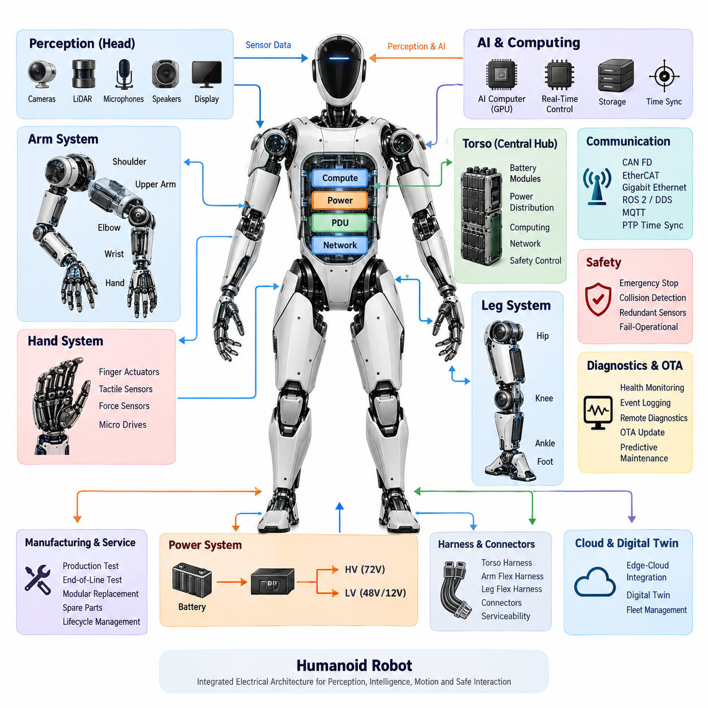
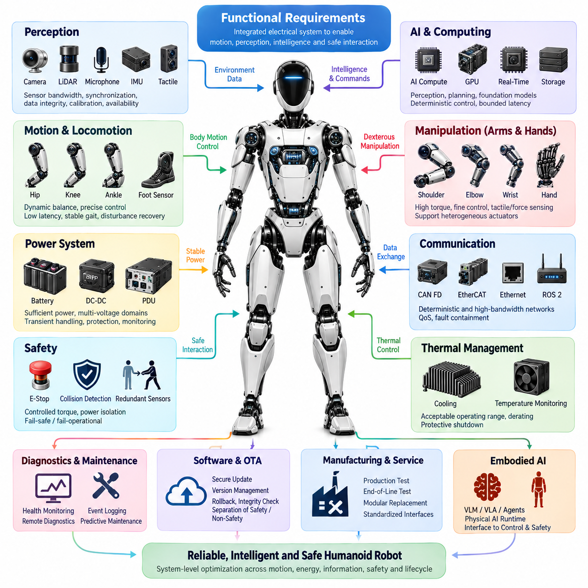
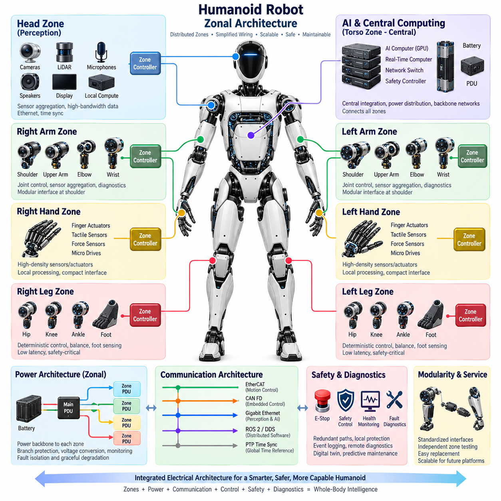
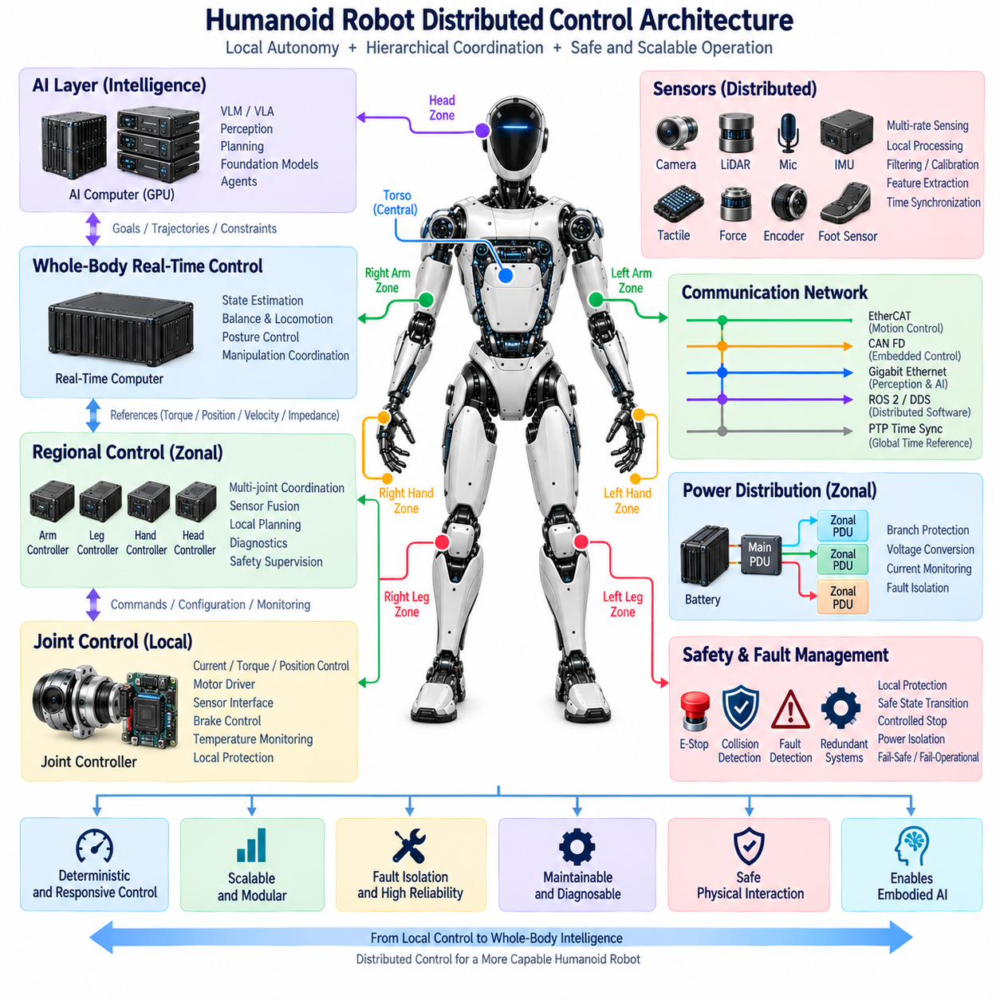
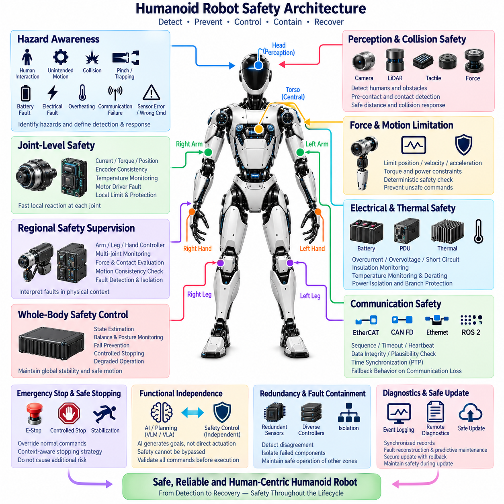

**Volume 21. Humanoid Electrical Architecture**

# Chapter 01. Humanoid Electrical Architecture Overview

## 01.01. Humanoid System Overview

{width="7.268055555555556in" height="7.268055555555556in"}

A humanoid robot is a highly integrated electromechanical system in which perception, computation, power delivery, communication, actuation, and safety must operate as one coordinated architecture. Unlike a conventional industrial robot fixed to a stable base, a humanoid continuously manages its own posture while moving multiple articulated limbs. Its electrical architecture therefore becomes a fundamental part of whole-body behavior rather than merely supporting individual actuators.

The humanoid body can be viewed as a distributed network of intelligent electrical subsystems organized around the torso, head, arms, hands, legs, and feet. Each region contains combinations of actuators, motor drives, encoders, force or torque sensors, local controllers, and communication interfaces. These distributed modules cooperate through higher-level computing and networking resources, allowing mechanical functions to be decomposed into manageable electrical and computational domains.

At the system level, the torso typically provides the natural integration point for major power, computing, networking, and safety functions. Battery modules supply the primary energy source, while power distribution hardware routes energy toward joint drives, computers, sensors, and auxiliary electronics. Different voltage domains may coexist because high-power actuators and low-power digital electronics have fundamentally different electrical requirements, protection needs, and transient characteristics.

Joint modules form the fundamental motion-producing building blocks of the humanoid. A joint may integrate an electric motor, motor driver, position encoder, torque sensing, braking capability, temperature monitoring, and local diagnostics. Instead of treating the motor as an isolated component, modern humanoid design increasingly treats the entire actuator assembly as an intelligent module capable of receiving commands, reporting state, detecting abnormal conditions, and participating in coordinated control.

The arms require coordinated electrical control across the shoulder, upper arm, elbow, wrist, and end-effector interface. These joints must provide sufficient torque while preserving smooth motion and accurate positioning. The hands impose an additional challenge because dexterous manipulation may require numerous compact finger actuators, tactile sensors, force sensors, and micro motor drives within a very small physical volume. Consequently, electrical integration density increases dramatically toward the end effectors.

The legs have even stronger real-time requirements because they directly support body weight and maintain dynamic balance. Hip, knee, and ankle modules must exchange commands and feedback with minimal and predictable latency. Foot sensing provides information about contact, load distribution, and interaction with the ground. This feedback contributes to balance control, gait generation, disturbance recovery, and safe transitions between standing, walking, turning, and other whole-body motions.

Perception extends the electrical architecture beyond motion control. Cameras, LiDAR, inertial sensing, microphones, tactile devices, and other sensors continuously produce information about the robot and its surroundings. The head is a particularly important perception zone because it may contain camera arrays, ranging sensors, microphone arrays, speakers, displays, and dedicated perception computing. Sensor placement, bandwidth, synchronization, power integrity, and thermal management therefore become system-level design concerns.

Computing is commonly separated according to timing and workload characteristics. Real-time control processors handle deterministic loops for actuators, balance, and safety-related functions, while AI computers and GPUs process perception, planning, language, multimodal models, and higher-level behaviors. This separation prevents computationally intensive AI workloads from directly compromising time-critical control. Time synchronization connects these computing domains so that sensor observations and actuator states can be interpreted within a consistent temporal reference.

Communication networks provide the nervous system connecting these distributed components. CAN FD can support robust embedded communication, while EtherCAT can serve tightly synchronized actuator and control networks. Gigabit Ethernet provides higher bandwidth for cameras, perception computers, and central computing resources, and ROS 2/DDS can support distributed software communication above the hardware transport layer. PTP-based synchronization can further establish a common timing reference across networked devices.

Harness and connector engineering becomes unusually important because humanoid wiring repeatedly bends, twists, and moves with the body. Torso harnesses can remain comparatively structured, whereas arm and leg harnesses must tolerate continuous flexing across articulated joints. Routing must consider bend radius, strain relief, electromagnetic compatibility, abrasion, connector retention, service access, and mechanical interference while minimizing unnecessary mass that would increase actuator load and energy consumption.

Safety must operate across electrical, computational, and mechanical layers because a humanoid shares physical space with people while possessing substantial stored electrical and mechanical energy. Emergency-stop functions, collision detection, redundant sensing, controlled power isolation, braking, fault containment, and fail-operational or fail-safe strategies must interact coherently. A detected fault should therefore trigger an appropriate system response rather than simply shutting down an arbitrary electronic component.

Diagnostics provide continuous visibility into this complex distributed machine. Joint temperatures, motor currents, encoder states, communication errors, battery conditions, sensor health, compute status, and power distribution faults can be monitored and logged. Remote diagnostics and digital-twin mechanisms can extend this information beyond the physical robot, while predictive maintenance can use accumulated operational data to identify degradation before it develops into an unexpected field failure.

The electrical architecture must also support manufacturing and lifecycle requirements. Production testing and end-of-line verification establish that modules operate correctly before deployment, while modular replacement reduces field-service complexity. Standardized electrical interfaces allow joints, sensors, computers, batteries, and other subsystems to be replaced or upgraded without redesigning the complete robot, making serviceability an architectural requirement rather than an afterthought.

Humanoid intelligence increasingly introduces another architectural layer above conventional perception and motion control. Vision-language models, vision-language-action models, agents, foundation models, and Physical AI runtimes can transform multimodal observations into goals and actions. These AI components must nevertheless remain connected to deterministic control and safety layers through clearly defined interfaces, ensuring that probabilistic reasoning does not bypass the mechanisms responsible for stable and safe physical execution.

A practical humanoid system is therefore best understood as a hierarchy of tightly coupled energy, information, and control flows. Power moves from batteries and distribution units toward computation, sensing, and actuation; sensor data moves toward real-time and AI computing; commands move back toward distributed joint modules; and diagnostic and safety information crosses these paths continuously. The quality of the humanoid ultimately depends on how effectively these flows remain synchronized under motion, load, faults, and environmental disturbances.

The overall design challenge is not simply to maximize actuator power or AI computing performance. A successful architecture must balance energy efficiency, deterministic control, communication bandwidth, sensor fidelity, wiring complexity, thermal limits, functional safety, maintainability, and computational capability. The resulting humanoid becomes a coordinated Physical AI platform in which electrical architecture provides the infrastructure connecting mechanical embodiment with perception, intelligence, and real-world action.

## 01.02. Functional Requirements

{width="7.268055555555556in" height="7.268055555555556in"}

A humanoid robot's functional requirements define what the complete electrical and electronic system must accomplish to support stable locomotion, dexterous manipulation, perception, intelligence, communication, safety, and maintainability. These requirements connect mechanical capabilities with power, sensing, computation, networking, and control. They must therefore be specified at system level before individual joint modules or electronic components are selected.

The primary motion requirement is coordinated control of many articulated joints distributed across the torso, arms, hands, legs, head, and other mechanisms. Each joint must receive motion commands and provide sufficiently accurate position, velocity, torque, temperature, and health information. Control latency and update timing must remain predictable because accumulated delays across multiple joints can directly affect posture, manipulation accuracy, gait stability, and whole-body coordination.

Locomotion requires the electrical architecture to maintain dynamic balance while continuously controlling the hip, knee, ankle, and supporting body joints. Foot sensing must provide reliable information about ground contact and load conditions, while inertial information supports estimation of body orientation and motion. The system must preserve synchronized feedback and actuator control during standing, walking, turning, disturbance recovery, and transitions between different movement states.

Manipulation introduces requirements that differ from locomotion. Shoulder and arm joints need relatively high torque and controlled motion, whereas wrists and hands require compact electronics, fine position control, tactile sensing, force sensing, and numerous small actuators. The electrical system must therefore support heterogeneous actuator classes within a common architecture while allowing each subsystem to operate with the bandwidth, precision, protection, and diagnostic capability appropriate to its mechanical function.

The power system must provide sufficient instantaneous and continuous energy for simultaneous operation of actuators, computers, sensors, communication devices, and auxiliary systems. Humanoid motion can produce rapidly changing electrical loads as multiple joints accelerate, decelerate, or resist external forces. Power distribution must tolerate these transients while maintaining stable voltage for sensitive electronics and preventing one overloaded or failed branch from unnecessarily disrupting unrelated functions.

Multiple voltage domains may be required to efficiently satisfy different loads. High-power joint drives can operate from a primary actuator bus, while computers, sensors, communication electronics, and control devices may require lower regulated voltages. Battery modules, DC-DC conversion, power distribution units, protection devices, and monitoring circuits must cooperate so that energy is distributed efficiently and faults can be detected and isolated before they propagate through the robot.

The perception system must provide sufficient environmental and internal-state information for autonomous operation. Camera arrays, LiDAR, microphones, inertial sensors, force sensors, tactile sensors, encoders, and other devices may operate simultaneously. Functional requirements must therefore include sensor bandwidth, sampling frequency, synchronization, data integrity, calibration support, and availability. Sensor data must reach the appropriate processing system without uncontrolled latency or loss.

Computing requirements span deterministic control and computationally intensive artificial intelligence. Real-time processors must execute joint control, balance control, safety supervision, and other timing-critical functions with bounded execution behavior. AI computers and GPUs must support perception, multimodal reasoning, planning, foundation models, and embodied intelligence. The architecture must prevent heavy AI workloads from degrading the timing guarantees required by low-level physical control.

Communication requirements must reflect the different characteristics of control and perception traffic. Networks such as CAN FD can support robust embedded communication, EtherCAT can provide deterministic communication for tightly coordinated devices, and Gigabit Ethernet can transport high-bandwidth sensor and computing data. ROS 2/DDS and related middleware can connect distributed software functions, while the underlying network architecture must maintain appropriate quality of service and fault containment.

Time synchronization is a functional requirement rather than an optional network feature. Joint states, inertial measurements, camera frames, force measurements, perception outputs, and control commands must be associated with consistent timestamps. PTP or equivalent synchronization mechanisms can establish a shared time base among distributed devices. Accurate timing enables sensor fusion, event reconstruction, coordinated control, diagnostics, and meaningful correlation between physical motion and recorded data.

Human-robot interaction creates demanding safety requirements because a humanoid can generate significant force while operating close to people. The system must support emergency stopping, collision detection, controlled torque reduction, power isolation, redundant sensing, and appropriate fail-safe or fail-operational responses. Safety functions should remain sufficiently independent from non-safety AI behavior so that an erroneous perception or high-level decision cannot disable essential protective mechanisms.

Fault management must be distributed throughout the architecture. A local joint controller should detect conditions such as excessive current, temperature, encoder inconsistency, communication loss, or abnormal motor behavior, while higher-level controllers evaluate the effect on whole-body operation. Depending on severity, the response may range from degraded operation and movement restriction to controlled stopping, joint braking, power isolation, or complete emergency shutdown.

The electrical architecture must also satisfy physical integration requirements. Harnesses and connectors must fit within narrow moving structures while surviving repeated bending, twisting, vibration, and mechanical loading. Wiring must maintain adequate current capacity, voltage-drop performance, signal integrity, electromagnetic compatibility, and insulation protection. At the same time, harness mass and routing complexity must be minimized because additional mass directly increases joint torque and energy consumption.

Thermal behavior is closely connected to electrical functionality. Motors, motor drivers, DC-DC converters, batteries, processors, GPUs, and communication devices all generate heat, often inside compact body structures with limited airflow. Functional requirements must define acceptable operating ranges, temperature monitoring, derating behavior, and protective shutdown thresholds. Thermal management must preserve performance without allowing localized overheating to reduce component lifetime or compromise safety.

Diagnostics must provide continuous visibility into the condition of the robot. Health monitoring should cover batteries, power rails, joint drives, sensors, networks, computers, and safety devices. Event logging must capture significant faults and operating conditions with synchronized timestamps. Remote diagnostics, digital-twin integration, and predictive maintenance can extend these functions across the robot lifecycle, allowing service decisions to be based on actual operational condition rather than fixed maintenance intervals.

Software and firmware maintenance introduce additional requirements for secure and controlled update mechanisms. Over-the-air update capability can reduce service effort, but updates must not leave critical controllers in an inconsistent or unusable state. Version management, compatibility checking, rollback capability, integrity verification, and separation between safety-critical and non-critical software domains are therefore important elements of a maintainable humanoid electrical platform.

Manufacturing and field service requirements must influence the architecture from the beginning. Joint modules, sensor assemblies, computers, batteries, harnesses, and power distribution components should support production testing, end-of-line verification, fault localization, and modular replacement. Standardized interfaces reduce assembly and repair complexity and allow individual subsystems to evolve without forcing a complete redesign of the humanoid platform.

The architecture must finally support the transition from conventional robotic control toward embodied AI. Vision-language models, vision-language-action models, agents, foundation models, and Physical AI runtimes require access to synchronized perception and robot-state information while producing goals or actions that can be safely translated into physical motion. Clear interfaces between AI reasoning, motion planning, real-time control, and safety supervision are therefore essential.

These functional requirements are strongly interdependent rather than independent specifications. Increasing actuator performance affects battery sizing, wiring, thermal load, and safety; adding sensors increases bandwidth, synchronization, and compute requirements; increasing AI capability affects power and cooling; and additional redundancy increases mass and integration complexity. Successful humanoid electrical architecture therefore emerges from system-level optimization across motion, energy, information, intelligence, safety, reliability, and lifecycle requirements.

## 01.03. Zonal Architecture

{width="7.268055555555556in" height="7.268055555555556in"}

A zonal architecture organizes the humanoid electrical system according to physical regions of the robot rather than assigning every sensor, actuator, and peripheral a dedicated connection to a central controller. The torso, head, arms, hands, legs, and other body regions can each form electrical zones containing local power distribution, communication interfaces, sensing electronics, and control resources. This approach aligns electrical organization with the physical structure of the humanoid.

Traditional centralized architectures can require large numbers of wires to travel from individual devices toward central electronic units. In a humanoid with many articulated joints and sensors, this creates substantial harness mass, routing complexity, connector count, and packaging difficulty. A zonal architecture reduces these long point-to-point connections by aggregating nearby electrical interfaces within local zone controllers or gateways before exchanging information with higher-level computing systems.

The torso naturally serves as the central integration zone because it can accommodate batteries, power distribution units, real-time computers, AI computers, network switches, and safety controllers. From this central region, power and high-speed communication backbones can extend toward peripheral zones. The torso zone therefore acts as the primary bridge between distributed body electronics and the system-level computing, energy, networking, and safety infrastructure.

An arm can be treated as a dedicated zone containing shoulder, upper-arm, elbow, wrist, and end-effector electronics. Local interfaces can aggregate encoder data, torque measurements, temperatures, motor-driver status, and diagnostic information while distributing control commands to individual joints. This reduces the number of independent signal wires crossing the shoulder and allows the arm assembly to become a more modular electrical subsystem.

The hand may form a specialized sub-zone because dexterous hands contain a particularly high density of small actuators and sensors. Finger actuators, tactile arrays, force sensors, micro motor drives, and local controllers can generate numerous low-level signals within a compact space. Local aggregation allows these signals to remain inside the hand where possible, while higher-level commands and processed feedback cross the wrist through a smaller standardized power and communication interface.

The leg zones require particularly deterministic behavior because the hip, knee, ankle, and foot sensing systems participate directly in balance and locomotion. A local leg controller or communication node can coordinate nearby joint interfaces while exchanging synchronized state information with the central real-time controller. The architecture must ensure that zonal partitioning does not introduce unpredictable latency into balance loops or reduce the availability of safety-critical feedback.

The head represents a perception-oriented zone containing cameras, LiDAR, microphone arrays, speakers, displays, and potentially local perception computing. Because these devices can generate high-bandwidth data, the head zone may rely more heavily on Ethernet-class communication than actuator-oriented zones. Local aggregation can reduce the number of cables passing through the neck while preserving synchronized sensor transport toward the central perception and AI computing resources.

Power distribution can follow the same zonal organization. Instead of routing separate protected power circuits from the torso to every device, a main power backbone can feed regional distribution nodes that provide branch protection, switching, voltage conversion, and current monitoring for nearby loads. High-power actuator circuits and low-voltage electronics must still remain appropriately separated, but zonal distribution can simplify harnesses and improve fault localization.

A zonal power node should monitor voltage, current, temperature, and protection status so that abnormal conditions can be identified close to their source. If a peripheral device develops an electrical fault, the affected branch or zone can potentially be isolated without unnecessarily removing power from the entire robot. This supports graceful degradation and improves diagnostic resolution while reducing the amount of protection hardware that must be concentrated within a single central PDU.

Communication architecture is a major enabler of zonal design. EtherCAT or similar deterministic networks can connect motion-control devices, CAN FD can support robust embedded interfaces, and Gigabit Ethernet can carry perception and computing traffic between zones. Gateways can bridge different network technologies where necessary, while ROS 2/DDS can provide higher-level distributed communication between computing functions. The physical network can therefore be optimized according to the traffic generated within each zone.

Time synchronization must extend across all zones because physical separation must not create separate timing domains. Joint positions, IMU measurements, foot forces, camera frames, tactile information, and control events need consistent timestamps for whole-body coordination. PTP-based synchronization or equivalent mechanisms can distribute a common time reference through the humanoid, enabling accurate sensor fusion, deterministic control coordination, event logging, and reconstruction of system behavior.

Zonal architecture also changes harness engineering. Long bundles containing many dedicated signals can be replaced by combinations of power trunks and communication backbones with shorter local branches. This is particularly valuable at moving interfaces such as shoulders, hips, necks, wrists, and ankles. Reducing conductor count through these articulation points can decrease harness diameter, bending resistance, mechanical fatigue, connector complexity, and overall robot mass.

Modularity becomes another major advantage. An arm, leg, hand, or head assembly can be designed around standardized electrical boundaries defining power, network, synchronization, diagnostics, and safety interfaces. During manufacturing or service, a complete zonal module can then be tested independently before integration. Replacement of a damaged module becomes easier because technicians can disconnect a limited number of standardized interfaces rather than rebuilding numerous individual electrical connections.

Safety functions must nevertheless remain effective across zonal boundaries. Emergency-stop commands, collision information, joint fault states, redundant sensor signals, and power-isolation requests must reach the required controllers with predictable behavior. A zone controller cannot become a single point of failure that prevents safety action. Critical signals may therefore require redundant communication paths, independent safety channels, local protective reactions, or direct hardware mechanisms depending on system risk.

Diagnostics benefit from the hierarchical nature of zonal architecture. Individual devices report local health information to their zone controller, which can aggregate status and communicate meaningful fault information to central diagnostic systems. The robot can identify whether a problem originates from a specific actuator, sensor, local network segment, power branch, or entire body zone. This hierarchy also supports remote diagnostics, event logging, digital twins, and predictive maintenance.

Local intelligence can gradually increase within each zone as processing capability becomes more compact. A zone controller may perform signal conditioning, sensor preprocessing, actuator coordination, health monitoring, or local safety supervision rather than forwarding every raw signal to the central computer. However, the division of responsibility must remain explicit so that local autonomy does not conflict with whole-body control, centralized safety policies, or system-level motion objectives.

Zonal design also provides a scalable path for future humanoid platforms. Different robot sizes or configurations can reuse common torso, arm, hand, leg, and perception-zone concepts while changing the number or capability of individual modules. New sensors or actuators can often be integrated within the relevant zone without restructuring the complete electrical system, allowing the architecture to evolve alongside improvements in actuators, AI computers, sensors, batteries, and communication technologies.

The resulting architecture combines physical zoning with distributed control and centralized coordination. Energy and high-bandwidth data move through backbone networks, local zone nodes manage nearby electrical resources, real-time computing coordinates whole-body motion, and AI computing provides perception and intelligent behavior. When these layers are carefully integrated, zonal architecture can reduce wiring complexity and mass while improving modularity, scalability, serviceability, fault isolation, and overall humanoid system integration.

## 01.04. Distributed Control

{width="7.268055555555556in" height="7.268055555555556in"}

Distributed control is a fundamental architectural principle for humanoid robots because dozens of joints, sensors, power devices, and safety functions must operate simultaneously across a physically distributed body. Instead of executing every control function on one central processor, computation is divided among joint controllers, regional controllers, real-time computers, and higher-level AI systems. Each layer performs tasks appropriate to its required latency, bandwidth, and functional responsibility.

At the lowest level, intelligent joint controllers operate close to the physical actuators. A joint controller can interface directly with the motor driver, position encoder, torque sensor, brake, temperature sensors, and current measurement circuits. Fast local loops regulate motor current, torque, velocity, or position without requiring every measurement and switching decision to travel through the entire robot network, reducing communication dependency and improving deterministic behavior.

Local control is particularly important because actuator loops generally operate much faster than high-level motion planning. Motor-current regulation and torque control may require tightly bounded execution periods, while whole-body trajectory generation can operate at a slower rate. Separating these functions allows high-frequency control to remain stable even when perception, planning, or AI workloads experience variable processing times. The resulting hierarchy isolates hard real-time behavior from computationally intensive intelligence.

Regional controllers can coordinate multiple joints belonging to a common physical subsystem such as an arm, leg, hand, or head. A leg controller, for example, may combine hip, knee, ankle, foot-force, and local inertial information before exchanging summarized states with the whole-body controller. An arm controller can similarly coordinate shoulder, elbow, wrist, and end-effector interfaces, creating an intermediate control layer between individual joints and centralized motion planning.

The whole-body real-time controller integrates these distributed regions into coordinated humanoid motion. It receives synchronized joint and sensor states, estimates the robot's dynamic condition, and generates references for balance, posture, locomotion, and manipulation. Rather than directly controlling every motor switching event, it typically sends torque, velocity, position, impedance, or trajectory references to lower-level controllers that execute the commands with deterministic local timing.

This hierarchical distribution is especially valuable during locomotion. Balance depends on rapid interaction among foot contact, joint torque, body orientation, and commanded motion. Local controllers maintain actuator stability, regional leg controllers coordinate nearby joints, and the whole-body controller manages global posture and dynamic balance. By distributing responsibilities according to timing requirements, the system can respond quickly to disturbances without forcing every calculation through one computational bottleneck.

Manipulation follows a similar principle but emphasizes precision and sensor interaction. Hand controllers may process tactile and force measurements locally while coordinating many compact finger actuators. Wrist and arm controllers can regulate force, impedance, and joint trajectories, while the central controller determines the desired end-effector motion. This separation allows dexterous manipulation to scale to many actuators without overwhelming the central control computer with every low-level sensor and motor transaction.

Distributed sensing complements distributed actuation. Encoders, torque sensors, foot sensors, tactile arrays, IMUs, cameras, and other devices produce data at different frequencies and bandwidths. Local processing nodes can perform filtering, validation, calibration compensation, aggregation, or feature extraction before forwarding information. However, safety-critical or control-critical measurements must remain available with predictable latency, so preprocessing must never obscure information required for deterministic control or fault detection.

Communication networks connect the distributed control layers and therefore become part of the control system itself. EtherCAT can provide deterministic communication for synchronized actuator networks, while CAN FD can support robust embedded control and diagnostic traffic. Gigabit Ethernet can transport high-bandwidth perception and computing data, and ROS 2/DDS can connect distributed software functions. Network selection should reflect the timing, payload, reliability, and safety requirements of each control path.

Time synchronization is essential because physically distributed controllers must behave as one coordinated system. Measurements collected at different joints or body zones need a common temporal reference before they can be combined correctly. PTP or equivalent synchronization mechanisms can align clocks across controllers and computers. Accurate timestamps support sensor fusion, state estimation, coordinated trajectory execution, event reconstruction, and analysis of causal relationships between commands and physical responses.

The control architecture must also define clear ownership of each function. If multiple controllers can independently command the same actuator without arbitration, conflicting commands can create unstable or unsafe behavior. Each control mode therefore requires explicit authority, state transitions, and command priorities. Higher-level controllers may request behaviors, while lower-level controllers enforce actuator limits and local protection, ensuring that abstraction does not eliminate essential physical constraints.

Safety supervision must remain independent enough to override normal distributed control when required. Emergency-stop signals, collision events, excessive torque, communication loss, encoder inconsistency, thermal faults, or power abnormalities may require immediate local action. A joint controller can disable or limit its actuator before waiting for a central response, while regional and system-level safety controllers coordinate broader reactions such as controlled stopping, posture stabilization, braking, or power isolation.

Fault containment is another important advantage of distributed control. Failure of one joint controller should not automatically cause uncontrolled behavior in every other subsystem. Local fault detection can identify abnormal current, temperature, sensor disagreement, or communication timeout and place the affected actuator into a defined safe state. Higher-level controllers can then determine whether the robot can continue with degraded capability, maintain posture, execute a controlled recovery, or perform a complete shutdown.

Redundancy can be introduced selectively according to functional criticality. Balance-related sensors, central real-time computing, communication paths, or safety controllers may require redundant resources, while less critical peripheral functions may tolerate temporary loss. Distributed architecture makes this selective redundancy practical because critical control paths can be protected without duplicating every component in the robot. The challenge is ensuring that redundancy management itself remains deterministic and diagnosable.

Distributed control also improves scalability. Increasing the number of fingers, adding an additional sensor array, changing an actuator module, or introducing a new body zone does not necessarily require the central computer to directly manage every new electrical interface. Local controllers can absorb device-specific complexity and expose standardized states and commands upward, allowing different humanoid configurations to share a common system-level control framework.

Diagnostics naturally follow the same hierarchy. Joint controllers monitor actuator-level conditions, regional controllers observe subsystem behavior, and central diagnostics correlate faults across the entire robot. Event logs should use synchronized timestamps so that failures can be reconstructed across multiple distributed nodes. Remote diagnostics, digital twins, and predictive maintenance can then analyze trends in motor current, joint temperature, communication quality, sensor health, and controller performance over extended operation.

Software architecture must preserve the separation between deterministic control and higher-level intelligence. AI computers may execute perception, foundation models, VLMs, VLAs, planning, and agent functions, but their outputs should normally enter the physical control hierarchy as goals, trajectories, constraints, or validated action requests. Real-time controllers translate these intentions into synchronized physical motion, while safety layers verify that commands remain within allowable operating boundaries.

The most effective distributed control architecture therefore combines local autonomy with global coordination. Joint controllers provide fast deterministic actuation, regional controllers coordinate body subsystems, whole-body computers manage balance and motion, AI computers generate intelligent behavior, and independent safety mechanisms supervise the complete hierarchy. Together, these layers allow a humanoid to achieve responsive motion and scalable intelligence without sacrificing timing determinism, fault containment, diagnostics, or safe physical interaction.

## 01.05. Safety Architecture

{width="7.268055555555556in" height="7.268055555555556in"}

Safety architecture in a humanoid robot must protect people, the robot, and the surrounding environment while preserving controlled behavior during faults. Because a humanoid combines powerful actuators, stored electrical energy, articulated mechanisms, autonomous decision making, and close human interaction, safety cannot be implemented as a single emergency function. It must be distributed across electrical, mechanical, computational, communication, and software layers.

The safety architecture begins with hazard awareness at the system level. Potential hazards include unintended joint motion, excessive torque, loss of balance, collision, trapping or pinching, battery faults, electrical shorts, overheating, communication failures, sensor errors, and incorrect control commands. Each hazard must be associated with detection mechanisms and defined responses so that the robot transitions toward a controlled condition rather than producing unpredictable physical behavior.

Emergency stop is one of the most fundamental protective functions. An emergency-stop request must be able to override normal motion commands and initiate a predefined safe response independently of high-level AI behavior. Depending on the robot state, immediately removing actuator power may not always be the safest action because an unsupported humanoid could collapse. The architecture must therefore distinguish emergency intervention from uncontrolled power removal and coordinate stopping, braking, and stabilization.

Safe stopping can require several different strategies according to the operating condition. A robot standing normally may first reduce joint torque and move toward a stable posture, whereas a severe electrical fault may require rapid power isolation. During manipulation, a controlled stop may need to prevent a carried object from being released unexpectedly. Safety behavior must therefore consider the physical state of the complete robot rather than applying one identical shutdown sequence to every event.

Joint-level protection forms the first distributed safety layer. Intelligent joint controllers can monitor motor current, torque, velocity, position, encoder consistency, temperature, communication status, and motor-driver faults. When local limits are exceeded, the controller can restrict torque, stop motion, activate braking, or disable the drive. Local reaction reduces dependence on network latency and prevents every abnormal actuator condition from waiting for a central computer decision.

Regional safety supervision extends protection across related joints. Arm, hand, or leg controllers can evaluate whether individual joint behavior remains consistent with the expected motion of the subsystem. A leg controller can detect conditions that threaten support or balance, while an arm controller can identify abnormal forces during manipulation. Regional supervision allows faults to be interpreted in physical context before they propagate into whole-body instability.

Whole-body safety control evaluates the combined condition of the humanoid. Joint states, foot forces, inertial measurements, contact information, actuator availability, and motion commands can be used to determine whether balance and posture remain recoverable. If a joint or sensor becomes unavailable, the controller must determine whether continued operation is possible, whether movement should be restricted, or whether a controlled transition to a stable state is required.

Collision safety is especially important because humanoids are intended to operate in environments designed for people. Perception sensors can identify obstacles and humans before contact, while torque sensors, motor-current estimation, tactile sensing, and force sensors can detect unexpected physical interaction. These mechanisms provide complementary protective layers because external perception may fail to identify every contact and contact sensing alone cannot provide sufficient preventive distance.

Force and torque limitation must be enforced close to the physical control layer. High-level planning or AI systems may request movements, but local and real-time controllers should ensure that actuator commands remain within permitted position, velocity, acceleration, torque, and power boundaries. Software-generated motion should therefore pass through deterministic constraint enforcement before reaching the motor drives, preventing an erroneous high-level command from directly becoming unrestricted physical force.

Functional independence between AI and safety control is essential. Vision-language models, vision-language-action models, foundation models, planners, and agents can generate goals and actions, but they should not have unrestricted authority to disable safety limits or directly bypass protected control paths. AI outputs should be treated as requested behavior that must be validated by motion-control and safety layers before execution in the physical environment.

Communication safety is necessary because distributed controllers depend on continuous information exchange. Lost messages, excessive latency, corrupted data, duplicated commands, synchronization errors, or network partitioning can produce unsafe states if they are not detected. Control interfaces should therefore use mechanisms such as sequence monitoring, timeout supervision, plausibility checks, heartbeat messages, error detection, and defined fallback behavior when communication quality becomes unacceptable.

Time synchronization contributes directly to safety because state information from different parts of the robot must represent a consistent physical instant. Joint positions, IMU measurements, foot forces, camera observations, and safety events can become misleading if timestamps differ significantly. A synchronized time base allows controllers to correlate motion and sensor events correctly, while synchronization faults themselves should be detectable when timing accuracy falls outside acceptable limits.

Electrical safety must manage the substantial energy stored in the battery and delivered to the actuators. The power architecture should detect overcurrent, overvoltage, undervoltage, short circuits, insulation problems, abnormal temperature, and other electrical faults. Protection devices and power distribution units must isolate affected branches when necessary while preventing a local failure from unnecessarily disabling healthy regions unless the system-level hazard requires complete shutdown.

Thermal protection is closely connected to electrical and motion safety. Motors, motor drives, batteries, processors, GPUs, and power converters can experience increasing temperature under sustained load. Temperature monitoring should support warning thresholds, performance derating, torque limitation, workload reduction, and protective shutdown. Progressive intervention is preferable where possible because it allows the robot to reach a safe condition before thermal limits require abrupt removal of functionality.

Redundancy should be applied according to the consequences of failure rather than uniformly duplicating every component. Critical balance sensors, safety controllers, communication paths, or state-estimation inputs may require redundant or diverse information sources. The architecture must detect disagreement between redundant channels and determine which information remains trustworthy. Redundancy is effective only when common-cause failures and the logic used to manage disagreement are also considered.

Fault containment prevents a localized failure from propagating through the complete humanoid. A failed sensor, joint controller, network segment, or power branch should be isolated where practical while unaffected subsystems remain controlled. This requires clear electrical and software boundaries between zones and control domains. Zonal architecture can support containment by allowing individual body regions to detect, report, and isolate faults while maintaining communication with central safety supervision.

Graceful degradation can be preferable to immediate total shutdown when sufficient safety capability remains available. Loss of a noncritical sensor may allow operation at reduced speed, while failure of an arm joint may require manipulation to stop without necessarily disabling all computing functions. However, degradation must follow predefined safety rules. The system should never continue operation merely because some functionality remains if the remaining configuration cannot maintain a demonstrably controlled state.

Diagnostics and event logging provide evidence for understanding safety-related behavior. Fault codes, joint states, power conditions, temperatures, network status, safety commands, and controller transitions should be recorded with synchronized timestamps. These records support fault reconstruction, validation, field maintenance, and improvement of safety mechanisms. Remote diagnostics and digital-twin systems can further correlate recurring abnormalities across operating hours and robot populations.

Safety must also be maintained during software and firmware updates. A corrupted or incomplete update must not leave safety-critical controllers in an undefined state. Secure update mechanisms should provide integrity checking, version compatibility management, controlled activation, rollback capability, and separation between critical and noncritical software domains. Safety functions should remain available or enter a predefined protected state whenever an update cannot be completed correctly.

The complete safety architecture therefore forms an independent but deeply integrated hierarchy surrounding normal humanoid operation. Local joint protection reacts to immediate actuator faults, regional supervision interprets subsystem behavior, whole-body safety maintains posture and stability, electrical protection controls stored energy, and system-level mechanisms coordinate emergency responses. AI and autonomous functions operate inside these boundaries rather than replacing them.

A well-designed humanoid safety architecture ultimately converts faults and uncertainty into predictable physical responses. Detection, validation, containment, controlled stopping, power isolation, redundancy, diagnostics, and recovery must work together across the distributed robot. The objective is not simply to stop motion whenever an anomaly appears, but to ensure that every credible failure leads toward the safest achievable state while preserving controllability, diagnosability, and protection of nearby people.
