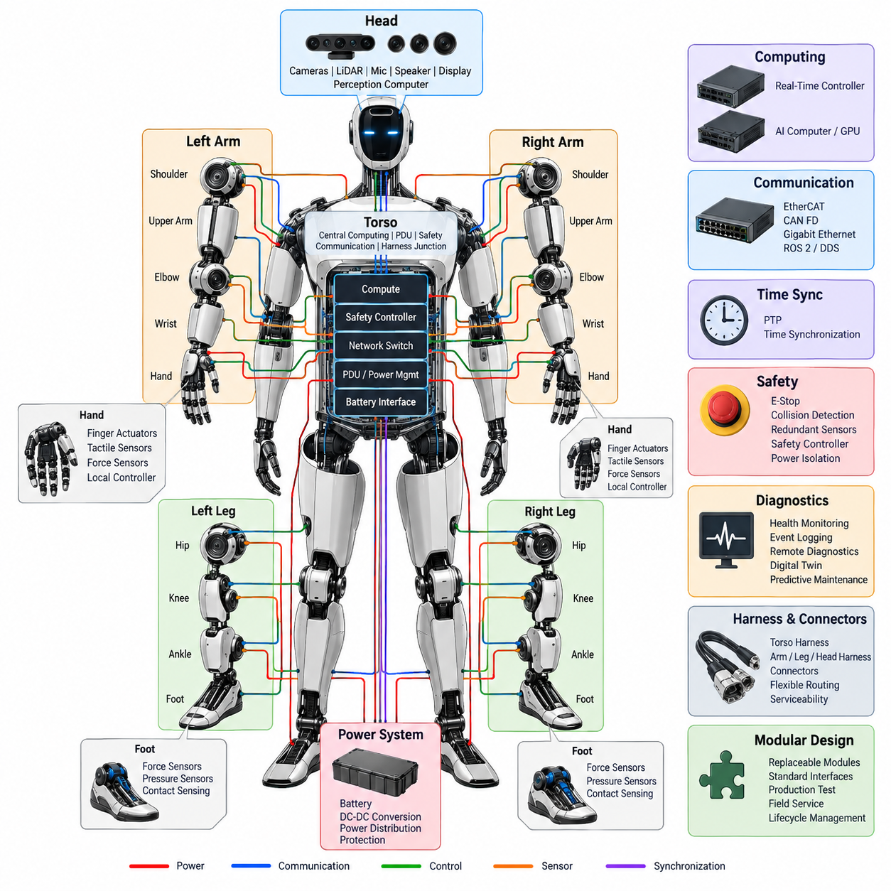
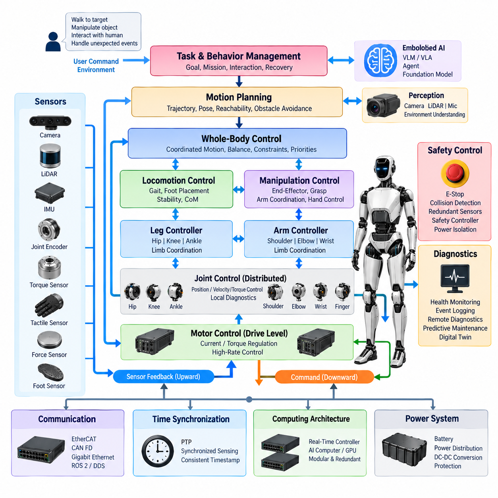
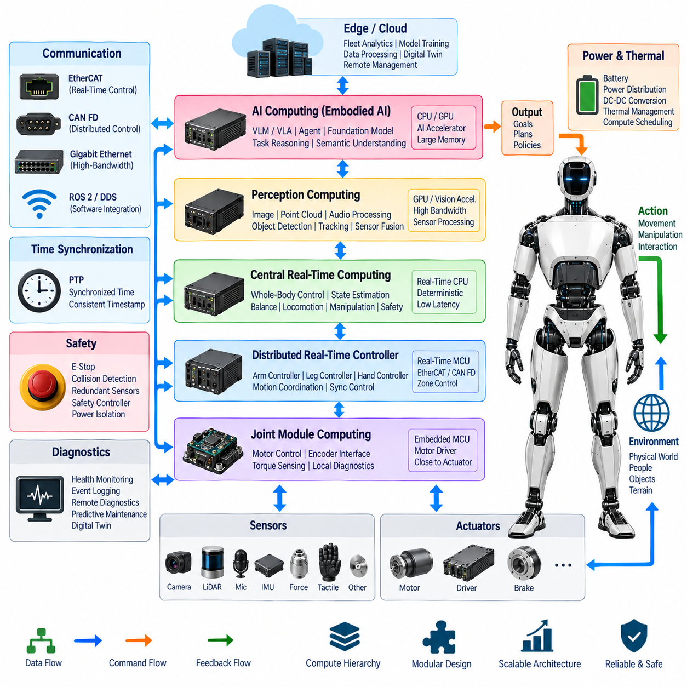
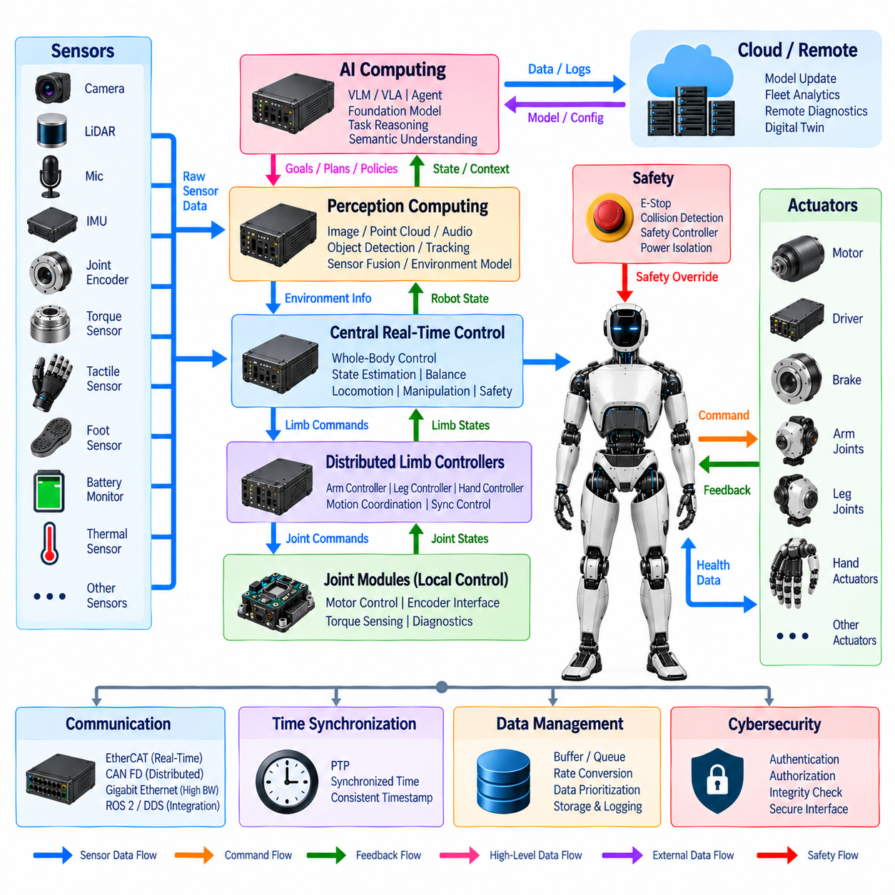
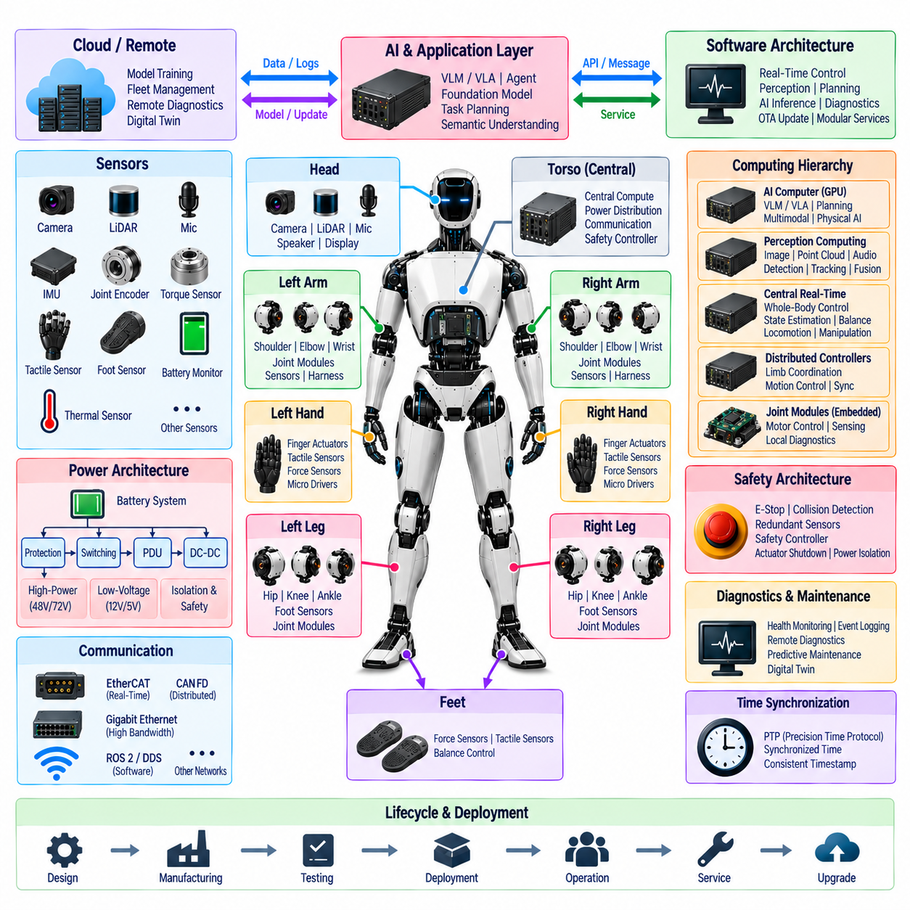

**Volume 21. Humanoid Electrical Architecture**

# Chapter 02. System Level Architecture

## 02.01. Body Block Diagram

{width="7.268055555555556in" height="7.268055555555556in"}

A humanoid body block diagram represents the robot as a coordinated electrical and computational system rather than a collection of independent mechanical limbs. At system level, the torso normally forms the architectural center, connecting the head, two arms, two hands, two legs, power subsystem, safety functions, and computing resources. This organization provides a clear basis for defining power, control, communication, and diagnostic boundaries.

The torso is the primary integration zone because it can accommodate the battery interface, power distribution unit, central computing hardware, communication switches, safety controller, and major harness junctions. Locating these functions near the body center reduces unnecessary cable length and provides relatively balanced routing toward the upper and lower extremities while supporting modular assembly and service access.

At the highest level, the body can be divided into central, upper-body, and lower-body electrical domains. The central domain contains system management and shared infrastructure, while the upper-body domain connects the head, shoulders, arms, wrists, and hands. The lower-body domain connects the hips, knees, ankles, and feet, with each domain exchanging commands, feedback, power, synchronization, and health information.

The head block concentrates perception and human-interaction devices. Cameras, LiDAR, microphone arrays, speakers, displays, and associated perception electronics connect to the central compute system through high-bandwidth communication links. Because perception data can be substantially larger than joint-control traffic, the head interface must distinguish high-rate sensor streams from deterministic control, diagnostic, and synchronization channels.

Each arm can be represented as a hierarchical chain of shoulder, upper-arm, elbow, wrist, and end-effector blocks. Electrical power and communication are distributed along this chain while local joint electronics operate motors, read encoders and torque sensors, and report status. The arm architecture should preserve modular interfaces so that individual joints or complete limb assemblies can be isolated, replaced, calibrated, and diagnosed without redesigning the central system.

The hand forms a particularly dense electrical endpoint because many small actuators and sensors must operate within a restricted volume. Finger actuators, micro-motor drives, tactile sensors, force sensors, and local control electronics can therefore be grouped into a hand subsystem connected through the wrist. Local aggregation reduces the number of individual signals that must traverse the arm and simplifies the flex-harness interface.

Each leg is similarly organized around hip, knee, ankle, and foot blocks, but its electrical architecture must emphasize high actuator power, balance-critical feedback, and dependable real-time communication. Joint position, velocity, torque, inertial information, and foot-contact measurements contribute directly to locomotion stability. Consequently, interruption of a leg-control path can have immediate system-level safety consequences.

The foot block provides the physical interface between the humanoid and the ground and therefore supplies information that cannot be obtained reliably from joint encoders alone. Force, pressure, contact, and related sensing can identify load distribution and support conditions. These measurements flow toward balance and locomotion controllers, where they are combined with inertial and joint-state information to estimate the robot\'s dynamic state.

Power distribution forms a parallel structure across the entire body diagram. Energy from the battery system passes through protection and distribution stages before reaching joint drives, computers, sensors, communication equipment, and auxiliary loads. The architecture may contain separate voltage domains and DC-DC conversion stages so that high-power actuators and sensitive low-voltage electronics can coexist without sharing inappropriate electrical characteristics.

The system-level body diagram should explicitly separate power flow from information flow even when both travel through physically adjacent harnesses. Power paths are designed according to current, voltage drop, protection, thermal loading, and fault isolation, whereas communication paths are governed by bandwidth, latency, determinism, electromagnetic compatibility, and topology. Maintaining this distinction prevents the physical harness layout from obscuring functional architecture.

Communication links connect distributed body modules into a coordinated machine. Deterministic networks such as EtherCAT can support tightly synchronized motion control, while CAN FD can serve distributed control and diagnostic functions and Gigabit Ethernet can transport high-bandwidth perception and computing traffic. ROS 2 and DDS can operate at higher software layers, allowing application-level information exchange across computing resources.

The computing block is naturally divided according to timing and workload characteristics. Real-time controllers execute deterministic servo, balance, and safety-related functions, whereas AI computers and GPUs process perception, planning, language, vision, and embodied-intelligence workloads. Separating these responsibilities prevents variable AI execution latency from directly controlling timing-critical actuator loops while still allowing intelligent behaviors to influence motion through defined interfaces.

Time synchronization provides another system-wide connection that should be visible conceptually in the body architecture. Cameras, inertial sensors, joint controllers, force sensors, and computing nodes generate measurements at different physical locations and rates. A common time reference, potentially distributed using PTP and related synchronization mechanisms, allows these measurements to be correlated accurately for sensor fusion, state estimation, diagnostics, and event reconstruction.

Safety architecture overlays the normal control hierarchy rather than existing as a single peripheral block. Emergency-stop inputs, collision detection, redundant sensors, actuator shutdown mechanisms, safety controllers, and power isolation paths must be able to place the humanoid into an appropriate safe state. Safety communication and shutdown authority therefore require carefully defined relationships with both central computing and distributed joint electronics.

Diagnostics form a second supervisory layer across the body. Joint modules, batteries, power converters, sensors, network interfaces, and computers continuously generate health information that can be aggregated by central monitoring functions. Event logging, remote diagnostics, digital-twin information, and predictive-maintenance data can then use a common system model, enabling failures to be traced from a visible body symptom to the responsible electrical or software component.

Harness architecture converts the logical body blocks into physical connections. Torso harnesses act as central distribution structures, while arm, leg, and head harnesses extend toward moving subsystems. Repeated bending, torsion, joint rotation, vibration, and maintenance cycles make flexible routing especially important in humanoids. Connector placement must consequently balance electrical performance with motion range, mechanical protection, assembly sequence, and serviceability.

A modular body block architecture also establishes practical replacement boundaries. A shoulder, elbow, wrist, hand, hip, knee, ankle, head, compute module, or power module can be treated as a replaceable subsystem when its power, network, synchronization, safety, and diagnostic interfaces are standardized. This approach connects system architecture directly with production testing, end-of-line validation, field service, spare-parts management, and lifecycle engineering.

The resulting body architecture is therefore best understood as several overlapping networks mapped onto one humanoid structure. Mechanical anatomy defines the physical zones, power architecture supplies energy, communication architecture carries information, computing architecture provides intelligence and control, synchronization establishes temporal consistency, and safety and diagnostics supervise every layer. Their integration transforms distributed body modules into one coordinated electromechanical system.

## 02.02. Control Hierarchy

{width="7.268055555555556in" height="7.268055555555556in"}

A humanoid control hierarchy organizes behavior from high-level goals down to deterministic actuator commands while preserving clear timing, safety, and responsibility boundaries. Higher layers decide what the robot should accomplish, intermediate layers convert intentions into coordinated whole-body motion, and lower layers execute precise joint control. This layered structure prevents complex AI reasoning from directly interfering with time-critical motor loops.

At the highest control level, task and behavior management interprets objectives such as walking to a location, manipulating an object, maintaining interaction with a person, or recovering from an unexpected condition. Commands at this level describe desired outcomes rather than individual motor values. The behavior layer therefore operates with semantic information, environmental context, mission state, and constraints supplied by perception and safety functions.

Embodied AI functions can contribute to this upper hierarchy through vision-language models, vision-language-action models, agents, and foundation models. These components interpret scenes, instructions, objects, and human intentions and can generate task-level actions or behavioral policies. Their outputs must pass through controlled interfaces so that probabilistic AI decisions remain separated from deterministic motion execution and safety-critical control.

Below task management, a motion planning layer converts behavioral objectives into physically achievable trajectories. It considers the desired body pose, walking direction, manipulation target, obstacle relationships, reachability, and movement constraints. Instead of controlling motors directly, this layer produces references for body position, orientation, end-effector motion, joint configuration, or locomotion trajectories that lower control layers can execute.

Whole-body control coordinates the many degrees of freedom of a humanoid as one dynamically coupled system. Arm movement can alter balance, torso orientation can influence reachability, and leg motion changes the support condition of the entire body. The controller therefore distributes motion objectives across the torso, arms, and legs while respecting joint limits, contact constraints, stability requirements, actuator capability, and priorities among simultaneous tasks.

Locomotion control occupies a critical intermediate position because bipedal motion requires continuous coordination between trajectory generation and balance stabilization. Desired walking velocity or destination is transformed into foot placement, support transitions, center-of-mass behavior, and joint references. Feedback from the feet, joints, and inertial sensors allows the controller to adapt these references as the actual robot deviates from the planned motion.

Balance control operates with tighter timing requirements than general behavior planning. Measurements from inertial sensors, joint encoders, torque sensors, and foot force or contact sensors are combined to estimate body orientation, support state, and dynamic motion. Corrective commands are then distributed to the hip, knee, ankle, torso, and potentially arm controllers to maintain stability during standing, walking, manipulation, or external disturbances.

Manipulation control forms another intermediate branch of the hierarchy. A task such as grasping an object is progressively converted from an object-level goal into an end-effector trajectory, arm configuration, wrist pose, and finally joint commands. Dexterous hand control can further decompose a grasp into finger positions, contact forces, and local actuator commands while tactile and force feedback provide information about the physical interaction.

At the limb level, arm and leg controllers coordinate groups of joints belonging to a common mechanical subsystem. An arm controller can synchronize shoulder, elbow, and wrist motion, while a leg controller coordinates hip, knee, and ankle behavior. This organization reduces the complexity presented to whole-body control and provides natural interfaces for subsystem diagnostics, calibration, replacement, and independent functional testing.

Joint control represents the distributed real-time layer closest to physical motion. Each joint module may contain a motor driver, encoder interface, torque sensing, brake control, local diagnostics, and associated control electronics. Position, velocity, or torque references received from higher layers are converted into motor commands while measured joint states are returned as feedback, forming closed control loops with deterministic execution requirements.

The innermost motor-control loops operate at the shortest control periods and should remain independent of variable high-level computing latency. Current or torque regulation is typically executed close to the motor drive, while position and velocity loops may be implemented locally or in tightly synchronized real-time controllers. This proximity reduces communication delay and allows the actuator to respond rapidly to disturbances, load changes, and commanded transitions.

The control hierarchy is therefore also a timing hierarchy. AI reasoning and task planning can operate at relatively low or variable update rates, motion planning and whole-body control require faster periodic execution, and servo control requires highly deterministic high-rate operation. Designing the architecture around these different temporal requirements prevents a delayed perception or AI process from destabilizing a motor-control loop.

Communication architecture supports these control boundaries by matching network characteristics to control requirements. EtherCAT can provide deterministic communication for synchronized actuator and motion-control functions, while CAN FD can support distributed control and diagnostics. Gigabit Ethernet can transport high-volume perception and computing data, and ROS 2 with DDS can connect higher-level software components and distributed computing resources.

Time synchronization is essential because hierarchical control depends on measurements originating from many distributed devices. Joint encoders, torque sensors, cameras, inertial sensors, foot sensors, and controllers must associate data with a consistent temporal reference. PTP-based synchronization can support correlation between sensing and computation, improving state estimation, sensor fusion, event analysis, and coordinated control across distributed processors.

Feedback flows upward through the hierarchy while commands generally flow downward. Joint states are aggregated into limb states, limb and sensor information contribute to whole-body state estimation, and interpreted body and environment states support planning and AI reasoning. This bidirectional structure creates a continuous perception-action loop in which every control level receives information appropriate to its abstraction and timing requirements.

Safety control must have authority across the hierarchy rather than being subordinate to ordinary task execution. Collision detection, emergency-stop functions, redundant sensing, and safety controllers can restrict or override commanded motion when unsafe conditions occur. Depending on fault severity, the response may range from limiting velocity or torque to stopping selected joints, disabling actuators, or isolating power through defined safety mechanisms.

Control degradation is also important for a humanoid because not every failure should necessarily produce the same response. Loss of a noncritical perception function may allow restricted operation, whereas loss of balance-critical sensing or joint communication can require immediate stabilization or shutdown. A well-defined hierarchy assigns fault reactions to appropriate levels so that local faults are contained whenever possible without compromising system-level safety.

Diagnostics operate alongside control at every level. Local joint electronics report actuator temperature, current, encoder status, communication condition, and other health information, while central monitoring correlates these observations with system behavior. Event logging and remote diagnostics can preserve the sequence of commands, measurements, warnings, and faults, providing the information required to reconstruct failures and support predictive maintenance.

The hierarchy should also preserve modularity between computing resources. Real-time control hardware can remain responsible for deterministic motion and safety-related execution, while AI computers and GPUs handle perception, planning, language, and embodied intelligence. Defined interfaces between these compute domains allow either side to evolve without forcing the complete control system to be redesigned, while compute redundancy can protect selected critical functions.

Ultimately, the humanoid control hierarchy forms a continuous chain from intention to physical force. Task intelligence determines desired behavior, planning converts behavior into feasible motion, whole-body and limb controllers coordinate the mechanical structure, joint controllers generate precise actuator references, and motor drives create torque. Sensor feedback travels in the opposite direction, allowing every layer to compare desired behavior with the evolving physical state.

This hierarchical organization transforms the humanoid from a collection of independently controlled joints into a coordinated embodied system. It combines AI-level intelligence, motion planning, real-time control, distributed actuation, synchronized sensing, safety supervision, and diagnostics without assigning all responsibilities to a single computer. The result is an architecture that can scale in joint count and computational complexity while retaining deterministic control and modular engineering boundaries.

## 02.03. AI Compute Hierarchy

{width="7.268055555555556in" height="7.268055555555556in"}

A humanoid AI compute hierarchy separates computational responsibilities according to latency, determinism, bandwidth, safety criticality, and model complexity. Rather than executing every function on one processor, the architecture distributes workloads across joint electronics, real-time controllers, perception computers, AI accelerators, and higher-level computing resources. This separation allows intelligent behavior to coexist with stable and predictable physical control.

At the lowest computing level, embedded processors located inside or near joint modules execute functions that must remain close to the actuator. These processors can acquire encoder and torque measurements, supervise motor-driver status, execute local control loops, and perform basic diagnostics. Their computational workload is relatively narrow, but predictable timing and reliable communication are more important than large AI processing capability.

Above the joint level, distributed real-time controllers coordinate groups of actuators belonging to arms, legs, hands, or other body zones. They receive motion references from higher layers and transform them into synchronized joint commands while collecting feedback from multiple local devices. This layer provides a deterministic boundary between physical actuation and computationally intensive perception, planning, and AI functions.

A central real-time computing layer can coordinate whole-body motion, balance, locomotion, manipulation, and safety-related state management. It combines joint states, inertial measurements, force information, and other time-sensitive signals to estimate the physical state of the humanoid. Because instability can develop rapidly, these workloads require bounded execution time and should not depend on variable-latency AI inference.

The perception computing layer processes high-bandwidth sensor streams generated by cameras, LiDAR, microphones, and other environmental sensors located primarily in the head and body. Image processing, point-cloud processing, audio processing, object detection, tracking, depth estimation, and sensor fusion can be performed here. Dedicated acceleration may be used because perception workloads often require substantially greater throughput than conventional embedded control.

GPU-based AI computing occupies a higher-performance tier within the hierarchy. GPUs can execute deep neural networks for visual perception, multimodal understanding, semantic mapping, pose estimation, learned manipulation, and other data-intensive workloads. Unlike deterministic servo controllers, this tier is optimized for parallel numerical computation and model inference, allowing large learned models to operate without consuming resources reserved for real-time control.

The AI computer can host vision-language models(VLM), vision-language-action models(VLA), agents, and foundation-model components used for embodied intelligence. These models can interpret human instructions, connect visual observations with semantic concepts, reason about tasks, and propose actions. Their outputs represent goals, plans, or policies and should normally be passed to validated motion and control layers rather than directly commanding actuator currents or torques.

This separation creates an important boundary between semantic intelligence and physical execution. AI computing answers questions such as what object should be manipulated, where the robot should move, or which task should be performed next. Real-time computing determines how those intentions can be executed while respecting balance, joint limits, contact conditions, actuator capability, and safety constraints.

Intermediate planning computers bridge these two domains by converting AI-generated objectives into structured robot actions. Motion planners can calculate collision-free trajectories, manipulation sequences, grasp poses, foot placements, and whole-body configurations. The resulting references are more physically constrained than semantic AI outputs but remain above the deterministic servo layer, creating a controlled transition from reasoning to movement.

The hierarchy also reflects differences in data representation. Joint controllers operate mainly on compact numerical signals such as current, torque, position, and velocity. Whole-body controllers work with states, poses, forces, contacts, and trajectories. Perception and AI computers process images, point clouds, audio, feature embeddings, language tokens, semantic maps, and learned representations, causing bandwidth and memory requirements to increase significantly toward the AI layers.

Communication networks must therefore be matched to each compute tier. EtherCAT can support deterministic exchange between real-time controllers and actuator modules, while CAN FD can provide distributed control and diagnostic communication. Gigabit Ethernet can carry high-volume sensor and computing traffic, and ROS 2 with DDS can connect software components across heterogeneous processors while maintaining defined interfaces between computational domains.

Time synchronization connects otherwise independent computing layers into a coherent physical system. Sensor frames, IMU measurements, joint states, torque values, and control events must be associated with consistent timestamps before they can be fused correctly. PTP-based synchronization can distribute a common time reference across networked processors, supporting accurate state estimation, perception fusion, event reconstruction, and coordinated execution.

Memory architecture becomes increasingly important as computation moves upward through the hierarchy. Embedded controllers require relatively small deterministic working memory, whereas perception pipelines need buffers for continuous sensor streams. GPU and foundation-model workloads require substantially larger memory capacity for model parameters, intermediate activations, context, maps, and multimodal data, making memory bandwidth and data movement major architectural considerations.

The computing hierarchy should minimize unnecessary movement of high-volume data. Raw camera or LiDAR streams can be processed close to the perception computer, with compact features, objects, maps, or state estimates forwarded to other layers when appropriate. Similarly, high-frequency motor feedback should remain within deterministic control domains unless higher layers require it, reducing network congestion and preventing central processors from becoming data bottlenecks.

Safety functions require a computing path that remains effective even when AI workloads fail, stall, or produce invalid results. Emergency-stop handling, critical collision responses, actuator shutdown, and selected stabilization functions should therefore remain within trusted real-time or dedicated safety computing domains. The AI tier can provide useful contextual information, but it should not become the sole authority for immediate safety-critical reactions.

Compute redundancy can protect functions whose loss would prevent controlled operation. Redundant controllers, health monitoring, watchdog mechanisms, failover logic, and independent communication paths can be applied according to system criticality. Redundancy does not require every AI accelerator to be duplicated; instead, the architecture identifies which control, perception, state-estimation, or safety functions must survive a particular processor or communication failure.

Diagnostics span every compute level and provide visibility into processor load, memory usage, temperature, communication status, timing violations, accelerator utilization, software faults, and sensor-processing health. Central health monitoring can correlate these observations with robot behavior, while event logging preserves the sequence of failures and control responses. Such information supports remote diagnostics, digital twins, and predictive maintenance.

Thermal and electrical design are closely connected to compute hierarchy because high-performance AI processors and GPUs can become significant power consumers. Real-time embedded controllers generally require modest power, whereas perception and AI accelerators can demand much larger electrical and cooling capacity. Power distribution, DC-DC conversion, thermal monitoring, and compute scheduling should therefore be considered together when allocating workloads across the humanoid.

Edge-cloud integration extends the hierarchy beyond the physical robot. Onboard computing must retain the functions required for immediate perception, control, safety, and autonomous operation, while remote servers or cloud resources can support fleet analytics, model management, large-scale training, data processing, digital-twin services, and selected non-real-time inference. Loss of connectivity should not remove the robot\'s essential ability to remain safe.

Software architecture should preserve the same boundaries established by hardware. Real-time control tasks, perception pipelines, AI inference services, planning modules, diagnostics, and cloud interfaces should communicate through explicit APIs and message definitions rather than hidden dependencies. This modular approach allows GPU platforms, AI models, real-time controllers, or communication technologies to evolve independently while maintaining stable system interfaces.

As humanoid intelligence grows, the AI compute hierarchy may become more heterogeneous rather than simply larger. CPUs, GPUs, neural accelerators, microcontrollers, safety processors, and specialized sensor-processing devices can each execute workloads suited to their characteristics. The engineering objective is not maximum computation at every level, but placement of each workload where its timing, power, memory, bandwidth, reliability, and safety requirements can be satisfied.

Ultimately, the humanoid AI compute hierarchy forms a progression from physical interaction to semantic intelligence. Embedded processors control actuators, real-time computers coordinate the body, perception computers transform sensor streams into environmental representations, AI accelerators interpret those representations, and embodied AI systems generate goals and actions. Communication, synchronization, safety, diagnostics, redundancy, and edge-cloud integration connect these tiers into one scalable computing architecture.

## 02.04. Data Flow Architecture

{width="7.268055555555556in" height="7.268055555555556in"}

A humanoid data flow architecture defines how information moves from distributed sensors and actuators through real-time control, perception, AI computing, diagnostics, and external systems. The architecture must support very different traffic classes without allowing high-volume perception data to interfere with deterministic motion control. Data paths are therefore organized according to bandwidth, latency, timing, reliability, and safety requirements.

At the physical edge of the system, joint encoders, torque sensors, foot sensors, tactile sensors, IMUs, cameras, LiDAR, microphones, battery monitors, and thermal sensors continuously generate raw measurements. These sources differ greatly in rate and format. Joint feedback consists mainly of compact numerical values, while cameras and LiDAR generate large streams that require substantially greater bandwidth and processing capacity.

Actuator data forms a tightly coupled bidirectional flow. Higher control layers transmit position, velocity, torque, or current references toward joint modules, while motor drivers and local controllers return measured position, velocity, torque, current, temperature, fault status, and operating state. Because these signals directly influence physical stability and motion, their communication paths require predictable latency and deterministic update behavior.

Local joint electronics perform the first stage of data reduction and validation. Raw encoder measurements, motor currents, torque signals, and device status can be filtered, checked, timestamped, and converted into standardized joint-state information before transmission. Keeping high-frequency processing close to the actuator reduces unnecessary network traffic and allows local control loops to continue without depending on variable-latency central computing.

Distributed limb controllers aggregate data from multiple joints within an arm, leg, or hand. Individual joint states can be transformed into limb-level information describing configuration, motion, load, and health. Commands flow in the opposite direction as limb references are decomposed into synchronized joint commands. This aggregation establishes a scalable interface between many distributed actuators and central whole-body control.

The central real-time control domain receives synchronized joint, IMU, force, and contact information to construct a continuously updated estimate of the humanoid\'s physical state. Whole-body control, balance, locomotion, and manipulation functions consume this state and generate new motion references. The resulting data loop must remain deterministic because delayed or inconsistent state information can directly degrade stability and control performance.

Perception data follows a different path because cameras, LiDAR, microphones, and related sensors produce substantially larger datasets. Raw streams are normally directed toward dedicated perception computing resources where image processing, point-cloud processing, audio analysis, object detection, tracking, depth estimation, and sensor fusion are performed. Processed representations can then be forwarded instead of repeatedly distributing all raw sensor data.

The perception layer transforms sensor-centric data into environment-centric information. Pixels, depth values, point clouds, and audio samples become objects, poses, obstacles, people, semantic labels, spatial maps, and other structured representations. This transformation reduces the amount of information that higher reasoning layers must interpret and provides AI and planning functions with data expressed at a more useful level of abstraction.

AI computing consumes perception outputs together with robot state, task context, human instructions, and stored knowledge. Vision-language models(VLM), vision-language-action models(VLA), agents, and foundation-model components can use these inputs to infer semantic relationships and propose goals, plans, or policies. Their outputs move downward toward planning and control through defined interfaces rather than being converted directly into motor-drive commands.

The downward command path progressively changes data abstraction. A human instruction may first become a task objective, then a behavioral plan, motion trajectory, whole-body reference, limb command, joint reference, and finally a motor-control value. Each stage adds physical constraints and removes ambiguity, allowing high-level semantic intent to be transformed into deterministic commands that can be safely executed by distributed actuators.

The upward feedback path performs the complementary transformation. Electrical measurements and joint states become limb states, body states, contact estimates, and health information. Perception streams become environmental representations, while diagnostic observations become system-health states. Higher layers therefore receive summarized information appropriate to their decisions rather than being forced to process every low-level electrical signal generated throughout the robot.

Different communication technologies can support these distinct data flows. EtherCAT can carry deterministic actuator and synchronization traffic, while CAN FD can support distributed control and diagnostic messages. Gigabit Ethernet can transport high-bandwidth perception and computing data, and ROS 2 with DDS can exchange structured messages among higher-level software components distributed across heterogeneous computing resources.

Time information must accompany data throughout the architecture. Measurements from cameras, IMUs, joint encoders, torque sensors, and foot sensors are useful for fusion only when their acquisition times are known consistently. PTP-based time synchronization can distribute a common temporal reference, allowing sensor frames, control events, and computed states to be correlated even when they originate from physically separated processors and networks.

Data buffering is required whenever producers and consumers operate at different rates. High-speed cameras may generate frames faster than an AI model consumes them, while joint controllers may execute many cycles during a single planning update. Buffers, queues, rate conversion, and controlled sampling allow these domains to interact without forcing every subsystem to operate at the same frequency, but excessive buffering must be avoided where latency is critical.

Data prioritization prevents noncritical traffic from degrading physical control. Servo commands, balance-related feedback, synchronization information, and safety messages require higher timing assurance than map uploads, diagnostic histories, model files, or general telemetry. Network segmentation, traffic classes, scheduling, and bandwidth allocation can therefore preserve deterministic paths even while the humanoid processes large perception and AI workloads.

Safety data forms an independent supervisory flow across the normal command hierarchy. Emergency-stop states, collision information, redundant sensor results, actuator faults, and safety-controller decisions must reach the appropriate control and power functions with bounded latency. Safety commands may override ordinary motion data, limit torque or velocity, disable selected actuators, or initiate power isolation when the system enters an unsafe condition.

Diagnostic data moves both locally and centrally. Joint modules, motor drivers, sensors, network interfaces, batteries, computers, and power electronics generate temperatures, currents, voltages, communication errors, timing violations, software events, and fault codes. Central health monitoring can correlate these observations with robot behavior, while event logging preserves historical information for troubleshooting and failure reconstruction.

The same diagnostic flow can support remote diagnostics, digital twins, and predictive maintenance. Instead of transmitting every raw signal continuously, the robot can aggregate health indicators, events, statistics, and selected time-series data. This approach reduces external bandwidth while preserving information needed to identify degradation trends, compare physical behavior with digital models, and schedule maintenance before functional failure occurs.

Data ownership and interface definition are important because many processors may require related information. A single authoritative source should ideally produce each critical state, while other modules consume it through defined messages or APIs. Clear ownership prevents conflicting state estimates and hidden dependencies, while standardized interfaces allow joint modules, perception computers, AI accelerators, or control processors to be replaced without redesigning the entire system.

Edge-cloud communication extends selected data flows beyond the humanoid. Onboard systems can transmit fleet telemetry, diagnostic summaries, selected sensor records, maps, and operational statistics to remote infrastructure. Cloud or server resources can return model updates, mission information, configuration data, and non-real-time analysis results. Immediate motion, balance, and safety control must remain operational even when this external connection is unavailable.

Cybersecurity and integrity mechanisms should protect data as it crosses computational and network boundaries. Control commands, software updates, configuration parameters, diagnostic access, and remote interfaces must be distinguished from ordinary sensor traffic and handled according to their potential system impact. Authentication, authorization, integrity checking, and controlled interfaces help prevent corrupted or unauthorized information from propagating into physical control.

The architecture should also manage storage according to the value and lifetime of information. High-rate raw sensor streams may be retained only temporarily, while safety events, diagnostic logs, calibration parameters, software versions, and significant operational records may require longer persistence. Selective recording reduces storage demand while ensuring that important events can later be reconstructed for engineering analysis, validation, maintenance, or lifecycle management.

Ultimately, humanoid data flow is not a single network stream but a coordinated set of upward, downward, lateral, and external information paths. Sensor feedback moves upward, commands move downward, peer controllers exchange synchronized states laterally, and selected operational data moves toward edge or cloud resources. Communication, timing, safety, diagnostics, buffering, prioritization, and interface management allow these flows to coexist without losing determinism.

A well-structured data flow architecture therefore connects physical sensing, distributed actuation, real-time control, perception, AI reasoning, diagnostics, and remote computing as one continuous information system. By matching each data class to appropriate processing, communication, synchronization, and reliability mechanisms, the humanoid can transform raw physical measurements into intelligent decisions and convert those decisions back into safe, coordinated physical action.

## 02.05. Reference Architecture

{width="7.268055555555556in" height="7.268055555555556in"}

A humanoid reference architecture provides a reusable system blueprint that connects the body structure, power distribution, computing hierarchy, communication networks, sensing, actuation, safety, and software into one coherent engineering framework. Rather than defining a single fixed implementation, it establishes functional boundaries and standardized interfaces that can be adapted to humanoids with different sizes, joint counts, performance targets, and application requirements.

At the physical level, the humanoid is organized around the torso, head, two arms, two hands, two legs, and feet. The torso serves as the primary integration zone for central computing, power distribution, communication infrastructure, and safety functions. Each limb is treated as a modular subsystem containing distributed joint modules, sensors, local electronics, and harness connections, creating clear mechanical and electrical integration boundaries.

The reference power architecture begins with the battery system and distributes energy through protection, switching, power distribution units, and DC-DC conversion stages. High-power actuator domains are separated from sensitive low-voltage electronics while maintaining controlled grounding and protection strategies. Different implementations may use 48 V, 72 V, or other distribution levels, but the architectural principle remains hierarchical, protected, observable, and serviceable power delivery.

Joint modules form the fundamental electromechanical building blocks of the reference architecture. Each module can integrate a motor, motor driver, encoder interface, torque sensing, brake function, local controller, communication interface, and diagnostic capability. Standardizing these interfaces allows shoulder, elbow, wrist, hip, knee, ankle, and other joints to share common architectural principles even when their mechanical dimensions and actuator ratings differ.

The arm architecture organizes shoulder, upper-arm, elbow, wrist, and end-effector interfaces into a coordinated electrical chain. The leg architecture similarly connects hip, knee, ankle, foot sensing, and balance-control interfaces. Hands introduce dense networks of finger actuators, tactile sensors, force sensing, and micro-motor drives, while the head concentrates cameras, LiDAR, microphones, speakers, displays, and perception-related electronics.

The computing architecture separates deterministic physical control from computationally intensive perception and AI workloads. Embedded joint processors execute local actuator functions, distributed controllers coordinate limbs, and central real-time computers perform whole-body control, balance, locomotion, manipulation, and state estimation. AI computers and GPUs operate above this deterministic domain to execute perception, planning, multimodal reasoning, and embodied-intelligence workloads.

This compute separation creates a controlled path from intelligence to physical action. AI systems can determine goals, interpret environments, and propose actions, while motion planners convert those intentions into feasible trajectories. Whole-body and limb controllers then impose dynamic, kinematic, contact, and stability constraints before joint controllers transform the resulting references into motor commands. Sensor feedback closes the hierarchy in the opposite direction.

The reference architecture can incorporate vision-language models(VLM), vision-language-action models(VLA), agents, multi-agent coordination, foundation models, and a physical AI runtime within the higher computing layers. These functions provide semantic understanding and adaptive behavior without replacing deterministic control. Explicit interfaces ensure that learned or probabilistic outputs are validated and constrained before they influence physical actuators.

Perception architecture provides the environmental information required by both conventional control and embodied AI. Cameras, LiDAR, microphones, IMUs, joint encoders, torque sensors, tactile sensors, and foot sensors generate complementary observations. Dedicated perception computing transforms high-volume raw streams into objects, poses, contacts, maps, environmental representations, and state estimates that can be consumed efficiently by planning and AI layers.

Communication architecture connects these distributed resources according to their timing and bandwidth requirements. EtherCAT can support deterministic actuator and motion-control communication, CAN FD can serve distributed control and diagnostics, and Gigabit Ethernet can transport perception and computing data. ROS 2 and DDS provide higher-level software communication, allowing modular services to exchange structured information across heterogeneous processors.

A common time base connects sensing, computing, and control into one temporally coherent system. PTP-based time synchronization can distribute consistent timestamps across cameras, inertial sensors, joint controllers, force sensors, perception computers, and real-time processors. Accurate temporal correlation improves sensor fusion, state estimation, coordinated motion, diagnostic reconstruction, and analysis of events that propagate across multiple subsystems.

The data flow architecture follows the same functional boundaries. Raw measurements move from sensors toward local processing and perception, state information flows upward toward planning and AI, and goals are progressively transformed into trajectories, limb commands, joint references, and motor-control values. High-volume sensor streams are processed near their consumers whenever practical, preventing unnecessary data movement through central networks.

Safety architecture overlays every functional domain rather than operating as an isolated subsystem. Emergency-stop functions, collision detection, redundant sensing, safety controllers, actuator shutdown, and power isolation must retain authority over ordinary control commands. Safety-critical responses should remain available independently of high-level AI execution so that a stalled, overloaded, disconnected, or erroneous AI process cannot eliminate essential protective behavior.

Fail-operational and degraded-operation concepts can be applied according to subsystem criticality. Loss of a nonessential interface may permit continued operation with reduced capability, while failures affecting balance, critical communication, actuator control, or safety sensing can trigger stabilization or controlled shutdown. Redundant sensors, compute resources, communication paths, and monitoring mechanisms can protect functions whose loss would create unacceptable system risk.

Diagnostics provide continuous observability across the architecture. Joint modules, sensors, motor drivers, batteries, power converters, networks, real-time computers, and AI processors report health and operating information to monitoring functions. Event logging, remote diagnostics, digital twins, and predictive maintenance can use these data to reconstruct failures, identify degradation, and connect field observations with specific hardware or software components.

Harness and connector engineering translates the logical architecture into the physical body. A central torso harness distributes power and communication toward the head and limbs, while flexible arm and leg harnesses accommodate repeated joint motion. Connector boundaries should correspond wherever practical to modular replacement boundaries, enabling limbs, joints, sensors, computers, or power modules to be disconnected without extensive body disassembly.

Serviceability is therefore designed into the reference architecture rather than added after development. Standardized electrical, mechanical, communication, diagnostic, and software interfaces allow modules to be tested independently and replaced systematically. Production testing, end-of-line testing, field service, modular replacement, spare-parts strategy, and lifecycle management can use the same subsystem boundaries established during initial system design.

Software architecture mirrors the modularity of the electrical system. Real-time control, perception, AI inference, motion planning, diagnostics, OTA update, health monitoring, and external communication are separated into defined functional services. Stable APIs, message definitions, version management, and controlled dependencies allow individual software or hardware components to evolve without requiring complete redesign of the humanoid platform.

Edge-cloud integration extends selected parts of the reference architecture beyond the robot. The humanoid retains onboard perception, control, safety, and autonomous functions required for immediate operation, while external computing can support model training, fleet analytics, software distribution, remote diagnostics, digital twins, and long-term data processing. Essential physical control remains independent of network availability.

Manufacturing considerations reinforce the need for architectural standardization. Reusable joint modules, consistent connector families, standardized harness interfaces, common communication protocols, and defined diagnostic services reduce unnecessary variation across the body. The same principles can support multiple humanoid models by changing actuator capacity, sensor configuration, compute performance, or limb geometry while preserving the overall system structure.

The reference architecture also establishes a foundation for systematic verification. Power domains can be tested independently, communication interfaces can be validated for timing and bandwidth, joint modules can undergo functional and reliability testing, and safety mechanisms can be verified through fault injection and controlled failure scenarios. Integrated testing can then confirm that interactions among subsystems satisfy system-level requirements.

Ultimately, the humanoid reference architecture is a layered integration framework rather than a single block diagram. Body zones define physical modularity, power architecture supplies protected energy, communication and synchronization connect distributed devices, computing layers transform sensing into intelligence, and control layers convert intelligence into motion. Safety, diagnostics, serviceability, and lifecycle management supervise and sustain the complete system.

By preserving explicit boundaries between high-power actuation, deterministic control, perception, AI reasoning, safety, and external computing, the reference architecture provides a scalable foundation for future humanoids. New sensors, processors, AI models, joint technologies, communication protocols, and software services can be introduced within defined interfaces, allowing the platform to evolve while retaining coherent electrical and system-level engineering principles.
