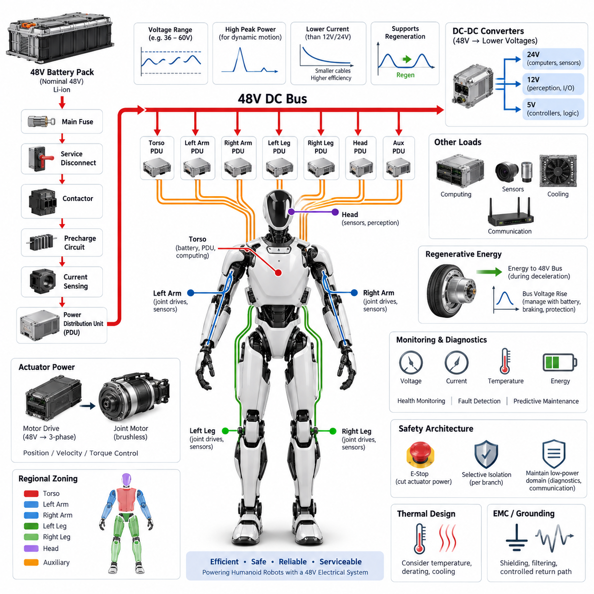
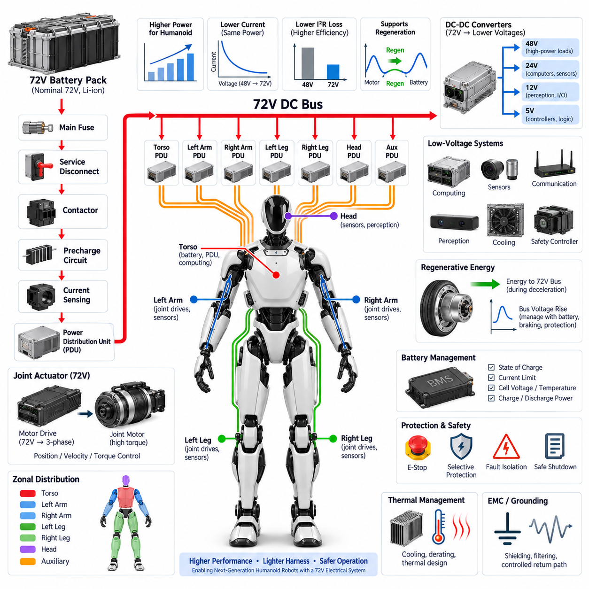
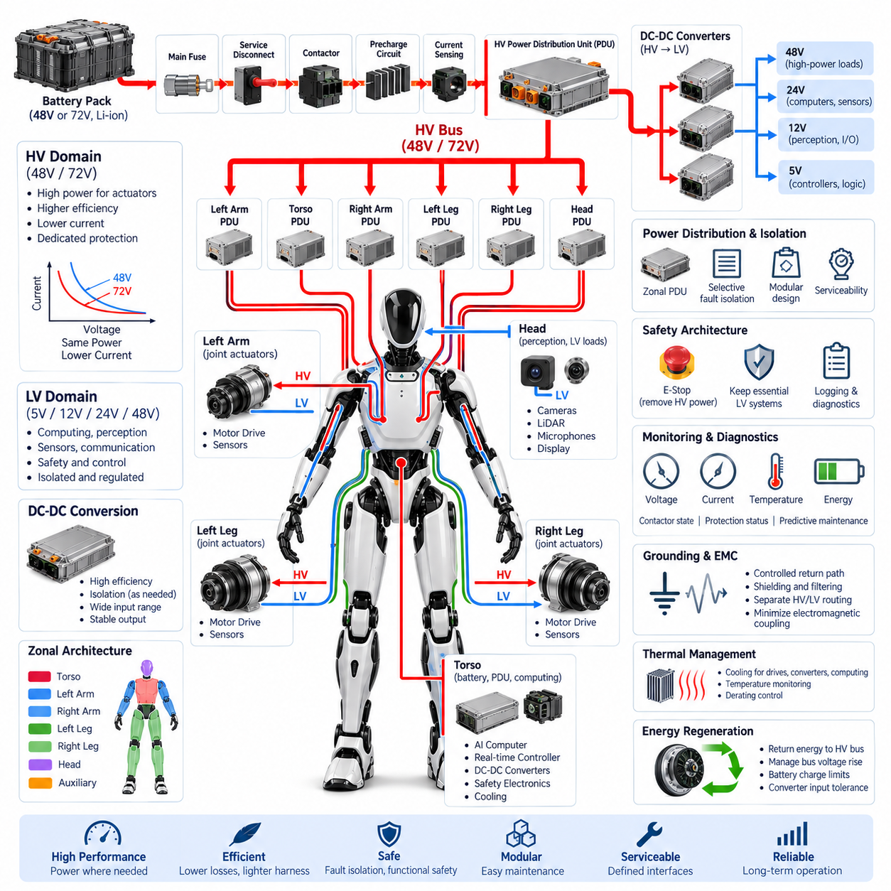
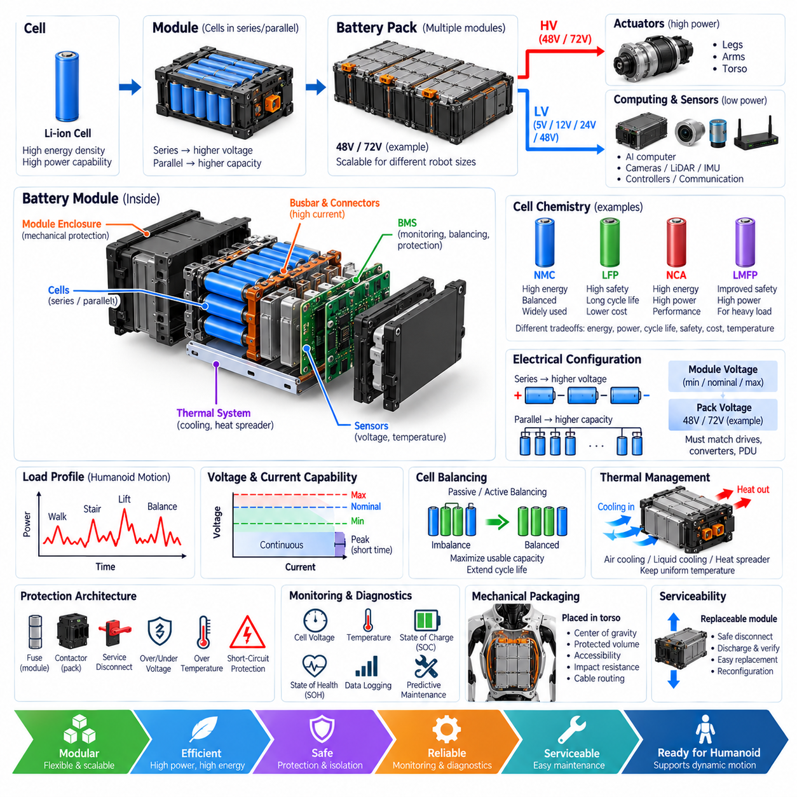
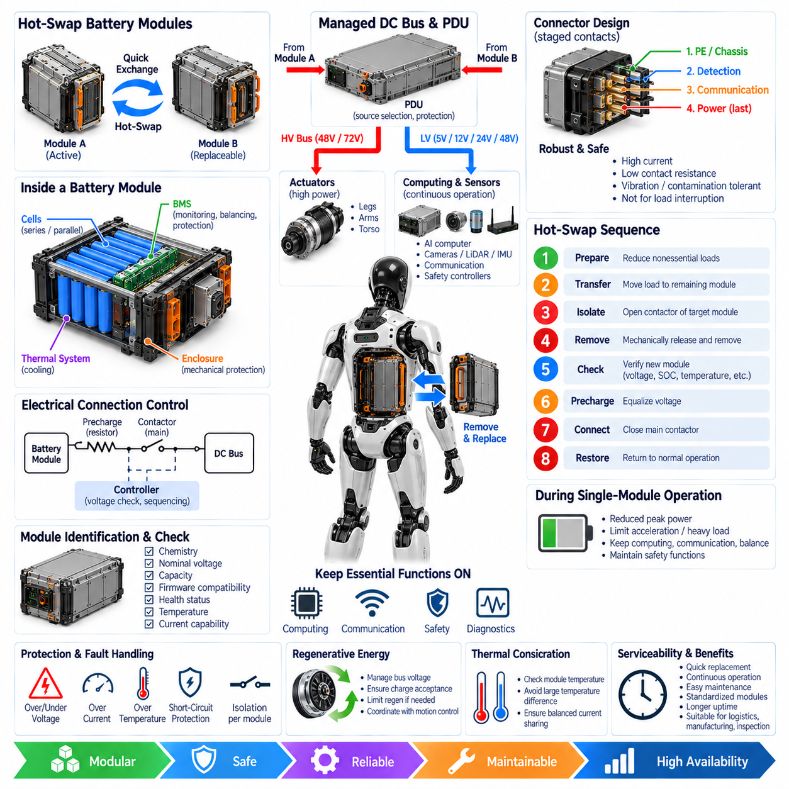
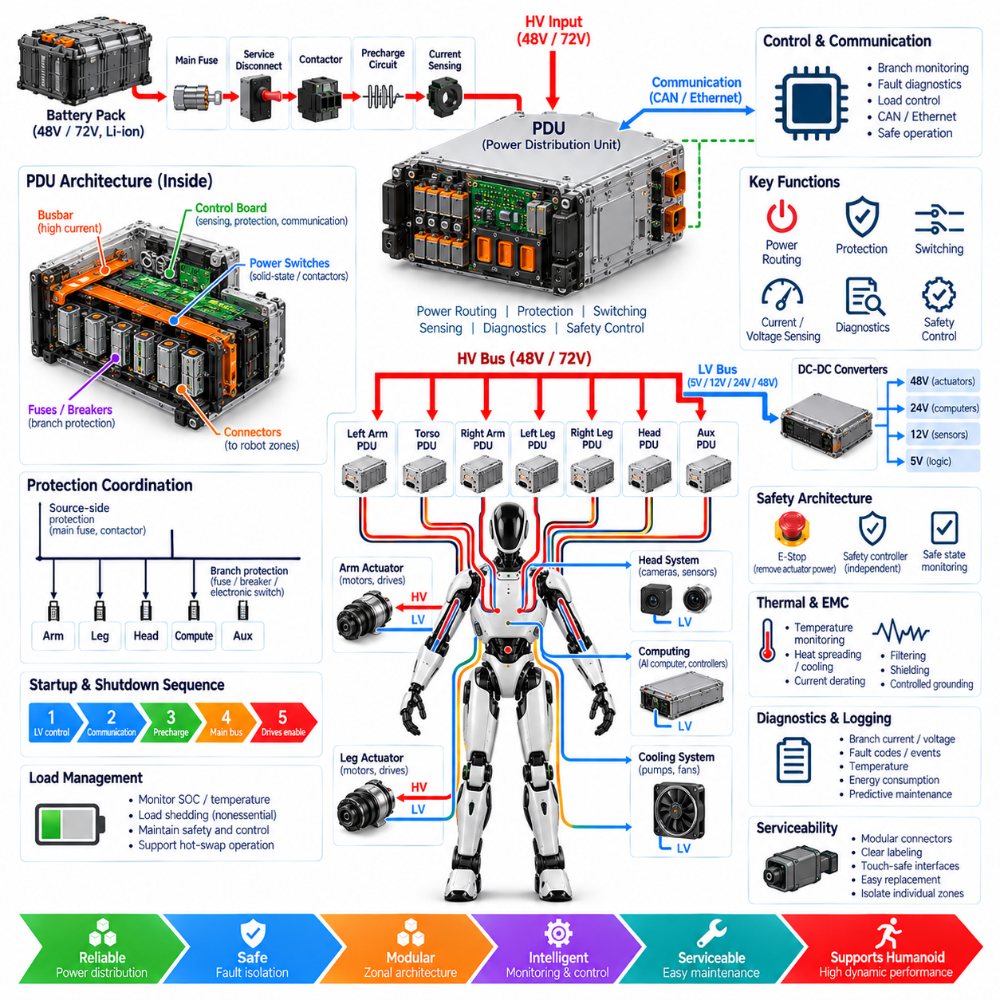

**Volume 21. Humanoid Electrical Architecture**

# Chapter 03. Power Architecture

## 03.01. 48V System

{width="7.268055555555556in" height="7.268055555555556in"}

A 48 V electrical system provides a practical power backbone for humanoid robots because it balances actuator power capability, conductor size, conversion efficiency, and electrical safety. Compared with conventional 12 V or 24 V architectures, the higher distribution voltage reduces current for the same mechanical power demand, allowing lighter harnesses and lower resistive losses while remaining suitable for compact mobile robotic platforms.

Humanoid power demand is fundamentally different from that of many stationary robots because dozens of joints may accelerate simultaneously during walking, lifting, recovery, or dynamic manipulation. Hip, knee, ankle, shoulder, and torso actuators can create short high-power transients that greatly exceed average consumption. A 48 V bus therefore must be designed around both continuous energy flow and rapid peak-current delivery rather than nominal power alone.

The battery pack normally forms the primary energy source of the 48 V domain and supplies a central power distribution path through protection and switching devices. Battery voltage varies with chemistry, state of charge, load, temperature, and operating condition, so "48 V" represents a nominal system class rather than an invariant voltage. Motor drives and downstream converters must tolerate the complete specified operating range and transient envelope.

A typical architecture routes battery energy through a main fuse, isolation or service disconnect, contactor stage, precharge circuit, current sensing, and a power distribution unit. From this central path, protected branches feed actuator groups, computing equipment, perception electronics, cooling systems, and auxiliary converters. This organization supports selective isolation of faults while preventing a single branch failure from unnecessarily disabling every electrical function.

Precharge is particularly important when the 48 V bus supplies multiple motor inverters containing large DC-link capacitors. Direct connection can produce severe inrush current, contactor arcing, connector stress, and unwanted voltage disturbances. A controlled precharge path gradually charges distributed capacitance before the main contactor closes, while voltage monitoring confirms that the bus has reached an acceptable threshold before full-power operation begins.

The actuator network usually represents the dominant load on the 48 V system. Joint motor drivers convert DC-bus energy into controlled phase currents for brushless motors, while local controllers regulate position, velocity, torque, or impedance. High-power joints may receive dedicated protected branches, whereas smaller joints can share regional feeds. This arrangement enables the electrical architecture to follow the humanoid body\'s physical structure.

Regional power distribution can divide the robot into torso, left arm, right arm, left leg, right leg, head, and auxiliary zones. The torso may contain the battery, primary PDU, safety switching, and high-level computing, while local distribution modules serve individual limbs. Such zoning reduces long high-current cable runs and simplifies assembly, diagnostics, modular replacement, and harness routing through mechanically constrained articulated structures.

Voltage drop becomes critical because humanoid harnesses pass through narrow joints and moving structures where conductor diameter and bend radius are restricted. The design must consider peak current, cable resistance, connector resistance, temperature rise, allowable voltage sag, and repetitive flexing simultaneously. Excessive voltage drop can reduce actuator torque capability or trigger undervoltage protection precisely when several joints demand maximum dynamic output.

The 48 V domain should be separated logically from lower-voltage electronics even when both ultimately receive energy from the same battery. Isolated or non-isolated DC-DC converters can generate regulated 24 V, 12 V, 5 V, or other rails required by computers, sensors, communication devices, encoders, and control electronics. This prevents sensitive electronics from being directly exposed to large disturbances generated by high-current electromechanical loads.

Regenerative energy must also be considered because humanoid joints frequently decelerate loads or absorb mechanical energy during walking and balance control. Motor drives can return this energy to the DC bus, causing bus voltage to rise if the battery or other loads cannot absorb it quickly enough. Battery charge acceptance, inverter limits, bus capacitance, braking strategies, and overvoltage protection therefore form part of the complete 48 V power design.

Grounding and electromagnetic compatibility are closely coupled to the power architecture. Rapid switching in motor inverters creates common-mode and differential-mode noise that can interfere with encoders, cameras, IMUs, force sensors, Ethernet, and real-time communication networks. Controlled return paths, appropriate shielding, filtering, chassis bonding, connector design, and physical separation between noisy power circuits and sensitive signal circuits are therefore essential.

Protection should be coordinated at several levels rather than relying on a single main fuse. The battery branch protects against catastrophic source faults, the PDU protects major distribution paths, and local protection can isolate individual actuator or auxiliary circuits. Electronic current monitoring adds diagnostic visibility and may permit faster controlled shutdown. Protection thresholds must tolerate normal acceleration peaks without allowing sustained fault energy to damage wiring or electronics.

Power monitoring provides information not only for electrical protection but also for robot-level intelligence. Measurements of pack voltage, branch current, converter status, temperature, insulation or leakage conditions where applicable, and accumulated energy can be shared with supervisory controllers. The robot can then estimate remaining operating time, identify abnormal actuator consumption, reduce performance under thermal stress, and schedule charging or maintenance before availability is compromised.

Functional safety requires the 48 V architecture to support controlled removal or limitation of actuator energy without unnecessarily destroying perception, diagnostics, or communication capability. An emergency condition may require torque-producing branches to be disabled while a protected low-power domain remains active for logging and fault reporting. The exact partition depends on the safety concept, but power-domain boundaries should be defined together with control and communication boundaries.

Mechanical integration strongly influences electrical reliability because the power system operates inside a continuously moving structure. Connectors and cables must withstand vibration, repetitive bending, joint motion, shock loads, and maintenance cycles. Limb interfaces should permit module replacement without disturbing unrelated harness sections. Polarization, locking mechanisms, strain relief, touch protection, and service disconnect provisions help prevent assembly errors and unintended energization.

Thermal design is equally important because battery cells, contactors, converters, connectors, conductors, and motor drives all generate heat. Current ratings established under laboratory conditions may not remain valid inside enclosed torso or limb structures with limited airflow. Electrical derating should therefore reflect ambient temperature, duty cycle, neighboring heat sources, cooling architecture, and worst-case motion profiles rather than relying only on component nameplate ratings.

A robust 48 V humanoid architecture ultimately operates as an energy-management network rather than a simple battery-and-wire system. Battery management, power distribution, joint drives, DC-DC conversion, safety control, diagnostics, thermal supervision, and regenerative-energy handling must cooperate across the entire body. This integrated approach allows the robot to deliver high transient mechanical power while maintaining efficiency, fault containment, serviceability, and predictable system behavior.

## 03.02. 72V System

{width="7.268055555555556in" height="7.268055555555556in"}

A 72 V electrical system extends the power capability of a humanoid robot beyond the range typically associated with 48 V architectures. By increasing the distribution voltage, the system can deliver greater mechanical power without requiring a proportional increase in current. This is especially valuable for large humanoids whose leg, hip, torso, and arm actuators must generate high torque while maintaining acceptable cable mass and thermal performance.

The principal electrical advantage of 72 V distribution is reduced current for a given power level. Because conductor losses are proportional to the square of current, increasing bus voltage can significantly reduce resistive heating in cables, connectors, contactors, and distribution devices. Lower current can also permit smaller conductor cross sections, helping reduce harness weight in robots where electrical wiring extends through the torso and multiple articulated limbs.

A nominal 72 V battery does not operate at exactly 72 V throughout its usable state of charge. Actual bus voltage depends on cell chemistry, series cell count, charging limits, discharge state, temperature, and instantaneous load. Consequently, every component connected to the primary bus must be selected according to the maximum possible operating and transient voltage rather than simply according to the nominal 72 V designation.

The battery interface normally includes a main fuse, service disconnect, contactors, precharge circuitry, current sensing, and a power distribution unit. These elements create a controlled boundary between stored battery energy and the robot\'s distributed electrical loads. The architecture must support safe startup, normal operation, fault isolation, controlled shutdown, maintenance, and emergency power removal while minimizing unnecessary interruption of unaffected subsystems.

Precharge becomes increasingly important as bus voltage and installed inverter capacity increase. Joint motor drives contain DC-link capacitors that appear as a low-impedance load when initially discharged. Connecting them directly to a 72 V battery can generate substantial inrush current. A precharge resistor and controlled switching path gradually raise the downstream bus voltage before the main contactor closes, reducing electrical and mechanical stress on power components.

High-power joint actuators are natural candidates for direct operation from the 72 V domain. Hip, knee, ankle, shoulder, and torso drives can benefit from the higher voltage because motor drivers obtain greater voltage headroom for controlling phase current at higher motor speeds. This can improve the usable torque-speed envelope while reducing the DC-side current required to transmit the corresponding electrical power through the robot.

The advantages of 72 V become particularly relevant during dynamic whole-body motion. Walking acceleration, stair climbing, lifting, jumping, disturbance recovery, or carrying payloads can require several major joints to produce high power simultaneously. The distribution architecture must therefore be sized for correlated load peaks rather than assuming that each actuator reaches maximum demand independently or that average battery power adequately represents instantaneous requirements.

Regional distribution remains useful even with a higher-voltage backbone. A central PDU can distribute protected 72 V branches toward the torso, arms, and legs, while regional distribution modules provide shorter connections to local motor drives. This zonal approach limits long high-current paths, simplifies harness routing, improves fault localization, and allows limb modules to be electrically disconnected or replaced without extensively disturbing the rest of the humanoid.

A 72 V architecture also requires careful voltage-domain partitioning. High-power actuators may operate directly from the main bus, while perception, communication, computing, control, and auxiliary electronics generally require lower regulated voltages. DC-DC converters can therefore derive 48 V, 24 V, 12 V, 5 V, or other required rails while providing filtering and, where necessary, galvanic isolation between power domains.

DC-DC conversion must accommodate the full battery voltage range and the transient environment produced by motor operation. Converter selection should consider efficiency, continuous and peak output power, startup behavior, thermal limits, input filtering, fault response, and electromagnetic compatibility. Critical low-voltage electronics may also require independent protection or energy hold-up so that short disturbances on the actuator bus do not immediately reset computing or safety controllers.

Regenerative operation can produce significant electrical stress on a 72 V bus. During joint deceleration, descending motion, or energy absorption for balance control, motor drives may return energy to the common DC link. If the battery cannot accept the regenerative power, bus voltage can rise rapidly. The architecture must coordinate battery charge limits, inverter control, bus capacitance, regenerative torque limitation, and optional braking or energy-dissipation mechanisms.

Battery management therefore becomes tightly coupled with whole-body motion control. The BMS should provide information such as state of charge, current limits, temperature, cell voltage conditions, and allowable charging or discharging power. A supervisory controller can use these limits to constrain actuator behavior before electrical protection is triggered, allowing the robot to reduce acceleration, payload capability, or regenerative braking intensity in a controlled manner.

Protection coordination is essential because a 72 V source can deliver substantial fault energy. The main battery protection should address severe source-side faults, while the PDU provides selective protection for major branches and local devices protect individual loads. Fuse ratings, electronic circuit protection, contactor interrupt capability, connector ratings, conductor ampacity, and fault-current characteristics must be evaluated as an integrated protection system rather than independently.

Voltage drop remains important even though higher voltage reduces distribution current. Dynamic actuator loads can still create rapid bus disturbances through cable impedance, connector resistance, battery impedance, and shared distribution paths. Excessive local voltage sag may cause motor-drive undervoltage faults, while regenerative events may create overvoltage conditions. Appropriate conductor sizing, bus capacitance, distribution topology, and control coordination help maintain acceptable voltage stability.

Electromagnetic compatibility becomes challenging because the higher-voltage bus supplies multiple high-frequency switching motor drives distributed throughout the body. Rapid inverter switching can couple noise into encoders, force and torque sensors, IMUs, cameras, Ethernet links, and safety circuits. Harness separation, controlled grounding, shielding, common-mode management, filtering, chassis bonding, and carefully designed return-current paths are necessary to preserve signal integrity.

Thermal management must address both concentrated and distributed losses. Although higher voltage can reduce harness losses, battery cells, converters, contactors, motor drives, connectors, and protection devices still generate heat. Component ratings should therefore be derated according to enclosure temperature, airflow, cooling configuration, duty cycle, simultaneous actuator loading, and environmental conditions rather than assuming ideal laboratory operating conditions.

The transition from a 48 V to a 72 V architecture also changes maintenance and service considerations. Connector interfaces, exposed conductive parts, disconnect procedures, labeling, insulation, interlocks, and technician access should reflect the increased electrical energy available from the system. Modular limb replacement should include defined de-energization and verification procedures so that service operations do not depend solely on software commands or assumptions about contactor state.

Functional safety should distinguish between removal of hazardous actuator energy and preservation of essential low-power functions. An emergency stop may disconnect or inhibit selected 72 V motor branches while maintaining protected power for safety controllers, perception, communication, diagnostics, and event logging. Such domain separation allows the robot to enter a controlled safe state while retaining enough electrical functionality to identify and communicate the reason for the shutdown.

A well-designed 72 V humanoid architecture is therefore not merely a higher-voltage version of a 48 V system. It requires coordinated design of the battery, BMS, contactors, precharge system, PDU, regional distribution, motor drives, DC-DC converters, regenerative-energy handling, grounding, protection, diagnostics, thermal management, and safety domains. When these elements are engineered together, 72 V distribution can support higher-performance humanoids while controlling harness mass, electrical losses, thermal stress, and system-level risk.

## 03.03. HV/LV Distribution

{width="7.268055555555556in" height="7.268055555555556in"}

A humanoid robot requires a coordinated high-voltage and low-voltage distribution architecture because propulsion-class joint actuators and sensitive electronic systems operate under fundamentally different electrical conditions. The high-voltage domain supplies concentrated mechanical power, while the low-voltage domain supports computing, perception, communication, sensing, safety, and control. Their integration must preserve efficiency, electrical isolation, fault containment, and predictable behavior across the entire body.

In a humanoid platform, the term high voltage may describe the primary traction or actuator bus, such as a 48 V or 72 V architecture, relative to the lower-voltage electronic domains. The exact classification depends on system requirements and applicable standards. Regardless of terminology, the primary power bus carries substantially greater current and energy than logic-level rails and therefore requires dedicated switching, protection, distribution, and service strategies.

Battery energy normally enters the robot through a protected primary path containing a main fuse, service disconnect, contactors, precharge circuitry, and current measurement. The resulting HV power bus is routed through a central power distribution unit before being divided into protected branches. These branches can supply torso actuators, left and right arms, left and right legs, and other high-power modules according to the physical and functional zoning of the humanoid.

The LV domain is typically generated from the primary bus through one or more DC-DC converters. Depending on subsystem requirements, the robot may use 48 V, 24 V, 12 V, 5 V, or lower regulated rails. These outputs supply AI computers, real-time controllers, cameras, LiDAR, IMUs, encoders, force sensors, communication switches, cooling devices, displays, and auxiliary electronics without exposing them directly to actuator-bus disturbances.

Power-domain partitioning should follow both electrical function and physical location. A central HV backbone can distribute energy toward regional power modules located in the torso and limbs, while local LV conversion can be positioned near the loads it serves. This reduces long low-voltage, high-current cable runs and can decrease conductor mass. However, distributed conversion introduces additional thermal, packaging, EMC, diagnostics, and serviceability requirements.

The torso commonly acts as the primary electrical hub because it can accommodate the battery, main PDU, contactors, safety electronics, central computing, and major DC-DC converters. From this region, protected power paths extend toward the arms, legs, and head. Regional distribution modules can further divide these feeds, creating electrical zones that correspond closely to replaceable mechanical modules and simplifying assembly, maintenance, and fault localization.

The legs generally represent major HV consumers because hip, knee, and ankle actuators must support body weight, balance, walking, acceleration, and disturbance recovery. Arm and torso actuators can also produce significant transient demand during lifting and manipulation. In contrast, the head usually contains predominantly LV loads such as cameras, microphones, perception electronics, displays, and communication devices, making voltage-domain partitioning strongly related to anatomical function.

HV and LV wiring should not be treated as interchangeable harness elements. High-power conductors require sizing for current capacity, voltage drop, temperature rise, fault current, connector capability, and mechanical routing. Low-voltage power and signal wiring requires particular attention to noise susceptibility and signal integrity. Physical separation between switching power paths and sensitive communication or sensor lines helps reduce electromagnetic coupling throughout moving joints and constrained harness channels.

Grounding strategy is a critical interface between the two domains. Motor drives and DC-DC converters can generate high-frequency common-mode currents that propagate through power conductors, shields, chassis structures, and communication interfaces. Poorly controlled return paths can disturb encoders, IMUs, cameras, Ethernet, EtherCAT, CAN FD, and other networks. Ground references, chassis bonding, shielding, filtering, and isolation must therefore be designed as a system rather than independently.

Galvanic isolation may be applied where electrical separation provides meaningful benefits for safety, noise control, or fault containment. Isolated DC-DC converters and isolated communication interfaces can prevent unwanted current paths between selected domains. However, isolation should not be added indiscriminately because it increases cost, volume, conversion losses, and design complexity. Each isolation boundary should correspond to a defined electrical or safety requirement.

The distribution architecture should support selective fault isolation. A short circuit in one limb should ideally cause the affected branch to disconnect without unnecessarily removing power from the complete robot. Similarly, failure of an auxiliary LV device should not collapse the actuator bus. Coordinated fuses, electronic protection, smart switches, contactors, converter protection, and local monitoring allow faults to be contained near their origin while preserving unaffected functions where safe.

Functional safety introduces another important reason for separating power domains. Emergency stopping may require rapid removal of torque-producing actuator power while maintaining selected LV systems. Safety controllers, communication interfaces, event loggers, perception systems, and diagnostic processors may need to remain energized long enough to manage the transition into a safe state, record the event, communicate status, and support controlled recovery or maintenance procedures.

Startup sequencing must coordinate the HV and LV domains. Certain LV controllers may need to become operational before the main actuator bus is energized so they can validate battery status, safety conditions, communication integrity, and contactor control. Precharge can then establish the HV bus before actuator enablement. During shutdown, the reverse sequence may preserve diagnostic and logging capability until high-energy circuits have been safely disabled and discharged.

DC-DC converters form a major architectural bridge between HV and LV distribution. Their input range must accommodate battery variation, switching transients, regenerative events, and abnormal conditions, while their outputs must remain sufficiently stable for sensitive electronics. Converter efficiency, thermal behavior, output ripple, isolation, startup sequencing, current limiting, diagnostics, and electromagnetic emissions should therefore be evaluated together with the loads they support.

Redundancy can be introduced selectively for critical LV functions. A humanoid may use independent converters or protected feeds for safety controllers, communication gateways, or essential compute resources so that failure of a single auxiliary supply does not immediately eliminate all supervisory capability. Such redundancy is most effective when the associated wiring, protection, grounding, and distribution paths avoid common failure points rather than merely duplicating the final converter.

Energy regeneration primarily affects the HV domain but can indirectly influence LV systems. When joint motors return mechanical energy during deceleration or descending motion, the primary bus voltage may rise. DC-DC converters must tolerate this variation without transferring excessive disturbance to their outputs. Battery charge acceptance, regenerative control, bus capacitance, overvoltage protection, and converter input limits therefore interact across the HV-LV boundary.

Monitoring should provide visibility into both domains. The robot can measure battery voltage, HV branch currents, LV rail voltages, converter currents, temperatures, contactor states, protection status, and energy consumption. Combining these measurements allows supervisory software to distinguish battery limitations, actuator faults, converter degradation, wiring problems, and abnormal subsystem loads while supporting predictive maintenance and energy-aware mission planning.

Thermal behavior also connects HV and LV distribution. High-power contactors, connectors, motor drives, and conductors generate localized heat, while DC-DC converters and computing systems create additional thermal loads within the torso and limbs. Electrical zoning should therefore be coordinated with cooling architecture. Temperature sensing and derating policies can prevent a thermally constrained region from exceeding safe operating limits during sustained high-power motion.

Serviceability should be incorporated into domain boundaries from the beginning. Limb modules should have clearly defined power interfaces, connector keying, safe disconnect procedures, discharge requirements, and diagnostic access. Technicians must be able to determine whether HV energy is present and whether LV control power remains active. Modular interfaces can significantly reduce repair time when electrical zones correspond directly to mechanically replaceable assemblies.

A well-designed HV-LV distribution architecture ultimately creates an organized energy hierarchy across the humanoid body. The battery and primary bus provide high-power energy, regional distribution directs it toward actuator zones, DC-DC conversion creates stable electronic supplies, and protection and monitoring supervise every boundary. Coordinating these layers enables high dynamic performance while preserving efficiency, EMC robustness, fault isolation, functional safety, modularity, and serviceability.

## 03.04. Battery Modules

{width="7.268055555555556in" height="7.268055555555556in"}

A battery module is the fundamental energy-storage building block of a humanoid robot power architecture. Rather than treating the battery as a single monolithic component, modular design divides the required voltage, capacity, mechanical structure, sensing, protection, and thermal functions into manageable assemblies. This approach improves packaging flexibility, manufacturing, diagnostics, serviceability, and scalability across different humanoid sizes and performance classes.

Each battery module contains a defined arrangement of electrochemical cells connected in series and parallel to achieve the required module voltage and energy capacity. Series connections increase voltage, while parallel connections increase available capacity and current capability. Multiple modules can then be combined to construct a 48 V, 72 V, or other system-level battery architecture appropriate for the robot\'s actuator and computing requirements.

Cell chemistry strongly influences module design. Lithium-ion technologies provide high energy density and power capability, but different chemistries offer different tradeoffs among specific energy, cycle life, thermal stability, discharge capability, charging rate, cost, and operating temperature. The selected chemistry must support both the average energy consumption of extended operation and the short high-power demands produced by dynamic humanoid motion.

Humanoid load profiles place unusual demands on battery modules because power consumption can change rapidly as multiple joints accelerate, decelerate, or support external loads. Walking, stair climbing, lifting, balance recovery, and whole-body manipulation may create large transient currents. Module design must therefore consider continuous current, peak current, pulse duration, internal resistance, voltage sag, temperature rise, and recovery behavior rather than relying only on rated energy capacity.

The electrical configuration of each module must remain compatible with the complete battery pack architecture. Cell voltage variation across state of charge determines the minimum, nominal, and maximum module voltage, while the number of modules determines the system bus range. Motor drives, DC-DC converters, contactors, protection devices, and the PDU must all tolerate this complete voltage envelope under charging, discharging, regeneration, and transient operating conditions.

Battery modules require integrated voltage and temperature sensing to maintain safe and predictable operation. Individual cell-group voltages can reveal imbalance, overcharge, excessive discharge, or developing cell degradation. Temperature sensors positioned at representative thermal locations identify abnormal heating and support current derating. These measurements become inputs to the battery management system, which supervises the condition of the complete energy-storage system.

The battery management system coordinates module-level information with pack-level operating limits. It can estimate state of charge, state of health, allowable discharge power, allowable regenerative charging power, and thermal limitations. These values can be communicated to the humanoid supervisory controller so that motion planning and actuator control remain within the battery\'s instantaneous capability rather than forcing protection devices to intervene during demanding maneuvers.

Cell balancing is another important module-level function because small differences in capacity, leakage, temperature, and aging gradually create unequal cell states. Without balancing, the weakest cell group may reach its voltage limit before the rest of the battery, reducing usable pack capacity. Passive or active balancing strategies can reduce this imbalance, although their complexity, heat generation, efficiency, balancing speed, and control requirements differ significantly.

Mechanical packaging is particularly important in humanoids because battery volume competes with computers, power electronics, cooling equipment, structural members, and joint mechanisms. The torso is a natural location for major battery modules because it provides relatively large protected volume near the robot\'s center. Battery placement also affects center of gravity, inertia, balance control, accessibility, crash or fall protection, and the routing length of high-power conductors.

A modular battery architecture can distribute energy storage across several physical locations when packaging or mass distribution requires it. However, distributed modules introduce additional power connections, communication links, protection devices, synchronization requirements, and possible differences in thermal environment. Modules connected together must therefore be managed as a coordinated energy system rather than as independent batteries sharing a common electrical bus.

Module enclosures provide both mechanical and electrical protection. Cells must be restrained against vibration, shock, repeated humanoid motion, handling loads, and potential impacts associated with falls or collisions. The enclosure should also prevent conductive objects from reaching energized components and provide controlled interfaces for power, communication, sensing, cooling, and service. Structural loads should not be transferred unpredictably into vulnerable cell assemblies.

Thermal management determines how much electrical performance can be sustained without accelerating battery degradation. High discharge current produces internal heating, while charging and regenerative energy can add further thermal stress. Module temperature should remain sufficiently uniform because large temperature differences can create unequal aging and electrical behavior. Cooling may use conduction paths, forced air, liquid systems, or integration with the robot\'s broader thermal architecture.

Protection must exist at both module and complete-pack levels. A module may incorporate fuses, current interruption mechanisms, temperature monitoring, voltage supervision, and connector interlocks, while the complete pack adds main contactors, service disconnects, precharge, current sensing, and central protection. The objective is to prevent a localized electrical fault from propagating through the entire energy-storage system or into the humanoid\'s distribution harness.

High-current module connections require careful connector and busbar engineering. Contact resistance contributes directly to voltage loss and heating, particularly during repeated peak-power events. Interfaces must tolerate expected current, maximum voltage, vibration, mating cycles, mechanical tolerance, contamination, and thermal expansion. Keying and touch-safe features can reduce incorrect assembly and accidental contact during production or field maintenance.

Battery modules interact directly with regenerative actuator operation. When humanoid joints decelerate, motor drives can return electrical energy toward the battery. The BMS must determine whether the cells can safely accept this energy based on state of charge, temperature, voltage, and charging limits. When regenerative acceptance is restricted, the robot may need to reduce regenerative torque or use another mechanism to control excess bus energy.

Power availability should be treated as a dynamic quantity rather than a fixed battery specification. A module that can deliver high current at moderate state of charge and normal temperature may provide significantly less power when cold, nearly discharged, overheated, or aged. Supervisory software can use battery limits in real time to adapt acceleration, walking speed, payload handling, and other behaviors before electrical or thermal boundaries are exceeded.

Diagnostics should track battery behavior over both short and long time scales. Cell-group voltage spread, temperature gradients, internal resistance indicators, current history, energy throughput, charge cycles, protection events, and abnormal voltage sag can reveal developing degradation. Historical data can support state-of-health estimation and predictive maintenance, allowing deteriorating modules to be identified before they cause reduced operating time or unexpected shutdown.

Serviceability is one of the strongest reasons to adopt modular battery construction. A defective or degraded module can potentially be replaced without replacing the entire battery assembly, provided that electrical compatibility, state-of-charge matching, mechanical interfaces, and BMS configuration are properly managed. Clearly defined disconnect, discharge, verification, removal, installation, and recommissioning procedures are essential for safe maintenance.

Battery modules also influence manufacturing strategy. Standardized mechanical envelopes, electrical connectors, communication interfaces, identification data, and test procedures can support automated assembly and end-of-line verification. Each module can be tested for voltage, insulation where applicable, temperature sensing, communication, balancing function, and electrical performance before integration, reducing the probability that hidden defects enter the complete humanoid system.

A robust battery-module architecture ultimately combines electrochemical, electrical, mechanical, thermal, communication, diagnostic, and safety engineering into one replaceable energy subsystem. Properly designed modules provide the voltage and transient power required by high-performance humanoid actuators while supporting controlled charging, regeneration, fault isolation, thermal management, health monitoring, and maintenance throughout the robot\'s operational lifecycle.

## 03.05. Hot Swap

{width="7.268055555555556in" height="7.268055555555556in"}

Hot swapping allows a humanoid robot to replace or exchange an energy-storage module without performing a complete conventional shutdown of every electrical subsystem. The objective is not simply rapid battery replacement, but controlled continuity of selected computing, communication, diagnostics, and safety functions while one battery module is disconnected and another is installed. This capability can significantly improve availability in robots expected to operate for extended periods.

A practical hot-swap architecture requires more than removable battery modules. The electrical system must manage two power sources that may temporarily coexist, transition between them without uncontrolled current flow, and prevent interruption of essential loads. Mechanical interfaces, connectors, battery management, power distribution, precharge, source isolation, voltage matching, communication, and supervisory software therefore operate together as one coordinated subsystem.

One common approach uses two or more independently removable battery modules connected to a managed DC power bus. During normal operation, modules may share the load or one module may remain available as a reserve source. Before a module is removed, the controller transfers its contribution to the remaining source. The removable module can then be electrically isolated while essential robot systems continue receiving power from the active module.

The architecture must prevent two battery modules with significantly different terminal voltages from being directly connected together. Even a relatively small voltage difference can produce a large equalization current because battery and bus impedances are low. Before connection, the system should identify the incoming module, measure its voltage, verify compatibility, and establish a controlled electrical transition rather than allowing the connector itself to perform uncontrolled source paralleling.

Precharge provides an important mechanism for controlling this transition. When an incoming battery is connected to a bus containing capacitive loads, a precharge path can gradually equalize the relevant voltage before the main power contact closes. Voltage measurements on both sides of the isolation device allow the controller to confirm that the difference has fallen within an acceptable range. Only then is the module permitted to become a full participant in the power network.

Hot-swap connectors require deliberate sequencing of power, communication, and detection contacts. A connector can use staged contact lengths so that protective earth, chassis reference, presence detection, communication, or interlock signals engage before the main power contacts. During removal, the reverse sequence can provide advance warning before high-current contacts separate. This gives the controller time to remove load and open electronic or electromechanical isolation devices safely.

Connector design must also address repeated mating cycles, high current, contact resistance, vibration, contamination, mechanical misalignment, and operator handling. Power contacts should not become the primary means of interrupting substantial load current because repeated arcing can damage contact surfaces and increase resistance. The system should reduce module current to a defined safe level and electrically isolate the module before its main contacts physically disengage.

The battery management system plays a central role in determining whether a module is eligible for insertion or removal. Module voltage, state of charge, temperature, health status, current capability, fault history, and identification information can be checked before connection. A module reporting an unsafe temperature, incompatible voltage, internal fault, or unacceptable state should remain isolated even if it has been mechanically installed correctly.

Module identification is useful when several battery variants share a similar mechanical interface. The robot can verify chemistry, nominal voltage, capacity, firmware compatibility, manufacturing data, and supported current limits before accepting a module. This prevents a mechanically compatible but electrically inappropriate battery from being connected to the main bus and allows configuration information to be automatically transferred to the supervisory energy-management system.

Load management becomes important while the robot temporarily operates with reduced battery capacity. If one of two modules is removed, the remaining module may be unable to support the same peak actuator power that both modules provided together. The supervisory controller can therefore restrict walking acceleration, joint torque, lifting capacity, or other high-power functions during the swap while maintaining computing, communication, balance supervision, and essential safety functions.

A hot-swap event should be treated as a defined operating state rather than an informal maintenance action. The robot can transition from normal operation into swap preparation, reduce nonessential loads, confirm stable support from the remaining source, isolate the selected module, authorize mechanical release, detect removal, validate the replacement module, perform precharge, close the new power path, and finally restore normal performance limits.

Mechanical retention should be coordinated with electrical state. A battery module should not be freely removable while it is carrying substantial current, and a replacement module should not become fully energized before it is securely seated. Electromechanical latches or monitored locking mechanisms can enforce this relationship. Position and presence sensors can confirm that the module has reached the required mechanical engagement before high-current connection is authorized.

Energy hold-up can protect critical low-voltage electronics during very short power transitions. Local capacitors, dedicated backup supplies, or an auxiliary battery can maintain safety controllers, communication gateways, real-time controllers, and diagnostic systems if the primary bus experiences a brief disturbance. The required hold-up duration should be determined from actual switching and fault-response behavior rather than assuming that source transfer will always be instantaneous.

The power distribution unit coordinates source selection and downstream protection. Smart switches, contactors, current sensors, voltage sensors, and branch protection devices can allow each battery module to be connected or isolated independently. The PDU should distinguish source-side faults from load-side faults so that a defective module can be removed without unnecessarily disconnecting healthy modules or critical downstream electrical domains.

Regenerative energy creates an additional challenge during hot swapping. Joint motor drives may return energy to the DC bus during deceleration, even while one battery module is being removed or inserted. The remaining battery must have sufficient regenerative acceptance, or the robot must temporarily restrict regenerative operation. Bus voltage monitoring, motion control, battery charge limits, and optional energy-dissipation mechanisms must therefore remain coordinated throughout the swap process.

Thermal conditions can also determine whether hot swapping is permitted. A recently operated battery may be warm, while a replacement module may be much colder or hotter than the active pack. Connecting modules with significantly different thermal and electrical characteristics can produce unequal current sharing and accelerated stress. The control system should evaluate temperature and current capability before allowing modules to operate in parallel.

Fault handling must assume that a swap may not complete successfully. The incoming module may fail identification, precharge may time out, voltage may remain mismatched, communication may be lost, or a contactor may fail to close. In such cases, the system should keep the questionable module isolated, maintain operation from the healthy source when possible, report the fault clearly, and avoid repeatedly attempting unsafe connection sequences.

Diagnostics should record the complete hot-swap sequence. Useful information includes module identity, insertion and removal times, bus voltage, module voltage, current transfer, precharge duration, contactor states, temperatures, state of charge, communication status, and abnormal events. These records support troubleshooting, connector-life assessment, battery health analysis, predictive maintenance, and verification that field replacement procedures are being performed correctly.

Functional safety must define what robot behavior is permitted during battery replacement. Full dynamic motion may be inappropriate while energy capacity or power redundancy is reduced. The robot may instead enter a stable posture, restrict locomotion, limit actuator torque, or require external support while keeping perception and communication active. Hot swapping should therefore be integrated with the robot\'s operational state machine and safety architecture rather than implemented only as an electrical feature.

Serviceability benefits are substantial when the complete design is properly coordinated. A depleted battery can be exchanged rapidly instead of waiting for the entire robot to recharge, enabling nearly continuous operation in logistics, manufacturing, inspection, or service applications. Standardized module interfaces can also simplify fleet maintenance, battery rotation, charging infrastructure, spare management, and replacement of degraded modules throughout the robot lifecycle.

A robust hot-swap architecture ultimately combines modular batteries, controlled source switching, precharge, staged connectors, BMS supervision, PDU control, mechanical interlocking, energy hold-up, diagnostics, and robot-level power management. When these functions are integrated correctly, battery replacement becomes a controlled system transition that preserves essential operation while preventing inrush current, arcing, voltage mismatch, unsafe energization, and uncontrolled loss of actuator power.

## 03.06. PDU Architecture

{width="7.268055555555556in" height="7.268055555555556in"}

A power distribution unit is the central electrical coordination point between the humanoid robot\'s battery system and its distributed loads. Rather than functioning as a simple junction box, the PDU combines power routing, circuit protection, switching, current measurement, voltage monitoring, diagnostics, and safety control. It transforms battery energy into controlled branch supplies for actuators, computing, perception, communication, and auxiliary systems.

The PDU is normally positioned downstream of the battery pack and its primary protection devices. Battery energy may pass through a main fuse, service disconnect, contactors, precharge circuitry, and current sensing before reaching the main distribution bus. Depending on the architecture, some of these functions can also be integrated directly into the PDU enclosure, creating a compact central power-management assembly within the humanoid torso.

The main bus must accommodate the complete operating range of the selected power architecture, such as a nominal 48 V or 72 V system. Its busbars, conductors, connectors, switching devices, and protection components must withstand continuous current, simultaneous actuator peaks, regenerative current, voltage transients, and fault conditions. Electrical ratings should therefore be derived from worst-case system behavior rather than average robot power consumption.

From the central bus, the PDU divides power into protected branches corresponding to major electrical zones. Typical destinations include the torso, left arm, right arm, left leg, right leg, head, computing systems, cooling equipment, and auxiliary loads. This zonal distribution structure follows the physical organization of the humanoid and allows each body region to be protected, monitored, diagnosed, and isolated with greater independence.

Actuator branches generally carry the largest and most dynamic currents. Hip, knee, ankle, shoulder, elbow, and torso drives can generate rapidly changing demand during walking, lifting, balancing, or disturbance recovery. The PDU must tolerate correlated peak loads from multiple joints while maintaining sufficient bus voltage. Branch sizing therefore considers conductor capacity, connector rating, protection thresholds, thermal behavior, and expected transient duration.

Protection coordination is one of the PDU\'s most important responsibilities. A fault in one actuator or limb should ideally disconnect the affected branch without causing unnecessary shutdown of unrelated electrical domains. Main protection addresses catastrophic source-side faults, while branch protection limits localized failures. Fuses, circuit breakers, electronic switches, or intelligent protection devices can be combined according to current level, response time, and safety requirements.

Electronic branch switching provides capabilities beyond traditional passive fuse distribution. Solid-state switches or controlled contactors can independently enable and disable loads, measure current, detect short circuits, identify overcurrent conditions, and report status to supervisory software. This enables the robot to perform controlled startup, selective shutdown, load shedding, fault recovery, and maintenance isolation without relying entirely on mechanical disconnection.

Current sensing at the PDU provides valuable information about both system operation and component health. Measurements can be implemented at the battery input, major actuator branches, DC-DC converter feeds, computing loads, or other critical circuits. Comparing current behavior across operating modes allows the robot to identify abnormal consumption, stalled actuators, wiring faults, degraded connectors, or increasing subsystem losses before they develop into complete failures.

Voltage monitoring complements current sensing by showing whether energy is being delivered correctly through each stage of the distribution network. Measurements across the battery input, main bus, contactors, precharge path, and selected branches can reveal excessive voltage drop, open circuits, welded contactors, weak connections, or abnormal bus behavior. Combined voltage and current data can also support real-time power and energy estimation.

Precharge control may be integrated into the PDU when motor drives and DC-DC converters present substantial input capacitance. Before the main contactor closes, a controlled resistor path charges downstream capacitors and limits inrush current. The PDU monitors the voltage difference across the contactor and permits full connection only when the bus reaches the required threshold, reducing connector stress, contactor arcing, and electrical disturbances.

The PDU also forms an important bridge between the high-power actuator domain and lower-voltage electronic systems. Protected feeds can supply DC-DC converters that generate 48 V, 24 V, 12 V, 5 V, or other regulated rails for computers, sensors, communication equipment, and controllers. Separating these branches helps prevent faults or switching disturbances in actuator circuits from propagating directly into sensitive electronic loads.

Functional safety requirements influence how PDU branches are partitioned and controlled. Emergency stopping may require torque-producing actuator branches to be disconnected while selected computing, communication, diagnostics, and safety controllers remain energized. The PDU can therefore implement separate safety-controlled and non-safety power domains, allowing hazardous mechanical energy to be removed while maintaining the electrical functions needed to manage and report the safe state.

A safety controller may supervise critical PDU switching independently from the primary AI or application computer. Emergency-stop inputs, contactor feedback, branch status, voltage measurements, and interlock signals can be evaluated through dedicated safety logic. This separation reduces dependence on complex high-level software and allows critical power-removal functions to operate even if the main computing environment becomes unavailable or unresponsive.

Startup and shutdown sequencing are coordinated through the PDU because different subsystems cannot always be energized simultaneously. Low-voltage controllers and safety electronics may start first, followed by communication networks, precharge, the main actuator bus, and finally motor-drive enablement. Shutdown can reverse this sequence so that actuator energy is removed first while diagnostic and logging systems remain powered long enough to capture system status.

Load shedding allows the PDU to respond intelligently when available battery power becomes limited. Low state of charge, excessive temperature, battery degradation, hot-swap operation, or a module fault may reduce available power. The supervisory controller can command the PDU to disable or limit nonessential loads while preserving balance control, safety systems, communication, and other functions required to place the humanoid into a controlled operating state.

Regenerative energy must be considered because the PDU connects multiple motor drives to a common energy source. During deceleration or descending motion, actuator drives can return energy to the main bus. The PDU\'s voltage and current sensing can help identify regenerative conditions, while the battery management system determines acceptable charging power. Overvoltage protection and energy-management strategies prevent excessive bus voltage when regeneration exceeds battery acceptance.

Thermal management is necessary because busbars, switches, fuses, contactors, connectors, and current-sensing elements generate heat under high load. The PDU enclosure may be located in a crowded torso containing batteries, computers, and converters, creating a demanding thermal environment. Temperature sensors, conductor sizing, heat spreading, airflow, cooling interfaces, and current derating should therefore be considered as part of the electrical design.

Electromagnetic compatibility is equally important because the PDU distributes energy to numerous switching motor drives and converters. High-frequency current components can propagate through shared conductors and ground paths. Low-inductance bus structures, appropriate filtering, controlled grounding, chassis bonding, shielding, and physical separation between power and communication interfaces help prevent distribution-related noise from degrading sensors or real-time networks.

Communication transforms an intelligent PDU into a networked robot subsystem. CAN FD, Ethernet, or another appropriate interface can provide branch currents, voltages, temperatures, switch states, fault codes, energy consumption, and diagnostic information to supervisory controllers. Commands can request branch activation, controlled isolation, reset, or service modes, while local PDU logic maintains protection even if communication with the central computer is interrupted.

Diagnostic logging should preserve significant electrical events such as overcurrent trips, undervoltage, overvoltage, contactor faults, excessive temperature, precharge timeout, branch isolation, and unexpected current consumption. Time-stamped event data can be correlated with robot motion and actuator behavior. This information supports troubleshooting, predictive maintenance, protection calibration, and identification of intermittent electrical problems that may be difficult to reproduce.

Serviceability benefits from a PDU architecture with clearly defined and labeled branch interfaces. Modular connectors can allow individual limbs, compute modules, cooling systems, or auxiliary devices to be disconnected without disturbing unrelated circuits. Connector keying, interlocks, touch-safe interfaces, diagnostic access, and defined de-energization procedures reduce maintenance risk and support rapid replacement of major humanoid modules in production or field environments.

A robust humanoid PDU architecture ultimately operates as an intelligent energy-routing and protection platform rather than a passive distribution box. By integrating zonal distribution, switching, sensing, protection, precharge, safety control, diagnostics, communication, thermal management, and service interfaces, the PDU coordinates electrical energy across the complete body while supporting high dynamic performance, fault containment, modularity, and reliable operation.
