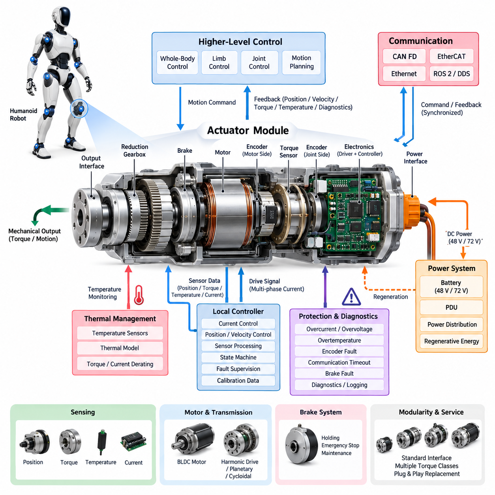
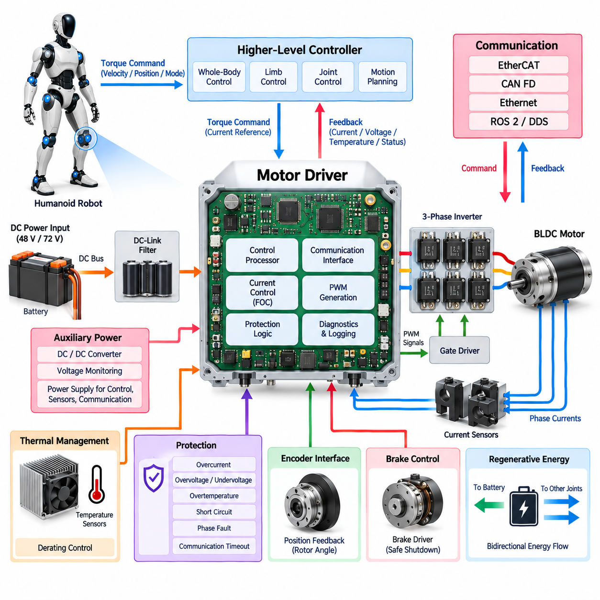
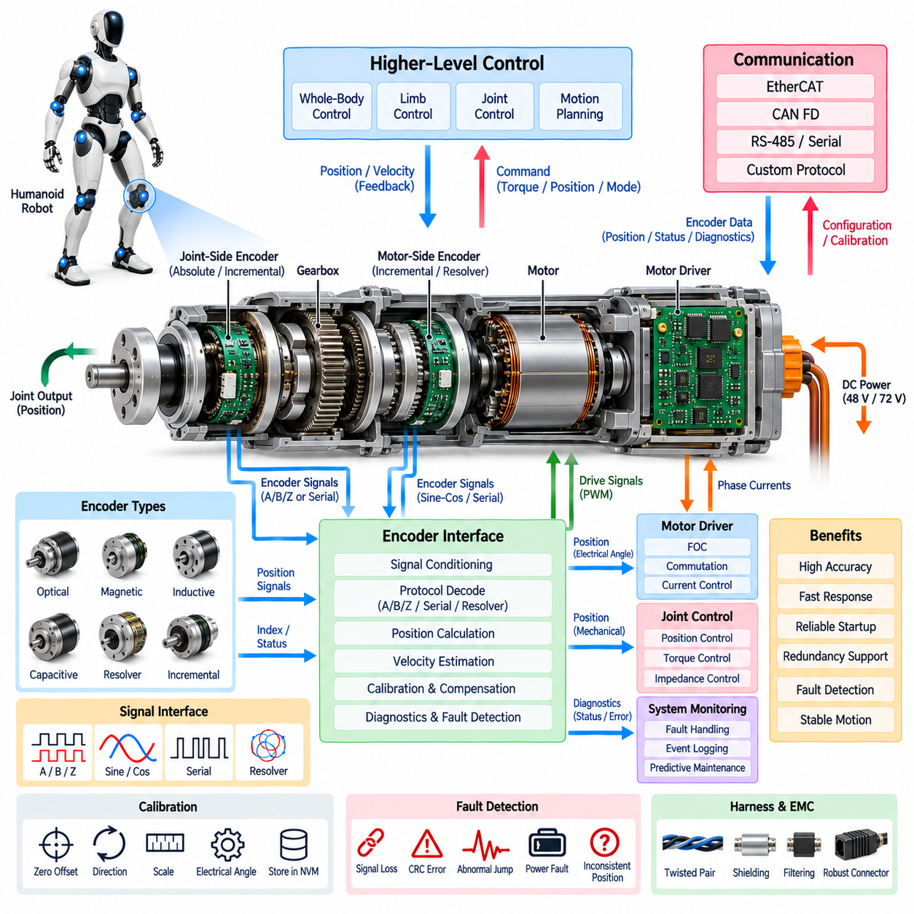
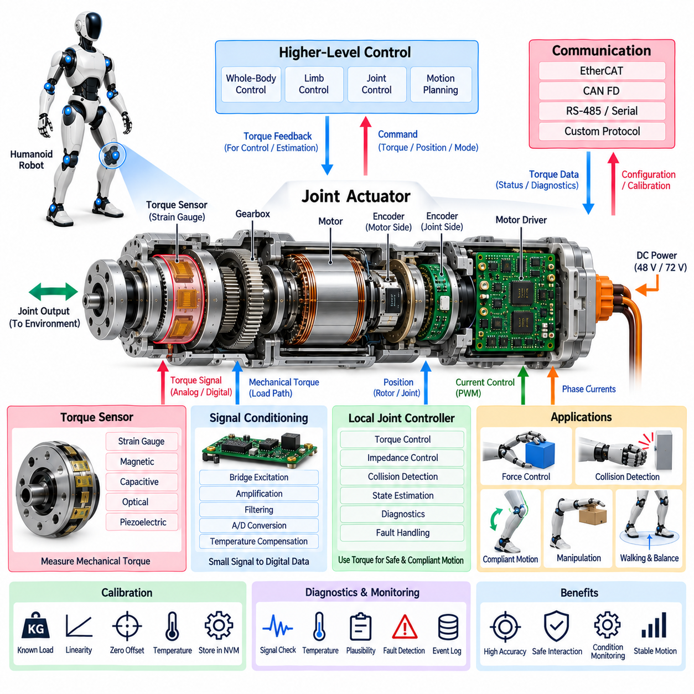
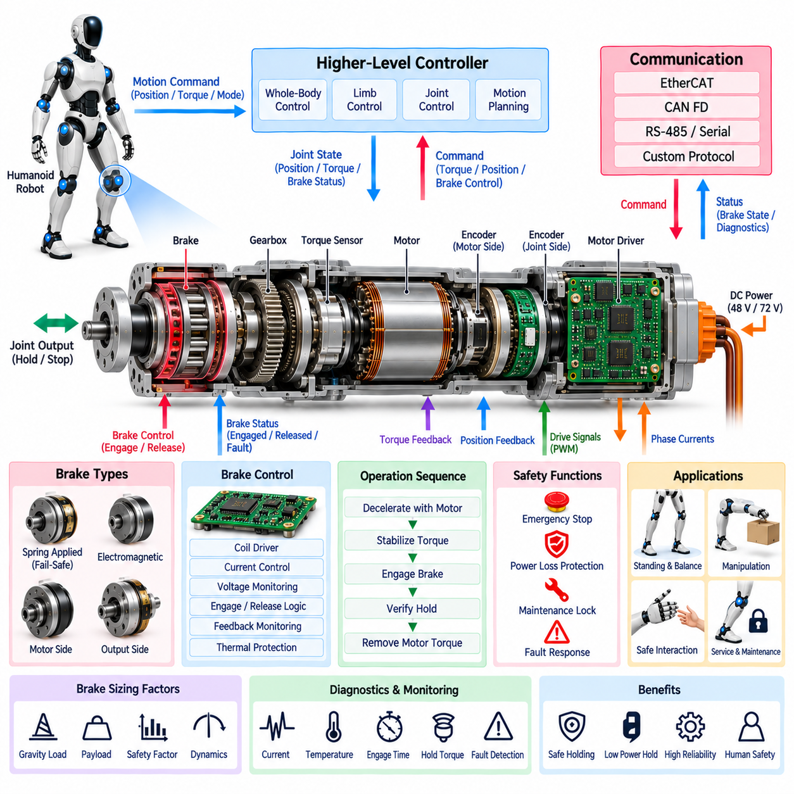
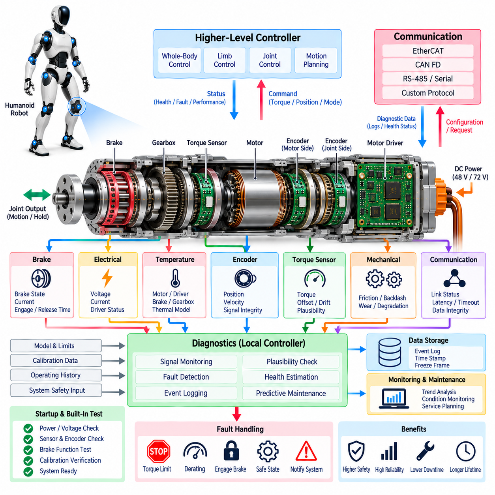

**Volume 21. Humanoid Electrical Architecture**


# Chapter 04. Joint Module Architecture

##  

## 04.01. Actuator Module

{width="7.268055555555556in" height="7.268055555555556in"}

A humanoid actuator module is the fundamental electromechanical unit that converts electrical energy and digital motion commands into controlled joint movement. Unlike a conventional industrial motor assembly, the module must combine high torque density, compact packaging, low mass, precise sensing, fast control response, and safe interaction with humans. Its architecture therefore integrates mechanical, electrical, sensing, communication, thermal, and control functions into a tightly coordinated subsystem.

The actuator module normally contains an electric motor, reduction mechanism, position sensing, optional torque sensing, motor drive electronics, temperature monitoring, mechanical bearings, and structural interfaces. Depending on the joint, a brake or locking mechanism may also be integrated. These elements form a local motion unit that receives power and commands from the humanoid electrical architecture and returns position, velocity, torque, temperature, current, and diagnostic information.

Motor selection is strongly influenced by the torque-speed envelope of the joint. Brushless permanent-magnet motors are well suited to humanoid applications because they provide high efficiency, controllability, and power density. A high-torque joint such as the hip or knee may require a larger motor and reduction ratio, while wrist, neck, or finger mechanisms emphasize low inertia and compact dimensions. The motor and transmission must therefore be treated as one integrated actuator rather than independently optimized components.

Reduction mechanisms allow a relatively high-speed motor to generate the torque required for human-scale motion. Harmonic drives, planetary gearboxes, cycloidal mechanisms, and other compact reducers can be selected according to torque density, backlash, efficiency, stiffness, mass, and durability requirements. Transmission compliance and friction directly affect control quality, particularly when the humanoid performs force-controlled manipulation, dynamic walking, or physical interaction with its environment.

Electrical power enters the actuator through a local power interface connected to the robot\'s main distribution architecture. In the proposed humanoid structure, joint modules operate as downstream loads of the 48 V or 72 V power system described in the preceding power architecture chapter. Local conversion and filtering may provide the voltage domains required by gate drivers, processors, encoders, torque sensors, and communication circuits while isolating sensitive electronics from motor switching disturbances.

The motor driver converts the DC supply into controlled multiphase currents for the actuator motor. Current control forms the innermost electrical control loop because motor torque is closely related to phase current. Position and velocity loops operate above this layer, while higher-level joint, limb, balance, and whole-body controllers generate motion targets. This hierarchical arrangement allows fast local control to continue at the actuator level without requiring every switching or current-control operation to pass through the central computer.

Accurate position feedback is essential because small joint errors can accumulate across the humanoid kinematic chain. An actuator may use motor-side and joint-side encoders to distinguish rotor motion from actual output motion. Dual sensing can reveal gearbox deflection, backlash, slippage, or abnormal transmission behavior. Absolute encoders are especially useful because they preserve meaningful joint position after power cycling and reduce the need for potentially unsafe initialization movements during robot startup.

Torque sensing extends the actuator from a position-controlled device into an interaction-aware joint module. Torque may be estimated from motor current or measured directly using strain-based, magnetic, optical, or other sensing technologies. Direct output-side sensing can capture external forces and transmission effects that are difficult to infer from motor current alone. This capability supports compliant manipulation, collision detection, contact estimation, impedance control, and stable locomotion over uncertain terrain.

Thermal behavior is a primary design constraint because humanoid joints repeatedly generate high torque inside compact enclosures. Temperature sensors should monitor critical locations such as motor windings, power semiconductor regions, gearbox structures, or actuator housings. Local control software can progressively reduce allowable current or torque as thermal limits are approached rather than waiting for an abrupt shutdown. Thermal models may additionally estimate internal temperatures that cannot be measured economically with dedicated sensors.

Mechanical brakes can be incorporated where loss of torque would create unacceptable motion or energy release. Leg joints may require holding capability during shutdown, while other joints may rely on transmission characteristics or controlled electrical braking. Brake control must be coordinated with motor torque so that engagement does not create shock loading. The architecture should also distinguish normal holding, emergency stopping, maintenance locking, and power-loss behavior because these conditions impose different safety requirements.

Communication connects the actuator to higher-level real-time control. The humanoid architecture identifies CAN FD and EtherCAT as principal joint-level communication candidates, with Ethernet and ROS 2/DDS serving broader system functions. EtherCAT is attractive for tightly synchronized multi-axis motion, whereas CAN FD can provide robust distributed communication for modules with moderate bandwidth requirements. Regardless of protocol, deterministic command delivery and timestamp-consistent feedback are important for coordinated whole-body movement.

A local microcontroller or motion-control processor can manage current regulation, encoder acquisition, sensor filtering, communication, state machines, and fault supervision. This distributed intelligence reduces the real-time burden on central computing resources and allows faults to be handled close to their physical source. The local controller can enforce current, velocity, position, temperature, and torque limits even if a higher-level command becomes invalid or communication with the main controller is temporarily disrupted.

Actuator protection must address electrical and mechanical failure modes simultaneously. Overcurrent, short circuit, overvoltage, undervoltage, phase loss, encoder failure, excessive temperature, communication timeout, excessive velocity, unexpected torque, and brake faults can be supervised locally. Faults should be classified according to severity so that the module can choose an appropriate response, ranging from warning and torque derating to controlled stopping, brake engagement, power isolation, or emergency shutdown.

Regenerative energy is another important consideration because a humanoid frequently decelerates joints or lowers gravitational loads. During these conditions the motor can operate as a generator and return energy to the DC bus. The actuator and power distribution system must tolerate reverse energy flow without exceeding bus voltage limits. Coordinated regeneration across multiple joints can improve overall efficiency, but it requires the actuator, motor driver, PDU, battery, and protection strategy to be designed as one energy-management system.

Modularity simplifies humanoid manufacturing and maintenance. A standardized actuator family can share power connectors, communication interfaces, diagnostic protocols, firmware structure, and mechanical mounting principles while providing several torque classes. This approach reduces the number of unique electrical components and enables replacement at the joint-module level. Identification data stored locally can describe actuator type, serial number, calibration parameters, firmware version, operating limits, and accumulated service information.

Calibration data is particularly important because nominally identical actuator modules exhibit differences in encoder offset, torque-sensor zero point, motor constants, friction, transmission compliance, and mechanical alignment. Factory calibration parameters can be stored in nonvolatile memory and automatically loaded when the module is installed. Higher-level software can then recognize a replacement actuator and verify that its configuration is compatible with the assigned joint before enabling full torque operation.

The actuator module ultimately acts as the boundary between whole-body intelligence and physical motion. Higher layers determine desired behavior, but the joint module must execute those intentions with deterministic timing, accurate sensing, controlled energy conversion, and local safety supervision. The surrounding chapter therefore separates motor driver, encoder interface, torque sensor, brake system, and diagnostics into dedicated sections, while the actuator module provides the integrated architectural foundation connecting all of these functions.

휴머노이드 액추에이터 모듈(actuator module)은 전기 에너지(electrical energy)와 디지털 동작 명령(digital motion commands)을 제어된 관절 운동으로 변환하는 기본적인 전기기계 장치(electromechanical unit)이다. 일반적인 산업용 모터 조립체와 달리 높은 토크 밀도(torque density), 소형 패키징(compact packaging), 낮은 질량, 정밀 센싱(precise sensing), 빠른 제어 응답, 인간과의 안전한 상호작용을 동시에 만족해야 한다. 따라서 기계, 전기, 센싱, 통신, 열 관리, 제어 기능을 긴밀하게 통합한 서브시스템(subsystem)으로 설계된다.

액추에이터 모듈은 일반적으로 전기 모터(electric motor), 감속 기구(reduction mechanism), 위치 센싱(position sensing), 선택적인 토크 센싱(torque sensing), 모터 구동 전자장치(motor drive electronics), 온도 모니터링(temperature monitoring), 기계식 베어링(mechanical bearings), 구조적 인터페이스(structural interfaces)를 포함한다. 관절에 따라 브레이크(brake) 또는 잠금 기구(locking mechanism)가 추가될 수 있다. 이러한 요소들은 휴머노이드 전기 아키텍처로부터 전력과 명령을 수신하고 위치, 속도, 토크, 온도, 전류 및 진단 정보를 반환하는 로컬 모션 유닛(local motion unit)을 구성한다.

모터 선택은 관절의 토크-속도 동작 영역(torque-speed envelope)에 크게 영향을 받는다. 브러시리스 영구자석 모터(brushless permanent-magnet motor)는 높은 효율, 제어성 및 출력 밀도(power density)를 제공하므로 휴머노이드에 적합하다. 엉덩이 또는 무릎과 같은 고토크 관절은 더 큰 모터와 높은 감속비가 필요할 수 있으며, 손목, 목 또는 손가락 메커니즘은 낮은 관성과 소형 크기를 중요하게 고려한다. 따라서 모터와 변속 기구(transmission)는 독립적인 부품이 아니라 하나의 통합 액추에이터(integrated actuator)로 최적화되어야 한다.

감속 기구는 상대적으로 고속으로 회전하는 모터가 인간 크기의 동작에 필요한 토크를 발생시킬 수 있도록 한다. 하모닉 드라이브(harmonic drive), 유성 기어박스(planetary gearbox), 사이클로이드 기구(cycloidal mechanism) 및 기타 소형 감속기는 토크 밀도, 백래시(backlash), 효율, 강성(stiffness), 질량 및 내구성 요구사항에 따라 선택할 수 있다. 변속 기구의 컴플라이언스(compliance)와 마찰은 특히 힘 제어 조작(force-controlled manipulation), 동적 보행(dynamic walking), 물리적 상호작용을 수행할 때 제어 품질에 직접적인 영향을 준다.

전력은 로봇의 주 전력 분배 아키텍처(main power distribution architecture)에 연결된 로컬 전력 인터페이스(local power interface)를 통해 액추에이터로 공급된다. 제안된 휴머노이드 구조에서 관절 모듈은 앞선 전력 아키텍처 장에서 설명한 48 V 또는 72 V 전력 시스템의 하위 부하(downstream load)로 동작한다. 로컬 전력 변환(local conversion)과 필터링(filtering)은 게이트 드라이버(gate driver), 프로세서(processor), 엔코더(encoder), 토크 센서 및 통신 회로에 필요한 전압 영역을 제공하면서 모터 스위칭에 의한 교란으로부터 민감한 전자장치를 보호할 수 있다.

모터 드라이버(motor driver)는 직류 전원(DC supply)을 액추에이터 모터를 위한 제어된 다상 전류(multiphase currents)로 변환한다. 모터 토크가 상전류(phase current)와 밀접하게 연관되므로 전류 제어(current control)는 가장 내부의 전기적 제어 루프를 형성한다. 그 상위에는 위치 및 속도 제어 루프가 있으며, 더 높은 계층의 관절, 팔다리, 균형 및 전신 제어기(whole-body controller)가 동작 목표를 생성한다. 이러한 계층 구조는 모든 스위칭 및 전류 제어 동작을 중앙 컴퓨터에서 처리하지 않고 액추에이터 수준에서 빠른 로컬 제어를 수행할 수 있게 한다.

정확한 위치 피드백(position feedback)은 작은 관절 오차가 휴머노이드의 운동학적 체인(kinematic chain)을 따라 누적될 수 있기 때문에 필수적이다. 액추에이터는 모터 측 엔코더(motor-side encoder)와 관절 측 엔코더(joint-side encoder)를 함께 사용하여 회전자 움직임과 실제 출력 움직임을 구분할 수 있다. 이중 센싱(dual sensing)은 기어박스 변형, 백래시, 미끄러짐 또는 비정상적인 변속 동작을 감지하는 데 활용할 수 있다. 절대형 엔코더(absolute encoder)는 전원을 껐다 켠 이후에도 의미 있는 관절 위치를 유지하므로 로봇 기동 시 잠재적으로 위험한 초기화 움직임을 줄일 수 있다.

토크 센싱(torque sensing)은 액추에이터를 단순한 위치 제어 장치에서 상호작용 인식형 관절 모듈(interaction-aware joint module)로 확장한다. 토크는 모터 전류를 이용해 추정하거나 스트레인(strain), 자기, 광학 또는 기타 센싱 기술을 사용하여 직접 측정할 수 있다. 출력 측 직접 센싱은 모터 전류만으로 추론하기 어려운 외력과 변속 기구의 영향을 측정할 수 있다. 이를 통해 유연 조작(compliant manipulation), 충돌 감지(collision detection), 접촉 추정(contact estimation), 임피던스 제어(impedance control), 불확실한 지형에서의 안정적인 보행을 지원할 수 있다.

열 거동(thermal behavior)은 휴머노이드 관절이 소형 인클로저(enclosure) 내부에서 반복적으로 높은 토크를 발생시키므로 핵심적인 설계 제약이다. 온도 센서는 모터 권선(motor winding), 전력 반도체 영역(power semiconductor region), 기어박스 구조 또는 액추에이터 하우징과 같은 주요 위치를 모니터링해야 한다. 로컬 제어 소프트웨어는 열 한계에 도달했을 때 갑작스럽게 정지하는 대신 허용 전류 또는 토크를 점진적으로 낮출 수 있다. 열 모델(thermal model)을 이용하면 전용 센서를 경제적으로 설치하기 어려운 내부 위치의 온도도 추정할 수 있다.

토크 손실로 인해 허용할 수 없는 움직임이나 에너지 방출이 발생할 수 있는 위치에는 기계식 브레이크(mechanical brake)를 통합할 수 있다. 다리 관절은 시스템 종료 중 자세 유지 기능이 필요할 수 있으며, 다른 관절은 변속 기구 특성 또는 제어된 전기 제동(electrical braking)을 활용할 수 있다. 브레이크 체결 시 충격 하중이 발생하지 않도록 브레이크 제어와 모터 토크를 조정해야 한다. 또한 정상 유지(normal holding), 비상 정지(emergency stopping), 정비 잠금(maintenance locking), 전원 상실(power-loss) 상태는 서로 다른 안전 요구사항을 가지므로 아키텍처 수준에서 구분해야 한다.

통신(communication)은 액추에이터를 상위 실시간 제어 시스템(real-time control system)과 연결한다. 휴머노이드 아키텍처에서는 CAN FD와 EtherCAT을 주요 관절 수준 통신 후보로 정의하고, 이더넷(Ethernet)과 ROS 2/DDS는 보다 광범위한 시스템 기능을 담당한다. EtherCAT은 긴밀하게 동기화된 다축 모션(multi-axis motion)에 적합하며, CAN FD는 중간 수준의 대역폭이 필요한 모듈에 견고한 분산 통신을 제공할 수 있다. 프로토콜과 관계없이 결정론적 명령 전달(deterministic command delivery)과 타임스탬프가 일치된 피드백(timestamp-consistent feedback)은 전신 협조 운동에 중요하다.

로컬 마이크로컨트롤러(local microcontroller) 또는 모션 제어 프로세서(motion-control processor)는 전류 조절, 엔코더 데이터 획득, 센서 필터링, 통신, 상태 머신(state machine), 고장 감시(fault supervision)를 관리할 수 있다. 이러한 분산 지능(distributed intelligence)은 중앙 컴퓨팅 자원의 실시간 처리 부담을 줄이고 물리적인 고장 발생 위치 가까이에서 문제를 처리할 수 있도록 한다. 로컬 제어기는 상위 명령이 유효하지 않거나 주 제어기와의 통신이 일시적으로 중단되더라도 전류, 속도, 위치, 온도 및 토크 한계를 강제할 수 있다.

액추에이터 보호(actuator protection)는 전기적 고장과 기계적 고장 모드를 동시에 다루어야 한다. 과전류(overcurrent), 단락(short circuit), 과전압(overvoltage), 저전압(undervoltage), 상 손실(phase loss), 엔코더 고장, 과도한 온도, 통신 타임아웃(communication timeout), 과속, 비정상 토크 및 브레이크 고장을 로컬에서 감시할 수 있다. 고장은 심각도에 따라 분류해야 하며, 모듈은 경고와 토크 디레이팅(torque derating)부터 제어 정지(controlled stopping), 브레이크 체결, 전력 차단 및 비상 종료까지 적절한 대응을 선택할 수 있어야 한다.

회생 에너지(regenerative energy) 역시 중요한 고려사항이다. 휴머노이드는 관절을 감속하거나 중력 하중을 낮추는 동작을 빈번하게 수행하기 때문이다. 이러한 조건에서 모터는 발전기(generator)로 동작하여 에너지를 직류 버스(DC bus)로 반환할 수 있다. 액추에이터와 전력 분배 시스템은 버스 전압 한계를 초과하지 않으면서 역방향 에너지 흐름(reverse energy flow)을 처리할 수 있어야 한다. 여러 관절의 회생을 조정하면 전체 효율을 높일 수 있지만, 이를 위해 액추에이터, 모터 드라이버, 전력 분배 장치(PDU), 배터리 및 보호 전략을 하나의 에너지 관리 시스템(energy-management system)으로 설계해야 한다.

모듈화(modularity)는 휴머노이드의 제조와 유지보수를 단순화한다. 표준화된 액추에이터 제품군(actuator family)은 전력 커넥터, 통신 인터페이스, 진단 프로토콜, 펌웨어 구조 및 기계적 장착 원칙을 공유하면서 여러 토크 등급을 제공할 수 있다. 이러한 접근 방식은 고유 전기 부품의 종류를 줄이고 관절 모듈 단위의 교체를 가능하게 한다. 로컬에 저장된 식별 데이터는 액추에이터 유형, 일련번호, 보정 파라미터(calibration parameters), 펌웨어 버전, 동작 한계 및 누적 정비 정보를 포함할 수 있다.

보정 데이터(calibration data)는 명목상 동일한 액추에이터 모듈이라도 엔코더 오프셋(encoder offset), 토크 센서 영점, 모터 상수(motor constants), 마찰, 변속 기구 컴플라이언스 및 기계적 정렬에서 차이가 발생하기 때문에 특히 중요하다. 공장 보정 파라미터(factory calibration parameters)는 비휘발성 메모리(nonvolatile memory)에 저장하고 모듈이 설치될 때 자동으로 불러올 수 있다. 상위 소프트웨어는 교체된 액추에이터를 인식하고 전체 토크 동작을 활성화하기 전에 해당 구성이 지정된 관절과 호환되는지 확인할 수 있다.

액추에이터 모듈은 궁극적으로 전신 지능(whole-body intelligence)과 물리적 운동 사이의 경계 역할을 한다. 상위 계층은 원하는 행동을 결정하지만, 관절 모듈은 결정론적 타이밍(deterministic timing), 정확한 센싱, 제어된 에너지 변환 및 로컬 안전 감시를 통해 이러한 의도를 실행해야 한다. 따라서 본 장의 후속 절에서는 모터 드라이버(motor driver), 엔코더 인터페이스(encoder interface), 토크 센서(torque sensor), 브레이크 시스템(brake system), 진단(diagnostics)을 각각 독립적으로 다루며, 액추에이터 모듈은 이 모든 기능을 연결하는 통합 아키텍처 기반을 제공한다.

##  

## 04.02. Motor Driver

{width="7.268055555555556in" height="7.268055555555556in"}

The motor driver is the power-electronic and real-time control interface between the humanoid electrical power system and each joint motor. It converts DC-bus energy into accurately regulated multiphase current while translating joint-level torque commands into electromagnetic torque. Because dozens of actuators may operate simultaneously, driver efficiency, current accuracy, switching behavior, thermal performance, communication latency, and fault response directly influence whole-body motion quality.

A typical humanoid joint driver consists of a three-phase inverter, gate-driver circuitry, current sensors, DC-link filtering, voltage monitoring, temperature sensing, a real-time controller, communication interfaces, and protection circuits. These functions may be integrated inside the actuator housing or implemented on a closely coupled electronics module. The architecture follows the joint-module structure in which the motor driver operates together with encoder, torque sensor, brake, and diagnostic functions.

For a brushless permanent-magnet motor, the inverter commonly uses six power semiconductor switches arranged as three half bridges. By controlling the switching states of these devices, the driver synthesizes phase voltages from the DC supply and regulates current through the motor windings. MOSFET-based stages are particularly suitable for compact 48 V and 72 V humanoid systems, although device selection depends on voltage margin, current demand, switching frequency, losses, packaging, and thermal constraints.

Pulse-width modulation controls the effective voltage applied to each motor phase. Higher switching frequencies can reduce current ripple and audible components while improving control resolution, but they also increase semiconductor switching losses and electromagnetic interference. The optimum switching strategy therefore represents a compromise among efficiency, torque smoothness, acoustic behavior, thermal loading, EMC performance, and controller bandwidth rather than simply maximizing switching frequency.

Field-oriented control is commonly used to achieve smooth and precise torque production. Measured phase currents are transformed into a rotating reference frame aligned with rotor position, allowing flux-producing and torque-producing current components to be controlled independently. The current controller then calculates voltage commands that are converted into inverter switching signals. Accurate rotor-angle information from the encoder is therefore tightly coupled to motor-driver performance.

The current loop is normally the fastest closed-loop function within the joint actuator. Torque, velocity, and position loops operate at progressively higher architectural levels or lower update rates. This hierarchy allows the driver to react rapidly to electrical disturbances while the joint controller manages mechanical behavior. Higher-level limb and whole-body controllers can consequently request torque or motion without directly controlling individual power-semiconductor switching events.

Current measurement is essential for both control and protection. Phase currents can be measured using shunt resistors, Hall-effect sensors, magnetic sensors, or other isolated techniques depending on accuracy, bandwidth, packaging, and isolation requirements. Sensor placement must support reliable reconstruction of motor currents throughout the PWM cycle. Offset, gain error, noise, temperature drift, and sampling timing must be considered because current-measurement error directly becomes torque-control error.

DC-bus voltage monitoring provides another important input to the driver. Supply voltage changes as battery state, wiring losses, simultaneous joint loading, and regenerative operation alter the electrical operating condition. The controller can compensate modulation commands for these variations while protection logic supervises undervoltage and overvoltage limits. Coordinating the motor driver with the 48 V or 72 V power architecture is therefore necessary for predictable joint behavior under dynamic whole-body loads.

Regenerative operation occurs whenever mechanical energy drives the motor in a direction that returns electrical power through the inverter. Walking, landing, lowering a payload, decelerating an arm, or controlling a descending body segment can create this condition. The motor driver must support bidirectional energy flow while preventing excessive DC-bus voltage. Regenerated energy may be absorbed by other active joints, returned to the battery, or managed by the wider power-distribution architecture.

Gate-driver circuitry forms the electrical boundary between low-voltage control logic and high-current power switches. It must provide sufficient gate current for rapid switching while maintaining correct dead time between complementary devices. Undervoltage lockout, desaturation or overcurrent detection, Miller-clamp functions, and controlled shutdown mechanisms may be incorporated according to semiconductor technology. Poor gate-drive design can produce excessive losses, false switching, or destructive shoot-through faults.

Thermal management is critical because conduction and switching losses are concentrated in a small joint enclosure. The driver should monitor semiconductor, PCB, or heat-spreader temperatures and coordinate these measurements with motor thermal information. Rather than relying only on a fixed shutdown threshold, the controller can apply progressive current and torque derating as thermal margin decreases. This preserves useful motion capability while protecting the actuator from cumulative thermal damage.

The driver PCB requires careful layout because high-current switching paths coexist with sensitive sensing and communication circuits. DC-link capacitors should be positioned to minimize high-frequency current-loop area, while gate-drive traces, phase outputs, current-sense paths, digital grounds, and communication interfaces require deliberate routing. Grounding, shielding, filtering, and common-mode control become particularly important when many joint drivers switch simultaneously within the humanoid body.

Electromagnetic compatibility affects both the actuator itself and surrounding robot electronics. Rapid voltage and current transitions can couple noise into encoders, torque sensors, cameras, IMUs, communication networks, and central computing systems. Switching slew rate, cable geometry, motor-phase routing, shielding termination, filtering, grounding strategy, and enclosure design must therefore be coordinated. The motor driver cannot be treated as an isolated power board because it is one of the robot\'s strongest repetitive EMI sources.

Real-time communication allows the driver to receive torque, velocity, position, mode, and limit commands while returning measured current, voltage, temperature, status, and fault information. The humanoid architecture identifies EtherCAT and CAN FD as major communication options at the joint level. EtherCAT supports tightly synchronized multi-axis operation, while CAN FD offers robust distributed control. Communication timeout supervision must ensure that stale commands cannot continue producing uncontrolled torque.

Protection logic must respond faster than higher-level software when destructive electrical conditions occur. Hardware or firmware mechanisms can detect overcurrent, short circuit, bus overvoltage, undervoltage, excessive temperature, invalid rotor position, phase abnormalities, or power-stage faults. Severe events may require immediate PWM inhibition, while less critical conditions can trigger controlled torque reduction. Fault severity and recovery rules should be deterministic so that identical failures produce predictable actuator behavior.

Safe shutdown requires coordination among the motor driver, local controller, brake system, and power distribution unit. Simply disabling the inverter may allow a gravity-loaded joint to move, while abruptly engaging a brake under high torque may create mechanical shock. A controlled sequence can reduce motor torque, bring the joint toward an appropriate state, engage the brake where required, verify holding status, and then disable the power stage. Emergency conditions may require a faster path that prioritizes immediate risk reduction.

Driver diagnostics should capture operating information before and during abnormal events. Peak current, DC voltage, semiconductor temperature, motor temperature, command torque, measured velocity, encoder status, communication state, and fault flags can be recorded in local event buffers. These records allow service software to distinguish electrical faults from mechanical overloads, sensor failures, communication problems, or thermal limitations and provide valuable input for predictive maintenance.

Calibration ensures consistent torque production across a population of actuator modules. Current-sensor offsets and gains, phase relationships, rotor electrical-angle alignment, motor parameters, voltage measurement scaling, and thermal coefficients may require factory or service calibration. Relevant parameters can be stored in local nonvolatile memory so that replacement drivers or complete actuator modules retain their validated configuration and can be checked automatically during system initialization.

The motor driver therefore performs far more than simple DC-to-AC power conversion. It is a deterministic energy-control node that combines power electronics, high-speed current regulation, sensing, thermal management, communication, diagnostics, regeneration, and local protection. Within the humanoid joint-module architecture, its performance establishes the practical connection between high-level motion intelligence and the precise electromagnetic forces that ultimately move the robot\'s body.

모터 드라이버(motor driver)는 휴머노이드 전력 시스템(humanoid electrical power system)과 각 관절 모터 사이에서 전력전자(power electronics) 및 실시간 제어 인터페이스(real-time control interface) 역할을 한다. 직류 버스(DC bus)의 에너지를 정밀하게 조절된 다상 전류(multiphase current)로 변환하고, 관절 수준의 토크 명령을 전자기 토크(electromagnetic torque)로 변환한다. 수십 개의 액추에이터가 동시에 동작할 수 있으므로 드라이버 효율, 전류 정확도, 스위칭 특성, 열 성능, 통신 지연 및 고장 대응은 전신 운동 품질에 직접적인 영향을 준다.

일반적인 휴머노이드 관절 드라이버(humanoid joint driver)는 3상 인버터(three-phase inverter), 게이트 드라이버 회로(gate-driver circuitry), 전류 센서(current sensor), 직류 링크 필터링(DC-link filtering), 전압 모니터링(voltage monitoring), 온도 센싱(temperature sensing), 실시간 제어기(real-time controller), 통신 인터페이스 및 보호 회로(protection circuit)로 구성된다. 이러한 기능은 액추에이터 하우징 내부에 통합하거나 밀접하게 연결된 전자 모듈로 구현할 수 있다. 이 구조에서 모터 드라이버는 엔코더(encoder), 토크 센서(torque sensor), 브레이크(brake), 진단(diagnostics) 기능과 함께 동작한다.

브러시리스 영구자석 모터(brushless permanent-magnet motor)의 경우 인버터는 일반적으로 3개의 하프 브리지(half bridge)로 구성된 6개의 전력 반도체 스위치(power semiconductor switch)를 사용한다. 이들 소자의 스위칭 상태를 제어함으로써 직류 전원에서 상전압(phase voltage)을 생성하고 모터 권선을 흐르는 전류를 조절한다. MOSFET 기반 전력단은 소형 48 V 및 72 V 휴머노이드 시스템에 특히 적합하지만, 실제 소자 선택은 전압 여유, 전류 요구량, 스위칭 주파수, 손실, 패키징 및 열 제약 조건을 고려해야 한다.

펄스 폭 변조(Pulse-Width Modulation, PWM)는 각 모터 상에 인가되는 유효 전압을 제어한다. 높은 스위칭 주파수는 전류 리플(current ripple)과 가청 성분을 줄이고 제어 분해능을 향상시킬 수 있지만, 반도체 스위칭 손실과 전자기 간섭(Electromagnetic Interference, EMI)을 증가시킨다. 따라서 최적의 스위칭 전략은 단순히 주파수를 최대화하는 것이 아니라 효율, 토크 평활성, 음향 특성, 열 부하, 전자파 적합성(Electromagnetic Compatibility, EMC), 제어기 대역폭 사이의 균형을 고려해야 한다.

자속 기준 제어(Field-Oriented Control, FOC)는 부드럽고 정밀한 토크 생성을 위해 일반적으로 사용된다. 측정된 상전류는 회전자 위치와 정렬된 회전 기준 좌표계(rotating reference frame)로 변환되며, 이를 통해 자속 생성 전류 성분과 토크 생성 전류 성분을 독립적으로 제어할 수 있다. 이후 전류 제어기는 전압 명령을 계산하고 이를 인버터 스위칭 신호로 변환한다. 따라서 엔코더에서 제공되는 정확한 회전자 각도(rotor angle) 정보는 모터 드라이버 성능과 밀접하게 연계된다.

전류 루프(current loop)는 일반적으로 관절 액추에이터 내부에서 가장 빠르게 동작하는 폐루프 제어(closed-loop control) 기능이다. 토크, 속도 및 위치 루프는 점차 상위 아키텍처 계층에서 또는 상대적으로 낮은 갱신 주기로 동작한다. 이러한 계층 구조를 통해 드라이버는 전기적 교란에 빠르게 대응하고 관절 제어기는 기계적 거동을 관리할 수 있다. 이에 따라 상위 팔다리 제어기와 전신 제어기(whole-body controller)는 개별 전력 반도체의 스위칭을 직접 제어하지 않고도 토크 또는 동작을 요구할 수 있다.

전류 측정(current measurement)은 제어와 보호 모두에 필수적이다. 상전류는 요구되는 정확도, 대역폭, 패키징 및 절연 조건에 따라 션트 저항(shunt resistor), 홀 효과 센서(Hall-effect sensor), 자기 센서 또는 기타 절연 측정 기술을 사용하여 측정할 수 있다. 센서 배치는 PWM 주기 전체에서 모터 전류를 안정적으로 복원할 수 있어야 한다. 오프셋, 이득 오차, 노이즈, 온도 드리프트(temperature drift), 샘플링 타이밍을 고려해야 하며, 전류 측정 오차는 직접적으로 토크 제어 오차로 이어진다.

직류 버스 전압 모니터링(DC-bus voltage monitoring)은 드라이버의 또 다른 중요한 입력이다. 배터리 상태, 배선 손실, 여러 관절의 동시 부하 및 회생 동작에 따라 공급 전압이 변한다. 제어기는 이러한 변화를 고려하여 변조 명령(modulation command)을 보상할 수 있으며, 보호 로직은 저전압과 과전압 한계를 감시한다. 따라서 동적인 전신 부하에서도 예측 가능한 관절 동작을 구현하려면 모터 드라이버를 48 V 또는 72 V 전력 아키텍처와 연계하여 설계해야 한다.

회생 동작(regenerative operation)은 기계적 에너지가 모터를 구동하여 인버터를 통해 전력을 역방향으로 반환할 때 발생한다. 보행, 착지, 페이로드 하강, 팔 감속 또는 신체 분절의 하강을 제어하는 과정에서 이러한 상태가 발생할 수 있다. 모터 드라이버는 과도한 직류 버스 전압을 방지하면서 양방향 에너지 흐름(bidirectional energy flow)을 지원해야 한다. 회생된 에너지는 동작 중인 다른 관절에서 소비하거나 배터리로 반환하거나 상위 전력 분배 아키텍처를 통해 관리할 수 있다.

게이트 드라이버 회로(gate-driver circuitry)는 저전압 제어 로직과 고전류 전력 스위치 사이의 전기적 경계를 형성한다. 빠른 스위칭을 위해 충분한 게이트 전류를 제공하면서 상보 소자(complementary device) 사이에 적절한 데드 타임(dead time)을 유지해야 한다. 반도체 기술에 따라 저전압 잠금(undervoltage lockout), 디새추레이션(desaturation) 또는 과전류 감지, 밀러 클램프(Miller clamp), 제어 종료(controlled shutdown) 기능 등을 적용할 수 있다. 부적절한 게이트 구동 설계는 과도한 손실, 오동작 스위칭 또는 파괴적인 슛스루(shoot-through) 고장을 발생시킬 수 있다.

열 관리(thermal management)는 전도 손실과 스위칭 손실이 작은 관절 인클로저 내부에 집중되므로 매우 중요하다. 드라이버는 반도체, 인쇄회로기판(Printed Circuit Board, PCB), 열 확산판(heat spreader)의 온도를 감시하고 이러한 측정값을 모터의 열 정보와 연계해야 한다. 고정된 종료 임계값만 사용하는 대신 열적 여유가 감소함에 따라 전류와 토크를 점진적으로 디레이팅(derating)할 수 있다. 이를 통해 액추에이터의 누적 열 손상을 방지하면서 가능한 범위에서 유효한 운동 성능을 유지할 수 있다.

드라이버 인쇄회로기판(PCB)은 고전류 스위칭 경로와 민감한 센싱 및 통신 회로가 공존하기 때문에 세심한 레이아웃 설계가 필요하다. 직류 링크 커패시터(DC-link capacitor)는 고주파 전류 루프 면적을 최소화하도록 배치해야 하며, 게이트 구동 배선, 상 출력, 전류 센싱 경로, 디지털 접지 및 통신 인터페이스도 의도적으로 라우팅해야 한다. 특히 다수의 관절 드라이버가 휴머노이드 내부에서 동시에 스위칭하는 경우 접지, 차폐, 필터링 및 공통 모드 제어(common-mode control)가 더욱 중요해진다.

전자파 적합성(EMC)은 액추에이터 자체뿐만 아니라 주변 로봇 전자장치에도 영향을 준다. 급격한 전압 및 전류 변화는 엔코더, 토크 센서, 카메라, 관성측정장치(Inertial Measurement Unit, IMU), 통신 네트워크 및 중앙 컴퓨팅 시스템으로 노이즈를 결합시킬 수 있다. 따라서 스위칭 슬루율(slew rate), 케이블 형상, 모터 상 배선, 차폐 종단(shielding termination), 필터링, 접지 전략 및 인클로저 설계를 상호 조정해야 한다. 모터 드라이버는 로봇 내부에서 가장 강력하고 반복적인 전자기 간섭원 중 하나이므로 독립적인 전력 보드로만 취급해서는 안 된다.

실시간 통신(real-time communication)을 통해 드라이버는 토크, 속도, 위치, 동작 모드 및 제한 명령을 수신하고 측정된 전류, 전압, 온도, 상태 및 고장 정보를 반환한다. 휴머노이드 아키텍처에서는 EtherCAT과 CAN FD를 주요 관절 수준 통신 방식으로 고려한다. EtherCAT은 긴밀하게 동기화된 다축 동작을 지원하고 CAN FD는 견고한 분산 제어(distributed control)를 제공한다. 통신 타임아웃 감시(communication timeout supervision)를 통해 오래된 명령이 계속 유지되어 제어되지 않은 토크를 발생시키지 않도록 해야 한다.

파괴적인 전기적 상태가 발생하면 보호 로직(protection logic)은 상위 소프트웨어보다 빠르게 대응해야 한다. 하드웨어 또는 펌웨어 메커니즘을 이용해 과전류, 단락, 버스 과전압, 저전압, 과도한 온도, 유효하지 않은 회전자 위치, 상 이상(phase abnormality), 전력단 고장을 감지할 수 있다. 심각한 고장에서는 PWM을 즉시 차단해야 할 수 있으며, 상대적으로 경미한 상태에서는 제어된 토크 감소를 수행할 수 있다. 고장 심각도와 복구 규칙은 동일한 고장이 발생했을 때 예측 가능한 액추에이터 동작을 제공하도록 결정론적으로 정의해야 한다.

안전 종료(safe shutdown)는 모터 드라이버, 로컬 제어기(local controller), 브레이크 시스템(brake system), 전력 분배 장치(Power Distribution Unit, PDU) 사이의 협조가 필요하다. 단순히 인버터를 비활성화하면 중력 하중을 받는 관절이 움직일 수 있으며, 높은 토크 상태에서 브레이크를 갑자기 체결하면 기계적 충격이 발생할 수 있다. 제어된 절차에서는 모터 토크를 감소시키고 관절을 적절한 상태로 전환한 뒤 필요한 경우 브레이크를 체결하고 유지 상태를 확인한 다음 전력단을 비활성화할 수 있다. 비상 상황에서는 즉각적인 위험 감소를 우선하는 더 빠른 종료 경로가 필요할 수 있다.

드라이버 진단(driver diagnostics)은 비정상 상태 발생 전후의 동작 정보를 기록해야 한다. 최대 전류, 직류 전압, 반도체 온도, 모터 온도, 명령 토크, 측정 속도, 엔코더 상태, 통신 상태 및 고장 플래그(fault flag)를 로컬 이벤트 버퍼(local event buffer)에 저장할 수 있다. 이러한 기록을 통해 서비스 소프트웨어는 전기적 고장과 기계적 과부하, 센서 고장, 통신 문제 또는 열적 제한을 구분할 수 있으며 예측 유지보수(predictive maintenance)를 위한 중요한 데이터를 제공할 수 있다.

보정(calibration)은 여러 액추에이터 모듈에서 일관된 토크 생성을 보장한다. 전류 센서 오프셋과 이득, 상 관계(phase relationship), 회전자 전기각 정렬(rotor electrical-angle alignment), 모터 파라미터, 전압 측정 스케일링 및 열 계수(thermal coefficient)는 공장 또는 서비스 단계에서 보정이 필요할 수 있다. 관련 파라미터는 로컬 비휘발성 메모리(nonvolatile memory)에 저장하여 교체된 드라이버 또는 전체 액추에이터 모듈이 검증된 구성을 유지하고 시스템 초기화 과정에서 자동으로 확인될 수 있도록 한다.

따라서 모터 드라이버는 단순한 직류-교류 전력 변환(DC-to-AC power conversion) 이상의 기능을 수행한다. 이는 전력전자, 고속 전류 제어, 센싱, 열 관리, 통신, 진단, 회생 및 로컬 보호 기능을 결합하는 결정론적 에너지 제어 노드(deterministic energy-control node)이다. 휴머노이드 관절 모듈 아키텍처에서 모터 드라이버의 성능은 상위 모션 지능(high-level motion intelligence)과 실제 로봇 신체를 움직이는 정밀한 전자기력(electromagnetic force) 사이의 실질적인 연결을 형성한다.

##  

## 04.03. Encoder Interface

{width="7.268055555555556in" height="7.268055555555556in"}

The encoder interface provides the primary position-feedback path between the mechanical joint and the humanoid real-time control system. It converts rotor or joint displacement into accurate digital position information that can be used for motor commutation, velocity estimation, torque control, joint positioning, and whole-body coordination. Because position errors propagate through the robot\'s kinematic chain, encoder accuracy, latency, synchronization, resolution, and fault detection directly influence motion quality and stability.

Within the humanoid joint-module architecture, the encoder interface operates closely with the actuator module, motor driver, torque sensor, brake system, and local diagnostics. The architecture treats the encoder as a dedicated joint function rather than merely an accessory to the motor driver. This separation allows sensing requirements, electrical interfaces, calibration, redundancy, and diagnostic behavior to be engineered systematically for different humanoid joints.

A joint actuator may contain both motor-side and joint-side encoders. The motor-side encoder measures rotor position with sufficient bandwidth for electrical commutation and field-oriented control, while the joint-side encoder measures the actual mechanical output after the reduction mechanism. Comparing these two measurements provides information about gearbox deformation, backlash, compliance, slippage, mechanical offset, or abnormal transmission behavior that cannot be observed reliably from a single sensor.

Absolute encoders are particularly valuable in humanoid robots because they provide a meaningful angular position immediately after power-up. Unlike purely incremental sensing, an absolute interface can reduce or eliminate initialization movements required to establish a reference position. This is important for a robot that may start while standing, carrying a load, or interacting with a person, where uncontrolled homing motion could create instability or collision risk.

Incremental encoders can nevertheless provide high-resolution relative motion information and may be useful where cost, bandwidth, size, or motor-control requirements favor their characteristics. Quadrature signals provide direction and displacement information, while an index signal can establish a periodic mechanical reference. In some actuator designs, incremental motor feedback can be combined with an absolute joint-side sensor to balance high-speed control performance with reliable startup position knowledge.

Encoder technologies may include magnetic, optical, inductive, capacitive, or resolver-based sensing depending on the joint environment and performance requirements. Optical encoders can provide very high resolution, while magnetic and inductive technologies can offer greater tolerance to contamination, vibration, compact packaging, or mechanical integration constraints. Selection should consider accuracy, repeatability, operating temperature, shock, electromagnetic environment, lifetime, size, mass, and required functional robustness.

The electrical interface between the encoder and local controller must preserve signal integrity in an environment dominated by rapidly switching motor currents. Depending on encoder technology, the interface may use differential digital signaling, serial communication, quadrature channels, analog sine-cosine signals, or resolver excitation and demodulation. Differential signaling is advantageous for rejecting common-mode interference, particularly when sensing conductors pass near motor phases or power electronics.

Serial encoder interfaces can reduce wiring while providing high-resolution position and additional status information. A serial frame may contain absolute angle, revolution count, sensor status, warning flags, and error-detection information. Clocked synchronous protocols can provide deterministic acquisition, while CRC or parity mechanisms help detect corrupted data. The communication cycle must be sufficiently fast and predictable to support the control-loop bandwidth assigned to the joint.

Sampling timing is as important as nominal encoder resolution. In a multi-joint humanoid, position measurements acquired at inconsistent times can create apparent body deformation or phase error even when each individual sensor is accurate. Encoder acquisition should therefore be coordinated with the local current-control cycle and the wider system time base. Deterministic sampling and timestamping allow higher-level controllers to reconstruct a coherent representation of the robot\'s posture and motion.

Velocity is commonly derived from successive encoder measurements rather than measured by a separate sensor. Simple numerical differentiation can amplify quantization noise, especially at low speed, so filtering or observer-based estimation may be required. Excessive filtering introduces phase delay, while insufficient filtering produces noisy velocity feedback. The encoder interface must therefore balance resolution, sampling frequency, estimation method, and latency according to the dynamic requirements of each joint.

Motor-side position has an additional electrical function because field-oriented control requires accurate rotor electrical angle. Mechanical encoder position must be transformed according to the motor pole-pair count and calibrated electrical offset. An angular alignment error can reduce torque production, increase current consumption, create torque ripple, or generate unwanted heating. Rotor-angle calibration is consequently a critical part of integrating the encoder interface with the motor driver.

Joint-side sensing provides a position reference closer to the physical output that interacts with the environment. It can capture effects introduced by the gearbox, couplings, structural compliance, and mechanical tolerances. This information is particularly useful for precision manipulation, balance control, contact tasks, and coordinated limb movement. For high-performance joints, combining motor-side and output-side sensing enables more sophisticated control and mechanical-state estimation than either sensor alone.

Encoder calibration establishes the relationship between raw sensor values and meaningful robot joint coordinates. Calibration may include zero offset, direction, scale, electrical-angle alignment, joint reference position, and compensation for systematic sensor errors. These parameters can be stored in nonvolatile memory associated with the actuator module. When a module is replaced, the robot can verify its calibration identity and configuration before enabling unrestricted motion.

Signal integrity requires careful harness and connector design. Encoder conductors should be routed to minimize coupling from motor phase cables, switching nodes, DC power paths, and brake circuits. Twisted differential pairs, controlled shielding, appropriate grounding, filtering, and connector pin assignment can reduce electromagnetic interference. Power supplied to the encoder may also require local filtering or regulation so that switching transients do not corrupt measurements or reset sensor electronics.

Fault detection must distinguish plausible joint motion from invalid or degraded sensing. The interface can detect missing frames, CRC errors, illegal transitions, signal loss, excessive position jumps, inconsistent velocity, supply abnormalities, or internal encoder diagnostic flags. Dual-encoder systems provide additional plausibility checking because motor-side and joint-side motion should remain related through the known transmission ratio except for expected compliance and backlash.

A disagreement between redundant or dual position measurements should not automatically produce the same response for every joint. Small discrepancies may indicate elastic deformation under load, whereas large or persistent errors may indicate sensor failure, mechanical slip, damaged gearing, or incorrect calibration. Diagnostic logic can therefore apply position-dependent, velocity-dependent, and torque-dependent plausibility limits before escalating from a warning to torque restriction, controlled stopping, or safe shutdown.

The encoder interface also participates in startup and shutdown sequencing. During initialization, the controller verifies sensor communication, validity, calibration data, and mechanical plausibility before enabling motor torque. During shutdown, position information can support controlled deceleration and brake engagement. If encoder feedback becomes unavailable while the actuator is producing significant torque, the local controller must transition rapidly to a predefined safe behavior rather than relying solely on higher-level software.

Diagnostic logging can preserve encoder information surrounding abnormal events. Raw position, calculated velocity, communication errors, CRC status, motor-side and joint-side disagreement, supply voltage, temperature, torque, and operating mode can be captured in synchronized event records. These data help distinguish encoder electronics faults from gearbox problems, wiring intermittency, electromagnetic interference, mechanical impacts, or calibration errors during field service.

Serviceability benefits from treating the encoder as part of a modular actuator architecture. Sensor identity, resolution, protocol, firmware revision, calibration values, installation orientation, and compatibility information can be associated with each module. Replacement procedures can then include automatic identification and validation rather than relying entirely on manual configuration. This becomes increasingly important when a humanoid contains many joints with different ranges, torque classes, and sensing requirements.

The encoder interface therefore serves as more than a digital angle measurement channel. It is a synchronized state-observation subsystem connecting mechanical motion, motor commutation, joint control, diagnostics, calibration, and functional safety. Together with the motor driver, torque sensor, brake system, and actuator diagnostics defined within the joint-module chapter, it enables the humanoid controller to know not only what motion was commanded, but what motion actually occurred.

엔코더 인터페이스(encoder interface)는 기계식 관절과 휴머노이드 실시간 제어 시스템(real-time control system) 사이에서 핵심적인 위치 피드백(position feedback) 경로를 제공한다. 회전자 또는 관절의 변위를 정확한 디지털 위치 정보로 변환하며, 이 정보는 모터 정류(motor commutation), 속도 추정, 토크 제어, 관절 위치 제어 및 전신 협조 제어에 사용된다. 위치 오차는 로봇의 운동학적 체인(kinematic chain)을 따라 전파되므로 엔코더의 정확도, 지연시간, 동기화, 분해능 및 고장 감지 성능은 운동 품질과 안정성에 직접적인 영향을 준다.

휴머노이드 관절 모듈 아키텍처(joint-module architecture)에서 엔코더 인터페이스는 액추에이터 모듈(actuator module), 모터 드라이버(motor driver), 토크 센서(torque sensor), 브레이크 시스템(brake system), 로컬 진단(local diagnostics) 기능과 긴밀하게 동작한다. 이 아키텍처에서는 엔코더를 단순한 모터 드라이버의 부속 장치가 아니라 독립적인 관절 기능으로 다룬다. 이러한 분리를 통해 휴머노이드의 다양한 관절에 대해 센싱 요구사항, 전기 인터페이스, 보정, 이중화 및 진단 동작을 체계적으로 설계할 수 있다.

관절 액추에이터(joint actuator)는 모터 측 엔코더(motor-side encoder)와 관절 측 엔코더(joint-side encoder)를 모두 포함할 수 있다. 모터 측 엔코더는 전기적 정류와 자속 기준 제어(Field-Oriented Control, FOC)에 충분한 대역폭으로 회전자 위치를 측정하며, 관절 측 엔코더는 감속 기구(reduction mechanism)를 통과한 실제 기계적 출력을 측정한다. 두 측정값을 비교하면 단일 센서만으로 신뢰성 있게 관찰하기 어려운 기어박스 변형, 백래시(backlash), 컴플라이언스(compliance), 미끄러짐, 기계적 오프셋 또는 비정상적인 동력 전달 상태를 파악할 수 있다.

절대형 엔코더(absolute encoder)는 전원이 켜지는 즉시 의미 있는 각도 위치를 제공하기 때문에 휴머노이드 로봇에서 특히 중요하다. 순수한 증분형 센싱(incremental sensing)과 달리 절대형 인터페이스는 기준 위치를 설정하기 위해 필요한 초기화 움직임을 줄이거나 제거할 수 있다. 이는 로봇이 서 있는 상태, 하중을 들고 있는 상태 또는 사람과 상호작용하는 상태에서 기동될 수 있는 경우 특히 중요하며, 제어되지 않은 원점 복귀 동작(homing motion)으로 인한 불안정성이나 충돌 위험을 감소시킨다.

증분형 엔코더(incremental encoder)는 높은 분해능의 상대 운동 정보를 제공할 수 있으며 비용, 대역폭, 크기 또는 모터 제어 요구사항에 따라 유용하게 적용될 수 있다. 직교 신호(quadrature signal)는 방향과 변위 정보를 제공하며, 인덱스 신호(index signal)는 주기적인 기계적 기준을 설정하는 데 사용할 수 있다. 일부 액추에이터 설계에서는 증분형 모터 피드백과 절대형 관절 측 센서를 결합하여 고속 제어 성능과 신뢰성 있는 초기 위치 정보를 동시에 확보할 수 있다.

엔코더 기술에는 관절 환경과 성능 요구사항에 따라 자기식(magnetic), 광학식(optical), 유도식(inductive), 정전용량식(capacitive), 리졸버 기반(resolver-based) 센싱 등을 적용할 수 있다. 광학식 엔코더는 매우 높은 분해능을 제공할 수 있으며, 자기식 및 유도식 기술은 오염, 진동, 소형 패키징 또는 기계적 통합 제약에 대해 더 높은 내성을 제공할 수 있다. 센서 선택 시 정확도, 반복성, 동작 온도, 충격, 전자기 환경, 수명, 크기, 질량 및 요구되는 기능적 견고성(functional robustness)을 함께 고려해야 한다.

엔코더와 로컬 제어기(local controller) 사이의 전기 인터페이스는 빠르게 스위칭되는 모터 전류가 지배적인 환경에서도 신호 무결성(signal integrity)을 유지해야 한다. 엔코더 기술에 따라 차동 디지털 신호(differential digital signaling), 직렬 통신(serial communication), 직교 채널(quadrature channel), 아날로그 사인-코사인 신호(analog sine-cosine signal), 또는 리졸버 여자 및 복조(resolver excitation and demodulation)를 사용할 수 있다. 차동 신호는 특히 센싱 배선이 모터 상 배선이나 전력전자 회로 근처를 통과할 때 공통 모드 간섭(common-mode interference)을 억제하는 데 유리하다.

직렬 엔코더 인터페이스(serial encoder interface)는 배선을 줄이면서 고해상도 위치 정보와 추가적인 상태 정보를 제공할 수 있다. 직렬 프레임(serial frame)은 절대 각도, 회전 횟수, 센서 상태, 경고 플래그 및 오류 검출 정보를 포함할 수 있다. 클록 동기식 프로토콜(clocked synchronous protocol)은 결정론적 데이터 획득을 지원하며, 순환 중복 검사(Cyclic Redundancy Check, CRC) 또는 패리티(parity) 메커니즘은 손상된 데이터를 검출하는 데 도움을 준다. 통신 주기는 해당 관절에 할당된 제어 루프 대역폭을 지원할 수 있을 정도로 충분히 빠르고 예측 가능해야 한다.

샘플링 타이밍(sampling timing)은 명목상의 엔코더 분해능만큼 중요하다. 다관절 휴머노이드에서 서로 다른 시점에 획득된 위치 측정값은 개별 센서가 정확하더라도 외관상 신체 변형이나 위상 오차(phase error)를 발생시킬 수 있다. 따라서 엔코더 데이터 획득은 로컬 전류 제어 주기와 전체 시스템 시간 기준(system time base)에 맞추어 조정해야 한다. 결정론적 샘플링(deterministic sampling)과 타임스탬핑(timestamping)을 사용하면 상위 제어기가 로봇의 자세와 움직임에 대한 시간적으로 일관된 상태를 재구성할 수 있다.

속도는 별도의 센서로 직접 측정하기보다 연속적인 엔코더 측정값으로부터 계산하는 경우가 많다. 단순한 수치 미분(numerical differentiation)은 특히 저속에서 양자화 노이즈(quantization noise)를 증폭시킬 수 있으므로 필터링 또는 관측기 기반 추정(observer-based estimation)이 필요할 수 있다. 과도한 필터링은 위상 지연을 발생시키고, 부족한 필터링은 잡음이 많은 속도 피드백을 만든다. 따라서 엔코더 인터페이스는 각 관절의 동적 요구사항에 따라 분해능, 샘플링 주파수, 추정 방식 및 지연시간의 균형을 맞추어야 한다.

모터 측 위치 정보는 자속 기준 제어(FOC)에 정확한 회전자 전기각(rotor electrical angle)이 필요하기 때문에 추가적인 전기적 기능을 수행한다. 기계적 엔코더 위치는 모터의 극쌍 수(pole-pair count)에 따라 변환되어야 하며 전기적 오프셋(electrical offset)을 보정해야 한다. 각도 정렬 오차는 토크 생성을 감소시키고 전류 소비를 증가시키며 토크 리플(torque ripple) 또는 불필요한 발열을 발생시킬 수 있다. 따라서 회전자 각도 보정(rotor-angle calibration)은 엔코더 인터페이스와 모터 드라이버를 통합하는 과정에서 매우 중요한 요소이다.

관절 측 센싱(joint-side sensing)은 환경과 직접 상호작용하는 물리적 출력에 더 가까운 위치 기준을 제공한다. 이를 통해 기어박스, 커플링(coupling), 구조적 컴플라이언스 및 기계적 공차로 인해 발생하는 영향을 측정할 수 있다. 이러한 정보는 정밀 조작, 균형 제어, 접촉 작업 및 협조된 팔다리 움직임에 특히 유용하다. 고성능 관절에서는 모터 측 센싱과 출력 측 센싱을 결합하여 어느 한 센서만 사용할 때보다 정교한 제어와 기계적 상태 추정(mechanical-state estimation)을 수행할 수 있다.

엔코더 보정(encoder calibration)은 원시 센서 값과 실제 로봇 관절 좌표 사이의 관계를 설정한다. 보정 항목에는 영점 오프셋(zero offset), 방향, 스케일, 전기각 정렬, 관절 기준 위치 및 체계적인 센서 오차에 대한 보상이 포함될 수 있다. 이러한 파라미터는 액추에이터 모듈과 연계된 비휘발성 메모리(nonvolatile memory)에 저장할 수 있다. 모듈이 교체되면 로봇은 제한 없는 동작을 활성화하기 전에 해당 모듈의 보정 식별 정보와 구성이 올바른지 확인할 수 있다.

신호 무결성(signal integrity)을 확보하려면 세심한 하네스 및 커넥터 설계가 필요하다. 엔코더 배선은 모터 상 케이블, 스위칭 노드(switching node), 직류 전력 경로 및 브레이크 회로로부터 발생하는 결합을 최소화하도록 배치해야 한다. 트위스트 차동 페어(twisted differential pair), 적절한 차폐, 접지, 필터링 및 커넥터 핀 할당을 통해 전자기 간섭(Electromagnetic Interference, EMI)을 감소시킬 수 있다. 엔코더에 공급되는 전원에도 로컬 필터링 또는 전압 조정 기능을 적용하여 스위칭 과도현상이 측정값을 손상시키거나 센서 전자회로를 재설정하지 않도록 해야 한다.

고장 감지(fault detection)는 정상적인 관절 움직임과 유효하지 않거나 성능이 저하된 센싱을 구분해야 한다. 인터페이스는 프레임 누락, CRC 오류, 비정상적인 신호 전이, 신호 손실, 과도한 위치 변화, 일관되지 않은 속도, 전원 이상 또는 엔코더 내부 진단 플래그를 감지할 수 있다. 이중 엔코더(dual encoder) 시스템은 모터 측 움직임과 관절 측 움직임이 예상되는 컴플라이언스와 백래시를 제외하면 알려진 감속비에 따라 서로 연관되어야 하므로 추가적인 타당성 검사(plausibility checking)를 수행할 수 있다.

이중 또는 중복 위치 측정값 사이의 불일치가 발생했다고 해서 모든 관절에서 동일한 대응을 수행해서는 안 된다. 작은 차이는 하중에 의한 탄성 변형을 의미할 수 있지만, 크거나 지속적인 오차는 센서 고장, 기계적 미끄러짐, 기어 손상 또는 잘못된 보정을 나타낼 수 있다. 따라서 진단 로직(diagnostic logic)은 경고에서 토크 제한, 제어 정지 또는 안전 종료(safe shutdown)로 전환하기 전에 위치, 속도 및 토크에 따른 타당성 한계를 적용할 수 있다.

엔코더 인터페이스는 시스템의 기동 및 종료 시퀀스(startup and shutdown sequencing)에도 참여한다. 초기화 과정에서 제어기는 모터 토크를 활성화하기 전에 센서 통신, 데이터 유효성, 보정 데이터 및 기계적 타당성을 확인한다. 종료 과정에서는 위치 정보를 이용하여 제어된 감속과 브레이크 체결을 지원할 수 있다. 액추에이터가 상당한 토크를 생성하는 동안 엔코더 피드백을 사용할 수 없게 되면 로컬 제어기는 상위 소프트웨어에만 의존하지 않고 사전에 정의된 안전 동작으로 신속하게 전환해야 한다.

진단 로깅(diagnostic logging)은 비정상적인 이벤트 전후의 엔코더 정보를 보존할 수 있다. 원시 위치, 계산된 속도, 통신 오류, CRC 상태, 모터 측과 관절 측 측정값의 불일치, 공급 전압, 온도, 토크 및 동작 모드를 동기화된 이벤트 기록(synchronized event record)으로 저장할 수 있다. 이러한 데이터는 현장 서비스 과정에서 엔코더 전자장치 고장과 기어박스 문제, 배선의 간헐적 접촉 불량, 전자기 간섭, 기계적 충격 또는 보정 오류를 구분하는 데 도움을 준다.

엔코더를 모듈형 액추에이터 아키텍처(modular actuator architecture)의 일부로 다루면 정비성(serviceability)을 향상시킬 수 있다. 각 모듈에는 센서 식별 정보, 분해능, 프로토콜, 펌웨어 버전, 보정값, 설치 방향 및 호환성 정보를 연계할 수 있다. 이를 통해 교체 과정에서 전적으로 수동 설정에 의존하는 대신 자동 식별과 검증을 수행할 수 있다. 이러한 기능은 서로 다른 운동 범위, 토크 등급 및 센싱 요구사항을 가진 많은 관절을 포함하는 휴머노이드에서 더욱 중요해진다.

따라서 엔코더 인터페이스는 단순한 디지털 각도 측정 채널 이상의 역할을 수행한다. 이는 기계적 운동, 모터 정류, 관절 제어, 진단, 보정 및 기능 안전(functional safety)을 연결하는 동기화된 상태 관측 서브시스템(synchronized state-observation subsystem)이다. 관절 모듈 장에서 정의된 모터 드라이버, 토크 센서, 브레이크 시스템 및 액추에이터 진단 기능과 함께 엔코더 인터페이스는 휴머노이드 제어기가 어떤 동작이 명령되었는지뿐만 아니라 실제로 어떤 동작이 발생했는지를 정확하게 파악할 수 있도록 한다.

##  

## 04.04. Torque Sensor

{width="7.268055555555556in" height="7.268055555555556in"}

A torque sensor provides direct information about the mechanical effort transmitted through a humanoid joint and therefore forms a critical feedback element between the actuator and the physical environment. Unlike position sensing, which describes where a joint is located, torque sensing reveals how strongly the joint is interacting with loads, structures, objects, or people. This information enables compliant behavior, contact awareness, force regulation, collision detection, and stable whole-body motion.

Within the humanoid joint-module architecture, the torque sensor operates alongside the actuator module, motor driver, encoder interface, brake system, and local diagnostic functions. Its measurement can be processed by the local joint controller and transmitted to higher-level limb and whole-body controllers. This arrangement allows mechanical interaction to become an observable system state rather than relying exclusively on commanded motor current or predicted dynamic models.

Joint torque can be estimated indirectly from motor current because electromagnetic motor torque is approximately related to the torque constant and controlled current. This approach requires little additional hardware and is useful for many control functions. However, current-based estimation also contains motor losses, gearbox friction, transmission efficiency, temperature effects, and parameter uncertainty, so it does not always represent the actual torque delivered at the mechanical joint output.

Direct torque sensing places a measurement element in the mechanical load path so that transmitted force produces a measurable deformation or physical response. Strain-gauge structures are widely applicable because very small elastic deformation can be converted into an electrical signal. Other implementations may use magnetic, capacitive, optical, piezoelectric, or specialized force-sensing principles according to required range, bandwidth, packaging, environmental robustness, and mechanical architecture.

Sensor placement determines what physical quantity is actually observed. A motor-side sensor primarily reflects torque before the reduction mechanism, whereas an output-side sensor can measure torque after gearbox friction, compliance, and transmission losses. For interaction-sensitive humanoid joints, output-side measurement is especially valuable because it represents the mechanical effort closer to the point where the limb acts on the environment. Packaging constraints may nevertheless require different configurations for different joints.

A strain-based torque sensor typically incorporates an elastic element designed to deform predictably under torsional load. Strain gauges attached to appropriate regions of this structure form an electrical bridge whose output changes with deformation. The mechanical geometry must provide sufficient sensitivity while retaining stiffness, fatigue life, overload capability, and structural safety. Sensor mechanics and joint mechanics therefore cannot be designed independently when high-quality torque feedback is required.

The raw signal generated by a strain bridge is usually small and requires precision analog signal conditioning. Instrumentation amplification, bridge excitation, low-noise filtering, offset control, and analog-to-digital conversion may be integrated close to the sensing element. Locating the electronics near the sensor reduces susceptibility to interference but introduces packaging and thermal challenges. The resulting digital torque value can then be transmitted to the local actuator controller through a short internal interface.

Sampling bandwidth must match the physical phenomena that the controller needs to observe. Slow measurements may be sufficient for static load monitoring, but dynamic locomotion, collision detection, force control, and impedance control require substantially faster feedback. Excessive filtering can hide impact transients and introduce phase delay, while insufficient filtering can pass structural vibration and electrical noise into the control loop. Filter design must therefore consider both control stability and event detection.

Torque sensing is central to impedance and compliant control. Rather than forcing the joint to follow position commands with very high stiffness, the controller can regulate the relationship between displacement, velocity, and interaction force. This allows the robot to yield when encountering unexpected resistance while still maintaining controlled motion. Such behavior is particularly important for humanoids designed to manipulate objects, use tools, walk in human environments, or physically collaborate with people.

Whole-body control can use torque feedback from many joints to estimate how forces propagate through the robot. During standing and walking, measured joint loads help characterize support conditions and dynamic balance. During manipulation, arm torque measurements can reveal contact forces or unexpected obstruction. When combined with encoder, IMU, and foot-sensor information, distributed torque measurements provide a richer representation of the robot\'s physical state than motion feedback alone.

Collision detection is another important function. A difference between commanded or expected torque and measured mechanical torque may indicate external contact, an obstruction, or an impact. Detection thresholds must account for normal acceleration, gravity, gearbox behavior, and task-dependent forces so that intended motion is not mistaken for a collision. Fast local processing can respond before a central AI or planning computer completes a higher-level interpretation of the event.

Torque sensors also provide useful information about actuator health. Increasing friction, gearbox damage, bearing degradation, misalignment, structural deformation, or lubrication problems can alter the relationship between motor current, joint motion, and measured output torque. Long-term comparison of these signals can therefore support condition monitoring and predictive maintenance. The torque sensor becomes not only a control device but also an important diagnostic observer of mechanical transmission behavior.

Temperature compensation is necessary because both sensing elements and mechanical structures can change characteristics with temperature. Strain-gauge resistance, amplifier offset, bridge sensitivity, adhesive properties, and elastic modulus may vary across the actuator operating range. Local temperature measurements can be used to compensate torque calculations through calibrated coefficients or models. Without such compensation, thermal drift may appear as a false external force or gradually distort torque-control accuracy.

Calibration establishes the relationship between sensor output and actual mechanical torque. Known loads can be applied in positive and negative directions across the intended operating range to determine zero offset, sensitivity, linearity, hysteresis, and cross-axis effects. Calibration parameters may be stored in actuator nonvolatile memory together with encoder and motor parameters. Recalibration procedures may also be required after mechanical repair, sensor replacement, or significant structural modification.

Mechanical overload protection must prevent exceptional loads from permanently damaging the sensing structure. The sensor should tolerate transient forces beyond its normal measurement range with an appropriate safety margin. Mechanical stops, load paths, structural geometry, or software torque limits can contribute to overload protection. A sensor that remains electrically functional but has undergone permanent mechanical deformation can generate plausible yet incorrect measurements, making post-overload diagnostics especially important.

Electrical integrity is equally important because torque signals may be located close to motor phases, inverter switching nodes, and brake wiring. Differential bridge connections, shielding, twisted conductors, filtered excitation, careful grounding, and local conversion to digital data can reduce electromagnetic interference. Diagnostic mechanisms can supervise sensor supply voltage, bridge continuity, ADC range, communication integrity, and signal plausibility to distinguish genuine mechanical loads from electrical disturbances.

Redundant torque information can be obtained through multiple sensing principles rather than necessarily duplicating the same sensor. Direct measured torque can be compared with motor-current-based torque estimation, predicted dynamic torque, or load information from other body sensors. Significant disagreement provides a useful fault indicator. Because each source contains different uncertainties, plausibility limits should reflect operating speed, acceleration, temperature, joint position, and expected transmission losses.

A torque-sensor fault must lead to behavior appropriate to the function of the affected joint. Some joints may continue operating with reduced performance using current-based torque estimation, while safety-critical or contact-sensitive functions may require restricted torque, increased position-control caution, controlled stopping, or shutdown. The system should distinguish loss of communication, excessive offset, saturation, implausible dynamics, calibration failure, and mechanical overload rather than representing every condition as a generic sensor error.

Time synchronization is important when torque data are combined with position, velocity, current, IMU, and contact measurements. Even a precise torque measurement can become misleading if it represents a significantly different instant from the corresponding joint motion. Local timestamping or synchronized acquisition allows the controller to correlate mechanical force with actuator state. This becomes particularly important during impacts, fast walking, manipulation transitions, and high-bandwidth force-control tasks.

Diagnostic logging should capture torque-related information around abnormal events. Measured torque, estimated motor torque, encoder position, velocity, phase current, temperature, operating mode, saturation state, and fault flags can be stored together in synchronized records. These data help engineers determine whether an event originated from external contact, excessive commanded force, transmission friction, sensor drift, mechanical damage, or control instability and provide valuable evidence during field-service analysis.

Modular actuator design allows torque-sensor calibration and identity to remain associated with the joint hardware. Sensor type, serial number, measurement range, calibration coefficients, zero history, temperature compensation data, and service information can be stored locally. When an actuator is replaced, system software can verify that the installed torque range and calibration are compatible with the assigned joint before allowing unrestricted operation, reducing configuration errors during maintenance.

The torque sensor therefore acts as the mechanical interaction observer of the humanoid joint. Together with the encoder interface, which measures motion, and the motor driver, which controls electromagnetic torque, it closes the information loop between electrical commands and physical forces. Integrated with braking and diagnostics in the joint-module architecture, torque sensing enables precise force control, compliant interaction, collision awareness, mechanical health monitoring, and safer physical behavior.

토크 센서(torque sensor)는 휴머노이드 관절을 통해 전달되는 기계적 힘에 대한 직접적인 정보를 제공하며, 액추에이터(actuator)와 물리적 환경 사이에서 핵심적인 피드백 요소 역할을 한다. 관절의 위치를 나타내는 위치 센싱(position sensing)과 달리 토크 센싱(torque sensing)은 관절이 하중, 구조물, 물체 또는 사람과 어느 정도의 힘으로 상호작용하는지를 나타낸다. 이러한 정보는 유연한 동작, 접촉 인식, 힘 조절, 충돌 감지 및 안정적인 전신 운동을 가능하게 한다.

휴머노이드 관절 모듈 아키텍처(joint-module architecture)에서 토크 센서는 액추에이터 모듈(actuator module), 모터 드라이버(motor driver), 엔코더 인터페이스(encoder interface), 브레이크 시스템(brake system), 로컬 진단(local diagnostics) 기능과 함께 동작한다. 측정값은 로컬 관절 제어기(local joint controller)에서 처리하고 상위 팔다리 및 전신 제어기(whole-body controller)로 전달할 수 있다. 이를 통해 명령된 모터 전류나 예측 동역학 모델에만 의존하지 않고 기계적 상호작용 자체를 관측 가능한 시스템 상태로 사용할 수 있다.

관절 토크(joint torque)는 전자기 모터 토크가 토크 상수(torque constant) 및 제어 전류와 대략적인 관계를 가지므로 모터 전류를 이용하여 간접적으로 추정할 수 있다. 이 방법은 추가적인 하드웨어가 거의 필요하지 않으며 다양한 제어 기능에 활용할 수 있다. 그러나 전류 기반 추정에는 모터 손실, 기어박스 마찰, 동력 전달 효율, 온도 영향 및 파라미터 불확실성이 포함되므로 실제 기계적 관절 출력에 전달되는 토크를 항상 정확하게 나타내지는 않는다.

직접 토크 센싱(direct torque sensing)은 전달되는 힘에 의해 측정 가능한 변형 또는 물리적 반응이 발생하도록 기계적 하중 경로에 센싱 요소를 배치한다. 스트레인 게이지(strain gauge) 구조는 매우 작은 탄성 변형을 전기 신호로 변환할 수 있어 널리 적용할 수 있다. 요구되는 측정 범위, 대역폭, 패키징, 환경적 견고성 및 기계적 아키텍처에 따라 자기식, 정전용량식, 광학식, 압전식(piezoelectric) 또는 특수 힘 센싱 기술을 사용할 수도 있다.

센서의 설치 위치는 실제로 어떤 물리량이 관측되는지를 결정한다. 모터 측 센서(motor-side sensor)는 주로 감속 기구 이전의 토크를 측정하는 반면, 출력 측 센서(output-side sensor)는 기어박스 마찰, 컴플라이언스(compliance) 및 동력 전달 손실 이후의 토크를 측정할 수 있다. 상호작용에 민감한 휴머노이드 관절에서는 팔다리가 환경에 작용하는 지점에 더 가까운 기계적 힘을 나타내므로 출력 측 측정이 특히 유용하다. 다만 패키징 제약으로 인해 관절별로 서로 다른 구성이 필요할 수 있다.

스트레인 기반 토크 센서(strain-based torque sensor)는 일반적으로 비틀림 하중에 따라 예측 가능한 방식으로 변형되도록 설계된 탄성 요소(elastic element)를 포함한다. 이 구조의 적절한 위치에 부착된 스트레인 게이지는 변형에 따라 출력이 변화하는 전기 브리지(electrical bridge)를 구성한다. 기계적 구조는 충분한 감도를 제공하면서 강성, 피로 수명, 과부하 허용 능력 및 구조적 안전성을 유지해야 한다. 따라서 고품질 토크 피드백을 위해서는 센서 기구와 관절 기구를 서로 독립적으로 설계할 수 없다.

스트레인 브리지(strain bridge)에서 생성되는 원시 신호는 일반적으로 매우 작으므로 정밀한 아날로그 신호 조절(analog signal conditioning)이 필요하다. 계측 증폭(instrumentation amplification), 브리지 여자(bridge excitation), 저잡음 필터링, 오프셋 제어 및 아날로그-디지털 변환(Analog-to-Digital Conversion, ADC)을 센싱 요소 가까이에 통합할 수 있다. 전자장치를 센서 근처에 배치하면 간섭에 대한 민감성을 줄일 수 있지만 패키징 및 열 관리 문제가 발생한다. 변환된 디지털 토크 값은 짧은 내부 인터페이스를 통해 로컬 액추에이터 제어기로 전달할 수 있다.

샘플링 대역폭(sampling bandwidth)은 제어기가 관측해야 하는 물리적 현상과 일치해야 한다. 정적 하중 모니터링에는 느린 측정으로 충분할 수 있지만 동적 보행, 충돌 감지, 힘 제어 및 임피던스 제어(impedance control)에는 훨씬 빠른 피드백이 필요하다. 과도한 필터링은 충격 과도현상을 숨기고 위상 지연을 발생시킬 수 있으며, 부족한 필터링은 구조적 진동과 전기적 노이즈를 제어 루프로 전달할 수 있다. 따라서 필터 설계는 제어 안정성과 이벤트 감지를 모두 고려해야 한다.

토크 센싱은 임피던스 제어와 유연 제어(compliant control)의 핵심 요소이다. 매우 높은 강성으로 관절이 위치 명령을 강제적으로 추종하도록 하는 대신 제어기는 변위, 속도 및 상호작용 힘 사이의 관계를 조절할 수 있다. 이를 통해 로봇은 예상하지 못한 저항을 만났을 때 일정 수준 양보하면서도 제어된 움직임을 유지할 수 있다. 이러한 동작은 물체 조작, 도구 사용, 인간 환경에서의 보행 또는 사람과의 물리적 협업을 수행하도록 설계된 휴머노이드에서 특히 중요하다.

전신 제어(whole-body control)는 여러 관절에서 얻은 토크 피드백을 사용하여 힘이 로봇 신체를 통해 어떻게 전달되는지를 추정할 수 있다. 서 있거나 보행하는 동안 측정된 관절 하중은 지지 상태와 동적 균형을 파악하는 데 도움을 준다. 조작 과정에서는 팔의 토크 측정을 통해 접촉력이나 예상하지 못한 장애물을 감지할 수 있다. 엔코더, 관성측정장치(Inertial Measurement Unit, IMU), 발 센서 정보와 결합하면 분산된 토크 측정값은 운동 피드백만으로 얻을 수 있는 것보다 훨씬 풍부한 로봇 물리 상태 정보를 제공한다.

충돌 감지(collision detection)는 또 다른 중요한 기능이다. 명령되거나 예상된 토크와 실제 측정된 기계적 토크 사이의 차이는 외부 접촉, 장애물 또는 충격을 나타낼 수 있다. 정상적인 가속, 중력, 기어박스 거동 및 작업에 따른 힘을 충돌로 잘못 판단하지 않도록 감지 임계값을 설정해야 한다. 빠른 로컬 처리(local processing)를 이용하면 중앙 인공지능(AI) 또는 계획 컴퓨터가 이벤트에 대한 상위 수준의 해석을 완료하기 전에 대응할 수 있다.

토크 센서는 액추에이터 상태에 관한 유용한 정보도 제공한다. 마찰 증가, 기어박스 손상, 베어링 열화, 정렬 불량, 구조적 변형 또는 윤활 문제는 모터 전류, 관절 움직임 및 측정된 출력 토크 사이의 관계를 변화시킬 수 있다. 따라서 이러한 신호의 장기적인 비교는 상태 모니터링(condition monitoring)과 예측 유지보수(predictive maintenance)를 지원할 수 있다. 토크 센서는 제어 장치일 뿐만 아니라 기계식 동력 전달계의 상태를 관찰하는 중요한 진단 수단으로도 활용된다.

센싱 요소와 기계 구조 모두 온도에 따라 특성이 변할 수 있으므로 온도 보상(temperature compensation)이 필요하다. 스트레인 게이지 저항, 증폭기 오프셋, 브리지 감도, 접착제 특성 및 탄성 계수(elastic modulus)는 액추에이터의 동작 온도 범위에서 변화할 수 있다. 로컬 온도 측정값과 보정 계수 또는 모델을 사용하여 토크 계산값을 보상할 수 있다. 이러한 보상이 없으면 열 드리프트(thermal drift)가 실제로 존재하지 않는 외력처럼 나타나거나 토크 제어 정확도를 점진적으로 저하시킬 수 있다.

보정(calibration)은 센서 출력과 실제 기계적 토크 사이의 관계를 설정한다. 사용하려는 동작 범위에서 양방향으로 알려진 하중을 가하여 영점 오프셋(zero offset), 감도, 선형성(linearity), 히스테리시스(hysteresis) 및 교차축 영향(cross-axis effect)을 결정할 수 있다. 보정 파라미터는 엔코더 및 모터 파라미터와 함께 액추에이터 비휘발성 메모리(nonvolatile memory)에 저장할 수 있다. 기계적 수리, 센서 교체 또는 상당한 구조 변경 이후에는 재보정 절차가 필요할 수도 있다.

기계적 과부하 보호(mechanical overload protection)는 비정상적인 하중으로 인해 센싱 구조가 영구적으로 손상되는 것을 방지해야 한다. 센서는 적절한 안전 여유를 확보하여 정상 측정 범위를 초과하는 일시적인 힘을 견딜 수 있어야 한다. 기계식 스토퍼(mechanical stop), 하중 경로, 구조 형상 또는 소프트웨어 토크 제한을 이용하여 과부하를 보호할 수 있다. 전기적으로는 정상 동작하지만 영구적인 기계 변형이 발생한 센서는 그럴듯하면서도 잘못된 측정값을 생성할 수 있으므로 과부하 이후의 진단이 특히 중요하다.

토크 신호는 모터 상 배선, 인버터 스위칭 노드 및 브레이크 배선 가까이에 위치할 수 있으므로 전기적 무결성(electrical integrity)도 중요하다. 차동 브리지 연결(differential bridge connection), 차폐, 트위스트 배선, 필터링된 여자 전원, 세심한 접지 및 센서 인근의 디지털 변환을 통해 전자기 간섭(Electromagnetic Interference, EMI)을 줄일 수 있다. 진단 메커니즘은 센서 공급 전압, 브리지 연속성, ADC 범위, 통신 무결성 및 신호 타당성을 감시하여 실제 기계적 하중과 전기적 교란을 구분할 수 있다.

중복 토크 정보(redundant torque information)는 반드시 동일한 센서를 복제하지 않더라도 여러 센싱 원리를 이용하여 확보할 수 있다. 직접 측정된 토크를 모터 전류 기반 토크 추정값, 예측 동역학 토크 또는 다른 신체 센서에서 얻은 하중 정보와 비교할 수 있다. 큰 불일치는 유용한 고장 지표가 된다. 각각의 정보원은 서로 다른 불확실성을 가지므로 타당성 한계(plausibility limit)는 동작 속도, 가속도, 온도, 관절 위치 및 예상되는 동력 전달 손실을 반영해야 한다.

토크 센서 고장이 발생하면 해당 관절의 기능에 적합한 동작으로 전환해야 한다. 일부 관절은 모터 전류 기반 토크 추정을 이용하여 성능을 제한한 상태로 계속 동작할 수 있지만, 안전이 중요하거나 접촉에 민감한 기능에서는 토크 제한, 보다 보수적인 위치 제어, 제어 정지(controlled stopping) 또는 시스템 종료가 필요할 수 있다. 시스템은 모든 상태를 일반적인 센서 오류로 처리하지 않고 통신 손실, 과도한 오프셋, 포화(saturation), 비정상 동역학, 보정 실패 및 기계적 과부하를 구분해야 한다.

토크 데이터가 위치, 속도, 전류, IMU 및 접촉 측정값과 결합되는 경우 시간 동기화(time synchronization)가 중요하다. 매우 정확한 토크 측정값이라도 해당 관절의 운동 정보와 상당히 다른 시점을 나타낸다면 잘못된 해석으로 이어질 수 있다. 로컬 타임스탬핑(local timestamping) 또는 동기화된 데이터 획득을 통해 제어기는 기계적 힘과 액추에이터 상태를 정확하게 연계할 수 있다. 이는 충격, 빠른 보행, 조작 상태 전환 및 고대역폭 힘 제어 작업에서 특히 중요하다.

진단 로깅(diagnostic logging)은 비정상적인 이벤트 전후의 토크 관련 정보를 기록해야 한다. 측정 토크, 추정 모터 토크, 엔코더 위치, 속도, 상전류, 온도, 동작 모드, 포화 상태 및 고장 플래그를 동기화된 기록으로 함께 저장할 수 있다. 이러한 데이터는 이벤트가 외부 접촉, 과도한 명령 힘, 동력 전달 마찰, 센서 드리프트, 기계적 손상 또는 제어 불안정성에서 발생했는지를 엔지니어가 판단하는 데 도움을 주며 현장 서비스 분석을 위한 중요한 근거를 제공한다.

모듈형 액추에이터 설계(modular actuator design)를 적용하면 토크 센서의 보정 및 식별 정보를 관절 하드웨어와 함께 유지할 수 있다. 센서 유형, 일련번호, 측정 범위, 보정 계수, 영점 이력, 온도 보상 데이터 및 정비 정보를 로컬에 저장할 수 있다. 액추에이터를 교체하면 시스템 소프트웨어는 제한 없는 동작을 허용하기 전에 설치된 센서의 토크 범위와 보정 정보가 해당 관절에 적합한지 확인할 수 있으며, 이를 통해 유지보수 과정의 구성 오류를 줄일 수 있다.

따라서 토크 센서(torque sensor)는 휴머노이드 관절의 기계적 상호작용 관측기(mechanical interaction observer) 역할을 한다. 운동을 측정하는 엔코더 인터페이스(encoder interface), 전자기 토크를 제어하는 모터 드라이버(motor driver)와 함께 전기적 명령과 물리적 힘 사이의 정보 루프를 완성한다. 관절 모듈 아키텍처에서 브레이크 및 진단 기능과 통합된 토크 센싱은 정밀한 힘 제어, 유연한 상호작용, 충돌 인식, 기계적 상태 모니터링 및 더욱 안전한 물리적 동작을 가능하게 한다.

##  

## 04.05. Brake System

{width="7.268055555555556in" height="7.268055555555556in"}

The brake system provides controlled holding and stopping capability when motor torque alone cannot guarantee a safe or stable humanoid joint state. Unlike normal motor control, which continuously produces electromagnetic torque, a mechanical brake can maintain joint position with little or no electrical power. This capability is especially important for gravity-loaded joints, emergency conditions, power loss, maintenance operations, and operating states in which unintended motion could endanger the robot or nearby people.

Within the humanoid joint-module architecture, the brake operates as an integrated function alongside the actuator module, motor driver, encoder interface, torque sensor, and diagnostics. Brake behavior must therefore be coordinated with electrical torque production, measured joint position, mechanical load, and system safety state. The architecture treats braking as a dedicated joint function because engagement and release directly affect both mechanical motion and electrical control.

A humanoid brake can perform several distinct functions. It may hold a joint stationary when the robot is powered down, prevent gravity-driven movement after motor torque is removed, support emergency stopping, secure the mechanism during maintenance, or provide a safe state following a detected fault. These functions impose different requirements for holding torque, engagement speed, allowable slip, power consumption, wear, response time, and interaction with the motor controller.

Spring-applied, electrically released brakes are attractive for joints requiring fail-safe holding. In this arrangement, mechanical spring force engages the brake when electrical power is absent, while an electromagnetic mechanism releases it during normal operation. A loss of control power therefore tends to move the mechanism toward a mechanically held state. However, fail-safe engagement alone does not guarantee system safety because sudden braking of a moving or heavily loaded joint can generate large impact forces.

Electromagnetic brakes can be integrated near the motor shaft or elsewhere in the transmission path. Motor-side placement can reduce the required brake torque because the gearbox multiplies holding torque at the joint output, allowing a smaller and lighter brake. Output-side placement can provide more direct mechanical holding if transmission integrity is uncertain, but it may require substantially greater torque capacity. The location must therefore be selected together with gearbox ratio, failure assumptions, packaging, mass, and safety objectives.

Brake sizing begins with the maximum mechanical load that must be held under defined operating and fault conditions. Gravity torque, payload, limb configuration, external forces, dynamic margin, gearbox efficiency, and required safety factor influence the necessary holding capacity. A brake designed only for nominal static load may be inadequate during abnormal posture or impact. Conversely, excessive brake capacity can increase actuator mass, inertia, packaging volume, power demand, and mechanical shock during engagement.

Holding and dynamic stopping should be distinguished during design. Many compact joint brakes are primarily intended to hold a stationary shaft rather than repeatedly absorb the kinetic energy of a moving limb. Dynamic braking generates frictional heat and wear, and repeated emergency stops can reduce brake life. Whenever possible, the motor should first decelerate the joint electrically before the mechanical brake engages, reserving high-energy mechanical stopping for conditions in which controlled motor braking is unavailable.

Normal brake engagement therefore requires a coordinated sequence. The joint controller can reduce commanded velocity, use the motor to approach zero speed, regulate torque to stabilize the load, command brake engagement, verify that holding has been achieved, and only then remove motor torque. This sequence minimizes mechanical shock and prevents the joint from dropping or rebounding during the transition from electromagnetic torque to mechanical holding.

Brake release requires similar coordination in the opposite direction. Applying motor torque before releasing the brake can preload the joint against gravity or external load so that the mechanism does not suddenly move when the brake opens. After release is confirmed, the motor controller assumes full control of joint motion. This torque handover is particularly important for knees, hips, ankles, shoulders, and other joints that may support substantial body or payload forces.

The local controller manages brake commands according to actuator state and higher-level safety requests. Brake control may include an electromagnetic coil driver, current regulation, voltage monitoring, switching protection, and feedback inputs. The controller must distinguish commanded engagement from actual mechanical engagement because an electrical command does not guarantee that friction surfaces, locking elements, or release mechanisms have physically reached the intended state.

Brake-state feedback can be implemented through position switches, current signatures, magnetic sensing, mechanical indicators, or indirect consistency checks using encoder and torque information. A release command followed by no joint response may indicate a brake that remains engaged, while unexpected motion after an engagement command may indicate insufficient holding torque or mechanical failure. Combining direct and indirect observations improves diagnostic confidence without requiring identical redundant sensors.

Electrical brake control must consider coil characteristics and thermal behavior. Electromagnetic release mechanisms can require relatively high initial current to overcome spring force, followed by lower holding current once the brake is fully released. A boost-and-hold strategy can reduce continuous power consumption and heating. Coil resistance changes with temperature, so current-controlled drive and thermal supervision can provide more predictable operation than a simple fixed-voltage command.

Because the brake is part of a safety-related motion chain, its electrical supply should be considered carefully during power-distribution design. The desired response to loss of the 48 V or 72 V actuator supply, local low-voltage power, communication, or controller operation must be explicitly defined. A fail-safe brake may engage when electrical energy disappears, while the sequencing logic must still manage stored mechanical energy and avoid creating a more dangerous condition through uncontrolled abrupt locking.

Emergency stopping requires a different priority from normal shutdown. If an imminent collision or unstable condition is detected, the system may not have sufficient time for a gradual deceleration sequence. The safety controller can request rapid torque reduction or active motor braking followed by mechanical engagement according to joint velocity and load. The exact response should account for whether immediate locking, controlled energy dissipation, or continued limited motion produces the lowest overall physical risk.

Power-loss behavior is particularly important in humanoid legs because gravity can rapidly convert potential energy into uncontrolled joint motion. If electrical torque disappears simultaneously from several joints, mechanically locking every joint immediately may not always create a stable whole-body outcome. Brake strategy should therefore be coordinated with system-level safety architecture, mechanical design, passive stability, energy storage, and the expected posture of the robot during failure.

The brake also interacts with regenerative motor operation. During normal deceleration, the motor driver can convert joint kinetic energy into electrical energy and return it to the DC bus before mechanical engagement occurs. This reduces brake wear and can improve system efficiency. Mechanical braking then provides final holding or backup stopping capability. Coordinated regenerative, electrical, and mechanical braking creates a more capable joint system than relying on any single mechanism alone.

Thermal monitoring is required when the brake experiences repeated actuation or dynamic stopping. Coil heating can affect release force, while frictional heating can change braking characteristics and accelerate wear. Temperature may be measured directly or estimated using operating history and thermal models. The controller can restrict repeated high-energy brake events or issue maintenance warnings when accumulated thermal or usage limits approach validated boundaries.

Brake diagnostics should monitor command state, electrical current, supply voltage, engagement or release feedback, joint velocity, measured torque, temperature, and actuation timing. A brake that requires progressively more time or current to release may indicate contamination, mechanical wear, spring degradation, misalignment, or thermal effects. Monitoring trends over the actuator lifetime can therefore support condition-based service before a complete braking failure occurs.

Fault cases include failure to engage, failure to release, insufficient holding torque, unintended engagement, electrical open circuit, short circuit, excessive coil current, overheating, sensor disagreement, and mechanical wear. Each fault has a different consequence. Failure to engage can permit uncontrolled motion, while unintended engagement during high-speed operation can damage the transmission. Diagnostic logic must therefore identify both loss of braking capability and braking that occurs when it is not requested.

Encoder and torque-sensor information provide important plausibility checks for brake operation. After engagement, encoder motion should remain within an allowed range under expected load, while torque measurements can indicate whether the brake is carrying the mechanical load as intended. During release, motor torque and joint motion should become consistent with the commanded state. These cross-checks connect the brake to the broader joint sensing and diagnostic architecture.

Maintenance and service procedures require a defined method for mechanically securing or releasing the joint. A service technician may need to move a limb when the robot is unpowered, replace an actuator, or inspect a transmission. Manual brake release, mechanical locking provisions, service tools, or controlled maintenance modes can be incorporated according to joint design. Such mechanisms must prevent accidental release of stored gravitational or elastic energy.

Modular actuator construction allows the brake specification and service history to remain associated with each joint module. Brake type, rated holding torque, coil parameters, actuation count, thermal history, calibration or release characteristics, and fault records can be stored locally. When an actuator is replaced, the system can verify that the installed brake capability matches the torque class and safety requirements of the assigned humanoid joint.

The brake system therefore acts as the mechanical authority that can preserve or recover a controlled joint state when continuous motor torque is inappropriate or unavailable. Integrated with the motor driver, encoder, torque sensor, local controller, and diagnostic functions, it supports normal holding, controlled shutdown, emergency response, maintenance safety, and power-loss protection. Effective humanoid braking depends not merely on stopping motion, but on coordinating electrical torque, mechanical load, timing, sensing, and system-level safety behavior.

브레이크 시스템(brake system)은 모터 토크만으로 휴머노이드 관절의 안전하거나 안정적인 상태를 보장할 수 없을 때 제어된 유지 및 정지 기능을 제공한다. 전자기 토크(electromagnetic torque)를 지속적으로 생성하는 일반적인 모터 제어와 달리 기계식 브레이크(mechanical brake)는 전력을 거의 또는 전혀 소비하지 않고 관절 위치를 유지할 수 있다. 이러한 기능은 특히 중력 하중을 받는 관절, 비상 상황, 전원 상실, 유지보수 작업 및 의도하지 않은 움직임이 로봇이나 주변 사람에게 위험을 초래할 수 있는 상태에서 중요하다.

휴머노이드 관절 모듈 아키텍처(joint-module architecture)에서 브레이크는 액추에이터 모듈(actuator module), 모터 드라이버(motor driver), 엔코더 인터페이스(encoder interface), 토크 센서(torque sensor), 진단(diagnostics) 기능과 함께 통합된 기능으로 동작한다. 따라서 브레이크 동작은 전기적 토크 생성, 측정된 관절 위치, 기계적 하중 및 시스템 안전 상태와 조정되어야 한다. 브레이크의 체결과 해제는 기계적 운동과 전기적 제어 모두에 직접적인 영향을 주므로 아키텍처에서는 이를 독립적인 관절 기능으로 다룬다.

휴머노이드 브레이크는 여러 가지 서로 다른 기능을 수행할 수 있다. 로봇의 전원이 꺼졌을 때 관절을 정지 상태로 유지하거나, 모터 토크가 제거된 이후 중력에 의해 움직이는 것을 방지하거나, 비상 정지를 지원하거나, 유지보수 중 기구를 고정하거나, 고장이 감지된 이후 안전 상태를 제공할 수 있다. 이러한 기능은 유지 토크(holding torque), 체결 속도, 허용 슬립(slip), 전력 소비, 마모, 응답 시간 및 모터 제어기와의 상호작용 측면에서 서로 다른 요구사항을 가진다.

스프링 체결형 전기 해제 브레이크(spring-applied, electrically released brake)는 페일세이프 유지(fail-safe holding)가 필요한 관절에 적합하다. 이 구조에서는 전력이 공급되지 않을 때 기계식 스프링 힘으로 브레이크가 체결되고, 정상 동작 중에는 전자기 메커니즘(electromagnetic mechanism)을 이용하여 브레이크를 해제한다. 따라서 제어 전원이 상실되면 기구는 기계적으로 고정되는 상태로 이동한다. 그러나 움직이거나 큰 하중을 받는 관절을 갑자기 제동하면 큰 충격력이 발생할 수 있으므로 페일세이프 체결 자체만으로 시스템 안전이 보장되는 것은 아니다.

전자기 브레이크(electromagnetic brake)는 모터 축 근처 또는 동력 전달 경로의 다른 위치에 통합할 수 있다. 모터 측에 배치하면 기어박스가 관절 출력에서 유지 토크를 증폭하므로 필요한 브레이크 토크를 줄일 수 있어 더 작고 가벼운 브레이크를 사용할 수 있다. 출력 측 배치는 동력 전달계의 무결성을 신뢰하기 어려운 경우 보다 직접적인 기계적 고정을 제공하지만 훨씬 높은 토크 용량이 필요할 수 있다. 따라서 브레이크 위치는 기어비, 고장 가정, 패키징, 질량 및 안전 목표와 함께 결정해야 한다.

브레이크 용량 선정(brake sizing)은 정의된 정상 및 고장 조건에서 유지해야 하는 최대 기계적 하중을 기준으로 시작한다. 중력 토크, 페이로드(payload), 팔다리 자세, 외력, 동적 여유, 기어박스 효율 및 필요한 안전 계수(safety factor)가 요구되는 유지 용량에 영향을 준다. 정상적인 정적 하중만을 기준으로 설계된 브레이크는 비정상적인 자세나 충격 상황에서 충분하지 않을 수 있다. 반대로 지나치게 큰 브레이크는 액추에이터의 질량, 관성, 패키징 부피, 전력 요구량 및 체결 시 기계적 충격을 증가시킬 수 있다.

설계 과정에서는 유지 제동(holding)과 동적 정지(dynamic stopping)를 구분해야 한다. 많은 소형 관절 브레이크는 움직이는 팔다리의 운동 에너지를 반복적으로 흡수하기보다는 정지된 축을 유지하도록 설계된다. 동적 제동은 마찰열과 마모를 발생시키며 반복적인 비상 정지는 브레이크 수명을 감소시킬 수 있다. 따라서 가능한 경우 기계식 브레이크가 체결되기 전에 모터를 이용하여 관절을 전기적으로 감속하고, 제어된 모터 제동을 사용할 수 없는 상황에서만 고에너지 기계식 정지를 사용해야 한다.

따라서 정상적인 브레이크 체결에는 조정된 시퀀스(coordinated sequence)가 필요하다. 관절 제어기는 명령 속도를 낮추고, 모터를 사용하여 속도를 0에 가깝게 감소시키고, 하중을 안정화하도록 토크를 제어한 다음 브레이크 체결을 명령할 수 있다. 이후 유지 상태가 확보되었는지 확인한 뒤에 모터 토크를 제거한다. 이러한 절차는 기계적 충격을 최소화하고 전자기 토크에서 기계적 유지 상태로 전환되는 동안 관절이 떨어지거나 반동하는 것을 방지한다.

브레이크 해제에는 반대 방향으로 유사한 협조 제어가 필요하다. 브레이크를 해제하기 전에 모터 토크를 적용하여 중력이나 외부 하중에 대해 관절을 미리 지지하면 브레이크가 열리는 순간 기구가 갑자기 움직이는 것을 방지할 수 있다. 해제가 확인되면 모터 제어기가 관절 운동을 완전히 제어한다. 이러한 토크 인계(torque handover)는 무릎, 엉덩이, 발목, 어깨 및 상당한 신체 하중이나 페이로드 힘을 지지할 수 있는 다른 관절에서 특히 중요하다.

로컬 제어기(local controller)는 액추에이터 상태와 상위 안전 요청에 따라 브레이크 명령을 관리한다. 브레이크 제어에는 전자기 코일 드라이버(electromagnetic coil driver), 전류 조절, 전압 모니터링, 스위칭 보호 및 피드백 입력이 포함될 수 있다. 전기적 명령이 마찰면, 잠금 요소 또는 해제 메커니즘이 실제로 원하는 상태에 도달했음을 보장하지는 않으므로 제어기는 명령된 체결 상태와 실제 기계적 체결 상태를 구분할 수 있어야 한다.

브레이크 상태 피드백(brake-state feedback)은 위치 스위치(position switch), 전류 특성(current signature), 자기 센싱(magnetic sensing), 기계적 표시 장치 또는 엔코더와 토크 정보를 이용한 간접적인 일관성 검사를 통해 구현할 수 있다. 해제 명령 이후에도 관절이 반응하지 않는다면 브레이크가 계속 체결되어 있음을 의미할 수 있으며, 체결 명령 이후 예상하지 못한 움직임이 발생한다면 유지 토크 부족이나 기계적 고장을 의미할 수 있다. 직접 및 간접 관측을 결합하면 동일한 중복 센서를 사용하지 않고도 진단 신뢰성을 높일 수 있다.

전기식 브레이크 제어(electrical brake control)는 코일 특성과 열적 거동을 고려해야 한다. 전자기 해제 메커니즘은 스프링 힘을 극복하기 위해 초기에는 비교적 높은 전류가 필요하지만 브레이크가 완전히 해제된 이후에는 더 낮은 유지 전류만 필요할 수 있다. 부스트 앤드 홀드(boost-and-hold) 전략을 사용하면 지속적인 전력 소비와 발열을 줄일 수 있다. 코일 저항은 온도에 따라 변하므로 단순한 고정 전압 명령보다 전류 제어 구동(current-controlled drive)과 열 감시를 사용하면 더욱 예측 가능한 동작을 구현할 수 있다.

브레이크는 안전 관련 운동 체인(safety-related motion chain)의 일부이므로 전력 분배 설계에서 브레이크의 전원 공급을 신중하게 고려해야 한다. 48 V 또는 72 V 액추에이터 전원, 로컬 저전압 전원, 통신 또는 제어기 동작이 상실되었을 때 원하는 대응을 명확하게 정의해야 한다. 페일세이프 브레이크는 전기 에너지가 사라지면 체결될 수 있지만, 시퀀싱 로직(sequencing logic)은 저장된 기계적 에너지를 관리하고 제어되지 않은 갑작스러운 잠금으로 인해 더 위험한 상태가 발생하지 않도록 해야 한다.

비상 정지(emergency stopping)는 정상 종료(normal shutdown)와 다른 우선순위를 가진다. 임박한 충돌이나 불안정한 상태가 감지되면 점진적인 감속 절차를 수행할 시간이 충분하지 않을 수 있다. 안전 제어기(safety controller)는 관절 속도와 하중에 따라 빠른 토크 감소 또는 능동 모터 제동(active motor braking)을 요청한 뒤 기계식 브레이크를 체결할 수 있다. 구체적인 대응 방식은 즉각적인 잠금, 제어된 에너지 소산 또는 제한적인 움직임 지속 중 어느 방법이 전체적인 물리적 위험을 가장 낮추는지를 고려해야 한다.

전원 상실(power-loss) 시의 동작은 중력이 위치 에너지를 빠르게 제어되지 않은 관절 운동으로 변환할 수 있기 때문에 휴머노이드 다리에서 특히 중요하다. 여러 관절에서 전기적 토크가 동시에 사라지는 경우 모든 관절을 즉시 기계적으로 잠그는 것이 항상 안정적인 전신 상태를 만드는 것은 아니다. 따라서 브레이크 전략은 시스템 수준 안전 아키텍처(system-level safety architecture), 기계 설계, 수동 안정성(passive stability), 에너지 저장 및 고장 발생 시 예상되는 로봇 자세와 연계하여 설계해야 한다.

브레이크는 회생 모터 동작(regenerative motor operation)과도 상호작용한다. 정상 감속 중 모터 드라이버는 기계식 브레이크가 체결되기 전에 관절의 운동 에너지를 전기 에너지로 변환하여 직류 버스(DC bus)로 반환할 수 있다. 이를 통해 브레이크 마모를 줄이고 시스템 효율을 향상시킬 수 있다. 이후 기계식 브레이크는 최종적인 유지 또는 백업 정지 기능을 제공한다. 회생 제동, 전기 제동 및 기계 제동을 협조 제어하면 하나의 메커니즘에만 의존하는 것보다 더욱 높은 성능의 관절 시스템을 구성할 수 있다.

브레이크가 반복적으로 작동하거나 동적 정지를 수행하는 경우 열 모니터링(thermal monitoring)이 필요하다. 코일 발열은 해제력에 영향을 줄 수 있으며 마찰열은 제동 특성을 변화시키고 마모를 가속할 수 있다. 온도는 직접 측정하거나 동작 이력과 열 모델(thermal model)을 이용하여 추정할 수 있다. 제어기는 누적된 열 또는 사용량이 검증된 한계에 접근하면 반복적인 고에너지 제동 동작을 제한하거나 유지보수 경고를 발생시킬 수 있다.

브레이크 진단(brake diagnostics)은 명령 상태, 전류, 공급 전압, 체결 또는 해제 피드백, 관절 속도, 측정 토크, 온도 및 작동 시간을 모니터링해야 한다. 브레이크를 해제하는 데 필요한 시간이나 전류가 점진적으로 증가하면 오염, 기계적 마모, 스프링 열화, 정렬 불량 또는 열적 영향을 의미할 수 있다. 따라서 액추에이터 수명 전체에 걸쳐 이러한 추세를 모니터링하면 완전한 브레이크 고장이 발생하기 전에 상태 기반 정비(condition-based service)를 수행할 수 있다.

고장 상태에는 체결 실패, 해제 실패, 유지 토크 부족, 의도하지 않은 체결, 전기적 단선(open circuit), 단락(short circuit), 과도한 코일 전류, 과열, 센서 불일치 및 기계적 마모 등이 포함된다. 각 고장은 서로 다른 결과를 초래한다. 체결 실패는 제어되지 않은 움직임을 허용할 수 있으며, 고속 동작 중 의도하지 않은 체결은 동력 전달계를 손상시킬 수 있다. 따라서 진단 로직은 제동 능력의 상실뿐만 아니라 요청되지 않은 제동 동작도 식별해야 한다.

엔코더 및 토크 센서 정보는 브레이크 동작에 대한 중요한 타당성 검사(plausibility check)를 제공한다. 브레이크 체결 후 예상되는 하중에서 엔코더 움직임은 허용 범위 이내에 유지되어야 하며, 토크 측정값을 이용하여 브레이크가 의도한 대로 기계적 하중을 지지하고 있는지 판단할 수 있다. 브레이크 해제 과정에서는 모터 토크와 관절 운동이 명령 상태와 일치해야 한다. 이러한 교차 검증(cross-check)은 브레이크를 보다 광범위한 관절 센싱 및 진단 아키텍처와 연결한다.

유지보수 및 서비스 절차에서는 관절을 기계적으로 고정하거나 해제하는 명확한 방법이 필요하다. 서비스 기술자는 로봇의 전원이 꺼진 상태에서 팔다리를 움직이거나 액추에이터를 교체하거나 동력 전달계를 검사해야 할 수 있다. 관절 설계에 따라 수동 브레이크 해제(manual brake release), 기계식 잠금 장치, 서비스 도구 또는 제어된 유지보수 모드(controlled maintenance mode)를 적용할 수 있다. 이러한 메커니즘은 저장된 중력 에너지 또는 탄성 에너지가 우발적으로 방출되지 않도록 설계해야 한다.

모듈형 액추에이터 구조(modular actuator construction)를 적용하면 브레이크 사양과 정비 이력을 각 관절 모듈에 연계하여 유지할 수 있다. 브레이크 유형, 정격 유지 토크, 코일 파라미터, 작동 횟수, 열 이력, 보정 또는 해제 특성 및 고장 기록을 로컬에 저장할 수 있다. 액추에이터가 교체되면 시스템은 설치된 브레이크의 성능이 해당 휴머노이드 관절의 토크 등급과 안전 요구사항에 적합한지 확인할 수 있다.

따라서 브레이크 시스템(brake system)은 지속적인 모터 토크를 사용하는 것이 적절하지 않거나 사용할 수 없는 상황에서 제어된 관절 상태를 유지하거나 복구할 수 있는 기계적 제어 권한(mechanical authority)을 제공한다. 모터 드라이버, 엔코더, 토크 센서, 로컬 제어기 및 진단 기능과 통합되어 정상 유지, 제어 종료, 비상 대응, 유지보수 안전 및 전원 상실 보호 기능을 지원한다. 효과적인 휴머노이드 제동은 단순히 움직임을 정지시키는 것이 아니라 전기적 토크, 기계적 하중, 타이밍, 센싱 및 시스템 수준 안전 동작을 종합적으로 조정하는 데 달려 있다.

##  

## 04.06. Diagnostics [w/Code]

{width="7.268055555555556in" height="7.268055555555556in"}

Diagnostics provides continuous observation of the humanoid joint module so that electrical, mechanical, sensing, thermal, communication, and control abnormalities can be detected before they develop into unsafe motion or permanent hardware damage. Rather than operating as a separate maintenance feature, diagnostic logic is embedded throughout the actuator, motor driver, encoder, torque sensor, brake, and local controller, creating an integrated view of joint health and operating capability.

The joint diagnostic architecture combines direct fault detection with cross-checking among multiple measurements. Motor current, DC-bus voltage, encoder position, joint velocity, measured torque, motor temperature, power-stage temperature, brake state, communication status, and controller state can be evaluated simultaneously. Relationships among these signals provide stronger evidence of abnormal behavior than any single measurement and help distinguish electrical faults from mechanical or sensing problems.

Local diagnostics should operate close to the actuator because some failures require a response faster than communication with the central controller can provide. A local microcontroller or motion-control processor can supervise current limits, position validity, torque plausibility, temperature, communication timing, brake state, and power-stage status during every control cycle. Critical conditions can therefore trigger immediate protective action even if the higher-level computing system is delayed or unavailable.

Electrical diagnostics supervise the power path from the joint supply to the motor windings. Relevant conditions include overcurrent, short circuit, DC-bus overvoltage, undervoltage, phase imbalance, gate-driver faults, abnormal switching behavior, and unexpected regenerative energy. Hardware protection may react within microseconds to destructive events, while firmware performs slower plausibility analysis and determines whether the actuator can continue operating, requires derating, or must enter a safe state.

Motor-driver diagnostics can compare commanded current with measured phase current and expected motor response. A persistent difference may indicate current-sensor error, inverter malfunction, wiring damage, phase loss, motor winding problems, or mechanical obstruction. Driver temperature and DC-bus behavior provide additional context. Combining electrical measurements with encoder and torque information allows the diagnostic system to determine whether abnormal current originates from the power electronics or the mechanical load.

Encoder diagnostics verify not only communication integrity but also physical plausibility. Missing frames, CRC errors, invalid absolute positions, illegal incremental transitions, excessive position jumps, unexpected direction, or unrealistic velocity can indicate sensor or interface failure. When motor-side and joint-side encoders are available, their measurements can be compared through the known transmission ratio to identify gearbox slip, excessive backlash, structural deformation, or sensor disagreement.

Torque-sensor diagnostics supervise zero offset, measurement range, saturation, noise, communication, temperature effects, and consistency with motor-current-based torque estimation. A slowly changing offset may indicate thermal drift or sensor aging, while a sudden disagreement can indicate impact, sensor failure, mechanical damage, or transmission problems. Diagnostic thresholds should vary with joint position, acceleration, speed, temperature, and expected friction rather than relying exclusively on fixed limits.

Brake diagnostics determine whether commanded brake behavior matches actual joint behavior. Coil current, supply voltage, engagement feedback, release feedback, actuation time, joint velocity, and torque can be evaluated together. A brake that requires increasing release time or current may be degrading even though it still functions. Failure to engage, failure to release, unintended engagement, insufficient holding torque, overheating, and electrical faults should be represented as distinct diagnostic conditions.

Thermal diagnostics protect components whose allowable performance changes with temperature. Motor windings, inverter switches, brake coils, bearings, gearboxes, and local electronics may experience different thermal time constants and operating limits. Direct temperature sensors can be combined with thermal models that estimate inaccessible internal temperatures. Instead of waiting for an absolute shutdown threshold, the controller can progressively reduce available current and torque as thermal margin decreases.

Mechanical diagnostics use relationships among commanded torque, measured torque, current, position, velocity, and temperature to identify degradation that may not generate an immediate electrical fault. Increased friction, bearing wear, gearbox damage, lubrication loss, mechanical looseness, misalignment, or structural deformation can gradually alter these relationships. Tracking changes over time enables the actuator to become a source of condition-monitoring data rather than reporting only catastrophic failures.

Communication diagnostics supervise both data integrity and timing. EtherCAT, CAN FD, or other joint-level networks should detect missing messages, sequence errors, corrupted frames, synchronization loss, excessive latency, and communication timeout. A valid command that arrives too late may be as dangerous as corrupted data in a high-bandwidth motion system. The local controller must therefore define how long the previous command remains acceptable before torque is restricted or removed.

Time synchronization itself can be monitored as a diagnostic quantity. Position, torque, current, IMU, and contact information may individually appear correct while producing an inconsistent system state if their timestamps are misaligned. The joint controller can supervise local clock synchronization, sample timing, and communication-cycle consistency. Detecting timing degradation is particularly important for dynamic walking, coordinated manipulation, collision detection, and whole-body control.

Diagnostic faults should be classified according to severity and required response rather than represented by a single generic error state. Informational events may require only logging, while warnings can indicate reduced margin or maintenance need. Recoverable faults may trigger torque derating or restricted operation. Critical faults can require controlled stopping, brake engagement, power-stage shutdown, or escalation to the robot-level emergency safety system.

Fault response should consider the mechanical consequence of disabling an actuator. Removing motor torque from a lightly loaded arm joint may be acceptable, while the same action at a gravity-loaded knee or hip could destabilize the entire robot. Diagnostic logic must therefore communicate fault type and severity to the joint and system safety controllers. The resulting response can coordinate motor torque, braking, neighboring joints, balance control, and power distribution rather than treating each actuator independently.

Transient faults should be distinguished from persistent or repeated failures. A single communication error or brief voltage disturbance may not justify immediate permanent shutdown, but repeated occurrences can indicate deteriorating wiring, connectors, power quality, or electronics. Diagnostic counters, debounce logic, persistence timers, and recurrence statistics allow the system to avoid unnecessary shutdowns while still identifying developing reliability problems.

Event logging is essential for understanding failures that cannot be reproduced during service. A circular local buffer can continuously retain recent current, voltage, position, velocity, torque, temperature, brake state, communication status, controller mode, and fault flags. When a significant event occurs, data from before and after the trigger can be preserved. This creates a joint-level equivalent of a flight recorder that captures the conditions surrounding abnormal behavior.

Diagnostic records should contain synchronized timestamps and configuration information so that events from multiple joints can be reconstructed at system level. During a fall, collision, power disturbance, or network failure, several actuators may report faults almost simultaneously. Accurate timing allows engineers to identify the initiating event and distinguish primary faults from secondary consequences. Robot-level logging can merge these local records with IMU, battery, perception, and safety-controller data.

Fault codes should identify both the affected subsystem and the nature of the detected condition. A structured diagnostic scheme can distinguish motor-driver overcurrent, encoder communication loss, torque-sensor saturation, brake release failure, thermal derating, network timeout, or calibration mismatch. Associated severity, occurrence count, operating state, and freeze-frame data make each code more useful for service technicians and automated maintenance software than a simple fault indicator.

Startup diagnostics verify that the joint is ready before unrestricted torque is enabled. The controller can check supply voltages, firmware integrity, calibration data, encoder validity, torque-sensor zero condition, brake state, temperature, communication, and actuator identity. Motor torque should remain inhibited or limited until mandatory checks are completed. This prevents an incorrectly configured, damaged, or partially connected actuator from immediately entering normal operation after power-up or replacement.

Built-in test functions can extend startup checks into maintenance and manufacturing processes. Controlled low-energy commands can verify motor phases, encoder direction, brake release, torque response, and sensor consistency without requiring full joint operation. Such tests are useful after actuator replacement or repair because they provide a repeatable method for confirming wiring, calibration, mechanical assembly, and firmware compatibility before the robot returns to unrestricted motion.

Calibration integrity is itself a diagnostic concern. Encoder offsets, torque coefficients, current-sensor gains, motor electrical-angle alignment, thermal parameters, and brake characteristics may be stored in local nonvolatile memory. Checksums, version identifiers, hardware identity, and compatibility rules can verify that the correct parameter set is being used. A valid sensor with incorrect calibration can produce plausible but dangerous data, so configuration faults must be treated separately from hardware failures.

Long-term diagnostic data enable predictive maintenance by identifying trends before operational limits are exceeded. Increasing motor current for the same task, rising gearbox temperature, growing encoder disagreement, torque-offset drift, longer brake release time, or increasing communication errors can reveal gradual degradation. Maintenance can then be scheduled according to measured condition and usage rather than relying only on fixed operating-hour intervals.

A modular actuator architecture benefits from storing health information locally with the hardware. Serial number, firmware revision, calibration history, operating hours, peak temperatures, overload events, brake cycles, fault counters, and service records can remain associated with the actuator throughout its life. When a module is moved or replaced, the robot can automatically evaluate its identity, compatibility, remaining capability, and maintenance status before enabling normal operation.

Diagnostics therefore forms the joint module\'s continuous health-awareness layer. It connects the actuator, motor driver, encoder, torque sensor, brake, communication interface, and local controller into a coherent fault-observation and response system. By combining real-time protection, cross-sensor plausibility checking, event recording, degradation tracking, startup validation, and predictive maintenance, diagnostics helps transform each humanoid joint from a collection of components into a manageable, observable, and safer intelligent subsystem.

진단(Diagnostics)은 휴머노이드 관절 모듈을 지속적으로 관찰하여 전기적, 기계적, 센싱, 열적, 통신 및 제어 이상이 안전하지 않은 움직임이나 영구적인 하드웨어 손상으로 발전하기 전에 감지할 수 있도록 한다. 진단 로직(diagnostic logic)은 별도의 유지보수 기능으로 동작하는 것이 아니라 액추에이터, 모터 드라이버, 엔코더, 토크 센서, 브레이크 및 로컬 제어기 전반에 내장되어 관절의 상태와 동작 능력을 통합적으로 파악한다.

관절 진단 아키텍처(joint diagnostic architecture)는 직접적인 고장 감지와 여러 측정값 사이의 교차 검증(cross-checking)을 결합한다. 모터 전류, 직류 버스 전압(DC-bus voltage), 엔코더 위치, 관절 속도, 측정 토크, 모터 온도, 전력단 온도, 브레이크 상태, 통신 상태 및 제어기 상태를 동시에 평가할 수 있다. 이러한 신호 사이의 관계는 단일 측정값보다 이상 동작에 대한 강력한 근거를 제공하며 전기적 고장과 기계적 또는 센싱 문제를 구분하는 데 도움을 준다.

일부 고장은 중앙 제어기와 통신하여 대응하기에는 너무 빠른 응답이 필요하므로 로컬 진단(local diagnostics)은 액추에이터 가까이에서 동작해야 한다. 로컬 마이크로컨트롤러(microcontroller) 또는 모션 제어 프로세서(motion-control processor)는 매 제어 주기마다 전류 제한, 위치 유효성, 토크 타당성, 온도, 통신 타이밍, 브레이크 상태 및 전력단 상태를 감시할 수 있다. 따라서 상위 컴퓨팅 시스템이 지연되거나 사용할 수 없는 경우에도 치명적인 상태에 대해 즉각적인 보호 동작을 수행할 수 있다.

전기 진단(electrical diagnostics)은 관절 전원에서 모터 권선까지 이어지는 전력 경로를 감시한다. 주요 상태에는 과전류, 단락(short circuit), 직류 버스 과전압, 저전압, 상 불균형(phase imbalance), 게이트 드라이버 고장, 비정상적인 스위칭 동작 및 예상하지 못한 회생 에너지가 포함된다. 하드웨어 보호 기능은 파괴적인 이벤트에 마이크로초 단위로 대응할 수 있으며, 펌웨어는 상대적으로 느린 타당성 분석을 수행하여 액추에이터가 계속 동작할 수 있는지, 출력 제한(derating)이 필요한지 또는 안전 상태로 전환해야 하는지를 판단한다.

모터 드라이버 진단(motor-driver diagnostics)은 명령된 전류와 측정된 상전류(phase current), 그리고 예상되는 모터 응답을 비교할 수 있다. 지속적인 차이는 전류 센서 오류, 인버터 고장, 배선 손상, 결상(phase loss), 모터 권선 문제 또는 기계적 장애를 나타낼 수 있다. 드라이버 온도와 직류 버스 거동은 추가적인 판단 정보를 제공한다. 전기적 측정값을 엔코더 및 토크 정보와 결합하면 비정상적인 전류가 전력전자 장치에서 발생했는지 또는 기계적 하중에서 발생했는지를 판단할 수 있다.

엔코더 진단(encoder diagnostics)은 통신 무결성뿐만 아니라 물리적 타당성도 검증한다. 프레임 누락, 순환 중복 검사(Cyclic Redundancy Check, CRC) 오류, 유효하지 않은 절대 위치, 비정상적인 증분 전이, 과도한 위치 점프, 예상하지 못한 방향 또는 비현실적인 속도는 센서나 인터페이스 고장을 의미할 수 있다. 모터 측 엔코더와 관절 측 엔코더를 모두 사용하는 경우 알려진 감속비를 기준으로 측정값을 비교하여 기어박스 슬립, 과도한 백래시(backlash), 구조 변형 또는 센서 불일치를 식별할 수 있다.

토크 센서 진단(torque-sensor diagnostics)은 영점 오프셋, 측정 범위, 포화(saturation), 노이즈, 통신, 온도 영향 및 모터 전류 기반 토크 추정값과의 일관성을 감시한다. 천천히 변화하는 오프셋은 열 드리프트(thermal drift) 또는 센서 노화를 나타낼 수 있으며, 갑작스러운 불일치는 충격, 센서 고장, 기계적 손상 또는 동력 전달 문제를 의미할 수 있다. 진단 임계값은 고정된 값에만 의존하지 않고 관절 위치, 가속도, 속도, 온도 및 예상 마찰에 따라 달라져야 한다.

브레이크 진단(brake diagnostics)은 명령된 브레이크 동작이 실제 관절 동작과 일치하는지를 판단한다. 코일 전류, 공급 전압, 체결 피드백, 해제 피드백, 작동 시간, 관절 속도 및 토크를 함께 평가할 수 있다. 브레이크가 여전히 동작하더라도 해제에 필요한 시간이나 전류가 증가한다면 성능이 저하되고 있을 수 있다. 체결 실패, 해제 실패, 의도하지 않은 체결, 유지 토크 부족, 과열 및 전기적 고장은 서로 다른 진단 상태로 구분해야 한다.

열 진단(thermal diagnostics)은 온도에 따라 허용 성능이 변화하는 구성요소를 보호한다. 모터 권선, 인버터 스위치, 브레이크 코일, 베어링, 기어박스 및 로컬 전자장치는 서로 다른 열 시정수(thermal time constant)와 동작 한계를 가질 수 있다. 직접 온도 센서를 사용할 수 있으며 접근하기 어려운 내부 온도는 열 모델(thermal model)을 이용하여 추정할 수 있다. 절대적인 종료 온도에 도달할 때까지 기다리는 대신 열적 여유가 감소함에 따라 사용 가능한 전류와 토크를 단계적으로 제한할 수 있다.

기계 진단(mechanical diagnostics)은 명령 토크, 측정 토크, 전류, 위치, 속도 및 온도 사이의 관계를 이용하여 즉각적인 전기적 고장을 발생시키지 않는 성능 저하를 식별한다. 마찰 증가, 베어링 마모, 기어박스 손상, 윤활 부족, 기계적 유격, 정렬 불량 또는 구조 변형은 이러한 관계를 점진적으로 변화시킬 수 있다. 시간에 따른 변화를 추적하면 액추에이터가 치명적인 고장만 보고하는 것이 아니라 상태 모니터링(condition monitoring)을 위한 데이터 소스로 기능할 수 있다.

통신 진단(communication diagnostics)은 데이터 무결성과 타이밍을 모두 감시한다. 이더캣(EtherCAT), 캔 FD(CAN FD) 또는 기타 관절 수준 네트워크는 메시지 누락, 시퀀스 오류, 손상된 프레임, 동기화 상실, 과도한 지연 및 통신 타임아웃을 감지해야 한다. 고대역폭 모션 시스템에서는 너무 늦게 도착한 정상 명령도 손상된 데이터만큼 위험할 수 있다. 따라서 로컬 제어기는 토크를 제한하거나 제거하기 전에 이전 명령을 얼마 동안 유효한 것으로 인정할 것인지를 정의해야 한다.

시간 동기화(time synchronization) 자체도 진단 항목으로 감시할 수 있다. 위치, 토크, 전류, 관성측정장치(Inertial Measurement Unit, IMU) 및 접촉 정보가 개별적으로는 정상처럼 보이더라도 타임스탬프(timestamp)가 서로 어긋나면 일관되지 않은 시스템 상태를 생성할 수 있다. 관절 제어기는 로컬 클록 동기화(local clock synchronization), 샘플링 타이밍 및 통신 주기의 일관성을 감시할 수 있다. 타이밍 성능 저하를 감지하는 것은 동적 보행, 협조 조작, 충돌 감지 및 전신 제어(whole-body control)에서 특히 중요하다.

진단 고장(diagnostic fault)은 하나의 일반적인 오류 상태로 표현하기보다 심각도와 필요한 대응에 따라 분류해야 한다. 정보성 이벤트(informational event)는 로깅만 필요할 수 있으며, 경고(warning)는 성능 여유 감소 또는 유지보수 필요성을 나타낼 수 있다. 복구 가능한 고장(recoverable fault)은 토크 출력 제한이나 제한된 동작을 유발할 수 있다. 치명적 고장(critical fault)은 제어 정지, 브레이크 체결, 전력단 종료 또는 로봇 수준 비상 안전 시스템으로의 상위 대응을 요구할 수 있다.

고장 대응(fault response)은 액추에이터를 비활성화했을 때 발생하는 기계적 결과를 고려해야 한다. 하중이 작은 팔 관절에서 모터 토크를 제거하는 것은 허용될 수 있지만 중력 하중을 받는 무릎이나 엉덩이에서 동일한 동작을 수행하면 로봇 전체가 불안정해질 수 있다. 따라서 진단 로직은 고장 유형과 심각도를 관절 및 시스템 안전 제어기에 전달해야 한다. 이를 통해 각 액추에이터를 독립적으로 처리하는 대신 모터 토크, 브레이크, 인접 관절, 균형 제어 및 전력 분배를 함께 조정하여 대응할 수 있다.

일시적 고장(transient fault)은 지속적이거나 반복되는 고장과 구분해야 한다. 한 번의 통신 오류나 짧은 전압 변동만으로 즉각적인 영구 정지를 수행할 필요는 없지만 반복적인 발생은 배선, 커넥터, 전원 품질 또는 전자장치의 성능 저하를 나타낼 수 있다. 진단 카운터, 디바운스 로직(debounce logic), 지속 시간 타이머(persistence timer) 및 재발 통계를 이용하면 불필요한 시스템 정지를 방지하면서도 진행 중인 신뢰성 문제를 식별할 수 있다.

이벤트 로깅(event logging)은 서비스 과정에서 재현하기 어려운 고장을 이해하는 데 필수적이다. 순환형 로컬 버퍼(circular local buffer)는 최근의 전류, 전압, 위치, 속도, 토크, 온도, 브레이크 상태, 통신 상태, 제어기 모드 및 고장 플래그를 지속적으로 보관할 수 있다. 중요한 이벤트가 발생하면 트리거 전후의 데이터를 보존할 수 있다. 이를 통해 비정상적인 동작 주변의 상태를 기록하는 관절 수준의 비행 기록 장치(flight recorder)를 구현할 수 있다.

진단 기록에는 동기화된 타임스탬프와 구성 정보가 포함되어야 여러 관절에서 발생한 이벤트를 시스템 수준에서 재구성할 수 있다. 낙상, 충돌, 전원 이상 또는 네트워크 고장 과정에서는 여러 액추에이터가 거의 동시에 고장을 보고할 수 있다. 정확한 타이밍을 사용하면 엔지니어가 최초 이벤트를 식별하고 1차 고장(primary fault)과 2차 결과(secondary consequence)를 구분할 수 있다. 로봇 수준 로깅은 이러한 로컬 기록을 IMU, 배터리, 인지 시스템 및 안전 제어기 데이터와 통합할 수 있다.

고장 코드(fault code)는 영향을 받은 서브시스템과 감지된 상태의 특성을 모두 식별해야 한다. 구조화된 진단 체계(structured diagnostic scheme)는 모터 드라이버 과전류, 엔코더 통신 손실, 토크 센서 포화, 브레이크 해제 실패, 열적 출력 제한, 네트워크 타임아웃 또는 보정 불일치 등을 구분할 수 있다. 관련 심각도, 발생 횟수, 동작 상태 및 프리즈 프레임 데이터(freeze-frame data)를 함께 제공하면 단순한 고장 표시보다 서비스 기술자와 자동 유지보수 소프트웨어에 훨씬 유용하다.

시동 진단(startup diagnostics)은 제한 없는 토크를 활성화하기 전에 관절이 동작 준비 상태인지 검증한다. 제어기는 공급 전압, 펌웨어 무결성, 보정 데이터, 엔코더 유효성, 토크 센서 영점 상태, 브레이크 상태, 온도, 통신 및 액추에이터 식별 정보를 확인할 수 있다. 필수 검사가 완료될 때까지 모터 토크는 비활성화하거나 제한해야 한다. 이를 통해 잘못 구성되거나 손상되거나 부분적으로 연결된 액추에이터가 전원 인가 또는 교체 직후 정상 동작 상태로 진입하는 것을 방지한다.

내장 시험 기능(Built-In Test, BIT)은 시동 검사를 유지보수 및 제조 공정까지 확장할 수 있다. 제어된 저에너지 명령을 이용하여 전체 관절을 정상적으로 구동하지 않고도 모터 상, 엔코더 방향, 브레이크 해제, 토크 응답 및 센서 일관성을 검증할 수 있다. 이러한 시험은 액추에이터 교체 또는 수리 이후 특히 유용하며 로봇이 제한 없는 동작으로 복귀하기 전에 배선, 보정, 기계적 조립 및 펌웨어 호환성을 반복 가능한 방식으로 확인할 수 있다.

보정 무결성(calibration integrity) 자체도 중요한 진단 대상이다. 엔코더 오프셋, 토크 계수, 전류 센서 이득, 모터 전기각 정렬, 열 파라미터 및 브레이크 특성은 로컬 비휘발성 메모리(nonvolatile memory)에 저장될 수 있다. 체크섬(checksum), 버전 식별자, 하드웨어 식별 정보 및 호환성 규칙을 이용하여 올바른 파라미터 세트가 사용되는지 확인할 수 있다. 정상 센서라도 잘못된 보정값을 사용하면 그럴듯하지만 위험한 데이터를 생성할 수 있으므로 구성 고장(configuration fault)은 하드웨어 고장과 별도로 처리해야 한다.

장기 진단 데이터(long-term diagnostic data)는 동작 한계를 초과하기 전에 변화 추세를 식별하여 예측 유지보수(predictive maintenance)를 가능하게 한다. 동일한 작업에서의 모터 전류 증가, 기어박스 온도 상승, 엔코더 불일치 증가, 토크 오프셋 드리프트, 브레이크 해제 시간 증가 또는 통신 오류 증가 등은 점진적인 성능 저하를 나타낼 수 있다. 이를 통해 고정된 운전 시간 간격에만 의존하지 않고 실제 측정 상태와 사용량을 기반으로 유지보수 일정을 수립할 수 있다.

모듈형 액추에이터 아키텍처(modular actuator architecture)는 상태 정보를 하드웨어와 함께 로컬에 저장함으로써 이점을 얻을 수 있다. 일련번호, 펌웨어 버전, 보정 이력, 운전 시간, 최고 온도, 과부하 이벤트, 브레이크 작동 횟수, 고장 카운터 및 서비스 기록을 액추에이터의 전체 수명 동안 해당 하드웨어와 연계하여 유지할 수 있다. 모듈이 이동되거나 교체되면 로봇은 정상 동작을 활성화하기 전에 해당 모듈의 식별 정보, 호환성, 잔여 성능 및 유지보수 상태를 자동으로 평가할 수 있다.

따라서 진단(Diagnostics)은 관절 모듈의 지속적인 상태 인식 계층(continuous health-awareness layer)을 형성한다. 이는 액추에이터, 모터 드라이버, 엔코더, 토크 센서, 브레이크, 통신 인터페이스 및 로컬 제어기를 일관된 고장 관측 및 대응 시스템으로 연결한다. 실시간 보호, 센서 간 타당성 교차 검증, 이벤트 기록, 성능 저하 추적, 시동 검증 및 예측 유지보수를 결합함으로써 진단은 각각의 휴머노이드 관절을 단순한 구성요소 집합에서 관리 가능하고 관측 가능하며 더욱 안전한 지능형 서브시스템(intelligent subsystem)으로 전환하는 데 기여한다.
