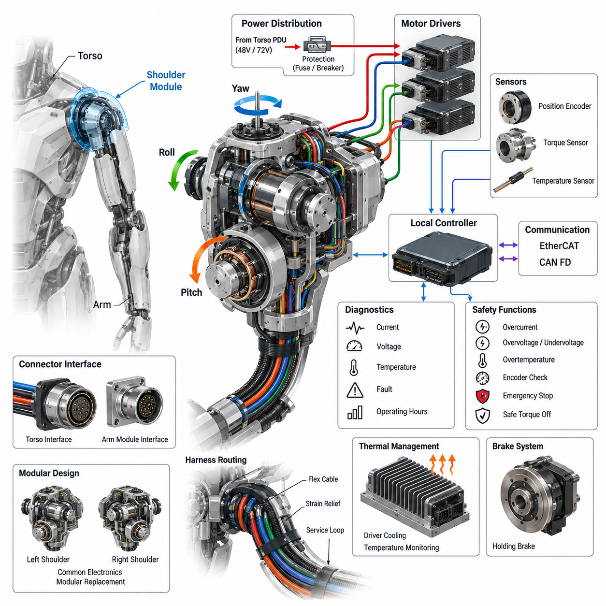
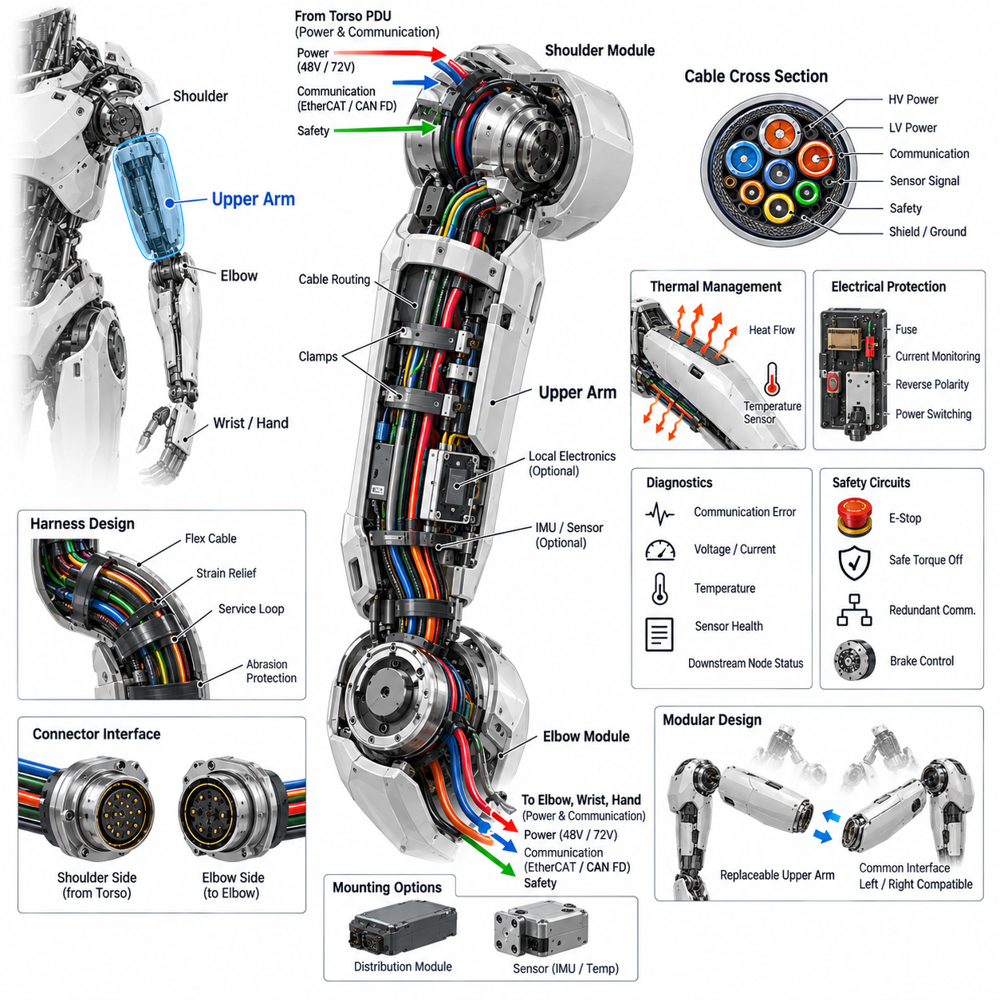
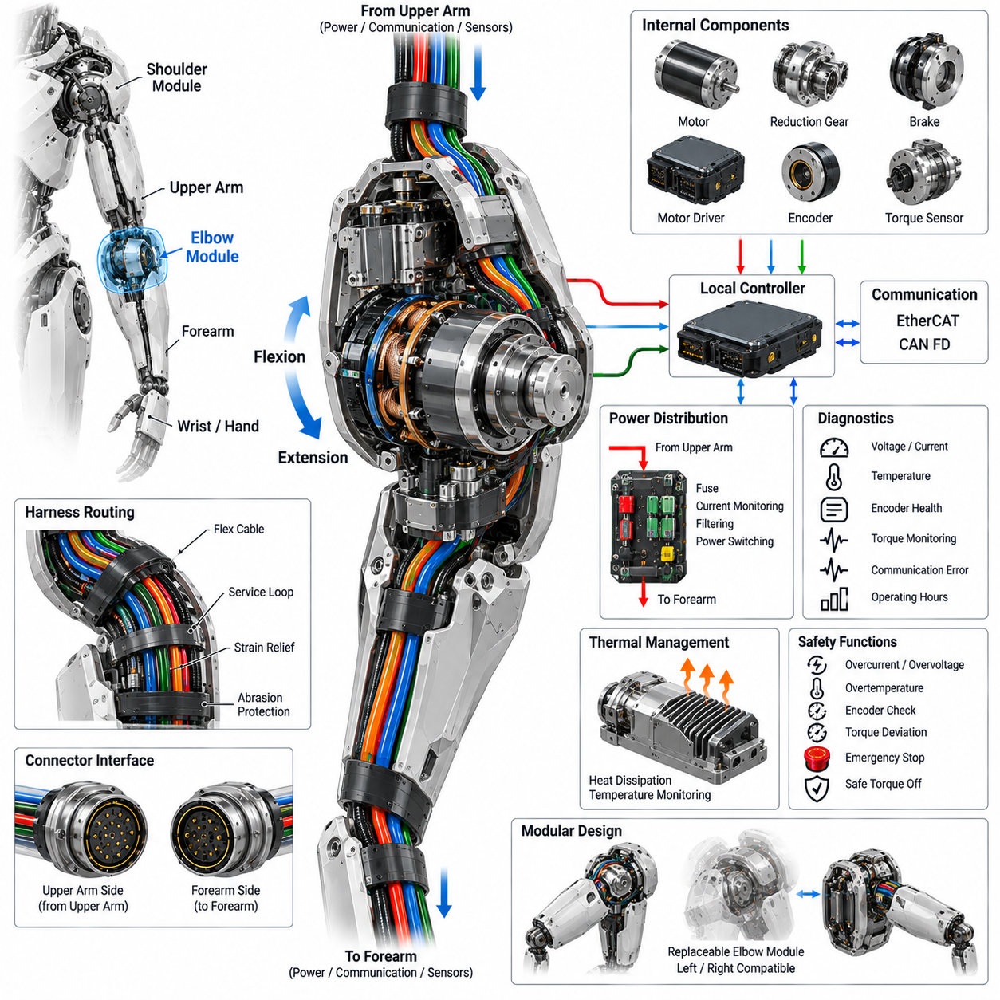
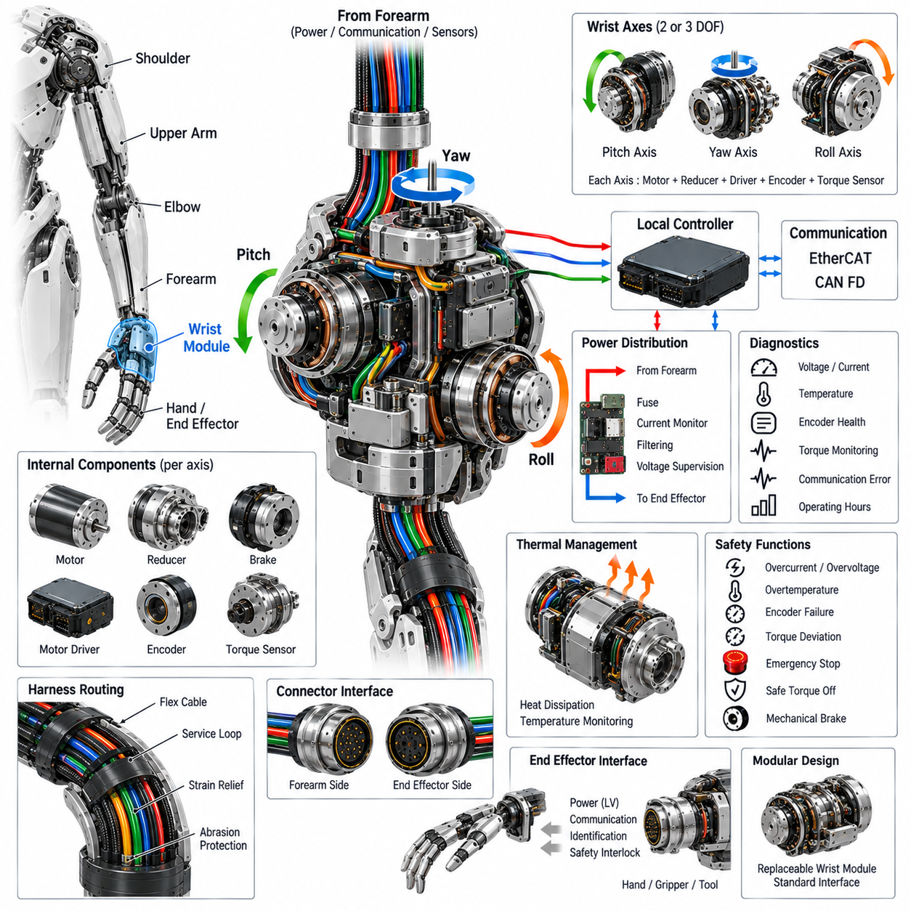
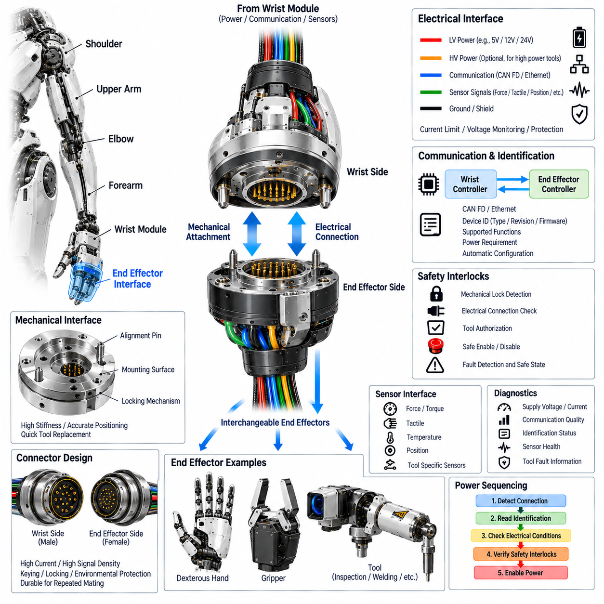
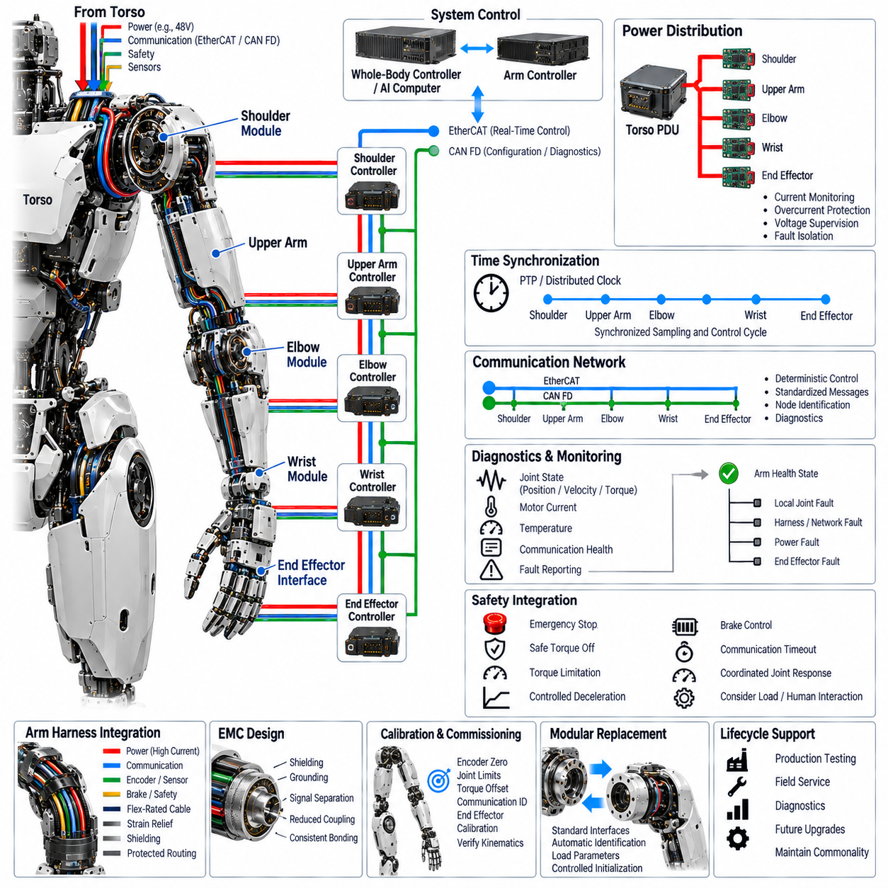

**Volume 21. Humanoid Electrical Architecture**

# Chapter 05. Arm Electrical Architecture

## 05.01. Shoulder Module

{width="7.268055555555556in" height="7.268055555555556in"}

The shoulder module is the primary electrical and electromechanical interface between the humanoid torso and the arm. Unlike a conventional industrial robot joint, it must support several rotational degrees of freedom within a compact volume while carrying substantial dynamic loads. Its electrical architecture therefore combines high-power actuation, precise sensing, real-time communication, protection, and local diagnostics as an integrated subsystem.

A typical humanoid shoulder implements two or three coordinated rotational axes representing motions comparable to shoulder pitch, roll, and yaw. Each axis may contain a motor, reduction mechanism, motor driver, position encoder, torque sensing interface, temperature sensing, and optional holding brake. These components must operate as a coordinated multi-axis module rather than as independent joints because shoulder motion strongly affects arm trajectory, balance, and whole-body dynamics.

Electrical power is normally delivered from the torso power distribution architecture through a dedicated shoulder power branch. The shoulder interface must carry sufficient current for simultaneous acceleration of multiple actuators while maintaining acceptable voltage drop and thermal margins. Local bulk capacitance can reduce transient bus disturbances caused by rapid torque changes, while branch protection isolates an electrical fault in one arm without unnecessarily disabling unrelated body subsystems.

Motor drives should be located close enough to the shoulder actuators to minimize high-current phase wiring and electromagnetic interference, but packaging must consider heat generated by power semiconductors and motors. Integrated drives can reduce harness complexity and connector count, whereas centralized drives may simplify cooling and maintenance. The selected topology therefore represents a tradeoff among thermal management, mass distribution, EMC performance, serviceability, and mechanical packaging constraints.

Position feedback is essential because shoulder errors propagate through the complete arm kinematic chain. Absolute joint encoders are particularly valuable because they provide joint position immediately after power-up without requiring potentially unsafe homing motion. Motor-side incremental or absolute encoders may additionally support commutation and high-bandwidth servo control. Redundant position information can be used to detect encoder disagreement, transmission faults, or unexpected mechanical displacement.

Torque information provides another important feedback channel. Depending on the mechanical architecture, torque may be estimated from motor current or measured through strain-based, load-cell, or dedicated joint torque sensors. Direct torque sensing improves interaction control, collision detection, impedance control, and manipulation safety. The local controller can compare commanded torque, measured torque, motor current, velocity, and position to identify abnormal contact or actuator degradation.

Communication between the shoulder and higher-level control system must support deterministic cyclic control and lower-priority diagnostic traffic. EtherCAT is suitable for tightly synchronized multi-axis servo networks, while CAN FD can provide robust control, configuration, and diagnostic communication depending on the system architecture. The shoulder node should expose standardized joint states, command interfaces, fault information, firmware identification, temperatures, currents, voltages, and accumulated operating statistics.

Precise synchronization is especially important when several shoulder axes move together or when arm control is coordinated with the torso, head, legs, and perception system. Joint position, torque, and current measurements should therefore be associated with a common time base. Deterministic communication and synchronized sampling reduce phase errors between sensor feedback and actuator commands, improving Cartesian trajectory accuracy, impedance behavior, and whole-body control stability.

The shoulder harness experiences repeated bending, twisting, and combined rotational motion, making cable routing fundamentally different from static torso wiring. Power, communication, encoder, brake, and sensor circuits must pass through or around several moving axes without exceeding minimum bend radius or torsional limits. Flex-rated conductors, controlled service loops, strain relief, abrasion protection, and mechanically constrained routing are required to achieve acceptable operating life.

Connector placement should support both reliability and modular replacement. A practical architecture separates the torso-to-shoulder interface from internal actuator connections so that the complete arm or shoulder assembly can be removed without disturbing the torso harness. Connectors should provide mechanical keying, secure locking, appropriate current capacity, shielding continuity where required, and protection against incorrect assembly. Service access must not compromise structural stiffness or motion range.

Thermal monitoring is necessary because shoulder actuators can experience high continuous and peak torque during lifting, carrying, manipulation, and recovery from disturbances. Temperature sensors can monitor motor windings, driver power stages, local electronics, and selected structural locations. The controller can apply progressive thermal derating before reaching shutdown limits, allowing the humanoid to reduce arm performance gracefully instead of abruptly losing an important degree of freedom.

Functional safety requires the shoulder to transition predictably when faults occur. Overcurrent, overvoltage, undervoltage, encoder disagreement, excessive temperature, communication timeout, unexpected torque, overspeed, and driver faults should be detected locally. Depending on severity, responses can range from torque limitation and controlled deceleration to brake engagement or safe torque removal. Fault containment should prevent a single shoulder failure from propagating through the body power or communication network.

Emergency-stop behavior requires particular attention because simply removing motor torque can allow a loaded arm to fall under gravity. The safe response therefore depends on arm configuration, actuator transmission, brake design, and stored mechanical energy. A coordinated sequence may command controlled deceleration before disabling drive torque and applying holding mechanisms. Safety design must consider both electrical isolation and the mechanical consequences of losing active shoulder control.

Local diagnostics transform the shoulder from a collection of actuators into an observable intelligent module. Runtime monitoring can track phase current, bus current, joint position, torque, temperature, communication errors, brake operation, and driver fault history. Trend information such as increasing friction, rising operating temperature, encoder deviation, or changing current-to-torque relationships can support predictive maintenance before degradation develops into an operational failure.

The shoulder controller also forms a boundary between high-rate joint servo control and higher-level embodied intelligence. AI or whole-body planners may request trajectories, poses, forces, or manipulation actions, but deterministic local controllers must translate these requests into bounded actuator commands. This separation prevents variable-latency perception and AI workloads from directly controlling power electronics while preserving the responsiveness required for physical interaction.

From a system perspective, the shoulder should be treated as a replaceable zonal mechatronic module with defined power, communication, timing, safety, and diagnostic interfaces. Standardization allows left and right shoulder assemblies to share electronics, firmware, connectors, and service procedures wherever mechanical constraints permit. Such modularity reduces manufacturing complexity and enables future actuator generations to be introduced without redesigning the complete humanoid electrical architecture.

## 05.02. Upper Arm

{width="7.268055555555556in" height="7.268055555555556in"}

The upper arm forms the structural and electrical link between the shoulder module and the elbow module, carrying mechanical loads while providing protected paths for power, communication, sensing, and safety circuits. In a humanoid robot, this section cannot be treated as a passive mechanical link because its mass, wiring topology, thermal behavior, and service interfaces directly influence arm dynamics, reliability, and maintainability.

The electrical architecture of the upper arm is closely coupled to the distributed joint-module concept used throughout the humanoid. Power and communication arriving from the shoulder must continue toward the elbow, wrist, and hand while supporting any electronics located within the upper-arm structure. This creates a hierarchical distribution path in which the upper arm functions simultaneously as a mechanical member, cable-routing zone, and electrical interconnection segment.

Power conductors must be sized according to the maximum simultaneous demand of downstream actuators rather than only the local load. Elbow, wrist, and hand operation can produce rapidly changing current profiles that pass through the upper-arm harness. Conductor resistance, connector contact resistance, allowable voltage drop, transient current, ambient temperature, and bundle derating must therefore be considered together when defining the power path through the arm.

A practical design separates high-current actuator power from low-voltage electronics and sensitive sensor circuits. Physical separation, controlled routing, twisted pairs, shielding, and appropriate grounding reduce coupling from motor switching edges into encoder and communication signals. Where the available cross section is limited, harness geometry becomes part of the electromagnetic compatibility strategy rather than merely a packaging issue.

Communication through the upper arm typically connects the shoulder-side controller or network branch to the elbow and distal arm modules. EtherCAT can provide deterministic high-rate communication for synchronized servo control, while CAN FD may support robust control, diagnostics, configuration, or secondary devices. The architecture should minimize unnecessary network conversions because each gateway introduces additional complexity, latency, diagnostic states, and potential failure modes.

The upper-arm harness must tolerate repeated movement generated primarily at the shoulder and elbow boundaries. Although the central section may experience less articulation than the joints themselves, cables can still undergo bending, torsion, vibration, and axial movement during large arm trajectories. Flex-rated wiring, strain relief, controlled service loops, abrasion-resistant sleeves, and defined clamp locations are therefore necessary to prevent fatigue failures over the robot operating life.

Routing near the shoulder requires particular attention because multi-axis shoulder rotation can twist the entire arm harness. The harness should enter the upper arm through a mechanically controlled transition that prevents concentrated bending at connectors or cable exits. Mechanical hard stops, routing guides, or defined torsional sections can ensure that motion is distributed across an intended cable length instead of being concentrated at a vulnerable termination point.

At the elbow end, the harness must transition from the relatively rigid upper-arm structure into another highly dynamic joint region. Connector orientation and cable exit direction should be selected according to the elbow rotation envelope so that the harness does not interfere with link motion or become trapped between structural components. Electrical design must therefore be validated against the complete three-dimensional kinematic envelope of the arm.

The upper-arm structure may also provide mounting locations for local electronic modules, sensors, or intermediate distribution components. These devices should be positioned to minimize unsupported cable length while avoiding excessive thermal exposure and mechanical stress. Distributed electronics can reduce wiring complexity, but additional modules increase mass and inertia. Because upper-arm mass is carried by the shoulder, even relatively small electrical components can affect actuator sizing and energy consumption.

Thermal behavior must be considered at both the electrical and mechanical levels. Heat generated by shoulder or elbow actuators can conduct into the upper-arm structure, while current flowing through bundled conductors and connectors creates additional losses. Temperature sensors placed at critical locations can provide information for thermal derating, fault detection, and lifetime estimation. Ventilation or conduction paths may be required where enclosed covers restrict natural cooling.

Sensors embedded in the upper arm can improve system observability beyond conventional joint feedback. Depending on the humanoid architecture, inertial sensors, temperature sensors, structural strain sensors, or distributed tactile elements may be incorporated into the link. Such measurements can support collision detection, structural load estimation, vibration monitoring, calibration, and diagnostic functions when correlated with shoulder and elbow position, torque, and motor-current information.

Electrical protection should prevent a downstream failure from damaging the complete arm harness or torso power system. The protection architecture may include branch current monitoring, fusing, electronic circuit protection, reverse-polarity protection, and controlled power switching according to system requirements. Fault localization should distinguish between shoulder, upper-arm wiring, elbow, wrist, and hand failures so that service personnel can identify the affected replaceable module efficiently.

Grounding and shielding continuity through the upper arm are essential because the arm contains multiple moving interfaces and detachable connectors. Shield termination strategy should maintain a controlled return path without creating unintended ground loops. Structural metal components may contribute to chassis bonding, but they should not be assumed to provide reliable electrical continuity unless bonding surfaces, fasteners, coatings, corrosion behavior, and assembly processes are explicitly engineered.

Serviceability strongly influences the connector and harness architecture. The upper arm should ideally be removable without cutting wires, opening permanent splices, or disassembling unrelated body sections. Clearly defined shoulder-side and elbow-side electrical interfaces allow the upper-arm assembly to become a replaceable unit. Connector keying, labeling, locking mechanisms, and accessible placement reduce assembly errors and shorten field replacement and production maintenance time.

Diagnostics should continuously evaluate the integrity of the upper-arm electrical path. Communication error counters, supply voltage, branch current, temperature, sensor validity, and downstream node availability provide evidence about harness and connector condition. Intermittent communication errors associated with particular arm poses can indicate cable fatigue or connector problems, while increasing voltage drop under load can reveal contact degradation before complete electrical failure occurs.

Safety-related circuits passing through the upper arm require additional design discipline. Emergency-stop paths, safe torque control signals, redundant communication channels, or brake-control circuits should not share single points of failure where separation is required by the safety concept. Mechanical damage to the upper-arm harness must be considered because a single crushed or severed cable bundle could otherwise affect several actuators and feedback channels simultaneously.

The upper arm also represents an important interface between real-time motion control and distal manipulation functions. Commands generated by whole-body control or embodied AI systems ultimately propagate through deterministic joint controllers, while state information from the elbow, wrist, and hand returns through the same physical region. Sufficient communication bandwidth and predictable timing are therefore required to preserve coordinated reaching, manipulation, force control, and human interaction.

From a modular architecture perspective, the upper arm should be designed as a standardized electrical zone with defined input and output interfaces rather than as custom wiring between two joints. Standard conductor assignments, network interfaces, connector families, diagnostic identifiers, grounding rules, and service procedures simplify left-right arm commonality and manufacturing. This approach also allows future elbow, wrist, or hand modules to evolve without requiring complete redesign of the humanoid arm electrical system.

## 05.03. Elbow Module

{width="7.268055555555556in" height="7.268055555555556in"}

The elbow module provides the primary rotational interface between the upper arm and forearm, enabling controlled flexion and extension while transferring mechanical loads through the humanoid arm. Its electrical architecture must integrate the actuator, motor driver, position feedback, torque sensing, thermal monitoring, communication, and safety functions within a compact and highly dynamic joint. Because elbow motion directly affects wrist and hand positioning, electrical performance must support precise and repeatable joint control.

The elbow actuator is typically composed of a high-torque motor, reduction mechanism, motor driver, encoder, and associated sensing elements. The motor converts electrical power into rotational motion, while the reduction mechanism provides the torque multiplication required for manipulation and load handling. The mechanical transmission must be matched with the electrical control system so that commanded position, velocity, and torque remain predictable across the complete operating range of the elbow.

Electrical power is supplied through the upper-arm harness and distributed to the elbow motor driver and associated electronics. The power path must accommodate peak current during rapid acceleration, deceleration, and high-load manipulation while maintaining acceptable voltage drop and thermal margins. Local energy storage and filtering can reduce transient disturbances on the main bus, while branch protection should isolate an elbow fault without unnecessarily interrupting power to the wrist, hand, or other humanoid subsystems.

The motor driver performs the real-time conversion between electrical commands and motor phase currents. A local driver located near the actuator can reduce high-current wiring length and improve control responsiveness, while also allowing current, voltage, and temperature information to be monitored locally. The driver should support controlled torque generation, current limiting, overvoltage and undervoltage protection, thermal derating, and rapid fault response so that abnormal electrical conditions do not propagate into mechanical instability.

Position sensing is fundamental to elbow control because even a small angular error can produce a significant displacement at the wrist and end effector. An absolute encoder can provide immediate joint position after power-up, while an additional motor-side encoder may support commutation and high-bandwidth servo control. Encoder health should be continuously evaluated through signal validity, position consistency, velocity plausibility, and communication status to identify sensor degradation or mechanical transmission abnormalities.

Torque feedback provides an additional control and safety layer for the elbow. Torque may be estimated from motor current or measured through a dedicated torque sensor located within the transmission. Direct torque measurement can improve impedance control, force interaction, collision detection, and manipulation accuracy. The local controller can compare commanded torque with measured or estimated torque and motor current to detect unexpected loads, mechanical resistance, or abnormal contact with the environment.

The elbow communication interface connects the local joint controller with the upper-arm, wrist, and higher-level control architecture. EtherCAT can provide deterministic cyclic communication for coordinated servo control, while CAN FD can provide a robust alternative or complementary network for configuration, diagnostics, and lower-bandwidth control functions. The communication interface should expose joint position, velocity, torque, current, temperature, fault status, and operating information through a consistent data model.

Timing consistency is important because elbow motion must remain coordinated with the shoulder, wrist, hand, and whole-body controller. Sensor sampling and actuator commands should therefore use a defined time base and deterministic communication cycle. Synchronization reduces phase differences between command and feedback signals and improves trajectory tracking, impedance behavior, and coordinated manipulation. Where multiple joints operate simultaneously, timing errors can otherwise appear as unwanted vibration or end-effector positioning errors.

The elbow harness must withstand repeated angular motion and mechanical vibration throughout the robot lifetime. Cables entering the elbow joint are exposed to bending, torsion, friction, and repeated cyclic movement, making routing and strain relief critical reliability factors. Flex-rated conductors, controlled service loops, protected cable passages, appropriate bend radii, and mechanically fixed termination points should be used so that movement is distributed along the harness rather than concentrated at connectors or soldered joints.

Connector architecture must allow the elbow module to be electrically isolated and replaced without unnecessary disassembly of the upper arm or wrist. Power, communication, encoder, torque sensor, brake, and auxiliary sensor connections should use appropriately rated connectors with mechanical keying and secure locking. Connector placement must also consider the complete elbow motion envelope so that cables and connectors do not become trapped, stretched, or exposed to excessive bending during maximum flexion and extension.

Thermal management is required because the elbow actuator can experience high continuous torque during lifting and manipulation. Heat can originate from motor windings, reduction components, driver power stages, and electrical connections. Temperature monitoring should therefore cover critical thermal sources and provide information for progressive torque derating before a thermal limit is reached. The mechanical housing can also be designed as a heat conduction path when appropriate, allowing actuator and driver losses to be transferred toward controlled cooling surfaces.

Functional safety requires the elbow to respond predictably to electrical, sensing, communication, and mechanical faults. Relevant conditions include overcurrent, overvoltage, undervoltage, excessive temperature, encoder disagreement, torque deviation, overspeed, communication timeout, and motor-driver failure. Depending on severity, the controller may reduce torque, command controlled deceleration, disable the drive, or activate a holding brake. Fault containment should prevent a single elbow failure from disabling unrelated arm or body functions.

Emergency-stop behavior must consider the physical consequences of removing active torque from the elbow. If the forearm is carrying a payload, sudden torque removal may allow the arm to move under gravity or stored mechanical energy. The safety strategy should therefore define whether controlled deceleration, torque limitation, brake engagement, or safe torque off is appropriate for each operating condition. Electrical safety cannot be separated from the mechanical state of the arm during an emergency transition.

Local diagnostics should make the elbow module independently observable and serviceable. The controller can monitor bus voltage, motor current, phase current, encoder status, torque behavior, temperature, communication errors, brake operation, and accumulated operating time. Abnormal relationships between these parameters can provide early indications of bearing wear, transmission friction, connector degradation, sensor problems, or motor deterioration. Diagnostic information should be retained with standardized fault identifiers to support production testing and field service.

The elbow module should ultimately function as a standardized replaceable joint within the distributed humanoid electrical architecture. Its interfaces to the upper arm and wrist should define consistent power, communication, sensing, safety, and diagnostic boundaries. Modularization allows the elbow actuator or electronics to be replaced without redesigning the surrounding arm system and supports future improvements in motor technology, sensing, control electronics, and safety functions. This approach also enables common left and right arm engineering practices where the mechanical configuration permits.

## 05.04. Wrist Module

{width="7.268055555555556in" height="7.268055555555556in"}

The wrist module provides the final multi-axis articulation between the forearm and the end-effector interface, enabling precise orientation and positioning of the hand or attached tool. Because wrist motion directly determines the orientation of objects during manipulation, its electrical architecture must provide high-resolution position feedback, controlled torque, deterministic communication, compact power distribution, and robust safety functions. The module must achieve these functions within a small mechanical envelope where mass and inertia have a strong influence on arm performance.

A typical humanoid wrist may integrate two or three rotational axes corresponding to wrist pitch, yaw, and roll, depending on the required dexterity and mechanical configuration. Each axis can contain a compact actuator, reduction mechanism, motor driver, encoder, torque sensing element, and temperature sensor. The electrical architecture should coordinate these axes as a single local subsystem while maintaining independent monitoring and fault detection for each actuator. This enables coordinated orientation control while preserving fault containment at the individual joint level.

Power is supplied from the forearm electrical interface and distributed to the wrist actuators and local electronics. Because wrist actuators are generally smaller than shoulder or elbow actuators, the required power may be lower, but rapid changes in torque and velocity can still generate significant current transients. The local power path should therefore include appropriate filtering, branch protection, current monitoring, and voltage supervision. Protection should prevent a failed wrist actuator from propagating an electrical fault into the forearm or end-effector system.

The motor drivers should be positioned close to the wrist actuators whenever packaging and thermal constraints permit. Short motor-phase connections reduce resistive losses, electromagnetic emissions, and harness complexity while improving the responsiveness of the local servo loop. The driver should support current control, torque control, overcurrent protection, thermal monitoring, voltage supervision, and controlled shutdown. Where multiple wrist axes share a compact electronics region, thermal coupling between drivers must also be considered during simultaneous high-load operation.

High-resolution position feedback is particularly important at the wrist because small angular errors can produce large orientation errors at the end effector. Absolute encoders can provide immediate joint position after power-up, while motor-side feedback can support commutation and high-bandwidth servo control. Encoder signals should be continuously checked for validity, consistency, unexpected discontinuities, and communication errors. Where safety or precision requirements justify it, redundant position information can be used to detect sensor disagreement and abnormal mechanical transmission behavior.

Torque sensing provides the wrist with an additional layer of interaction awareness. Torque may be estimated from motor current or measured using a dedicated joint torque sensor. Direct torque measurement is particularly useful for impedance control, compliant manipulation, collision detection, grasp stabilization, and force-aware tool operation. The local controller can compare commanded torque, measured torque, motor current, and joint acceleration to distinguish expected dynamic behavior from unexpected external contact or mechanical resistance.

The wrist communication interface connects the local joint controller with the forearm network and the end-effector control system. EtherCAT can provide deterministic multi-axis servo communication where precise synchronization is required, while CAN FD can provide robust control, configuration, and diagnostic communication for compact devices. The interface should use a consistent data model covering joint position, velocity, torque, current, temperature, operating state, fault status, and diagnostic information. This allows the wrist to remain a standardized node within the humanoid distributed control architecture.

Timing synchronization is important because wrist motion must remain coordinated with the elbow, forearm, hand, and whole-body controller. Position and torque samples should be associated with a common time reference, and actuator commands should be executed within predictable communication cycles. Accurate synchronization improves trajectory tracking and orientation control while reducing phase errors during rapid coordinated movements. This becomes particularly important when the hand interacts with objects while the arm is simultaneously moving through space.

The wrist harness is one of the most mechanically demanding electrical connections in the arm because it must accommodate repeated rotation close to the end effector. Power, communication, encoder, torque sensor, brake, and auxiliary sensor conductors may experience continuous bending and torsion. Flex-rated cables, controlled service loops, strain relief, abrasion protection, and carefully defined bend radii are therefore essential. Cable routing should ensure that repeated movement is distributed across the flexible section rather than concentrated at a connector or solder termination.

Connector design must support both compact packaging and frequent service access. The forearm-to-wrist interface should provide secure power, communication, sensor, and safety connections while allowing the wrist module to be removed without disturbing the upstream arm harness. Connector keying and mechanical locking should prevent incorrect assembly, while contact ratings must accommodate expected current and signal requirements. Connector placement should also remain outside mechanically hazardous regions throughout the complete wrist motion envelope.

Thermal management becomes challenging because the wrist provides limited physical space for heat dissipation while containing motors, reduction mechanisms, drivers, and sensors. Temperature monitoring should therefore be applied to critical heat sources, particularly motor windings and driver power stages. The wrist housing can be used as a thermal conduction path when suitable materials and interfaces are available. If temperature approaches a defined limit, the local controller can progressively reduce allowable torque or speed instead of immediately disabling the joint.

Functional safety must account for the consequences of unexpected wrist motion because the end effector may be holding a payload or interacting directly with a person or object. Relevant fault conditions include overcurrent, overvoltage, undervoltage, overtemperature, encoder failure, torque deviation, overspeed, communication timeout, and driver malfunction. Depending on the safety concept, the wrist may respond through torque limitation, controlled deceleration, safe torque off, or mechanical braking. The selected response must consider both electrical fault isolation and the mechanical state of the hand or tool.

Local diagnostics should provide continuous visibility into wrist health and operating condition. Monitoring can include supply voltage, motor current, encoder status, torque behavior, temperature, communication quality, actuator state, and accumulated operating time. Correlating these parameters can reveal increasing friction, abnormal load, sensor degradation, connector problems, or motor performance changes. Diagnostic identifiers and operating histories should be retained in a standardized form so that production testing, field service, and predictive maintenance can use the same information.

The wrist should also provide a controlled electrical boundary for the end-effector interface. Power and communication supplied to a hand, gripper, tool, or other payload should be separated and protected according to the expected load and safety requirements. The interface may support different voltage rails, communication links, identification signals, and safety interlocks depending on the end-effector architecture. Standardization allows different tools to be attached without requiring fundamental changes to the wrist actuator electronics.

From a modular architecture perspective, the wrist should be implemented as a replaceable intelligent joint with defined mechanical, electrical, communication, safety, and diagnostic interfaces. Its internal electronics should remain sufficiently independent from the forearm and end-effector so that a failed actuator or controller can be replaced without redesigning adjacent modules. This modular boundary also supports future improvements in compact motors, encoders, torque sensors, communication devices, and control electronics while preserving the overall humanoid arm architecture.

## 05.05. End Effector Interface

{width="7.268055555555556in" height="7.268055555555556in"}

The end-effector interface forms the electrical and mechanical boundary between the humanoid wrist and interchangeable tools such as a dexterous hand, gripper, or specialized manipulator. Unlike an internal joint interface, it must accommodate different payload architectures while maintaining standardized power, communication, identification, and safety functions. The interface should therefore isolate tool-specific requirements from the wrist actuator system and provide a predictable connection point for future end-effector designs.

The mechanical interface must provide accurate positioning, sufficient structural stiffness, and secure attachment during dynamic manipulation. Alignment features, locating pins, locking mechanisms, and defined mounting surfaces should prevent unintended movement between the wrist and attached device. The interface must tolerate the expected force, torque, vibration, and payload conditions without excessive deformation. Mechanical design should also support rapid replacement so that different hands or tools can be installed without disturbing the wrist module or upstream arm structure.

Electrical power should be provided through a protected interface capable of supporting the expected end-effector load. A low-voltage supply may support hand electronics, embedded controllers, sensors, communication devices, and small actuators, while higher-power requirements may require a separately defined power rail. Current limits, voltage monitoring, branch protection, and controlled power switching should be implemented so that a short circuit or failed tool cannot propagate into the wrist or arm power network.

Communication must allow the wrist or higher-level controller to exchange commands and status information with the attached end effector. CAN FD or another suitable deterministic interface can support compact tool controllers, while Ethernet-based communication may be appropriate for higher-bandwidth devices. The interface should define standardized messages for device status, actuator state, sensor information, fault reporting, configuration, and control. The communication architecture should allow tools from different generations to operate through a common interface.

Automatic end-effector identification can simplify tool replacement and system configuration. When a hand, gripper, or specialized tool is connected, the interface may provide identification information such as device type, hardware revision, firmware version, supported functions, power requirements, communication capabilities, and calibration information. The wrist controller can use this information to establish an appropriate operating profile without requiring extensive manual configuration, provided that the identification mechanism itself is reliable and protected.

Safety interlocks are essential because the end effector may contain moving mechanisms, sharp tools, high-force actuators, or other potentially hazardous functions. The interface should be capable of confirming secure mechanical attachment, valid electrical connection, acceptable communication status, and appropriate tool authorization before enabling operation. If an interlock becomes invalid, the system should place the end effector into a defined safe state and prevent unintended actuator activation.

Sensor and feedback interfaces may be required for advanced hands and tools. Depending on the end-effector architecture, the connection can carry force, tactile, position, temperature, current, contact, or tool-specific sensor information. These signals should be time-consistent with wrist and arm state information so that manipulation controllers can correlate tool feedback with joint motion. High-bandwidth sensor interfaces should be physically and electrically protected from motor power switching noise.

The interface should provide appropriate grounding and electromagnetic compatibility between the wrist and end effector. Power returns, signal grounds, chassis bonding, and communication shielding should be defined rather than left dependent on mechanical contact. Where shielded communication is used, the shield termination strategy should maintain signal integrity without creating unintended current paths or ground-loop problems. Connector construction and pin assignment should also prevent accidental connection of power to sensitive signal contacts.

Connector selection must balance current capacity, signal density, mechanical strength, mating cycles, environmental protection, and serviceability. A compact connector may need to carry power, communication, identification, safety, and sensor signals within a single controlled interface. Mechanical keying should prevent incorrect orientation, while locking mechanisms should resist vibration and repeated manipulation. The connector should remain accessible enough for replacement while being protected from direct impact and excessive mechanical loading.

Diagnostics should extend across the interface so that the wrist controller can distinguish a tool fault from a wrist or upstream arm fault. Supply voltage, current, communication quality, identification status, interlock state, sensor validity, and tool-reported fault information can be monitored during operation. Fault records should identify whether the problem originated in the connector, power path, communication link, or attached device. This separation improves serviceability and prevents unnecessary replacement of healthy wrist components.

The interface should support controlled power sequencing when an end effector is attached or removed. Power should not necessarily be applied immediately when a connector is physically mated; the system can first verify identification, electrical conditions, communication availability, and safety interlocks before enabling the tool. During removal, actuator commands should be disabled and stored or residual energy should be managed before electrical disconnection. This sequence reduces the possibility of unintended motion, connector arcing, or damage to sensitive electronics.

From a modular architecture perspective, the end-effector interface should be treated as a standardized platform boundary rather than a tool-specific wiring arrangement. A common mechanical mounting pattern combined with defined power rails, communication channels, identification, sensor interfaces, and safety interlocks allows multiple end effectors to share the same wrist architecture. This approach enables a humanoid robot to transition between dexterous hands, grippers, inspection tools, and specialized equipment while preserving the common electrical architecture of the arm.

## 05.06. Arm Integration

{width="7.268055555555556in" height="7.268055555555556in"}

Arm integration combines the shoulder, upper arm, elbow, wrist, and end-effector interface into one coordinated electrical and electromechanical subsystem. Each module may operate as an independent functional unit, but the complete arm must behave as a synchronized chain of actuators, sensors, controllers, power paths, communication links, and safety functions. The integration architecture therefore defines common interfaces and operating rules that allow all arm modules to exchange power, commands, feedback, timing information, and diagnostic states.

The arm power architecture must provide a controlled electrical path from the torso power distribution system through the shoulder and upper-arm harness to the elbow, wrist, and end-effector interface. Power branches should be sized for simultaneous actuator demand while considering voltage drop, transient current, thermal limits, connector capacity, and protection coordination. Local protection and current monitoring should allow faults to be isolated at the smallest practical zone so that a failure in one joint does not unnecessarily disable the complete arm or other humanoid subsystems.

Communication integration connects the distributed joint controllers into a deterministic arm control network. EtherCAT can support synchronized high-rate servo control across multiple arm axes, while CAN FD can provide robust control, configuration, and diagnostic communication for selected modules. The network architecture should maintain consistent node identification, message definitions, fault reporting, and command interfaces. Unnecessary gateways should be minimized because additional conversions can introduce latency, complexity, and additional diagnostic failure modes.

Time synchronization is essential because shoulder, elbow, wrist, and end-effector states must be interpreted within a common temporal reference. Position, velocity, torque, current, and sensor measurements should be timestamped or sampled according to a defined synchronization mechanism. Coordinated actuator commands should then be executed within predictable communication cycles. Accurate timing improves trajectory tracking, impedance control, force interaction, and end-effector positioning, especially when several arm joints move simultaneously.

The arm harness must integrate high-current power, communication, encoder, torque, brake, safety, and auxiliary sensor circuits while supporting repeated multi-axis movement. Routing must account for the combined motion of the shoulder, elbow, and wrist rather than treating each joint independently. Flex-rated cables, controlled service loops, strain relief, shielding, separation of noisy and sensitive circuits, and protected transitions between modules are required to maintain electrical integrity throughout the complete arm motion envelope.

Electromagnetic compatibility must be considered at the integrated arm level because motor drivers and switching power circuits can generate disturbances that affect encoders, torque sensors, communication links, and end-effector electronics. Power and signal paths should be physically organized to reduce coupling, while grounding and shielding strategies should provide controlled return paths. The arm structure, connectors, cable shields, and local electronics should follow consistent bonding rules so that integration does not create unintended ground loops or discontinuities.

Each arm module should expose standardized status and diagnostic information to the arm-level controller. Joint position, velocity, torque, motor current, temperature, supply voltage, communication health, encoder status, and local fault conditions can be combined into an overall arm health state. The controller should distinguish local actuator faults from harness, network, power, or end-effector faults. This hierarchical diagnostic structure makes fault localization more efficient and supports maintenance without unnecessarily replacing healthy modules.

Safety integration must coordinate the responses of all arm joints because removing torque from one actuator can affect the mechanical state of the entire arm. Emergency-stop, safe torque off, torque limitation, controlled deceleration, brake control, and communication timeout responses should therefore be defined consistently across the shoulder, elbow, wrist, and end-effector interface. The selected response must consider whether the arm is unloaded, holding an object, interacting with a person, or supporting a tool with stored mechanical energy.

The arm controller should provide a clear boundary between high-level motion planning and deterministic local actuator control. Whole-body control or embodied AI systems may generate arm trajectories, poses, forces, or manipulation commands, while local joint controllers translate these requests into bounded motor commands. Feedback from the arm is returned through the same integrated architecture so that higher-level systems can observe joint states, interaction forces, faults, and end-effector conditions without directly controlling individual power stages.

Calibration and commissioning should treat the arm as an integrated kinematic and electrical system rather than a collection of independent modules. Encoder zero positions, joint limits, torque offsets, current measurements, communication identifiers, and end-effector calibration data must be consistent across the complete arm chain. Verification should confirm that commanded joint motion produces the expected end-effector motion and that sensor feedback remains consistent across different arm configurations and operating conditions.

The integrated arm architecture should support modular replacement without requiring extensive reconfiguration of the surrounding humanoid system. Shoulder, upper-arm, elbow, wrist, and end-effector modules should have defined mechanical, electrical, communication, safety, and diagnostic boundaries. A replacement module should be identifiable through standardized device information and should be able to establish communication, verify electrical conditions, load appropriate parameters, and enter an enabled state through a controlled initialization sequence.

From a lifecycle perspective, arm integration provides the foundation for production testing, field service, diagnostics, and future upgrades. Manufacturing tests can verify power distribution, communication, sensor operation, actuator response, safety functions, and end-effector interfaces as an integrated system. During field operation, the same standardized interfaces allow faults to be localized to replaceable modules. This architecture preserves commonity across arm configurations while allowing future motors, sensors, controllers, harnesses, and end effectors to evolve without redesigning the complete humanoid electrical system.
