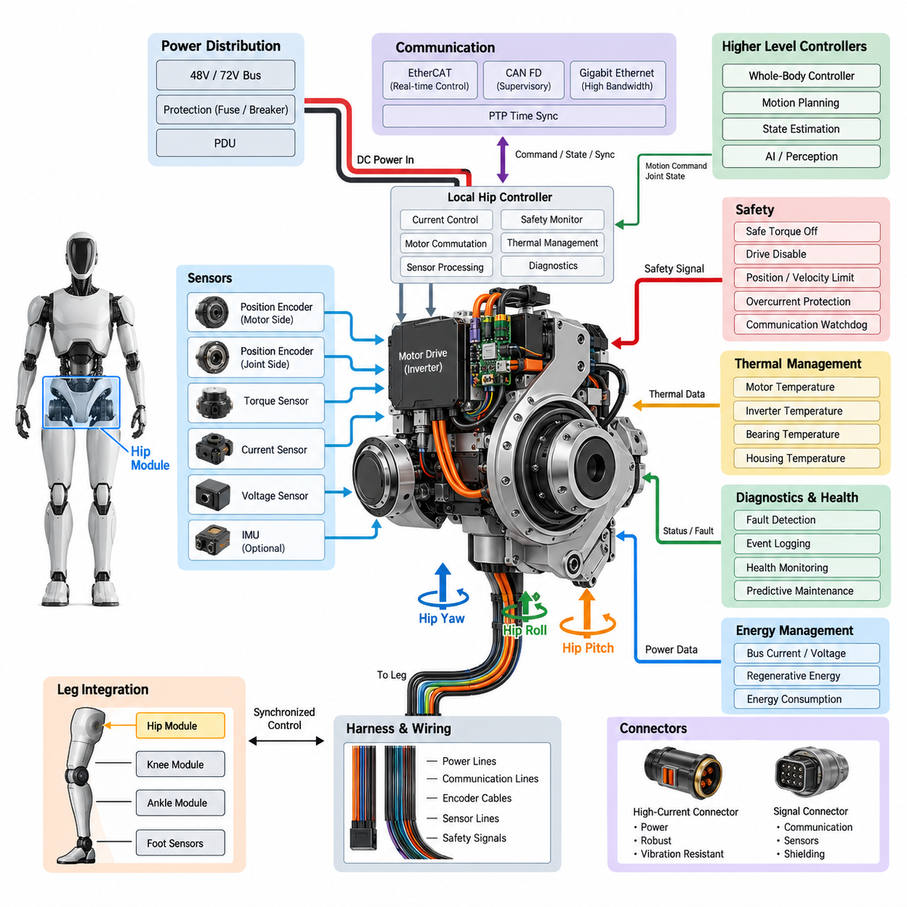
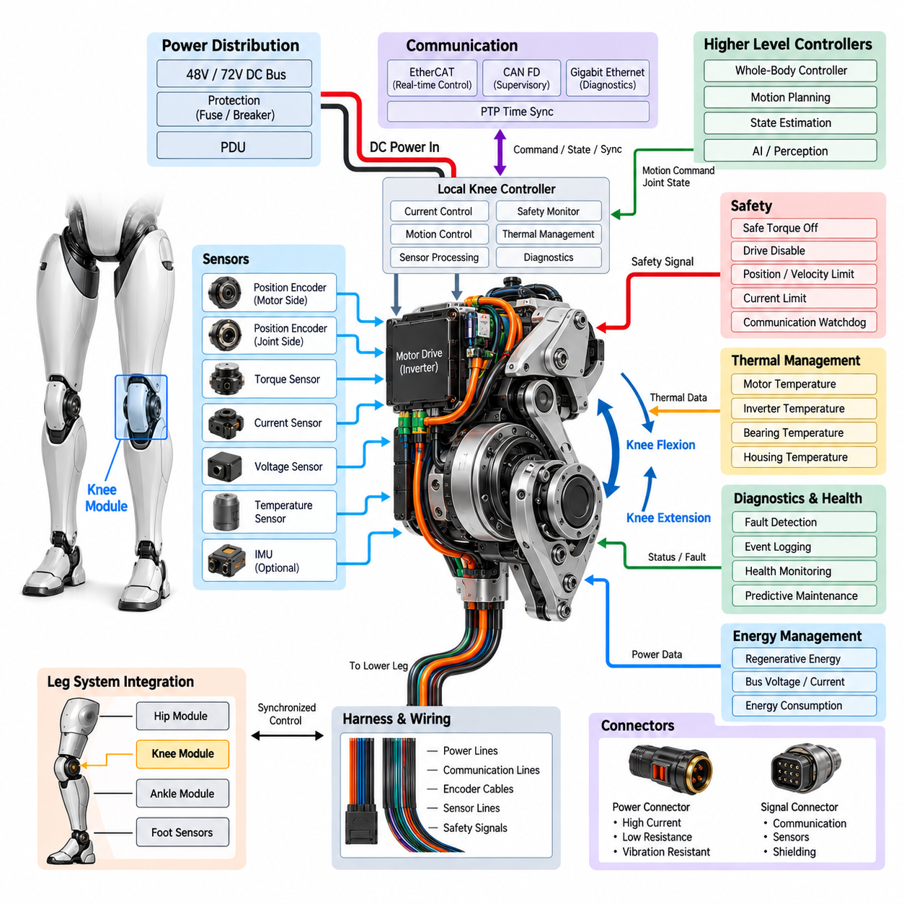
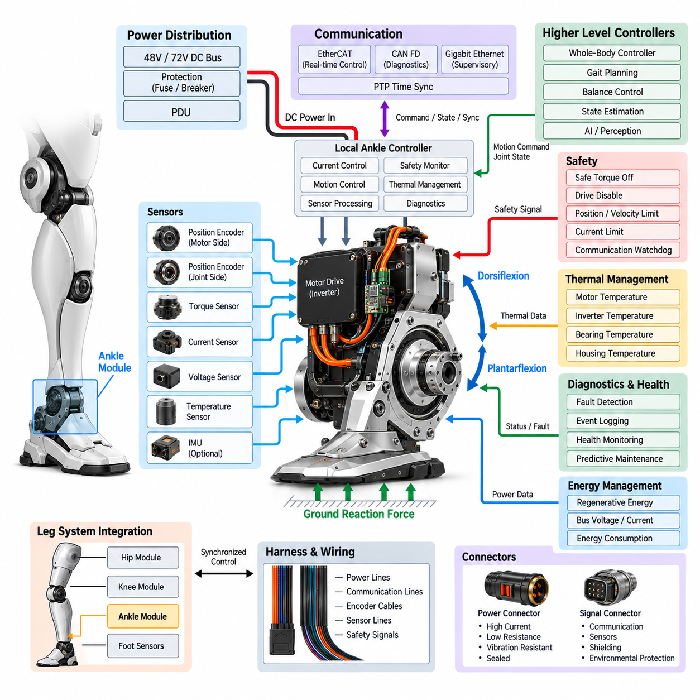
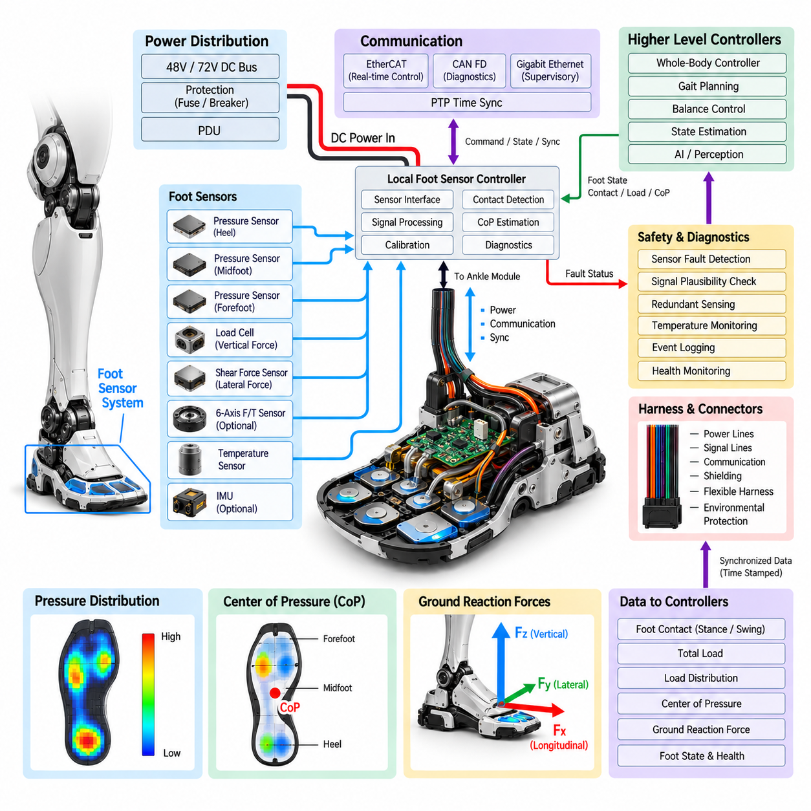
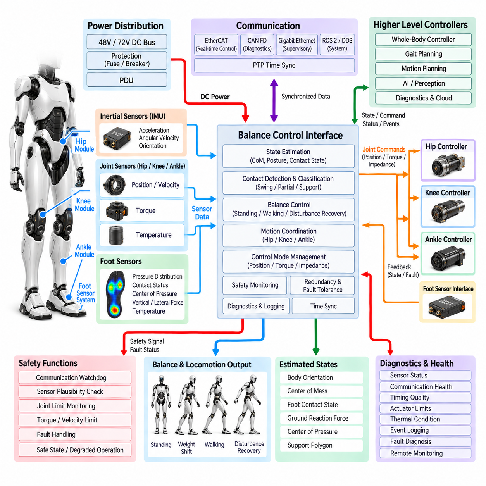
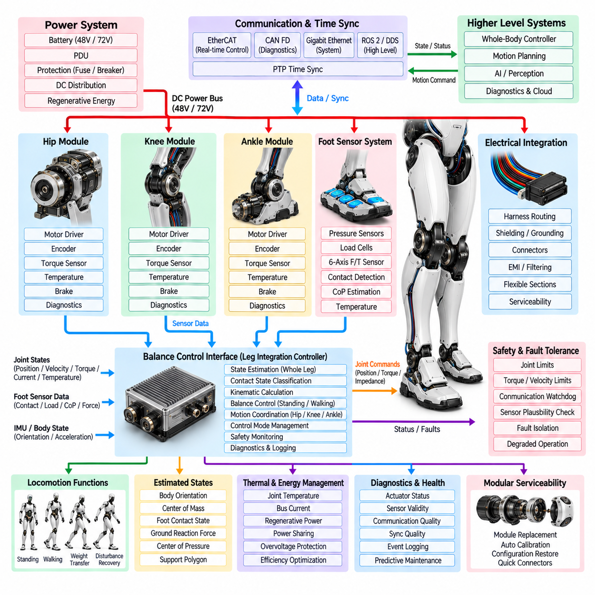

**Volume 21. Humanoid Electrical Architecture**

# Chapter 06. Leg Electrical Architecture

## 06.01. Hip Module

{width="7.268055555555556in" height="7.268055555555556in"}

The hip module forms the primary electromechanical interface between the humanoid torso and each leg, carrying high mechanical loads while providing the controlled rotational motion required for standing, walking, turning, and dynamic balance. Its electrical architecture must therefore combine high-power actuation, precise sensing, deterministic communication, and safety supervision within a compact joint region. The module operates as part of the distributed leg architecture defined around hip, knee, ankle, foot sensing, balance control, and integrated leg functions.

A humanoid hip commonly requires multiple controlled degrees of freedom to reproduce the essential motion of a human hip. Hip yaw rotates the leg around the vertical axis, hip roll shifts the body laterally, and hip pitch drives forward and backward leg motion. Each axis can be implemented as an electrically independent actuator channel containing a motor, inverter or servo drive, position sensing, current measurement, temperature monitoring, and local control electronics. Coordinated control of these channels allows the pelvis to regulate both locomotion and posture.

Electrical power for the hip originates from the humanoid power distribution architecture and is delivered through protected high-current branches. Depending on the platform, the actuator bus may use a 48 V or 72 V class distribution system, consistent with the broader power architectures identified for the humanoid platform. Local capacitors near the motor drives reduce transient voltage disturbances caused by rapid torque commands, while branch protection isolates faults before they propagate toward the torso power distribution unit or the opposite leg.

The motor drive converts DC bus energy into controlled multiphase current for each hip actuator. Field-oriented control is typically executed at a high update rate so that motor torque can follow commands generated by the joint or whole-body controller. Phase-current sensors provide the feedback required for torque-producing current regulation, while DC-link voltage and current measurements support power supervision. Regenerative energy produced during leg deceleration can return through the DC bus, requiring coordinated handling by the drive, power distribution system, and battery subsystem.

Joint position is normally measured with absolute or high-resolution encoders so that the controller can determine the physical configuration of the leg immediately after startup. Motor-side and joint-side sensing may both be used where transmission elasticity, backlash, or reduction mechanisms make a single measurement insufficient. Redundant or diverse position information can also support plausibility checking. Accurate hip angle measurement is especially important because small angular errors at the pelvis can produce significantly larger displacement errors at the foot and disturb whole-body balance.

Torque information provides another critical feedback channel. The architecture may estimate joint torque from calibrated motor current, obtain it from a dedicated torque sensor, or combine both approaches. Direct torque sensing is valuable for compliant control, contact detection, disturbance rejection, and human-safe interaction. Comparing commanded torque, measured motor current, joint acceleration, and sensed output torque also creates a powerful diagnostic relationship for detecting mechanical binding, unexpected external loads, transmission degradation, or actuator faults.

The hip module requires extensive thermal supervision because walking repeatedly subjects its actuators and power electronics to high current. Temperature sensors can be placed in motor windings, inverter power stages, bearings, housings, and nearby structural regions. Local software evaluates warning and shutdown thresholds and can request torque derating before hardware reaches a damaging temperature. Thermal data should also be transmitted to higher-level health monitoring so that repeated overload patterns can be distinguished from isolated high-load events.

Communication between the hip and higher-level controllers should provide deterministic delivery of torque commands, joint states, fault information, and synchronization data. EtherCAT or another real-time network can serve high-bandwidth synchronized motion control, while CAN FD can support supervisory control, diagnostics, or selected distributed functions. The humanoid architecture explicitly separates these communication technologies together with Gigabit Ethernet, ROS 2/DDS, MQTT, and PTP synchronization, allowing each network layer to be assigned according to timing and bandwidth requirements.

Time synchronization is particularly important when hip measurements are fused with knee, ankle, foot, IMU, and perception information. Position, velocity, torque, and inertial measurements should correspond to a known common time reference so that the whole-body controller reconstructs the robot state consistently. Hardware-assisted timestamps and synchronized servo cycles reduce phase error between joints. Without adequate synchronization, individually accurate sensors can still produce an inconsistent body state during fast walking, impact recovery, or dynamic manipulation.

Local control electronics provide a boundary between the high-rate actuator loops and the central real-time computer. The local controller can execute current regulation, encoder acquisition, motor commutation, thermal monitoring, limit enforcement, and immediate fault reactions without depending on a remote software process. Higher-level controllers then generate desired position, velocity, impedance, or torque references. This distributed arrangement reduces communication latency sensitivity and allows critical protective functions to remain active even when higher-level communication becomes temporarily unavailable.

Hip wiring presents a difficult packaging problem because several high-current power conductors, communication links, encoder cables, sensor lines, and safety signals must cross a mechanically active region. Harness routing must tolerate repeated flexing while avoiding pinch points, excessive bending, abrasion, and electromagnetic coupling from motor phase conductors. Power and sensitive signal paths should be separated where practical, with controlled shielding and grounding applied to encoder and communication circuits. Service loops must accommodate the full hip range without becoming mechanically uncontrolled.

Connectors within the module must tolerate vibration, repeated motion, assembly loads, and service operations while maintaining low electrical resistance. High-current actuator connections require adequate contact area, temperature margin, retention, and protection against accidental disconnection. Signal connectors require reliable shielding and controlled impedance where high-speed communication is involved. Connector placement should also support modular replacement, because a hip actuator or controller that can be electrically isolated and replaced as a unit substantially reduces humanoid maintenance time.

Safety supervision must prevent an electrical or communication fault from producing uncontrolled hip motion. Independent drive-disable paths, safe torque off functions, current limits, joint position limits, velocity supervision, and communication watchdogs can form complementary protection layers. When a fault is detected, the correct reaction depends on robot state: immediate torque removal may be appropriate in some conditions, while controlled torque reduction or coordinated transition into a stable posture may reduce the risk of collapse in others.

Fault containment is especially important because the hip sits close to the center of mass and can generate forces capable of moving the entire robot. Overcurrent, encoder disagreement, excessive temperature, inverter faults, communication timeout, abnormal torque, and supply undervoltage should be detected locally whenever possible. Fault information should include timestamps and operating context so that the diagnostic system can reconstruct events. Persistent health records can later support predictive maintenance and distinguish electrical degradation from mechanical wear.

The hip module also participates directly in energy management. Walking efficiency depends not only on motor efficiency but on trajectory planning, transmission characteristics, regenerative operation, and coordinated energy exchange between joints. Measurements of bus current, motor current, torque, velocity, and temperature allow the controller to calculate joint-level energy consumption. Aggregated over complete gait cycles, this information helps identify inefficient movement patterns and provides useful feedback for optimizing locomotion algorithms and actuator sizing.

Integration with the remaining leg architecture requires the hip to operate as one element of a synchronized kinetic chain rather than as an isolated actuator assembly. Hip motion establishes the global orientation and trajectory of the leg, while the knee changes effective leg length and the ankle and foot regulate ground interaction. Electrical interfaces must consequently support synchronized state exchange with the knee module, ankle module, foot sensor system, and balance control interface that follow the hip within the chapter structure.

A well-designed hip electrical architecture therefore combines actuator power, servo control, precision sensing, deterministic networking, thermal management, flexible harnessing, diagnostics, and functional safety in a replaceable modular assembly. The engineering objective is not simply to generate high torque, but to deliver accurately controlled torque with known timing, measurable health, predictable fault behavior, and efficient energy use. This makes the hip module one of the most safety-critical and performance-critical electrical subsystems in a humanoid robot.

## 06.02. Knee Module

{width="7.268055555555556in" height="7.268055555555556in"}

The knee module forms the intermediate electromechanical joint between the humanoid upper leg and lower leg, converting electrical energy into the controlled flexion and extension required for walking, standing, crouching, climbing, and recovery from disturbances. Because the knee repeatedly supports substantial portions of the robot mass, its electrical architecture must combine high-torque actuation, precise joint sensing, deterministic control, thermal protection, and reliable fault handling within a mechanically constrained structure.

Unlike the multi-axis hip, the primary knee function is generally dominated by a flexion-extension axis, allowing its actuator architecture to be optimized around one highly loaded rotational degree of freedom. The electrical subsystem typically integrates a motor, inverter or servo drive, encoder interfaces, current sensing, temperature sensing, local processing, and communication electronics. Mechanical transmission may use a high-ratio reducer, planetary mechanism, harmonic drive, belt system, ball screw, or other arrangement selected according to torque density, efficiency, compliance, and packaging requirements.

Electrical power is supplied from the humanoid power distribution system through a protected actuator branch. A 48 V or 72 V class DC bus can provide the energy required for high instantaneous knee torque while limiting conductor current compared with lower-voltage architectures. Local DC-link capacitance supports rapid acceleration demands and suppresses voltage fluctuations near the inverter. Branch fuses, electronic protection, or circuit breakers provide fault containment so that a knee electrical failure does not disable unrelated joints or propagate into the central power distribution system.

The motor drive regulates multiphase motor current according to torque commands received from the local or whole-body controller. Field-oriented control enables accurate torque production over the operating speed range and supports smooth transitions between acceleration, constant motion, deceleration, and regenerative operation. Phase-current sensing is therefore a fundamental part of the knee drive. DC-bus voltage and current measurements provide additional information for power limitation, fault detection, efficiency analysis, and coordination with the battery and power distribution architecture.

Knee position feedback must remain accurate across the full mechanical travel because errors directly influence effective leg length and foot placement. Absolute encoders can provide joint position immediately after startup without requiring a potentially unsafe homing motion. Where a transmission exists between the motor and joint output, separate motor-side and joint-side encoders can identify backlash, elastic deformation, transmission errors, or mechanical slippage. Their measurements can also be compared continuously to detect sensor or drivetrain abnormalities.

Torque feedback is essential because the knee carries substantial dynamic loads during locomotion. Torque may be estimated from motor current, measured using a dedicated joint torque sensor, or obtained by combining both methods. Direct sensing improves force control and provides information about unexpected ground impacts or external disturbances transmitted through the leg. Comparing requested torque, measured torque, current, velocity, and acceleration also enables diagnostic algorithms to identify abnormal friction, mechanical obstruction, transmission wear, or excessive external loading.

The knee frequently experiences high transient loads during foot contact, stair climbing, rapid direction changes, squatting, and recovery maneuvers. These conditions require careful thermal monitoring of the motor windings, inverter switching devices, bearings, transmission, and structural housing. Local temperature measurements allow the controller to apply progressive torque or current derating before critical limits are reached. Thermal history can additionally reveal persistent overload or increasing mechanical resistance before either condition develops into a permanent failure.

Regenerative operation is particularly relevant to the knee because negative mechanical work occurs during many locomotion phases. When the knee controls downward body motion or decelerates the lower leg, the motor can operate as a generator and return electrical energy to the DC bus. The inverter must control this energy without creating excessive bus voltage. Coordination with the battery, PDU, other actuators, and energy management system determines whether regenerated energy is stored, consumed by other joints, limited, or dissipated through an appropriate protection mechanism.

A local knee controller can execute high-frequency current and servo loops independently from higher-level motion planning. It acquires encoder, current, torque, voltage, and temperature information while controlling motor commutation and enforcing local limits. The whole-body controller supplies higher-level position, velocity, torque, or impedance references according to gait and balance objectives. This distributed architecture keeps time-critical motor functions close to the hardware while allowing central computing resources to coordinate the complete humanoid body.

Deterministic communication connects the knee controller to the hip, ankle, balance controller, and central real-time computing architecture. EtherCAT can provide synchronized cyclic communication for tightly coordinated motion, while CAN FD can support diagnostics, supervisory commands, configuration, or lower-bandwidth control functions. Joint measurements should carry reliable timing information so that data from the hip, knee, ankle, foot sensors, and inertial measurement system can be interpreted within the same whole-body state estimation cycle.

Time synchronization becomes increasingly important as gait speed and dynamic motion increase. Even a small temporal mismatch between knee angle, hip motion, ankle torque, foot contact, and IMU acceleration can produce an incorrect estimate of leg configuration or body dynamics. Synchronized servo cycles, common clock references, and hardware-assisted timestamps reduce these errors. The resulting temporal consistency improves whole-body control, balance estimation, contact interpretation, disturbance rejection, and reconstruction of events during diagnostic analysis.

The knee harness must accommodate repeated flexion and extension over millions of operating cycles. Power conductors, encoder cables, communication lines, sensor wiring, and safety circuits should be routed so that bending occurs within controlled regions rather than at connector terminations. Minimum bend radius, torsional loading, abrasion, strain relief, and mechanical interference must be considered throughout the full joint range. High-current motor conductors should also be separated from sensitive encoder and communication wiring wherever packaging permits.

Connector architecture should support both electrical reliability and modular maintenance. High-current contacts require low resistance, secure locking, adequate thermal margin, and vibration resistance, while communication and sensor connections may require shielding and controlled impedance. Connector orientation should reduce incorrect assembly and protect contacts during module replacement. A serviceable knee design allows the actuator, controller, sensors, or complete joint module to be electrically isolated and replaced without extensive disassembly of the entire humanoid leg.

Safety functions must prevent uncontrolled knee motion because sudden loss or generation of torque can immediately destabilize a standing humanoid. Safe torque off, independent drive disable, current limitation, position and velocity limits, communication watchdogs, encoder plausibility checks, and thermal shutdown provide complementary protection. However, safety response should consider the whole-body condition. Abruptly removing knee torque while supporting body weight can cause collapse, making controlled torque reduction or coordinated transition to a stable posture preferable in selected fault conditions.

Diagnostic supervision should continuously evaluate relationships among command signals, encoder measurements, motor current, torque, temperature, voltage, and communication status. Overcurrent, encoder disagreement, excessive following error, abnormal torque, thermal overload, bus undervoltage, communication timeout, or unexpected mechanical resistance should generate identifiable fault states. Timestamped event records preserve the conditions surrounding each event and support field diagnostics, root-cause analysis, health monitoring, and predictive maintenance.

At the leg level, the knee cannot be treated as an isolated servo axis. Hip motion establishes the overall leg trajectory, the knee adjusts effective leg length and contributes strongly to vertical body support, while the ankle and foot regulate ground contact and balance forces. The knee controller must therefore exchange synchronized state information with the hip module, ankle module, foot sensor system, and balance control interface defined within the leg electrical architecture, allowing coordinated control of the entire kinetic chain.

A robust knee electrical architecture ultimately combines high-torque motor control, precise position and torque sensing, synchronized communication, regenerative power handling, thermal management, flexible harness engineering, diagnostics, and functional safety within a compact replaceable module. Its purpose is not merely to bend and extend the leg, but to generate predictable joint behavior under rapidly changing mechanical loads while preserving balance, energy efficiency, fault containment, and reliable coordination with the complete humanoid control system.

## 06.03. Ankle Module

{width="7.268055555555556in" height="7.268055555555556in"}

The ankle module forms the lower electromechanical joint of the humanoid leg and provides the controlled interface between the lower leg and foot. Its electrical architecture is responsible for generating and regulating ankle motion during standing, walking, running, turning, impact absorption, and balance recovery. Because the ankle directly interacts with ground contact forces, its actuator, sensing, power, communication, and safety functions must operate with high timing accuracy and predictable torque response. The module therefore serves as a critical interface between leg motion control and foot-ground interaction.

The ankle normally provides controlled plantarflexion and dorsiflexion, while additional mechanical or electrically controlled degrees of freedom may be included depending on the humanoid design. Its actuator subsystem typically integrates a motor, inverter or servo drive, encoder interface, current sensing, temperature monitoring, and local control electronics. Mechanical transmission is selected according to required torque density, range of motion, efficiency, compliance, and packaging constraints. The architecture must remain compact because the ankle is located close to the ground and contributes directly to the robot\'s overall foot geometry and mass distribution.

Electrical power is supplied from the leg power distribution architecture through a protected actuator branch. A 48 V or 72 V class DC bus can provide the instantaneous power required for rapid ankle torque generation while reducing current compared with lower-voltage systems. Local DC-link capacitance supports fast current changes and reduces voltage disturbances near the inverter. Protection devices isolate overcurrent and short-circuit conditions, while the power path should be designed so that an ankle fault remains contained and does not unnecessarily disable the knee, hip, or other critical electrical subsystems.

The ankle motor drive converts DC bus power into controlled multiphase motor current according to torque, velocity, or position commands. Field-oriented control provides precise torque regulation and supports rapid transitions between positive torque, negative torque, and regenerative operation. Current sensing is required for closed-loop motor control and protection, while DC-bus voltage and current measurements support power supervision and energy management. Because ankle torque can change rapidly during foot contact, the drive must provide sufficiently high control bandwidth to reproduce commanded behavior without excessive delay or oscillation.

Accurate ankle position feedback is essential for determining foot orientation and the configuration of the complete leg. An absolute encoder can provide joint position immediately after startup and avoid unnecessary homing procedures. Where the actuator contains a reduction mechanism or elastic transmission, motor-side and output-side position measurements can be combined to detect transmission deformation, backlash, slippage, or abnormal motion. Encoder data should be evaluated together with velocity and torque information so that the controller can distinguish normal contact-induced motion from sensor or mechanical faults.

The ankle is particularly important for torque and force control because it directly regulates the mechanical relationship between the leg and the ground. Torque can be estimated from motor current, obtained through a dedicated joint torque sensor, or determined using a combination of electrical and mechanical measurements. During stance, accurate ankle torque helps maintain body posture and regulate the center of pressure. During swing, precise control contributes to foot trajectory and orientation. Abnormal torque patterns can also reveal unexpected impacts, mechanical resistance, transmission wear, or changes in ground interaction.

Foot contact introduces strong transient mechanical loads and requires careful thermal and mechanical monitoring of the ankle actuator. Temperature sensors can monitor motor windings, inverter power devices, bearings, transmission components, and housing regions. When temperature approaches predefined limits, local control can progressively reduce available torque or current rather than immediately shutting down the actuator. This thermal protection strategy is particularly important because repeated high-load gait cycles can accumulate heat even when individual torque commands remain within short-term electrical limits.

Regenerative operation can occur when the ankle absorbs mechanical energy during controlled body descent, impact management, or negative work during walking. The motor can act as a generator and return energy to the DC bus, but the inverter must regulate this process so that bus voltage remains within an allowable range. Coordination with the battery, PDU, and other actuators determines how regenerated energy is handled. Energy may be stored, consumed by other loads, limited by the controller, or otherwise managed according to the operating condition and available electrical capacity.

The local ankle controller should execute high-rate control and monitoring functions close to the actuator. It can acquire encoder, torque, current, voltage, and temperature information while executing motor commutation, current control, local motion limits, and immediate fault responses. Higher-level controllers provide desired position, velocity, torque, or impedance references based on gait planning and whole-body balance. This distributed arrangement reduces dependence on communication latency and allows essential actuator protection and control functions to continue even when higher-level computing is temporarily unavailable.

Deterministic communication connects the ankle with the knee, hip, foot sensing system, balance controller, and central real-time computing architecture. EtherCAT can provide synchronized cyclic communication for coordinated joint control, while CAN FD can support diagnostics, configuration, supervisory functions, or lower-bandwidth control. Time synchronization is especially important because ankle state must be interpreted together with foot contact, knee position, hip motion, and inertial measurements. Common timing references and hardware-assisted timestamps improve the consistency of whole-body state estimation and contact detection.

The ankle harness must withstand repeated motion, vibration, impact, and environmental exposure while remaining sufficiently flexible throughout the joint range. Power conductors, encoder cables, communication lines, sensor wiring, and safety signals should be routed with controlled bend regions, appropriate strain relief, and protection against abrasion or mechanical interference. Connectors must provide secure retention and low electrical resistance while supporting serviceability. Because the ankle is close to the ground, sealing and environmental protection may also be important when the humanoid operates on dusty, wet, or contaminated surfaces.

Safety and diagnostics must prevent uncontrolled ankle torque from creating unstable foot motion or loss of balance. Safe torque off, drive disable, current limitation, position and velocity limits, communication watchdogs, encoder plausibility checks, thermal protection, and fault monitoring provide complementary protection layers. Diagnostic software should continuously compare commanded motion with measured position, velocity, torque, current, voltage, temperature, and communication status. Timestamped events support fault reconstruction, health monitoring, field diagnostics, and predictive maintenance.

The ankle must ultimately operate as part of the complete leg rather than as an isolated actuator. The hip establishes the overall leg trajectory, the knee controls effective leg length and major load support, and the ankle regulates foot orientation, contact force, and final balance adjustment. The ankle therefore exchanges synchronized state information with the hip module, knee module, foot sensor system, and balance control interface. A robust ankle electrical architecture integrates precise actuation, sensing, regenerative power handling, thermal management, communication, harness engineering, diagnostics, and functional safety so that the foot remains controllable and stable across the full range of humanoid locomotion.

## 06.04. Foot Sensor System

{width="7.268055555555556in" height="7.268055555555556in"}

The foot sensor system forms the primary electrical sensing interface between the humanoid robot and the ground. It provides measurements required to determine foot contact, load distribution, center of pressure, ground reaction behavior, and the mechanical state of the supporting foot. Because these measurements directly influence balance and locomotion, the system must provide high sampling accuracy, low latency, reliable synchronization, and robust operation under repeated impact and compression. Within the leg architecture, it follows the hip, knee, and ankle modules and provides essential information to the subsequent balance control interface.

A humanoid foot sensor system can combine multiple sensing technologies according to the required level of locomotion performance. Force-sensitive resistors, load cells, strain-gauge structures, piezoelectric elements, capacitive pressure sensors, and multi-axis force-torque sensors can be used individually or in combination. Distributed pressure sensing provides information about how load is spread across the sole, while concentrated force sensors provide higher accuracy for total vertical and horizontal loads. The architecture should be selected according to required force range, resolution, response time, durability, packaging space, and manufacturing cost.

The most important electrical function is reliable detection of foot-ground contact. Contact information allows the controller to distinguish stance and swing phases and provides a fundamental constraint for whole-body motion control. Multiple sensing regions can be distributed across the heel, midfoot, and forefoot so that contact can be detected progressively rather than as a simple binary event. Combining pressure, force, ankle torque, and joint position information improves contact confidence and reduces the possibility that a single failed sensor will produce an incorrect gait state.

Load measurement is required to estimate how much of the robot\'s weight is supported by each foot. The system can measure vertical force directly or estimate it by combining distributed pressure measurements with calibrated sensor models. During double-support walking, left and right foot loads can be compared to evaluate weight transfer. During single-support motion, the supporting foot should exhibit a load pattern consistent with the estimated whole-body state. Abnormal load distribution can indicate slipping, unexpected contact, mechanical deformation, sensor drift, or an incorrect balance-control assumption.

Center of pressure is another important output of the foot sensor system. By combining the forces measured at multiple locations, the controller can estimate where the resultant ground reaction force acts beneath the foot. Center-of-pressure movement provides a direct indication of balance behavior during standing and locomotion. When the estimated center of pressure approaches the physical support boundary, the balance controller can modify ankle torque, leg configuration, or whole-body motion to maintain stability. Accurate spatial calibration is therefore as important as individual sensor accuracy.

The electrical interface must condition weak sensor signals before they are processed by the local controller. Strain gauges and other analog sensing elements may require excitation circuits, instrumentation amplifiers, filtering, offset compensation, and high-resolution analog-to-digital conversion. Digital pressure or force sensors may instead provide processed measurements through a serial interface. Signal conditioning should preserve dynamic information while rejecting electrical noise generated by motor drives, switching converters, communication systems, and other high-current components located within the leg.

Foot sensing is closely coupled with the ankle actuator because both systems describe the interaction between the robot and the ground. Ankle torque, ankle position, foot force, and center of pressure should therefore be evaluated as a combined state rather than as independent measurements. For example, an unexpected increase in measured foot force should correspond to a physically plausible change in ankle torque and leg configuration. Cross-checking these signals enables the controller to distinguish real contact events from sensor errors and improves the reliability of contact-state estimation.

The foot sensor electronics must withstand repeated mechanical loading and impact throughout the robot\'s operating life. Sensors embedded beneath the sole experience compression, shear, vibration, temperature changes, and repeated loading cycles. Mechanical protection must prevent excessive deformation from damaging sensitive elements while preserving the required measurement response. Electrical components should also be protected against moisture, dust, contamination, and cable damage when the humanoid is expected to operate on realistic indoor or outdoor surfaces.

Calibration is a critical part of the foot sensor architecture because force and pressure measurements are strongly influenced by mechanical assembly, temperature, sensor aging, and mounting conditions. Each sensing element should have an established zero point, scale factor, and calibration relationship. Multi-sensor systems also require spatial calibration so that measurements from different locations can be combined into a common foot coordinate frame. Periodic recalibration or automated zero-offset estimation can compensate for long-term drift and changes introduced by service or component replacement.

Sampling and synchronization requirements depend on the intended control function. Contact detection and dynamic balance require sufficiently fast sampling to capture rapid changes caused by foot impact and load transfer. Measurements should be timestamped using a common time reference so they can be aligned with ankle torque, knee position, hip motion, and IMU data. The humanoid communication architecture includes real-time communication and PTP time synchronization, providing an appropriate framework for maintaining temporal consistency across distributed leg sensors and controllers.

The local foot sensor interface can perform filtering, calibration, plausibility checking, sensor fusion, and fault detection before transmitting information to the balance controller. Local processing reduces communication bandwidth and allows abnormal sensor behavior to be detected close to its source. However, raw or minimally processed measurements may also be retained when required for diagnostics, calibration, machine learning, or post-event analysis. The appropriate division between local processing and centralized computation should be determined by latency, bandwidth, safety, and diagnostic requirements.

Safety monitoring should identify conditions such as sensor saturation, open or short circuits, implausible force combinations, excessive sensor drift, inconsistent left-right loading, and communication loss. Redundant sensing can improve fault tolerance by allowing the controller to compare independent measurements from different regions or sensing principles. A detected sensor fault should not automatically be interpreted as a loss of physical contact; instead, the system should evaluate the remaining valid signals and communicate the confidence level of the estimated contact state to the balance controller.

The wiring and connector design must accommodate the moving foot and ankle while protecting sensitive measurement signals from electrical interference. Low-level analog sensor lines are particularly vulnerable to electromagnetic noise from motor phase currents and switching power electronics. Differential signaling, shielding, appropriate grounding, filtering, and physical separation from high-current conductors can improve signal integrity. Flexible harness sections should tolerate repeated ankle motion, while connectors should provide secure retention, environmental protection, and sufficient serviceability for sensor replacement.

The foot sensor system ultimately provides the physical measurement layer for the balance control interface. The hip, knee, and ankle modules generate and regulate leg motion, while the foot sensors determine how that motion interacts with the ground. Their combined information enables estimation of contact state, vertical loading, pressure distribution, center of pressure, and ground reaction behavior. A robust architecture therefore treats the foot sensor system as an integrated part of the leg electrical system rather than as a collection of independent sensors, providing synchronized and trustworthy measurements for stable humanoid locomotion.

## 06.05. Balance Control Interface

{width="7.268055555555556in" height="7.268055555555556in"}

The balance control interface forms the real-time electrical and data interface between the leg subsystems and the humanoid whole-body control architecture. It combines hip, knee, ankle, and foot sensor information to determine the current support condition of the robot and to generate coordinated motion commands that maintain posture and stability. Within the leg architecture, it follows the foot sensor system and connects the physical leg measurements to higher-level real-time control, while remaining consistent with the distributed-control, communication, time-synchronization, and functional-safety structures defined elsewhere in the humanoid architecture.

The primary input to the balance interface is the synchronized state of the leg. Hip, knee, and ankle position and velocity measurements describe the geometric configuration of the leg, while joint torque information describes the mechanical loading state. Foot sensors provide contact status, load distribution, center of pressure, and ground interaction information. These measurements should be combined with body inertial information, particularly from the IMU, so that the controller can estimate body orientation, angular motion, support conditions, and the relationship between the center of mass and the supporting foot.

Balance control depends strongly on accurate contact-state estimation. The controller must determine whether each foot is in swing, partial contact, or stable support and must recognize transitions between these states. Foot pressure, vertical load, center of pressure, ankle torque, and joint configuration can be evaluated together to increase confidence in contact detection. This prevents a single sensor signal from unnecessarily changing the locomotion state and provides a more reliable basis for controlling weight transfer, double support, single support, and recovery from unexpected ground interaction.

The electrical interface should provide deterministic communication between the leg controllers and the real-time control computer. EtherCAT can be used for synchronized cyclic exchange of joint commands and measurements, while CAN FD can support supervisory control, configuration, and diagnostics. Higher-level computing may use Gigabit Ethernet, ROS 2/DDS, or other interfaces for broader system coordination. The balance interface should separate time-critical motion data from supervisory and non-real-time traffic so that network congestion cannot directly compromise the control loop.

Time synchronization is fundamental because balance decisions depend on the relative timing of measurements from multiple distributed subsystems. Hip, knee, ankle, foot sensor, and IMU data must correspond to a consistent point in time when the controller estimates body state. PTP-based synchronization and hardware-assisted timestamps can establish a common timing reference across distributed controllers. Synchronized servo cycles reduce phase errors and improve estimation of center of mass motion, ground reaction forces, contact transitions, and dynamic disturbances.

The balance controller combines joint states and ground measurements to estimate the mechanical state of the complete leg. Forward and inverse kinematic relationships can determine foot position and orientation from joint measurements, while measured ground forces and center of pressure provide information about external support. The controller can therefore evaluate whether the current leg configuration is consistent with the intended support condition. When discrepancies occur, the system can modify ankle, knee, and hip commands rather than treating each joint as an independent servo axis.

During standing, the balance interface primarily regulates posture and load distribution while maintaining the center of pressure within a stable support region. Small changes in ankle torque can shift the center of pressure and compensate for body sway, while coordinated knee and hip adjustments can maintain the desired body configuration. Left and right foot loads can be compared to identify asymmetric weight distribution. The electrical interface must therefore deliver sufficiently low-latency force and position information to support continuous corrective control without introducing perceptible oscillation.

During walking, the balance interface must coordinate transitions between single-support and double-support conditions. As one foot leaves the ground, the controller must recognize the reduction in support and redistribute motion commands among the remaining joints and supporting foot. When the opposite foot contacts the ground, measured load and pressure information can confirm the new support condition before the controller transfers the dominant load. This coordination allows the hip, knee, ankle, and foot systems to operate as one controlled kinetic chain rather than as independent local actuators.

Dynamic balance also requires the controller to respond to disturbances such as unexpected contact, foot placement errors, external pushes, or changes in ground conditions. Fast measurements of body acceleration, joint motion, foot force, and center of pressure allow the control system to identify a disturbance and generate compensating joint commands. Depending on the available motion range and actuator capacity, the response may involve ankle strategies, hip strategies, knee motion, foot repositioning, or a coordinated combination of these actions.

The electrical architecture should support multiple control modes because humanoid locomotion changes continuously between different mechanical conditions. Position control may be appropriate for precise trajectory tracking, while torque or impedance control can provide more compliant behavior during contact. The balance interface can therefore transmit position, velocity, torque, or impedance references to local joint controllers. Local controllers remain responsible for high-rate actuator regulation, while the balance layer determines coordinated references based on the estimated whole-body state.

Safety supervision must be integrated into the balance interface because an incorrect balance command can affect the stability of the entire robot. Communication watchdogs, sensor plausibility checks, joint-limit monitoring, torque limits, velocity limits, and fault-state handling should prevent invalid measurements or commands from propagating through the control system. The safety architecture should distinguish between recoverable sensor anomalies and conditions requiring controlled motion reduction or emergency shutdown. Where possible, degraded operation should preserve a stable posture rather than abruptly removing all supporting joint torque.

The interface should also support redundancy and fault-tolerant state estimation. Independent measurements from joint encoders, torque sensors, foot sensors, and the IMU can be compared to identify inconsistencies. For example, an apparent increase in foot load should correspond to physically reasonable ankle torque and body acceleration. If one measurement becomes invalid, the controller can reduce confidence in the affected estimate and use remaining valid signals where the safety architecture permits. This approach improves robustness without assuming that every individual sensor is permanently reliable.

Diagnostics and health information should be exchanged alongside normal balance-control data but should not interfere with the deterministic motion-control path. The interface can report sensor status, communication health, timing quality, actuator limits, thermal conditions, and detected faults to the broader diagnostics architecture. Timestamped events are valuable for reconstructing loss-of-balance incidents because they allow the system to determine whether the initiating condition was a sensor anomaly, communication delay, actuator limitation, unexpected contact, or control-state transition.

The physical electrical interface requires careful separation of high-rate control signals, safety signals, power distribution, and service connections. Communication and sensor lines should be protected from electromagnetic interference generated by high-current motor drives. Differential signaling, shielding, grounding, filtering, and controlled cable routing can preserve signal integrity. The interface should also provide appropriate connectors and service access so that leg modules can be replaced without disturbing unrelated control wiring or requiring extensive reconfiguration of the humanoid electrical system.

The balance control interface ultimately provides the coordination layer that converts distributed leg measurements into stable whole-body behavior. Hip, knee, and ankle actuators generate mechanical motion, while foot sensors and inertial measurements reveal how that motion affects the robot\'s relationship with the ground and its own body dynamics. By synchronizing these measurements, estimating contact and support state, enforcing safety constraints, and generating coordinated joint references, the interface allows the complete leg architecture to function as a unified balance-control system rather than a collection of independent electrical modules.

## 06.06. Leg Integration

{width="7.268055555555556in" height="7.268055555555556in"}

The leg integration architecture combines the hip, knee, ankle, foot sensor system, and balance control interface into one coordinated electromechanical subsystem. Its purpose is to ensure that individual joint modules do not operate as independent actuators, but function together as a synchronized kinetic chain. Power, sensing, communication, timing, safety, and control interfaces must therefore be designed across module boundaries so that the complete leg can generate predictable motion while supporting the humanoid body and maintaining stable interaction with the ground.

The hip, knee, and ankle modules each provide local actuator control, position feedback, torque information, temperature monitoring, and fault supervision. The foot sensor system provides contact, load distribution, center-of-pressure, and ground interaction information. These measurements are collected through deterministic interfaces and combined by the balance control layer. The resulting architecture establishes a clear relationship between joint-level electrical control and whole-leg behavior, allowing local controllers to remain responsible for high-rate actuator regulation while the integration layer coordinates their combined mechanical effect.

Power integration begins with the common humanoid DC distribution system and extends through protected branches to the hip, knee, and ankle drives. A 48 V or 72 V class bus can provide the high instantaneous power required by the leg actuators, while local capacitors stabilize the electrical supply during rapid torque changes. Branch protection must contain short circuits, overcurrent events, and actuator faults so that a failure in one joint does not unnecessarily disable the complete leg or propagate toward the torso power distribution system. Regenerative energy must also be coordinated across the three major joint actuators.

The electrical architecture must maintain a consistent separation between high-power actuator paths and low-level sensing or communication paths. Motor phase conductors can generate electromagnetic interference that affects encoder, torque, foot-pressure, and communication signals. Harness routing, shielding, grounding, differential signaling, filtering, and connector selection must therefore be coordinated across the complete leg rather than designed separately for each module. Flexible sections around the hip, knee, and ankle must accommodate repeated motion while preserving electrical integrity throughout the expected service life.

Joint-state integration requires synchronized position, velocity, torque, current, voltage, and temperature information from the hip, knee, and ankle. The foot sensor system adds contact state, vertical and lateral force, pressure distribution, and center-of-pressure information. These signals must share a consistent coordinate and timing reference so that the controller can determine the physical configuration and loading state of the complete leg. PTP-based synchronization and hardware-assisted timestamps can maintain temporal consistency between distributed controllers, sensors, and the central real-time control system.

The integrated leg controller uses forward and inverse kinematics to relate individual joint states to the position and orientation of the foot. Hip motion determines the global trajectory of the leg, knee motion controls effective leg length and contributes strongly to vertical support, and ankle motion regulates foot orientation and final contact behavior. By combining these relationships with foot measurements, the controller can evaluate whether the measured mechanical state is consistent with the intended motion. This enables coordinated correction instead of independent joint-level reactions.

Contact-state integration is particularly important during locomotion. The leg controller must distinguish swing, partial contact, stable single support, and double-support conditions using information from the foot sensors, ankle torque, joint configuration, and body inertial measurements. A transition between states should be confirmed using multiple physical signals rather than relying on a single threshold. This approach reduces false contact detection and allows the controller to coordinate weight transfer between the two legs while maintaining a stable relationship between the center of mass and the support region.

During standing, the integrated leg architecture maintains body posture by continuously coordinating hip, knee, ankle, and foot information. Small ankle torque corrections can move the center of pressure, while coordinated knee and hip adjustments can compensate for larger body motion or changes in loading. Left and right leg measurements can be compared to detect asymmetric loading or unexpected mechanical conditions. The integration layer therefore transforms local actuator measurements into a complete understanding of how the robot is supporting its body.

During walking, the leg operates as a dynamically changing support mechanism. Before a foot leaves the ground, the controller reduces its support contribution and prepares the opposite leg to accept increased load. When the new foot contacts the ground, pressure, force, ankle torque, and joint-state measurements confirm the transition before the dominant load is transferred. This requires tightly synchronized communication and control between both legs and the whole-body controller. The integration architecture must therefore support continuous transitions rather than discrete independent joint commands.

Dynamic motion also requires coordinated handling of disturbances. An unexpected foot impact, external push, slipping condition, or foot-placement error can produce changes in force and body motion that propagate rapidly through the leg. The integration controller can respond through ankle, knee, and hip strategies depending on the available actuator authority and current support state. Because each joint has different mechanical leverage and dynamic characteristics, the correction must be coordinated rather than generated independently. This allows the leg to absorb disturbances while preserving whole-body stability.

The communication architecture should provide separate paths for deterministic motion control, supervisory functions, diagnostics, and broader system coordination. EtherCAT can support synchronized cyclic exchange between joint controllers and the real-time control layer, while CAN FD can provide configuration, supervision, and selected diagnostic functions. Gigabit Ethernet and ROS 2/DDS can support higher-level system communication. PTP time synchronization establishes the common temporal reference required to align distributed sensor and actuator data without allowing non-real-time traffic to interfere with the critical motion-control path.

The leg integration layer should support multiple control modes according to the mechanical situation. Position control can provide accurate trajectory tracking during selected movements, while torque and impedance control can provide more compliant behavior during ground interaction and disturbance recovery. The balance controller can therefore generate position, velocity, torque, or impedance references for the individual joint controllers. Local actuator electronics remain responsible for high-rate current regulation and protection, while the integration layer determines coordinated references based on the estimated state of the complete leg.

Safety must be implemented across the integrated leg rather than independently within each actuator module. Joint limits, torque limits, velocity limits, communication watchdogs, encoder plausibility, thermal protection, foot-sensor validation, and drive-disable functions must operate consistently across hip, knee, and ankle. A local fault should be contained where possible, but the integration controller must also determine whether the remaining leg can continue operating safely. In selected cases, degraded operation or a controlled transition to a stable posture is preferable to immediately removing torque from all supporting joints.

Redundancy and fault tolerance depend on cross-checking measurements from different physical domains. Joint encoders can be compared with kinematic expectations, torque measurements can be compared with motor current and acceleration, and foot force can be compared with ankle torque and body motion. Inconsistencies can indicate sensor drift, transmission problems, mechanical obstruction, unexpected contact, or communication errors. The integration layer can assign confidence to each state estimate and use valid remaining measurements when the safety architecture permits degraded operation.

Thermal and energy management must also be integrated across the complete leg. Hip, knee, and ankle actuators can simultaneously experience high loads, creating a combined power demand that is greater than the requirement of any individual joint. Their temperatures, bus currents, regenerative power, and torque demands should therefore be evaluated together. During deceleration, one actuator may regenerate energy while another consumes power, allowing energy to circulate through the common DC bus. Coordinated management can improve efficiency while preventing bus overvoltage and excessive thermal accumulation.

Diagnostics should provide a unified representation of the health of the complete leg. The system should monitor actuator state, sensor validity, communication quality, synchronization quality, thermal condition, power behavior, and fault history. Timestamped events should preserve the relationship between joint commands, measured states, foot contact, and detected faults. This allows engineers to determine whether abnormal behavior originated from an actuator, sensor, harness, communication path, mechanical transmission, or higher-level control decision. Such information also provides a foundation for health monitoring and predictive maintenance.

Serviceability is an important consequence of modular leg integration. Hip, knee, ankle, and foot sensor assemblies should be replaceable without requiring complete disassembly of the leg electrical architecture. Connectors, harness branches, local controllers, and calibration information must support controlled module replacement and subsequent verification. After replacement, the system should be able to restore sensor calibration, communication configuration, timing synchronization, and safety parameters before returning the leg to normal operation. This modular approach reduces maintenance time and improves lifecycle reliability.

The complete leg electrical architecture ultimately forms a distributed but tightly coordinated system in which power, sensing, control, communication, safety, and mechanical behavior are integrated across all leg modules. The hip, knee, ankle, and foot sensor system provide complementary information and actuation authority, while the balance control interface converts these distributed signals into coordinated whole-leg behavior. The result is a leg that can support standing, walking, weight transfer, disturbance recovery, and controlled interaction with the ground while maintaining deterministic timing, fault containment, diagnostic visibility, and serviceable modularity.
