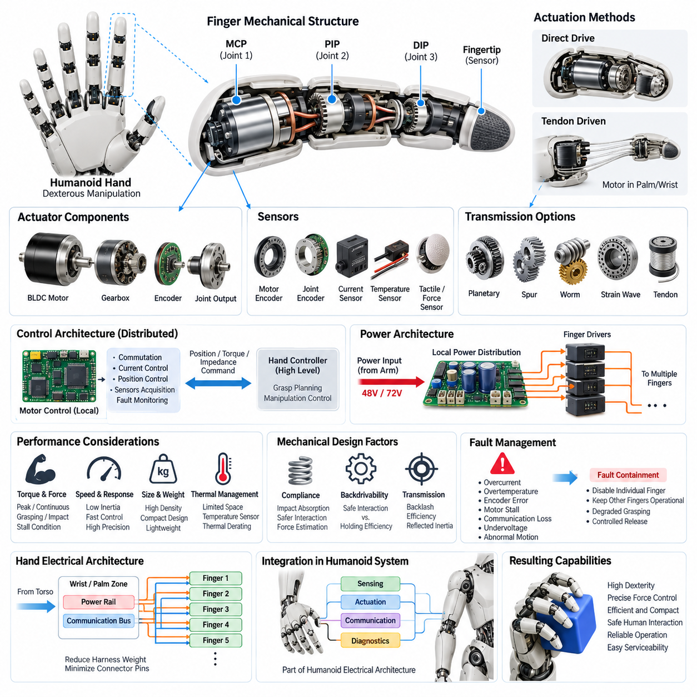
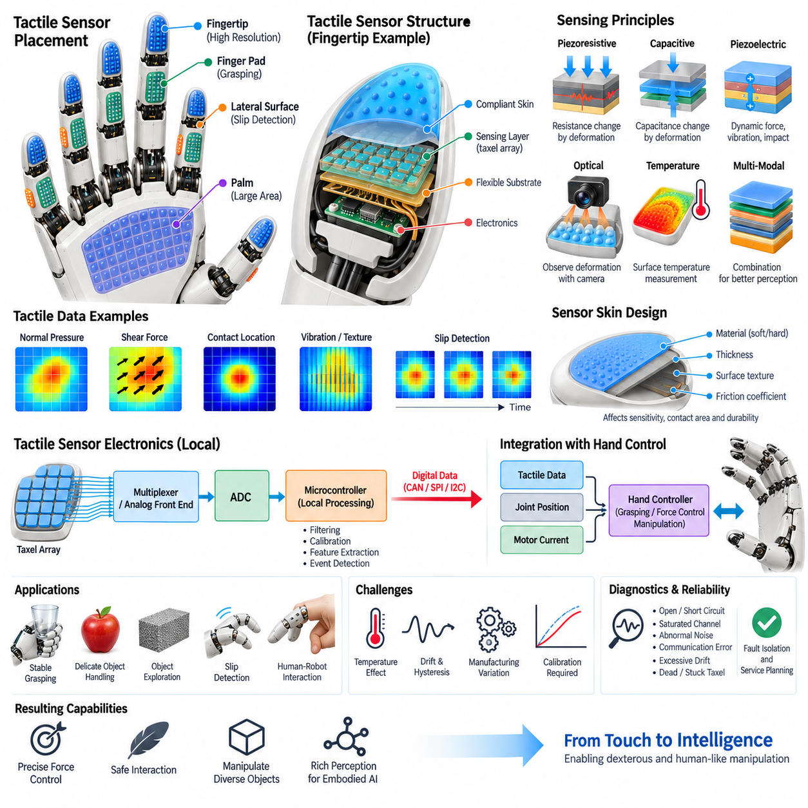
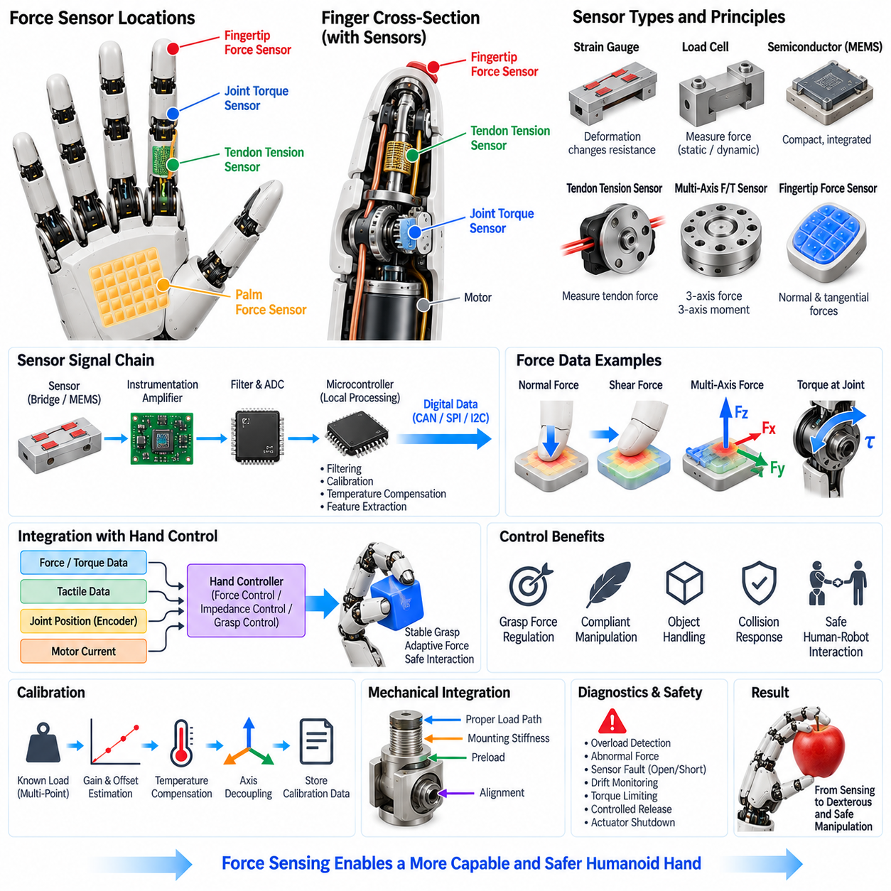
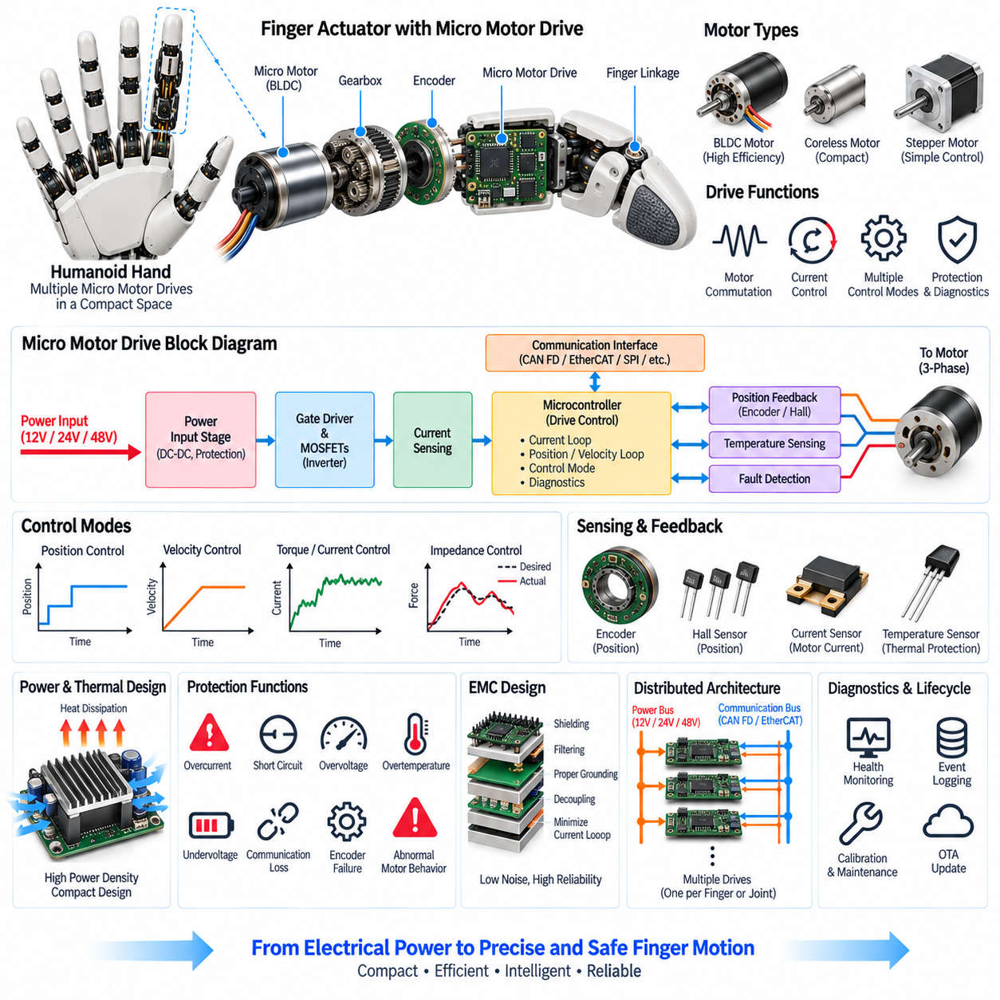
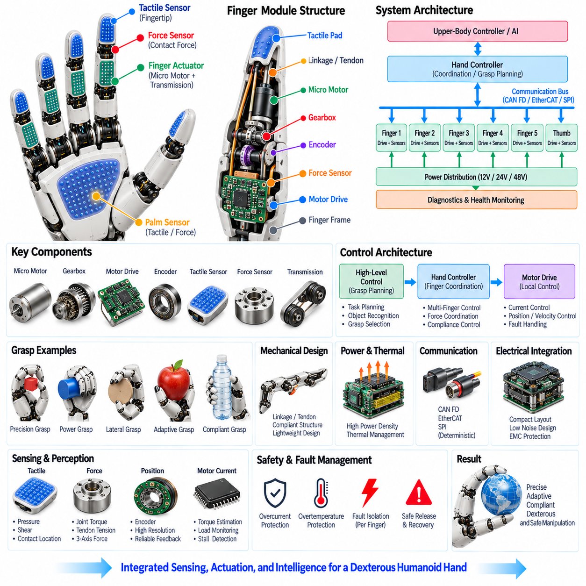
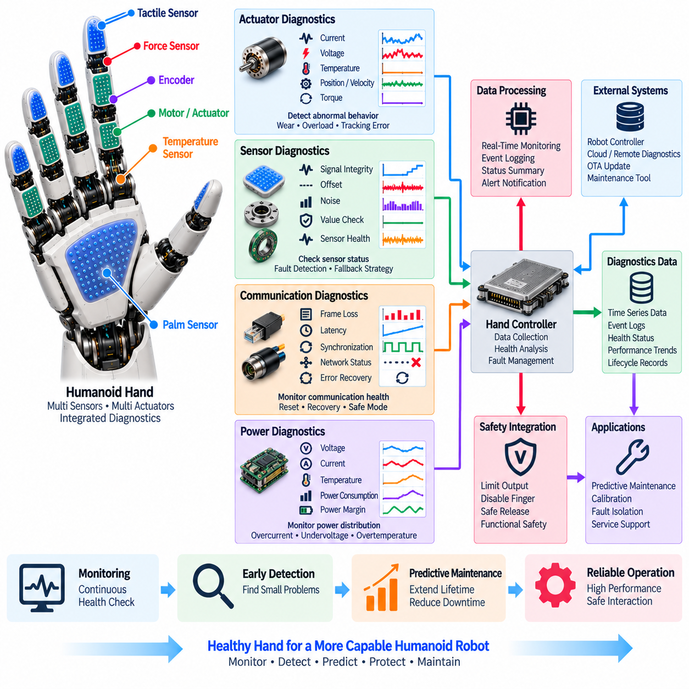

**Volume 21. Humanoid Electrical Architecture**


# Chapter 07. Hand Electrical Architecture

##  

## 07.01. Finger Actuators

{width="7.268055555555556in" height="7.268055555555556in"}

Finger actuators form the mechanical-to-electrical conversion layer that gives a humanoid hand controlled mobility at each digit. Unlike large shoulder or leg joints, finger joints operate within extremely limited volume while requiring multiple degrees of freedom, low reflected inertia, fast response, and precise force regulation. Their electrical architecture must therefore optimize actuator density, wiring complexity, thermal behavior, sensing, and controllability simultaneously.

A humanoid finger typically contains several articulated joints corresponding functionally to the metacarpophalangeal and interphalangeal joints of the human hand. Not every mechanical joint requires an independent motor. Fully actuated designs assign a dedicated actuator to each controlled degree of freedom, while underactuated designs mechanically couple multiple joints through tendons, linkages, gears, or differential mechanisms to reduce actuator count and hand mass.

Compact brushless DC motors are well suited to high-performance finger actuation because they provide favorable power density, controllable torque, long operating life, and efficient bidirectional operation. Small permanent-magnet motors may be combined with planetary, spur, worm, or strain-wave reduction mechanisms. The reduction ratio transforms motor speed into the higher joint torque required for gripping while strongly influencing backlash, efficiency, reflected inertia, and backdrivability.

Tendon-driven actuation provides another important architecture for anthropomorphic hands. Motors can be positioned in the palm, wrist, or forearm rather than directly inside each finger segment, and tensile elements transmit mechanical force to the joints. This reduces distal mass and finger inertia while allowing larger actuators to be used remotely, but introduces tendon elasticity, friction, routing constraints, hysteresis, pretension requirements, and additional calibration challenges.

Actuator sizing begins with the required fingertip force and maps that requirement backward through finger geometry, moment arms, transmission efficiency, and joint configuration. Peak torque is required during strong grasping or transient contact, whereas continuous torque is constrained primarily by motor and driver temperature. Designers must therefore distinguish continuous manipulation, intermittent gripping, impact loading, and stall conditions rather than selecting motors solely from nominal torque ratings.

Each independently controlled actuator normally requires position information for closed-loop motion control. Motor-side magnetic or optical encoders provide rotor position for commutation and velocity estimation, while joint-side encoders can measure the actual finger angle after the transmission. Dual sensing is particularly valuable where gear backlash, tendon stretch, compliance, or differential mechanisms create a significant difference between motor rotation and physical joint displacement.

Current sensing within the motor drive provides an economical estimate of actuator torque because motor torque is related to phase current through the motor torque constant. This estimate can support grasp-force regulation, contact detection, overload protection, and collision response. However, gearbox friction and nonlinear transmission behavior reduce its accuracy at the fingertip, so sophisticated hands combine current estimation with joint torque, tendon tension, force, or tactile sensing.

The finger actuator control loop is generally distributed close to the motors to minimize latency and wiring burden. A local microcontroller or motor-control device performs commutation, current regulation, velocity estimation, position control, sensor acquisition, and fault supervision. Higher-level hand controllers then issue position, torque, impedance, or grasp commands instead of directly controlling every motor phase, separating fast deterministic control from manipulation planning.

Electrical distribution becomes difficult as actuator count increases because a dexterous hand may contain many motors, encoders, sensors, and associated electronic channels within a compact structure. Rather than routing individual power and control conductors from the torso to every finger, the wrist or palm can act as a local electrical zone. Shared power rails and communication buses feed distributed finger electronics, substantially reducing harness mass and connector pin count.

Power architecture must accommodate highly dynamic and simultaneous actuator loads. Closing several fingers around an object can produce a short current peak much larger than the average hand consumption, while holding an object may create sustained thermal loading. Local bulk capacitance, appropriately sized conductors, current limiting, driver protection, and coordinated power budgeting help prevent transient voltage collapse from propagating from the hand into the arm electrical system.

Thermal management is especially restrictive because finger phalanges provide little surface area for heat spreading and normally cannot accommodate active cooling hardware. Motor copper loss, gearbox friction, and switching loss therefore establish practical continuous-force limits. Temperature sensors placed near motor windings or driver stages allow the controller to implement thermal derating, reducing allowable current progressively before temperatures reach damaging levels.

Mechanical compliance can significantly improve actuator behavior during physical interaction. Elastic elements incorporated into tendons, transmissions, fingertips, or dedicated series-elastic structures absorb impacts and reduce contact-force sensitivity to small position errors. Compliance also supports safer interaction with humans and fragile objects. Its presence, however, changes control dynamics and may require force estimation or additional sensing to reconstruct actual joint and fingertip states.

Backdrivability is another fundamental actuator characteristic. A highly backdrivable finger can yield naturally when external forces are applied, improving manipulation safety and enabling compliant behavior, whereas a high-ratio non-backdrivable transmission can hold loads with reduced electrical effort. Humanoid hand design therefore requires a deliberate compromise among holding efficiency, force capability, positioning accuracy, mechanical robustness, compliance, and interaction quality.

Fault management should prevent a single finger actuator failure from disabling the complete hand or creating excessive gripping force. Local electronics can detect overcurrent, overtemperature, encoder disagreement, stalled motors, communication loss, supply undervoltage, and abnormal motion. Fault containment may disable an individual actuator or finger while leaving unaffected digits operational, enabling degraded grasping and controlled release rather than an abrupt total-hand shutdown.

Finger actuator architecture ultimately determines much of a humanoid hand\'s dexterity, weight, energy consumption, responsiveness, and serviceability. The broader volume places this subsystem within the dedicated Hand Electrical Architecture chapter, alongside tactile sensing, force sensing, micro motor drives, dexterous hand architecture, and hand diagnostics. This separation emphasizes that actuator design must operate as part of an integrated sensing, drive, communication, and diagnostic system.

손가락 액추에이터(Finger Actuator)는 휴머노이드 손(Humanoid Hand)의 각 손가락에 제어된 움직임을 제공하는 기계-전기 변환 계층(Mechanical-to-Electrical Conversion Layer)을 구성한다. 어깨나 다리의 대형 관절과 달리 손가락 관절(Finger Joint)은 매우 제한된 공간에서 여러 자유도(Degrees of Freedom)를 구현하면서 낮은 반사 관성(Reflected Inertia), 빠른 응답, 정밀한 힘 제어를 동시에 만족해야 한다. 따라서 전기 아키텍처(Electrical Architecture)는 액추에이터 밀도(Actuator Density), 배선 복잡도, 열 특성, 센싱(Sensing), 제어성을 함께 최적화해야 한다.

휴머노이드 손가락(Humanoid Finger)은 일반적으로 사람 손의 중수지 관절(Metacarpophalangeal Joint)과 지간 관절(Interphalangeal Joint)에 기능적으로 대응하는 여러 관절로 구성된다. 모든 기계적 관절에 독립적인 모터가 필요한 것은 아니다. 완전 구동 설계(Fully Actuated Design)는 제어되는 각 자유도에 전용 액추에이터를 배치하지만, 저구동 설계(Underactuated Design)는 텐던(Tendon), 링크(Linkage), 기어(Gear), 차동 기구(Differential Mechanism)를 통해 여러 관절을 기계적으로 결합하여 액추에이터 수와 손의 질량을 줄인다.

소형 브러시리스 직류 모터(Brushless DC Motor)는 높은 출력 밀도(Power Density), 제어 가능한 토크(Torque), 긴 작동 수명, 효율적인 양방향 구동 특성을 제공하므로 고성능 손가락 구동에 적합하다. 소형 영구자석 모터(Permanent-Magnet Motor)는 유성기어(Planetary Gear), 평기어(Spur Gear), 웜기어(Worm Gear), 스트레인 웨이브 감속기(Strain-Wave Reduction Mechanism)와 결합될 수 있다. 감속비(Reduction Ratio)는 모터 속도를 파지에 필요한 높은 관절 토크로 변환하며 백래시(Backlash), 효율, 반사 관성, 역구동성(Backdrivability)에 큰 영향을 미친다.

텐던 구동(Tendon-Driven Actuation)은 사람과 유사한 손(Anthropomorphic Hand)을 구현하기 위한 또 하나의 중요한 아키텍처이다. 모터를 각 손가락 마디 내부가 아니라 손바닥(Palm), 손목(Wrist), 전완(Forearm)에 배치하고 인장 요소(Tensile Element)를 통해 기계적 힘을 관절에 전달할 수 있다. 이러한 구조는 손가락 말단의 질량과 관성을 줄이고 더 큰 액추에이터를 원격으로 사용할 수 있게 하지만, 텐던 탄성(Tendon Elasticity), 마찰, 배선 경로 제약, 히스테리시스(Hysteresis), 초기 장력(Pretension), 추가적인 보정(Calibration) 문제를 발생시킨다.

액추에이터 크기 선정(Actuator Sizing)은 요구되는 손끝 힘(Fingertip Force)에서 시작하여 손가락 형상, 모멘트 암(Moment Arm), 전달 효율(Transmission Efficiency), 관절 구성 등을 역방향으로 계산하여 수행한다. 강한 파지나 순간적인 접촉에서는 최대 토크(Peak Torque)가 필요하지만 연속 토크(Continuous Torque)는 주로 모터와 드라이버의 온도에 의해 제한된다. 따라서 모터를 단순히 정격 토크만으로 선정해서는 안 되며 연속 조작, 간헐적 파지, 충격 하중(Impact Loading), 스톨(Stall) 조건을 구분하여 설계해야 한다.

독립적으로 제어되는 각 액추에이터에는 일반적으로 폐루프 운동 제어(Closed-Loop Motion Control)를 위한 위치 정보가 필요하다. 모터 측 자기식 또는 광학식 엔코더(Magnetic or Optical Encoder)는 정류(Commutation)와 속도 추정을 위한 회전자 위치를 제공하며, 관절 측 엔코더(Joint-Side Encoder)는 동력전달장치 이후 실제 손가락 각도를 측정할 수 있다. 기어 백래시, 텐던 신장, 컴플라이언스(Compliance), 차동 기구로 인해 모터 회전과 실제 관절 변위 사이에 차이가 발생하는 경우 이중 센싱(Dual Sensing)이 특히 유용하다.

모터 드라이브(Motor Drive)의 전류 센싱(Current Sensing)은 모터 토크가 토크 상수(Motor Torque Constant)를 통해 상전류(Phase Current)와 연관되므로 액추에이터 토크를 경제적으로 추정할 수 있게 한다. 이러한 추정값은 파지력 제어(Grasp-Force Regulation), 접촉 감지(Contact Detection), 과부하 보호, 충돌 대응에 활용할 수 있다. 그러나 기어박스 마찰과 비선형 전달 특성으로 인해 손끝에서의 정확도가 감소하므로 고성능 손은 전류 추정과 관절 토크, 텐던 장력(Tendon Tension), 힘 또는 촉각 센싱(Tactile Sensing)을 함께 사용한다.

손가락 액추에이터 제어 루프(Finger Actuator Control Loop)는 지연시간(Latency)과 배선 부담을 최소화하기 위해 일반적으로 모터 가까이에 분산 배치된다. 로컬 마이크로컨트롤러(Local Microcontroller) 또는 모터 제어 장치가 정류, 전류 제어, 속도 추정, 위치 제어, 센서 데이터 수집, 고장 감시를 수행한다. 상위 손 제어기(Hand Controller)는 각 모터 상을 직접 제어하는 대신 위치, 토크, 임피던스(Impedance), 파지 명령을 전달함으로써 빠른 결정론적 제어(Deterministic Control)와 조작 계획(Manipulation Planning)을 분리한다.

액추에이터 수가 증가하면 제한된 공간 안에 많은 모터, 엔코더, 센서, 관련 전자 채널을 배치해야 하므로 전력 분배(Electrical Distribution)가 어려워진다. 몸통에서 모든 손가락까지 개별 전력선과 제어선을 연결하는 대신 손목이나 손바닥을 로컬 전기 구역(Local Electrical Zone)으로 구성할 수 있다. 공유 전력 레일(Shared Power Rail)과 통신 버스(Communication Bus)를 통해 분산형 손가락 전자장치에 전력과 데이터를 공급하면 하네스 질량과 커넥터 핀 수를 크게 줄일 수 있다.

전력 아키텍처(Power Architecture)는 동적이며 동시에 발생하는 액추에이터 부하를 수용해야 한다. 여러 손가락이 물체를 동시에 감싸며 닫힐 경우 평균적인 손 소비전력보다 훨씬 큰 단시간 전류 피크(Current Peak)가 발생할 수 있으며, 물체를 지속적으로 잡고 있는 동안에는 연속적인 열 부하가 발생할 수 있다. 로컬 대용량 커패시턴스(Local Bulk Capacitance), 적절한 도체 크기, 전류 제한(Current Limiting), 드라이버 보호, 조정된 전력 예산(Power Budgeting)을 적용하면 순간적인 전압 강하가 손에서 팔의 전기 시스템으로 전파되는 것을 방지할 수 있다.

손가락 마디는 열을 확산시킬 수 있는 표면적이 작고 일반적으로 능동 냉각 장치(Active Cooling Hardware)를 설치하기 어렵기 때문에 열 관리(Thermal Management)가 특히 중요하다. 모터 동손(Motor Copper Loss), 기어박스 마찰, 스위칭 손실(Switching Loss)이 실제 연속 힘의 한계를 결정한다. 모터 권선이나 드라이버 단계 근처에 배치한 온도 센서(Temperature Sensor)를 이용하면 제어기가 열 디레이팅(Thermal Derating)을 수행하여 손상 온도에 도달하기 전에 허용 전류를 단계적으로 감소시킬 수 있다.

기계적 컴플라이언스(Mechanical Compliance)는 물리적 상호작용 과정에서 액추에이터의 동작 특성을 크게 향상시킬 수 있다. 텐던, 동력전달장치, 손끝 또는 전용 직렬 탄성 구조(Series-Elastic Structure)에 포함된 탄성 요소는 충격을 흡수하고 작은 위치 오차에 대한 접촉력 민감도를 낮춘다. 컴플라이언스는 사람이나 깨지기 쉬운 물체와의 보다 안전한 상호작용도 지원한다. 그러나 제어 동역학(Control Dynamics)을 변화시키므로 실제 관절과 손끝 상태를 추정하기 위한 힘 추정 또는 추가 센싱이 필요할 수 있다.

역구동성(Backdrivability) 역시 액추에이터의 핵심 특성이다. 역구동성이 높은 손가락은 외력이 가해질 때 자연스럽게 움직일 수 있으므로 조작 안전성과 유연한 상호작용을 향상시킨다. 반면 높은 감속비를 갖는 비역구동형 전달장치(Non-Backdrivable Transmission)는 적은 전기 에너지로 하중을 유지할 수 있다. 따라서 휴머노이드 손 설계에서는 유지 효율, 힘 성능, 위치 정확도, 기계적 강건성(Mechanical Robustness), 컴플라이언스, 상호작용 품질 사이의 균형을 의도적으로 설계해야 한다.

고장 관리(Fault Management)는 하나의 손가락 액추에이터 고장이 전체 손을 사용할 수 없게 만들거나 과도한 파지력을 발생시키지 않도록 설계되어야 한다. 로컬 전자장치는 과전류(Overcurrent), 과열(Overtemperature), 엔코더 불일치, 모터 스톨, 통신 손실, 공급 저전압(Undervoltage), 비정상 움직임을 감지할 수 있다. 고장 격리(Fault Containment)를 통해 개별 액추에이터나 손가락만 비활성화하고 정상적인 다른 손가락은 계속 동작시켜 전체 손의 갑작스러운 정지 대신 성능 저하 상태의 파지(Degraded Grasping)와 제어된 해제(Controlled Release)를 가능하게 할 수 있다.

손가락 액추에이터 아키텍처(Finger Actuator Architecture)는 궁극적으로 휴머노이드 손의 기민성(Dexterity), 질량, 에너지 소비, 응답성, 정비성(Serviceability)을 크게 결정한다. 전체 휴머노이드 전기 아키텍처(Humanoid Electrical Architecture)에서 이 서브시스템은 촉각 센서(Tactile Sensor), 힘 센싱(Force Sensing), 마이크로 모터 드라이브(Micro Motor Drive), 정교한 손 아키텍처(Dexterous Hand Architecture), 손 진단(Hand Diagnostics)과 함께 전용 손 전기 아키텍처(Hand Electrical Architecture)를 구성한다. 이러한 구조는 액추에이터 설계가 센싱, 구동, 통신, 진단 시스템과 통합된 하나의 시스템으로 동작해야 함을 의미한다.

##  

## 07.02. Tactile Sensors

{width="7.268055555555556in" height="7.268055555555556in"}

Tactile sensors provide a humanoid hand with distributed information about physical contact between the fingers, palm, and surrounding environment. While joint encoders describe actuator motion and force sensors estimate mechanical loading, tactile sensing measures interaction directly at the contact surface. This capability is essential for stable grasping, object exploration, slip detection, manipulation of fragile items, and human-robot interaction.

A dexterous humanoid hand may distribute tactile sensing elements across the fingertips, finger pads, lateral finger surfaces, and palm. Fingertips generally require the highest spatial resolution because they perform precision grasping and exploratory contact, whereas the palm can use larger sensing regions for detecting broad contact during power grasps. Sensor placement must therefore reflect expected contact probability, manipulation function, available packaging volume, and wiring complexity.

Tactile sensing can measure several physical quantities, including normal pressure, shear force, contact location, vibration, deformation, and temperature. No single sensing principle provides optimal performance for every quantity. Practical humanoid hands consequently use either multimodal tactile devices or combinations of different sensor technologies, allowing the controller to distinguish simple touch from pressure distribution, sliding contact, impact, or thermal interaction with an object.

Piezoresistive tactile sensors detect contact through resistance changes produced by mechanical deformation. Their relatively simple electrical interface, compact structure, and low manufacturing cost make them suitable for dense sensor arrays. However, hysteresis, temperature dependence, drift, and device-to-device variation can influence measurement accuracy. Calibration and compensation algorithms are therefore important when pressure values are used for quantitative grasp-force control.

Capacitive tactile sensors measure changes in capacitance caused by displacement or deformation between conductive structures. They can provide high sensitivity to small forces and can be fabricated as compact arrays beneath compliant fingertip surfaces. Their performance depends strongly on electrode geometry, dielectric materials, shielding, and analog front-end design. Parasitic capacitance and electromagnetic interference must be controlled carefully in electrically dense robotic hands.

Piezoelectric sensing is particularly useful for detecting dynamic events such as vibration, impact, texture variation, and the onset of slip. Mechanical deformation produces an electrical signal that can be processed with high temporal resolution. Because piezoelectric elements are generally better suited to changing forces than static loads, they are often complementary to pressure sensors rather than replacements for them in a humanoid tactile architecture.

Optical tactile sensing provides another approach by observing deformation of an elastic contact surface using internal cameras, photodiodes, or other optical components. Surface displacement patterns can reveal contact geometry, force distribution, texture, and incipient slip with very high spatial information content. The tradeoff is increased sensor thickness, computational processing, optical alignment requirements, power consumption, and integration complexity compared with simpler electrical sensor arrays.

The compliant skin covering a tactile sensor is part of the measurement system rather than merely mechanical protection. Elastomer hardness, thickness, surface texture, friction coefficient, and geometry determine how external forces propagate toward sensing elements. A softer layer can increase contact area and protect objects but may reduce spatial sharpness. Mechanical design and sensor calibration must therefore be developed together to obtain predictable tactile response.

A tactile array may contain dozens or hundreds of individual sensing elements, commonly called taxels, distributed across a relatively small hand surface. Connecting every taxel directly to the central controller would create excessive wiring and connector requirements. Local multiplexers, analog front ends, ADCs, and microcontrollers can aggregate measurements near the sensor array and transmit processed tactile data through a shared digital communication interface.

Local tactile electronics must balance sampling rate, spatial resolution, bandwidth, power consumption, and processing latency. High-resolution arrays can generate substantial data even when individual measurements are small. Instead of continuously transmitting every raw sample at maximum frequency, local processing can perform filtering, baseline compensation, contact segmentation, feature extraction, or event detection and forward only information required by the higher-level manipulation controller.

Tactile data becomes especially valuable when combined with finger actuator and joint information. Joint position identifies hand configuration, motor current provides an approximate actuator torque, and tactile arrays reveal where physical contact actually occurs. Combining these signals allows the hand controller to estimate grasp state more reliably than any single sensor modality and supports position, force, impedance, and hybrid manipulation strategies.

Slip detection is one of the most important functions enabled by tactile sensing. An object may begin moving relative to the fingertip before joint position changes significantly enough to reveal the problem. High-frequency vibration, changing shear patterns, or migration of the pressure distribution can indicate incipient slip. The controller can then increase grip force, modify finger posture, or redistribute contact forces before the object is lost.

Tactile sensing also enables controlled interaction with delicate or uncertain objects. Rather than commanding a predetermined finger position and relying only on actuator limits, the controller can detect initial contact and progressively regulate force. This approach allows the same hand to manipulate objects with different dimensions, stiffness, surface friction, and shape while reducing the probability of crushing an object or applying unnecessary actuator torque.

Calibration is challenging because tactile measurements are affected by manufacturing tolerances, material aging, temperature, mechanical preload, and repeated deformation. Calibration may include zero-offset correction, gain normalization, force-response characterization, temperature compensation, and mapping between taxel coordinates and physical hand geometry. Periodic self-checking can detect drift or damaged sensing regions and maintain consistent performance throughout the hand\'s operational life.

Tactile sensor diagnostics should identify open circuits, short circuits, saturated channels, abnormal noise, communication errors, excessive drift, and taxels that remain permanently active or inactive. A localized failure should ideally degrade only the affected sensing region rather than disable the complete hand. Diagnostic status can be reported to the hand controller, system health manager, and maintenance software for fault isolation and service planning.

The tactile sensing subsystem ultimately connects physical contact with higher-level embodied intelligence. Within the Hand Electrical Architecture, it operates alongside finger actuators, force sensing, micro motor drives, dexterous hand control, and hand diagnostics. By transforming distributed contact phenomena into synchronized digital information, tactile sensors allow a humanoid robot to perceive not only where its hand is moving, but also how that hand is physically interacting with the world.

촉각 센서(Tactile Sensor)는 손가락, 손바닥, 주변 환경 사이에서 발생하는 물리적 접촉에 대한 분산 정보를 휴머노이드 손(Humanoid Hand)에 제공한다. 관절 엔코더(Joint Encoder)가 액추에이터의 움직임을 나타내고 힘 센서(Force Sensor)가 기계적 하중을 추정하는 반면, 촉각 센싱(Tactile Sensing)은 접촉 표면에서 상호작용을 직접 측정한다. 이러한 기능은 안정적인 파지(Grasping), 물체 탐색(Object Exploration), 미끄러짐 감지(Slip Detection), 깨지기 쉬운 물체의 조작, 인간-로봇 상호작용(Human-Robot Interaction)에 필수적이다.

정교한 휴머노이드 손(Dexterous Humanoid Hand)은 손끝(Fingertip), 손가락 패드(Finger Pad), 손가락 측면, 손바닥(Palm)에 촉각 센싱 요소를 분산 배치할 수 있다. 손끝은 정밀 파지(Precision Grasping)와 탐색적 접촉(Exploratory Contact)을 수행하므로 일반적으로 가장 높은 공간 해상도(Spatial Resolution)가 필요하다. 반면 손바닥은 파워 그립(Power Grasp) 과정에서 넓은 접촉을 감지하기 위해 더 큰 센싱 영역을 사용할 수 있다. 따라서 센서 배치는 예상되는 접촉 확률, 조작 기능, 가용 패키징 공간, 배선 복잡도를 고려해야 한다.

촉각 센싱은 수직 압력(Normal Pressure), 전단력(Shear Force), 접촉 위치(Contact Location), 진동(Vibration), 변형(Deformation), 온도(Temperature) 등 여러 물리량을 측정할 수 있다. 모든 물리량에 대해 하나의 센싱 원리가 최적의 성능을 제공하는 것은 아니다. 따라서 실제 휴머노이드 손은 다중 모달 촉각 장치(Multimodal Tactile Device) 또는 서로 다른 센서 기술을 조합하여 사용하는 경우가 많으며, 이를 통해 단순한 접촉과 압력 분포, 미끄러지는 접촉, 충격, 열적 상호작용을 구분할 수 있다.

압저항식 촉각 센서(Piezoresistive Tactile Sensor)는 기계적 변형에 의해 발생하는 저항 변화(Resistance Change)를 이용하여 접촉을 감지한다. 비교적 단순한 전기 인터페이스(Electrical Interface), 소형 구조, 낮은 제조 비용을 제공하므로 고밀도 센서 어레이(Dense Sensor Array)에 적합하다. 그러나 히스테리시스(Hysteresis), 온도 의존성(Temperature Dependence), 드리프트(Drift), 소자 간 편차(Device-to-Device Variation)가 측정 정확도에 영향을 줄 수 있다. 따라서 압력값을 정량적인 파지력 제어(Grasp-Force Control)에 사용할 경우 보정(Calibration)과 보상 알고리즘(Compensation Algorithm)이 중요하다.

정전용량식 촉각 센서(Capacitive Tactile Sensor)는 도전성 구조(Conductive Structure) 사이의 변위 또는 변형으로 발생하는 정전용량(Capacitance) 변화를 측정한다. 작은 힘에 대한 높은 감도를 제공할 수 있으며, 유연한 손끝 표면 아래에 소형 어레이 형태로 제작할 수 있다. 성능은 전극 형상(Electrode Geometry), 유전체 재료(Dielectric Material), 차폐(Shielding), 아날로그 프런트엔드(Analog Front End) 설계에 크게 의존한다. 전기적으로 복잡한 로봇 손에서는 기생 정전용량(Parasitic Capacitance)과 전자기 간섭(Electromagnetic Interference)을 신중하게 제어해야 한다.

압전 센싱(Piezoelectric Sensing)은 진동, 충격, 표면 질감 변화(Texture Variation), 미끄러짐 발생 시점과 같은 동적 이벤트(Dynamic Event)를 감지하는 데 특히 유용하다. 기계적 변형이 전기 신호를 발생시키므로 높은 시간 해상도(Temporal Resolution)로 처리할 수 있다. 압전 소자는 일반적으로 정적인 하중보다는 변화하는 힘에 더 적합하므로 휴머노이드 촉각 아키텍처에서는 압력 센서를 대체하기보다는 보완하는 방식으로 사용되는 경우가 많다.

광학식 촉각 센싱(Optical Tactile Sensing)은 탄성 접촉 표면의 변형을 내부 카메라(Internal Camera), 포토다이오드(Photodiode), 기타 광학 소자를 이용하여 관찰하는 방식이다. 표면 변위 패턴은 접촉 형상(Contact Geometry), 힘 분포(Force Distribution), 질감(Texture), 초기 미끄러짐(Incipient Slip)에 대한 높은 공간 정보를 제공할 수 있다. 그러나 단순한 전기식 센서 어레이에 비해 센서 두께, 계산 처리, 광학 정렬(Optical Alignment), 전력 소비, 통합 복잡도가 증가하는 단점이 있다.

촉각 센서를 덮는 유연한 스킨(Compliant Skin)은 단순한 기계적 보호층이 아니라 측정 시스템의 일부이다. 엘라스토머 경도(Elastomer Hardness), 두께, 표면 질감, 마찰 계수(Friction Coefficient), 형상은 외부 힘이 센싱 요소로 전달되는 방식을 결정한다. 더 부드러운 층은 접촉 면적을 증가시키고 물체를 보호할 수 있지만 공간적 선명도(Spatial Sharpness)를 감소시킬 수 있다. 따라서 예측 가능한 촉각 응답(Tactile Response)을 확보하기 위해 기계 설계와 센서 보정을 함께 개발해야 한다.

촉각 어레이(Tactile Array)는 비교적 작은 손 표면에 택셀(Taxel)이라고 불리는 수십 개 또는 수백 개의 개별 센싱 요소를 분산 배치할 수 있다. 모든 택셀을 중앙 제어기에 직접 연결하면 과도한 배선과 커넥터 요구사항이 발생한다. 따라서 로컬 멀티플렉서(Local Multiplexer), 아날로그 프런트엔드(Analog Front End), ADC, 마이크로컨트롤러(Microcontroller)를 센서 어레이 근처에 배치하여 측정값을 집계하고, 공유 디지털 통신 인터페이스(Shared Digital Communication Interface)를 통해 촉각 데이터를 전달할 수 있다.

로컬 촉각 전자장치(Local Tactile Electronics)는 샘플링 속도(Sampling Rate), 공간 해상도, 대역폭(Bandwidth), 전력 소비, 처리 지연시간(Processing Latency) 사이의 균형을 유지해야 한다. 고해상도 어레이는 개별 측정값이 작더라도 상당한 데이터를 생성할 수 있다. 따라서 모든 원시 샘플(Raw Sample)을 최대 주파수로 지속적으로 전송하는 대신 로컬 처리(Local Processing)를 통해 필터링(Filtering), 기준값 보정(Baseline Compensation), 접촉 영역 분할(Contact Segmentation), 특징 추출(Feature Extraction), 이벤트 감지(Event Detection)를 수행하고 상위 조작 제어기(Manipulation Controller)에 필요한 정보만 전달할 수 있다.

촉각 데이터는 손가락 액추에이터(Finger Actuator)와 관절 정보를 결합할 때 특히 높은 가치를 갖는다. 관절 위치(Joint Position)는 손의 자세를 나타내고, 모터 전류(Motor Current)는 액추에이터 토크를 근사적으로 제공하며, 촉각 어레이(Tactile Array)는 실제 물리적 접촉이 발생하는 위치를 나타낸다. 이러한 신호를 결합하면 단일 센서 방식보다 파지 상태(Grasp State)를 더욱 안정적으로 추정할 수 있으며, 위치 제어(Position Control), 힘 제어(Force Control), 임피던스 제어(Impedance Control), 하이브리드 조작 전략(Hybrid Manipulation Strategy)을 지원할 수 있다.

미끄러짐 감지(Slip Detection)는 촉각 센싱이 제공하는 가장 중요한 기능 중 하나이다. 물체는 관절 위치가 충분히 변화하여 문제를 나타내기 전에 손끝에 대해 움직이기 시작할 수 있다. 고주파 진동(High-Frequency Vibration), 변화하는 전단 패턴(Shear Pattern), 압력 분포의 이동(Migration of Pressure Distribution)은 초기 미끄러짐(Incipient Slip)을 나타낼 수 있다. 그러면 제어기는 물체가 손에서 떨어지기 전에 파지력을 증가시키거나 손가락 자세를 변경하거나 접촉력을 재분배할 수 있다.

촉각 센싱은 또한 섬세하거나 상태가 불확실한 물체와의 제어된 상호작용(Controlled Interaction)을 가능하게 한다. 미리 정해진 손가락 위치를 명령하고 액추에이터 한계에만 의존하는 대신, 제어기는 초기 접촉을 감지하고 힘을 점진적으로 조절할 수 있다. 이를 통해 동일한 손이 서로 다른 크기, 강성(Stiffness), 표면 마찰, 형상을 가진 물체를 조작할 수 있으며, 물체가 눌려 파손되거나 불필요한 액추에이터 토크가 가해질 가능성을 줄일 수 있다.

보정(Calibration)은 제조 공차(Manufacturing Tolerance), 재료 노화(Material Aging), 온도, 기계적 프리로드(Mechanical Preload), 반복적인 변형의 영향을 받기 때문에 어렵다. 보정에는 영점 오프셋 보정(Zero-Offset Correction), 게인 정규화(Gain Normalization), 힘-응답 특성화(Force-Response Characterization), 온도 보상(Temperature Compensation), 택셀 좌표와 실제 손 형상 사이의 매핑이 포함될 수 있다. 주기적인 자체 점검(Self-Check)을 통해 드리프트나 손상된 센싱 영역을 감지하고 손의 전체 작동 수명 동안 일관된 성능을 유지할 수 있다.

촉각 센서 진단(Tactile Sensor Diagnostics)은 단선(Open Circuit), 단락(Short Circuit), 포화 채널(Saturated Channel), 비정상 잡음(Abnormal Noise), 통신 오류(Communication Error), 과도한 드리프트, 지속적으로 활성화되거나 비활성화된 택셀을 식별해야 한다. 국부적인 고장은 이상이 발생한 센싱 영역만 성능을 저하시키고 손 전체를 비활성화하지 않는 것이 바람직하다. 진단 상태(Diagnostic Status)는 손 제어기(Hand Controller), 시스템 상태 관리자(System Health Manager), 유지보수 소프트웨어(Maintenance Software)에 전달되어 고장 격리(Fault Isolation)와 정비 계획(Service Planning)에 활용될 수 있다.

촉각 센싱 서브시스템(Tactile Sensing Subsystem)은 궁극적으로 물리적 접촉을 상위 수준의 체화 지능(Embodied Intelligence)과 연결한다. 손 전기 아키텍처(Hand Electrical Architecture) 내에서 촉각 센싱은 손가락 액추에이터(Finger Actuator), 힘 센싱(Force Sensing), 마이크로 모터 드라이브(Micro Motor Drive), 정교한 손 제어(Dexterous Hand Control), 손 진단(Hand Diagnostics)과 함께 동작한다. 분산된 접촉 현상을 동기화된 디지털 정보(Synchronized Digital Information)로 변환함으로써 촉각 센서는 휴머노이드 로봇이 손이 어디로 움직이고 있는지만 인식하는 것이 아니라, 그 손이 실제 세계와 어떻게 물리적으로 상호작용하고 있는지도 인식할 수 있도록 한다.

##  

## 07.03. Force Sensing

{width="7.268055555555556in" height="7.268055555555556in"}

Force sensing provides a humanoid hand with quantitative information about mechanical interaction that cannot be obtained reliably from position sensing alone. While tactile sensors primarily describe distributed surface contact, force sensing measures the magnitude and direction of mechanical loads acting on a joint, tendon, fingertip, palm, or end-effector interface. This information supports grasp-force regulation, compliant manipulation, contact detection, object handling, collision response, and safe human-robot interaction.

Force sensing can be implemented at several locations within the hand depending on the required control objective. Joint torque sensors measure mechanical torque directly at individual finger joints, while tendon tension sensors measure the tensile force transmitted through tendon-driven mechanisms. Fingertip force sensors measure interaction forces at the contact surface, and multi-axis force/torque sensors can simultaneously measure several components of force and moment. Sensor placement therefore determines what physical quantity can be observed and how directly it can be used for control.

Strain-gauge load cells provide a widely used approach for measuring static and dynamic mechanical loads. Mechanical deformation of an elastic structure changes the resistance of bonded or integrated strain gauges, and a bridge circuit converts this small resistance variation into an electrical signal. High-resolution instrumentation amplifiers and stable excitation are required because the useful signal can be very small compared with electrical noise, temperature effects, and common-mode disturbances generated by nearby motor drives.

Semiconductor strain sensors and MEMS-based force sensors can provide compact alternatives where packaging volume is extremely limited. Their small dimensions allow sensing elements to be integrated into finger joints, tendon mechanisms, or miniature force interfaces. However, their measurement characteristics may vary with temperature, mechanical stress, packaging conditions, and manufacturing tolerances. Appropriate compensation, calibration, and mechanical isolation are therefore necessary when these sensors are used for precision force control.

Joint torque sensing is particularly important when the hand must regulate mechanical interaction rather than simply follow position commands. A torque sensor can be positioned between the motor transmission and the joint output so that the controller observes the actual transmitted torque. This allows the system to distinguish commanded actuator motion from the mechanical response of the finger and provides a more direct feedback signal for impedance control, force control, contact detection, and overload protection.

Tendon-driven hands can use tension sensing to estimate the force transmitted through each tendon. Because tendon tension is directly related to actuator loading and joint torque through the mechanical transmission, the measurement can provide useful information without placing a conventional torque sensor at every joint. However, tendon friction, routing curvature, elasticity, pretension, and hysteresis can introduce differences between measured tendon force and actual fingertip force. These effects must be considered in the control model.

Fingertip force sensing provides the most direct measurement of interaction between the hand and an object. A compact force-sensitive structure can measure normal and, when designed appropriately, tangential components of contact force. This information enables the controller to determine whether an object has been contacted, whether sufficient gripping force is being applied, and whether the contact load is moving toward an unsafe level. Fingertip sensing is therefore highly complementary to the distributed information provided by tactile sensor arrays.

Multi-axis force/torque sensing can provide a richer representation of physical interaction. A six-axis sensor can theoretically resolve three force components and three moment components around a defined coordinate frame. Such information is valuable for dexterous manipulation because contact forces may not act through the center of the fingertip or palm. Estimating both force and moment allows the controller to reason about grasp stability, object motion, contact geometry, and mechanical equilibrium.

Force sensing must be integrated closely with actuator control. Motor current can provide an indirect estimate of actuator torque, while encoder measurements describe actuator and joint position. A dedicated force or torque sensor provides an additional physical measurement that can correct errors caused by gearbox friction, transmission compliance, backlash, and model uncertainty. Combining current, position, velocity, and force measurements produces a more robust representation of the actual mechanical state of the hand.

The electrical interface for force sensors depends on the sensing technology and required accuracy. Strain-gauge systems commonly require bridge excitation, instrumentation amplification, filtering, and high-resolution analog-to-digital conversion. Local electronics can perform signal conditioning and transmit calibrated force measurements through a digital communication bus. Placing the signal-conditioning circuitry close to the sensor reduces the length of low-level analog wiring and helps protect small measurement signals from motor-driver switching noise.

Calibration is a fundamental requirement because force sensors must translate electrical output into physically meaningful force or torque values. Calibration may include zero-offset determination, gain estimation, multi-point loading, temperature compensation, axis decoupling, and mechanical coordinate transformation. For multi-axis sensors, cross-axis sensitivity must also be characterized because a load applied in one direction can produce a measurable response in other channels. Calibration data should remain associated with the individual sensor throughout its service life.

Mechanical integration strongly affects force measurement accuracy. The sensing structure must transfer the intended load through the measurement element while minimizing unintended parallel load paths. Mounting stiffness, preload, fastener torque, structural deformation, cable routing, and sensor alignment can all influence the measured result. A poorly designed mechanical interface may cause the sensor to report an apparently precise electrical value that does not accurately represent the physical force acting on the finger.

Force sensing also contributes directly to safety and fault management. Excessive joint torque, abnormal tendon tension, unexpected contact force, or rapidly changing load can indicate collision, actuator malfunction, object entrapment, or an unstable grasp. The local controller can compare measured force against expected operating ranges and initiate torque limiting, motion reduction, controlled release, or actuator shutdown when necessary. Force feedback therefore provides an important protective layer between mechanical actuation and physical interaction.

The final force-sensing architecture should combine direct measurements with model-based estimates rather than depending on a single signal. Tactile sensors identify where contact occurs, force sensors quantify the resulting mechanical load, encoders describe configuration, and motor-current measurements provide actuator-level information. Together, these signals enable the humanoid hand to transition from position-only control toward force-aware and impedance-based manipulation, providing more precise, adaptive, and physically safe interaction with objects and people.

힘 센싱(Force Sensing)은 위치 센싱(Position Sensing)만으로는 신뢰성 있게 얻을 수 없는 기계적 상호작용(Mechanical Interaction)에 대한 정량적인 정보를 휴머노이드 손(Humanoid Hand)에 제공한다. 촉각 센서(Tactile Sensor)가 주로 분산된 표면 접촉을 나타내는 반면, 힘 센싱은 관절(Joint), 텐던(Tendon), 손끝(Fingertip), 손바닥(Palm), 엔드 이펙터 인터페이스(End-Effector Interface)에 작용하는 기계적 하중(Mechanical Load)의 크기와 방향을 측정한다. 이러한 정보는 파지력 제어(Grasp-Force Regulation), 유연한 조작(Compliant Manipulation), 접촉 감지(Contact Detection), 물체 조작(Object Handling), 충돌 대응(Collision Response), 안전한 인간-로봇 상호작용(Safe Human-Robot Interaction)을 지원한다.

힘 센싱은 필요한 제어 목적에 따라 손 내부의 여러 위치에 구현할 수 있다. 관절 토크 센서(Joint Torque Sensor)는 개별 손가락 관절에서 기계적 토크(Mechanical Torque)를 직접 측정하고, 텐던 장력 센서(Tendon Tension Sensor)는 텐던 구동 메커니즘(Tendon-Driven Mechanism)을 통해 전달되는 인장력을 측정한다. 손끝 힘 센서(Fingertip Force Sensor)는 접촉 표면에서의 상호작용 힘을 측정하며, 다축 힘/토크 센서(Multi-Axis Force/Torque Sensor)는 여러 힘과 모멘트 성분을 동시에 측정할 수 있다. 따라서 센서의 위치는 어떤 물리량을 관측할 수 있는지와 그 정보를 제어에 얼마나 직접적으로 사용할 수 있는지를 결정한다.

스트레인 게이지 로드셀(Strain-Gauge Load Cell)은 정적 및 동적 기계 하중을 측정하기 위해 널리 사용되는 방법이다. 탄성 구조(Elastic Structure)의 기계적 변형(Mechanical Deformation)은 부착되거나 통합된 스트레인 게이지(Strain Gauge)의 저항을 변화시키며, 브리지 회로(Bridge Circuit)는 이러한 미세한 저항 변화를 전기 신호로 변환한다. 유용한 신호가 전기적 잡음, 온도 영향, 주변 모터 드라이브에서 발생하는 공통 모드 방해(Common-Mode Disturbance)에 비해 매우 작을 수 있으므로 고해상도 계측 증폭기(Instrumentation Amplifier)와 안정적인 여기(Stable Excitation)가 필요하다.

반도체 스트레인 센서(Semiconductor Strain Sensor)와 MEMS 기반 힘 센서(MEMS-Based Force Sensor)는 패키징 공간이 극도로 제한된 환경에서 소형 대안으로 사용할 수 있다. 작은 크기 덕분에 센싱 요소를 손가락 관절, 텐던 메커니즘, 소형 힘 인터페이스 내부에 통합할 수 있다. 그러나 온도, 기계적 응력(Mechanical Stress), 패키징 조건, 제조 공차에 따라 측정 특성이 달라질 수 있다. 따라서 이러한 센서를 정밀한 힘 제어(Precision Force Control)에 사용할 경우 적절한 보상(Compensation), 보정(Calibration), 기계적 격리(Mechanical Isolation)가 필요하다.

관절 토크 센싱(Joint Torque Sensing)은 손이 단순히 위치 명령을 추종하는 것이 아니라 기계적 상호작용을 조절해야 할 때 특히 중요하다. 토크 센서는 모터 전달장치(Motor Transmission)와 관절 출력부(Joint Output) 사이에 배치하여 제어기가 실제 전달 토크(Transmitted Torque)를 관측하도록 할 수 있다. 이를 통해 시스템은 명령된 액추에이터 움직임과 손가락의 실제 기계적 응답을 구분할 수 있으며, 임피던스 제어(Impedance Control), 힘 제어(Force Control), 접촉 감지(Contact Detection), 과부하 보호(Overload Protection)를 위한 보다 직접적인 피드백 신호를 제공할 수 있다.

텐던 구동 손(Tendon-Driven Hand)은 각 텐던을 통해 전달되는 힘을 추정하기 위해 장력 센싱(Tension Sensing)을 사용할 수 있다. 텐던 장력은 기계적 전달장치(Mechanical Transmission)를 통한 액추에이터 하중 및 관절 토크와 직접적으로 관련되므로, 모든 관절에 기존 방식의 토크 센서를 배치하지 않고도 유용한 정보를 얻을 수 있다. 그러나 텐던 마찰, 배선 경로의 곡률, 탄성, 초기 장력(Pretension), 히스테리시스(Hysteresis)는 측정된 텐던 힘과 실제 손끝 힘 사이에 차이를 만들 수 있다. 이러한 영향은 제어 모델에서 고려해야 한다.

손끝 힘 센싱(Fingertip Force Sensing)은 손과 물체 사이의 상호작용을 가장 직접적으로 측정할 수 있다. 소형 힘 감지 구조(Force-Sensitive Structure)는 수직 접촉력(Normal Contact Force)을 측정할 수 있으며, 적절하게 설계된 경우 접선 방향 성분(Tangential Component)도 측정할 수 있다. 이러한 정보는 제어기가 물체와 접촉했는지, 충분한 파지력이 적용되고 있는지, 접촉 하중이 위험한 수준으로 증가하고 있는지를 판단할 수 있도록 한다. 따라서 손끝 센싱은 촉각 센서 어레이(Tactile Sensor Array)가 제공하는 분산 정보와 매우 높은 상호 보완성을 갖는다.

다축 힘/토크 센싱(Multi-Axis Force/Torque Sensing)은 물리적 상호작용을 더욱 풍부하게 표현할 수 있다. 6축 센서(Six-Axis Sensor)는 이론적으로 정의된 좌표계(Coordinate Frame)를 기준으로 3개의 힘 성분과 3개의 모멘트 성분을 측정할 수 있다. 이러한 정보는 접촉력이 손끝이나 손바닥의 중심을 통과하지 않을 수 있기 때문에 정교한 조작(Dexterous Manipulation)에 유용하다. 힘과 모멘트를 함께 추정하면 제어기가 파지 안정성(Grasp Stability), 물체 움직임(Object Motion), 접촉 형상(Contact Geometry), 기계적 평형(Mechanical Equilibrium)을 판단할 수 있다.

힘 센싱은 액추에이터 제어(Actuator Control)와 밀접하게 통합되어야 한다. 모터 전류(Motor Current)는 액추에이터 토크를 간접적으로 추정할 수 있으며, 엔코더 측정값(Encoder Measurement)은 액추에이터와 관절 위치를 나타낸다. 전용 힘 또는 토크 센서는 기어박스 마찰(Gearbox Friction), 전달장치 컴플라이언스(Transmission Compliance), 백래시(Backlash), 모델 불확실성(Model Uncertainty)으로 발생하는 오차를 보정할 수 있는 추가적인 물리 측정값을 제공한다. 전류, 위치, 속도, 힘 측정값을 결합하면 손의 실제 기계적 상태를 더욱 강건하게 표현할 수 있다.

힘 센서의 전기적 인터페이스(Electrical Interface)는 센싱 기술과 요구 정확도에 따라 달라진다. 스트레인 게이지 시스템(Strain-Gauge System)은 일반적으로 브리지 여기(Bridge Excitation), 계측 증폭(Instrumentation Amplification), 필터링(Filtering), 고해상도 아날로그-디지털 변환(Analog-to-Digital Conversion)이 필요하다. 로컬 전자장치(Local Electronics)는 신호 조정(Signal Conditioning)을 수행하고 보정된 힘 측정값을 디지털 통신 버스(Digital Communication Bus)를 통해 전달할 수 있다. 신호 조정 회로를 센서 가까이에 배치하면 저레벨 아날로그 배선(Low-Level Analog Wiring)의 길이를 줄이고 모터 드라이버의 스위칭 잡음(Switching Noise)으로부터 미세한 측정 신호를 보호하는 데 도움이 된다.

보정(Calibration)은 힘 센서가 전기적 출력을 물리적으로 의미 있는 힘 또는 토크 값으로 변환해야 하므로 기본적인 요구사항이다. 보정에는 영점 오프셋 결정(Zero-Offset Determination), 게인 추정(Gain Estimation), 다점 하중 인가(Multi-Point Loading), 온도 보상(Temperature Compensation), 축 간 결합 제거(Axis Decoupling), 기계적 좌표 변환(Mechanical Coordinate Transformation)이 포함될 수 있다. 다축 센서의 경우 축 간 감도(Cross-Axis Sensitivity)도 특성화해야 한다. 한 방향으로 가해진 하중이 다른 채널에서도 측정 가능한 응답을 발생시킬 수 있기 때문이다. 보정 데이터는 센서의 전체 서비스 수명 동안 개별 센서와 함께 관리되어야 한다.

기계적 통합(Mechanical Integration)은 힘 측정 정확도에 큰 영향을 미친다. 센싱 구조는 의도된 하중을 측정 요소로 전달하면서 의도하지 않은 병렬 하중 경로(Parallel Load Path)는 최소화해야 한다. 장착 강성(Mounting Stiffness), 프리로드(Preload), 체결 토크(Fastener Torque), 구조 변형(Structural Deformation), 케이블 배선, 센서 정렬(Sensor Alignment)은 모두 측정 결과에 영향을 줄 수 있다. 잘못 설계된 기계적 인터페이스는 전기적으로는 정밀한 값을 출력하더라도 실제 손가락에 작용하는 물리적 힘을 정확하게 나타내지 못하게 할 수 있다.

힘 센싱은 안전(Safety)과 고장 관리(Fault Management)에도 직접적으로 기여한다. 과도한 관절 토크, 비정상적인 텐던 장력, 예상하지 못한 접촉력, 급격하게 변화하는 하중은 충돌(Collision), 액추에이터 고장, 물체 끼임(Object Entrapment), 불안정한 파지(Unstable Grasp)를 나타낼 수 있다. 로컬 제어기는 측정된 힘을 예상되는 작동 범위와 비교하고 필요할 경우 토크 제한(Torque Limiting), 움직임 감소(Motion Reduction), 제어된 해제(Controlled Release), 액추에이터 정지(Actuator Shutdown)를 수행할 수 있다. 따라서 힘 피드백(Force Feedback)은 기계적 구동과 물리적 상호작용 사이에 위치하는 중요한 보호 계층(Protective Layer)을 제공한다.

최종적인 힘 센싱 아키텍처(Force-Sensing Architecture)는 하나의 신호에 의존하기보다는 직접 측정값과 모델 기반 추정(Model-Based Estimation)을 결합해야 한다. 촉각 센서(Tactile Sensor)는 접촉이 발생하는 위치를 식별하고, 힘 센서(Force Sensor)는 그 결과로 발생하는 기계적 하중을 정량화하며, 엔코더(Encoder)는 손의 구성을 나타내고, 모터 전류 측정(Motor-Current Measurement)은 액추에이터 수준의 정보를 제공한다. 이러한 신호를 함께 사용하면 휴머노이드 손은 위치만을 기반으로 하는 제어(Position-Only Control)에서 힘을 인지하는 제어(Force-Aware Control)와 임피던스 기반 조작(Impedance-Based Manipulation)으로 발전할 수 있으며, 물체와 사람에 대해 더욱 정밀하고 적응적이며 물리적으로 안전한 상호작용을 수행할 수 있다.

##  

## 07.04. Micro Motor Drives

{width="7.268055555555556in" height="7.268055555555556in"}

Micro motor drives provide the electrical interface between the humanoid hand controller and the small motors that actuate individual fingers and mechanisms. Because a hand contains many compact actuators within a highly constrained volume, each drive must combine motor commutation, current regulation, sensing, protection, communication, and local control in a small electronic design. The drive therefore becomes a critical building block connecting power, computation, sensing, and mechanical motion.

A typical micro motor drive consists of a power input stage, switching power devices, gate-drive circuitry, current sensing, a microcontroller, communication interfaces, and protection circuits. For brushless DC motors, the drive controls multiple motor phases by switching semiconductor devices according to rotor position. The resulting electrical currents generate electromagnetic torque, allowing the controller to regulate motor speed, position, and torque through closed-loop control.

Pulse-width modulation is commonly used to regulate the effective voltage applied to the motor phases. The switching frequency and modulation strategy influence motor efficiency, acoustic noise, electromagnetic interference, current ripple, and thermal loss. A compact hand drive must therefore select switching parameters carefully because many drives may operate simultaneously inside the palm or wrist. Coordinated electrical design is necessary to prevent the aggregate switching activity from degrading sensor or communication performance.

Current regulation is one of the most important functions of a micro motor drive because motor current is closely related to generated torque. The drive measures phase or bus current and adjusts the switching commands to maintain the requested current. Fast current-loop response allows the actuator to react quickly to changing loads and provides a foundation for higher-level velocity, position, torque, and impedance control. Accurate current measurement is particularly important during low-force manipulation and near-stall operation.

Rotor position information is required for efficient commutation and accurate motor control. Hall sensors, magnetic encoders, incremental encoders, or other position sensing methods may provide the necessary information depending on actuator size and performance requirements. Sensorless estimation can also be considered when reducing component count is more important than very low-speed observability. For dexterous finger motion, however, reliable position feedback is generally important because precise and repeatable movement is a primary requirement.

The drive should support multiple control modes so that the same hardware can participate in different manipulation strategies. Position control is appropriate for basic finger movement, while velocity control can regulate motion during coordinated actions. Torque or current control is more suitable for physical interaction, and impedance control can combine motion and force behavior to achieve compliant manipulation. The local drive executes fast deterministic loops while the higher-level hand controller manages grasp planning and coordinated finger behavior.

Communication between distributed motor drives and the hand controller must provide sufficiently low latency and predictable timing. A local drive can receive target position, velocity, torque, or current commands and return encoder position, estimated torque, motor current, temperature, and diagnostic information. Depending on the overall architecture, interfaces such as CAN FD, EtherCAT, SPI, or other digital links may be appropriate. The communication architecture should minimize wiring while maintaining synchronization between multiple finger actuators.

Power density is a major constraint because the drive electronics must fit inside the palm, wrist, or finger while handling dynamic motor currents. Semiconductor losses, copper losses, switching losses, and regulator losses generate heat that must be transferred through the available mechanical structure. Thermal sensors can monitor critical components, while current limiting and thermal derating can progressively reduce actuator capability when temperatures approach defined operating limits.

Protection functions should be integrated into the local motor drive rather than relying exclusively on higher-level software. Overcurrent, short circuit, undervoltage, overvoltage, overtemperature, communication loss, encoder failure, and abnormal motor behavior should be detected locally whenever practical. The drive can then enter a predefined safe state, reduce output torque, disable the affected motor, or report the fault to the hand controller. Local fault containment prevents one actuator problem from unnecessarily disabling the complete hand.

Electromagnetic compatibility is particularly important because micro motor drives operate switching power electronics close to sensitive tactile, force, and encoder signals. Fast switching edges can generate conducted and radiated noise that interferes with low-level sensor measurements or communication. Appropriate PCB layout, grounding, filtering, decoupling, current-loop minimization, shielding, and controlled switching transitions should therefore be considered from the beginning of the drive design rather than added after functional development.

Mechanical and electrical integration must be treated as a single design problem. The motor, gearbox, encoder, torque sensor, drive electronics, connector, and thermal path occupy the same limited actuator envelope. Connector orientation, PCB thickness, mounting structure, cable routing, vibration resistance, and service access can strongly influence the final actuator package. A highly efficient motor drive is not sufficient if its packaging increases finger mass or prevents reliable assembly and maintenance.

The distributed drive architecture also supports scalable hand design. Instead of connecting every motor directly to a centralized controller, each finger or actuator group can contain local electronics that perform time-critical control and sensor acquisition. Shared power distribution and communication buses then connect multiple drives through the wrist or palm. This approach reduces long analog signal paths, simplifies harness design, and allows the number of actuators to increase without creating an impractical centralized wiring structure.

Diagnostics and lifecycle management should be incorporated into the micro motor drive from the beginning. The drive can continuously monitor current, voltage, temperature, encoder consistency, communication status, and operating time while recording abnormal events. These measurements support production testing, calibration, field service, predictive maintenance, and replacement decisions. A standardized diagnostic interface also allows the same hand-level software to manage different actuator variants without changing the fundamental control architecture.

Micro motor drives ultimately transform compact electrical power and digital commands into precisely controlled mechanical behavior at the fingers. Their performance directly affects response time, force accuracy, energy efficiency, thermal stability, noise behavior, reliability, and safety of the complete hand. Within the Humanoid Electrical Architecture, micro motor drives therefore form the bridge between finger actuators, tactile and force sensing, distributed hand control, communication, power distribution, and diagnostics.

마이크로 모터 드라이브(Micro Motor Drive)는 휴머노이드 손 제어기(Humanoid Hand Controller)와 개별 손가락 및 메커니즘을 구동하는 소형 모터 사이의 전기적 인터페이스(Electrical Interface)를 제공한다. 손에는 매우 제한된 공간 안에 많은 소형 액추에이터가 배치되므로, 각 드라이브는 소형 전자 설계 안에 모터 정류(Commutation), 전류 제어(Current Regulation), 센싱(Sensing), 보호(Protection), 통신(Communication), 로컬 제어(Local Control)를 통합해야 한다. 따라서 드라이브는 전력(Power), 연산(Computation), 센싱(Sensing), 기계적 움직임(Mechanical Motion)을 연결하는 핵심 구성요소가 된다.

일반적인 마이크로 모터 드라이브(Micro Motor Drive)는 전력 입력 단계(Power Input Stage), 스위칭 전력 소자(Switching Power Device), 게이트 드라이브 회로(Gate-Drive Circuitry), 전류 센싱(Current Sensing), 마이크로컨트롤러(Microcontroller), 통신 인터페이스(Communication Interface), 보호 회로(Protection Circuit)로 구성된다. 브러시리스 직류 모터(Brushless DC Motor)의 경우 드라이브는 회전자 위치(Rotor Position)에 따라 반도체 소자를 스위칭하여 여러 모터 상(Motor Phase)을 제어한다. 이러한 전류는 전자기 토크(Electromagnetic Torque)를 발생시키며, 이를 통해 제어기는 폐루프 제어(Closed-Loop Control)를 기반으로 모터 속도, 위치, 토크를 조절할 수 있다.

펄스 폭 변조(Pulse-Width Modulation, PWM)는 일반적으로 모터 상에 인가되는 유효 전압을 조절하는 데 사용된다. 스위칭 주파수(Switching Frequency)와 변조 방식(Modulation Strategy)은 모터 효율, 음향 잡음(Acoustic Noise), 전자기 간섭(Electromagnetic Interference), 전류 리플(Current Ripple), 열 손실(Thermal Loss)에 영향을 미친다. 소형 손용 드라이브는 여러 드라이브가 손바닥이나 손목 내부에서 동시에 동작할 수 있으므로 스위칭 파라미터를 신중하게 선정해야 한다. 센서 또는 통신 성능을 저하시키는 전체적인 스위칭 활동을 방지하기 위해 통합된 전기 설계가 필요하다.

전류 제어(Current Regulation)는 모터 전류가 발생 토크와 밀접하게 관련되므로 마이크로 모터 드라이브의 가장 중요한 기능 중 하나이다. 드라이브는 상전류(Phase Current) 또는 버스 전류(Bus Current)를 측정하고 스위칭 명령을 조정하여 요구된 전류를 유지한다. 빠른 전류 루프(Current Loop) 응답은 변화하는 부하에 액추에이터가 신속하게 대응할 수 있도록 하며, 상위 수준의 속도, 위치, 토크, 임피던스 제어(Impedance Control)를 위한 기반을 제공한다. 낮은 힘의 조작이나 스톨(Stall)에 가까운 동작에서는 정확한 전류 측정이 특히 중요하다.

효율적인 정류(Commutation)와 정확한 모터 제어를 위해서는 회전자 위치 정보(Rotor Position Information)가 필요하다. 홀 센서(Hall Sensor), 자기식 엔코더(Magnetic Encoder), 증분형 엔코더(Incremental Encoder) 또는 기타 위치 센싱 방식은 액추에이터 크기와 성능 요구사항에 따라 필요한 정보를 제공할 수 있다. 부품 수를 줄이는 것이 초저속 관측성(Low-Speed Observability)보다 중요한 경우에는 센서리스 추정(Sensorless Estimation)도 고려할 수 있다. 그러나 정교한 손가락 동작에서는 정밀하고 반복 가능한 움직임이 핵심 요구사항이므로 신뢰성 높은 위치 피드백(Position Feedback)이 일반적으로 중요하다.

드라이브는 동일한 하드웨어가 서로 다른 조작 전략에 참여할 수 있도록 여러 제어 모드(Control Mode)를 지원해야 한다. 위치 제어(Position Control)는 기본적인 손가락 움직임에 적합하며, 속도 제어(Velocity Control)는 협조된 동작 과정에서 움직임을 조절할 수 있다. 토크 또는 전류 제어(Torque or Current Control)는 물리적 상호작용에 더 적합하며, 임피던스 제어는 움직임과 힘의 동작 특성을 결합하여 유연한 조작(Compliant Manipulation)을 구현할 수 있다. 로컬 드라이브는 빠른 결정론적 제어 루프(Deterministic Control Loop)를 실행하고, 상위 손 제어기는 파지 계획(Grasp Planning)과 협조된 손가락 동작을 관리한다.

분산형 모터 드라이브와 손 제어기 사이의 통신은 충분히 낮은 지연시간(Latency)과 예측 가능한 타이밍(Predictable Timing)을 제공해야 한다. 로컬 드라이브는 목표 위치, 속도, 토크 또는 전류 명령을 수신하고 엔코더 위치, 추정 토크, 모터 전류, 온도 및 진단 정보를 반환할 수 있다. 전체 아키텍처에 따라 CAN FD, EtherCAT, SPI 또는 기타 디지털 링크가 적절한 인터페이스가 될 수 있다. 통신 아키텍처는 여러 손가락 액추에이터 사이의 동기화를 유지하면서 배선량을 최소화해야 한다.

전력 밀도(Power Density)는 드라이브 전자장치가 손바닥, 손목 또는 손가락 내부에 들어가면서도 동적인 모터 전류를 처리해야 하므로 중요한 제약조건이다. 반도체 손실(Semiconductor Loss), 동손(Copper Loss), 스위칭 손실(Switching Loss), 레귤레이터 손실(Regulator Loss)은 사용 가능한 기계 구조를 통해 방출해야 하는 열을 발생시킨다. 열 센서(Thermal Sensor)는 핵심 부품을 감시할 수 있으며, 전류 제한(Current Limiting)과 열 디레이팅(Thermal Derating)은 온도가 정의된 작동 한계에 접근할 때 액추에이터 성능을 점진적으로 감소시킬 수 있다.

보호 기능(Protection Function)은 상위 수준의 소프트웨어에만 의존하지 않고 로컬 모터 드라이브에 통합되어야 한다. 과전류(Overcurrent), 단락(Short Circuit), 저전압(Undervoltage), 과전압(Overvoltage), 과열(Overtemperature), 통신 손실(Communication Loss), 엔코더 고장(Encoder Failure), 비정상적인 모터 동작(Abnormal Motor Behavior)은 가능한 경우 로컬에서 감지해야 한다. 이후 드라이브는 사전에 정의된 안전 상태(Safe State)로 진입하거나, 출력 토크를 감소시키거나, 해당 모터를 비활성화하거나, 고장을 손 제어기에 보고할 수 있다. 로컬 고장 격리(Local Fault Containment)는 하나의 액추에이터 문제가 불필요하게 손 전체를 비활성화하는 것을 방지한다.

전자기 적합성(Electromagnetic Compatibility, EMC)은 소형 모터 드라이브가 민감한 촉각, 힘, 엔코더 신호와 가까운 위치에서 스위칭 전력 전자장치로 동작하기 때문에 특히 중요하다. 빠른 스위칭 에지(Switching Edge)는 저레벨 센서 측정이나 통신을 방해할 수 있는 전도성 및 방사성 잡음(Conducted and Radiated Noise)을 발생시킬 수 있다. 따라서 PCB 레이아웃, 접지(Grounding), 필터링(Filtering), 디커플링(Decoupling), 전류 루프 최소화, 차폐(Shielding), 스위칭 전이 제어를 드라이브 설계 초기부터 고려해야 하며, 기능 개발 이후에 추가하는 방식으로 접근해서는 안 된다.

기계적 통합(Mechanical Integration)과 전기적 통합(Electrical Integration)은 하나의 설계 문제로 다루어야 한다. 모터, 기어박스(Gearbox), 엔코더, 토크 센서, 드라이브 전자장치, 커넥터, 열 경로(Thermal Path)는 모두 제한된 액추에이터 외형 공간 안에 배치된다. 커넥터 방향, PCB 두께, 장착 구조, 케이블 배선, 진동 내구성(Vibration Resistance), 정비 접근성(Service Access)은 최종 액추에이터 패키지에 큰 영향을 줄 수 있다. 고효율 모터 드라이브만으로는 충분하지 않으며, 패키징으로 인해 손가락 질량이 증가하거나 신뢰성 있는 조립과 정비가 어려워져서는 안 된다.

분산형 드라이브 아키텍처(Distributed Drive Architecture)는 확장 가능한 손 설계(Scalable Hand Design)도 지원한다. 모든 모터를 중앙 제어기에 직접 연결하는 대신 각 손가락 또는 액추에이터 그룹에 로컬 전자장치를 포함하여 시간에 민감한 제어(Time-Critical Control)와 센서 데이터 수집을 수행할 수 있다. 이후 공유 전력 분배(Shared Power Distribution)와 통신 버스를 통해 손목 또는 손바닥에 위치한 여러 드라이브를 연결할 수 있다. 이러한 방식은 긴 아날로그 신호 경로를 줄이고 하네스 설계를 단순화하며, 중앙 집중식 배선 구조가 현실적으로 처리하기 어려운 수준으로 증가하지 않으면서 액추에이터 수를 확장할 수 있게 한다.

진단(Diagnostics)과 수명주기 관리(Lifecycle Management)는 마이크로 모터 드라이브 설계 초기부터 포함되어야 한다. 드라이브는 전류, 전압, 온도, 엔코더 일관성(Encoder Consistency), 통신 상태, 작동 시간을 지속적으로 감시하고 비정상 이벤트를 기록할 수 있다. 이러한 측정값은 생산 시험(Production Testing), 보정(Calibration), 현장 정비(Field Service), 예측 유지보수(Predictive Maintenance), 교체 의사결정(Replacement Decision)을 지원한다. 표준화된 진단 인터페이스(Standardized Diagnostic Interface)는 동일한 손 수준의 소프트웨어가 액추에이터 종류가 달라지더라도 기본적인 제어 아키텍처를 변경하지 않고 관리할 수 있도록 한다.

마이크로 모터 드라이브(Micro Motor Drive)는 궁극적으로 소형 전력과 디지털 명령을 손가락에서 정밀하게 제어되는 기계적 동작으로 변환한다. 그 성능은 전체 손의 응답 시간(Response Time), 힘 정확도(Force Accuracy), 에너지 효율(Energy Efficiency), 열 안정성(Thermal Stability), 잡음 특성(Noise Behavior), 신뢰성(Reliability), 안전성(Safety)에 직접적인 영향을 미친다. 휴머노이드 전기 아키텍처(Humanoid Electrical Architecture)에서 마이크로 모터 드라이브는 손가락 액추에이터(Finger Actuator), 촉각 및 힘 센싱(Tactile and Force Sensing), 분산형 손 제어(Distributed Hand Control), 통신(Communication), 전력 분배(Power Distribution), 진단(Diagnostics)을 연결하는 핵심 브리지 역할을 한다.

##  

## 07.05. Dexterous Hand Architecture

{width="7.268055555555556in" height="7.268055555555556in"}

A dexterous hand architecture integrates multiple finger actuators, tactile sensors, force sensing, micro motor drives, mechanical transmissions, local controllers, power distribution, and communication interfaces into a coordinated manipulation system. Unlike a simple gripper, a dexterous hand must independently or cooperatively control many degrees of freedom while maintaining compact packaging and low mass. The architecture therefore treats sensing, actuation, computation, communication, and mechanical structure as an integrated subsystem of the humanoid robot.

The mechanical structure normally includes multiple fingers, a thumb, palm structures, joint transmissions, and compliant contact surfaces. Finger configurations can vary according to the intended manipulation capability, but the architecture must support both precision grasps and power grasps. The thumb provides an important opposition function and significantly expands the reachable contact configurations. Mechanical coupling may be introduced through tendons, linkages, or differential mechanisms when reducing actuator count and distal mass is more important than fully independent joint control.

Each finger is supported by compact actuators and micro motor drives that convert electrical commands into controlled joint motion. Position, velocity, and torque control can be implemented locally at the actuator level, while a higher-level hand controller coordinates multiple fingers. This distributed approach reduces centralized wiring and allows fast local control loops to operate independently from slower manipulation planning. The actuator architecture must also accommodate thermal limitations, transmission efficiency, backlash, compliance, and mechanical durability.

Tactile sensing provides distributed information about where and how the hand contacts an object. Sensors may be placed on fingertips, finger pads, lateral surfaces, and the palm, with higher spatial resolution generally required at precision-contact regions. Tactile information can reveal pressure distribution, shear, vibration, contact location, and slip. When combined with actuator position and force measurements, these signals allow the controller to distinguish free motion, initial contact, stable grasping, sliding contact, and object release.

Force sensing complements tactile sensing by providing quantitative information about mechanical loads. Joint torque sensors, tendon tension sensors, fingertip force sensors, and multi-axis force/torque sensors can be selected according to the required control objective. Force information enables the hand to regulate grasp strength, detect abnormal loading, implement impedance behavior, and respond to unexpected contact. The architecture should combine direct measurements with motor-current estimates and mechanical models to obtain a robust representation of hand interaction.

Micro motor drives provide the distributed electrical interface between the hand controller and individual actuators. Each drive can perform commutation, current regulation, position or velocity control, sensor acquisition, thermal monitoring, fault detection, and communication. Interfaces such as CAN FD, EtherCAT, SPI, or other suitable digital links can connect local drives to the hand control system. The drive network must provide predictable timing and sufficiently low latency for coordinated multi-finger motion.

The hand power architecture must support simultaneous dynamic loads from multiple actuators without excessive voltage drop or thermal stress. A local power-distribution zone in the palm or wrist can supply multiple finger drives through shared power rails, while local bulk capacitance and protection circuits manage transient current demand. Power monitoring, current limiting, thermal derating, and localized fault isolation prevent one actuator or electrical event from unnecessarily disabling the complete hand.

Communication architecture is responsible for synchronizing commands and measurements among the hand controller, motor drives, tactile electronics, force sensors, and higher-level humanoid systems. Time-sensitive actuator control should remain close to the physical devices, while manipulation commands can be exchanged with the upper-body controller or real-time control system. The network should support deterministic or predictable communication where required and provide diagnostic information in addition to normal motion and sensor data.

The hand controller coordinates individual actuator commands into meaningful grasp and manipulation behavior. Position control can provide basic finger trajectories, while torque and impedance control support compliant interaction. Higher-level algorithms can use tactile and force feedback to continuously modify finger posture, contact force, and object stabilization. This creates a closed interaction loop in which sensing influences actuation rather than treating the hand as a simple position-controlled mechanism.

Dexterous manipulation requires coordination across multiple fingers rather than independent finger operation. The controller must consider contact geometry, grasp stability, force distribution, finger workspace, actuator limits, and object properties when generating coordinated motion. A stable grasp may require one finger to increase force while another reduces force or changes position. The architecture therefore needs sufficient communication bandwidth and control synchronization to coordinate several actuators with low latency.

Mechanical compliance is an important element of the architecture because physical interaction introduces uncertainty in object position, stiffness, friction, and contact geometry. Compliance can be provided through flexible materials, elastic transmissions, tendon structures, or dedicated series-elastic mechanisms. Combined with force and tactile feedback, mechanical compliance allows the hand to absorb small impacts, maintain stable contact, and interact more safely with fragile objects or humans.

The electrical architecture must remain compact because the hand contains a high concentration of motors, sensors, processors, connectors, and wiring within a small physical volume. Local electronics reduce long analog signal paths and allow sensor processing close to the measurement point. Shared communication and power networks reduce harness complexity, while careful grounding, filtering, shielding, and electromagnetic compatibility design protect sensitive tactile and force signals from motor-drive switching noise.

Fault containment is required to prevent individual actuator or sensor failures from propagating across the complete hand. Local drives and sensor controllers should detect overcurrent, overtemperature, encoder errors, communication loss, abnormal force, sensor faults, and other abnormal conditions. Depending on severity, the affected actuator or finger can be disabled while the remaining fingers continue operating in a degraded mode. This approach supports controlled release and safe recovery rather than an uncontrolled loss of hand functionality.

The dexterous hand architecture ultimately forms a closed physical interaction system in which mechanical motion, electrical power, distributed computation, tactile perception, force measurement, communication, and diagnostics operate together. Within the Humanoid Electrical Architecture, it follows the dedicated finger actuators, tactile sensors, force sensing, and micro motor drive elements and provides the integrated foundation for higher-level hand diagnostics and manipulation functions. By combining these elements into one coordinated subsystem, the humanoid hand can progress from simple grasping toward precise, adaptive, compliant, and dexterous manipulation.

정교한 손 아키텍처(Dexterous Hand Architecture)는 여러 손가락 액추에이터(Finger Actuator), 촉각 센서(Tactile Sensor), 힘 센싱(Force Sensing), 마이크로 모터 드라이브(Micro Motor Drive), 기계적 전달장치(Mechanical Transmission), 로컬 제어기(Local Controller), 전력 분배(Power Distribution), 통신 인터페이스(Communication Interface)를 하나의 협조된 조작 시스템(Coordinated Manipulation System)으로 통합한다. 단순한 그리퍼(Simple Gripper)와 달리 정교한 손은 낮은 질량과 소형 패키징을 유지하면서 여러 자유도(Degrees of Freedom)를 독립적으로 또는 협조적으로 제어해야 한다. 따라서 이 아키텍처는 센싱(Sensing), 구동(Actuation), 연산(Computation), 통신(Communication), 기계 구조(Mechanical Structure)를 휴머노이드 로봇의 통합 서브시스템(Integrated Subsystem)으로 다룬다.

기계 구조(Mechanical Structure)는 일반적으로 여러 손가락, 엄지손가락(Thumb), 손바닥 구조(Palm Structure), 관절 전달장치(Joint Transmission), 컴플라이언트 접촉 표면(Compliant Contact Surface)으로 구성된다. 손가락 구성은 요구되는 조작 능력에 따라 달라질 수 있지만, 아키텍처는 정밀 파지(Precision Grasp)와 파워 그립(Power Grasp)을 모두 지원해야 한다. 엄지손가락은 중요한 대립 기능(Opposition Function)을 제공하며 도달 가능한 접촉 구성(Contact Configuration)을 크게 확장한다. 완전히 독립적인 관절 제어보다 액추에이터 수와 말단 질량(Distal Mass)을 줄이는 것이 중요한 경우 텐던(Tendon), 링크(Linkage), 차동 메커니즘(Differential Mechanism)을 통한 기계적 결합(Mechanical Coupling)을 적용할 수 있다.

각 손가락은 소형 액추에이터(Compact Actuator)와 마이크로 모터 드라이브(Micro Motor Drive)를 통해 지원되며, 이들은 전기 명령을 제어된 관절 움직임(Controlled Joint Motion)으로 변환한다. 위치, 속도, 토크 제어(Position, Velocity, and Torque Control)는 액추에이터 수준에서 로컬로 구현할 수 있으며, 상위 손 제어기(Hand Controller)는 여러 손가락의 움직임을 협조한다. 이러한 분산형 구조(Distributed Approach)는 중앙 집중식 배선을 줄이고 빠른 로컬 제어 루프(Local Control Loop)가 더 느린 조작 계획(Manipulation Planning)과 독립적으로 동작할 수 있도록 한다. 액추에이터 아키텍처는 열적 제약(Thermal Limitation), 전달 효율(Transmission Efficiency), 백래시(Backlash), 컴플라이언스(Compliance), 기계적 내구성(Mechanical Durability)도 함께 고려해야 한다.

촉각 센싱(Tactile Sensing)은 손이 물체와 접촉하는 위치와 방식을 나타내는 분산 정보를 제공한다. 센서는 손끝(Fingertip), 손가락 패드(Finger Pad), 측면 표면(Lateral Surface), 손바닥(Palm)에 배치할 수 있으며, 일반적으로 정밀 접촉 영역(Precision-Contact Region)에서는 더 높은 공간 해상도(Spatial Resolution)가 필요하다. 촉각 정보는 압력 분포(Pressure Distribution), 전단력(Shear), 진동(Vibration), 접촉 위치(Contact Location), 미끄러짐(Slip)을 나타낼 수 있다. 액추에이터 위치 및 힘 측정과 결합하면 이러한 신호를 통해 제어기는 자유 움직임(Free Motion), 초기 접촉(Initial Contact), 안정적인 파지(Stable Grasping), 미끄러지는 접촉(Sliding Contact), 물체 해제(Object Release)를 구분할 수 있다.

힘 센싱(Force Sensing)은 기계적 하중에 대한 정량적인 정보를 제공함으로써 촉각 센싱을 보완한다. 관절 토크 센서(Joint Torque Sensor), 텐던 장력 센서(Tendon Tension Sensor), 손끝 힘 센서(Fingertip Force Sensor), 다축 힘/토크 센서(Multi-Axis Force/Torque Sensor)는 필요한 제어 목적에 따라 선택할 수 있다. 힘 정보는 손이 파지 강도(Grasp Strength)를 조절하고, 비정상적인 하중을 감지하며, 임피던스 동작(Impedance Behavior)을 구현하고, 예상하지 못한 접촉에 대응할 수 있도록 한다. 아키텍처는 직접 측정값을 모터 전류 추정값(Motor-Current Estimate) 및 기계 모델(Mechanical Model)과 결합하여 손의 상호작용 상태를 더욱 강건하게 표현해야 한다.

마이크로 모터 드라이브(Micro Motor Drive)는 손 제어기와 개별 액추에이터 사이의 분산형 전기 인터페이스(Distributed Electrical Interface)를 제공한다. 각 드라이브는 정류(Commutation), 전류 제어(Current Regulation), 위치 또는 속도 제어, 센서 데이터 수집, 열 감시(Thermal Monitoring), 고장 감지(Fault Detection), 통신을 수행할 수 있다. CAN FD, EtherCAT, SPI 또는 기타 적절한 디지털 링크를 사용하여 로컬 드라이브를 손 제어 시스템에 연결할 수 있다. 드라이브 네트워크는 여러 손가락의 협조된 움직임을 위해 예측 가능한 타이밍(Predictable Timing)과 충분히 낮은 지연시간(Low Latency)을 제공해야 한다.

손 전력 아키텍처(Hand Power Architecture)는 과도한 전압 강하(Voltage Drop)나 열적 스트레스(Thermal Stress) 없이 여러 액추에이터에서 동시에 발생하는 동적 부하(Dynamic Load)를 지원해야 한다. 손바닥이나 손목의 로컬 전력 분배 영역(Local Power-Distribution Zone)은 공유 전력 레일(Shared Power Rail)을 통해 여러 손가락 드라이브에 전력을 공급할 수 있으며, 로컬 대용량 커패시턴스(Local Bulk Capacitance)와 보호 회로(Protection Circuit)는 순간적인 전류 요구를 관리한다. 전력 모니터링(Power Monitoring), 전류 제한(Current Limiting), 열 디레이팅(Thermal Derating), 국부적 고장 격리(Local Fault Isolation)를 통해 하나의 액추에이터 또는 전기적 이벤트가 손 전체를 불필요하게 비활성화하는 것을 방지할 수 있다.

통신 아키텍처(Communication Architecture)는 손 제어기, 모터 드라이브, 촉각 전자장치(Tactile Electronics), 힘 센서, 상위 휴머노이드 시스템 사이에서 명령과 측정값을 동기화하는 역할을 한다. 시간에 민감한 액추에이터 제어(Time-Sensitive Actuator Control)는 물리적 장치 가까이에서 수행해야 하며, 조작 명령(Manipulation Command)은 상위 바디 제어기(Upper-Body Controller) 또는 실시간 제어 시스템(Real-Time Control System)과 교환할 수 있다. 네트워크는 필요한 경우 결정론적 또는 예측 가능한 통신(Deterministic or Predictable Communication)을 지원해야 하며, 일반적인 동작 및 센서 데이터뿐만 아니라 진단 정보(Diagnostic Information)도 제공해야 한다.

손 제어기(Hand Controller)는 개별 액추에이터 명령을 의미 있는 파지 및 조작 동작으로 통합한다. 위치 제어(Position Control)는 기본적인 손가락 궤적(Finger Trajectory)을 제공할 수 있으며, 토크 제어와 임피던스 제어는 유연한 상호작용(Compliant Interaction)을 지원한다. 상위 수준 알고리즘은 촉각 및 힘 피드백을 사용하여 손가락 자세(Finger Posture), 접촉력(Contact Force), 물체 안정화(Object Stabilization)를 지속적으로 변경할 수 있다. 이를 통해 센싱이 구동에 영향을 미치는 폐루프 상호작용(Closed Interaction Loop)이 형성되며, 손을 단순한 위치 제어 메커니즘으로 취급하지 않게 된다.

정교한 조작(Dexterous Manipulation)은 여러 손가락의 독립적인 동작이 아니라 서로 간의 협조를 필요로 한다. 제어기는 협조된 움직임을 생성할 때 접촉 형상(Contact Geometry), 파지 안정성(Grasp Stability), 힘 분배(Force Distribution), 손가락 작업공간(Finger Workspace), 액추에이터 한계(Actuator Limit), 물체 특성(Object Property)을 고려해야 한다. 안정적인 파지를 위해 한 손가락은 힘을 증가시키는 동시에 다른 손가락은 힘을 감소시키거나 위치를 변경해야 할 수 있다. 따라서 아키텍처는 낮은 지연시간으로 여러 액추에이터를 협조하기에 충분한 통신 대역폭과 제어 동기화(Control Synchronization)를 제공해야 한다.

기계적 컴플라이언스(Mechanical Compliance)는 물체 위치, 강성(Stiffness), 마찰(Friction), 접촉 형상의 불확실성이 물리적 상호작용에 존재하기 때문에 아키텍처의 중요한 요소이다. 컴플라이언스는 유연한 재료(Flexible Material), 탄성 전달장치(Elastic Transmission), 텐던 구조, 전용 직렬 탄성 메커니즘(Series-Elastic Mechanism)을 통해 구현할 수 있다. 힘 및 촉각 피드백과 결합하면 기계적 컴플라이언스는 작은 충격을 흡수하고 안정적인 접촉을 유지하며 깨지기 쉬운 물체나 사람과 더욱 안전하게 상호작용할 수 있도록 한다.

전기 아키텍처(Electrical Architecture)는 작은 물리적 공간 안에 많은 모터, 센서, 프로세서, 커넥터, 배선이 고밀도로 배치되기 때문에 소형으로 유지되어야 한다. 로컬 전자장치(Local Electronics)는 긴 아날로그 신호 경로를 줄이고 측정 지점 가까이에서 센서 처리를 수행할 수 있도록 한다. 공유 통신 및 전력 네트워크는 하네스 복잡도를 줄이며, 적절한 접지(Grounding), 필터링(Filtering), 차폐(Shielding), 전자기 적합성(EMC) 설계를 통해 모터 드라이브의 스위칭 잡음(Switching Noise)으로부터 민감한 촉각 및 힘 신호를 보호해야 한다.

고장 격리(Fault Containment)는 개별 액추에이터 또는 센서 고장이 손 전체로 전파되는 것을 방지하기 위해 필요하다. 로컬 드라이브와 센서 제어기는 과전류(Overcurrent), 과열(Overtemperature), 엔코더 오류(Encoder Error), 통신 손실(Communication Loss), 비정상적인 힘(Abnormal Force), 센서 고장(Sensor Fault) 및 기타 비정상 상태를 감지해야 한다. 고장의 심각도에 따라 영향을 받은 액추에이터나 손가락만 비활성화하고 나머지 손가락은 성능 저하 모드(Degraded Mode)에서 계속 동작할 수 있다. 이러한 방식은 손 기능의 통제되지 않은 상실 대신 제어된 해제(Controlled Release)와 안전한 복구(Safe Recovery)를 지원한다.

정교한 손 아키텍처(Dexterous Hand Architecture)는 궁극적으로 기계적 움직임(Mechanical Motion), 전기적 전력(Electrical Power), 분산 연산(Distributed Computation), 촉각 인식(Tactile Perception), 힘 측정(Force Measurement), 통신, 진단(Diagnostics)이 함께 동작하는 폐루프 물리적 상호작용 시스템(Closed-Loop Physical Interaction System)을 구성한다. 휴머노이드 전기 아키텍처(Humanoid Electrical Architecture)에서 이 구조는 전용 손가락 액추에이터(Finger Actuator), 촉각 센서(Tactile Sensor), 힘 센싱(Force Sensing), 마이크로 모터 드라이브(Micro Motor Drive)를 통합하고 이후의 손 진단(Hand Diagnostics) 및 조작 기능(Manipulation Function)을 위한 기반을 제공한다. 이러한 요소를 하나의 협조된 서브시스템으로 결합함으로써 휴머노이드 손은 단순한 파지에서 정밀하고 적응적이며 유연하고 정교한 조작(Adaptive, Compliant, Dexterous Manipulation)으로 발전할 수 있다.

##  

## 07.06. Hand Diagnostics [w/Code]

{width="7.268055555555556in" height="7.268055555555556in"}

Hand diagnostics provides the health-monitoring layer for the humanoid hand, supervising actuators, sensors, motor drives, communication links, power distribution, and local control electronics as one integrated subsystem. The architecture must detect abnormal conditions without interrupting normal dexterous manipulation and must distinguish temporary operating events from genuine faults. Because Chapter 07 places diagnostics after finger actuators, tactile sensors, force sensing, micro motor drives, and dexterous hand architecture, the diagnostic layer functions as the final integration point for the complete hand electrical system.

Actuator diagnostics continuously evaluate the electrical and mechanical behavior of each finger actuator. Motor current, supply voltage, temperature, position, velocity, and estimated or measured torque provide the primary diagnostic signals. Abnormal current may indicate overload or increased friction, while temperature rise can reveal excessive continuous loading or inadequate thermal performance. Position tracking error, unexpected velocity, vibration, or torque deviation can indicate transmission wear, encoder problems, mechanical obstruction, or actuator degradation.

Sensor diagnostics verify the health of tactile sensors, force sensors, encoders, temperature sensors, and other measurement devices integrated into the hand. Diagnostic logic can examine signal range, continuity, offset, noise level, update rate, and consistency with related measurements. A sensor that remains permanently active, produces implausible values, or stops updating should be identified as abnormal. Cross-checking multiple sensing sources is particularly valuable because tactile, force, position, and motor-current information can provide independent evidence about the physical state of the hand.

Micro motor drive diagnostics monitor the electronic devices responsible for commutation, current regulation, local control, and actuator protection. Overcurrent, short circuit, undervoltage, overvoltage, overtemperature, gate-drive faults, communication loss, and encoder errors should be detected as close to the affected drive as practical. Local detection allows the drive to enter a predefined safe state quickly instead of waiting for a higher-level controller to identify the problem. Diagnostic status can then be reported to the hand controller for coordinated fault management.

Communication diagnostics supervise the links connecting the hand controller, distributed motor drives, tactile electronics, force-sensing modules, and higher-level robot systems. Frame loss, excessive latency, communication timeout, synchronization errors, corrupted data, and unexpected node behavior can affect coordinated finger motion even when the mechanical hardware remains healthy. The diagnostic architecture should therefore monitor both communication quality and node availability, allowing a failed connection to be isolated and recovered without unnecessarily disabling unaffected hand functions.

Power diagnostics monitor the electrical supply delivered to the distributed hand electronics and actuators. Voltage, current, temperature, instantaneous power, and available power margin can be evaluated continuously. Simultaneous finger movement may create transient current demand, while sustained grasping can create thermal loading. Overcurrent, undervoltage, excessive voltage drop, abnormal power consumption, and thermal stress should therefore be detected before they propagate into actuator or controller faults. Local protection and power derating can preserve partial functionality during abnormal conditions.

Diagnostic processing should be distributed between local actuator electronics and the hand controller. Fast protection decisions belong close to the motor drive or sensor interface, while the hand controller can correlate information from multiple devices and determine whether a fault is isolated or systemic. This hierarchy allows rapid local response while maintaining a complete system-level view. The controller can classify diagnostic states as normal, warning, degraded, or critical and coordinate the appropriate response according to the severity and persistence of the condition.

Fault isolation is essential because the failure of one finger, sensor, or motor drive should not automatically disable the complete hand. When an individual actuator becomes abnormal, the controller may limit its torque, stop its motion, or disable that finger while allowing the remaining fingers to continue operating. A failed tactile region may be excluded from grasp estimation, while redundant or model-based information can maintain limited functionality. This degraded-mode behavior is particularly important for safe release and controlled recovery during physical interaction.

Event logging provides a historical record of diagnostic conditions rather than reporting only the instantaneous state. The system can record fault codes, timestamps, actuator conditions, sensor values, communication status, thermal conditions, and recovery actions associated with abnormal events. Historical information helps engineers distinguish repeated intermittent failures from isolated events and provides evidence for maintenance and root-cause analysis. Diagnostic records can also support production testing, field service, calibration verification, and lifecycle engineering.

Predictive maintenance can extend hand reliability by analyzing long-term diagnostic trends rather than waiting for complete component failure. Increasing motor current at similar loads, progressively larger position errors, rising operating temperature, increasing sensor noise, or repeated communication faults can indicate gradual degradation. Trend analysis can identify components that require inspection, recalibration, lubrication, replacement, or other service before a failure interrupts operation. This transforms diagnostics from a reactive protection function into a lifecycle management capability.

Safety integration connects hand diagnostics with the robot\'s broader functional safety behavior. Severe overcurrent, excessive joint torque, abnormal force, sensor inconsistency, thermal runaway, or loss of communication may require immediate limitation of actuator output. Depending on the condition, the hand can reduce force, stop an affected finger, enter a degraded state, or perform a controlled release. Diagnostic decisions should therefore be coordinated with higher-level safety functions so that protective actions remain predictable and do not create additional mechanical hazards.

Remote diagnostics and maintenance can extend the usefulness of hand diagnostic data beyond the local controller. Selected health information, event records, fault histories, and performance trends can be transmitted to higher-level robot controllers or maintenance systems when the system architecture permits. This information can support service planning, fleet-level reliability analysis, software-based troubleshooting, and future integration with OTA and predictive-maintenance functions. The diagnostic interface should remain structured and standardized so that different hand hardware variants can be managed consistently.

Hand diagnostics ultimately provide the health-awareness layer that connects the physical hand to reliable long-term operation. Actuator behavior, sensor integrity, motor-drive status, communication quality, power condition, safety response, event history, and degradation trends should be interpreted as parts of one integrated diagnostic model rather than as isolated checks. Within the Volume 21 architecture, Hand Diagnostics completes the Chapter 07 Hand Electrical Architecture after the actuator, sensing, drive, and dexterous-hand elements, establishing the foundation for reliable operation, fault containment, serviceability, and future predictive maintenance.

손 진단(Hand Diagnostics)은 휴머노이드 손(Humanoid Hand)의 액추에이터(Actuator), 센서(Sensor), 전자장치(Electronics), 통신(Communication), 전력(Power) 시스템의 상태를 지속적으로 모니터링하여 신뢰성(Reliability), 안전성(Safety), 유지보수성(Maintainability)을 확보하기 위한 기능이다. 정교한 손(Dexterous Hand)에는 많은 부품이 소형 공간 안에 통합되어 있으므로 작은 이상도 조작 성능에 영향을 줄 수 있다. 따라서 진단은 단일 고장 감지(Fault Detection)뿐만 아니라 성능 저하 분석과 예측 유지보수(Predictive Maintenance)까지 포함하는 통합적인 접근이 필요하다.

손 진단은 모터 전류(Motor Current), 전압(Voltage), 온도(Temperature), 위치(Position), 속도(Velocity), 토크(Torque) 측정값과 같은 액추에이터 관련 신호를 지속적으로 감시한다. 정상 동작 범위를 벗어나는 전류 증가, 비정상적인 온도 상승, 위치 추종 오차(Position Tracking Error), 진동 증가 등은 기계적 마모(Mechanical Wear), 구동부 이상, 과부하(Overload) 상태를 나타낼 수 있다. 이러한 신호를 실시간으로 모니터링하면 작은 문제를 조기에 발견하고 손의 손상을 방지할 수 있다.

센서 진단(Sensor Diagnostics)은 촉각 센서(Tactile Sensor), 힘 센서(Force Sensor), 엔코더(Encoder) 등의 동작 상태를 확인한다. 센서 신호의 끊김, 오프셋 변화(Offset Change), 노이즈 증가(Noise Increase), 비정상적인 값은 센서 고장이나 배선 문제를 의미할 수 있다. 손가락별로 다수의 센서가 분산되어 있으므로 각 센서의 정상 범위와 상태를 자동으로 확인하는 기능이 필요하다. 센서 진단은 센서의 신뢰도를 평가하고, 필요한 경우 대체 전략(Fallback Strategy)을 통해 조작 기능을 유지할 수 있도록 지원한다.

통신 진단(Communication Diagnostics)은 손 제어기(Hand Controller), 모터 드라이브(Motor Drive), 센서 모듈(Sensor Module) 간의 데이터 통신 상태를 모니터링한다. 프레임 손실(Frame Loss), 지연 증가(Latency Increase), 동기화 오류(Synchronization Error)는 손의 협조 동작(Coordinated Motion)에 부정적인 영향을 미칠 수 있다. 통신 진단은 네트워크 상태를 지속적으로 감시하고, 오류 발생 시 재시도(Reset), 복구(Recovery), 또는 안전 모드(Safe Mode)로 전환하여 손의 안정성을 유지한다.

전력 진단(Power Diagnostics)은 손의 전력 분배 상태와 각 모듈의 전압, 전류, 온도, 전력 소비(Power Consumption)를 모니터링한다. 여러 손가락이 동시에 동작할 때 발생하는 순간 전류와 전압 강하(Voltage Drop)를 감시하고, 과전류(Overcurrent), 저전압(Undervoltage), 과열(Overtemperature) 등을 감지한다. 이러한 정보는 전력 설계의 여유도(Power Margin)를 평가하고, 이상 상황에서 손의 기능을 안전하게 제한하는 데 사용된다.

진단 데이터(Diagnostic Data)는 로컬 손 제어기(Local Hand Controller)에서 수집되어 상위 로봇 제어기(Upper-Level Robot Controller) 또는 중앙 진단 시스템(Central Diagnostic System)으로 전송된다. 데이터는 실시간 모니터링(Real-Time Monitoring), 이벤트 로깅(Event Logging), 상태 요약(Status Summary), 경고 알림(Alert Notification) 등의 다양한 형태로 저장되고 활용된다. 표준화된 진단 인터페이스(Standardized Diagnostic Interface)를 통해 유지보수 도구(Maintenance Tool), 원격 진단(Remote Diagnostics), OTA 업데이트(OTA Update)와도 연동할 수 있다.

손 진단은 단순한 고장 감지를 넘어 예측 유지보수(Predictive Maintenance)를 지원한다. 장기간의 사용 데이터와 운용 프로파일(Operating Profile)을 분석하여 부품의 수명 변화, 성능 저하 추세, 이상 패턴(Abnormal Pattern)을 식별할 수 있다. 이를 통해 고장이 발생하기 전에 부품을 교체하거나 보정(Calibration)할 수 있으며, 다운타임(Downtime)을 줄이고 운영 비용을 최소화할 수 있다.

안전 기능(Safety Function)과의 연동도 중요한 요소이다. 과전류, 과열, 센서 오류, 통신 상실(Communication Loss) 등 심각한 이상이 발생하면 손은 출력을 제한하거나, 해당 손가락을 비활성화하거나, 물체를 안전하게 놓는 동작을 수행할 수 있다. 이러한 동작은 기능 안전(Functional Safety) 요구사항을 만족하고, 사람이나 주변 환경과의 상호작용에서 안전성을 높인다.

궁극적으로 손 진단(Hand Diagnostics)은 정교한 손의 신뢰성, 안전성, 성능, 유지보수성을 보장하는 핵심 인프라이다. 이는 액추에이터, 센서, 전자장치, 통신, 전력, 안전, 클라우드 기반 패턴(Cloud-Based Pattern)을 연결하여 손의 전체 수명주기(Lifecycle) 동안 안정적인 조작 기능을 유지할 수 있도록 지원한다. 진단 기능이 잘 설계된 손은 고장에 강하고, 더 오랫동안 효율적으로 동작하며, 실제 휴머노이드 로봇 사용 환경에서 높은 신뢰성을 제공할 수 있다.
