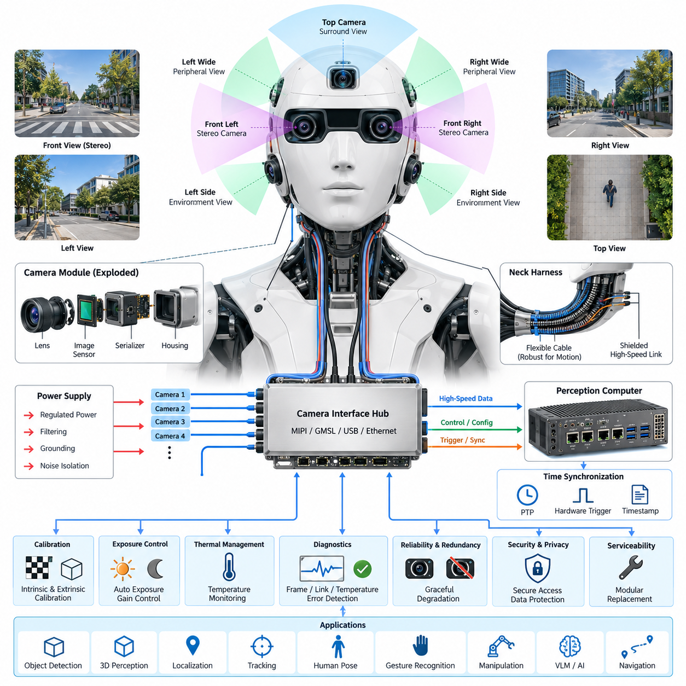
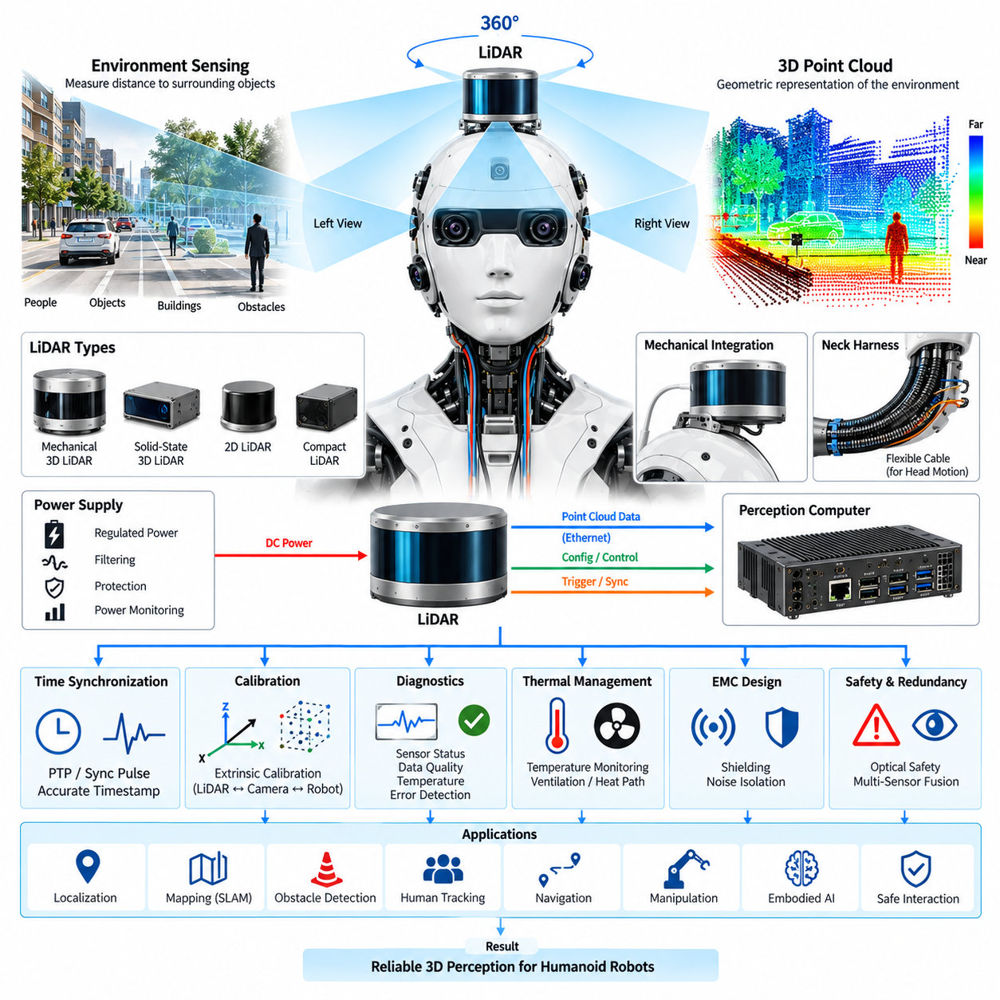
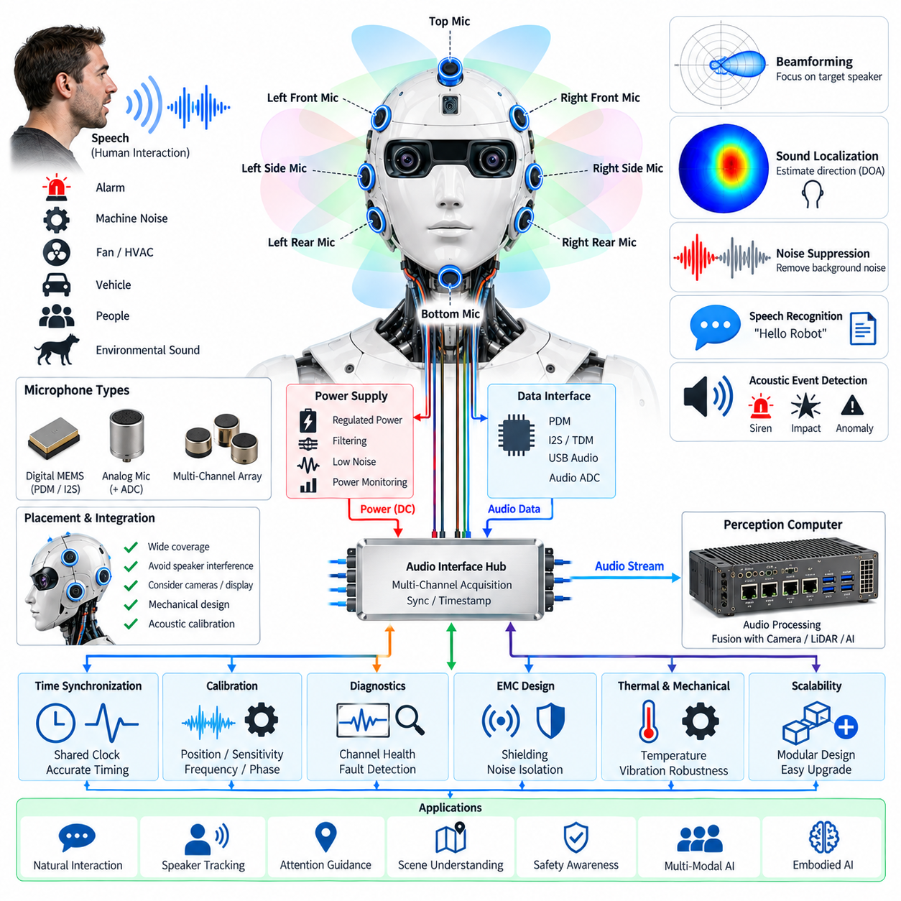
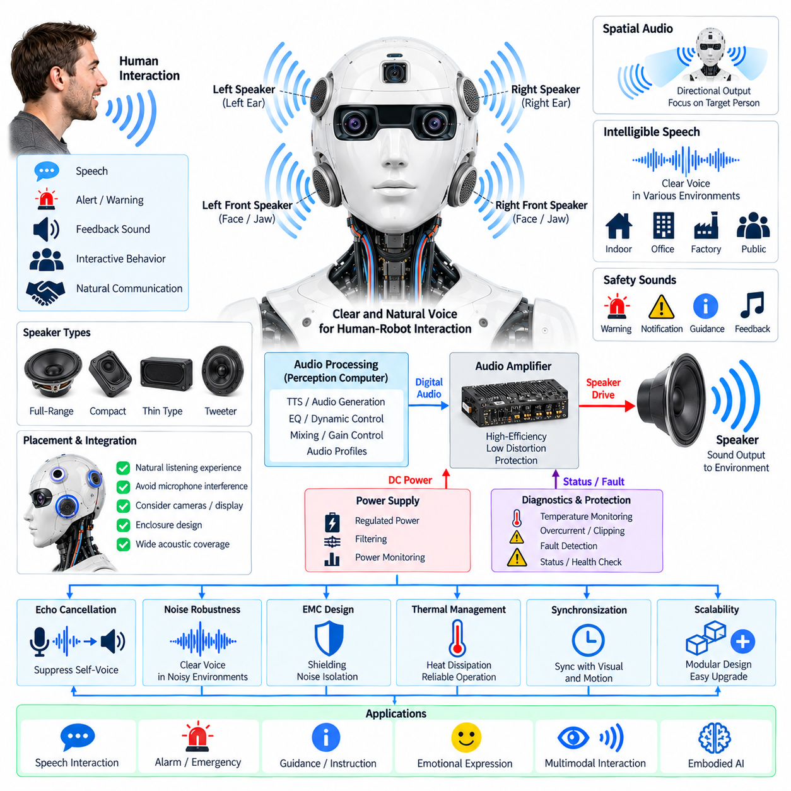
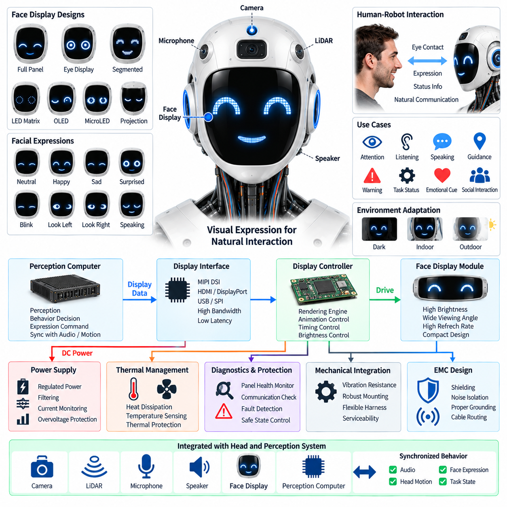
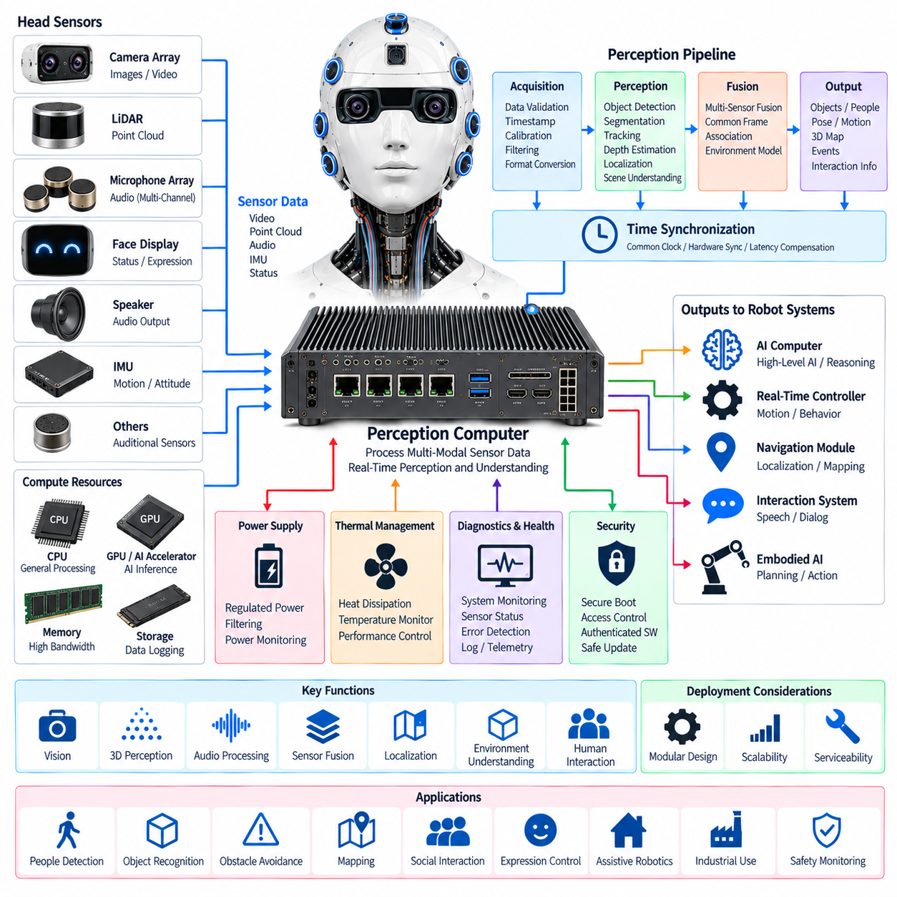

**Volume 21. Humanoid Electrical Architecture**

# Chapter 08. Head and Perception

## 08.01. Camera Array

{width="7.268055555555556in" height="7.268055555555556in"}

A humanoid camera array forms the primary visual sensing layer of the head and perception architecture, converting light from the surrounding environment into synchronized digital image streams for perception, navigation, manipulation, and human interaction. Rather than treating each camera as an independent sensor, the electrical architecture integrates multiple cameras as a coordinated sensing subsystem connected to the perception computer.

The camera array is normally arranged to provide overlapping fields of view around the humanoid head. A forward-facing stereo pair can support depth estimation and three-dimensional reconstruction, while additional wide-angle cameras extend peripheral awareness and reduce blind regions. Depending on the application, dedicated cameras may also observe the hands, workspace, floor, or interaction zone without requiring continuous head movement.

Stereo vision places strong requirements on mechanical alignment, image synchronization, and calibration stability. The left and right cameras should capture corresponding scenes with sufficiently small timing differences so that moving objects and robot motion do not introduce false disparities. Camera mounting structures therefore become part of the sensing architecture because vibration, thermal expansion, or mechanical impact can gradually alter the calibrated relationship between optical axes.

Camera selection involves more than image resolution. Frame rate, pixel size, dynamic range, shutter type, sensitivity, lens characteristics, interface bandwidth, power consumption, and operating temperature all influence system performance. Global-shutter sensors are particularly useful for dynamic humanoid applications because they reduce geometric distortion when the head, body, hands, or surrounding objects move rapidly during image acquisition.

Different optical configurations can coexist within the same array. Narrower lenses provide greater spatial detail for object recognition and manipulation, whereas wide-angle lenses improve situational awareness. RGB cameras supply appearance information, and monochrome or near-infrared cameras can improve sensitivity for specialized perception tasks. Depth cameras may complement stereo vision when direct range information is useful at short and medium distances.

The electrical architecture must provide clean and stable power to every camera module. Image sensors, serializers, interface controllers, and local processing devices can be sensitive to supply ripple and transient disturbances generated by motors and switching power converters elsewhere in the humanoid. Dedicated regulation, filtering, grounding, shielding, and appropriate power-domain separation help prevent electrical noise from degrading image quality or communication reliability.

High-resolution multi-camera systems generate substantial data bandwidth. Several cameras operating simultaneously at high frame rates can produce data rates that exceed the practical capacity of conventional low-speed robot networks. High-speed interfaces such as MIPI CSI-2, GMSL-class serialized links, USB, or Gigabit Ethernet may therefore be selected according to camera placement, cable length, bandwidth, electromagnetic compatibility, latency, and serviceability requirements.

Longer camera connections inside a humanoid introduce additional electrical challenges because signals may travel from the moving head through the neck to a torso-mounted perception computer. High-speed differential links require controlled impedance, suitable shielding, robust connectors, and careful routing away from actuator power cables. Flexible harness sections around the neck must tolerate repeated motion without causing intermittent signal integrity or grounding failures.

Precise time synchronization is essential when images are fused with LiDAR, IMU, joint encoders, force sensors, or other perception sources. Each frame should be associated with an accurate capture timestamp rather than only the time at which software receives the image. Hardware triggering, synchronized clocks, or network-based time synchronization can establish a common temporal reference and reduce fusion errors during rapid humanoid motion.

The camera array should support deterministic identification of every sensor and data stream. Each camera can be assigned a physical location, logical identifier, calibration record, firmware version, and communication endpoint. This prevents left-right or front-side stream confusion during manufacturing and maintenance. Configuration information can also describe resolution, exposure limits, frame rate, trigger mode, and optical parameters expected by perception software.

Calibration connects the electrical camera subsystem to the humanoid\'s geometric model. Intrinsic calibration describes focal length, principal point, lens distortion, and related optical characteristics, while extrinsic calibration defines each camera\'s pose relative to other sensors and robot coordinate frames. Calibration parameters should be version controlled and associated with individual hardware so that camera replacement does not silently invalidate perception geometry.

Exposure control becomes important when a humanoid moves between environments with strongly different illumination. The camera subsystem may encounter indoor lighting, windows, direct sunlight, shadows, reflective surfaces, or low-light scenes within seconds. Automatic exposure and gain control must react quickly while maintaining consistency between cameras used for stereo or multi-view processing, because large inter-camera brightness differences can reduce correspondence quality.

Thermal design also affects image quality and calibration. Image sensors and interface electronics generate heat, while nearby perception computers, displays, speakers, and mechanical actuators may raise the temperature inside the head enclosure. Temperature changes can influence sensor noise and mechanical alignment. Thermal paths, ventilation, heat spreading, temperature monitoring, and calibration compensation should therefore be considered during head-level electrical integration.

Electromagnetic compatibility is especially important because camera signals coexist with motor drives, switching converters, Ethernet links, displays, microphones, and wireless radios. Cable shields and chassis references must be designed as part of a complete grounding strategy rather than added independently. Connector transitions, shield termination, common-mode currents, and cable routing should be evaluated because high-speed video links can both receive and generate electromagnetic interference.

Camera diagnostics should detect failures before they propagate into higher-level perception behavior. Useful indicators include missing frames, excessive frame delay, synchronization loss, link errors, abnormal temperature, unexpected exposure values, corrupted images, and communication resets. The perception computer can combine these indicators with image-quality checks to distinguish electrical or communication faults from environmental conditions such as darkness or temporary lens obstruction.

A robust array should degrade gracefully when an individual camera becomes unavailable. Perception software can be informed of camera health so that algorithms avoid using invalid streams and, where possible, continue operation with reduced sensing capability. Critical functions should not assume that every camera remains continuously available. The required redundancy depends on the safety concept and on which visual functions influence robot motion near humans.

The camera subsystem must also address privacy and cybersecurity because humanoid robots can operate in homes, offices, factories, hospitals, and other human-centered environments. Image streams should be accessible only to authorized processing paths, and remote interfaces should prevent unintended exposure of raw video. Secure boot, authenticated software, protected configuration, and controlled data logging can help preserve trust in the visual sensing chain.

Serviceability strongly influences the practical camera-array design. Camera modules should be replaceable without extensive disassembly of the head, while connectors and harnesses should prevent incorrect installation. A replacement procedure can identify the new module, verify communication, load or generate calibration data, test synchronization, and confirm image quality before returning the humanoid to normal operation.

At system level, the camera array connects the physical environment to the humanoid\'s perception and embodied-AI functions. Synchronized visual streams can feed object detection, segmentation, depth estimation, tracking, visual localization, human pose estimation, gesture recognition, manipulation planning, and vision-language models. The electrical design must therefore preserve image integrity, timing accuracy, bandwidth, reliability, and maintainability from the image sensor to the perception computer.

A scalable camera architecture should allow future sensors to be added without redesigning the entire humanoid electrical system. Reserved interface bandwidth, modular power channels, configurable synchronization resources, standardized connectors, and software-defined sensor identities make later upgrades easier. This modular approach allows higher-resolution cameras, event-based sensors, improved depth devices, or specialized spectral cameras to be introduced as perception requirements evolve.

## 08.02. LiDAR

{width="7.268055555555556in" height="7.268055555555556in"}

LiDAR provides a humanoid robot with direct geometric information about its surroundings by measuring the distance between the sensor and visible surfaces. Within the head and perception architecture, LiDAR complements the camera array by producing spatial measurements that are less dependent on texture, color, or conventional image correspondence. The resulting range data supports environmental perception, localization, obstacle detection, navigation, and human-aware motion planning.

A humanoid LiDAR installation must balance field of view, sensing range, angular resolution, update rate, physical size, power consumption, and mechanical integration. Head-mounted placement provides an elevated viewpoint similar to human vision and can improve observation of furniture, walls, people, and navigation corridors. However, the sensor position must minimize occlusion from the robot\'s face, shoulders, arms, carried objects, and other body structures during normal motion.

Different LiDAR technologies can be selected according to the required perception function. A two-dimensional LiDAR provides range measurements within a scanning plane and can support basic obstacle detection or localization, while three-dimensional LiDAR generates a spatial point cloud covering vertical and horizontal directions. Solid-state or compact scanning devices may be attractive for humanoids because head volume, weight, vibration tolerance, acoustic noise, and appearance impose tighter packaging constraints than many mobile robot platforms.

The electrical interface must provide a stable power source with sufficient margin for sensor startup, continuous operation, and internal laser or scanning electronics. Dedicated power regulation and filtering can isolate the LiDAR from disturbances generated by joint actuators, motor drives, DC-DC converters, displays, and other high-current loads. Power monitoring can additionally detect abnormal current consumption and allow the robot controller to distinguish sensor faults from communication or software failures.

LiDAR data typically requires a higher-bandwidth communication path than conventional low-speed control sensors. Ethernet is commonly suitable for transmitting point clouds, status information, configuration commands, and diagnostic data between the LiDAR and perception computer. The selected network architecture must consider sustained data rate, packet latency, connector reliability, cable length, electromagnetic compatibility, switch capacity, and the additional traffic generated by cameras and other perception devices.

Precise time synchronization is essential when LiDAR measurements are combined with camera images, IMU data, joint positions, or robot motion estimates. A humanoid can rotate its head or move its entire body while a LiDAR scan is being generated, causing different points to represent slightly different robot poses. Accurate timestamps and a common time reference allow perception software to compensate for this motion and align measurements within a consistent spatial representation.

Network-based synchronization such as Precision Time Protocol can establish a shared clock between the LiDAR, perception computer, cameras, and other Ethernet-connected sensors when supported by the hardware. Some systems may additionally use synchronization pulses or dedicated trigger signals. The electrical architecture should preserve timing accuracy through switches and gateways so that synchronization quality is not lost as sensor data moves through the distributed humanoid communication system.

Geometric calibration defines the LiDAR position and orientation relative to the humanoid coordinate system. The transformation between the LiDAR frame, head frame, torso frame, camera frames, and robot base frame must be known accurately for sensor fusion. Because the humanoid head can move independently from the torso, joint encoder information and the kinematic model must also be incorporated when LiDAR observations are transformed into a global or body-centered coordinate frame.

Camera-to-LiDAR calibration is particularly important for perception functions that combine visual semantics with geometric depth. Camera images can identify objects, surfaces, people, or scene characteristics, while LiDAR supplies accurate spatial measurements for corresponding regions. Reliable fusion requires calibrated intrinsic and extrinsic parameters, synchronized acquisition, and consistent coordinate transformations so that image features and three-dimensional points describe the same physical locations.

The moving head introduces significant harness and connector requirements. Power and high-speed communication cables may pass through the neck together with camera, microphone, display, and control wiring. Repeated yaw, pitch, and potentially roll motion subjects these cables to continuous bending and torsional stress. Flexible cable sections, controlled bend radius, strain relief, shielding, and mechanically secure connectors are therefore important for maintaining long-term LiDAR availability.

Electromagnetic compatibility must be considered because LiDAR communication electronics operate close to motor drives, switching regulators, high-speed camera links, wireless systems, and other potential noise sources. Differential communication, appropriate cable shielding, controlled grounding, and physical separation from noisy power conductors help protect data integrity. The design should also prevent high-speed LiDAR interfaces from becoming significant electromagnetic emission sources within the humanoid head.

Mechanical vibration and shock can influence both LiDAR reliability and geometric accuracy. Walking, running, sudden stopping, manipulation, contact with the environment, and falls can transmit mechanical energy through the humanoid structure into the sensor. The mounting assembly should maintain a repeatable sensor pose while protecting the device within its specified vibration and shock limits. Excessively compliant isolation should be avoided when it introduces uncontrolled changes in calibration.

Thermal conditions inside the humanoid head can also influence LiDAR operation. The sensor may share limited enclosure space with cameras, perception electronics, communication devices, displays, and audio components. Heat generated by these devices can increase internal temperature and potentially affect ranging performance or sensor lifetime. Thermal monitoring, conductive heat paths, ventilation, and appropriate placement should therefore be coordinated with the overall head electrical and mechanical architecture.

LiDAR diagnostics should continuously evaluate communication status, frame or scan rate, internal temperature, synchronization state, supply voltage, packet errors, and sensor-reported fault conditions. Perception software can additionally monitor point-cloud density, unexpected measurement loss, persistent blind regions, or implausible ranges. Combining electrical diagnostics with data-quality monitoring improves the ability to distinguish hardware failures, contamination, occlusion, environmental effects, and communication problems.

Contamination of the optical window can significantly reduce ranging performance even when the electrical subsystem remains healthy. Dust, fingerprints, water droplets, condensation, or physical damage may reduce transmitted and received optical energy. A humanoid intended for long-duration operation should therefore include inspection and maintenance procedures for the LiDAR window, while diagnostic algorithms can identify persistent degradation patterns that indicate cleaning or service is required.

Safety considerations are particularly important because the LiDAR operates in environments shared with people. The selected sensor should satisfy the applicable optical safety requirements for its intended operating conditions, while mechanical integration should prevent unintended exposure conditions caused by modification or damage. The system safety architecture should also define how loss or degradation of LiDAR affects robot speed, protective functions, navigation behavior, and continued operation.

Redundancy does not necessarily require duplicating identical LiDAR sensors. A humanoid perception architecture can combine LiDAR with cameras, depth sensors, proximity sensing, force sensing, and other modalities so that the failure of one sensing channel does not immediately eliminate environmental awareness. The degree of redundancy should be determined from the required safety and operational functions rather than simply from the number of installed sensors.

The perception computer converts raw LiDAR measurements into representations useful for higher-level intelligence. Point clouds can be filtered, motion compensated, segmented, registered, and transformed into occupancy maps, geometric models, object tracks, or localization features. These outputs can then support simultaneous localization and mapping, collision avoidance, path planning, manipulation, human tracking, and embodied-AI functions that require reliable three-dimensional understanding of the physical environment.

A scalable LiDAR architecture should separate the sensor\'s physical installation from higher-level perception software as much as practical. Standardized power interfaces, Ethernet connectivity, synchronized timestamps, explicit coordinate frames, stored calibration parameters, and modular device configuration make sensor replacement and future upgrades easier. This allows newer LiDAR technologies to be introduced without fundamentally redesigning the humanoid\'s perception and computing architecture.

At system level, LiDAR should be treated as part of a synchronized multi-sensor perception chain rather than as an isolated ranging device. Its value depends on reliable power, deterministic communication, accurate timing, stable mechanical alignment, calibration, diagnostics, and integration with the camera array, IMU, joint sensing, and perception computer. Together, these elements transform raw range measurements into spatial awareness that enables the humanoid to understand and safely interact with its three-dimensional environment.

## 08.03. Microphone Array

{width="7.268055555555556in" height="7.268055555555556in"}

A humanoid microphone array provides the auditory sensing interface between the robot and its surrounding acoustic environment. Multiple microphones distributed around the head allow the system to capture speech, environmental sounds, alarms, mechanical noises, and other acoustic events from different directions. Unlike a single microphone, an array can exploit spatial differences between microphones to estimate sound direction, improve speech intelligibility, and separate a desired speaker from background noise.

The physical arrangement of microphones strongly influences acoustic performance. Microphones can be distributed across the front, sides, and upper or lower regions of the head to obtain broad spatial coverage. The spacing between elements determines the usable frequency range for spatial processing, while the relative position of each microphone must remain accurately known. Mechanical symmetry can simplify signal processing, but practical placement must also consider cameras, speakers, displays, structural members, ventilation openings, and the external shape of the humanoid head.

Microphone selection should consider sensitivity, frequency response, self-noise, dynamic range, maximum sound-pressure level, power consumption, package size, and interface type. Digital MEMS microphones are attractive for compact humanoid designs because they can provide consistent characteristics, small form factors, and direct digital interfaces. Analog microphones may still be appropriate when centralized analog front-end processing is required. The selected architecture should maintain consistent phase and amplitude characteristics across the array.

The microphone electrical interface must provide clean and stable power because low-level audio signals are highly sensitive to electrical interference. Switching regulators, motor drivers, DC-DC converters, displays, wireless radios, and high-speed processors can introduce conducted or radiated noise into the audio subsystem. Local regulation, filtering, appropriate grounding, supply-domain separation, and careful return-current design can reduce interference before it becomes audible or contaminates the digital audio stream.

The microphone array requires a suitable data-acquisition architecture to collect multiple channels with deterministic timing. Digital microphones may use interfaces such as PDM, while other implementations can use I2S, TDM, USB audio, or dedicated audio converters. The architecture should preserve channel identity and timing so that signals from different microphone positions remain correctly aligned. Incorrect channel mapping or variable latency can significantly reduce the effectiveness of beamforming and sound localization.

Time synchronization is particularly important for spatial audio processing. Beamforming and direction-of-arrival estimation depend on very small differences in the arrival time of sound at different microphones. Therefore, all channels should share a stable sampling clock or a precisely controlled synchronization mechanism. Clock drift, sample-rate mismatch, or asynchronous acquisition can introduce phase errors that reduce localization accuracy and cause unwanted artifacts in speech enhancement.

Beamforming combines the signals from multiple microphones to emphasize sound arriving from a selected direction while suppressing sound from other directions. A humanoid can use adaptive beamforming to focus on a person speaking in front of the robot, while maintaining the ability to change the listening direction as the robot turns its head or identifies another speaker. The beamforming strategy should account for the microphone geometry, acoustic environment, robot motion, and computational resources available in the perception system.

Sound localization enables the humanoid to estimate where an acoustic event originates. Techniques based on time difference of arrival, phase information, signal correlation, or learned acoustic models can estimate the direction of a speaker or other sound source. When combined with camera and LiDAR information, the estimated acoustic direction can be associated with a physical person or object. This multimodal association allows the robot to look toward a speaker, identify the active participant, and maintain spatial awareness during interaction.

The head itself becomes part of the acoustic system because its mechanical surfaces cause reflection, diffraction, and attenuation. The face, ears, housing, cameras, speakers, and other structures can modify the sound field around each microphone. Consequently, microphone placement should be evaluated using acoustic simulation and physical measurements rather than relying only on geometric symmetry. The final calibration should characterize the actual assembled head rather than an isolated microphone module.

Speaker and microphone placement must also be coordinated to prevent acoustic feedback. When the humanoid produces speech or other sounds through its speakers, those signals can be captured by its own microphones and interpreted as external speech. Echo cancellation, acoustic echo control, gain management, and appropriate physical separation can reduce this problem. The audio architecture should maintain a reference signal from the speaker path so that the processing system can estimate and remove predictable acoustic feedback.

The microphone array should remain effective in the presence of environmental noise. Humanoid robots may operate near motors, fans, HVAC systems, vehicles, people, machinery, or other robots. Noise suppression can combine spatial filtering, spectral processing, adaptive algorithms, and learned models to improve speech recognition performance. However, excessive suppression can remove important environmental sounds, so the architecture should preserve acoustic information required for safety and situational awareness.

Acoustic perception can support more than speech recognition. The array may detect alarms, impacts, abnormal mechanical sounds, human activity, approaching objects, or changes in the surrounding acoustic environment. Acoustic event detection can therefore complement visual and geometric sensors. In some situations, sound may provide an early indication of an event occurring outside the current camera field of view, allowing the humanoid to redirect its attention toward the relevant location.

The microphone subsystem should be integrated with the perception computer through a defined audio processing pipeline. Raw multi-channel audio can be synchronized, filtered, beamformed, noise-reduced, and converted into features or streams required by automatic speech recognition, sound classification, speaker identification, and multimodal AI models. Processing may be divided between local audio hardware and the main perception computer to balance latency, bandwidth, power consumption, and computational requirements.

Electromagnetic compatibility is important because the microphone array operates in one of the most noise-sensitive areas of the humanoid. High-current actuator wiring and switching power circuits should be physically separated from microphone traces and audio cables wherever practical. Differential signaling, shielding, controlled grounding, and careful connector design can reduce susceptibility to interference. The head harness should also prevent repeated mechanical movement from creating intermittent electrical connections that appear as audio noise.

Thermal and mechanical considerations influence long-term microphone performance. Although individual microphones generally consume little power, nearby processors, displays, communication devices, and other electronics can raise the internal head temperature. Temperature changes can affect microphone characteristics and electronic noise. Mechanical vibration from walking, joint operation, or impacts can also couple into the microphones and create unwanted low-frequency signals, making structural isolation and vibration-aware signal processing important.

The microphone array should include health monitoring and diagnostic functions. The system can monitor channel availability, signal amplitude, noise floor, clipping, unexpected DC levels, synchronization status, communication errors, and abnormal spectral characteristics. Comparing multiple microphone channels can help identify a blocked, disconnected, damaged, or degraded microphone because one channel may exhibit behavior that differs significantly from the others. Diagnostic information should be available to the perception computer and maintenance system.

Calibration establishes the relationship between the microphone array and the humanoid\'s spatial coordinate system. The physical position of each microphone should be recorded accurately, while acoustic calibration can characterize sensitivity differences, phase relationships, frequency response, and directional effects. Calibration data should be associated with the specific head assembly so that replacement of a microphone module does not silently invalidate sound localization or beamforming performance.

The microphone array becomes especially powerful when combined with the camera array, LiDAR, and other perception sensors defined within the head architecture. Acoustic direction can guide visual attention, while visual recognition can identify which person is speaking. LiDAR can provide geometric context for the estimated sound source, and the perception computer can combine these modalities into a common spatial representation. This creates an audio-visual perception loop in which hearing and vision continuously reinforce each other.

A scalable microphone architecture should allow additional microphones or improved audio processing hardware to be introduced without redesigning the entire head. Standardized interfaces, stable clocking, modular harness connections, stored calibration parameters, and software-defined channel identification support future upgrades. As humanoid interaction becomes more natural, the microphone array can evolve from a speech-input device into a distributed acoustic perception system supporting localization, environmental understanding, human interaction, and embodied AI.

## 08.04. Speaker System

{width="7.268055555555556in" height="7.268055555555556in"}

The humanoid speaker system provides the primary acoustic output interface between the robot and people or surrounding environments. Integrated into the head and perception architecture, it converts digital audio generated by the perception computer into controlled acoustic energy for speech, alerts, feedback sounds, and interactive behaviors. The speaker system should therefore be treated as an electrical, acoustic, mechanical, and software-integrated subsystem rather than simply as an audio output device.

Speaker placement strongly affects intelligibility, acoustic coverage, and interaction quality. Speakers may be positioned around the face, ears, jaw, or other head regions to create a natural listening experience for people located in front of or beside the humanoid. The enclosure geometry, speaker orientation, grille structure, and surrounding mechanical components influence frequency response and directivity. Placement must also consider microphones, cameras, displays, ventilation paths, and available head volume.

The speaker selection process should consider output power, frequency response, sensitivity, impedance, maximum sound-pressure level, distortion, efficiency, physical size, mass, and thermal characteristics. Small full-range speakers may be suitable for compact speech-oriented systems, while multiple drivers can provide improved frequency reproduction and acoustic coverage. The electrical architecture should match the selected speaker characteristics with an appropriate amplifier so that the available output power is used efficiently without excessive distortion or thermal stress.

The amplifier and audio power stage require a stable electrical supply because speaker output can generate rapidly changing current demand. Motor drives, switching converters, displays, and other high-current loads may introduce disturbances into the audio power domain. Local power regulation, filtering, grounding, and appropriate separation between high-current actuator circuits and audio electronics help reduce audible interference. Power monitoring can also identify abnormal current consumption or amplifier faults.

Digital audio from the perception computer must pass through a controlled audio processing chain before reaching the speaker amplifier. The pipeline may include sample-rate conversion, equalization, dynamic-range control, volume management, digital filtering, mixing, and protection functions. The architecture should maintain predictable latency so that generated speech and interactive responses remain synchronized with the robot\'s visual behavior, gestures, facial display, and other physical actions.

Acoustic feedback is a critical issue when the humanoid contains both a microphone array and a speaker system. The robot\'s own voice can be captured by its microphones and mistakenly interpreted as external speech. Acoustic echo cancellation can use the speaker reference signal to estimate the sound reaching the microphones and suppress the predictable component. Speaker placement, enclosure design, microphone geometry, adaptive filtering, and gain control should therefore be designed together as a single audio interaction system.

The speaker system should support clear speech over a range of environmental conditions. A humanoid may operate in quiet rooms, offices, factories, public spaces, or areas containing machinery and people. Automatic gain control, equalization, noise-aware volume management, and suitable directivity can help maintain speech intelligibility. However, increasing volume alone is not sufficient because excessive acoustic output can cause discomfort, increase echo, and reduce the natural quality of human-robot interaction.

Spatial audio can further improve the perception of direction and presence. Multiple speakers can be driven with controlled amplitude and phase relationships to create a wider acoustic field or directional output. The robot can adjust its audio presentation according to the estimated position of a person obtained from cameras, LiDAR, or the microphone array. This allows the humanoid to direct speech toward an interaction partner while reducing unnecessary sound energy in other directions.

The speaker enclosure is part of the acoustic design and must be considered together with the mechanical head structure. Internal cavities, mounting brackets, damping materials, openings, and protective grilles can significantly change resonance and frequency response. Mechanical vibration from actuators can also couple into the speaker structure and produce unwanted noise. Secure mounting, acoustic damping, structural isolation, and carefully designed acoustic paths help maintain consistent output quality during humanoid motion.

Electromagnetic compatibility is important because audio amplifiers and speaker wiring operate near switching regulators, motor drivers, high-speed communication links, cameras, and wireless systems. Differential audio interfaces, appropriate shielding, controlled grounding, and careful cable routing can reduce susceptibility to electrical noise. Speaker cables should also be routed so that rapidly changing motor currents do not create audible interference through magnetic or conducted coupling.

Thermal management becomes increasingly important as speaker output power increases. The amplifier, power conversion circuitry, and speaker voice coils can generate heat during sustained operation. Heat accumulation inside the compact humanoid head can affect electronic reliability and acoustic characteristics. Temperature monitoring, conductive heat paths, ventilation, amplifier protection, and appropriate power derating should therefore be included when the speaker system is expected to operate at high output levels for extended periods.

The speaker subsystem should provide diagnostic and protection functions. Useful monitoring parameters include amplifier temperature, supply voltage, output current, clipping, overload, communication status, and detected hardware faults. Protection mechanisms can reduce output power or disable the affected channel when abnormal conditions occur. Diagnostic information should be available to the perception computer and maintenance system so that an audio failure can be distinguished from a software configuration problem or an external acoustic condition.

The speaker system must also support safe and predictable interaction with people. Maximum output levels should be controlled according to the operating environment, while sudden unexpected acoustic events should be managed appropriately. Warning tones, emergency notifications, speech output, and routine interaction sounds may require different priority levels. The audio architecture can therefore include controlled sound profiles and software-defined policies that determine which output functions are permitted under different robot operating states.

Integration with the microphone array, camera array, LiDAR, and perception computer transforms the speaker from a simple output device into an active component of multimodal interaction. The perception system can identify a person, estimate their location, interpret speech, select an appropriate response, and generate synchronized audio output. Combined with facial display and robot motion, the speaker system contributes to natural communication and helps establish a coherent relationship between what the humanoid perceives, decides, and expresses.

A scalable speaker architecture should use modular interfaces, standardized audio connections, replaceable speaker modules, stored configuration parameters, and software-controlled audio profiles. This allows future upgrades to amplifier technology, speaker performance, spatial audio processing, or human-interaction functions without requiring a complete redesign of the head. At system level, the speaker subsystem provides the controlled acoustic output required for speech, alerts, feedback, multimodal interaction, and embodied-AI behavior while maintaining electrical reliability, acoustic quality, thermal stability, and serviceability.

## 08.05. Face Display

{width="7.268055555555556in" height="7.268055555555556in"}

The humanoid face display forms the visual expression interface between the robot and people. Within the head and perception architecture, it works together with cameras, LiDAR, microphones, speakers, and the perception computer to communicate the robot\'s internal state through visual feedback. Rather than functioning as a conventional display alone, the face display should provide recognizable expressions, attention cues, interaction states, and status information while remaining electrically and mechanically integrated with the humanoid head.

The display surface should be designed around the geometry and appearance of the humanoid head. Depending on the intended character and interaction style, the system may use one continuous panel, two eye displays, multiple segmented displays, LED elements, microLED devices, OLED panels, or compact projection-based mechanisms. The selected architecture should provide sufficient brightness, contrast, viewing angle, refresh rate, and resolution while fitting within the limited head volume and maintaining appropriate mechanical strength and visual proportions.

Facial expression requires more than displaying static images. The face display can represent eye direction, blinking, pupil movement, emotional state, attention, confirmation, uncertainty, warning, and other interaction cues through controlled changes in shape, brightness, color, and animation. The rendering system should maintain smooth transitions and predictable timing so that visual expressions correspond naturally with speech, head motion, gestures, and the robot\'s behavioral state. Excessively rapid or complex animation should be avoided when it could distract users or increase processing and power requirements.

The electrical architecture must provide stable and appropriately regulated power to the display electronics. Display panels, LED drivers, timing controllers, graphics processors, and interface circuits can generate rapidly changing current demand, particularly when brightness or image content changes. These loads should be isolated appropriately from sensitive cameras, microphones, and other perception electronics. Local voltage regulation, filtering, current monitoring, and protection against overvoltage or thermal overload help maintain display reliability without introducing electrical noise into neighboring sensing systems.

The face display requires a high-speed data path between the perception computer and the display controller. Depending on the selected technology, interfaces may include MIPI DSI, HDMI, DisplayPort, USB, SPI, or a dedicated display interface. The communication architecture should provide sufficient bandwidth for the required resolution and refresh rate while maintaining deterministic or bounded latency. Display data should also remain synchronized with audio and motion outputs when facial expressions are used as part of coordinated human-robot interaction.

Thermal management is particularly important because the head provides limited internal space for heat dissipation. High display brightness, continuous animation, graphics processing, and local driver electronics can generate significant heat. Temperature rise can reduce component lifetime, change display characteristics, or trigger protective brightness reduction. Thermal paths, heat spreading, ventilation, temperature sensing, and appropriate enclosure materials should therefore be considered together with the optical and mechanical design of the face display.

Optical performance must remain usable across different environments. The display may operate in dark indoor rooms, brightly illuminated spaces, near windows, or under direct lighting. Automatic brightness control can adjust the display according to ambient conditions while preventing unnecessary power consumption. Excessive brightness should be avoided because it can appear unnatural or uncomfortable, while insufficient contrast can make expressions difficult to recognize. The system should prioritize visual clarity and consistent interpretation rather than simply maximizing brightness.

The face display should be coordinated with the camera and microphone systems so that visual expressions reinforce multimodal interaction. When the microphone array detects a speaker and the perception system identifies the interaction partner, the display can direct eye movement or visual attention toward that person. Camera-based perception can similarly determine when the robot should look toward an object or user. This creates a closed interaction loop in which sensing determines attention, the behavior system selects an expression, and the display communicates that state back to the human.

The display controller should maintain a clear separation between low-level rendering and high-level behavioral decisions. The perception or interaction computer can determine an abstract state such as listening, speaking, searching, thinking, warning, or completing an action, while a dedicated rendering layer converts that state into visual elements. This separation makes the facial interface easier to update and prevents application software from becoming tightly coupled to individual display hardware or pixel-level implementation details.

Synchronization with the speaker system is essential for natural communication. When the humanoid speaks, the face should visually indicate that the robot is speaking through mouth movement, eye behavior, or other coordinated animation. When the robot listens, the expression can change to indicate attention and active reception. The timing relationship between audio playback, facial animation, head movement, and interaction state should remain consistent so that the robot\'s behavior does not appear delayed or mechanically disconnected.

The face display should also support diagnostic and protective functions. The system can monitor panel temperature, supply voltage, current consumption, communication status, frame errors, display controller health, and abnormal pixel or segment behavior. Hardware protection can reduce brightness, disable a failed region, or place the display into a safe state when thermal or electrical limits are exceeded. Diagnostic information should be available to the perception or system controller so that display faults can be distinguished from software rendering problems.

Mechanical integration must account for vibration, impact, repeated head movement, connector retention, and serviceability. The display surface and supporting structure should maintain alignment while the humanoid walks, turns its head, interacts with objects, or experiences accidental contact. Flexible harnesses may be required between the moving head display and the main electronics. Connectors should be secured against repeated motion, and display modules should be replaceable without unnecessary disassembly of the complete head assembly.

Electromagnetic compatibility is also important because the face display operates close to cameras, microphones, wireless radios, high-speed processors, and motor-related electrical systems. High-speed display interfaces and switching LED drivers can generate electromagnetic emissions, while sensitive audio and image sensors can be susceptible to nearby interference. Controlled cable routing, shielding, grounding, filtering, and separation of noisy power paths from sensitive signal paths should therefore be incorporated into the head-level electrical architecture.

A scalable face-display architecture should allow different display technologies and visual designs to be introduced without redesigning the entire humanoid head. Standardized power interfaces, modular communication links, replaceable display modules, configurable rendering software, and stored calibration or configuration data can support future upgrades. As humanoid interaction becomes more sophisticated, the face display can evolve from a simple visual indicator into an active embodiment interface that communicates attention, emotion, system state, social cues, and interaction intent while remaining synchronized with speech, perception, motion, and embodied-AI behavior.

## 08.06. Perception Computer

{width="7.268055555555556in" height="7.268055555555556in"}

The perception computer forms the primary computational integration point for the humanoid head and perception subsystem. It receives data from the camera array, LiDAR, microphone array, and other head-mounted sensors, processes these streams, and provides structured information to the higher-level robot control and AI systems. It also coordinates visual, geometric, and acoustic perception so that the humanoid can maintain a consistent representation of people, objects, motion, and surrounding space.

The computer should be selected according to the combined workload of image processing, point-cloud processing, audio processing, sensor fusion, localization, object detection, tracking, and real-time interaction. CPU resources provide general-purpose processing and system coordination, while GPU or AI acceleration can execute computationally intensive neural-network inference and vision workloads. Memory capacity and bandwidth are equally important because multiple high-rate sensor streams may need to be buffered and processed concurrently.

The perception computer requires high-speed interfaces to connect the different sensors installed in the head. Camera streams may require dedicated high-bandwidth links, while LiDAR commonly produces continuous point-cloud data and the microphone array generates synchronized multi-channel audio. Ethernet, USB, MIPI-based interfaces, or other suitable links can be combined according to sensor requirements. The architecture should preserve sufficient bandwidth and avoid unnecessary data copies that increase latency and processor utilization.

Time synchronization is fundamental to multi-sensor perception. Camera frames, LiDAR measurements, microphone samples, and robot motion information must be associated with accurate timestamps so that measurements acquired at different locations and processing stages can be related to the same physical event. A common clock and appropriate synchronization mechanisms allow the perception computer to compensate for sensor latency, robot motion, and acquisition differences when constructing a consistent environmental representation.

Sensor fusion combines complementary information from the different perception devices. Cameras provide rich appearance and semantic information, LiDAR supplies direct geometric measurements, and microphones provide acoustic direction and event information. The perception computer can transform these measurements into common coordinate frames and associate observations that describe the same physical object or event. This fusion provides more robust environmental understanding than relying on any single sensing modality.

The perception pipeline should separate raw sensor acquisition from higher-level interpretation. Initial stages can perform data validation, timestamp processing, calibration compensation, filtering, synchronization, and format conversion. Subsequent stages can perform feature extraction, object detection, segmentation, tracking, depth estimation, localization, and scene interpretation. This layered organization allows individual algorithms or sensors to be replaced without requiring the complete perception architecture to be redesigned.

Latency and determinism are important because perception outputs influence robot behavior. A delayed object position, stale human location, or outdated obstacle measurement can cause the robot to react to a physical situation that has already changed. The perception computer should therefore establish bounded processing paths for functions that directly affect motion or interaction. Non-critical workloads can use asynchronous processing, while time-sensitive perception functions should receive predictable scheduling and resource allocation.

The perception computer must maintain stable operation while handling continuous sensor workloads. Thermal management is therefore an important part of the head-level architecture, especially when GPU or AI acceleration is used. Heat generated by processors, memory, storage, and interface electronics must be transferred through appropriate thermal paths without excessively increasing the temperature of cameras, LiDAR, microphones, or display components. Temperature monitoring and controlled performance reduction can protect the system under sustained computational loads.

Electrical power quality also affects perception reliability. The computer may share the head power domain with high-speed sensors, displays, communication devices, and audio electronics, while the overall humanoid contains motors and switching power converters that generate electrical disturbances. Appropriate regulation, filtering, grounding, power-domain separation, and current monitoring can reduce the probability that electrical noise or transient events interrupt perception processing or corrupt sensor communication.

The perception computer should provide hardware and software diagnostics for both computation and connected sensors. Useful information includes processor temperature, memory usage, accelerator load, storage health, interface errors, dropped frames, packet loss, sensor availability, synchronization status, and processing latency. By correlating system-level diagnostics with sensor-level health information, the humanoid can distinguish a failed sensor from a communication problem, computational overload, thermal limitation, or software malfunction.

Security and software integrity become important because the perception computer connects multiple sensors and higher-level robot functions. Controlled access to sensor data, authenticated software, protected configuration, secure boot mechanisms, and controlled update procedures can reduce the risk of unauthorized modification. The architecture should also separate safety-relevant processing from non-critical applications where appropriate, particularly when perception outputs can influence physical motion around people.

The perception computer provides an important boundary between head-level sensing and the broader humanoid computing architecture. Its outputs can be transmitted to higher-level AI computers, real-time controllers, navigation modules, interaction systems, and embodied-AI software through the robot communication architecture. This separation allows the head subsystem to concentrate on acquiring and interpreting sensor information while later computing layers perform broader planning, reasoning, learning, and behavior generation.

A modular perception computer architecture should allow processing capability to evolve as sensor resolution and AI models become more demanding. Standardized interfaces, replaceable compute modules, configurable software pipelines, expandable memory and storage, and hardware acceleration support can simplify future upgrades. The architecture should therefore provide sufficient performance margin for additional perception algorithms without requiring fundamental changes to the camera, LiDAR, microphone, speaker, and face-display subsystems.

At system level, the perception computer acts as the computational bridge between the physical sensing hardware in the humanoid head and the robot\'s higher-level intelligence. Its effectiveness depends not only on processor performance but also on bandwidth, synchronization, calibration, thermal design, power integrity, diagnostics, security, and software architecture. When these elements are integrated correctly, the perception computer transforms heterogeneous sensor streams into timely and coherent information that supports reliable interaction, environmental understanding, and embodied-AI behavior.
