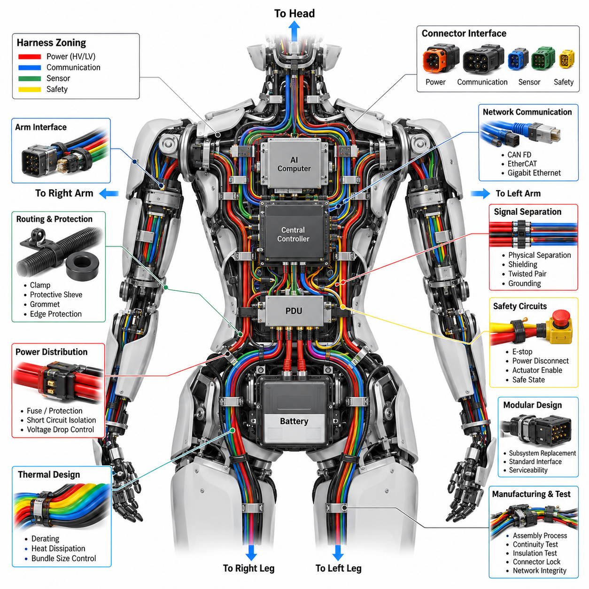
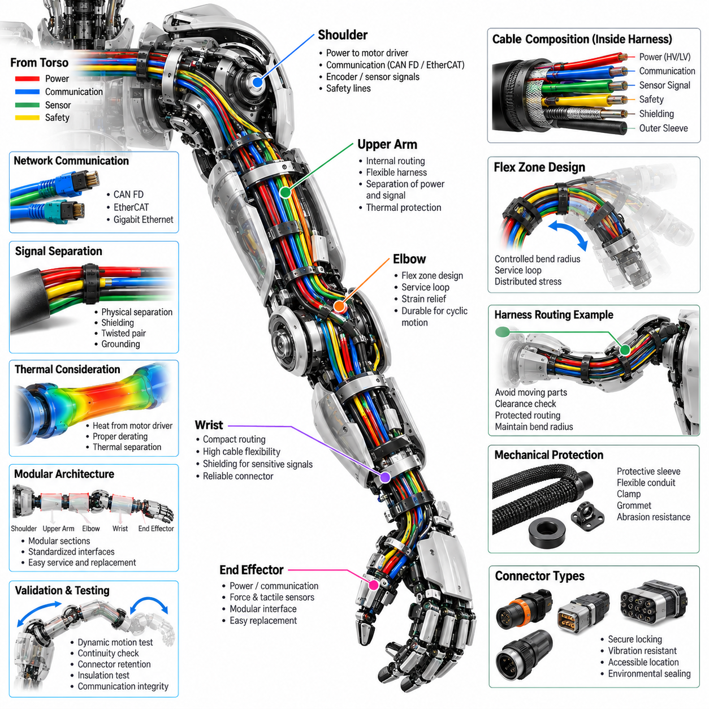
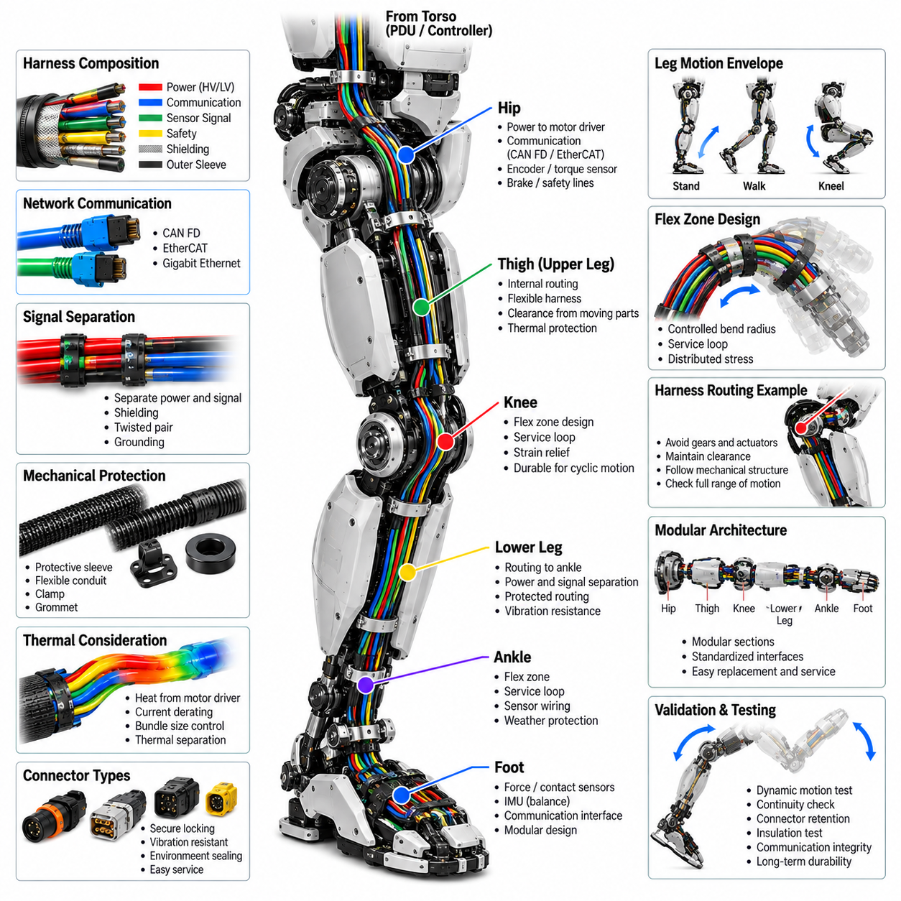
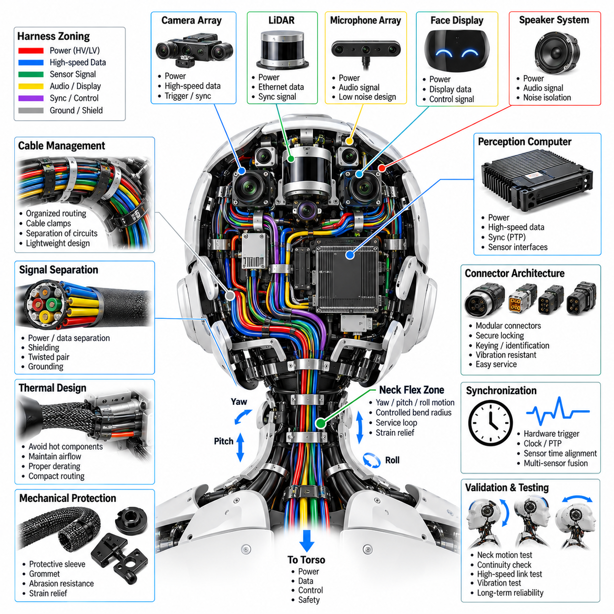
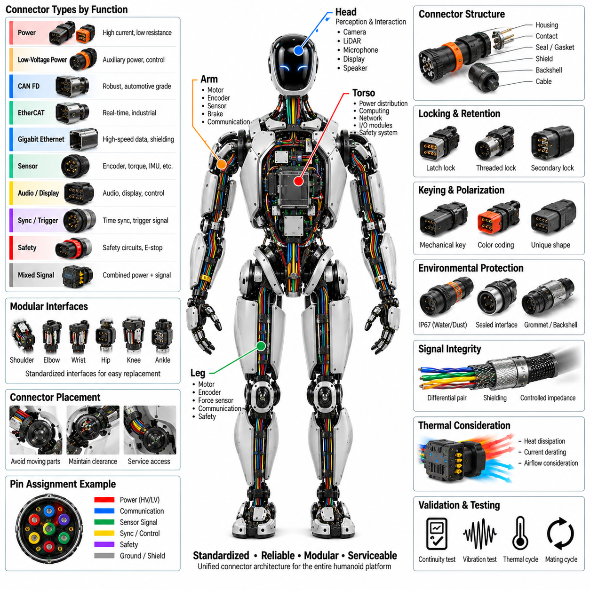
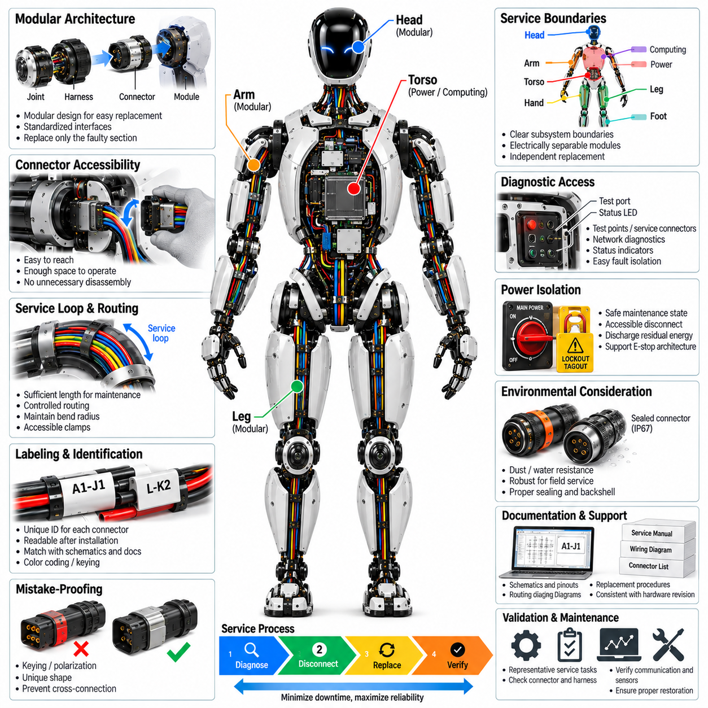

**Volume 21. Humanoid Electrical Architecture**

# Chapter 09. Harness and Connector Engineering

## 09.01. Torso Harness

{width="7.268055555555556in" height="7.268055555555556in"}

The following is structured for 09_01_Torso_Harness within Chapter 09, Harness and Connector Engineering, using the uploaded Volume 21 hierarchy as the primary structural reference.

A humanoid torso harness forms the central electrical backbone between the main power distribution, computing units, communication networks, upper-body actuators, head systems, and lower-body electrical assemblies. Unlike a conventional fixed-machine harness, it must support a compact three-dimensional structure with continuously moving joints and limited internal space. The design therefore begins with clear zoning of power, communication, sensing, and safety circuits while maintaining defined separation between high-current and low-level signal paths.

The torso harness typically distributes the primary supply from the battery and power distribution architecture toward multiple regional loads. High-current paths for joint actuators and computing equipment should be sized according to continuous and peak current requirements, allowable voltage drop, thermal conditions, and expected duty cycle. Branch circuits should incorporate appropriate protection so that a localized short circuit or overload does not unnecessarily disable unrelated humanoid functions. Physical routing should also minimize unnecessary conductor length and thermal concentration.

Communication wiring through the torso commonly connects the central controller with actuator controllers, sensor modules, safety devices, and peripheral computers. CAN FD and EtherCAT can be used for distributed actuator and real-time control networks, while Gigabit Ethernet may support high-bandwidth perception and computing data. Network cables should be routed with controlled bend radius and suitable shielding where required. Communication topology should remain consistent with the system-level architecture so that harness changes do not unintentionally alter network behavior.

The torso is also a major transition region between rigid body structures and flexible limb assemblies. Harness branches toward the arms and legs must accommodate relative movement without transferring excessive mechanical load into connectors or circuit boards. Strain relief, service loops, bend control, and protected passageways are therefore essential. The harness should be supported by defined attachment points so that vibration and repeated body motion do not produce uncontrolled movement, abrasion, connector fretting, or fatigue at conductor termination points.

Mechanical protection is particularly important because the torso harness may pass close to structural frames, actuator housings, cooling components, and other electrical modules. Protective sleeving, conduit, grommets, edge protection, and controlled clamp locations can prevent abrasion and crushing. Routing should avoid sharp edges and high-temperature surfaces while preserving accessibility for inspection and replacement. The design should also consider assembly tolerances because a harness that fits only under nominal conditions can become difficult to manufacture or service.

Power and signal separation should be maintained wherever practical. High-current actuator conductors can generate electromagnetic interference that may affect sensitive sensor, encoder, microphone, or communication circuits. Physical separation, appropriate grounding, shielding, twisted-pair construction, and controlled return paths can reduce these risks. The torso harness should therefore be treated as part of the overall EMC architecture rather than simply as a collection of wires connecting electrical modules.

Connector placement strongly influences both reliability and serviceability. Torso connectors should be positioned so that mating operations are unambiguous and accessible during assembly and maintenance. Different voltage classes, network functions, and safety-related circuits should use clearly differentiated connector families or keying strategies where practical. Locking mechanisms must withstand vibration and repeated service operations, while connector seals and backshells should match the environmental requirements of the humanoid platform.

The torso harness should support modular electrical architecture so that major subsystems can be replaced without removing the entire harness. Separate branches for the left arm, right arm, left leg, right leg, head, and torso electronics can simplify assembly and field service. This modular approach also allows harness variants to be created for different humanoid configurations while preserving common interfaces. Identification labels, connector numbering, wire color conventions, and manufacturing documentation should remain consistent across the entire platform.

Thermal design must account for the combined heat generated by power conductors and nearby electronic components. Bundling many high-current wires can increase conductor temperature and reduce allowable current capacity, particularly inside a compact torso enclosure with limited airflow. Harness design should therefore consider bundle size, ambient temperature, duty cycle, derating, and heat transfer to surrounding structures. Power branches serving continuously operating computing or actuator systems may require additional thermal margin.

Dynamic reliability is a major consideration even for the relatively rigid torso section because the harness interfaces directly with moving arms, legs, neck, and other assemblies. Repeated motion can transmit vibration and tensile forces into the torso-side connectors. The transition between fixed and moving harness sections should therefore be designed as a controlled mechanical interface. Flexible sections should begin at appropriate locations, with strain relief preventing conductor movement from being concentrated at connector terminals.

Safety-related circuits require additional consideration because the torso commonly contains central emergency-stop, power-disconnect, actuator-enable, and safety-controller interfaces. Safety wiring should be physically protected and logically separated where appropriate, with connector and routing strategies that reduce the possibility of accidental disconnection. The harness should support defined safe states during power loss, communication failure, connector removal, or subsystem faults. Safety requirements should be traceable from system architecture through wiring, connectors, protection devices, and validation testing.

Manufacturing considerations should be incorporated from the beginning rather than added after the electrical design is complete. The harness should use repeatable branch lengths, standardized terminals, controlled assembly processes, and accessible connector locations. Bend requirements and clip positions should be documented so that production technicians can reproduce the intended routing. Electrical continuity, insulation, connector locking, shielding, and network integrity should be verified before the harness is installed into the humanoid.

Finally, the torso harness should be designed as a maintainable platform interface rather than a permanent bundle of wires. Diagnostic access, connector identification, replacement procedures, and harness inspection points should be considered together with electrical performance. A well-designed torso harness provides reliable power and communication distribution, isolates sensitive signals from electrical noise, accommodates mechanical movement, and enables rapid subsystem replacement. This makes the harness an important part of the humanoid\'s overall electrical architecture, reliability, safety, and lifecycle service strategy.

## 09.02. Arm Flex Harness

{width="7.268055555555556in" height="7.268055555555556in"}

An arm flex harness connects the torso electrical architecture to the shoulder, upper arm, elbow, wrist, and end-effector systems while accommodating continuous multi-axis movement. Unlike a fixed torso harness, it must repeatedly bend, twist, and change orientation without imposing excessive force on connectors or actuator modules. The design therefore treats electrical continuity and mechanical flexibility as equally important requirements, with the harness geometry defined together with the arm\'s joint ranges and mechanical envelope.

The harness should be routed through the arm according to the physical arrangement of the shoulder, upper arm, elbow, wrist, and end-effector interfaces. Each branch should follow a controlled path that avoids moving actuator components, sharp structural edges, and high-temperature surfaces. The routing should maintain sufficient clearance throughout the complete range of motion rather than only at the nominal arm position. A three-dimensional digital model can be used to verify clearance, bend radius, connector access, and interference before physical prototypes are manufactured.

Dynamic bending is the primary reliability concern for an arm flex harness. Repeated shoulder, elbow, and wrist motion can produce cyclic tensile, compressive, and torsional loading in the conductors and insulation. The harness should therefore use controlled flex zones rather than allowing arbitrary bending along its entire length. Bend radius, free length, attachment locations, and transition points should be defined so that mechanical deformation is distributed across the flexible section instead of being concentrated near a connector or terminal.

Service loops and controlled slack are useful for accommodating joint motion, but excessive slack can create secondary problems. A loose harness may contact gears, pulleys, actuator housings, structural frames, or other moving components. Insufficient slack, on the other hand, can create excessive tension when the arm reaches its motion limits. The required harness length should therefore be determined from the complete joint trajectory, including combined shoulder, elbow, wrist, and end-effector movements rather than from individual joint angles considered separately.

The electrical composition of the arm harness depends on the functions supported by each arm module. Power conductors may supply motor drivers and peripheral electronics, while communication lines connect distributed controllers and sensors. Encoder, torque-sensor, force-sensing, tactile, and other low-level signals may also pass through the same physical harness. These circuits should be organized into appropriate groups, with sensitive signals separated from high-current actuator conductors to reduce electromagnetic interference and signal degradation.

Communication interfaces should follow the overall humanoid network architecture. CAN FD may provide distributed actuator communication, while EtherCAT can support deterministic real-time control where required. Higher-bandwidth interfaces may be used for selected sensors or intelligent end-effectors. The arm flex harness must preserve the electrical characteristics of these networks while maintaining mechanical flexibility. Shielding, twisted-pair construction, grounding strategy, and connector termination should therefore be considered together with the dynamic routing design.

The transition points at the shoulder, elbow, and wrist require particular attention because they experience changes in harness direction and mechanical loading. Fixed sections should be firmly supported, while flexible sections should begin at locations that allow gradual bending. Strain relief should prevent conductor movement from being transferred directly into connector contacts. Where the harness crosses a moving joint, the routing should be designed so that the neutral bending region remains controlled throughout the intended motion range.

Connector selection and placement should support both dynamic reliability and maintenance. Connectors located near moving joints should have secure locking mechanisms and sufficient retention against vibration and repeated movement. Their orientation should prevent excessive side loading on the mating interface. Where possible, connectors should be positioned in accessible locations so that an arm module, actuator, or end-effector can be removed without dismantling unnecessary portions of the harness.

Mechanical protection is required wherever the flexible harness passes through or around structural components. Protective sleeves, abrasion-resistant coverings, flexible conduits, grommets, and controlled clamps can prevent damage caused by repeated contact. However, protection components must themselves remain flexible enough for the required motion. Excessively rigid conduit or tightly positioned clamps can create new stress concentrations and reduce the fatigue life of the harness.

The arm harness should also consider thermal and electromagnetic conditions around the actuators. Motor drivers and power conductors can generate heat and electromagnetic noise, while encoder and torque-sensor circuits may require comparatively clean electrical conditions. Power and signal paths should therefore be arranged to limit thermal coupling and electromagnetic interference. Appropriate conductor sizing, derating, shielding, grounding, and physical separation should be verified according to the expected arm duty cycle.

A modular harness architecture can simplify assembly and replacement by separating the shoulder, upper-arm, elbow, wrist, and end-effector branches into logical sections. Such segmentation allows a damaged or modified arm module to be serviced without replacing the complete arm harness. Standardized interfaces also make it easier to support different actuator or end-effector configurations. Harness identification, connector numbering, branch definitions, and wiring documentation should remain consistent across left and right arm variants wherever practical.

Dynamic validation should reproduce the actual movement conditions expected during operation. Static continuity testing alone cannot demonstrate the reliability of a flex harness because many failures arise from repeated mechanical cycling. The harness should be evaluated through representative joint-motion cycles while monitoring conductor continuity, connector retention, insulation condition, and communication integrity. Particular attention should be given to locations where the harness repeatedly changes direction or experiences combined bending and twisting.

Manufacturing should preserve the intended flex geometry established during design validation. Branch lengths, connector orientation, protective sleeve position, clamp locations, and strain-relief dimensions should be controlled so that production units behave consistently. Excessive variation in assembly can change the neutral bending position and reduce fatigue life even when the electrical schematic remains unchanged. Production inspection should therefore verify both electrical characteristics and physical routing quality.

The final arm flex harness should function as an integrated mechanical and electrical subsystem rather than simply a collection of wires between arm modules. Its design must maintain reliable power, communication, sensing, and safety connections while continuously following the motion of the humanoid arm. A properly engineered flex harness reduces connector stress, prevents interference and abrasion, improves serviceability, and increases long-term reliability of the shoulder-to-end-effector electrical chain. The resulting architecture provides a controlled interface between the rigid electrical system and the highly dynamic mechanical structure of the humanoid arm.

## 09.03. Leg Flex Harness

{width="7.268055555555556in" height="7.268055555555556in"}

A leg flex harness connects the torso electrical architecture to the hip, knee, ankle, foot sensor, and balance-control systems while accommodating repeated multi-axis motion during standing, walking, climbing, and other whole-body movements. Unlike a fixed harness, it must continuously tolerate bending, twisting, vibration, and changes in joint geometry. The design therefore has to coordinate electrical connectivity with the mechanical motion envelope of the leg while maintaining reliable power, communication, sensing, and safety functions throughout the complete operating range.

The harness routing should follow the physical organization of the hip, thigh, knee, lower leg, ankle, and foot assemblies. Each section should maintain adequate clearance from actuators, gears, structural members, brakes, and other moving components. The routing must be checked not only at the nominal standing posture but also throughout representative walking and joint-motion trajectories. Three-dimensional mechanical modeling can be used to verify clearance, bend radius, attachment locations, connector accessibility, and potential interference before physical harness prototypes are produced.

Repeated joint movement is the primary mechanical challenge for a leg flex harness. Hip, knee, and ankle motion can generate combined bending, torsion, compression, and tensile loading on the conductors and protective materials. Flexible regions should therefore be deliberately defined rather than allowing uncontrolled movement along the entire harness. Bend radius, free length, support points, and transition locations should be selected so that repeated deformation is distributed across the intended flex section and does not become concentrated near terminals or connectors.

The knee and ankle regions require particular attention because they can produce large changes in harness geometry during normal locomotion. A harness that is sufficiently long for one posture may become excessively stretched or compressed in another. Controlled service loops and carefully positioned slack can accommodate these changes, but excessive slack may allow the harness to contact moving mechanisms or the ground-side structure. The required length and routing should therefore be determined from the combined motion envelope of the complete leg rather than from individual joint angles considered independently.

The leg harness may carry power for joint motor drivers together with communication, encoder, torque-sensor, foot-force, contact, and other sensing signals. These circuits should be organized into appropriate electrical groups according to their function and sensitivity. High-current actuator conductors should be separated from low-level sensor and communication circuits where practical. This arrangement helps reduce electromagnetic interference and prevents actuator switching noise from degrading signals required for precise joint control, contact detection, and balance estimation.

Communication interfaces should remain consistent with the humanoid communication architecture. CAN FD can provide distributed actuator communication, while EtherCAT can support deterministic real-time control where required. Additional interfaces may connect intelligent sensor modules or specialized foot electronics. The leg flex harness must preserve the required electrical characteristics while remaining mechanically flexible. Twisted-pair construction, shielding, grounding, connector termination, and physical routing should therefore be considered together rather than treated as independent electrical and mechanical decisions.

The transition points around the hip, knee, and ankle should use controlled mechanical interfaces between fixed and flexible harness sections. Rigidly supported sections should prevent unwanted movement, while flexible sections should begin where the harness can gradually accommodate joint motion. Strain relief should prevent tensile and bending forces from being transferred directly into connector contacts. At moving joints, the routing should maintain a predictable neutral bending region so that repeated motion does not continuously shift mechanical stress toward a single conductor or termination point.

Connector placement should support both dynamic reliability and serviceability. Connectors near the hip, knee, and ankle should have secure locking mechanisms capable of resisting vibration and repeated movement. Their orientation should minimize side loading and accidental contact with adjacent mechanisms. Where practical, connectors should be positioned so that actuator modules, sensor assemblies, or foot units can be removed without dismantling unnecessary sections of the complete leg harness. Standardized interfaces can also simplify replacement and configuration changes.

Mechanical protection is important because the leg operates close to structural members and moving mechanisms and may experience vibration and repeated contact. Protective sleeves, flexible conduits, abrasion-resistant coverings, grommets, and controlled clamps can protect the harness from rubbing, crushing, and sharp edges. However, protective components must not excessively restrict movement. A rigid conduit or improperly positioned clamp can create a new stress concentration and reduce flex fatigue life, so protection must be designed together with the required dynamic motion.

Thermal and electromagnetic conditions around the leg actuators must also be considered. Motor drivers and power conductors can generate heat and electrical noise, while encoder, torque, and foot-sensing circuits may require relatively clean signal conditions. Conductor sizing, current derating, bundle size, heat dissipation, shielding, grounding, and physical separation should therefore be evaluated according to the expected operating duty. The design should maintain sufficient thermal and electrical margin during continuous walking and high-load motion conditions.

A modular leg harness can divide the electrical architecture into logical sections associated with the hip, thigh, knee, lower leg, ankle, and foot. This structure can simplify assembly, diagnosis, and replacement because a damaged section does not necessarily require replacement of the complete harness. Standardized interfaces can also support different actuator or foot-sensor configurations. Harness identification, connector numbering, branch definitions, and routing documentation should remain consistent across left and right legs wherever the mechanical architecture permits common design rules.

The leg harness must support the electrical interfaces required by balance control and foot sensing. Signals from force or contact sensors in the foot can be important inputs for detecting ground contact and estimating the robot\'s support condition. Their wiring should therefore be protected from actuator noise and mechanical fatigue. Routing near the ankle and foot should preserve sensor integrity while allowing the substantial relative movement between the lower leg, ankle, and foot. Connector and cable placement should also permit sensor replacement without disturbing unrelated power or communication circuits.

Dynamic validation should reproduce representative leg movements rather than relying only on static electrical tests. Walking cycles, repeated knee flexion, ankle articulation, hip movement, and combined multi-joint trajectories should be used to evaluate harness behavior. During testing, continuity, connector retention, insulation condition, communication integrity, and visible mechanical wear should be monitored. Particular attention should be given to locations where bending, twisting, vibration, and tensile loading repeatedly occur together.

Manufacturing should preserve the flex geometry established during mechanical and electrical validation. Branch lengths, connector orientation, protective sleeve positions, clamp locations, service-loop dimensions, and strain-relief conditions should be controlled during harness assembly. Manufacturing variation can change the neutral bending position and consequently alter fatigue behavior even when the electrical schematic is unchanged. Production inspection should therefore verify both electrical characteristics and physical routing so that every leg harness maintains the intended dynamic behavior.

The final leg flex harness should function as an integrated mechanical and electrical subsystem linking the torso with the complete lower-body electrical architecture. It must maintain reliable power, communication, sensing, and safety connections while continuously following the motion of the humanoid leg. A properly engineered harness reduces connector stress, prevents abrasion and signal interference, supports balance-related sensing, and improves modular serviceability. This provides a controlled electrical interface between the relatively fixed torso architecture and the highly dynamic hip-to-foot structure required for reliable humanoid locomotion.

## 09.04. Head Harness

{width="7.268055555555556in" height="7.268055555555556in"}

The head harness forms the electrical interconnection between the humanoid torso and the perception, communication, interaction, and control devices located within the head. It typically carries power, high-speed data, synchronization, audio, display, and control signals for cameras, LiDAR, microphone arrays, speakers, face displays, and the perception computer. Because these functions share a compact mechanical volume, the harness must provide high signal integrity while maintaining low mass, controlled routing, and reliable operation during continuous head and neck motion.

The electrical architecture should organize head wiring according to functional domains rather than treating every connection as an independent cable. Power distribution, high-speed perception data, low-level sensor signals, audio interfaces, synchronization lines, and safety-related circuits should be separated where appropriate. This structured approach simplifies routing and diagnostics while reducing electromagnetic interaction between circuits. Harness branches should correspond logically to the camera array, LiDAR, microphone array, speaker system, face display, and perception-computing architecture.

Power conductors within the head harness supply sensors, communication devices, displays, audio electronics, and computing modules with different voltage and current requirements. Conductor size should be selected according to continuous current, startup or transient current, allowable voltage drop, thermal conditions, and harness bundling. Local conversion or distribution may reduce the number of conductors passing through the neck. Circuit protection should isolate localized faults so that a failure in one peripheral device does not unnecessarily disable unrelated perception or interaction functions.

High-speed data transmission is a major design consideration because multiple cameras and other perception sensors can generate substantial bandwidth. Gigabit Ethernet or other high-speed interfaces may connect head sensors and the perception computer to the central computing architecture. Cable impedance, pair geometry, shielding, connector termination, and bend radius should be controlled to preserve signal quality. Routing should avoid excessive proximity to switching power circuits, motors, converters, and other sources of electromagnetic interference that could degrade high-speed communication.

Camera-array wiring requires particular attention because several synchronized imaging devices may operate simultaneously. The harness may carry power, high-speed image data, hardware-trigger signals, and timing information between cameras and the perception computer. Cable lengths and routing should support deterministic synchronization where required. Connectors should provide secure retention while remaining sufficiently compact for the head enclosure, and individual camera branches should be identifiable so that sensor replacement or calibration work can be performed without disturbing unrelated devices.

LiDAR wiring may combine power, Ethernet or another data interface, and synchronization signals within a relatively compact branch. Because LiDAR can contribute critical spatial information to the perception system, connector retention and communication integrity should remain stable during vibration and repeated head movement. Routing should protect the cable from sharp edges and rotating structures while maintaining the required bend radius. The harness should also avoid obstructing the sensor field of view or interfering with the mechanical mounting and calibration reference of the LiDAR.

The microphone-array harness handles comparatively low-level signals that can be sensitive to electromagnetic noise. Audio-related wiring should therefore be separated from high-current and high-frequency switching circuits where practical. Shielding, grounding, balanced signal transmission, and careful return-path design can improve noise immunity. Cable placement should also preserve the geometric arrangement of the microphone array because the relative microphone positions are important for beamforming, sound-source localization, and other spatial-audio processing functions.

Speaker and face-display wiring introduces additional power and control requirements. Speaker amplifiers can produce transient currents and electrical noise, while display electronics may require both power and high-speed control interfaces. These circuits should be routed so that their switching activity does not interfere with cameras, microphones, or synchronization signals. Modular connectors can allow the face display, speaker assembly, or related interface electronics to be replaced independently without requiring removal of the complete head harness.

The neck transition is the most important dynamic region of the head harness because it connects the relatively fixed torso wiring to a head capable of yaw, pitch, and potentially roll motion. The harness must accommodate combined rotation and bending without excessive tensile loading or uncontrolled twisting. A controlled flex zone, appropriate service loop, minimum bend radius, and strain relief should distribute mechanical deformation over a defined length rather than concentrating stress at connectors or conductor terminations.

Harness routing through the neck should be evaluated across the complete head-motion envelope. A cable arrangement that appears acceptable in the neutral position may become stretched, compressed, pinched, or excessively twisted at maximum rotation. Three-dimensional mechanical simulation or digital mock-up can help evaluate these conditions before prototype fabrication. Routing should maintain clearance from neck actuators, gears, bearings, structural edges, and moving covers while preventing loose cables from entering mechanical interfaces.

Mechanical protection inside the head is required despite the relatively protected enclosure. Harness branches may contact structural frames, sensor brackets, cooling hardware, or enclosure edges during vibration and service operations. Protective sleeving, grommets, abrasion-resistant coverings, clips, and strain-relief components can prevent damage. These protective elements should remain lightweight because additional mass in the head increases neck actuator load, inertia, and dynamic control requirements for the humanoid.

Thermal management should be coordinated with harness design because perception computers, cameras, displays, communication electronics, and power converters can generate significant heat within a compact enclosure. Cable bundles should not obstruct cooling airflow or interfere with heat sinks and thermal paths. Current-carrying conductors require suitable derating according to ambient temperature and bundle conditions. Routing should avoid high-temperature components where possible while preserving sufficient access for cooling-system inspection and maintenance.

Connector architecture should support modular assembly and field service. Separate interfaces for the camera array, LiDAR, microphone array, speaker system, face display, perception computer, and neck transition can simplify subsystem replacement. Connector keying and identification should reduce the possibility of incorrect mating, while locking mechanisms should resist vibration and repeated head movement. High-speed connectors should maintain the required impedance and shielding continuity, and service connectors should remain accessible without unnecessary disassembly of the complete head structure.

Time synchronization is especially important when multiple perception sensors operate together. Camera frames, LiDAR measurements, audio streams, IMU data, and other sensor information may need consistent timestamps for sensor fusion and embodied-AI processing. The head harness should therefore support synchronization interfaces defined by the overall computing and communication architecture. Hardware trigger, clock, or network-based synchronization paths should be routed and terminated so that timing integrity is preserved together with ordinary communication reliability.

Validation should include both electrical and mechanical testing under representative operating conditions. Continuity, insulation, voltage drop, communication quality, shielding integrity, and connector retention should be checked together with repeated neck-motion cycles. High-speed links should be evaluated while the head moves through representative yaw and pitch trajectories. Testing should also examine whether repeated movement changes cable geometry, creates abrasion, loosens connectors, or introduces intermittent communication and sensor faults.

The final head harness should operate as an integrated interface connecting perception hardware, interaction devices, computing resources, and the torso electrical architecture. Its design must combine high-bandwidth communication, precise synchronization, low-noise sensor wiring, reliable power distribution, dynamic neck flexibility, thermal compatibility, and modular serviceability. A properly engineered head harness preserves sensor integrity during motion while providing a maintainable electrical foundation for perception, human-robot interaction, and embodied intelligence.

## 09.05. Connector Architecture

{width="7.268055555555556in" height="7.268055555555556in"}

Connector architecture in a humanoid robot defines the standardized electrical interfaces that join the torso, arms, legs, head, joint modules, sensors, computing units, and power-distribution systems. The connector system must carry power, real-time communication, high-speed data, sensing, synchronization, and safety circuits while fitting within tightly constrained mechanical spaces. Because humanoids contain many replaceable modules and continuously moving structures, connector selection directly influences reliability, assembly efficiency, maintainability, and lifecycle cost.

A connector architecture should begin by classifying interfaces according to electrical function and operating environment. High-current power, low-voltage auxiliary power, CAN FD, EtherCAT, Gigabit Ethernet, sensor signals, synchronization, and safety circuits have different requirements for contacts, shielding, impedance, insulation, and mechanical retention. Standard connector families can be assigned to these functional classes so that similar interfaces across the robot follow common engineering rules rather than using unrelated connector types for every module.

Power connectors must support the continuous and peak currents required by actuators, computing equipment, and local distribution modules. Contact resistance should remain sufficiently low to limit voltage drop and localized heating, particularly in high-current joint and power-distribution interfaces. Contact rating should include appropriate derating for ambient temperature, enclosure conditions, conductor size, and expected duty cycle. Power interfaces should also provide adequate insulation and creepage or clearance appropriate to the voltage architecture used by the humanoid.

Communication connectors require electrical characteristics matched to the associated network. CAN FD and EtherCAT interfaces depend on controlled differential signaling, while Gigabit Ethernet requires appropriate impedance, pair geometry, and shielding continuity. Connector transitions should minimize impedance discontinuities that can produce reflections and degrade signal integrity. High-speed interfaces should therefore be evaluated as part of the complete channel, including cable, connector, terminal, shielding, and PCB transition rather than validating the connector as an isolated component.

Sensor connectors may carry encoder, torque, force, tactile, IMU, temperature, and other low-level signals that can be sensitive to electrical noise. Their architecture should preserve signal integrity through suitable contact arrangement, grounding, shielding, and separation from high-current circuits. Where power and signals share one connector, pin allocation should reduce coupling between noisy and sensitive circuits. Ground or shield contacts can be strategically positioned to improve isolation while maintaining a compact interface.

Mechanical retention is critical because humanoid connectors experience vibration, acceleration, repetitive joint movement, and occasional shock loading. Connectors should use positive locking mechanisms that provide clear confirmation of full engagement and resist unintended separation. Latches, threaded couplings, secondary locks, or other retention mechanisms may be selected according to location and service requirements. The connector and harness should also incorporate strain relief so that cable movement does not transfer excessive mechanical loading into terminals or mating contacts.

Connector placement should reflect the mechanical architecture of the humanoid. Interfaces near shoulders, elbows, wrists, hips, knees, ankles, and the neck must remain clear of moving components and should not restrict the intended joint range. Connector orientation should minimize cable bending immediately behind the housing and prevent side loading during motion. Sufficient access should be maintained for mating and unmating operations, particularly where modules are expected to be replaced during production, maintenance, or field service.

Environmental protection requirements depend on connector location. Internal torso connectors may operate within relatively protected conditions, while connectors near hands, feet, external sensors, or exposed service interfaces can encounter dust, moisture, contamination, and mechanical contact. Sealed connector systems, appropriate backshells, gaskets, and environmental protection may therefore be required for selected zones. The environmental strategy should be defined at the system level so that sealing performance is consistent with the enclosure and harness architecture.

Connector keying and polarization reduce assembly errors by preventing incompatible interfaces from being accidentally mated. Interfaces carrying different voltage levels or safety-critical functions should be physically distinguishable where practical. Mechanical keys, shell geometry, color identification, coding features, and connector labels can support mistake-proof assembly. This becomes increasingly important in humanoids because many visually similar actuator, sensor, and communication modules can be concentrated within a small mechanical volume.

Pin assignment should follow standardized rules that remain consistent across related modules. Power, ground, communication pairs, shield connections, synchronization lines, enable signals, and diagnostic circuits should use predictable arrangements whenever the connector family permits. Consistent pin architecture simplifies harness manufacturing, schematic review, testing, troubleshooting, and spare-part management. It can also reduce engineering errors when left and right limbs or multiple joint modules share common electrical interfaces.

Modularity is one of the major objectives of humanoid connector architecture. Shoulder, arm, hand, hip, leg, foot, head, perception, computing, and power modules should be electrically separable at logical service boundaries. A damaged actuator or sensor module should ideally be removable without cutting wires or replacing a large portion of the harness. Standardized modular interfaces can also support future hardware revisions while preserving compatibility with unchanged portions of the robot.

Serviceability should influence both connector type and physical location. Frequently serviced interfaces should be accessible without requiring extensive disassembly, while connectors that are not intended for routine removal can prioritize compact packaging and secure retention. Connector labels and identification should remain visible after installation where practical. Service documentation should clearly associate connector identifiers with module names, circuit functions, pin assignments, and diagnostic procedures so that technicians can locate and verify interfaces efficiently.

Grounding and shielding architecture should be coordinated with connector design rather than implemented only through the cable. Shielded communication and sensor interfaces require controlled termination of cable shields through the connector and into the equipment enclosure or reference structure. Poor shield continuity at a connector can compromise an otherwise well-designed EMC system. Connector shells, shield contacts, drain paths, and grounding points should therefore follow the robot\'s overall electromagnetic compatibility and grounding strategy.

Thermal performance must also be considered because compact humanoid structures can contain many high-current contacts within limited airflow. Contact resistance generates heat, and connector temperature can rise further when interfaces are positioned near motor drivers, computing modules, or power electronics. Current derating, contact count, conductor size, ambient temperature, and local cooling conditions should be evaluated together. Thermal margin is particularly important for connectors supplying joints that repeatedly operate near high torque.

Manufacturing validation should confirm correct terminal insertion, crimp quality, pin assignment, connector locking, electrical continuity, insulation, and shielding. Automated or fixture-based harness testing can verify that each connector is wired according to the electrical definition before installation. Mechanical inspection should confirm keying, secondary-lock engagement, backshell assembly, strain relief, and sealing components. These checks reduce the possibility that a manufacturing defect becomes an intermittent fault after the humanoid enters dynamic operation.

Lifecycle validation should reproduce the mechanical and environmental stresses expected during robot operation. Connectors located near moving structures can be evaluated through repeated motion, vibration, thermal cycling, and mating-cycle tests while monitoring contact resistance and communication integrity. High-speed connectors should be checked for data reliability, while power connectors should be monitored for voltage drop and temperature rise. Validation should also consider wear caused by repeated maintenance and module replacement.

The final connector architecture should create a consistent interface system spanning the entire humanoid rather than a collection of independently selected connectors. Standardized electrical classes, pin assignments, locking methods, shielding rules, environmental protection, identification, and service boundaries provide a foundation for scalable robot development. A well-designed connector architecture improves electrical reliability while simplifying harness manufacturing, modular replacement, diagnostics, upgrades, and long-term maintenance across the complete humanoid platform.

## 09.06. Serviceability

{width="7.268055555555556in" height="7.268055555555556in"}

Serviceability in humanoid harness and connector engineering defines how efficiently electrical components can be inspected, diagnosed, disconnected, replaced, and restored throughout the robot lifecycle. A serviceable architecture treats maintenance as a design requirement rather than an activity considered after hardware integration. Harness routing, connector placement, module boundaries, labeling, accessibility, and diagnostic interfaces should therefore be developed together so that maintenance can be performed safely without unnecessary disassembly of adjacent structures.

The humanoid electrical architecture should establish clear service boundaries between the torso, head, arms, hands, legs, feet, computing systems, power distribution, and sensor assemblies. Each major subsystem should be electrically separable at a logical interface whenever practical. This modular structure allows a defective actuator, sensor, controller, or harness section to be replaced independently rather than requiring removal of a complete limb or large wiring assembly, reducing repair time and the risk of secondary damage.

Connector accessibility is a fundamental serviceability requirement. Connectors that are expected to be disconnected during routine maintenance should be positioned where technicians can reach the locking mechanism and mating interface with appropriate tools. Access should not require removal of unrelated actuators, structural frames, or electronics whenever avoidable. Connector orientation should also provide enough space for controlled insertion and removal without pulling directly on wires or applying damaging side loads to the connector housing.

Harness routing should allow visual inspection of critical sections and provide practical access to clamps, service loops, strain-relief components, and connector backshells. Routing hidden behind structural components may create compact packaging but can significantly increase maintenance time. Where concealed routing is unavoidable, removable covers or defined access paths should be provided. The service strategy should permit technicians to inspect areas exposed to repeated bending, vibration, heat, or abrasion before degradation develops into an operational failure.

Modular harness segmentation improves both replacement efficiency and fault isolation. Instead of using a single continuous harness from the torso to every peripheral device, the architecture can divide wiring into replaceable torso, shoulder, arm, wrist, hip, leg, ankle, head, and sensor sections. Connectors at these boundaries should be standardized where possible. A damaged flex section can then be replaced without disturbing unaffected fixed wiring, reducing spare-part cost and simplifying field maintenance.

Clear connector and harness identification is essential in a robot containing many visually similar interfaces. Each connector should have a unique identifier that corresponds to electrical schematics, harness drawings, diagnostic documentation, and service procedures. Labels should remain readable after installation and should be positioned where they can be inspected without excessive disassembly. Color coding, keyed connector families, and functional naming conventions can supplement identifiers, but they should not replace controlled documentation.

Mistake-proofing should prevent incorrect reconnection during maintenance. Similar connectors located close together can create a risk of cross-connection, particularly when left and right modules or repeated joint controllers use comparable interfaces. Mechanical keying, polarization, unique connector geometry, coding, and differentiated labels can reduce this risk. Interfaces carrying incompatible voltage levels or safety-critical circuits should receive particular attention so that an assembly error cannot easily produce electrical damage or unsafe behavior.

Service loops should provide enough cable length for connector access without introducing uncontrolled slack during operation. A technician may need to move a connector or module away from its installed position before disconnecting it, making a controlled service loop valuable. However, excessive cable length can interfere with moving joints or become an abrasion source. Service-loop geometry should therefore satisfy both maintenance access and dynamic routing requirements while preserving the defined minimum bend radius.

Replaceable modules should use connectors that support the expected number of mating cycles. A connector designed for permanent assembly may not remain reliable if repeatedly disconnected during diagnosis or module replacement. Frequently serviced interfaces should therefore consider contact durability, locking wear, terminal retention, sealing performance, and ease of manipulation. Maintenance procedures should also define inspection criteria for damaged contacts, contaminated seals, worn locks, or other conditions that justify connector replacement.

Diagnostic accessibility can significantly reduce mean time to repair. Test points, service connectors, network diagnostic interfaces, status indicators, and accessible power measurements can help technicians distinguish between harness faults and failures within sensors, actuators, controllers, or computing modules. Diagnostic access should be provided without compromising normal environmental protection or electrical safety. Where physical test points are impractical, software diagnostics can complement the harness architecture by identifying communication loss, abnormal voltage, or disconnected modules.

Fault isolation should follow the modular structure of the electrical system. If communication with a leg module is lost, the service procedure should allow technicians to determine whether the problem originates in the central network, torso connector, leg harness, joint connector, or local controller. Consistent interface definitions and accessible intermediate connections make this process more efficient. Harness documentation should therefore describe not only wire connectivity but also logical signal paths and subsystem boundaries relevant to troubleshooting.

Power isolation is essential before servicing actuators, power electronics, or high-current harness sections. The architecture should provide defined procedures and accessible means to place the robot in an electrically safe maintenance state. Residual energy in capacitors or powered actuators may require discharge or verification before connectors are removed. Safety-related connectors should be designed so that maintenance operations do not unintentionally energize a subsystem or bypass the intended emergency-stop and power-disconnect architecture.

Mechanical serviceability should be coordinated with electrical serviceability. A connector may be electrically removable yet practically inaccessible because a cover, actuator, cooling duct, or structural member blocks the required extraction path. Digital mock-up and physical prototype reviews should therefore include representative maintenance operations. Engineers should verify that tools, hands, connectors, and replacement modules have sufficient access and that removal paths do not require excessive bending or twisting of neighboring harness sections.

Spare-part strategy benefits from standardization across the humanoid platform. Common connector families, terminals, seals, protective sleeves, and harness construction methods can reduce the number of unique service components that must be stocked. Left and right limbs should share common electrical interfaces where mechanical requirements permit. Standardization also simplifies technician training and repair procedures while reducing the probability that an incorrect replacement component is selected during field maintenance.

Service documentation should connect the physical robot directly to engineering information. Harness drawings, connector views, pin assignments, routing diagrams, module replacement instructions, torque requirements, and inspection criteria should use consistent identifiers. Photographs or digital models can further clarify difficult access locations, although the underlying identification system should remain independent of presentation format. Configuration control is important so that service information remains aligned with the hardware revision actually installed on the robot.

Maintainability should be validated through representative service tasks rather than assumed from CAD packaging alone. Technicians can perform removal and replacement exercises for common components while measuring access difficulty, required tools, disassembly steps, and restoration checks. Repeated servicing can reveal problems such as inaccessible locks, excessive connector force, insufficient service loops, ambiguous labels, or harness interference. These findings should feed back into the mechanical, harness, connector, and documentation design.

After maintenance, the architecture should support efficient verification that the robot has been correctly restored. Electrical continuity, connector engagement, communication status, sensor availability, insulation, safety circuits, and module identification can be checked through defined post-service procedures. Automated diagnostics can confirm that expected devices have returned to the network before motion is enabled. This reduces the possibility that an incompletely seated connector or incorrect reconnection remains undetected until dynamic operation begins.

A serviceable humanoid electrical system ultimately combines modular harnesses, accessible and keyed connectors, controlled service loops, clear identification, diagnostic support, safe power isolation, standardized parts, and validated maintenance procedures. These features reduce repair time while protecting neighboring components from unnecessary handling. By incorporating serviceability into the original harness and connector architecture, the humanoid platform becomes easier to manufacture, diagnose, repair, upgrade, and sustain throughout repeated development and operational cycles.
