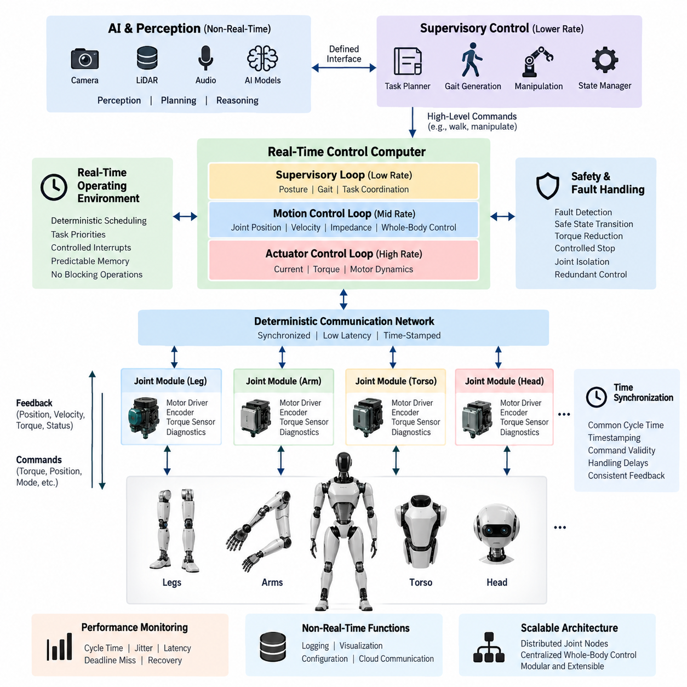
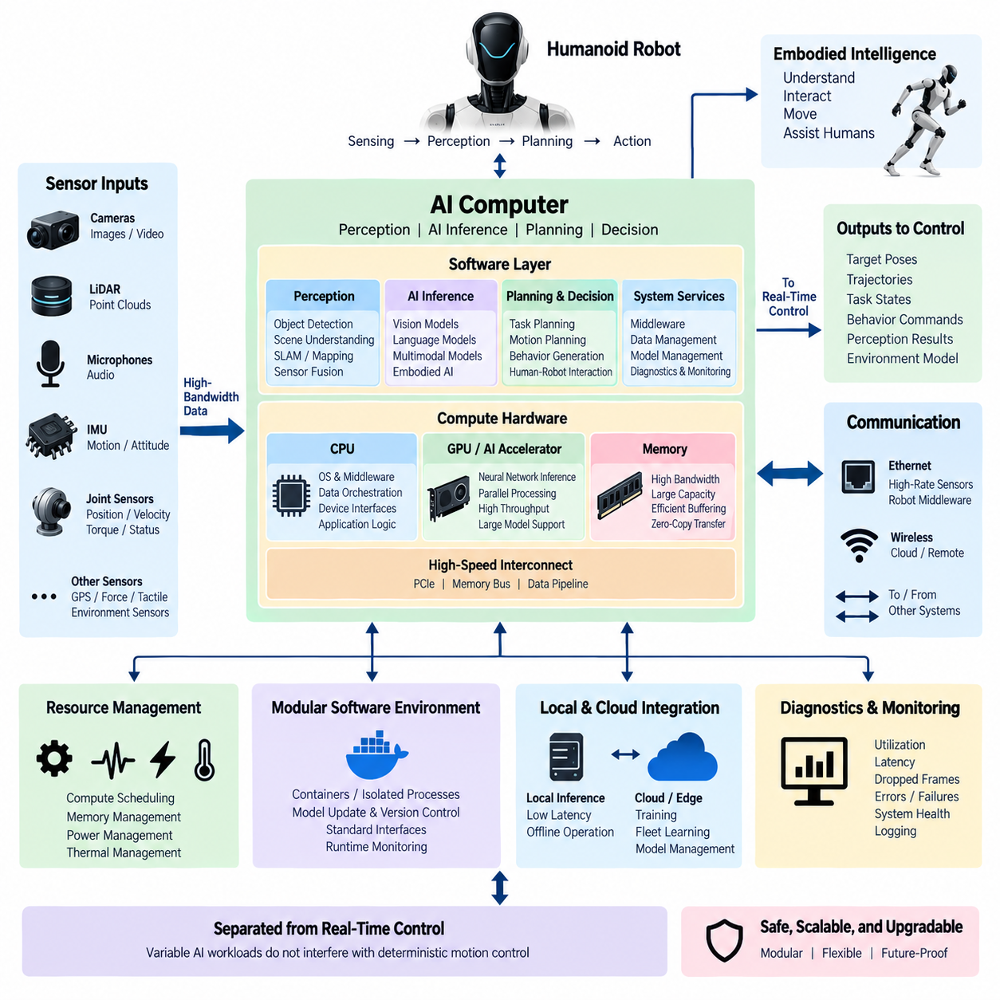
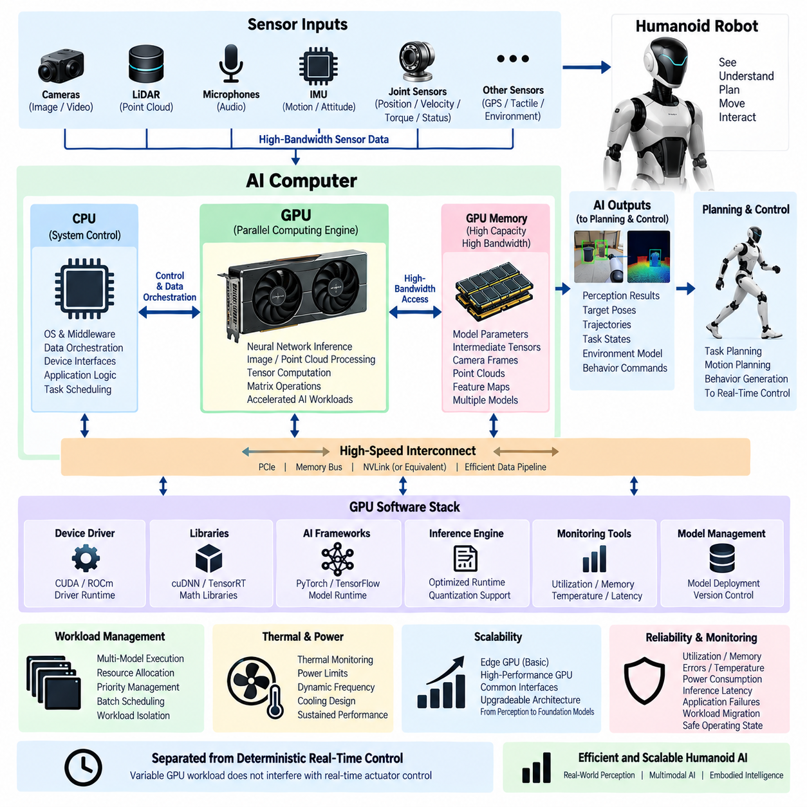
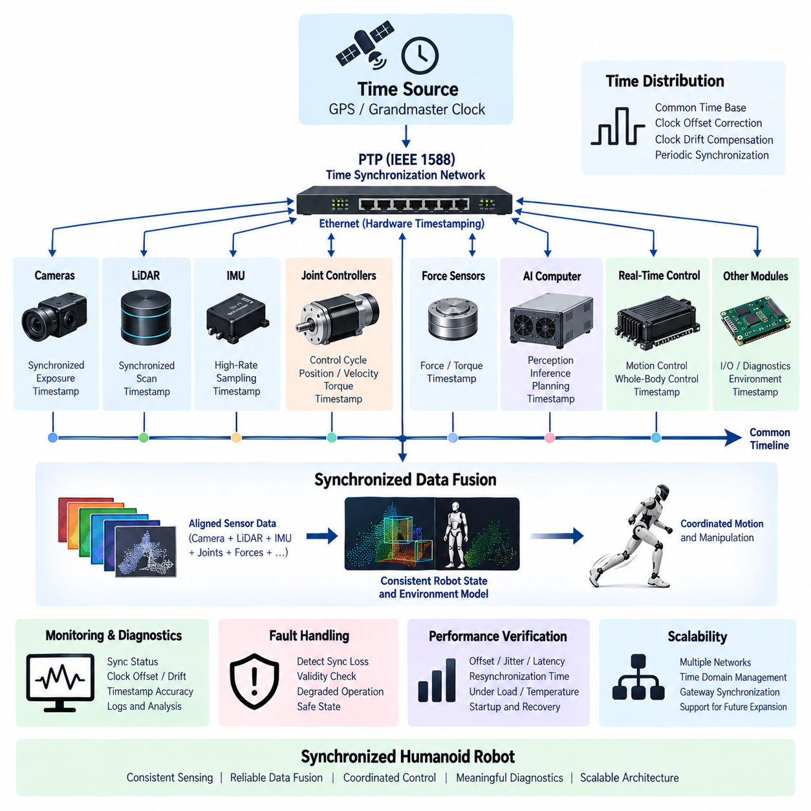
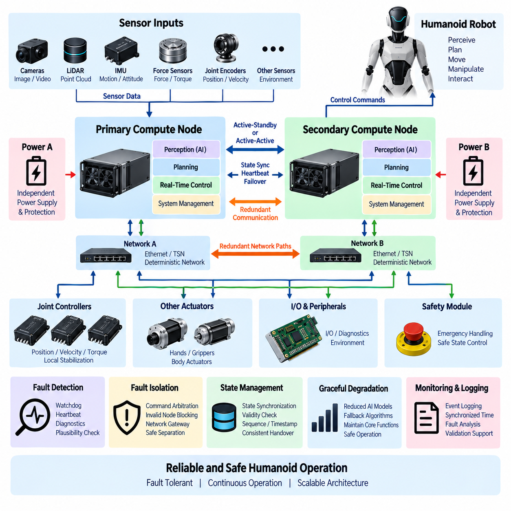
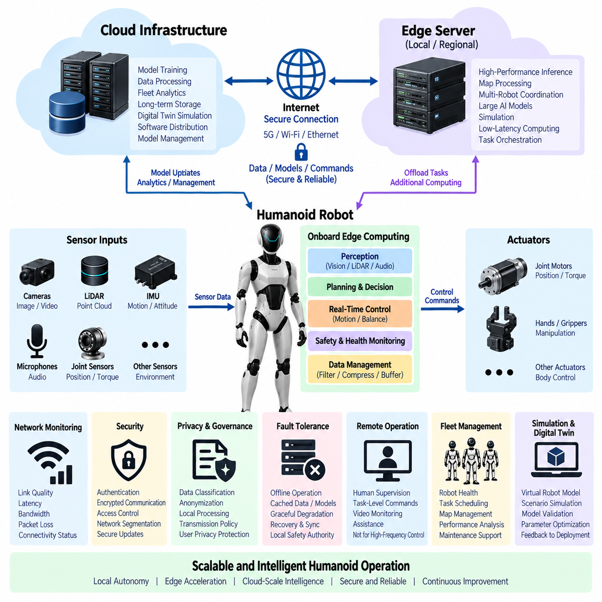

**Volume 21. Humanoid Electrical Architecture**


# Chapter 10. Computing Architecture

##  

## 10.01. Real Time Control

{width="7.268055555555556in" height="7.268055555555556in"}

Real-time control is the computational foundation that converts a humanoid robot's high-level motion objectives into deterministic actuator behavior. Unlike AI workloads, which can often tolerate variable execution time, real-time control must repeatedly execute within defined timing constraints. Joint position, velocity, torque, encoder, current, and safety information therefore need to be processed with predictable latency. The control architecture should separate deterministic control functions from computationally intensive perception and AI workloads so that temporary AI delays cannot directly disturb basic motion stability.

A typical humanoid real-time control loop operates through a hierarchy of control rates. High-rate inner loops manage motor current, torque, and actuator dynamics, while intermediate loops coordinate joint position, velocity, impedance, and whole-body motion. Lower-rate supervisory loops handle gait generation, posture commands, task states, and system coordination. The exact frequencies depend on actuator dynamics and hardware capability, but the architecture should preserve clear timing boundaries between these layers. This separation allows each controller to meet its own latency and jitter requirements.

The real-time controller receives feedback from distributed joint modules through deterministic communication paths. Encoder measurements provide joint position and velocity information, torque sensors provide mechanical interaction feedback, and motor-driver status supplies current, temperature, voltage, and fault information. These signals are sampled, validated, timestamped, and incorporated into the control cycle. Commands generated by the controller are then transmitted to the appropriate motor drivers. Consistent communication timing is important because simultaneous or coordinated motion of multiple joints depends on temporally coherent feedback.

A real-time operating environment or real-time capable execution framework should provide bounded scheduling latency, controlled interrupt behavior, deterministic task priorities, and predictable memory access. Control tasks should generally use fixed execution patterns and avoid operations that can introduce uncontrolled delays, such as unexpected dynamic memory allocation or blocking communication. High-priority safety and stabilization functions should preempt lower-priority supervisory activities when necessary. The objective is not simply high computational speed, but repeatable execution with bounded latency and jitter.

Humanoid motion requires coordination across many joints, so synchronization between control tasks is essential. A controller may calculate commands for the legs, arms, torso, and head within a common control cycle, while actuator-level loops operate at higher rates locally. Time synchronization mechanisms allow measurements from different modules to be interpreted consistently. The real-time architecture should therefore establish clear cycle boundaries, timestamp conventions, command validity windows, and handling rules for delayed or missing data. These mechanisms reduce instability caused by inconsistent feedback timing.

The control computer should also isolate real-time functions from AI and perception workloads. Camera processing, LiDAR processing, speech recognition, vision-language models, and other AI functions can produce highly variable computational loads. They should communicate with the real-time domain through defined interfaces rather than directly controlling actuator timing. A high-level planner may request a walking trajectory or manipulation task, while the real-time controller remains responsible for continuously enforcing joint limits, dynamic constraints, balance requirements, and actuator commands.

Real-time control must include robust fault handling because humanoid robots operate in dynamically unstable conditions. Communication loss, encoder disagreement, excessive torque, motor-driver faults, thermal overload, abnormal voltage, or invalid commands should be detected within appropriate timing limits. The controller should transition to predefined safe states rather than continuing with stale or uncertain commands. Depending on the system design, this may include torque reduction, controlled stopping, posture stabilization, joint isolation, or activation of redundant control paths.

The architecture should distinguish between hard real-time, firm real-time, and non-real-time activities. Hard real-time functions require completion within strict deadlines because missing a deadline may directly compromise stability or safety. Firm real-time functions may tolerate occasional missed cycles but lose value when the deadline is exceeded. Non-real-time functions such as logging, visualization, configuration management, and cloud communication can operate asynchronously. This classification helps allocate processor resources and prevents noncritical workloads from consuming resources required by motion control.

Control-loop performance should be evaluated using measurable timing characteristics rather than processor utilization alone. Important parameters include cycle time, execution-time variation, scheduling latency, communication latency, sensor-to-actuator delay, jitter, deadline misses, and recovery behavior after transient overload. Monitoring these values during development and validation provides evidence that the controller remains deterministic under realistic combinations of locomotion, manipulation, perception, and communication workloads. Timing budgets should be defined at system level and allocated across sensing, computation, networking, and actuation.

A scalable humanoid architecture can therefore use distributed real-time control nodes for individual joints or body regions while maintaining centralized coordination at the whole-body level. Local controllers handle fast actuator dynamics and protection functions, while a higher-level real-time controller coordinates posture, balance, locomotion, and manipulation. Above this layer, AI computers provide perception, planning, reasoning, and embodied intelligence. This layered structure keeps safety-critical motion control deterministic while allowing increasingly capable AI systems to evolve without redesigning the fundamental actuator control path.

실시간 제어(Real-time control)는 휴머노이드 로봇의 상위 수준 동작 목표를 결정론적인 액추에이터 동작으로 변환하는 계산 기반이다. AI 워크로드(AI workload)는 실행 시간이 다소 변동하더라도 동작할 수 있는 경우가 많지만, 실시간 제어는 정의된 시간 제약 안에서 결정론적으로 반복 실행되어야 한다. 따라서 관절 위치, 속도, 토크, 엔코더, 전류 및 안전 관련 정보는 예측 가능한 지연시간으로 처리되어야 한다. 제어 아키텍처(Control architecture)는 결정론적인 제어 기능과 계산량이 높은 인공지능(AI) 워크로드를 분리하여, 일시적인 AI 처리 지연이 기본적인 동작 안정성에 직접적인 영향을 주지 않도록 구성해야 한다.

일반적인 휴머노이드 실시간 제어 루프(Real-time control loop)는 여러 제어 주파수의 계층 구조로 동작한다. 고속 내부 루프(Inner loop)는 모터 전류, 토크 및 액추에이터 동특성을 관리하고, 중간 속도의 루프는 관절 위치, 속도, 임피던스 및 전신 동작을 조정한다. 더 낮은 주파수의 감독 루프(Supervisory loop)는 보행 생성, 자세 명령, 작업 상태 및 시스템 조정을 담당한다. 정확한 주파수는 액추에이터 동특성과 하드웨어 성능에 따라 달라지지만, 아키텍처는 이러한 계층 사이에 명확한 시간 경계를 유지해야 한다. 이러한 분리는 각 제어기가 자체적인 지연시간 및 지터 요구사항을 충족할 수 있도록 한다.

실시간 제어기는 결정론적인 통신 경로를 통해 분산된 관절 모듈(Distributed joint module)로부터 피드백을 수신한다. 엔코더 측정값은 관절 위치와 속도 정보를 제공하고, 토크 센서는 기계적 상호작용에 대한 피드백을 제공하며, 모터 드라이버 상태는 전류, 온도, 전압 및 고장 정보를 제공한다. 이러한 신호는 샘플링되고, 검증되며, 타임스탬프가 부여된 후 제어 주기에 반영된다. 이후 제어기에서 생성된 명령은 해당 모터 드라이버로 전달된다. 여러 관절의 동시 또는 협조 동작은 시간적으로 일관된 피드백에 의존하기 때문에, 통신 타이밍의 일관성은 매우 중요하다.

실시간 운영 환경(Real-time operating environment) 또는 실시간 실행 프레임워크(Real-time execution framework)는 제한된 스케줄링 지연시간, 제어된 인터럽트 동작, 결정론적인 태스크 우선순위 및 예측 가능한 메모리 접근을 제공해야 한다. 제어 태스크(Control task)는 일반적으로 고정된 실행 패턴을 사용해야 하며, 예측할 수 없는 동적 메모리 할당이나 블로킹 통신과 같이 제어되지 않은 지연을 발생시킬 수 있는 동작은 피해야 한다. 높은 우선순위를 갖는 안전 및 자세 안정화 기능은 필요할 경우 낮은 우선순위의 감독 기능을 선점할 수 있어야 한다. 목표는 단순히 높은 계산 속도를 얻는 것이 아니라, 제한된 지연시간과 지터 범위 안에서 반복 가능한 실행을 보장하는 것이다.

휴머노이드 동작은 많은 관절의 협조를 필요로 하므로 제어 태스크 간의 동기화가 중요하다. 제어기는 하나의 공통 제어 주기 안에서 다리, 팔, 몸통 및 머리에 대한 명령을 계산할 수 있으며, 액추에이터 수준의 루프는 더 높은 주파수로 로컬에서 동작할 수 있다. 시간 동기화(Time synchronization) 메커니즘은 서로 다른 모듈에서 측정된 데이터를 일관된 시간 기준으로 해석할 수 있도록 한다. 따라서 실시간 아키텍처는 명확한 주기 경계, 타임스탬프 규칙, 명령 유효 시간 범위 및 지연되거나 누락된 데이터에 대한 처리 규칙을 정의해야 한다. 이러한 메커니즘은 피드백 타이밍의 불일치로 인해 발생할 수 있는 불안정성을 감소시킨다.

제어 컴퓨터(Control computer)는 실시간 기능을 AI 및 인지 워크로드와 분리해야 한다. 카메라 처리, LiDAR 처리, 음성 인식, 비전-언어 모델(Vision-Language Model) 및 기타 AI 기능은 매우 가변적인 계산 부하를 발생시킬 수 있다. 이러한 기능은 액추에이터 타이밍에 직접 영향을 주지 않고 정의된 인터페이스를 통해 실시간 영역과 통신해야 한다. 상위 수준의 플래너(Planner)는 보행 궤적이나 조작 작업을 요청할 수 있지만, 실시간 제어기는 관절 제한, 동역학적 제약, 균형 요구사항 및 액추에이터 명령을 지속적으로 관리해야 한다.

실시간 제어에는 휴머노이드 로봇이 동적으로 불안정한 환경에서 동작한다는 점을 고려한 견고한 고장 처리(Fault handling) 기능이 포함되어야 한다. 통신 손실, 엔코더 불일치, 과도한 토크, 모터 드라이버 고장, 열 과부하, 비정상 전압 또는 잘못된 명령은 적절한 시간 제한 안에서 감지되어야 한다. 제어기는 오래된 데이터나 불확실한 명령을 계속 사용하지 않고 미리 정의된 안전 상태(Safe state)로 전환해야 한다. 시스템 설계에 따라 토크 감소, 제어된 정지, 특정 관절의 격리 또는 이중화된 제어 경로의 활성화 등이 이러한 동작에 포함될 수 있다.

아키텍처는 하드 실시간(Hard real-time), 펌 리얼타임(Firm real-time) 및 비실시간(Non-real-time) 기능을 구분해야 한다. 하드 실시간 기능은 엄격한 데드라인 안에 반드시 완료되어야 하며, 데드라인을 놓치는 경우 로봇의 안정성이나 안전성이 직접적으로 저하될 수 있다. 펌 리얼타임 기능은 일부 주기를 놓치는 것을 허용할 수 있지만, 데드라인을 초과하면 해당 결과의 가치가 감소한다. 로깅(Logging), 시각화(Visualization), 설정 관리(Configuration management) 및 클라우드 통신(Cloud communication)과 같은 비실시간 기능은 비동기적으로 실행할 수 있다. 이러한 분류는 프로세서 자원을 적절히 배분하고 비핵심 워크로드가 동작 제어에 필요한 자원을 점유하지 않도록 하는 데 도움이 된다.

제어 루프 성능(Control-loop performance)은 프로세서 사용률만으로 평가해서는 안 되며, 측정 가능한 시간 특성을 기준으로 평가해야 한다. 중요한 파라미터에는 주기 시간(Cycle time), 실행 시간 변동, 스케줄링 지연시간, 통신 지연시간, 센서-액추에이터 지연시간, 지터(Jitter), 데드라인 미충족(Deadline miss) 및 과도한 부하 이후의 복구 동작이 포함된다. 개발 및 검증 과정에서 이러한 값을 모니터링하면 보행, 조작, 인지 및 통신 워크로드가 동시에 발생하는 실제 조건에서도 제어기가 결정론적으로 동작하는지 확인할 수 있다. 시간 예산(Timing budget)은 시스템 수준에서 정의하고 센싱, 계산, 네트워크 및 액추에이션 영역에 배분해야 한다.

확장 가능한 휴머노이드 아키텍처는 개별 관절 또는 신체 영역에 분산된 실시간 제어 노드를 사용하면서 전신 수준에서는 중앙 집중식 조정을 수행할 수 있다. 로컬 제어기(Local controller)는 고속 액추에이터 동특성과 보호 기능을 처리하고, 상위 수준의 실시간 제어기는 자세, 균형, 보행 및 조작을 조정한다. 이보다 상위 계층에서는 AI 컴퓨터가 인지(Perception), 계획(Planning), 추론(Reasoning) 및 체화 지능(Embodied intelligence)을 제공한다. 이러한 계층 구조는 안전에 중요한 동작 제어를 결정론적으로 유지하면서도, 점점 더 고도화되는 AI 시스템을 기본 액추에이터 제어 경로를 재설계하지 않고 발전시킬 수 있도록 한다.

##  

## 10.02. AI Computer

{width="7.268055555555556in" height="7.268055555555556in"}

The AI computer serves as the primary computational platform for perception, artificial intelligence inference, high-level planning, and embodied intelligence in a humanoid robot. It is intentionally separated from the deterministic real-time control domain so that variable AI workloads do not interfere with actuator timing. The AI computer receives data from cameras, LiDAR, microphones, joint states, and other sensors, processes these inputs through software pipelines and AI models, and provides perception results, predictions, task decisions, and motion objectives to the appropriate control layers.

A humanoid AI computer must process multiple sensor streams with substantially different data rates and computational characteristics. Camera images may require high-bandwidth processing, LiDAR produces spatial point data, microphones generate continuous audio streams, and joint sensors provide structured state information. The compute architecture therefore requires high memory bandwidth, efficient data movement, parallel processing capability, and suitable interfaces for heterogeneous sensors. Input processing should also preserve timestamps and sensor relationships so that perception results remain consistent with the robot\'s physical state.

The AI computer typically contains a general-purpose CPU together with one or more accelerators such as GPUs or dedicated AI engines. The CPU manages operating-system services, middleware, data orchestration, device interfaces, and application logic, while accelerators execute computationally intensive neural-network operations. This heterogeneous architecture allows perception, object detection, segmentation, pose estimation, speech processing, and other AI workloads to execute efficiently. The allocation of workloads should consider latency, memory consumption, thermal limits, power consumption, and the required computational throughput.

Perception processing forms one of the major workloads of the AI computer. Visual data can be processed for object detection, semantic understanding, human pose estimation, depth estimation, and scene interpretation, while LiDAR data can support spatial mapping and geometric perception. Audio processing can provide speech recognition, sound localization, and interaction cues. These individual pipelines may operate independently but should ultimately produce a coherent representation of the robot\'s environment. Sensor fusion can combine complementary information to improve robustness when an individual sensor is degraded or temporarily unavailable.

The AI computer also supports higher-level planning and decision functions that transform perception results into actionable objectives. A planner may determine where the robot should move, which object should be manipulated, or how a task should be decomposed into sequential actions. These functions operate at a lower rate than actuator control and can tolerate greater computational variability. Their outputs should therefore be expressed through well-defined interfaces such as target poses, trajectories, task states, or behavioral commands rather than direct uncontrolled actuator signals.

AI model execution requires careful management of computational resources because humanoid robots may run several models concurrently. A perception model, language model, pose estimator, object tracker, and motion-planning component may compete for GPU memory and processing capacity. The AI computer should establish resource priorities and execution policies so that critical perception and planning functions maintain acceptable latency. Model selection should consider not only accuracy but also inference time, memory footprint, batch behavior, power consumption, and the available accelerator architecture.

The AI computer should maintain a clear boundary between AI inference and real-time control. AI outputs may be delayed, temporarily unavailable, or affected by uncertain perception. The real-time controller must therefore remain capable of maintaining safe and stable operation when an AI result is missing or invalid. Interfaces should define data validity, confidence, timestamps, timeout behavior, and fallback actions. This separation allows advanced AI functions to evolve independently while preserving predictable operation of the underlying motion-control system.

Communication between the AI computer and the rest of the humanoid system should support high-bandwidth sensor data as well as lower-bandwidth control information. Ethernet-based communication may be used for cameras, LiDAR, and other high-data-rate devices, while robotics middleware can provide structured communication between perception, planning, and control software. Joint states and actuator information may originate from deterministic control networks and be exposed to the AI domain through controlled interfaces. The architecture should avoid unnecessary data copying because sensor bandwidth and memory traffic can become major performance limitations.

Memory architecture is particularly important because modern AI workloads frequently require large model parameters, intermediate tensors, image buffers, point-cloud data, and historical sensor information. High-speed system memory and accelerator memory should be sized according to the expected workload rather than only the nominal AI model size. Efficient buffer management, memory reuse, zero-copy transfers where appropriate, and controlled data retention can reduce latency and improve system stability. The design should also reserve sufficient memory for operating-system services and safety-related supervisory functions.

Thermal and power management are fundamental constraints for a humanoid AI computer because the compute platform operates inside a mobile body with limited energy and cooling capacity. High-performance GPUs and accelerators can generate substantial heat during sustained inference. The compute architecture should therefore balance peak performance with continuous operating capability. Thermal monitoring, power-state management, workload scheduling, and controlled performance scaling can prevent thermal throttling from causing unpredictable degradation during prolonged walking, manipulation, or perception tasks.

The software environment should support modular deployment of perception and AI applications. Containers, isolated processes, or equivalent software boundaries can separate individual workloads and simplify model updates. AI models should have clearly defined input and output interfaces so that one perception model can be replaced without redesigning the complete system. Version management, configuration control, model validation, and runtime monitoring are also important because changes to AI software can influence robot behavior even when the underlying electrical and real-time control architecture remains unchanged.

The AI computer should support local inference because many humanoid functions require low latency and continuous operation without dependence on an external network. At the same time, cloud or edge resources can provide additional computational capacity for model training, large-scale analysis, model management, simulation, and fleet-level learning. The local system should therefore operate as an autonomous edge AI platform while maintaining controlled interfaces to external compute resources. This approach allows the robot to remain operational when connectivity is unavailable while still benefiting from larger computing infrastructure.

AI computer architecture should also support diagnostics and performance monitoring. Important measurements include CPU and accelerator utilization, memory consumption, inference latency, sensor-processing latency, thermal state, power consumption, dropped frames, communication errors, and model execution failures. These measurements provide information for identifying performance bottlenecks and abnormal behavior. Logging should preserve sufficient context to correlate AI events with robot states, sensor inputs, and control responses without allowing diagnostic activities to interfere with critical computation.

For humanoid robots, the AI computer becomes an important bridge between physical sensing and embodied intelligence. It converts raw sensor information into representations that higher-level software can use for perception, reasoning, planning, and interaction. As AI capabilities evolve toward vision-language models, vision-language-action models, agents, and foundation-model-based robotics, the computing platform must remain sufficiently modular to accommodate increasingly complex workloads. The architecture should therefore emphasize scalable accelerator support, flexible memory resources, standardized interfaces, deterministic separation from motion control, and controlled integration with the broader humanoid computing hierarchy.

AI 컴퓨터(AI computer)는 휴머노이드 로봇에서 인지(Perception), 인공지능 추론(AI inference), 상위 수준 계획(High-level planning) 및 체화 지능(Embodied intelligence)을 위한 핵심 계산 플랫폼으로 사용된다. AI 컴퓨터는 가변적인 AI 워크로드(AI workload)가 액추에이터 타이밍(Actuator timing)에 영향을 주지 않도록 결정론적인 실시간 제어 영역(Deterministic real-time control domain)과 의도적으로 분리된다. AI 컴퓨터는 카메라, LiDAR, 마이크, 관절 상태 및 기타 센서로부터 데이터를 수신하고, 소프트웨어 파이프라인과 AI 모델을 통해 이러한 입력을 처리하며, 적절한 제어 계층에 인지 결과, 예측, 작업 결정 및 동작 목표를 제공한다.

휴머노이드 AI 컴퓨터는 데이터 속도와 계산 특성이 상당히 다른 여러 센서 스트림(Sensor stream)을 처리해야 한다. 카메라 영상은 높은 대역폭의 처리가 필요할 수 있으며, LiDAR는 공간 포인트 데이터를 생성하고, 마이크는 연속적인 오디오 스트림을 생성하며, 관절 센서는 구조화된 상태 정보를 제공한다. 따라서 컴퓨팅 아키텍처(Compute architecture)는 높은 메모리 대역폭, 효율적인 데이터 이동, 병렬 처리 능력 및 이기종 센서에 적합한 인터페이스를 필요로 한다. 입력 처리 과정에서는 타임스탬프(Timestamp)와 센서 간 관계를 유지하여 인지 결과가 로봇의 물리적 상태와 일관성을 유지하도록 해야 한다.

AI 컴퓨터는 일반적으로 하나의 범용 CPU(General-purpose CPU)와 하나 이상의 GPU 또는 전용 AI 엔진(AI engine)과 같은 가속기(Accelerator)를 포함한다. CPU는 운영체제 서비스, 미들웨어(Middleware), 데이터 오케스트레이션(Data orchestration), 디바이스 인터페이스 및 애플리케이션 로직을 관리하고, 가속기는 계산량이 높은 신경망 연산(Neural-network operation)을 실행한다. 이러한 이기종 아키텍처(Heterogeneous architecture)를 통해 인지, 객체 감지(Object detection), 세그멘테이션(Segmentation), 자세 추정(Pose estimation), 음성 처리 및 기타 AI 워크로드를 효율적으로 실행할 수 있다. 워크로드 할당은 지연시간(Latency), 메모리 사용량, 열 제한, 전력 소비 및 요구되는 계산 처리량(Computational throughput)을 함께 고려해야 한다.

인지 처리는 AI 컴퓨터의 주요 워크로드 중 하나를 구성한다. 시각 데이터는 객체 감지, 의미론적 이해(Semantic understanding), 인간 자세 추정(Human pose estimation), 깊이 추정(Depth estimation) 및 장면 해석(Scene interpretation)을 위해 처리될 수 있으며, LiDAR 데이터는 공간 매핑(Spatial mapping)과 기하학적 인지(Geometric perception)를 지원할 수 있다. 오디오 처리는 음성 인식(Speech recognition), 음원 위치 추정(Sound localization) 및 상호작용 단서를 제공할 수 있다. 이러한 개별 파이프라인은 독립적으로 동작할 수 있지만, 최종적으로는 로봇 주변 환경에 대한 일관된 표현을 생성해야 한다. 센서 융합(Sensor fusion)은 상호 보완적인 정보를 결합하여 특정 센서가 저하되거나 일시적으로 사용할 수 없는 경우에도 강건성을 향상시킬 수 있다.

AI 컴퓨터는 또한 인지 결과를 실행 가능한 목표로 변환하는 상위 수준의 계획(High-level planning) 및 의사결정(Decision) 기능을 지원한다. 플래너(Planner)는 로봇이 어디로 이동해야 하는지, 어떤 물체를 조작해야 하는지 또는 작업을 어떤 순서의 행동으로 분해해야 하는지를 결정할 수 있다. 이러한 기능은 액추에이터 제어보다 낮은 주파수에서 동작하며 더 큰 계산 변동성을 허용할 수 있다. 따라서 그 출력은 직접적이고 제어되지 않은 액추에이터 신호가 아니라 목표 자세(Target pose), 궤적(Trajectory), 작업 상태(Task state) 또는 행동 명령(Behavior command)과 같은 명확하게 정의된 인터페이스를 통해 전달되어야 한다.

AI 모델 실행(Model execution)은 휴머노이드 로봇이 여러 모델을 동시에 실행할 수 있기 때문에 계산 자원의 세심한 관리가 필요하다. 인지 모델(Perception model), 언어 모델(Language model), 자세 추정기(Pose estimator), 객체 추적기(Object tracker) 및 동작 계획(Motion planning) 구성요소가 GPU 메모리와 처리 능력을 동시에 사용할 수 있다. AI 컴퓨터는 중요한 인지 및 계획 기능이 허용 가능한 지연시간을 유지할 수 있도록 자원 우선순위(Resource priority)와 실행 정책(Execution policy)을 설정해야 한다. 모델 선택에서는 정확도뿐만 아니라 추론 시간(Inference time), 메모리 사용량(Memory footprint), 배치 동작(Batch behavior), 전력 소비 및 사용 가능한 가속기 아키텍처를 함께 고려해야 한다.

AI 컴퓨터는 AI 추론(AI inference)과 실시간 제어(Real-time control) 사이에 명확한 경계를 유지해야 한다. AI 출력은 지연되거나 일시적으로 사용할 수 없을 수 있으며, 불확실한 인지 결과의 영향을 받을 수도 있다. 따라서 실시간 제어기는 AI 결과가 누락되거나 유효하지 않은 경우에도 안전하고 안정적인 동작을 유지할 수 있어야 한다. 인터페이스는 데이터 유효성(Data validity), 신뢰도(Confidence), 타임스탬프, 타임아웃 동작(Timeout behavior) 및 대체 동작(Fallback action)을 정의해야 한다. 이러한 분리를 통해 고도화된 AI 기능은 독립적으로 발전하면서도 기본 동작 제어 시스템은 예측 가능한 방식으로 동작할 수 있다.

AI 컴퓨터와 휴머노이드 시스템의 다른 부분 사이의 통신은 높은 대역폭의 센서 데이터와 낮은 대역폭의 제어 정보를 모두 지원해야 한다. 카메라, LiDAR 및 기타 고데이터율 장치에는 이더넷 기반 통신(Ethernet-based communication)을 사용할 수 있으며, 로보틱스 미들웨어(Robotics middleware)는 인지, 계획 및 제어 소프트웨어 사이의 구조화된 통신을 제공할 수 있다. 관절 상태와 액추에이터 정보는 결정론적인 제어 네트워크(Deterministic control network)에서 생성되고, 제어된 인터페이스를 통해 AI 영역에 제공될 수 있다. 불필요한 데이터 복사는 피해야 하는데, 센서 대역폭과 메모리 트래픽이 주요 성능 제한 요소가 될 수 있기 때문이다.

메모리 아키텍처(Memory architecture)는 최신 AI 워크로드가 대규모 모델 파라미터(Model parameter), 중간 텐서(Intermediate tensor), 영상 버퍼(Image buffer), 포인트 클라우드 데이터(Point-cloud data) 및 과거 센서 정보를 자주 필요로 하기 때문에 특히 중요하다. 고속 시스템 메모리와 가속기 메모리는 단순히 AI 모델의 명목상 크기만을 기준으로 하지 않고 예상되는 워크로드에 따라 용량을 결정해야 한다. 효율적인 버퍼 관리(Buffer management), 메모리 재사용(Memory reuse), 적절한 경우의 제로 카피 전송(Zero-copy transfer) 및 제어된 데이터 보존(Data retention)은 지연시간을 줄이고 시스템 안정성을 향상시킬 수 있다. 또한 운영체제 서비스와 안전 관련 감독 기능을 위한 충분한 메모리를 별도로 확보해야 한다.

열 및 전력 관리(Thermal and power management)는 AI 컴퓨터가 제한된 에너지와 냉각 능력을 가진 이동형 로봇의 몸체 내부에서 동작하기 때문에 핵심적인 제약사항이다. 고성능 GPU와 가속기는 지속적인 추론 과정에서 상당한 열을 발생시킬 수 있다. 따라서 컴퓨팅 아키텍처는 최대 성능과 지속적인 동작 능력 사이에서 균형을 유지해야 한다. 열 모니터링(Thermal monitoring), 전력 상태 관리(Power-state management), 워크로드 스케줄링(Workload scheduling) 및 제어된 성능 조절(Controlled performance scaling)을 통해 열 스로틀링(Thermal throttling)이 장시간 보행, 조작 또는 인지 작업 중 예측할 수 없는 성능 저하를 일으키는 것을 방지할 수 있다.

소프트웨어 환경은 인지 및 AI 애플리케이션의 모듈식 배포(Modular deployment)를 지원해야 한다. 컨테이너(Container), 격리된 프로세스(Isolated process) 또는 이와 동등한 소프트웨어 경계를 사용하면 개별 워크로드를 분리하고 모델 업데이트를 단순화할 수 있다. AI 모델은 입력 및 출력 인터페이스를 명확하게 정의하여 하나의 인지 모델을 전체 시스템을 재설계하지 않고도 교체할 수 있어야 한다. 버전 관리(Version management), 설정 제어(Configuration control), 모델 검증(Model validation) 및 런타임 모니터링(Runtime monitoring) 역시 중요하다. AI 소프트웨어의 변경은 기본적인 전기 및 실시간 제어 아키텍처가 그대로 유지되더라도 로봇의 동작에 영향을 줄 수 있기 때문이다.

AI 컴퓨터는 외부 네트워크에 의존하지 않고도 낮은 지연시간과 연속적인 동작이 필요한 많은 휴머노이드 기능을 수행할 수 있도록 로컬 추론(Local inference)을 지원해야 한다. 동시에 클라우드 또는 엣지 자원(Edge resource)은 모델 학습, 대규모 분석, 모델 관리, 시뮬레이션 및 플릿 수준 학습(Fleet-level learning)을 위한 추가 계산 능력을 제공할 수 있다. 따라서 로컬 시스템은 자율적인 엣지 AI 플랫폼(Edge AI platform)으로 동작하면서 외부 컴퓨팅 자원과 제어된 인터페이스를 유지해야 한다. 이러한 접근 방식은 네트워크 연결이 불가능한 상황에서도 로봇이 동작할 수 있도록 하면서 더 큰 컴퓨팅 인프라의 이점을 활용할 수 있게 한다.

AI 컴퓨터 아키텍처는 진단(Diagnostics)과 성능 모니터링(Performance monitoring)도 지원해야 한다. 중요한 측정 항목에는 CPU 및 가속기 사용률, 메모리 사용량, 추론 지연시간, 센서 처리 지연시간, 열 상태, 전력 소비, 프레임 손실(Dropped frame), 통신 오류 및 모델 실행 실패가 포함된다. 이러한 측정값은 성능 병목(Performance bottleneck)과 비정상적인 동작을 식별하기 위한 정보를 제공한다. 로깅(Logging)은 AI 이벤트를 로봇 상태, 센서 입력 및 제어 응답과 연관시킬 수 있도록 충분한 정보를 보존해야 하며, 동시에 진단 작업이 핵심 계산에 영향을 주지 않도록 해야 한다.

휴머노이드 로봇에서 AI 컴퓨터는 물리적 센싱(Physical sensing)과 체화 지능(Embodied intelligence)을 연결하는 중요한 가교 역할을 한다. AI 컴퓨터는 원시 센서 정보를 상위 수준의 소프트웨어가 인지, 추론, 계획 및 상호작용에 사용할 수 있는 표현으로 변환한다. AI 기능이 비전-언어 모델(Vision-Language Model), 비전-언어-행동 모델(Vision-Language-Action Model), 에이전트(Agent) 및 파운데이션 모델 기반 로보틱스(Foundation-model-based robotics)로 발전함에 따라 컴퓨팅 플랫폼은 점점 더 복잡한 워크로드를 수용할 수 있도록 충분히 모듈화되어야 한다. 따라서 아키텍처는 확장 가능한 가속기 지원(Scalable accelerator support), 유연한 메모리 자원(Flexible memory resources), 표준화된 인터페이스(Standardized interfaces), 동작 제어와의 결정론적 분리(Deterministic separation) 및 전체 휴머노이드 컴퓨팅 계층과의 제어된 통합(Controlled integration)을 중심으로 설계되어야 한다.

##  

## 10.03. GPU Architecture

{width="7.268055555555556in" height="7.268055555555556in"}

A GPU architecture provides the parallel computing foundation for demanding AI workloads in a humanoid robot. Within the computing architecture, the GPU is primarily responsible for highly parallel operations such as neural-network inference, image processing, point-cloud processing, tensor computation, and large-scale matrix operations. It operates alongside the CPU rather than replacing it, allowing the CPU to manage system control, middleware, data orchestration, and application logic while the GPU executes computationally intensive workloads. This division enables the humanoid system to process complex perception and AI models within practical latency and power constraints.

The GPU receives data from the AI computer through high-speed memory and interconnect paths. Camera images, LiDAR point clouds, depth information, and other sensor representations can be transferred into GPU-accessible memory for parallel processing. Efficient data movement is essential because the performance of an AI system is determined not only by raw GPU compute capability but also by memory bandwidth, transfer latency, and synchronization overhead. The architecture should therefore minimize unnecessary copies between CPU memory and GPU memory and use efficient buffer management to maintain a continuous data pipeline.

Modern GPUs contain many parallel processing resources that execute large numbers of similar operations simultaneously. This characteristic is particularly suitable for deep-learning workloads because convolution, matrix multiplication, attention mechanisms, tensor operations, and other neural-network calculations can be divided into many parallel tasks. Specialized AI acceleration hardware can further improve inference performance by executing reduced-precision operations efficiently. The GPU architecture should therefore be selected according to the expected AI workload, including model size, numerical precision, inference frequency, concurrent models, and required throughput.

GPU memory capacity is an important architectural parameter for humanoid AI systems. Perception and embodied-AI applications may require memory for neural-network parameters, intermediate tensors, camera frames, LiDAR data, point clouds, feature maps, and multiple simultaneously executing models. Insufficient memory can prevent larger models from running even when the GPU has sufficient computational performance. The architecture should therefore consider both compute capability and memory capacity. Memory allocation should also reserve sufficient resources for concurrent perception, planning, and AI functions rather than optimizing only for a single benchmark workload.

Memory bandwidth directly affects the ability of the GPU to keep its processing resources supplied with data. Large perception models and multimodal AI systems can repeatedly move substantial quantities of tensors between computational units and memory. If data cannot be delivered fast enough, the GPU may remain underutilized despite having high theoretical compute performance. High-bandwidth memory systems, efficient caching, memory reuse, and optimized tensor layouts can reduce this limitation. GPU selection should therefore evaluate sustained application performance rather than relying only on peak arithmetic throughput.

The GPU software stack is another major component of the architecture. Device drivers, GPU runtime libraries, numerical libraries, AI frameworks, inference engines, and optimized model runtimes provide the software path between robotic applications and GPU hardware. The software environment should support efficient execution of the required AI models and provide mechanisms for monitoring memory use, utilization, temperature, and execution latency. Compatibility between the GPU architecture, operating system, AI framework, model format, and inference runtime is essential because a theoretically capable GPU may provide poor practical performance if the software stack is not properly optimized.

Multiple AI workloads may need to share the same GPU in a humanoid robot. Camera perception, object detection, segmentation, human pose estimation, LiDAR processing, speech processing, language models, and motion-related planning may execute concurrently. The architecture should therefore define resource allocation and scheduling policies that prevent one large workload from consuming all available GPU resources. Priority management, controlled batch sizes, model partitioning, asynchronous execution, and appropriate workload isolation can help maintain predictable response times while maximizing overall accelerator utilization.

The GPU should remain logically separated from deterministic real-time control even when it contributes information used by the motion-control system. AI inference may have variable execution time because of model complexity, memory contention, thermal conditions, or concurrent workloads. A real-time controller should therefore not depend directly on the completion of an individual GPU inference cycle for basic actuator stability. Instead, the GPU should provide validated perception results, target poses, trajectories, environment representations, or planning information through defined interfaces. This separation allows AI performance to evolve without compromising deterministic control behavior.

Thermal and power characteristics become especially important when a high-performance GPU is installed inside a mobile humanoid platform. Sustained AI inference can generate significant heat and electrical power demand, while the robot has limited battery capacity and constrained cooling volume. GPU architecture must therefore consider sustained performance rather than short-duration peak performance. Thermal monitoring, power limits, dynamic frequency management, workload scheduling, and appropriate cooling design can prevent thermal throttling and maintain stable performance during prolonged perception, walking, manipulation, or interaction tasks.

A scalable humanoid architecture may use different GPU classes according to robot capability and mission requirements. A compact edge accelerator may be sufficient for basic perception and navigation, while a higher-performance GPU platform may be required for multimodal foundation models, vision-language-action systems, or advanced embodied-AI workloads. The architecture should preserve common software interfaces so that GPU capability can be increased without redesigning the complete application architecture. This enables the same humanoid platform concept to evolve from conventional perception toward increasingly capable AI systems.

GPU reliability and monitoring should also be incorporated into the computing architecture. Important parameters include GPU utilization, memory utilization, memory errors, temperature, power consumption, inference latency, application failures, and communication errors. These measurements can identify abnormal behavior and provide information for preventive maintenance. When multiple accelerators are installed, workload distribution and fault detection can also be used to prevent a single GPU failure from unnecessarily disabling unrelated functions. The appropriate response depends on system requirements and may include workload migration, reduced AI functionality, controlled degradation, or transition to a safe operating state.

The overall GPU architecture should therefore be designed as an integrated part of the humanoid computing hierarchy rather than as an isolated accelerator. Sensors provide high-bandwidth data to the AI computer, the CPU coordinates software and data flow, and the GPU performs highly parallel AI and perception computation. The resulting information is transferred to planning and control layers through defined interfaces while real-time actuator control remains independently protected. This architecture provides a practical foundation for scalable perception, multimodal AI, embodied intelligence, and future foundation-model workloads while maintaining controlled power, thermal, memory, and reliability characteristics.

GPU 아키텍처(GPU architecture)는 휴머노이드 로봇에서 높은 연산 성능을 요구하는 AI 워크로드(AI workload)를 위한 병렬 컴퓨팅(Parallel computing)의 기반을 제공한다. 컴퓨팅 아키텍처(Computing architecture) 내에서 GPU는 주로 신경망 추론(Neural-network inference), 영상 처리(Image processing), 포인트 클라우드 처리(Point-cloud processing), 텐서 연산(Tensor computation) 및 대규모 행렬 연산(Matrix operation)과 같은 고도의 병렬 연산을 담당한다. GPU는 CPU를 대체하는 것이 아니라 CPU와 함께 동작하며, CPU가 시스템 제어, 미들웨어(Middleware), 데이터 오케스트레이션(Data orchestration) 및 애플리케이션 로직(Application logic)을 관리하는 동안 GPU는 계산 집약적인 워크로드를 실행한다. 이러한 역할 분담을 통해 휴머노이드 시스템은 실용적인 지연시간과 전력 제약 안에서 복잡한 인지 및 AI 모델을 처리할 수 있다.

GPU는 고속 메모리 및 인터커넥트(Interconnect) 경로를 통해 AI 컴퓨터로부터 데이터를 수신한다. 카메라 영상, LiDAR 포인트 클라우드(Point cloud), 깊이 정보(Depth information) 및 기타 센서 표현 데이터는 병렬 처리를 위해 GPU가 접근할 수 있는 메모리로 전송될 수 있다. 효율적인 데이터 이동은 매우 중요하다. AI 시스템의 성능은 GPU 자체의 순수 연산 성능뿐만 아니라 메모리 대역폭(Memory bandwidth), 전송 지연시간(Transfer latency) 및 동기화 오버헤드(Synchronization overhead)에 의해서도 결정되기 때문이다. 따라서 아키텍처는 CPU 메모리와 GPU 메모리 사이의 불필요한 데이터 복사를 최소화하고 효율적인 버퍼 관리(Buffer management)를 사용하여 연속적인 데이터 파이프라인(Data pipeline)을 유지해야 한다.

현대적인 GPU는 다수의 유사한 연산을 동시에 실행할 수 있는 많은 병렬 처리 자원(Parallel processing resource)을 포함한다. 이러한 특성은 합성곱(Convolution), 행렬 곱셈(Matrix multiplication), 어텐션 메커니즘(Attention mechanism), 텐서 연산 및 기타 신경망 계산을 수많은 병렬 태스크로 분할할 수 있기 때문에 딥러닝 워크로드(Deep-learning workload)에 특히 적합하다. 전용 AI 가속 하드웨어(AI acceleration hardware)는 저정밀도 연산(Reduced-precision operation)을 효율적으로 실행하여 추론 성능을 더욱 향상시킬 수 있다. 따라서 GPU 아키텍처는 모델 크기, 수치 정밀도(Numerical precision), 추론 주기(Inference frequency), 동시 실행 모델 및 요구 처리량(Throughput)을 포함한 예상 AI 워크로드에 따라 선정해야 한다.

GPU 메모리 용량(GPU memory capacity)은 휴머노이드 AI 시스템의 중요한 아키텍처 파라미터이다. 인지 및 체화 AI(Embodied AI) 애플리케이션은 신경망 파라미터, 중간 텐서(Intermediate tensor), 카메라 프레임, LiDAR 데이터, 포인트 클라우드, 특징 맵(Feature map) 및 동시에 실행되는 여러 모델을 위한 메모리를 필요로 할 수 있다. GPU의 연산 성능이 충분하더라도 메모리가 부족하면 더 큰 모델을 실행하지 못할 수 있다. 따라서 아키텍처에서는 연산 성능과 메모리 용량을 함께 고려해야 한다. 또한 메모리 할당은 단일 벤치마크 워크로드만을 최적화하는 것이 아니라 동시에 수행되는 인지, 계획 및 AI 기능을 위한 충분한 자원을 확보하도록 설계해야 한다.

메모리 대역폭(Memory bandwidth)은 GPU의 처리 자원에 데이터를 지속적으로 공급할 수 있는 능력에 직접적인 영향을 미친다. 대규모 인지 모델과 멀티모달 AI 시스템(Multimodal AI system)은 연산 장치와 메모리 사이에서 상당한 양의 텐서를 반복적으로 이동시킬 수 있다. 데이터가 충분히 빠르게 공급되지 않으면 GPU가 높은 이론적 연산 성능을 보유하더라도 실제 활용률은 낮아질 수 있다. 고대역폭 메모리 시스템(High-bandwidth memory system), 효율적인 캐싱(Caching), 메모리 재사용(Memory reuse) 및 최적화된 텐서 레이아웃(Tensor layout)은 이러한 제한을 줄일 수 있다. 따라서 GPU 선정에서는 최대 산술 처리량(Peak arithmetic throughput)만을 기준으로 하지 않고 실제 애플리케이션에서 지속적으로 제공할 수 있는 성능을 평가해야 한다.

GPU 소프트웨어 스택(GPU software stack) 역시 아키텍처의 주요 구성요소이다. 디바이스 드라이버(Device driver), GPU 런타임 라이브러리(Runtime library), 수치 연산 라이브러리(Numerical library), AI 프레임워크(AI framework), 추론 엔진(Inference engine) 및 최적화된 모델 런타임(Model runtime)은 로보틱스 애플리케이션과 GPU 하드웨어를 연결하는 소프트웨어 경로를 제공한다. 소프트웨어 환경은 필요한 AI 모델을 효율적으로 실행할 수 있어야 하며 메모리 사용량, 활용률, 온도 및 실행 지연시간을 모니터링하는 기능을 제공해야 한다. GPU 아키텍처, 운영체제, AI 프레임워크, 모델 형식 및 추론 런타임 사이의 호환성은 매우 중요하다. 이론적으로 충분한 성능을 가진 GPU라도 소프트웨어 스택이 적절히 최적화되지 않으면 실제 성능이 낮을 수 있기 때문이다.

휴머노이드 로봇에서는 여러 AI 워크로드가 동일한 GPU를 공유해야 할 수 있다. 카메라 인지(Camera perception), 객체 감지(Object detection), 세그멘테이션(Segmentation), 인간 자세 추정(Human pose estimation), LiDAR 처리, 음성 처리, 언어 모델(Language model) 및 동작 관련 계획 기능이 동시에 실행될 수 있다. 따라서 아키텍처는 하나의 대규모 워크로드가 사용 가능한 GPU 자원을 모두 소비하지 않도록 자원 할당(Resource allocation) 및 스케줄링 정책(Scheduling policy)을 정의해야 한다. 우선순위 관리(Priority management), 제어된 배치 크기(Batch size), 모델 분할(Model partitioning), 비동기 실행(Asynchronous execution) 및 적절한 워크로드 격리(Workload isolation)는 전체 가속기 활용률을 최대화하면서도 예측 가능한 응답시간을 유지하는 데 도움이 된다.

GPU는 동작 제어 시스템에서 사용되는 정보를 제공하더라도 결정론적인 실시간 제어(Deterministic real-time control)와 논리적으로 분리되어야 한다. AI 추론은 모델 복잡도, 메모리 경합(Memory contention), 열 상태 또는 동시 실행 워크로드로 인해 실행 시간이 변할 수 있다. 따라서 실시간 제어기는 기본적인 액추에이터 안정성을 유지하기 위해 특정 GPU 추론 주기의 완료에 직접 의존해서는 안 된다. 대신 GPU는 검증된 인지 결과, 목표 자세(Target pose), 궤적(Trajectory), 환경 표현(Environment representation) 또는 계획 정보를 정의된 인터페이스를 통해 제공해야 한다. 이러한 분리를 통해 결정론적인 제어 동작을 손상시키지 않으면서 AI 성능을 발전시킬 수 있다.

고성능 GPU가 이동형 휴머노이드 플랫폼 내부에 탑재되는 경우 열 및 전력 특성(Thermal and power characteristics)은 특히 중요해진다. 지속적인 AI 추론은 상당한 열과 전력 수요를 발생시킬 수 있지만 로봇은 제한된 배터리 용량과 제한적인 냉각 공간을 갖는다. 따라서 GPU 아키텍처는 단시간의 최대 성능보다 지속 가능한 성능(Sustained performance)을 고려해야 한다. 열 모니터링(Thermal monitoring), 전력 제한(Power limit), 동적 주파수 관리(Dynamic frequency management), 워크로드 스케줄링 및 적절한 냉각 설계를 통해 열 스로틀링(Thermal throttling)을 방지하고 장시간의 인지, 보행, 조작 또는 상호작용 작업에서도 안정적인 성능을 유지할 수 있다.

확장 가능한 휴머노이드 아키텍처(Scalable humanoid architecture)는 로봇의 성능과 임무 요구사항에 따라 서로 다른 등급의 GPU를 사용할 수 있다. 기본적인 인지와 내비게이션에는 소형 엣지 가속기(Edge accelerator)만으로 충분할 수 있지만, 멀티모달 파운데이션 모델(Multimodal foundation model), 비전-언어-행동 시스템(Vision-Language-Action system) 또는 고급 체화 AI 워크로드에는 더 높은 성능의 GPU 플랫폼이 필요할 수 있다. 아키텍처는 전체 애플리케이션 구조를 다시 설계하지 않고 GPU 성능을 확장할 수 있도록 공통 소프트웨어 인터페이스(Common software interface)를 유지해야 한다. 이를 통해 동일한 휴머노이드 플랫폼 개념을 기존의 인지 기능에서 점점 더 고도화된 AI 시스템으로 발전시킬 수 있다.

GPU 신뢰성(GPU reliability)과 모니터링 기능도 컴퓨팅 아키텍처에 포함되어야 한다. 중요한 파라미터에는 GPU 활용률, 메모리 활용률, 메모리 오류, 온도, 전력 소비, 추론 지연시간, 애플리케이션 오류 및 통신 오류가 포함된다. 이러한 측정값은 비정상적인 동작을 식별하고 예방 정비(Predictive maintenance)를 위한 정보를 제공할 수 있다. 여러 가속기가 설치된 경우 워크로드 분산(Workload distribution)과 고장 감지(Fault detection)를 활용하여 하나의 GPU 고장이 관련 없는 기능까지 불필요하게 중단시키는 것을 방지할 수 있다. 시스템 요구사항에 따라 워크로드 마이그레이션(Workload migration), AI 기능 축소, 제어된 성능 저하(Controlled degradation) 또는 안전 운용 상태(Safe operating state)로의 전환과 같은 대응 방식을 적용할 수 있다.

전체 GPU 아키텍처는 독립된 가속기가 아니라 휴머노이드 컴퓨팅 계층(Humanoid computing hierarchy)에 통합된 구성요소로 설계되어야 한다. 센서는 고대역폭 데이터를 AI 컴퓨터에 제공하고, CPU는 소프트웨어와 데이터 흐름을 조정하며, GPU는 고도의 병렬 AI 및 인지 연산을 수행한다. 그 결과 생성된 정보는 정의된 인터페이스를 통해 계획 및 제어 계층으로 전달되는 반면, 실시간 액추에이터 제어는 독립적으로 보호된다. 이러한 아키텍처는 전력, 열, 메모리 및 신뢰성 특성을 제어하면서 확장 가능한 인지(Scalable perception), 멀티모달 AI(Multimodal AI), 체화 지능(Embodied intelligence) 및 미래의 파운데이션 모델(Foundation model) 워크로드를 지원하기 위한 실용적인 기반을 제공한다.

##  

## 10.04. Time Synchronization

{width="7.268055555555556in" height="7.268055555555556in"}

Time synchronization provides a common temporal reference across the distributed computing, sensing, communication, and actuator systems of a humanoid robot. Cameras, LiDAR, IMUs, joint controllers, force sensors, AI computers, and real-time control nodes may operate with independent clocks and different sampling rates. Without synchronization, measurements that appear to describe the same physical event can represent different moments in time. A coordinated time architecture therefore enables sensor data, control commands, and system events to be interpreted within a consistent temporal framework.

A humanoid robot presents particularly demanding synchronization requirements because its body contains many distributed electronic modules operating simultaneously. Joint controllers may execute high-frequency servo loops while cameras and LiDAR operate at lower frame rates, and AI processing may introduce variable latency. The synchronization architecture must establish a shared time base that allows these heterogeneous data streams to be related accurately. This common reference is essential for reconstructing the robot\'s state and understanding when a measurement or command was actually generated.

Clock differences arise because every electronic oscillator has finite accuracy and changes with temperature, aging, supply conditions, and manufacturing variation. Two processors initialized at the same nominal time will gradually diverge if their clocks run at slightly different rates. Synchronization mechanisms must therefore correct both clock offset and clock drift. Periodic synchronization exchanges allow distributed nodes to estimate their relationship to a reference clock and continuously maintain temporal alignment instead of relying on one-time clock initialization.

Network-based synchronization can distribute time information throughout the humanoid computing architecture. Precision Time Protocol, commonly represented by IEEE 1588 PTP, is suitable for Ethernet-based systems that require substantially better synchronization than conventional software clock adjustment. A selected grandmaster or reference clock distributes timing information through the network, while participating devices adjust or correlate their local clocks. Hardware timestamping can reduce uncertainty introduced by software stacks, operating-system scheduling, and variable packet-processing delays.

Hardware timestamping records transmission and reception events close to the physical network interface rather than relying only on software-generated timestamps. This becomes important when camera frames, LiDAR measurements, or control messages must be correlated precisely. Software timestamping may include unpredictable delays caused by queues, interrupts, drivers, and task scheduling. By moving timestamp generation closer to the communication hardware, the system can reduce timing uncertainty and provide more accurate measurements of when information actually entered or left a device.

Sensor synchronization requires more than simply setting clocks to approximately the same time. Cameras may require synchronized exposure, LiDAR devices may generate scans over finite intervals, and IMUs can sample at much higher frequencies than vision sensors. The architecture should define whether synchronization is achieved through a common clock, hardware trigger, timestamp correlation, or a combination of these mechanisms. The selected method should preserve the temporal relationship among sensor measurements sufficiently accurately for the perception and control algorithms that consume them.

Accurate synchronization is especially important for sensor fusion. A humanoid robot may combine camera images, depth information, LiDAR point clouds, IMU measurements, joint positions, and force information to estimate body motion and environmental geometry. If these measurements correspond to different physical times, moving objects can appear displaced and the estimated robot pose can become inconsistent. Timestamp-based alignment, interpolation, buffering, and motion compensation can be used to transform asynchronous measurements into a temporally coherent representation before fusion.

Real-time control also depends on consistent timing across distributed joint modules. Joint positions, velocities, torque measurements, and actuator commands should be associated with known control cycles or timestamps so that the whole-body controller can interpret them correctly. If one joint reports significantly older information than another, the combined robot state may not represent any real physical configuration. Synchronization therefore supports coordinated locomotion, balance control, manipulation, and other functions that require simultaneous interpretation of multiple joints.

Time synchronization should be distinguished from deterministic communication. Two devices can share highly accurate clocks while network messages still experience variable latency, and a deterministic network can deliver messages predictably even when device clocks are poorly aligned. A robust humanoid architecture therefore considers synchronization accuracy, communication latency, jitter, and control-cycle scheduling as related but separate engineering parameters. Together, these mechanisms establish predictable temporal behavior across the distributed computing system.

The computing architecture should define a hierarchy of time sources and synchronization domains. A central reference may distribute time to AI computers, perception devices, gateways, and real-time controllers, while local actuator networks can maintain tighter cycle synchronization for joint control. Gateways connecting different network technologies should preserve timestamp information and explicitly manage conversions between time domains. This prevents hidden timing discontinuities when data passes between Ethernet, deterministic field networks, sensor interfaces, and internal processor buses.

Fault handling is necessary because synchronization can degrade or disappear. A failed reference clock, disconnected network segment, excessive packet delay, oscillator instability, or device restart can cause a node to lose synchronization. Each node should monitor synchronization status, clock offset, estimated accuracy, and time-source validity. When timing uncertainty exceeds an acceptable threshold, dependent functions can reject affected data, increase uncertainty margins, enter degraded operation, or transition to a safe state according to the criticality of the function.

System diagnostics should record timing information so that temporal failures can be reconstructed during testing and field operation. Logs from different computers are difficult to correlate when each device uses an unrelated clock. A common synchronized time base allows sensor events, AI decisions, communication faults, actuator responses, and safety transitions to be placed on one timeline. This capability is valuable for debugging intermittent failures, validating control behavior, analyzing collisions or unexpected motion, and supporting digital-twin reconstruction of real robot operation.

Synchronization performance should be verified quantitatively rather than assumed from protocol configuration alone. Relevant characteristics include clock offset, drift, synchronization error, timestamp accuracy, network residence time, jitter, resynchronization time, and behavior after communication interruption. Testing should cover startup, steady operation, high network load, processor overload, temperature variation, link failure, and recovery. The required synchronization accuracy should ultimately be derived from the timing sensitivity of perception, sensor fusion, motion control, and safety functions.

A scalable humanoid time architecture therefore combines a shared reference clock, precise timestamping, network synchronization, hardware triggering where necessary, and explicit timing supervision. High-bandwidth perception devices, AI computers, real-time controllers, and distributed joint modules can operate at different rates while remaining correlated through a common temporal framework. By treating time as a system-level architectural resource rather than a local processor property, the humanoid platform can achieve coherent sensing, reliable data fusion, coordinated motion, meaningful diagnostics, and predictable integration across its complete computing architecture.

시간 동기화(Time synchronization)는 휴머노이드 로봇의 분산 컴퓨팅, 센싱, 통신 및 액추에이터 시스템 전체에 공통된 시간 기준을 제공한다. 카메라, LiDAR, 관성 측정 장치(IMU), 관절 제어기(Joint controller), 힘 센서(Force sensor), AI 컴퓨터 및 실시간 제어 노드(Real-time control node)는 서로 독립적인 클록과 서로 다른 샘플링 속도로 동작할 수 있다. 동기화가 이루어지지 않으면 동일한 물리적 사건을 나타내는 것처럼 보이는 측정값들이 실제로는 서로 다른 시점의 정보를 나타낼 수 있다. 따라서 조정된 시간 아키텍처(Time architecture)는 센서 데이터, 제어 명령 및 시스템 이벤트를 일관된 시간 체계 안에서 해석할 수 있도록 한다.

휴머노이드 로봇은 신체 내부에 다수의 분산 전자 모듈(Distributed electronic module)이 동시에 동작하기 때문에 특히 높은 수준의 동기화 요구사항을 가진다. 관절 제어기는 고주파 서보 루프(Servo loop)를 실행할 수 있는 반면 카메라와 LiDAR는 상대적으로 낮은 프레임 속도로 동작하며, AI 처리는 가변적인 지연시간을 발생시킬 수 있다. 동기화 아키텍처는 이러한 이기종 데이터 스트림(Heterogeneous data stream)을 정확하게 연관시킬 수 있는 공유 시간 기준(Shared time base)을 설정해야 한다. 이러한 공통 기준은 로봇의 상태를 재구성하고 특정 측정값이나 명령이 실제로 언제 생성되었는지를 이해하는 데 필수적이다.

모든 전자 발진기(Electronic oscillator)는 유한한 정확도를 가지며 온도, 노화, 전원 조건 및 제조 편차에 따라 특성이 변하기 때문에 클록 차이(Clock difference)가 발생한다. 동일한 명목상의 시간으로 초기화된 두 프로세서도 각각의 클록이 조금씩 다른 속도로 동작하면 시간이 지남에 따라 서로 어긋나게 된다. 따라서 동기화 메커니즘은 클록 오프셋(Clock offset)과 클록 드리프트(Clock drift)를 모두 보정해야 한다. 주기적인 동기화 교환을 통해 분산 노드는 기준 클록과의 관계를 추정하고, 일회성 클록 초기화에 의존하지 않고 지속적으로 시간 정렬 상태를 유지할 수 있다.

네트워크 기반 동기화(Network-based synchronization)를 이용하면 휴머노이드 컴퓨팅 아키텍처 전체에 시간 정보를 배포할 수 있다. 일반적으로 IEEE 1588 PTP로 표현되는 정밀 시간 프로토콜(Precision Time Protocol)은 기존의 소프트웨어 기반 클록 조정보다 훨씬 높은 수준의 동기화가 필요한 이더넷 기반 시스템에 적합하다. 선택된 그랜드마스터(Grandmaster) 또는 기준 클록(Reference clock)은 네트워크를 통해 시간 정보를 배포하고, 참여 장치는 자신의 로컬 클록을 조정하거나 기준 시간과 연관시킨다. 하드웨어 타임스탬핑(Hardware timestamping)을 사용하면 소프트웨어 스택, 운영체제 스케줄링 및 가변적인 패킷 처리 지연으로 인해 발생하는 불확실성을 줄일 수 있다.

하드웨어 타임스탬핑(Hardware timestamping)은 소프트웨어에서만 타임스탬프를 생성하는 대신 물리적인 네트워크 인터페이스에 가까운 위치에서 송신 및 수신 이벤트를 기록한다. 이는 카메라 프레임, LiDAR 측정값 또는 제어 메시지를 정밀하게 연관시켜야 하는 경우 중요하다. 소프트웨어 타임스탬핑(Software timestamping)은 큐(Queue), 인터럽트, 드라이버 및 태스크 스케줄링으로 인해 예측하기 어려운 지연을 포함할 수 있다. 타임스탬프 생성을 통신 하드웨어에 더 가까운 위치로 이동하면 시스템은 시간 불확실성을 줄이고 정보가 실제로 장치에 입력되거나 출력된 시점을 더욱 정확하게 측정할 수 있다.

센서 동기화(Sensor synchronization)는 단순히 여러 클록을 대략 동일한 시간으로 설정하는 것 이상을 요구한다. 카메라는 동기화된 노출(Synchronized exposure)이 필요할 수 있고, LiDAR 장치는 일정한 시간 구간에 걸쳐 스캔을 생성할 수 있으며, IMU는 비전 센서보다 훨씬 높은 주파수로 샘플링할 수 있다. 아키텍처는 공통 클록(Common clock), 하드웨어 트리거(Hardware trigger), 타임스탬프 상관관계(Timestamp correlation) 또는 이러한 메커니즘의 조합 가운데 어떤 방식으로 동기화를 구현할 것인지 정의해야 한다. 선택된 방식은 해당 데이터를 사용하는 인지 및 제어 알고리즘에 필요한 수준으로 센서 측정값 사이의 시간 관계를 유지해야 한다.

정확한 동기화는 센서 융합(Sensor fusion)에서 특히 중요하다. 휴머노이드 로봇은 카메라 영상, 깊이 정보, LiDAR 포인트 클라우드, IMU 측정값, 관절 위치 및 힘 정보를 결합하여 신체 움직임과 주변 환경의 기하학적 구조를 추정할 수 있다. 이러한 측정값들이 서로 다른 물리적 시점에 해당하면 움직이는 물체의 위치가 어긋나 보일 수 있으며 추정된 로봇 자세도 일관성을 잃을 수 있다. 타임스탬프 기반 정렬(Timestamp-based alignment), 보간(Interpolation), 버퍼링(Buffering) 및 움직임 보상(Motion compensation)을 사용하여 비동기 측정값을 융합 전에 시간적으로 일관된 표현으로 변환할 수 있다.

실시간 제어(Real-time control) 역시 분산된 관절 모듈 사이의 일관된 타이밍에 의존한다. 관절 위치, 속도, 토크 측정값 및 액추에이터 명령은 알려진 제어 주기(Control cycle) 또는 타임스탬프와 연계되어야 전신 제어기(Whole-body controller)가 이를 정확하게 해석할 수 있다. 하나의 관절이 다른 관절보다 상당히 오래된 정보를 보고한다면 결합된 로봇 상태는 실제로 존재했던 어떠한 물리적 자세도 나타내지 않을 수 있다. 따라서 동기화는 여러 관절의 동시 해석이 필요한 협조 보행, 균형 제어, 조작 및 기타 기능을 지원한다.

시간 동기화(Time synchronization)는 결정론적 통신(Deterministic communication)과 구분되어야 한다. 두 장치가 매우 정확한 공통 클록을 공유하더라도 네트워크 메시지는 여전히 가변적인 지연시간을 경험할 수 있으며, 반대로 결정론적 네트워크는 장치의 클록 정렬 상태가 좋지 않더라도 메시지를 예측 가능한 방식으로 전달할 수 있다. 따라서 견고한 휴머노이드 아키텍처는 동기화 정확도(Synchronization accuracy), 통신 지연시간(Communication latency), 지터(Jitter) 및 제어 주기 스케줄링(Control-cycle scheduling)을 서로 연관되어 있지만 별개의 엔지니어링 파라미터로 고려해야 한다. 이러한 메커니즘이 함께 동작함으로써 분산 컴퓨팅 시스템 전체에 예측 가능한 시간 동작을 형성할 수 있다.

컴퓨팅 아키텍처는 시간 소스(Time source)와 동기화 도메인(Synchronization domain)의 계층 구조를 정의해야 한다. 중앙 기준 시간(Central reference)은 AI 컴퓨터, 인지 장치, 게이트웨이 및 실시간 제어기에 시간을 배포할 수 있으며, 로컬 액추에이터 네트워크(Local actuator network)는 관절 제어를 위해 더욱 엄격한 주기 동기화를 유지할 수 있다. 서로 다른 네트워크 기술을 연결하는 게이트웨이는 타임스탬프 정보를 보존하고 시간 도메인 간 변환을 명시적으로 관리해야 한다. 이를 통해 데이터가 이더넷, 결정론적 필드 네트워크(Deterministic field network), 센서 인터페이스 및 내부 프로세서 버스를 통과할 때 숨겨진 시간 불연속이 발생하는 것을 방지할 수 있다.

동기화 성능은 저하되거나 완전히 상실될 수 있으므로 고장 처리(Fault handling)가 필요하다. 기준 클록의 고장, 네트워크 세그먼트 단절, 과도한 패킷 지연, 발진기 불안정 또는 장치 재시작으로 인해 노드가 동기화를 상실할 수 있다. 각 노드는 동기화 상태, 클록 오프셋, 추정 정확도 및 시간 소스의 유효성을 모니터링해야 한다. 시간 불확실성이 허용 가능한 임계값을 초과하면 해당 기능의 중요도에 따라 영향을 받은 데이터를 거부하거나, 불확실성 여유를 증가시키거나, 성능 저하 운용(Degraded operation)으로 전환하거나, 안전 상태(Safe state)로 전환할 수 있다.

시스템 진단(System diagnostics)은 시험 및 현장 운용 과정에서 시간 관련 고장을 재구성할 수 있도록 타이밍 정보를 기록해야 한다. 각 컴퓨터가 서로 관련 없는 클록을 사용하면 서로 다른 컴퓨터에서 생성된 로그를 연관시키기 어렵다. 공통으로 동기화된 시간 기준을 사용하면 센서 이벤트, AI 의사결정, 통신 고장, 액추에이터 응답 및 안전 상태 전환을 하나의 타임라인(Timeline)에 배치할 수 있다. 이러한 기능은 간헐적인 고장 디버깅, 제어 동작 검증, 충돌 또는 예상하지 못한 움직임 분석 및 실제 로봇 운용에 대한 디지털 트윈(Digital twin) 재구성을 지원하는 데 유용하다.

동기화 성능은 단순히 프로토콜이 설정되어 있다는 이유로 가정해서는 안 되며 정량적으로 검증해야 한다. 관련 특성에는 클록 오프셋, 드리프트, 동기화 오차(Synchronization error), 타임스탬프 정확도(Timestamp accuracy), 네트워크 체류 시간(Network residence time), 지터, 재동기화 시간(Resynchronization time) 및 통신 중단 이후의 동작이 포함된다. 시험은 시스템 시작, 정상 운용, 높은 네트워크 부하, 프로세서 과부하, 온도 변화, 링크 고장 및 복구 조건을 포함해야 한다. 필요한 동기화 정확도는 궁극적으로 인지, 센서 융합, 동작 제어 및 안전 기능이 시간 오차에 얼마나 민감한지를 기준으로 결정해야 한다.

따라서 확장 가능한 휴머노이드 시간 아키텍처(Humanoid time architecture)는 공유 기준 클록(Shared reference clock), 정밀 타임스탬핑(Precise timestamping), 네트워크 동기화(Network synchronization), 필요한 경우의 하드웨어 트리거 및 명시적인 타이밍 감독(Timing supervision)을 결합한다. 고대역폭 인지 장치, AI 컴퓨터, 실시간 제어기 및 분산 관절 모듈은 서로 다른 주파수로 동작하면서도 공통 시간 체계를 통해 서로 연관될 수 있다. 시간을 개별 프로세서의 속성이 아니라 시스템 수준의 아키텍처 자원(System-level architectural resource)으로 다룸으로써 휴머노이드 플랫폼은 일관된 센싱, 신뢰성 있는 데이터 융합, 협조 동작, 의미 있는 진단 및 전체 컴퓨팅 아키텍처에 걸친 예측 가능한 통합을 구현할 수 있다.

##  

## 10.05. Compute Redundancy

{width="7.268055555555556in" height="7.268055555555556in"}

Compute redundancy is the architectural capability that allows a humanoid robot to maintain essential functions when a processor, computing node, communication path, or software execution environment fails. Because locomotion, balance, manipulation, perception, and safety functions depend on distributed computation, a single computing failure can affect multiple body functions. Redundancy therefore combines duplicated resources, fault detection, isolation, state management, and controlled recovery so that failures do not immediately propagate into unsafe robot behavior.

Not every computing function requires the same level of redundancy. Joint stabilization, balance control, emergency handling, and other safety-related functions generally require stronger fault tolerance than visualization, logging, or noncritical AI services. The architecture should classify computing functions according to their criticality and define the required behavior after a fault. This prevents unnecessary duplication of every processor while concentrating redundant resources on functions whose loss could directly affect stability, safety, or controlled robot operation.

Redundancy can be implemented at several architectural levels. Processor-level redundancy may duplicate CPUs or microcontrollers, node-level redundancy may provide primary and secondary controllers, and system-level redundancy may use independent computing domains with separate power and communication paths. Software redundancy can add independent monitoring or alternative implementations. Combining these levels provides stronger protection than simply installing two identical computers that still share the same power supply, network switch, cooling path, or software defect.

An active-standby architecture uses one computing node as the primary controller while another node remains ready to assume its responsibilities. The standby node may continuously receive system state, configuration information, and relevant sensor data so that takeover can occur with limited interruption. Failover logic must determine when the primary node is no longer trustworthy and transfer authority without creating conflicting commands. The required takeover time depends on the controlled function and can be much shorter for balance or actuator coordination than for noncritical supervisory applications.

Active-active redundancy allows multiple computing nodes to operate simultaneously and can provide higher availability or additional fault-detection capability. Two controllers may independently calculate outputs and compare their results, while more advanced architectures can use voting among multiple channels. Divergence between outputs can indicate a processor, software, sensor, or communication problem. However, active-active systems require careful synchronization, deterministic comparison criteria, and command arbitration so that disagreement does not result in multiple nodes issuing incompatible commands to the same actuator system.

Redundant computing channels should minimize common-cause failures. Two processors connected to the same power rail, communication switch, storage device, cooling system, or operating environment can fail together even though the processors themselves are duplicated. Critical channels may therefore require independent power protection, separate network paths, isolated watchdogs, independent reset mechanisms, or physically separated components. Diversity can also be introduced through different monitoring logic or independently developed safety mechanisms where the system risk justifies the additional complexity.

Fault detection is fundamental because redundant hardware provides little benefit if the system cannot determine that a computing channel has failed. Watchdog timers, heartbeat messages, execution-time monitoring, memory checks, processor diagnostics, communication supervision, thermal monitoring, and plausibility checks can identify abnormal operation. The architecture should detect not only complete processor shutdown but also more subtle failures such as frozen software, excessive latency, corrupted state, repeated deadline misses, or computational outputs that remain active but are no longer credible.

Fault isolation prevents a failed computing node from continuing to influence the robot after another channel has taken control. A malfunctioning processor may still transmit messages or actuator commands even when its internal state is corrupted. The system therefore requires explicit ownership and arbitration mechanisms that determine which node is authorized to command each controlled function. Network gateways, actuator controllers, safety processors, or dedicated arbitration logic can reject commands from a node that has been declared invalid and prevent simultaneous control authority.

State synchronization is required when a backup computer must continue a function previously executed by another node. Configuration data, operating mode, robot state, task state, trajectory information, and selected runtime variables may need to be replicated between redundant channels. Replication should be carefully designed because blindly copying corrupted state can transfer a failure to the backup. Critical state information should therefore include validity checks, sequence information, timestamps, and consistency rules so that the receiving node can determine whether synchronized data can be trusted.

Compute redundancy must interact correctly with real-time control. A backup controller that becomes active too slowly may be technically available but still fail to prevent loss of balance or uncontrolled motion. Failover timing should therefore be included in the end-to-end timing budget together with fault detection, decision time, state restoration, communication switching, and actuator response. For extremely fast stabilization loops, local joint controllers may maintain temporary autonomous control while a higher-level computer recovers or transfers control to a redundant node.

AI computing requires a different redundancy strategy from deterministic motion control. Loss of a GPU or AI computer may reduce perception, reasoning, or advanced planning capability without immediately destabilizing the robot. Instead of duplicating every accelerator, the system can support graceful degradation by disabling computationally expensive models, reducing perception functions, switching to simpler algorithms, or relying on previously validated local behaviors. Essential motion and safety functions should remain protected independently from variable AI computing resources.

Communication redundancy is closely related to compute redundancy because a healthy backup computer is ineffective if it cannot receive sensor data or communicate with actuators. Critical computing nodes may therefore use redundant Ethernet links, independent switches, dual network interfaces, or separate deterministic control networks. The system should distinguish processor failure from network failure and determine whether communication can be rerouted before transferring computational authority. Redundant communication paths should also be monitored continuously rather than tested only after a primary path fails.

Power and thermal architecture must also support redundant computing. Primary and backup processors connected to a single unprotected converter or cooling subsystem can be lost simultaneously. Redundant compute domains should therefore be evaluated together with power distribution, protection devices, voltage monitoring, thermal sensors, cooling capability, and controlled shutdown mechanisms. The objective is not necessarily complete duplication of all infrastructure, but elimination of single points of failure that would defeat the intended availability of critical computing functions.

Diagnostics and event logging should record the complete redundancy sequence, including fault detection, channel status, arbitration decisions, state synchronization, failover initiation, takeover completion, degraded operation, and recovery. Common synchronized timestamps allow events from different processors and networks to be reconstructed on one timeline. These records are important for validation because many redundancy failures occur not during normal operation but during transitions, when two channels temporarily disagree or ownership changes between controllers.

Validation of compute redundancy should include injected failures rather than only normal functional testing. Processor resets, software hangs, communication interruptions, corrupted messages, delayed execution, power disturbances, thermal overload, and loss of synchronization can be introduced under controlled conditions. Testing should verify detection coverage, isolation behavior, failover time, state continuity, command arbitration, degraded modes, and safe-state transitions. Repeated testing under locomotion and manipulation workloads demonstrates whether redundancy remains effective when the robot is dynamically active.

A scalable humanoid compute architecture therefore combines redundancy according to functional criticality rather than applying identical duplication everywhere. Distributed joint controllers can preserve local stabilization, redundant real-time computers can protect whole-body control, and AI computers can use graceful degradation or workload migration where appropriate. Independent monitoring, synchronized state, redundant communication, protected power, fault isolation, and controlled failover together create a computing system that can tolerate faults while maintaining predictable and safe humanoid operation.

컴퓨팅 이중화(Compute redundancy)는 프로세서, 컴퓨팅 노드(Computing node), 통신 경로 또는 소프트웨어 실행 환경에 고장이 발생하더라도 휴머노이드 로봇이 필수 기능을 유지할 수 있도록 하는 아키텍처 역량이다. 보행, 균형, 조작, 인지 및 안전 기능은 분산 컴퓨팅(Distributed computing)에 의존하기 때문에 하나의 컴퓨팅 고장이 여러 신체 기능에 영향을 미칠 수 있다. 따라서 이중화는 중복 자원, 고장 감지(Fault detection), 고장 격리(Fault isolation), 상태 관리(State management) 및 제어된 복구(Controlled recovery)를 결합하여 고장이 즉시 위험한 로봇 동작으로 전파되지 않도록 한다.

모든 컴퓨팅 기능이 동일한 수준의 이중화를 필요로 하는 것은 아니다. 관절 안정화(Joint stabilization), 균형 제어(Balance control), 비상 처리(Emergency handling) 및 기타 안전 관련 기능은 일반적으로 시각화, 로깅 또는 비핵심 AI 서비스보다 높은 수준의 고장 허용성(Fault tolerance)을 요구한다. 아키텍처는 컴퓨팅 기능을 중요도(Criticality)에 따라 분류하고 고장 발생 이후 필요한 동작을 정의해야 한다. 이를 통해 모든 프로세서를 불필요하게 중복하지 않으면서 안정성, 안전 또는 제어된 로봇 운용에 직접적인 영향을 줄 수 있는 기능에 이중화 자원을 집중할 수 있다.

이중화는 여러 아키텍처 계층에서 구현할 수 있다. 프로세서 수준 이중화(Processor-level redundancy)는 CPU 또는 마이크로컨트롤러를 중복할 수 있고, 노드 수준 이중화(Node-level redundancy)는 주 제어기와 보조 제어기를 구성할 수 있으며, 시스템 수준 이중화(System-level redundancy)는 독립적인 전원 및 통신 경로를 갖는 별도의 컴퓨팅 도메인(Computing domain)을 사용할 수 있다. 소프트웨어 이중화(Software redundancy)는 독립적인 모니터링 또는 대체 구현을 추가할 수 있다. 이러한 계층을 결합하면 동일한 전원 공급 장치, 네트워크 스위치, 냉각 경로 또는 소프트웨어 결함을 공유하는 단순한 두 대의 동일 컴퓨터보다 더 강력한 보호 기능을 제공할 수 있다.

활성-대기 아키텍처(Active-standby architecture)는 하나의 컴퓨팅 노드를 주 제어기(Primary controller)로 사용하고 다른 노드는 해당 역할을 인계할 준비가 된 상태로 유지한다. 대기 노드(Standby node)는 시스템 상태, 설정 정보 및 관련 센서 데이터를 지속적으로 수신하여 제한된 중단 시간 내에 제어권을 인계받을 수 있다. 장애 전환 로직(Failover logic)은 주 노드를 더 이상 신뢰할 수 없는 시점을 판단하고 서로 충돌하는 명령을 생성하지 않으면서 제어 권한을 이전해야 한다. 필요한 인계 시간은 제어 기능에 따라 달라지며, 비핵심 감독 애플리케이션보다 균형 제어나 액추에이터 협조 제어에서 훨씬 짧아야 할 수 있다.

활성-활성 이중화(Active-active redundancy)는 여러 컴퓨팅 노드를 동시에 동작시키며 더 높은 가용성(Availability) 또는 추가적인 고장 감지 기능을 제공할 수 있다. 두 개의 제어기가 독립적으로 출력을 계산하고 결과를 비교할 수 있으며, 더욱 발전된 아키텍처에서는 여러 채널 간 투표(Voting)를 사용할 수 있다. 출력 간 불일치는 프로세서, 소프트웨어, 센서 또는 통신 문제를 나타낼 수 있다. 그러나 활성-활성 시스템은 불일치가 동일한 액추에이터 시스템에 대한 서로 다른 명령으로 이어지지 않도록 세심한 동기화, 결정론적인 비교 기준 및 명령 중재(Command arbitration)를 필요로 한다.

이중화된 컴퓨팅 채널은 공통 원인 고장(Common-cause failure)을 최소화해야 한다. 두 프로세서가 동일한 전원 레일, 통신 스위치, 저장 장치, 냉각 시스템 또는 운영 환경에 연결되어 있다면 프로세서 자체가 중복되어 있더라도 동시에 고장날 수 있다. 따라서 중요 채널은 독립적인 전원 보호, 별도의 네트워크 경로, 격리된 워치독(Watchdog), 독립적인 리셋 메커니즘 또는 물리적으로 분리된 구성요소를 필요로 할 수 있다. 시스템 위험이 추가적인 복잡성을 정당화하는 경우 서로 다른 모니터링 로직이나 독립적으로 개발된 안전 메커니즘을 통해 다양성(Diversity)을 도입할 수도 있다.

고장 감지(Fault detection)는 이중화 하드웨어가 있어도 시스템이 컴퓨팅 채널의 고장 여부를 판단할 수 없다면 효과가 제한되기 때문에 핵심적인 기능이다. 워치독 타이머(Watchdog timer), 하트비트 메시지(Heartbeat message), 실행시간 모니터링, 메모리 검사, 프로세서 진단, 통신 감시, 열 모니터링 및 타당성 검사(Plausibility check)를 통해 비정상 동작을 식별할 수 있다. 아키텍처는 프로세서가 완전히 정지하는 고장뿐만 아니라 소프트웨어 정지, 과도한 지연시간, 손상된 상태 정보, 반복적인 데드라인 미충족(Deadline miss), 또는 동작은 지속하지만 더 이상 신뢰할 수 없는 계산 결과와 같은 미묘한 고장도 감지해야 한다.

고장 격리(Fault isolation)는 다른 채널이 제어권을 인계받은 이후 고장난 컴퓨팅 노드가 계속해서 로봇에 영향을 주는 것을 방지한다. 오작동하는 프로세서는 내부 상태가 손상되었더라도 메시지나 액추에이터 명령을 계속 전송할 수 있다. 따라서 시스템은 각 제어 기능에 대해 어떤 노드가 명령 권한을 갖는지 결정하는 명확한 소유권(Ownership) 및 중재 메커니즘(Arbitration mechanism)을 필요로 한다. 네트워크 게이트웨이, 액추에이터 제어기, 안전 프로세서 또는 전용 중재 로직은 유효하지 않은 것으로 판단된 노드의 명령을 거부하고 여러 노드가 동시에 제어 권한을 갖는 것을 방지할 수 있다.

백업 컴퓨터(Backup computer)가 다른 노드에서 수행하던 기능을 계속 실행하려면 상태 동기화(State synchronization)가 필요하다. 설정 데이터, 운용 모드, 로봇 상태, 작업 상태, 궤적 정보 및 선택된 런타임 변수(Runtime variable)를 이중화 채널 사이에서 복제해야 할 수 있다. 그러나 손상된 상태를 무조건 복사하면 고장이 백업 시스템으로 전파될 수 있으므로 상태 복제(State replication)는 신중하게 설계해야 한다. 따라서 중요한 상태 정보에는 유효성 검사, 시퀀스 정보, 타임스탬프 및 일관성 규칙을 포함하여 수신 노드가 동기화된 데이터를 신뢰할 수 있는지 판단할 수 있도록 해야 한다.

컴퓨팅 이중화는 실시간 제어(Real-time control)와 올바르게 연동되어야 한다. 백업 제어기가 너무 늦게 활성화되면 기술적으로 사용 가능한 상태이더라도 균형 상실이나 제어되지 않은 움직임을 방지하지 못할 수 있다. 따라서 장애 전환 시간(Failover time)은 고장 감지, 판단 시간, 상태 복원, 통신 전환 및 액추에이터 응답과 함께 종단 간 시간 예산(End-to-end timing budget)에 포함되어야 한다. 매우 빠른 안정화 루프에서는 상위 수준 컴퓨터가 복구되거나 이중화 노드로 제어권을 이전하는 동안 로컬 관절 제어기(Local joint controller)가 일시적인 자율 제어를 유지할 수 있다.

AI 컴퓨팅(AI computing)은 결정론적인 동작 제어와 다른 이중화 전략을 필요로 한다. GPU 또는 AI 컴퓨터의 손실은 로봇을 즉시 불안정하게 만들지 않으면서 인지, 추론 또는 고급 계획 능력을 감소시킬 수 있다. 모든 가속기를 중복하는 대신 계산량이 높은 모델을 비활성화하거나, 인지 기능을 축소하거나, 보다 단순한 알고리즘으로 전환하거나, 이전에 검증된 로컬 동작에 의존하는 점진적 성능 저하(Graceful degradation)를 지원할 수 있다. 필수적인 동작 및 안전 기능은 가변적인 AI 컴퓨팅 자원과 독립적으로 보호되어야 한다.

통신 이중화(Communication redundancy)는 정상적인 백업 컴퓨터가 존재하더라도 센서 데이터를 수신하거나 액추에이터와 통신할 수 없다면 효과가 없기 때문에 컴퓨팅 이중화와 밀접한 관련이 있다. 따라서 중요 컴퓨팅 노드는 이중화된 이더넷 링크, 독립적인 스위치, 듀얼 네트워크 인터페이스(Dual network interface) 또는 별도의 결정론적 제어 네트워크를 사용할 수 있다. 시스템은 프로세서 고장과 네트워크 고장을 구분하고 컴퓨팅 제어 권한을 이전하기 전에 통신 경로를 우회할 수 있는지 판단해야 한다. 또한 이중화 통신 경로는 주 경로가 고장난 이후에만 검사하는 것이 아니라 지속적으로 상태를 모니터링해야 한다.

전원 및 열 아키텍처(Power and thermal architecture) 역시 이중화 컴퓨팅을 지원해야 한다. 하나의 보호되지 않은 전력 변환기 또는 냉각 서브시스템에 연결된 주 프로세서와 백업 프로세서는 동시에 기능을 상실할 수 있다. 따라서 이중화 컴퓨팅 도메인은 전력 분배(Power distribution), 보호 장치, 전압 모니터링, 열 센서, 냉각 성능 및 제어된 종료 메커니즘(Controlled shutdown mechanism)과 함께 평가되어야 한다. 목표는 모든 인프라를 완전히 중복하는 것이 아니라 중요 컴퓨팅 기능의 의도된 가용성을 무력화할 수 있는 단일 고장점(Single point of failure)을 제거하는 것이다.

진단(Diagnostics)과 이벤트 로깅(Event logging)은 고장 감지, 채널 상태, 중재 결정, 상태 동기화, 장애 전환 시작, 제어권 인계 완료, 성능 저하 운용 및 복구를 포함한 전체 이중화 동작 과정을 기록해야 한다. 공통으로 동기화된 타임스탬프를 사용하면 서로 다른 프로세서와 네트워크에서 발생한 이벤트를 하나의 타임라인으로 재구성할 수 있다. 이러한 기록은 많은 이중화 문제가 정상 운용 중이 아니라 두 채널이 일시적으로 서로 다른 상태를 나타내거나 제어기 사이에서 소유권이 변경되는 전환 과정에서 발생하기 때문에 검증에 중요하다.

컴퓨팅 이중화의 검증(Validation)은 정상 기능 시험뿐만 아니라 의도적으로 고장을 주입하는 시험(Fault injection)을 포함해야 한다. 프로세서 리셋, 소프트웨어 정지, 통신 중단, 손상된 메시지, 실행 지연, 전원 교란, 열 과부하 및 동기화 손실 등을 제어된 조건에서 발생시킬 수 있다. 시험에서는 고장 감지 범위(Detection coverage), 격리 동작, 장애 전환 시간, 상태 연속성, 명령 중재, 성능 저하 모드(Degraded mode) 및 안전 상태 전환을 검증해야 한다. 보행 및 조작 워크로드에서 이러한 시험을 반복함으로써 로봇이 동적으로 움직이는 상황에서도 이중화가 효과적으로 동작하는지를 확인할 수 있다.

따라서 확장 가능한 휴머노이드 컴퓨팅 아키텍처(Scalable humanoid compute architecture)는 모든 기능에 동일한 중복 구조를 적용하는 대신 기능 중요도에 따라 이중화를 구성한다. 분산 관절 제어기(Distributed joint controller)는 로컬 안정화를 유지하고, 이중화된 실시간 컴퓨터(Redundant real-time computer)는 전신 제어를 보호하며, AI 컴퓨터는 필요에 따라 점진적 성능 저하 또는 워크로드 마이그레이션(Workload migration)을 사용할 수 있다. 독립적인 모니터링, 동기화된 상태, 이중화 통신, 보호된 전원, 고장 격리 및 제어된 장애 전환을 함께 구성함으로써 고장을 허용하면서도 예측 가능하고 안전한 휴머노이드 동작을 유지할 수 있는 컴퓨팅 시스템을 구현할 수 있다.

##  

## 10.06. Edge Cloud Integration

{width="7.268055555555556in" height="7.268055555555556in"}

Edge-cloud integration extends the humanoid robot's computing architecture beyond the processors physically installed in the robot while preserving autonomous local operation. The robot acts as an intelligent edge system that performs latency-sensitive perception, control, planning, and safety functions locally, while remote edge servers or cloud infrastructure provide additional computing, storage, training, analytics, and fleet services. The architecture must define which functions remain onboard and which can safely use external resources without making essential robot operation dependent on network availability.

Local edge computing is responsible for functions that require immediate response or must continue when connectivity is unavailable. Real-time motion control, balance stabilization, actuator protection, essential perception, obstacle avoidance, and basic task execution should therefore remain within the robot. AI accelerators and local CPUs can process sensor data close to its source, reducing communication latency and external bandwidth requirements. This local-first principle ensures that temporary network degradation does not directly cause loss of stability or basic operational capability.

Remote edge computing can provide an intermediate layer between the robot and centralized cloud infrastructure. A nearby server may offer substantially greater GPU capacity while maintaining lower latency than a distant data center. Computationally intensive perception, map processing, simulation, multi-robot coordination, or larger AI models can therefore be executed on a local edge server when communication quality is sufficient. The robot should nevertheless treat remote computation as an additional capability rather than as an unconditional dependency for safety-critical operation.

Cloud infrastructure provides scalable computing and storage resources that are difficult to integrate directly into a mobile humanoid platform. Large-scale model training, dataset processing, fleet analytics, long-term log storage, digital-twin simulation, software distribution, and model management can be performed centrally. Cloud resources can also aggregate experience from multiple robots and produce improved models or policies. Updated artifacts can subsequently be validated, versioned, and deployed back to individual robots through controlled lifecycle-management processes.

The boundary between onboard, edge, and cloud computation should be determined by latency, bandwidth, reliability, power, privacy, and safety requirements. A function with strict millisecond-level timing constraints belongs close to the physical system, while a workload requiring large GPU clusters but tolerating seconds or minutes of delay may be suitable for cloud execution. Intermediate functions can be dynamically assigned to nearby edge resources. Explicit placement policies prevent application developers from unintentionally moving critical functions into infrastructure that cannot guarantee the required availability.

Network connectivity becomes an architectural resource in an edge-cloud system. Ethernet, Wi-Fi, private cellular networks, 5G, or other wireless technologies may connect the robot to local infrastructure and remote services. Available bandwidth can vary significantly as the robot moves through buildings or outdoor environments. The computing architecture should monitor link quality, latency, packet loss, and connectivity state so that applications can adapt their behavior. Large data transfers should not interfere with control-related or operationally important communication.

Data management is particularly important because humanoid robots can generate large volumes of camera images, depth data, LiDAR point clouds, audio, joint states, diagnostics, and AI results. Continuously uploading all raw sensor data may be impractical and unnecessary. The edge architecture can filter, compress, summarize, or select important events before transmission. Local storage can temporarily buffer information during network outages, while upload policies determine which data is retained, transferred, or discarded according to operational, privacy, and engineering requirements.

Edge-cloud integration supports continuous improvement of AI models through a controlled data and model lifecycle. Robots can collect selected operational data and transfer it to centralized infrastructure for labeling, analysis, training, or validation. New perception, language, planning, or behavior models can then be evaluated before deployment. Model updates should include version identification, compatibility checks, integrity verification, staged rollout, and rollback capability. A newly downloaded model should not automatically become operational merely because it has arrived on the robot.

Fleet-level operation is another important benefit of cloud integration. Multiple humanoid robots can report health status, software versions, task progress, resource utilization, and selected environmental information to centralized management services. Fleet systems can distribute tasks, coordinate maintenance, manage maps, monitor failures, and compare performance across robots. However, centralized coordination should not replace local safety authority. Each robot must remain capable of rejecting or modifying remote commands when local conditions indicate that execution would violate safety or operational constraints.

Remote operation and human supervision can also use the edge-cloud architecture. Operators may inspect robot status, review camera feeds, issue task-level commands, or assist when autonomous behavior reaches an uncertain condition. Communication delays make direct remote control unsuitable for many high-frequency actuator functions, so remote interfaces should normally operate at supervisory or task level. Local controllers continue to enforce collision avoidance, joint limits, stability constraints, and emergency behavior even while commands originate from a remote operator.

Security is fundamental because edge-cloud connectivity expands the attack surface of the humanoid system. Communication channels should use authenticated and protected connections, while devices and services should verify the identity and authorization of communicating parties. Software and model updates require integrity checking and controlled installation. Network segmentation can separate safety-critical control domains from external-facing services. Compromise of a cloud account or wireless interface should not provide unrestricted access to actuator commands or disable independent safety mechanisms.

Privacy and data governance should be considered when humanoid robots operate around people. Cameras, microphones, and interaction systems may capture information that should not automatically leave the local platform. Data classification and transmission policies can determine which information remains onboard, which can be anonymized or summarized, and which is permitted to enter centralized storage. Edge processing can reduce privacy exposure by extracting required features locally instead of transmitting continuous raw sensor streams to remote infrastructure.

The architecture must support graceful operation during connectivity loss. When cloud or edge services become unavailable, remote-dependent tasks may pause or operate with reduced capability, while essential local functions continue. Cached maps, local AI models, task state, and necessary configuration information can allow the robot to operate independently for an appropriate period. Once connectivity returns, buffered data and system state can be synchronized carefully. Recovery logic should prevent stale cloud commands from being executed after local conditions have changed.

Observability across onboard, edge, and cloud resources is required to diagnose distributed failures. Monitoring should include local processor utilization, accelerator load, network latency, bandwidth, packet loss, remote service response time, storage status, model versions, and application health. Synchronized timestamps allow events generated across different computing domains to be reconstructed on a common timeline. This makes it possible to determine whether degraded behavior originated from the robot, wireless connection, edge server, cloud service, or application software.

Edge-cloud integration can also support digital twins and simulation-driven development. Operational data from the physical robot can update virtual representations of the robot and its environment, while cloud computing can execute large numbers of simulation scenarios that would be impractical onboard. Simulation results can support model development, parameter optimization, failure analysis, and software validation. The resulting software or AI artifacts should still pass controlled verification before they are introduced into the physical robot.

A scalable humanoid architecture therefore treats onboard computing, nearby edge infrastructure, and centralized cloud resources as complementary layers of one distributed computing system. Safety-critical and latency-sensitive functions remain local, expandable AI workloads can use edge acceleration, and large-scale training, analytics, storage, simulation, and fleet management can use cloud infrastructure. Clear interfaces, adaptive connectivity, secure communication, controlled model deployment, graceful degradation, and local safety authority allow the robot to gain cloud-scale intelligence without sacrificing autonomous and predictable physical operation.

엣지-클라우드 통합(Edge-cloud integration)은 휴머노이드 로봇에 물리적으로 탑재된 프로세서의 범위를 넘어 컴퓨팅 아키텍처를 확장하면서도 자율적인 로컬 운용을 유지하도록 한다. 로봇은 지연시간에 민감한 인지, 제어, 계획 및 안전 기능을 로컬에서 수행하는 지능형 엣지 시스템(Intelligent edge system)으로 동작하며, 원격 엣지 서버(Remote edge server) 또는 클라우드 인프라(Cloud infrastructure)는 추가적인 연산, 저장, 학습, 분석 및 플릿 서비스(Fleet service)를 제공한다. 아키텍처는 필수적인 로봇 운용이 네트워크 가용성에 의존하지 않도록 어떤 기능을 온보드(Onboard)에 유지하고 어떤 기능이 외부 자원을 안전하게 사용할 수 있는지를 정의해야 한다.

로컬 엣지 컴퓨팅(Local edge computing)은 즉각적인 응답이 필요하거나 네트워크 연결을 사용할 수 없는 상황에서도 계속 수행되어야 하는 기능을 담당한다. 따라서 실시간 동작 제어(Real-time motion control), 균형 안정화(Balance stabilization), 액추에이터 보호, 필수 인지(Essential perception), 장애물 회피 및 기본 작업 실행은 로봇 내부에 유지되어야 한다. AI 가속기와 로컬 CPU는 센서 데이터를 발생 지점과 가까운 곳에서 처리하여 통신 지연시간과 외부 대역폭 요구량을 줄일 수 있다. 이러한 로컬 우선 원칙(Local-first principle)은 일시적인 네트워크 성능 저하가 로봇의 안정성이나 기본적인 운용 능력의 상실로 직접 이어지지 않도록 한다.

원격 엣지 컴퓨팅(Remote edge computing)은 로봇과 중앙 집중식 클라우드 인프라 사이의 중간 계층을 제공할 수 있다. 인접한 서버는 원격 데이터센터보다 낮은 지연시간을 유지하면서 로봇 자체보다 훨씬 높은 GPU 연산 능력을 제공할 수 있다. 따라서 통신 품질이 충분한 경우 계산 집약적인 인지, 지도 처리(Map processing), 시뮬레이션, 다중 로봇 협조(Multi-robot coordination) 또는 더 큰 AI 모델을 로컬 엣지 서버에서 실행할 수 있다. 그러나 로봇은 원격 연산을 안전 핵심 운용(Safety-critical operation)의 필수적인 의존 요소가 아니라 추가적인 기능으로 취급해야 한다.

클라우드 인프라(Cloud infrastructure)는 이동형 휴머노이드 플랫폼에 직접 통합하기 어려운 확장 가능한 컴퓨팅 및 저장 자원을 제공한다. 대규모 모델 학습, 데이터셋 처리, 플릿 분석(Fleet analytics), 장기 로그 저장, 디지털 트윈 시뮬레이션(Digital-twin simulation), 소프트웨어 배포 및 모델 관리를 중앙에서 수행할 수 있다. 클라우드 자원은 여러 로봇에서 수집된 경험을 통합하여 개선된 모델이나 정책(Policy)을 생성할 수도 있다. 이후 업데이트된 산출물은 제어된 수명주기 관리 프로세스(Lifecycle-management process)를 통해 검증되고, 버전이 관리되며, 개별 로봇에 다시 배포될 수 있다.

온보드, 엣지 및 클라우드 컴퓨팅 사이의 경계는 지연시간, 대역폭, 신뢰성, 전력, 개인정보 보호 및 안전 요구사항에 따라 결정해야 한다. 엄격한 밀리초 수준의 시간 제약을 갖는 기능은 물리 시스템과 가까운 위치에서 실행되어야 하며, 대규모 GPU 클러스터가 필요하지만 수초 또는 수분의 지연을 허용할 수 있는 워크로드는 클라우드 실행에 적합할 수 있다. 중간 수준의 기능은 인접한 엣지 자원에 동적으로 할당할 수 있다. 명확한 배치 정책(Placement policy)을 적용하면 애플리케이션 개발자가 필요한 가용성을 보장할 수 없는 인프라로 중요 기능을 의도하지 않게 이동시키는 것을 방지할 수 있다.

네트워크 연결성(Network connectivity)은 엣지-클라우드 시스템에서 하나의 아키텍처 자원이 된다. 이더넷(Ethernet), Wi-Fi, 사설 셀룰러 네트워크(Private cellular network), 5G 또는 기타 무선 기술을 통해 로봇을 로컬 인프라 및 원격 서비스와 연결할 수 있다. 로봇이 건물이나 야외 환경을 이동함에 따라 사용 가능한 대역폭은 크게 달라질 수 있다. 컴퓨팅 아키텍처는 링크 품질(Link quality), 지연시간, 패킷 손실(Packet loss) 및 연결 상태를 모니터링하여 애플리케이션이 동작을 적응시킬 수 있도록 해야 한다. 대용량 데이터 전송이 제어 관련 통신이나 운용상 중요한 통신을 방해해서는 안 된다.

데이터 관리(Data management)는 휴머노이드 로봇이 카메라 영상, 깊이 데이터, LiDAR 포인트 클라우드, 오디오, 관절 상태, 진단 정보 및 AI 결과를 대량으로 생성할 수 있기 때문에 특히 중요하다. 모든 원시 센서 데이터(Raw sensor data)를 지속적으로 업로드하는 것은 비현실적이며 반드시 필요한 것도 아니다. 엣지 아키텍처는 전송 전에 중요한 이벤트를 필터링, 압축, 요약 또는 선택할 수 있다. 네트워크 중단 중에는 로컬 저장소가 정보를 일시적으로 버퍼링(Buffering)할 수 있으며, 업로드 정책(Upload policy)은 운용, 개인정보 보호 및 엔지니어링 요구사항에 따라 어떤 데이터를 보존, 전송 또는 폐기할지를 결정한다.

엣지-클라우드 통합은 제어된 데이터 및 모델 수명주기(Data and model lifecycle)를 통해 AI 모델의 지속적인 개선을 지원한다. 로봇은 선택된 운용 데이터를 수집하고 라벨링(Labeling), 분석, 학습 또는 검증을 위해 중앙 인프라로 전송할 수 있다. 이후 새로운 인지, 언어, 계획 또는 행동 모델을 배포 전에 평가할 수 있다. 모델 업데이트에는 버전 식별(Version identification), 호환성 검사, 무결성 검증(Integrity verification), 단계적 배포(Staged rollout) 및 롤백(Rollback) 기능이 포함되어야 한다. 새롭게 다운로드된 모델은 단순히 로봇에 도착했다는 이유만으로 자동으로 실제 운용에 적용되어서는 안 된다.

플릿 수준 운용(Fleet-level operation)은 클라우드 통합의 또 다른 중요한 장점이다. 여러 휴머노이드 로봇은 상태 정보(Health status), 소프트웨어 버전, 작업 진행 상태, 자원 활용률 및 선택된 환경 정보를 중앙 집중식 관리 서비스에 보고할 수 있다. 플릿 시스템(Fleet system)은 작업 분배, 유지보수 조정, 지도 관리, 고장 모니터링 및 로봇 간 성능 비교를 수행할 수 있다. 그러나 중앙 집중식 조정(Centralized coordination)이 로컬 안전 권한(Local safety authority)을 대체해서는 안 된다. 각 로봇은 로컬 환경 조건이 안전 또는 운용 제약을 위반한다고 판단하는 경우 원격 명령을 거부하거나 수정할 수 있어야 한다.

원격 운용(Remote operation)과 인간 감독(Human supervision) 역시 엣지-클라우드 아키텍처를 활용할 수 있다. 운영자는 로봇 상태를 확인하고, 카메라 영상을 검토하고, 작업 수준의 명령을 전달하거나, 자율 동작이 불확실한 상황에 도달했을 때 지원할 수 있다. 통신 지연으로 인해 직접적인 원격 제어는 많은 고주파 액추에이터 기능에 적합하지 않으므로 원격 인터페이스는 일반적으로 감독 수준 또는 작업 수준에서 동작해야 한다. 명령이 원격 운영자로부터 전달되는 경우에도 로컬 제어기는 충돌 회피, 관절 제한, 안정성 제약 및 비상 동작을 계속해서 적용해야 한다.

보안(Security)은 엣지-클라우드 연결이 휴머노이드 시스템의 공격 표면(Attack surface)을 확장하기 때문에 핵심적인 요소이다. 통신 채널은 인증되고 보호된 연결을 사용해야 하며, 장치와 서비스는 통신 상대방의 신원과 권한을 검증해야 한다. 소프트웨어 및 모델 업데이트에는 무결성 검사와 제어된 설치가 필요하다. 네트워크 분할(Network segmentation)을 통해 안전 핵심 제어 도메인과 외부 연결 서비스를 분리할 수 있다. 클라우드 계정이나 무선 인터페이스가 침해되더라도 액추에이터 명령에 대한 무제한 접근이 허용되거나 독립적인 안전 메커니즘이 비활성화되어서는 안 된다.

개인정보 보호(Privacy)와 데이터 거버넌스(Data governance)는 휴머노이드 로봇이 사람 주변에서 동작할 때 고려해야 한다. 카메라, 마이크 및 상호작용 시스템은 로컬 플랫폼 외부로 자동 전송해서는 안 되는 정보를 수집할 수 있다. 데이터 분류(Data classification)와 전송 정책을 통해 어떤 정보가 온보드에 유지되고, 어떤 정보가 익명화 또는 요약될 수 있으며, 어떤 정보가 중앙 저장소에 저장될 수 있는지를 결정할 수 있다. 엣지 처리를 통해 지속적인 원시 센서 스트림을 원격 인프라로 전송하는 대신 필요한 특징(Feature)을 로컬에서 추출함으로써 개인정보 노출을 줄일 수 있다.

아키텍처는 연결이 상실되는 상황에서도 점진적인 운용(Graceful operation)을 지원해야 한다. 클라우드 또는 엣지 서비스를 사용할 수 없게 되면 원격 자원에 의존하는 작업은 일시 중지되거나 제한된 기능으로 동작할 수 있지만, 필수적인 로컬 기능은 계속 유지되어야 한다. 캐시된 지도(Cached map), 로컬 AI 모델, 작업 상태 및 필요한 설정 정보를 통해 로봇은 적절한 시간 동안 독립적으로 운용될 수 있다. 연결이 복구되면 버퍼링된 데이터와 시스템 상태를 신중하게 동기화할 수 있다. 복구 로직(Recovery logic)은 로컬 상황이 변경된 이후 오래된 클라우드 명령이 실행되는 것을 방지해야 한다.

온보드, 엣지 및 클라우드 자원 전체에 대한 관측 가능성(Observability)은 분산 시스템의 고장을 진단하는 데 필요하다. 모니터링 항목에는 로컬 프로세서 활용률, 가속기 부하, 네트워크 지연시간, 대역폭, 패킷 손실, 원격 서비스 응답시간, 저장소 상태, 모델 버전 및 애플리케이션 상태가 포함되어야 한다. 동기화된 타임스탬프(Synchronized timestamp)를 사용하면 서로 다른 컴퓨팅 도메인에서 발생한 이벤트를 공통 타임라인으로 재구성할 수 있다. 이를 통해 성능 저하가 로봇 자체, 무선 연결, 엣지 서버, 클라우드 서비스 또는 애플리케이션 소프트웨어 중 어디에서 시작되었는지 판단할 수 있다.

엣지-클라우드 통합은 디지털 트윈(Digital twin)과 시뮬레이션 기반 개발(Simulation-driven development)도 지원할 수 있다. 실제 로봇의 운용 데이터를 이용하여 로봇과 주변 환경의 가상 표현(Virtual representation)을 업데이트할 수 있으며, 클라우드 컴퓨팅을 통해 온보드에서는 실행하기 어려운 대규모 시뮬레이션 시나리오를 수행할 수 있다. 시뮬레이션 결과는 모델 개발, 파라미터 최적화, 고장 분석 및 소프트웨어 검증을 지원할 수 있다. 이렇게 생성된 소프트웨어 또는 AI 산출물도 실제 로봇에 적용되기 전에 제어된 검증 절차를 통과해야 한다.

따라서 확장 가능한 휴머노이드 아키텍처(Scalable humanoid architecture)는 온보드 컴퓨팅(Onboard computing), 인접한 엣지 인프라(Nearby edge infrastructure) 및 중앙 집중식 클라우드 자원(Centralized cloud resource)을 하나의 분산 컴퓨팅 시스템을 구성하는 상호 보완적인 계층으로 취급한다. 안전 핵심 및 지연시간 민감 기능은 로컬에 유지하고, 확장 가능한 AI 워크로드는 엣지 가속을 활용하며, 대규모 학습, 분석, 저장, 시뮬레이션 및 플릿 관리는 클라우드 인프라를 사용할 수 있다. 명확한 인터페이스, 적응형 연결(Adaptive connectivity), 보안 통신, 제어된 모델 배포, 점진적 성능 저하(Graceful degradation) 및 로컬 안전 권한을 결합함으로써 로봇은 자율적이고 예측 가능한 물리적 동작을 희생하지 않으면서 클라우드 규모의 지능(Cloud-scale intelligence)을 활용할 수 있다.
