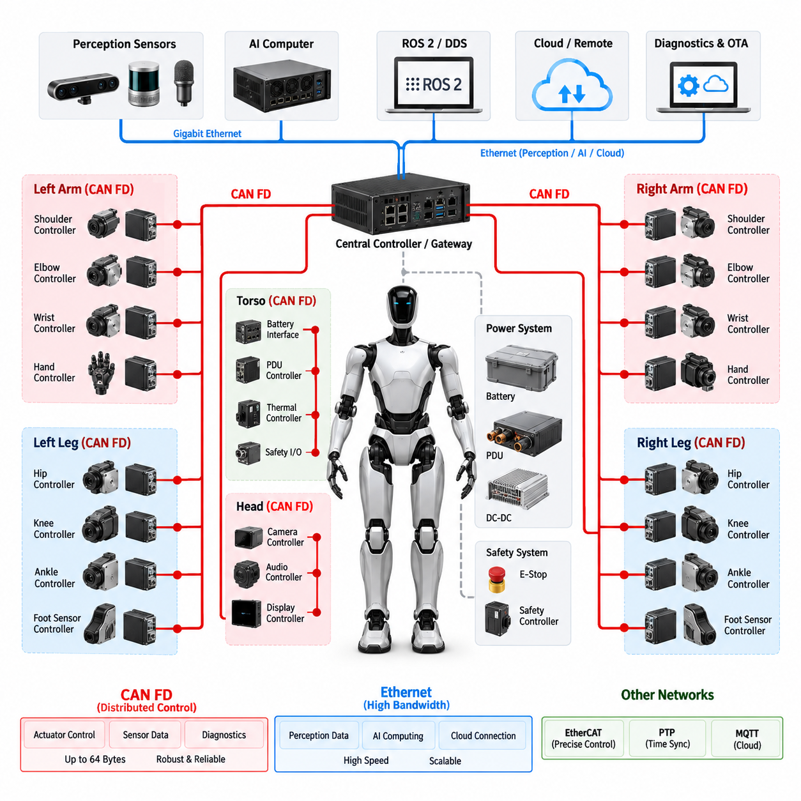
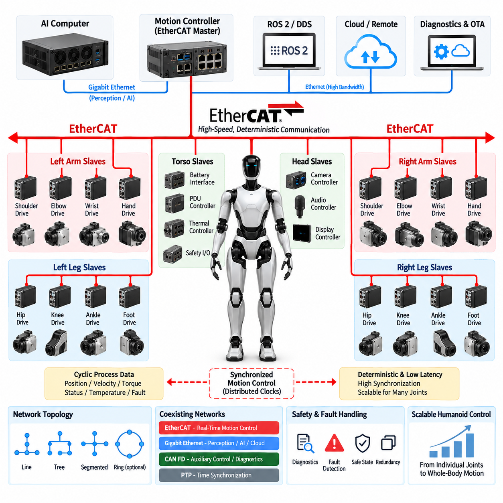
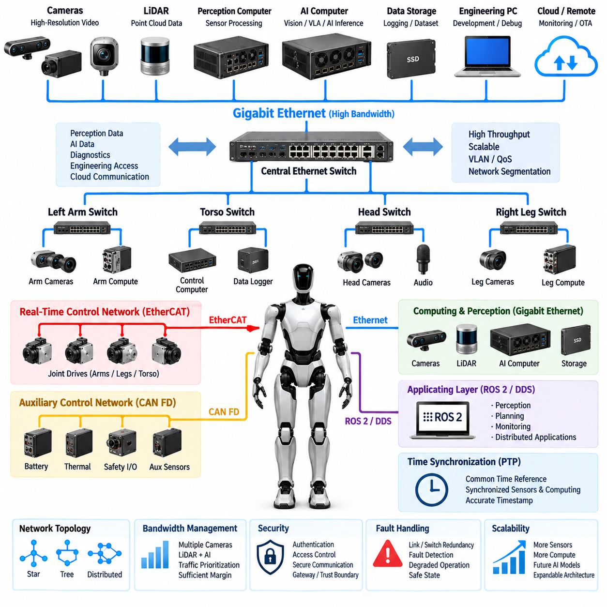
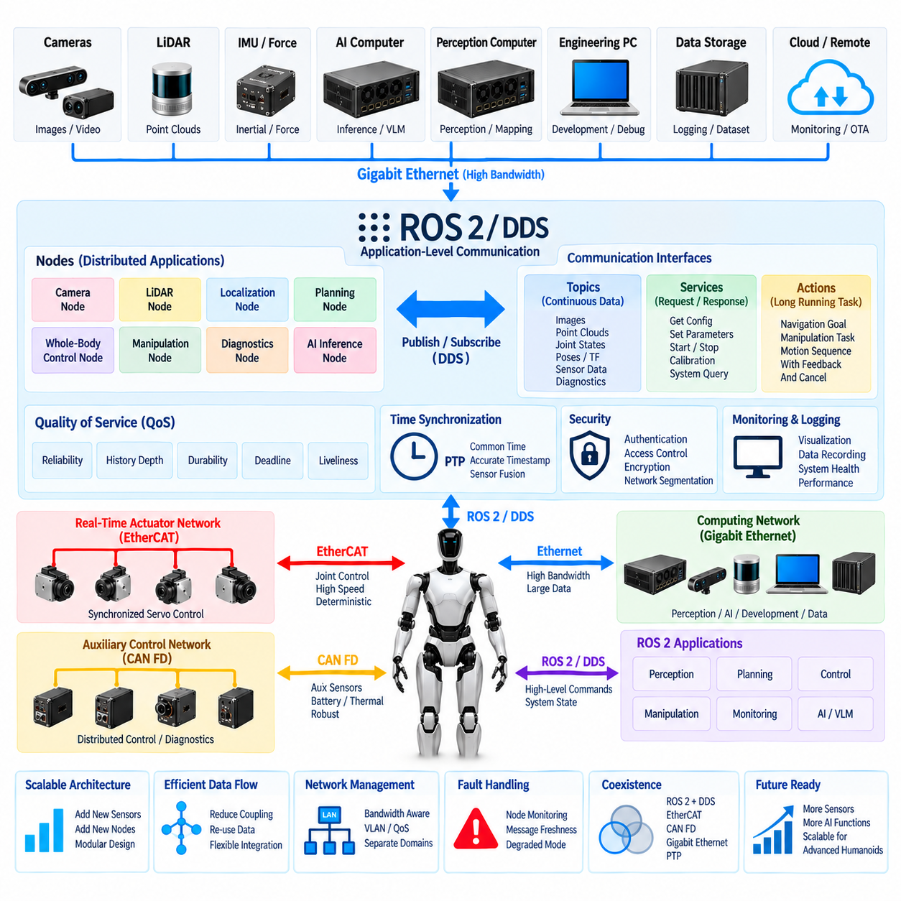
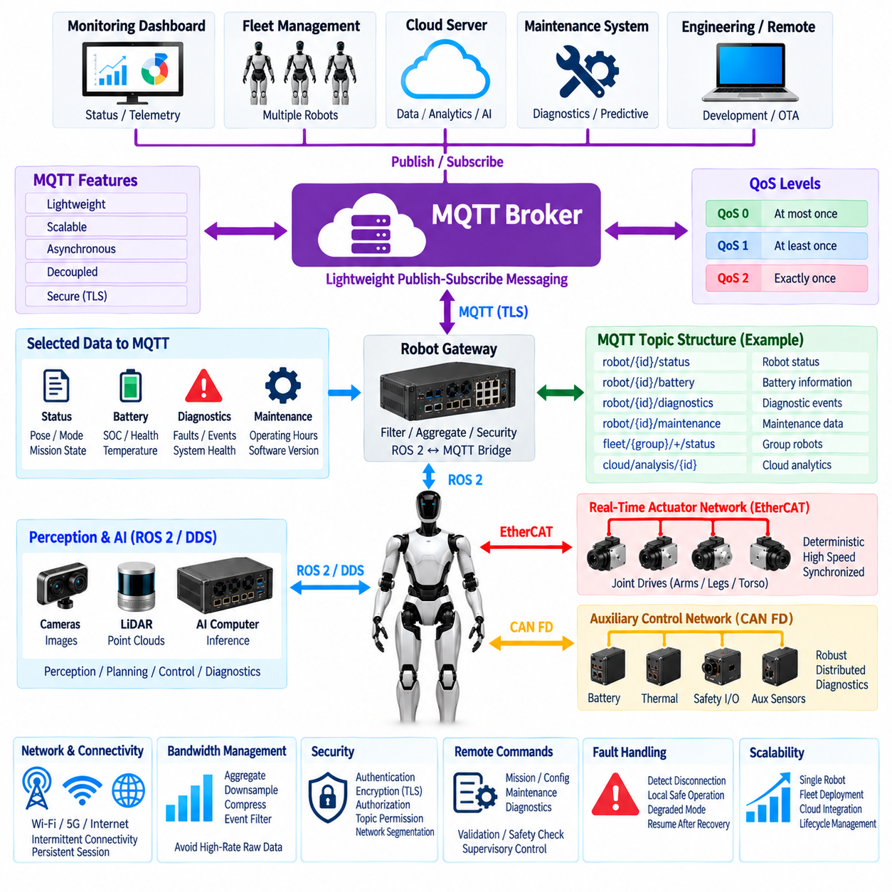
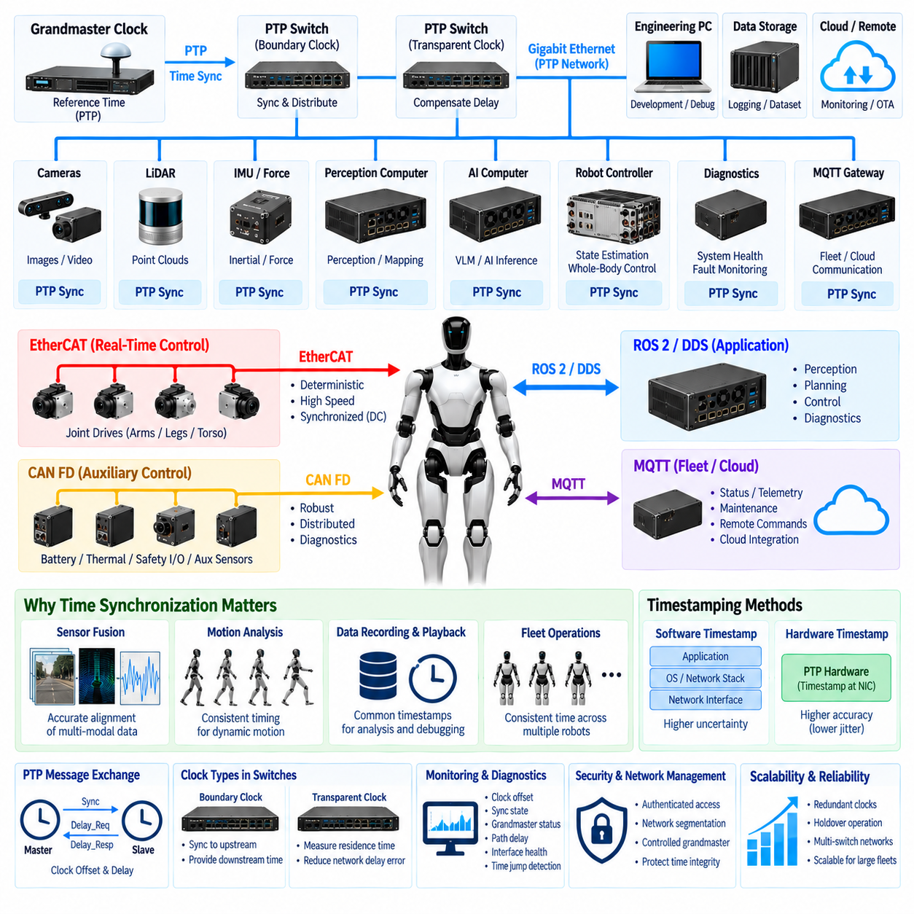

**Volume 21. Humanoid Electrical Architecture**

# Chapter 11. Communication Architecture

## 11.01. CAN FD

{width="7.268055555555556in" height="7.268055555555556in"}

In a humanoid electrical architecture, CAN FD provides a robust control network for distributed devices that require deterministic communication, moderate bandwidth, and strong fault detection. It is particularly suitable for joint actuators, motor drivers, torque sensors, brake controllers, battery interfaces, and local control modules. Within the communication architecture, CAN FD can serve as a reliable real-time field network while higher-bandwidth Ethernet systems handle perception, AI computing, and large data transfers.

CAN FD extends the original CAN protocol by allowing a larger payload and a higher data-phase bit rate. A conventional CAN frame carries up to 8 data bytes, while CAN FD supports up to 64 data bytes in a single frame. The frame can also use different bit rates for arbitration and data transmission. This reduces protocol overhead and improves the efficiency of exchanging actuator commands, sensor measurements, diagnostic information, and configuration parameters between humanoid control modules.

The arbitration phase of CAN FD retains the fundamental non-destructive arbitration mechanism of classical CAN. Each transmitting node monitors the bus while sending its identifier, and a higher-priority message can win arbitration without corrupting the frame of another node. This characteristic is valuable for humanoid control because urgent information such as safety states, actuator faults, torque limits, or emergency commands can be assigned higher message priority than less time-critical status information.

The physical layer normally uses a differential CAN_H and CAN_L pair, providing good immunity against common-mode electrical noise. This is important in humanoids because motor inverters, switching power supplies, DC-DC converters, and high-current actuator wiring can generate substantial electromagnetic interference. Proper termination, controlled impedance, grounding strategy, shielding where necessary, and careful separation from high-power wiring are therefore important parts of the CAN FD electrical design.

A humanoid can use CAN FD as a distributed actuator network in which each joint module contains a local motor controller, encoder interface, torque sensing interface, temperature monitoring function, and diagnostic capability. Instead of routing every sensor signal directly to a central computer, the joint controller can process local signals and exchange compact control information over CAN FD. This reduces harness complexity and allows the electrical architecture to remain modular as the number of joints increases.

Communication timing must be designed around the control hierarchy of the humanoid. High-frequency local servo loops should normally remain inside the actuator controller rather than depending entirely on the network. CAN FD can then exchange target torque, target position, velocity limits, actuator state, measured torque, temperature, fault status, and other supervisory information. This separation prevents network latency and bus contention from directly destabilizing the innermost motor-control loop.

Message identification and allocation should reflect functional priority rather than simply assigning identifiers according to physical location. Safety-related commands and critical actuator states should receive higher arbitration priority, while periodic diagnostics and maintenance information can use lower priority. A consistent identifier strategy also makes network analysis, debugging, trace recording, and future expansion easier when additional joints or peripheral controllers are introduced.

CAN FD is also well suited to distributed diagnostics. An actuator controller can report over-temperature conditions, encoder errors, communication faults, over-current events, abnormal torque behavior, supply-voltage deviations, and internal controller failures. Diagnostic information can be transmitted periodically for health monitoring or generated immediately when a significant event occurs. This allows the higher-level controller to distinguish between normal operating data and conditions requiring degraded operation or controlled shutdown.

Bus loading must be considered during architecture development. Increasing the number of joints, sensors, diagnostic messages, and periodic status frames can eventually approach the practical capacity of a CAN FD network. Message frequency, payload size, arbitration priority, bit timing, and physical bus length should therefore be evaluated together. Critical traffic should have sufficient timing margin so that temporary bursts of lower-priority communication cannot delay safety-relevant information.

Network segmentation can further improve reliability. A humanoid may use separate CAN FD segments for the left arm, right arm, left leg, right leg, torso, or other functional zones, with a gateway or central controller connecting these domains. Segmentation limits fault propagation, reduces bus loading, and simplifies service diagnostics. The exact partition should follow the system-level and distributed-control architecture rather than being determined only by wiring convenience.

CAN FD should not be treated as a replacement for every communication technology in the humanoid. EtherCAT can provide highly synchronized cyclic communication for demanding actuator networks, while Gigabit Ethernet can carry high-volume sensor and computing data. ROS 2 and DDS can provide middleware-level communication between computing applications, and PTP can establish precise time synchronization. CAN FD is therefore most effective when assigned to functions that benefit from compact messages, robust arbitration, distributed control, and mature fault handling.

A practical humanoid communication architecture can consequently combine CAN FD with Ethernet-based networks according to data criticality and bandwidth. CAN FD can connect distributed actuator and auxiliary controllers, while Ethernet links connect AI computers, perception systems, gateways, and high-performance controllers. This layered approach keeps low-level control communication robust and predictable while allowing the humanoid to scale toward increasingly complex perception, embodied AI, diagnostics, and cloud-connected functions.

## 11.02. EtherCAT

{width="7.268055555555556in" height="7.268055555555556in"}

EtherCAT is a high-performance Industrial Ethernet technology that can provide deterministic, low-latency communication for distributed humanoid actuator systems. In a humanoid electrical architecture, it is particularly suitable for coordinated joint control where multiple motor drives must exchange command and feedback data within tightly controlled cycle times. Compared with conventional Ethernet communication, EtherCAT is designed around efficient cyclic data exchange, making it useful for synchronized motion control across the arms, legs, torso, and other distributed actuator domains.

The basic EtherCAT architecture uses a master device that controls communication with multiple slave devices connected along an Ethernet-based network. The master generates cyclic frames containing control commands and data for distributed nodes, while each slave processes the relevant portion of the frame as it passes through the device. This processing method reduces communication overhead and allows many actuator controllers to exchange information within a single communication cycle. A humanoid controller can therefore coordinate multiple joints without requiring an independent network transaction for every actuator.

A major advantage of EtherCAT is its deterministic communication behavior. Humanoid motion requires coordinated control because hip, knee, ankle, shoulder, elbow, and wrist actuators often need to respond together rather than independently. Small timing differences between joint commands can affect balance, trajectory tracking, contact control, and dynamic motion. EtherCAT can provide predictable cyclic communication so that actuator commands and feedback values are exchanged at controlled intervals, supporting synchronized motion across multiple joints.

EtherCAT is especially effective when the local actuator controller contains the motor-control functions while the network provides high-speed supervisory and coordination data. A joint controller can execute the innermost current, velocity, or position loops locally and use EtherCAT to receive motion targets and transmit measured position, velocity, torque, temperature, and status information. This distributed approach reduces the computational burden on the central controller while maintaining a clear separation between local servo control and system-level motion coordination.

The process data exchanged through EtherCAT can be organized according to the control requirements of each actuator. Cyclic data may include target position, target velocity, target torque, control words, measured position, measured velocity, measured torque, status words, temperature, and fault information. Because these values are exchanged repeatedly within defined communication cycles, the higher-level motion controller can maintain a consistent view of the complete actuator system. This is important for whole-body control, balance control, and coordinated manipulation.

EtherCAT also supports distributed clock mechanisms that can improve synchronization between devices. In a humanoid robot, accurate timing is important because sensor measurements and actuator responses must be interpreted within a common temporal reference. Distributed clocks allow multiple EtherCAT nodes to operate with closely aligned timing, reducing synchronization errors between joint controllers. When combined with appropriate system-level time synchronization, this capability can support precise coordination between motion control, force sensing, and other real-time functions.

The physical network topology can be designed to match the humanoid\'s mechanical and electrical structure. EtherCAT devices may be connected in line, tree, or other supported arrangements depending on the selected hardware and system requirements. Functional segmentation can separate arm, leg, or torso actuator groups while maintaining communication through an EtherCAT master or gateway architecture. Such segmentation can simplify harness routing, service diagnostics, and system expansion while allowing the overall controller to coordinate distributed motion.

EtherCAT communication must be designed together with the actuator cycle time, number of nodes, payload size, network topology, and required synchronization accuracy. Increasing the number of joints and feedback signals increases the amount of cyclic process data that must be exchanged within each cycle. The communication cycle therefore needs sufficient timing margin for the required control frequency. Network analysis should consider worst-case traffic, device processing time, frame transmission, synchronization behavior, and fault recovery rather than evaluating only the nominal communication rate.

Safety and fault handling should also be integrated into the EtherCAT architecture. Actuator controllers can transmit diagnostic states, communication errors, encoder failures, over-temperature conditions, over-current conditions, and other abnormal states to the master controller. Depending on the selected safety architecture, safety-related communication may use dedicated safety mechanisms or independent hardware paths rather than relying solely on standard process data. The system should define how communication loss, invalid feedback, node failure, or synchronization errors lead to controlled degradation or safe actuator behavior.

EtherCAT and CAN FD can coexist in a humanoid electrical architecture because their strengths are different. CAN FD is well suited to robust distributed control, compact messages, diagnostics, and auxiliary controllers, while EtherCAT is particularly valuable when high-speed cyclic communication and precise coordination among multiple servo drives are required. The selection should therefore be based on control-loop requirements, synchronization needs, bandwidth, wiring architecture, device availability, and safety strategy rather than treating one protocol as universally superior.

At the system level, EtherCAT can form the real-time motion-control layer beneath higher-level computing networks. A central real-time controller can exchange cyclic actuator data through EtherCAT while Gigabit Ethernet connects AI computers, perception systems, and other high-bandwidth components. ROS 2 and DDS can provide application-level communication above these real-time layers, while PTP or other timing mechanisms can support broader system synchronization. This layered architecture allows the humanoid to combine deterministic motion control with high-bandwidth perception and embodied AI processing.

A practical humanoid implementation can therefore use EtherCAT as a dedicated real-time communication backbone for coordinated servo control while maintaining other networks for perception, diagnostics, cloud connectivity, and general-purpose computing. The architecture should keep safety-critical and time-critical functions sufficiently isolated from high-bandwidth non-real-time traffic. With appropriate cycle-time design, distributed synchronization, actuator-level control, diagnostics, and network segmentation, EtherCAT can provide a scalable foundation for precise whole-body motion and increasingly complex humanoid control architectures.

## 11.03. Gigabit Ethernet

{width="7.268055555555556in" height="7.268055555555556in"}

Gigabit Ethernet provides a high-bandwidth communication foundation for humanoid electrical architecture, particularly for perception, AI computing, visualization, diagnostics, and other data-intensive functions. Unlike low-level actuator networks designed around compact cyclic control messages, Gigabit Ethernet can transport large volumes of sensor and computing data between cameras, LiDAR, AI computers, real-time controllers, and external systems. Its high throughput makes it an important communication layer for humanoids that combine distributed control with increasingly demanding perception and embodied AI workloads.

A humanoid may use Gigabit Ethernet to connect the central computing architecture with perception computers, camera systems, LiDAR interfaces, storage devices, engineering workstations, and other high-performance processing units. Camera streams and three-dimensional perception data can generate substantially more traffic than conventional actuator feedback. Ethernet therefore provides the bandwidth required to move these datasets without forcing the low-level control network to carry traffic for which it was not designed. This separation helps maintain a clear distinction between high-bandwidth data processing and real-time actuator control.

The physical Ethernet architecture can be organized around switches, point-to-point links, or distributed network segments depending on the humanoid design. A central Ethernet switch can connect the AI computer, perception processors, communication gateways, and service interfaces, while additional switches may be located in the torso, head, or other zones. This distributed structure can reduce long point-to-point harnesses and provide a scalable method for adding cameras, sensors, compute modules, and diagnostic equipment as the humanoid platform evolves.

Bandwidth allocation is an important consideration because multiple high-rate devices may operate simultaneously. Several cameras can continuously generate image streams while LiDAR, depth sensors, AI inference systems, and logging functions exchange additional data. Network design should therefore consider aggregate throughput, packet rates, switch capacity, link utilization, buffering, and worst-case traffic conditions. Sufficient margin should be maintained so that temporary increases in perception or diagnostic traffic do not cause unacceptable delays for applications that depend on network communication.

Gigabit Ethernet can also provide the communication path between different levels of the humanoid computing hierarchy. A real-time controller may exchange selected status information with an AI computer, while the AI computer receives camera and LiDAR data and sends higher-level perception or planning results. ROS 2 and DDS can operate above the Ethernet transport layer to provide application-level communication between distributed software components. This allows the physical network to support multiple software functions without requiring every application to implement its own low-level communication mechanism.

The Ethernet architecture should remain logically separated according to functional requirements even when multiple applications share the same physical infrastructure. Perception traffic, AI data, diagnostics, engineering access, and external communication may require different quality-of-service characteristics. VLANs, traffic prioritization, network segmentation, and controlled gateway functions can be used where appropriate to isolate traffic domains. Such mechanisms help prevent high-volume non-critical traffic from unnecessarily interfering with communication required by more important control or monitoring functions.

Time-sensitive applications require additional consideration because conventional Gigabit Ethernet does not automatically provide deterministic timing for every packet. A humanoid can therefore combine Ethernet bandwidth with dedicated real-time technologies where necessary. EtherCAT may handle tightly synchronized servo communication, while Gigabit Ethernet carries perception and computing data. PTP can provide a common time reference for distributed systems that require accurate timestamping. This layered approach allows each communication technology to be applied according to its timing, bandwidth, and reliability requirements.

Camera and LiDAR integration can place particularly strong demands on the Ethernet network. Multiple high-resolution cameras may transmit synchronized image streams to an AI computer for perception and sensor fusion, while LiDAR systems provide point-cloud data through separate interfaces. Timestamp consistency, packet loss monitoring, buffering, and data synchronization become important because perception algorithms depend on combining measurements that represent the same physical moment. Ethernet infrastructure should therefore be designed together with sensor timing and compute architecture rather than treated as an isolated communication subsystem.

Gigabit Ethernet is also useful for engineering diagnostics and system maintenance. During development, large log files, sensor recordings, software packages, configuration data, and diagnostic traces may need to move between the humanoid and external computers. High bandwidth can significantly reduce the time required to retrieve recorded perception data or deploy large software artifacts. However, service traffic should be controlled so that engineering operations cannot unintentionally overload networks supporting active robot functions.

Cybersecurity becomes increasingly important as Gigabit Ethernet connects more computing resources and potentially provides paths toward external networks. Network architecture should define trust boundaries between internal control systems, perception and AI computers, service interfaces, and cloud-connected functions. Authentication, access control, secure communication, gateway filtering, and controlled external connectivity can reduce the risk of unauthorized access. Safety-critical controllers should not depend on unrestricted external network access for normal operation.

Fault handling should also be considered at the Ethernet architecture level. A failed switch, damaged cable, disconnected connector, excessive packet loss, or malfunctioning network interface can interrupt communication with multiple devices simultaneously. Depending on the required availability, redundant links, redundant switches, independent network paths, or local fallback functions may be introduced. The system should define how communication failures are detected and how affected functions transition into degraded, isolated, or safe operating states.

Gigabit Ethernet should coexist with CAN FD, EtherCAT, ROS 2/DDS, MQTT, and PTP rather than replacing all other communication technologies. CAN FD can provide robust distributed auxiliary control and diagnostics, EtherCAT can support deterministic servo coordination, ROS 2/DDS can provide application-level middleware, MQTT can support selected cloud-oriented communication, and PTP can provide precise time synchronization. Gigabit Ethernet serves as the high-bandwidth transport layer that connects many of these computing and communication domains.

At the system level, a practical humanoid architecture can use Gigabit Ethernet as the primary high-bandwidth backbone connecting perception, AI computing, data recording, diagnostics, and selected control interfaces. Real-time actuator networks can remain separated through EtherCAT or CAN FD, while gateways exchange only the information required between domains. This architecture provides a scalable communication foundation in which additional cameras, sensors, compute modules, and AI functions can be integrated without redesigning the entire low-level control network.

As humanoid systems evolve toward larger foundation models, multimodal perception, vision-language-action processing, and embodied AI, Ethernet bandwidth becomes increasingly important. The communication architecture must therefore be designed not only for the current sensor and computing configuration but also for future increases in data volume. A well-structured Gigabit Ethernet network provides the scalable high-bandwidth layer needed to connect perception and computing resources while preserving the deterministic and safety-oriented characteristics of dedicated real-time control networks.

## 11.04. ROS2/DDS

{width="7.268055555555556in" height="7.268055555555556in"}

ROS 2 and DDS form the application-level communication framework that connects distributed software components across a humanoid robot. While CAN FD and EtherCAT primarily address device and actuator communication, and Gigabit Ethernet provides the physical high-bandwidth transport, ROS 2 uses DDS-based communication to exchange structured information among perception, motion planning, control, diagnostics, and embodied AI applications. This layered approach allows software functions to evolve independently from the underlying electrical network.

ROS 2 organizes distributed robot software around nodes that perform specific functions and exchange information through defined communication interfaces. A humanoid may contain nodes for camera processing, LiDAR perception, localization, whole-body control, manipulation, balance estimation, diagnostics, and AI inference. These nodes can execute on different processors while communicating through the same ROS 2 architecture, allowing computational workloads to be distributed between real-time controllers, perception computers, and AI computers.

DDS, or Data Distribution Service, provides the data-centric publish-subscribe communication model used by ROS 2 middleware. A publisher produces data associated with a topic, while one or more subscribers receive that information without requiring direct point-to-point connections between every software component. This decoupling is valuable in complex humanoids because perception, control, monitoring, and logging applications can consume the same information while remaining logically independent from the original data producer.

Topics provide the primary mechanism for continuous data exchange. Camera images, point clouds, joint states, estimated poses, force measurements, system temperatures, battery information, and diagnostic states can be represented as structured messages and published through appropriate topics. Each subscriber receives only the information it requires. This architecture makes it possible to add monitoring, visualization, recording, or AI-processing nodes without redesigning the communication interfaces of existing components.

ROS 2 also provides services and actions for communication patterns that are not naturally represented as continuous streams. Services support request-response interactions such as retrieving configuration information or requesting a discrete operation. Actions are suitable for longer-running tasks that require feedback, progress monitoring, and cancellation. A humanoid can therefore use topics for continuous state exchange while services and actions coordinate configuration, manipulation tasks, navigation goals, calibration procedures, or system-level behaviors.

Quality of Service, or QoS, is an important capability of DDS-based ROS 2 communication. Different humanoid data streams have different communication requirements, and applying identical policies to every message would be inefficient. QoS settings can define reliability, history depth, durability, deadline behavior, and other delivery characteristics. High-rate perception data may tolerate occasional loss, while important state or command information may require stronger delivery guarantees depending on the system architecture.

The ROS 2 communication layer should be designed with network bandwidth and computational load in mind. High-resolution images and point clouds can generate large message streams, and unnecessary duplication can consume Ethernet bandwidth, CPU resources, and memory. Topic frequency, message size, serialization overhead, subscriber count, and data recording should therefore be considered together. Large sensor data should remain on suitable high-bandwidth paths rather than being indiscriminately distributed to every computing node.

In a humanoid computing hierarchy, ROS 2 can bridge multiple processing domains while preserving functional separation. Perception computers can publish detected objects, poses, terrain information, or human interaction data, while AI computers generate semantic interpretation and higher-level task decisions. Real-time controllers can expose selected state information and receive appropriately constrained commands through gateway interfaces. This prevents high-level software from directly controlling low-level hardware without defined architectural boundaries.

ROS 2/DDS should not replace dedicated real-time actuator networks when strict deterministic timing is required. EtherCAT can continue to execute tightly synchronized cyclic servo communication, while CAN FD handles distributed auxiliary controllers and diagnostics. ROS 2 can operate above these networks and exchange higher-level state, commands, and system information through gateways. This separation keeps microsecond- or millisecond-sensitive control traffic independent from variable application-level communication workloads.

Time synchronization is essential when ROS 2 applications combine information generated by multiple sensors and computers. Camera images, LiDAR scans, joint states, force measurements, and inertial data must often be correlated according to acquisition time rather than reception time. PTP can establish a common clock reference across Ethernet-connected devices, while ROS 2 messages carry timestamps associated with sensor measurements. Consistent timing improves sensor fusion, motion analysis, event reconstruction, and diagnostic interpretation.

ROS 2 also supports modular diagnostics and observability across the humanoid platform. Software nodes can publish health states, processing latency, sensor availability, communication conditions, and subsystem faults to monitoring applications. Logging and recording tools can capture selected topics for development, validation, or field analysis. Because diagnostic applications can subscribe without changing the original publisher, system observability can be expanded as the humanoid architecture becomes more complex.

Communication reliability should be considered together with software fault handling. A ROS 2 node may stop publishing, become overloaded, lose network connectivity, or produce stale information even when the physical Ethernet link remains operational. Supervisory functions should therefore monitor message freshness, expected publication rates, node health, and communication deadlines. Safety-critical functions should define explicit behavior for missing or invalid application data rather than assuming that middleware communication will always remain available.

Cybersecurity is increasingly important because ROS 2 may connect AI computers, perception processors, engineering interfaces, and network gateways within the same distributed environment. Authentication, encryption, access control, network segmentation, and controlled discovery can help protect communication between trusted components. External cloud or service connectivity should pass through defined security boundaries so that remote communication cannot directly expose critical actuator or safety-control domains.

A scalable humanoid architecture can therefore position ROS 2/DDS between the high-level computing applications and the underlying communication infrastructure. Gigabit Ethernet provides high-bandwidth transport, PTP supports synchronized timing, EtherCAT provides deterministic motion communication, and CAN FD supports robust distributed control and diagnostics. ROS 2/DDS integrates these domains at the software level, enabling perception, planning, AI, monitoring, and control applications to exchange structured information through standardized interfaces.

As humanoids evolve toward multimodal perception, vision-language-action models, foundation models, and more autonomous embodied AI, the number of distributed software components will continue to increase. ROS 2/DDS provides an extensible communication framework in which new sensors, AI functions, planners, and diagnostic applications can be integrated without tightly coupling every component. When combined with disciplined QoS design, network segmentation, time synchronization, and real-time gateways, it provides a scalable software communication layer for increasingly capable humanoid systems.

## 11.05. MQTT

{width="7.268055555555556in" height="7.268055555555556in"}

MQTT is a lightweight publish-subscribe messaging protocol that can provide an efficient communication path between a humanoid robot, fleet infrastructure, remote monitoring systems, and cloud services. Within the humanoid communication architecture, MQTT is best positioned above the deterministic control networks rather than inside critical servo loops. It can transport telemetry, diagnostics, operational status, maintenance information, and selected application events while CAN FD, EtherCAT, and local real-time controllers continue to handle time-critical physical control.

The MQTT architecture is centered on a broker that receives messages from publishers and distributes them to interested subscribers. A humanoid does not need to establish a direct connection with every remote application that requires its data. Instead, robot-side software publishes information to defined topics, and monitoring dashboards, fleet systems, maintenance applications, or cloud services subscribe to the topics they require. This decoupling simplifies integration and allows additional consumers to be introduced without redesigning the robot communication interface.

Topics provide the logical structure for organizing MQTT communication. A humanoid deployment can separate messages according to robot identity, subsystem, function, and data type, such as robot status, battery state, thermal conditions, diagnostic events, software versions, mission state, or maintenance information. A disciplined topic hierarchy makes messages easier to route and filter while allowing fleet-level applications to subscribe to data from one robot, one subsystem, a group of robots, or an entire deployed population.

MQTT supports different Quality of Service levels that allow message delivery behavior to be selected according to application requirements. QoS 0 provides best-effort delivery with minimal overhead, QoS 1 provides at-least-once delivery, and QoS 2 provides exactly-once delivery with additional protocol exchange. Humanoid telemetry may use lower-overhead delivery for frequently updated values, while important operational events can use stronger delivery guarantees. QoS selection should balance reliability, latency, bandwidth, and processing cost.

Retained messages can provide the latest known value of selected states to newly connected subscribers. For example, a remote monitoring application connecting to the broker can immediately obtain the most recently published operating mode, battery state, software version, or availability information without waiting for the next periodic update. Retained data should be used selectively because rapidly changing sensor streams and transient control information are generally better handled through communication mechanisms designed specifically for those purposes.

MQTT can also use persistent sessions and delivery mechanisms that help tolerate intermittent network connectivity. A mobile humanoid may move between wireless coverage zones or temporarily lose access to a remote network while continuing local operation. The communication architecture can buffer selected events and transmit them after connectivity is restored. Local safety and motion functions, however, should remain independent of continuous broker availability so that loss of cloud communication does not directly prevent the robot from entering a controlled or safe state.

A gateway architecture is useful for separating MQTT from the humanoid\'s internal real-time networks. ROS 2 applications, diagnostic managers, or system supervisors can collect selected information from internal software and expose only appropriate data through an MQTT gateway. The gateway can perform filtering, aggregation, rate limiting, format conversion, and security enforcement. This prevents high-frequency actuator traffic or raw internal data from being unnecessarily forwarded to external networks and reduces coupling between robot control and cloud communication.

MQTT and ROS 2/DDS serve different communication roles and can complement each other. ROS 2/DDS is well suited to distributed robot applications operating across local computing resources, including perception, planning, control, and diagnostics. MQTT is more appropriate for lightweight communication across robot-to-server, fleet, remote monitoring, and cloud boundaries. A bridge can selectively convert ROS 2 information into MQTT messages so that useful robot state becomes available externally without exposing the complete internal ROS 2 communication graph.

Bandwidth management is important when MQTT operates over wireless or shared external connections. Publishing every internal sensor value at its native frequency can generate unnecessary traffic and increase cloud storage and processing costs. Robot-side software should therefore aggregate, downsample, compress, or event-filter data according to operational needs. High-rate camera images, LiDAR point clouds, and raw servo data should normally remain on local high-bandwidth networks unless a specific remote diagnostic or data-collection task requires their transfer.

MQTT can provide an effective foundation for remote diagnostics and predictive maintenance. The humanoid can publish actuator temperatures, battery health indicators, fault codes, communication statistics, operating hours, thermal warnings, software versions, and subsystem availability. Fleet or maintenance systems can analyze these messages across many robots to identify recurring faults or degradation trends. Significant events can trigger maintenance workflows while detailed engineering data remains available through dedicated diagnostic channels when deeper analysis is required.

Cybersecurity is essential because MQTT often crosses the boundary between the robot and external infrastructure. Broker connections should use authenticated identities, encrypted transport, authorization policies, and carefully defined topic permissions. A robot should be allowed to publish and subscribe only to the information required for its assigned role. Network segmentation and gateway filtering should prevent compromise of a remote service from providing unrestricted access to internal actuator, safety, or engineering networks.

Remote commands require particularly careful architectural control. MQTT may carry high-level requests such as mission assignment, configuration synchronization, maintenance operations, or requests for diagnostic information, but these messages should not directly drive motors or bypass local safety logic. Incoming commands should pass through authentication, authorization, validation, state checks, and supervisory control before affecting robot behavior. The local controller must retain authority to reject commands that are invalid, unsafe, stale, or inconsistent with the current operating state.

Fault handling should assume that the broker, wireless link, Internet connection, or cloud service can become unavailable at any time. The humanoid should detect communication loss and distinguish external connectivity failures from internal control failures. Depending on the application, it may continue a locally authorized task, enter a degraded operating mode, return to a predefined state, or wait for communication recovery. Safety-critical functions should remain operational without requiring MQTT connectivity, preserving a clear boundary between cloud communication and physical safety.

At the system level, MQTT fits naturally into a layered humanoid communication architecture. EtherCAT can provide deterministic joint and servo communication, CAN FD can support robust distributed auxiliary control, Gigabit Ethernet can transport high-bandwidth perception and computing data, ROS 2/DDS can connect distributed software applications, and PTP can maintain precise timing. MQTT extends this architecture beyond the robot by providing lightweight asynchronous messaging for fleet, monitoring, service, and cloud integration.

As humanoids move from isolated prototypes toward fleets of connected physical AI systems, MQTT can become increasingly valuable for operational coordination and lifecycle management. A scalable topic hierarchy, secure broker architecture, controlled gateways, appropriate QoS policies, and disciplined data selection allow many robots and external applications to communicate without tightly coupling their implementations. Used above the real-time control layers, MQTT provides a practical bridge between autonomous humanoid operation and larger fleet, enterprise, and cloud ecosystems.

## 11.06. PTP Time Sync

{width="7.268055555555556in" height="7.268055555555556in"}

PTP, or Precision Time Protocol, provides a common time reference for distributed devices across an Ethernet-based humanoid communication architecture. Accurate time synchronization is essential when cameras, LiDAR, IMUs, force sensors, joint controllers, perception computers, and AI processors generate data independently. PTP aligns their clocks so measurements and events can be interpreted according to when they actually occurred rather than simply when they were received by another computer.

In a humanoid robot, synchronization directly affects the quality of sensor fusion and motion analysis. A camera image may capture a moving arm while an IMU measures body rotation and joint encoders report actuator positions at nearly the same instant. If these measurements use inconsistent clocks, software may combine data representing different physical states. A shared PTP time base reduces this temporal mismatch and improves the consistency of multimodal perception, state estimation, and whole-body motion reconstruction.

A PTP network establishes timing relationships between a reference clock and other clocks distributed throughout the system. A grandmaster clock provides the primary time reference, while participating devices synchronize their local clocks through timestamped protocol exchanges. Depending on the network architecture, Ethernet switches can also participate in timing distribution. This hierarchical arrangement allows many sensors, controllers, and computing nodes to operate from a coordinated temporal reference without requiring separate timing wiring to every device.

Clock synchronization requires more than periodically transmitting the current time. Network propagation delay and packet-processing effects must be estimated so that each device can determine the difference between its local clock and the reference clock. PTP exchanges timing messages and uses timestamps to estimate clock offset and path delay. The local clock can then be adjusted toward the common reference, allowing timestamps generated by different devices to be compared meaningfully throughout the humanoid system.

Timestamp location strongly influences achievable synchronization accuracy. Software timestamping records packet timing after portions of the operating system and network stack have already introduced variable delays. Hardware timestamping can capture timing closer to the physical Ethernet interface, reducing software-induced uncertainty. For humanoid applications requiring precise correlation of high-rate sensors or distributed control events, hardware-supported PTP interfaces are therefore preferable when the required accuracy justifies their additional hardware and integration complexity.

PTP-aware Ethernet switches can improve synchronization performance across larger distributed networks. A boundary clock can synchronize to an upstream reference and provide timing to downstream devices, while a transparent clock accounts for the residence time of timing packets inside a switch. These mechanisms reduce errors introduced by network infrastructure and become increasingly useful when the humanoid contains multiple switches connecting the head, torso, limbs, perception computers, and central computing systems.

Sensor synchronization should distinguish between clock synchronization and measurement triggering. PTP can align device clocks, but synchronized clocks alone do not guarantee that multiple cameras or sensors capture data at exactly the same instant. Some applications may additionally require hardware trigger signals or sensor-specific synchronization mechanisms. PTP can provide the common temporal reference while hardware triggering controls acquisition timing, allowing captured measurements to be accurately timestamped and correlated afterward.

Camera and LiDAR fusion is a representative application of precise synchronization. Images describe visual appearance at a particular instant, while LiDAR measurements describe three-dimensional geometry acquired over a scan interval. Accurate timestamps allow the perception system to compensate for robot motion and associate measurements more correctly. This becomes especially important during walking, manipulation, rapid head motion, or interaction with moving people and objects, where even relatively small temporal errors can become spatial alignment errors.

Joint states, force measurements, and inertial information also benefit from a unified time base. Whole-body controllers and state estimators may combine encoder positions, torque measurements, foot contact forces, and IMU data to estimate posture and dynamic state. If these measurements originate from different clocks, timing uncertainty can appear as false motion or inconsistent contact behavior. PTP-based synchronization allows data to be aligned before fusion and supports more accurate analysis of balance, locomotion, and physical interaction.

PTP should be integrated carefully with dedicated real-time communication technologies. EtherCAT provides its own distributed clock mechanisms for tightly synchronized servo networks, while PTP can synchronize Ethernet-connected perception and computing systems. A gateway or real-time controller can establish a defined relationship between these timing domains when data crosses between them. The goal is not necessarily to force every device onto one timing mechanism, but to maintain traceable and consistent time relationships across the complete humanoid architecture.

ROS 2 and DDS applications can use synchronized clocks to improve distributed software communication and data interpretation. Messages containing camera images, point clouds, joint states, poses, force measurements, or diagnostic events can carry timestamps derived from a coordinated time base. Subscribers can then compare acquisition times independently of network arrival order. This is especially valuable for sensor fusion, recording, playback, distributed debugging, latency measurement, and reconstruction of complex events after a system fault.

Timing architecture should include monitoring and diagnostics rather than assuming synchronization remains correct after startup. The system can supervise clock offset, synchronization state, grandmaster availability, path delay, interface status, and unexpected time jumps. If synchronization quality falls outside an acceptable range, affected applications should be informed so that potentially misaligned data can be rejected, degraded, or handled conservatively. Timing health therefore becomes an observable system state rather than an invisible infrastructure assumption.

Fault tolerance is important because loss of the time reference can affect many distributed functions simultaneously. Depending on system requirements, the architecture may provide redundant clock sources, alternate grandmaster candidates, or local holdover behavior that allows devices to continue operating temporarily using their own stabilized clocks. Applications should define how long unsynchronized or holdover operation remains acceptable and which functions must be restricted when timing uncertainty exceeds specified limits.

PTP also requires cybersecurity and network-management consideration because manipulation of system time can disrupt logging, sensor fusion, diagnostics, and distributed decision making. Timing traffic should remain within controlled network domains, and access to timing configuration should be restricted. Network segmentation, authenticated management, controlled grandmaster selection, and monitoring for abnormal clock changes can help protect the temporal integrity of the humanoid communication architecture.

At the system level, PTP complements the other communication technologies rather than replacing them. EtherCAT can provide deterministic servo communication, CAN FD can support robust distributed auxiliary control, Gigabit Ethernet can transport high-bandwidth sensor and computing data, ROS 2/DDS can provide application-level communication, and MQTT can connect the robot to fleet and cloud services. PTP supplies the shared temporal foundation that allows events generated across these distributed domains to be correlated consistently.

As humanoids evolve toward multimodal perception, vision-language-action systems, whole-body intelligence, and increasingly distributed computing, precise time becomes part of the fundamental system architecture. A carefully engineered PTP infrastructure with suitable grandmaster selection, hardware timestamping, PTP-aware switching, timing diagnostics, and controlled interaction with real-time networks provides a scalable synchronization foundation for perception, control, recording, validation, and advanced embodied AI.
