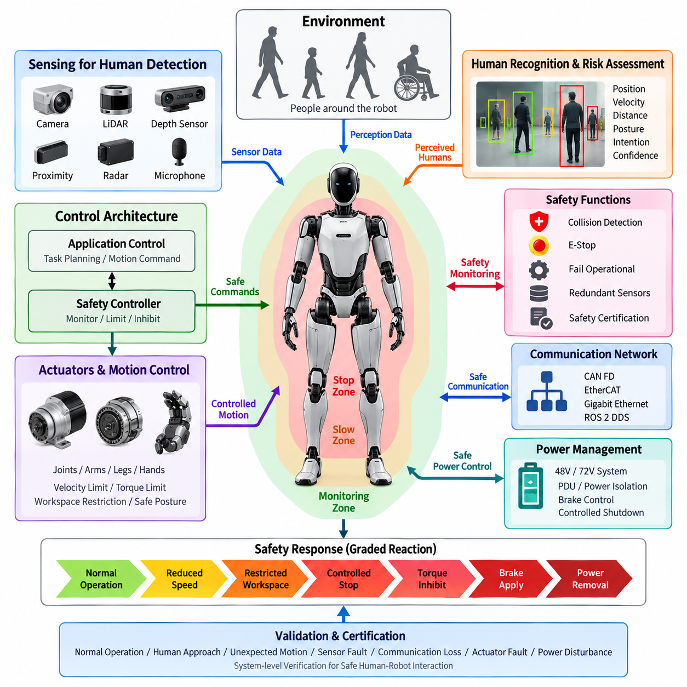
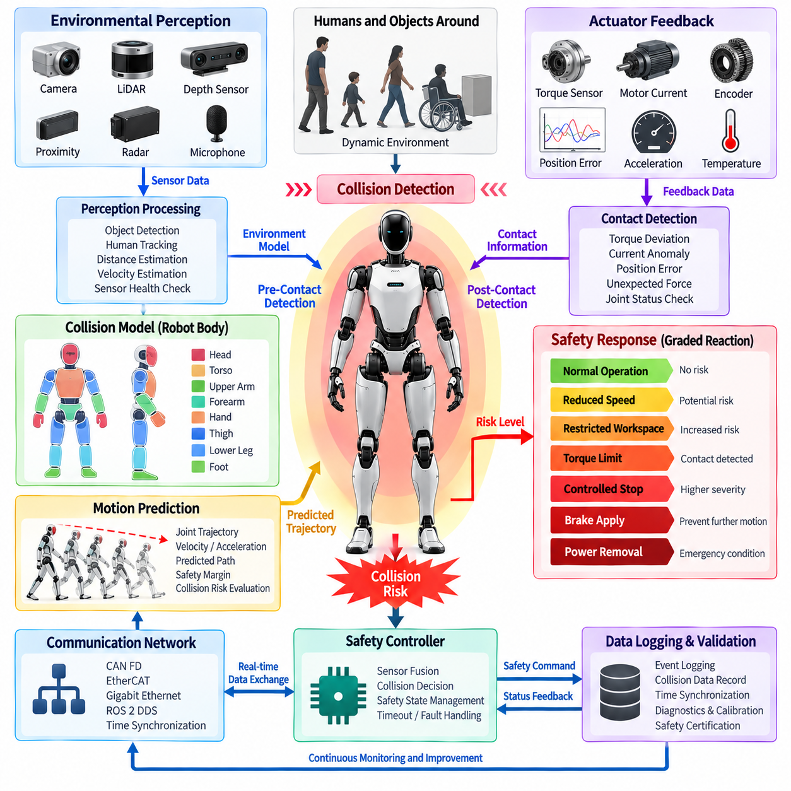
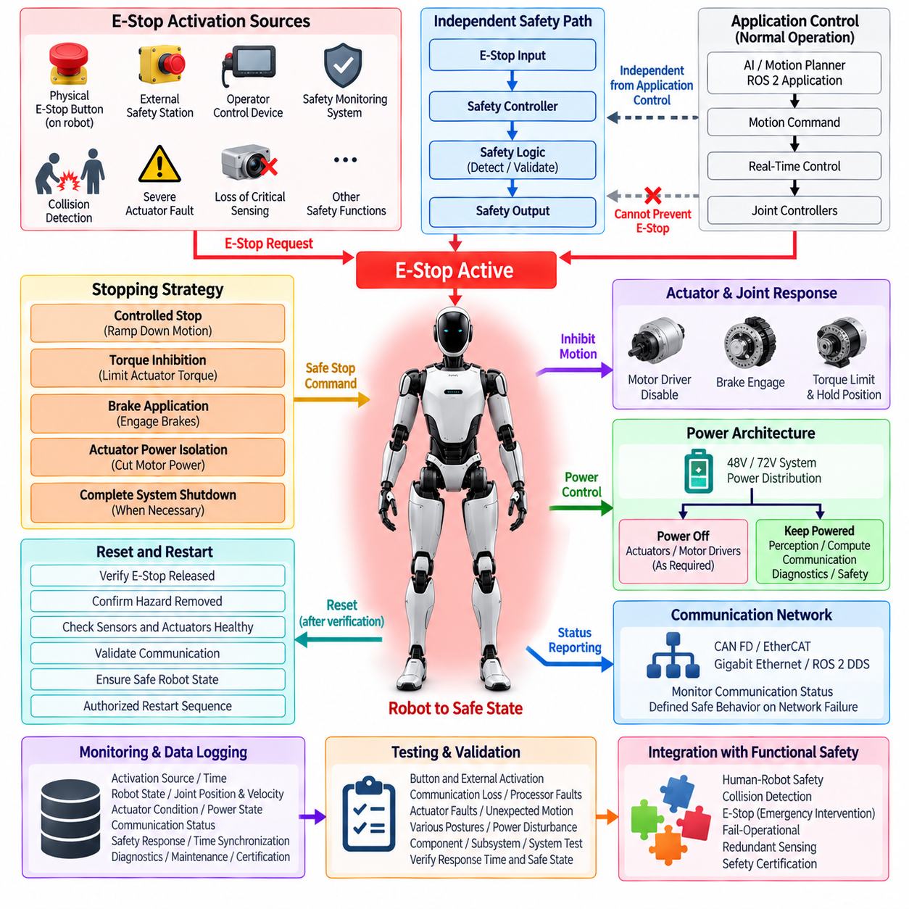
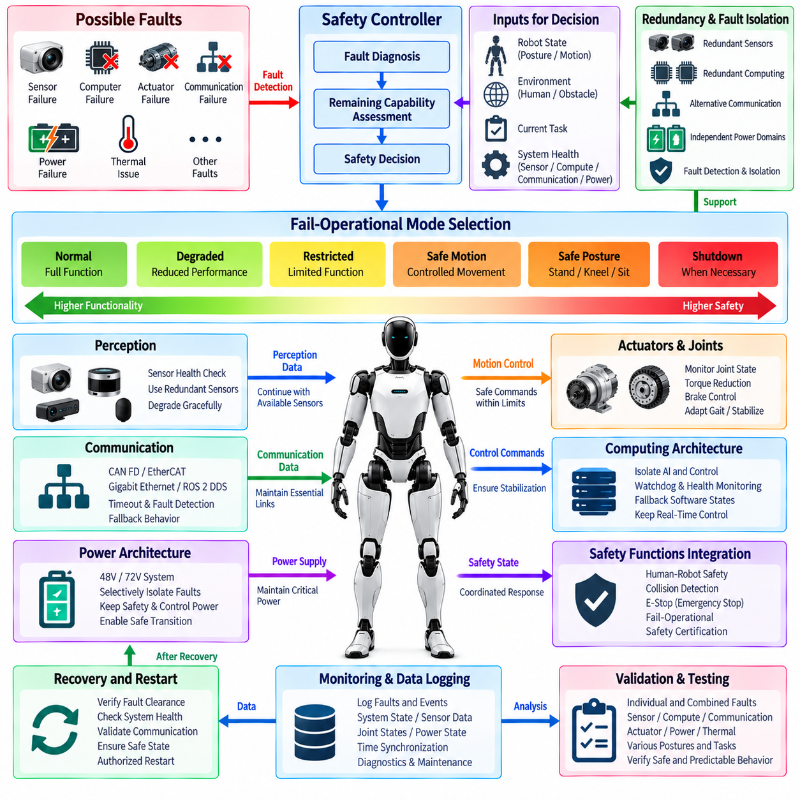
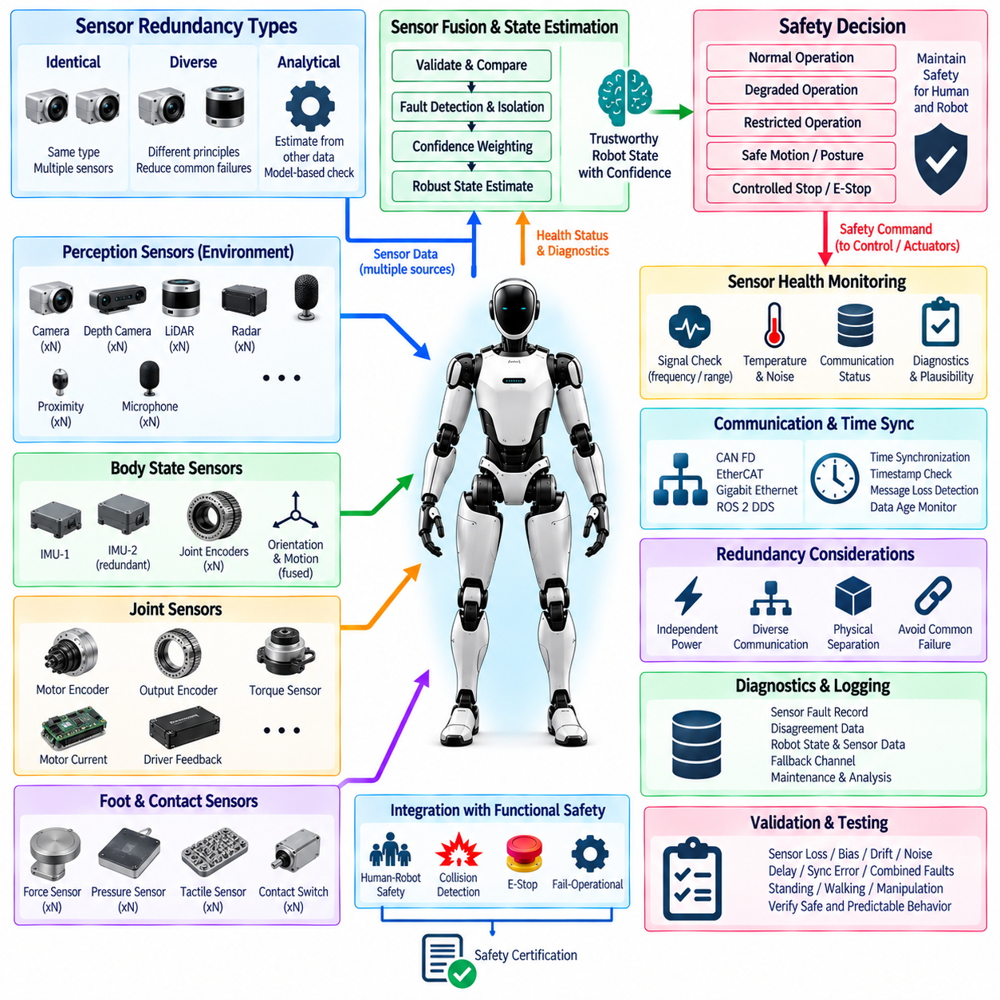
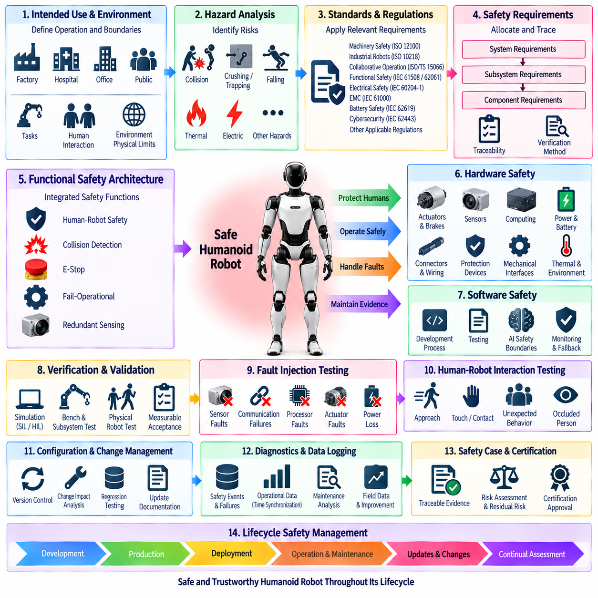

**Volume 21. Humanoid Electrical Architecture**

# Chapter 12. Functional Safety

## 12.01. Human Robot Safety

{width="7.268055555555556in" height="7.268055555555556in"}

A humanoid robot designed to operate around people must treat human safety as a system-level electrical and control requirement rather than as a single protective function. The safety architecture should continuously evaluate whether commanded motion, actuator state, sensing information, and environmental conditions remain within defined safe limits. This requires coordinated behavior between the power architecture, joint modules, perception system, real-time controller, communication network, and emergency functions. Human-robot safety therefore becomes an architectural layer spanning the complete humanoid rather than an isolated subsystem.

Human presence should be considered a primary operating condition for a humanoid robot because physical interaction can occur intentionally or unexpectedly. The robot should detect people, estimate their relative position and motion, and adapt its behavior before hazardous contact occurs. Safety decisions should consider not only distance but also robot velocity, joint motion, actuator torque, payload, posture, and the direction of movement. A slow arm moving toward a person may require a different response from a high-energy leg or torso movement, even when the measured distance is identical.

The electrical architecture should provide independent paths for safety-critical information and control where practical. Normal application software may generate motion commands, but safety-related functions should have the ability to limit, inhibit, or remove hazardous motion when abnormal conditions are detected. This separation reduces dependence on a single processor, software process, communication channel, or perception algorithm. The architecture should define which components are responsible for detection, decision, command limitation, power removal, and recovery so that safety behavior remains deterministic when normal control functions fail.

Human detection should combine multiple sensing mechanisms according to the operating environment and required safety performance. Cameras and three-dimensional perception systems can provide rich information about human position and posture, while additional proximity or ranging sensors can provide complementary detection capability. The humanoid should not assume that a single perception source is always available or correct. Occlusion, lighting changes, reflective surfaces, sensor contamination, communication faults, and processing delays must be treated as possible conditions that can reduce confidence in the perceived environment.

Safety decisions should also account for the physical characteristics of humanoid motion. Each joint can generate different levels of mechanical energy depending on its position, speed, torque, and load. Arms and hands may interact directly with people during manipulation, while legs and the torso can create larger hazards through whole-body motion or loss of balance. The control architecture should therefore support motion constraints such as reduced velocity, torque limitation, workspace restriction, controlled stopping, and safe posture transitions. These limits should be coordinated across joints rather than applied independently.

The safety controller should monitor the validity of critical signals before allowing normal operation to continue. Sensor data should include health information such as communication status, update rate, plausibility, timestamp validity, and operating range. Actuator feedback should similarly be checked for encoder consistency, torque-sensor behavior, motor-driver status, and unexpected motion. When a critical signal becomes invalid, the robot should transition to a predefined safe state instead of continuing with stale or uncertain information. Safety monitoring should therefore evaluate both physical conditions and the integrity of the information used for control.

Communication architecture is also part of human-robot safety because delayed or corrupted information can produce hazardous behavior even when individual components remain functional. Safety-relevant messages should have defined timing requirements, supervision mechanisms, and failure responses. The CAN FD, EtherCAT, Gigabit Ethernet, and ROS 2 DDS layers identified elsewhere in the architecture should not all be treated as equivalent from a safety perspective. The system should clearly distinguish deterministic control paths, high-bandwidth perception paths, and higher-level information paths, with appropriate monitoring and timeout behavior for each.

Power management must support the safety strategy established by the control architecture. A safety event may require the robot to stop motion without unnecessarily removing power from every electrical subsystem. For example, perception and diagnostic functions may need to remain active while actuator torque is disabled. The power distribution architecture should therefore define controlled shutdown paths, actuator power isolation, braking behavior, and recovery conditions. The relationship between the 48 V or 72 V main supply, local joint power stages, motor drivers, brakes, and safety control circuits should be designed so that a single electrical fault does not create uncontrolled motion.

A human-robot safety function should also define the behavior of the robot after a hazardous condition has been detected. Stopping is not always equivalent to immediately removing all power. Depending on the robot posture and physical situation, an uncontrolled power loss could create another hazard through falling, gravity-driven motion, or loss of braking capability. The safety architecture should therefore distinguish between controlled stop, torque inhibition, brake application, actuator power removal, and complete emergency shutdown. The appropriate response should depend on the detected fault and the associated risk.

Safety monitoring should be coordinated with the collision detection, emergency stop, fail-operational, and redundant-sensor functions defined in the remaining sections of Chapter 12. Human-robot safety establishes the overall protection objective, while collision detection provides detailed detection mechanisms, E-stop provides a direct emergency intervention path, fail-operational design addresses continued safe operation after selected failures, and redundant sensing improves confidence in critical observations. These functions should share clearly defined interfaces and state transitions so that the robot does not respond inconsistently when multiple safety conditions occur simultaneously.

The safety architecture should support graded responses rather than treating every abnormal condition as an identical emergency. A low-confidence perception condition may first require reduced speed or restricted workspace, while confirmed human intrusion into a hazardous region may require immediate motion inhibition. A severe actuator or controller failure may require a stronger response involving power isolation or braking. This graduated strategy can preserve useful operation while maintaining safety, provided that the transition thresholds and recovery conditions are explicitly defined and validated.

Finally, human-robot safety should be verified at the complete-system level rather than only through individual component tests. Validation should include normal operation, human approach, unexpected human movement, sensor degradation, communication loss, actuator faults, processor faults, power disturbances, and combinations of failures. The results should demonstrate that the humanoid detects unsafe conditions within the required time, applies the intended protective response, and prevents uncontrolled hazardous motion. This system-level evidence provides the foundation for the collision detection, E-stop, fail-operational, redundant-sensor, and safety-certification activities that follow in the functional safety architecture.

## 12.02. Collision Detection

{width="7.268055555555556in" height="7.268055555555556in"}

Collision detection in a humanoid robot should provide a continuous mechanism for identifying unexpected physical contact or an imminent collision and converting that information into an appropriate protective response. Because a humanoid has many independently controlled joints and can interact with people through its arms, hands, torso, and legs, collision detection must operate across the complete body. It should combine environmental perception, actuator feedback, motion state, and safety control rather than depending on a single sensor or algorithm.

A practical collision detection architecture should distinguish between pre-contact collision prediction and post-contact collision detection. Pre-contact detection uses cameras, LiDAR, depth sensors, proximity sensors, and other perception sources to identify objects or people entering a hazardous region. Post-contact detection uses joint torque, motor current, position error, acceleration, force, or tactile information to identify physical interaction that was not expected by the motion controller. Combining both mechanisms allows the robot to respond before contact when possible and to detect contact rapidly when prediction is insufficient.

Environmental perception provides the first layer of collision awareness. The perception system should estimate the position, velocity, and approximate geometry of nearby humans and objects while considering sensor latency and uncertainty. Camera and depth information can identify complex objects, while LiDAR or proximity sensing can provide complementary distance measurements. The collision detection system should continuously evaluate whether predicted trajectories intersect with protected robot or human spaces. Sensor availability, confidence, update rate, and communication status should also be monitored because invalid perception data can directly affect safety decisions.

The robot body should be represented by collision models that correspond to physically meaningful regions such as the head, torso, upper arms, forearms, hands, thighs, lower legs, and feet. These models can use simplified geometric volumes for real-time computation while maintaining sufficient coverage around mechanically hazardous structures. The collision model should account for the current joint configuration and should move with the robot\'s kinematic state. Safety margins should be increased when uncertainty, velocity, or stopping distance increases so that the robot does not rely on an unrealistically precise geometric boundary.

Motion prediction is important because collision risk depends not only on current distance but also on future movement. The system should estimate the robot\'s expected trajectory from joint position, velocity, acceleration, and commanded motion while considering the dynamic behavior of the actuator system. Human motion can also be estimated when sufficient perception information is available. A collision warning should therefore be generated when the predicted separation becomes smaller than the required safety margin, rather than waiting until the physical distance reaches zero.

Actuator feedback provides a second and complementary collision detection mechanism. During normal operation, the controller has an expected relationship between commanded torque, measured torque, motor current, joint position, and motion response. Unexpected contact can disturb this relationship and create a measurable deviation. A joint torque sensor, motor current estimate, encoder response, or position tracking error can therefore be used to identify abnormal interaction. The detection threshold should account for normal control error, friction, gravity compensation, payload variation, and dynamic acceleration so that normal motion is not incorrectly classified as a collision.

Collision detection should also operate at the individual joint and whole-body levels. A local joint controller can detect abnormal torque or motion at high speed and immediately limit the affected actuator. At the same time, the central safety controller should evaluate whether the event could affect the complete body or create a secondary hazard. For example, an unexpected force at the wrist may require only local torque reduction, while a collision involving the leg or torso may require coordinated whole-body stabilization. Local and global responses should therefore be connected through clearly defined safety states.

The response to a detected collision should be proportional to the estimated severity and confidence of the event. A low-risk proximity condition may require reduced velocity or restricted workspace, while a confirmed physical collision may require rapid torque limitation or controlled stopping. If continued motion could increase the hazard, the affected actuator should be inhibited and braking may be applied where appropriate. Complete power removal should be reserved for conditions where it is necessary and safe, because uncontrolled loss of actuator or brake power can itself create mechanical hazards.

Collision detection must be integrated with the humanoid\'s communication and real-time control architecture. High-speed actuator feedback should reach the relevant safety controller within a bounded time, while perception information must carry valid timestamps so that stale observations are not interpreted as current conditions. CAN FD and EtherCAT can support lower-level control and actuator information, while Gigabit Ethernet and ROS 2 DDS can support higher-bandwidth perception and system-level data exchange. Safety decisions should include timeout and communication-fault handling rather than assuming that every message will arrive correctly.

False positives and false negatives are both important design concerns. Excessive sensitivity can cause unnecessary protective stops, reducing robot availability and making interaction difficult, while insufficient sensitivity can allow dangerous contact to continue. Detection thresholds should therefore be calibrated using representative operating conditions, including different payloads, joint speeds, postures, and human interaction scenarios. Sensor fusion can improve confidence by requiring agreement between independent information sources or by assigning different levels of trust according to the operating condition.

Collision events should be recorded with sufficient information to support diagnostics and safety validation. Relevant data may include joint positions, velocities, commanded and measured torque, motor current, sensor status, detected object position, collision confidence, communication state, and the safety response that was activated. Time synchronization is particularly important because collision analysis requires the relationship between perception, control commands, actuator feedback, and protective response. These records can later support fault analysis, calibration, system improvement, and certification evidence.

Finally, collision detection should be validated as part of the complete functional safety architecture rather than as an isolated software feature. Testing should cover predicted human approach, unexpected contact, different body regions, sensor degradation, communication delays, actuator abnormalities, payload changes, and simultaneous faults. The validation process should demonstrate that the system detects hazardous conditions within the required response time, applies the intended motion or torque limitation, and reaches a safe state without introducing a secondary hazard. Collision detection should therefore serve as a direct bridge between perception, real-time control, actuator behavior, and the E-stop, fail-operational, redundant-sensor, and safety-certification functions defined elsewhere in Chapter 12.

## 12.03. E-Stop

{width="7.268055555555556in" height="7.268055555555556in"}

An emergency stop (E-stop) system provides a dedicated protective function that can rapidly bring a humanoid robot into a defined safe state when continued operation could create an unacceptable hazard. Because the humanoid can generate mechanical energy through many coordinated joints, the E-stop architecture should not be treated as a simple power switch. It must define how motion commands are inhibited, actuator torque is controlled, braking is applied, and electrical power is isolated when necessary.

The E-stop function should operate independently of normal application-level control as far as practical. A motion planner, AI computer, or ROS 2 application may request normal movement, but these systems should not be able to prevent an emergency stop from taking effect. The safety path should have a clearly defined mechanism for detecting an E-stop request and transferring the robot from normal operation to a protected state. This separation reduces dependence on complex software and improves predictable behavior during faults.

E-stop activation can originate from several sources depending on the operating environment. A physical emergency button may be located on the robot body, while an external safety station, operator control device, protective interface, or safety monitoring system may provide additional activation paths. Collision detection, severe actuator faults, loss of critical sensing, or other safety functions may also request an emergency response. The architecture should define which conditions directly activate the E-stop function and which conditions instead initiate a controlled safety stop.

The E-stop signal path should be designed so that a single communication or processing failure does not prevent the protective action. Safety-related signaling should therefore use an appropriate electrical or hardware-based path where required, with monitoring of signal continuity and validity. The relationship between the E-stop input, safety controller, actuator enable signals, motor drivers, brakes, and power distribution system should be explicitly defined. The resulting architecture should remain understandable and testable even when normal communication networks are unavailable.

The stopping strategy should reflect the physical characteristics of humanoid motion. Immediately removing all actuator power may stop commanded torque but can also create uncontrolled gravity-driven movement, loss of balance, or loss of braking capability. The safety architecture should therefore distinguish between controlled stopping, torque inhibition, brake application, actuator power isolation, and complete system shutdown. The selected response should depend on the hazard, robot posture, actuator state, and potential consequences of removing energy.

The E-stop system should coordinate with the real-time control and actuator architecture so that hazardous motion is reduced within a defined response time. Joint controllers should recognize the safety state and prevent further motion commands from being executed. Where appropriate, torque limits should be reduced before or during the stopping process, followed by controlled braking or power isolation. The system should also prevent an application controller from automatically restarting motion while the emergency condition remains active.

Power architecture is closely connected to E-stop behavior. The humanoid may use a 48 V or 72 V main electrical system with distributed power to joint modules, motor drivers, computing units, sensors, and other subsystems. An E-stop event should define which power domains remain active and which are disconnected. Perception, diagnostics, communication, or safety monitoring may need to remain powered after actuator energy is removed so that the robot can report its state and support safe recovery.

The E-stop function should also be integrated with the communication architecture described elsewhere in the humanoid design. CAN FD and EtherCAT may carry actuator and control information, while Gigabit Ethernet and ROS 2 DDS may support higher-level data exchange. However, an E-stop should not depend exclusively on ordinary application messages when loss of that network could prevent the safety response. Communication status should be monitored, and network failure should produce a predefined safe behavior rather than an ambiguous state.

After activation, the robot should remain in a clearly defined emergency state until the conditions for reset have been satisfied. Reset should not automatically mean immediate return to motion. The system should verify that the E-stop input has been released, the original hazard has been removed, critical sensors and actuators are healthy, communication paths are valid, and the robot is in an acceptable state for restart. A deliberate restart sequence should then require appropriate authorization before normal motion can resume.

E-stop performance should be monitored and recorded for diagnostics and validation. The system should capture the activation source, activation time, robot state, joint positions and velocities, actuator conditions, power state, communication status, and the resulting safety response. Time synchronization is important because the analysis must establish the sequence between the E-stop request, controller reaction, actuator response, braking, and final safe state. These records can support fault investigation, maintenance, safety testing, and certification evidence.

The E-stop architecture should support testing at the component, subsystem, and complete humanoid levels. Tests should include physical button activation, external activation, communication loss, processor faults, actuator faults, unexpected motion, different robot postures, and power disturbances. Verification should demonstrate that the emergency request is detected within the required time, hazardous motion is appropriately inhibited, and the resulting stop does not introduce a secondary hazard such as uncontrolled falling or unexpected actuator movement.

Finally, E-stop should form a central protective function within the Chapter 12 functional safety architecture, complementing human-robot safety, collision detection, fail-operational behavior, redundant sensing, and safety certification. Human-robot safety establishes the overall protection objective, while collision detection can identify developing hazards and request an appropriate response. E-stop provides a direct emergency intervention mechanism when continued operation is unacceptable. Its effectiveness therefore depends on coordinated electrical, control, actuator, communication, power, diagnostic, and validation design across the complete humanoid system.

## 12.04. Fail Operational

{width="7.268055555555556in" height="7.268055555555556in"}

Fail-operational design allows a humanoid robot to maintain a controlled and acceptably safe level of operation after selected faults occur, rather than immediately transitioning every failure into complete shutdown. This capability is particularly important for humanoids because sudden loss of control can itself create hazards such as falling, dropping an object, collapsing onto a person, or losing support torque. The architecture must therefore determine which functions may continue, which must be degraded, and which must be disabled after each relevant fault.

A fail-operational strategy should begin with explicit identification of safety-critical functions and their required availability. Balance control, joint stabilization, braking, perception, safety monitoring, communication, and power management may have different continuity requirements. A failure affecting a noncritical application should not necessarily remove essential stabilization functions. The system architecture should therefore separate mission functionality from minimum functions required to maintain a stable robot, protect nearby people, and reach an appropriate safe condition.

Fail-operational behavior differs from simple fault tolerance because continued operation must remain bounded by a defined safety objective. The robot should not continue normal performance merely because redundant hardware remains available. Instead, the safety controller should evaluate the detected fault, remaining system capability, robot posture, environment, and current task before selecting an operating mode. Possible responses include normal continuation, degraded operation, reduced motion, restricted functionality, controlled retreat, safe posture transition, or eventual shutdown.

Redundancy provides an important foundation for fail-operational capability. Critical sensing, computing, communication, and power functions can use redundant channels when the safety analysis demonstrates that continued availability is required. Redundancy may involve duplicated sensors, independent processing paths, alternative communication links, separate power domains, or redundant state estimation. However, duplicated components alone do not guarantee safety. The architecture must detect disagreement, identify the failed channel when possible, isolate its influence, and determine whether the remaining channel provides sufficient integrity for continued operation.

Computing architecture should support fault containment between normal AI processing, real-time motion control, and safety-critical supervision. A failure or overload in the AI computer should not automatically eliminate the real-time controller\'s ability to stabilize the humanoid. Similarly, failure of a higher-level planning process should permit lower-level controllers to maintain joint control or transition toward a safe posture. Independent watchdogs, health monitoring, execution supervision, and defined fallback software states can help prevent one computing failure from propagating across the complete control hierarchy.

Actuator faults require particular attention because humanoid stability depends on coordinated mechanical support. A failed arm joint may allow operation with restricted manipulation, while a hip, knee, or ankle failure can immediately affect balance. The safety system should evaluate joint position, torque, motor current, encoder validity, temperature, brake state, and driver health to determine remaining capability. Depending on the affected joint, the response may include torque reduction, joint locking, redistribution of support, reduced velocity, modified gait, controlled kneeling, or transition to a stable stationary posture.

Perception degradation should also produce defined fail-operational behavior. Loss of one camera or ranging sensor does not always require immediate shutdown if independent sensing still provides sufficient environmental awareness. The system should evaluate sensor health, field-of-view coverage, confidence, synchronization, and consistency before deciding whether continued operation is acceptable. When perception capability decreases, operating limits should become more conservative through reduced speed, larger safety margins, restricted workspace, or prohibition of tasks requiring unavailable sensing.

Communication failures must be contained according to the importance of the affected data path. Loss of ROS 2 DDS or a high-level Ethernet connection may permit local stabilization and safety control to continue, while loss of a deterministic actuator network may require a much stronger response. CAN FD, EtherCAT, Gigabit Ethernet, and higher-level communication channels should therefore have defined timeout, fault detection, and fallback behavior. Local controllers should know what state to enter when commands disappear rather than continuing indefinitely with stale information.

Power architecture is another essential element of fail-operational design. A humanoid may contain multiple power domains serving actuators, computers, perception devices, communications, brakes, and safety electronics. Selected failures should be isolated so that a fault in one branch does not unnecessarily collapse the complete robot. Power distribution units, protection devices, DC-DC converters, battery monitoring, and local power switches can support selective isolation. Critical safety and stabilization functions may require protected power long enough to complete a controlled transition.

The transition between operating modes should be deterministic and observable. When a fault is detected, the safety controller should classify the condition and determine the remaining capability before issuing restrictions to motion, power, communication, or application functions. Other controllers should receive a consistent system safety state so that different subsystems do not make contradictory decisions. State transitions such as Normal, Degraded, Restricted, Safe Motion, Safe Posture, and Shutdown can provide a structured mechanism for coordinating whole-body behavior after faults.

Recovery from a fail-operational state should be controlled as carefully as entry into that state. Temporary communication disturbances or recoverable sensor faults may disappear, but automatic restoration of full performance can create unexpected motion or repeatedly switch the robot between operating modes. The system should verify fault clearance, component health, communication stability, sensor validity, and robot posture before increasing capability. Safety-critical faults may require operator acknowledgement, diagnostic confirmation, or maintenance before normal operation is permitted again.

Fail-operational events should be logged with synchronized information from the complete system. Relevant records include the initiating fault, affected component, health status, robot posture, joint states, remaining sensor availability, communication condition, power state, selected fallback mode, and subsequent safety actions. These records allow engineers to reconstruct whether fault detection, isolation, degradation, and recovery occurred in the intended sequence. They also provide evidence for reliability analysis, maintenance, software improvement, validation, and eventual safety certification.

Validation should include individual faults as well as combinations that challenge the redundancy assumptions. Tests can examine sensor loss, processor failure, communication interruption, actuator degradation, power-domain faults, thermal conditions, and failures occurring during standing, walking, manipulation, or human interaction. The objective is not simply to prove that the robot remains powered, but to demonstrate that remaining functionality is sufficient, predictable, and safe. The robot should either continue within validated degraded limits or transition to a safer state before residual capability becomes inadequate.

Within the Chapter 12 functional safety structure, fail-operational design connects human-robot safety, collision detection, E-stop, redundant sensors, and safety certification into a coordinated fault-response strategy. Collision detection and health monitoring identify hazardous or abnormal conditions, redundancy preserves selected capabilities, and E-stop remains available when continued operation is no longer acceptable. Fail-operational architecture therefore provides the controlled middle ground between unrestricted normal operation and complete shutdown, allowing the humanoid to preserve stability and human safety while responding intelligently to faults.

## 12.05. Redundant Sensors

{width="7.268055555555556in" height="7.268055555555556in"}

Redundant sensing in a humanoid robot provides continued awareness of the robot and its environment when individual sensors become unavailable, inaccurate, or inconsistent. Because balance, collision avoidance, manipulation, and human interaction depend on trustworthy measurements, a single sensor failure should not automatically produce an unsafe loss of information. The architecture should combine physical redundancy, diverse sensing principles, health monitoring, and fault-aware data fusion so that critical state information remains available with known confidence.

Sensor redundancy should be determined by the safety importance of the information being measured rather than by simply duplicating every device. Joint position, body orientation, contact force, human proximity, actuator torque, and environmental geometry can have different integrity and availability requirements. Safety analysis should identify which measurements require independent backup channels, which can tolerate temporary degradation, and which failures require restricted operation or transition to a safe state.

Redundancy can be implemented through identical, diverse, or analytical sensing channels. Identical redundancy uses multiple sensors of the same type, while diverse redundancy combines different physical measurement principles to reduce common failure mechanisms. Analytical redundancy derives an independent estimate from other available information, such as comparing encoder motion with motor response or estimating body motion from multiple inertial and kinematic sources. These approaches can be combined according to the required safety integrity and practical packaging constraints.

Joint sensing is particularly important because humanoid motion depends on accurate knowledge of many articulated degrees of freedom. A joint module may use motor-side and output-side encoders, torque sensing, motor current, and driver feedback to provide complementary information about position and mechanical loading. Differences between these measurements can reveal encoder faults, transmission problems, unexpected contact, or actuator abnormalities. Critical joints associated with balance may require stronger redundancy than joints used primarily for nonessential manipulation.

Body-state estimation should combine information from multiple inertial and kinematic sources. An inertial measurement unit can provide angular velocity and acceleration, while joint encoders, foot contact sensors, force measurements, and other references contribute information about posture and motion. A second IMU or independently located inertial source can improve availability and enable cross-checking. The estimator should continuously evaluate whether measurements agree within expected physical limits rather than assuming that every sensor remains correct.

Foot and contact sensing require redundancy because stable standing and walking depend on reliable knowledge of support conditions. Force sensors, pressure elements, joint torque measurements, and kinematic estimates can provide complementary evidence about whether a foot is supporting the robot or losing contact. If one measurement becomes unreliable, the controller may continue using remaining information with increased uncertainty. The safety system should reduce gait aggressiveness or transition toward a stable posture when confidence in ground contact becomes insufficient.

Environmental perception should also use overlapping sensing capabilities where human safety depends on reliable obstacle detection. Cameras, depth cameras, LiDAR, radar, and proximity sensors provide different strengths and failure characteristics. Cameras may be affected by illumination, while depth or ranging sensors can encounter reflective, transparent, or geometrically difficult surfaces. Combining diverse modalities can reduce dependence on one sensing principle and provide cross-checking when people or obstacles enter safety-critical regions around the robot.

Redundant sensors are useful only when the system can detect that one channel has become unreliable. Sensor health monitoring should therefore evaluate communication status, update frequency, timestamps, measurement range, internal diagnostics, noise characteristics, temperature, and plausibility against other sensors or physical models. A sensor that continues transmitting incorrect values can be more difficult to manage than a sensor that stops communicating completely. Fault detection must therefore address both missing information and plausible-looking but inconsistent information.

Data fusion should explicitly represent sensor validity and confidence. When redundant measurements agree, the estimator can operate with high confidence, while disagreement should trigger comparison, isolation, or degradation logic. The system should avoid blindly averaging measurements when one channel may be faulty. Depending on the architecture, voting, residual analysis, consistency checks, model-based estimation, or confidence weighting can determine which information remains usable. The resulting state estimate should include sufficient quality information for safety-related decision making.

Common-cause failures must be considered because two nominally redundant sensors may fail simultaneously when they share the same vulnerability. Sensors connected to the same power rail, communication bus, connector, processor, clock, mounting structure, or environmental exposure may not provide true independence. The architecture should therefore examine power separation, communication diversity, physical placement, synchronization sources, and environmental dependencies. Diversity is most valuable when it reduces the probability that one fault mechanism invalidates all sensing channels at the same time.

Communication and time synchronization are essential to redundant sensing. Measurements from CAN FD, EtherCAT, Gigabit Ethernet, or ROS 2 DDS paths may arrive with different latency and timing characteristics. Comparing signals without reliable timestamps can create false disagreement even when the sensors themselves are functioning correctly. The architecture should maintain synchronized timing, detect stale data, supervise message loss, and define maximum acceptable age for safety-relevant measurements before they are excluded from estimation or control.

Sensor failure should produce a controlled change in robot capability. If sufficient independent information remains available, the humanoid may continue normal or degraded operation. Reduced confidence can require lower speed, larger collision margins, restricted manipulation, simplified gait, or prohibition of particular tasks. When the remaining sensing capability cannot support safe stabilization or human protection, the system should transition to safe motion, a stable posture, controlled stop, or E-stop according to the severity of the condition.

Redundant sensing should be integrated with diagnostics and event logging so that faults can be reconstructed and maintained effectively. Records should capture the affected sensor, disagreement or failure signature, timestamps, associated measurements, estimator confidence, robot state, selected fallback channel, and resulting safety response. Long-term analysis can identify intermittent connectors, thermal drift, calibration degradation, communication problems, or recurring sensor faults that may not be obvious from a single operating event.

Validation should intentionally introduce sensor faults rather than testing redundancy only under normal conditions. Tests should include complete sensor loss, frozen values, bias, drift, noise increase, delayed messages, synchronization errors, inconsistent redundant channels, power interruption, and combined failures. These scenarios should be exercised during standing, walking, manipulation, collision avoidance, and human interaction. Validation must demonstrate that faults are detected, unreliable channels are isolated, and remaining sensing capability supports the intended degraded or safe behavior.

Within the Chapter 12 functional safety architecture, redundant sensors provide the information resilience required by human-robot safety, collision detection, E-stop decisions, and fail-operational control. Redundancy preserves critical observations after selected failures, while health monitoring and sensor fusion determine whether remaining information can still be trusted. When sufficient integrity remains, the humanoid can degrade gracefully; when it does not, the safety architecture must restrict or stop operation. Redundant sensing therefore connects perception reliability directly to controlled fault response and safety certification.

## 12.06. Safety Certification

{width="7.268055555555556in" height="7.268055555555556in"}

Safety certification for a humanoid robot should be treated as a lifecycle engineering process that demonstrates whether the complete system satisfies defined safety objectives under intended operation and foreseeable fault conditions. Certification is not achieved by adding protective functions after development. Safety requirements, architecture, implementation, verification, validation, documentation, and configuration evidence must be developed together so that every important safety claim can be traced to objective engineering evidence.

The certification process should begin by defining the robot\'s intended use, operating environment, interaction with humans, expected tasks, physical limits, and reasonably foreseeable misuse. A humanoid operating in an isolated laboratory presents different risks from one working beside people in a factory, hospital, office, or public environment. These operational assumptions establish the boundary of the safety case and determine which hazards, operating modes, environmental conditions, and human interactions must be evaluated.

Hazard analysis should identify situations in which robot behavior, stored energy, electrical faults, software errors, sensing failures, or unexpected human interaction could cause harm. Relevant hazards include collision, crushing, trapping, falling, dropped objects, excessive joint force, uncontrolled motion, thermal events, electrical faults, communication loss, and loss of balance. Each hazard should be associated with risk-reduction measures and with safety requirements that can later be verified through analysis, inspection, simulation, or physical testing.

Applicable standards and regulatory requirements should be identified according to the humanoid\'s product category, market, environment, and intended function. A certification strategy may need to consider machinery safety principles, industrial robot requirements, collaborative operation, functional safety, electrical safety, electromagnetic compatibility, battery safety, cybersecurity, and application-specific regulations. The architecture should avoid assuming that one standard alone completely defines humanoid safety, because a general-purpose humanoid may combine characteristics traditionally addressed by several product categories.

Safety requirements should be allocated from system level to subsystems and components with clear traceability. A requirement such as preventing hazardous human contact may decompose into perception coverage, collision detection latency, maximum permitted motion, actuator torque limitation, stopping performance, communication supervision, and power isolation requirements. Each derived requirement should identify its responsible component, verification method, operating assumptions, and relationship to the original hazard so that certification evidence remains consistent as the design evolves.

The functional safety architecture should provide evidence that safety-related functions remain effective when faults occur. Human-robot safety, collision detection, E-stop, fail-operational behavior, and redundant sensing should therefore be evaluated as interacting safety mechanisms rather than independent features. Certification should examine fault detection, response time, diagnostic coverage, independence, redundancy, common-cause failures, degraded operating modes, and transitions to safe states. The objective is to demonstrate predictable system behavior when normal assumptions are violated.

Hardware safety evidence should address actuators, brakes, sensors, computing units, power distribution, batteries, connectors, wiring, protection devices, and mechanical interfaces. Component ratings alone are insufficient because system integration can introduce new failure mechanisms. Electrical protection, thermal behavior, grounding, insulation, overcurrent protection, power isolation, connector retention, and environmental robustness should be verified under representative conditions. Safety-critical components should have documented operating limits and defined responses when those limits are exceeded.

Software certification evidence should demonstrate disciplined development of safety-related control and monitoring functions. Requirements, architecture, interfaces, implementation, reviews, static analysis, unit tests, integration tests, and system tests should remain traceable. AI-based perception or planning introduces additional challenges because behavior may depend on training data and probabilistic outputs. Safety-critical protection should therefore define explicit boundaries around AI functions and provide deterministic monitoring or fallback mechanisms where uncertain AI behavior could otherwise create unacceptable risk.

Verification and validation should progressively move from components to subsystems and the complete humanoid. Simulation, software-in-the-loop, hardware-in-the-loop, bench testing, subsystem testing, and physical robot testing can provide complementary evidence. Tests should cover normal operation, boundary conditions, human interaction, sensor faults, actuator faults, communication failures, power disturbances, thermal conditions, E-stop activation, and degraded modes. Requirements should have measurable acceptance criteria so that test results provide objective evidence rather than subjective judgments.

Fault injection is particularly important for demonstrating functional safety behavior. Sensors can be disconnected, frozen, biased, delayed, or corrupted; communication paths can be interrupted; processors can be overloaded or reset; actuator feedback can be made inconsistent; and selected power domains can be removed. Combined faults should also be tested when the safety concept depends on redundancy. The purpose is to demonstrate that faults are detected, isolated where possible, and followed by the intended degraded operation, safe motion, safe posture, controlled stop, or emergency response.

Human-robot interaction testing should evaluate both expected cooperation and unexpected behavior. People may approach rapidly, enter a protected region, touch the robot, obstruct an arm, interfere with a walking path, or appear from an occluded area. Certification evidence should show that sensing coverage, collision prediction, force or torque limitation, stopping behavior, and protective functions remain adequate across representative postures and motions. Testing should consider the robot\'s complete body rather than focusing only on manipulators.

Safety certification also depends on configuration and change management. Hardware revisions, sensor replacements, firmware updates, calibration changes, neural-network updates, communication modifications, or control-parameter changes can invalidate previously collected evidence. The system should therefore maintain controlled versions of hardware, software, safety parameters, models, test procedures, and results. A defined impact-analysis process should determine whether each change requires regression testing, additional validation, or modification of the safety case before release.

Diagnostic and operational records should support both certification and post-deployment safety management. Logged information can include safety events, E-stop activations, sensor faults, actuator abnormalities, communication failures, power events, degraded-mode transitions, software versions, and maintenance actions. Accurate time synchronization allows events across perception, control, communication, and actuation to be reconstructed. Field data can then reveal failure patterns and support corrective action, preventive maintenance, and continued assessment of safety assumptions.

A structured safety case should connect hazards, safety goals, requirements, architecture, analyses, tests, and results into a coherent argument that the humanoid is acceptably safe for its defined use. Traceability is essential because reviewers must be able to move from a safety claim to the supporting design decision and verification evidence. Open issues, assumptions, limitations, and residual risks should be documented explicitly rather than hidden. Certification evidence should demonstrate not only that tests passed, but why those tests are sufficient for the claimed operating envelope.

Safety certification continues after initial product approval because humanoid platforms can evolve rapidly through software updates, new applications, additional sensors, modified payloads, and changing operating environments. A lifecycle process should therefore include production control, maintenance procedures, periodic inspection, incident analysis, software release governance, cybersecurity updates, and reassessment after significant changes. Safety becomes a maintained system property rather than a one-time certification event completed at the end of development.

Within the Chapter 12 functional safety architecture, safety certification consolidates the evidence produced by human-robot safety, collision detection, E-stop, fail-operational design, and redundant sensing. These functions provide protection, fault response, and information resilience, while certification establishes traceability from hazards to requirements and verified behavior. The resulting safety case should demonstrate that the humanoid can operate within defined limits, respond predictably to failures, protect nearby humans, and maintain documented evidence supporting safe deployment throughout its operational lifecycle.
