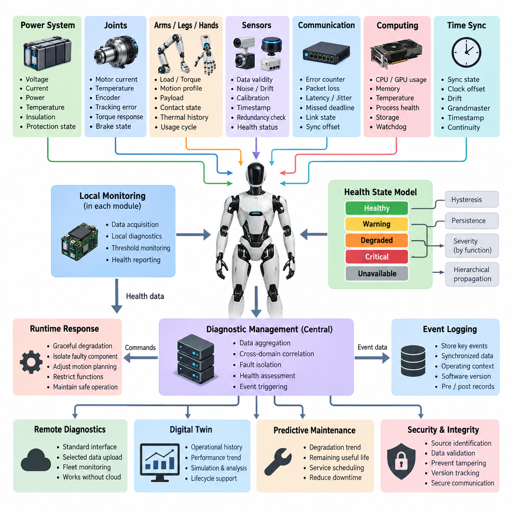
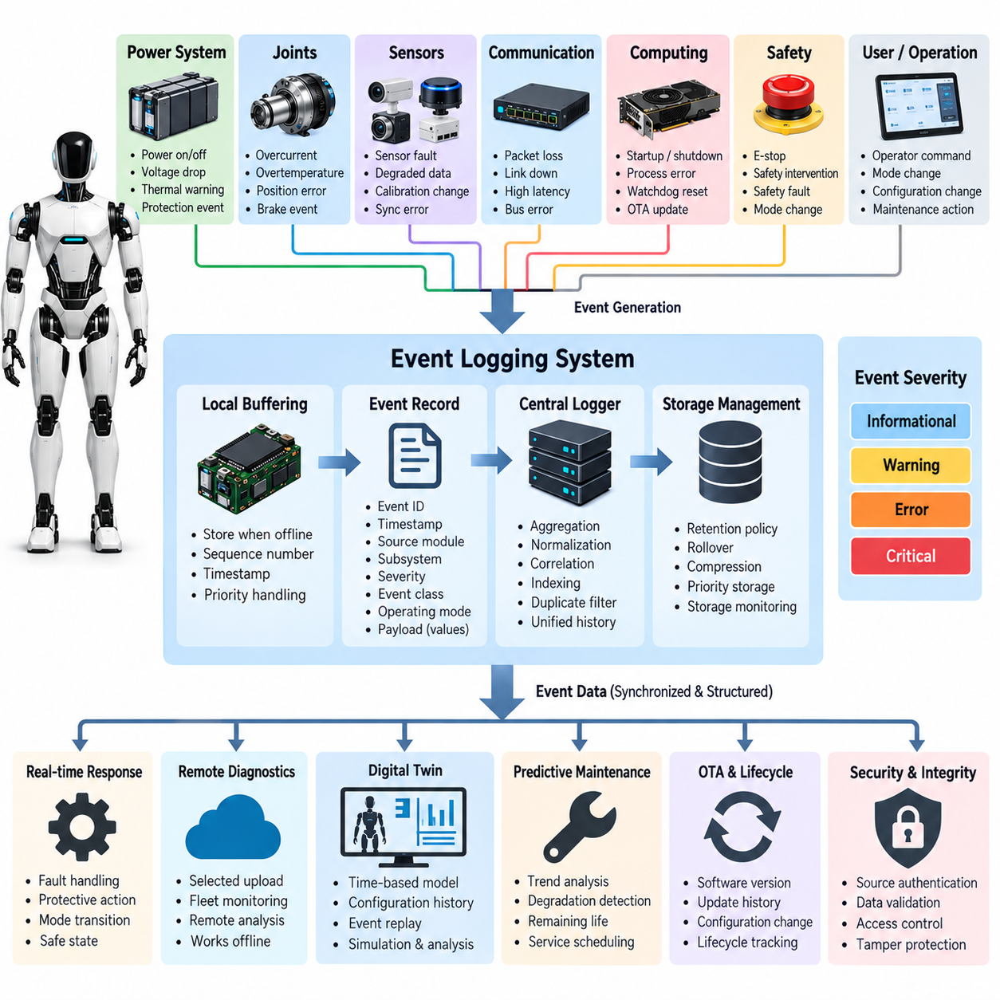
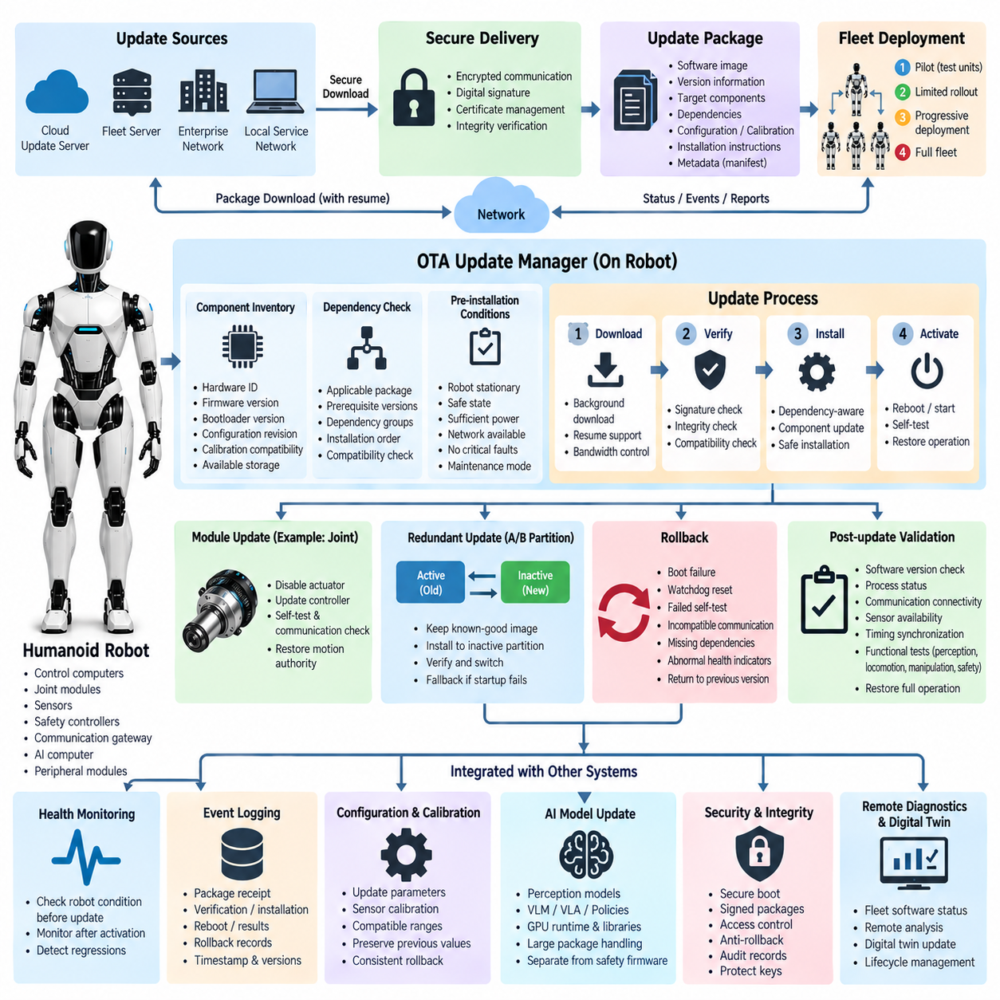
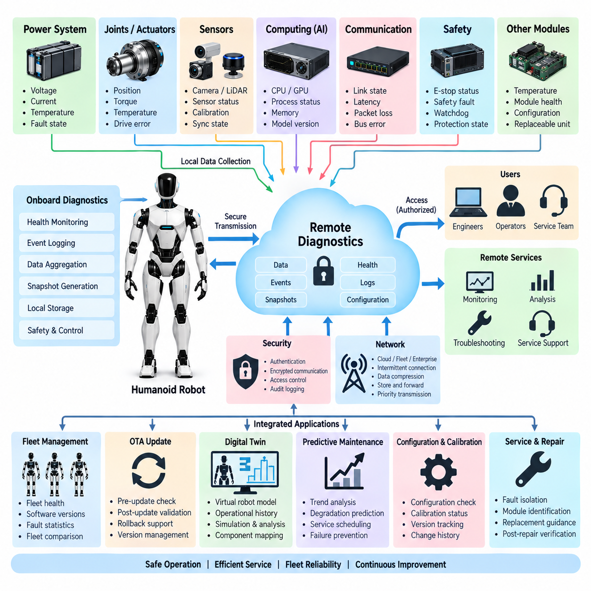
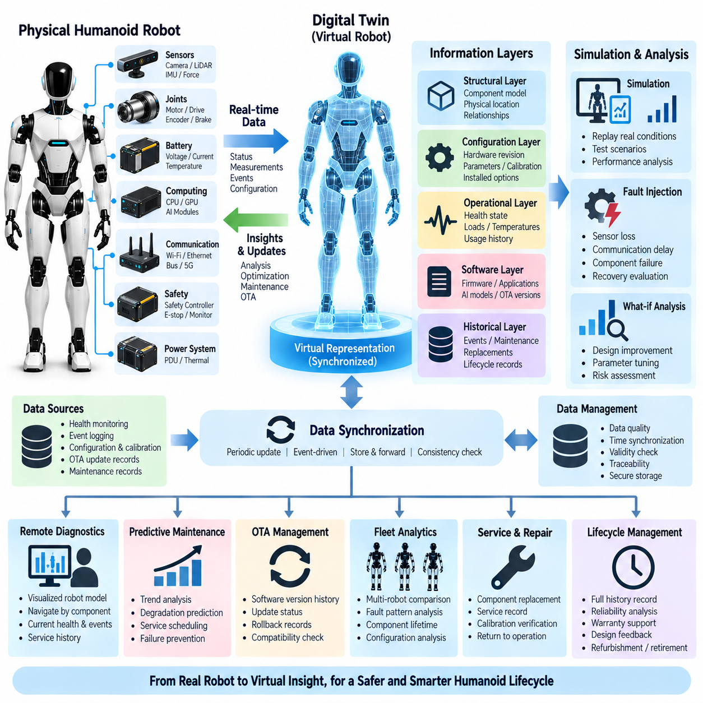
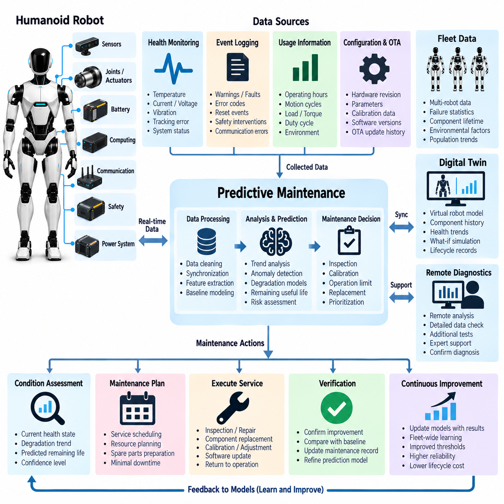

**Volume 21. Humanoid Electrical Architecture**

# Chapter 13. Diagnostics and OTA

## 13.01. Health Monitoring

{width="7.268055555555556in" height="7.268055555555556in"}

휴머노이드 로봇의 상태 모니터링(Health Monitoring)은 시스템이 안전하고 신뢰성 있게 계속 동작할 수 있는지를 판단하기 위해 전기적, 컴퓨팅, 기계적, 통신 및 센서 상태를 지속적으로 관찰하고 해석하는 과정이다. 단순히 부품이 고장 난 이후 반응하는 고장 검출기(Fault Detector)와 달리, 상태 모니터링 계층(Health-Monitoring Layer)은 로봇의 전체 수명주기 동안 주요 서브시스템(Subsystem)의 동작 여유도, 열화 추세, 비정상 동작 및 상태 신뢰도를 시스템 수준에서 지속적으로 관리한다.

휴머노이드는 관절(Joint), 팔(Arm), 다리(Leg), 손(Hand), 인지 장치(Perception Device), 전력 변환기(Power Converter), 통신 인터페이스(Communication Interface), 컴퓨팅 노드(Computing Node) 등 독립적으로 제어되는 다수의 모듈로 구성되므로 상태 모니터링 아키텍처(Health Monitoring Architecture)는 자연스럽게 분산 구조를 갖는다. 로컬 제어기(Local Controller)는 각 구성요소 가까이에서 상세 데이터를 수집하고, 상위 진단 서비스(Diagnostic Service)는 요약된 상태 정보를 통합한다.

전기적 상태(Electrical Health)는 전압(Voltage), 전류(Current), 전력(Power), 온도(Temperature), 절연 관련 상태 및 보호 상태를 지속적으로 감시하는 것에서 시작된다. 배터리 모듈(Battery Module), 전력 분배 장치(Power Distribution Unit), DC/DC 컨버터(DC/DC Converter), 모터 드라이브(Motor Drive), 로컬 전자 제어기는 순간 측정값뿐 아니라 누적 동작 통계도 보고해야 한다. 임계값은 정상 변동, 경고 영역, 출력 제한 운전(Derated Operation), 보호 정지가 필요한 상태를 구분하도록 설계해야 한다.

휴머노이드의 움직임은 다수 액추에이터(Actuator)의 협조 동작에 의존하기 때문에 관절 상태(Joint Health)는 특히 중요하다. 각 관절 제어기(Joint Controller)는 모터 전류, 권선 온도, 드라이버 온도, 엔코더 일관성(Encoder Consistency), 명령 위치와 측정 위치, 속도 추종 오차(Velocity Tracking Error), 토크 응답(Torque Response), 브레이크 상태 및 통신 품질을 감시할 수 있다. 추종 오차나 요구 전류가 서서히 증가한다면 관절이 완전히 고장 나기 전에 마찰, 기계적 마모, 정렬 변화 또는 액추에이터 열화를 식별할 수 있다.

팔, 다리 및 손의 상태 정보는 각각 서로 다른 작업 부하(Workload)를 고려하여 해석해야 한다. 다리 액추에이터(Leg Actuator)는 지지, 균형, 충격 및 보행과 관련된 반복적인 고부하를 경험하는 반면, 팔과 손 모듈은 매우 다양한 조작력과 반복적인 미세 운동을 수행한다. 따라서 상태 한계값(Health Limit)은 단순한 공통 고정 임계값에만 의존해서는 안 되며, 동작 모드, 명령 토크, 운동 프로파일(Motion Profile), 페이로드(Payload), 접촉 상태 및 열 이력(Thermal History)을 함께 고려해야 한다.

센서 상태 모니터링(Sensor Health Monitoring)은 센서가 단순히 데이터를 전송하는지를 확인하는 것을 넘어 인지 및 제어 데이터가 계속 신뢰할 수 있는지를 판단한다. 카메라(Camera), 라이다(LiDAR), 관성 측정 장치(IMU), 엔코더(Encoder), 힘 센서(Force Sensor), 촉각 배열(Tactile Array), 마이크(Microphone) 등은 샘플 누락, 값 고정, 포화(Saturation), 과도한 노이즈, 타임스탬프 오류, 캘리브레이션 드리프트(Calibration Drift), 비정상 범위 및 중복 정보와의 불일치를 기준으로 평가할 수 있다.

통신 상태(Communication Health)는 휴머노이드 아키텍처를 연결하는 이기종 네트워크(Heterogeneous Network) 전반에서 평가된다. CAN FD, EtherCAT, 기가비트 이더넷(Gigabit Ethernet), ROS 2 DDS 및 시간 동기화(Time Synchronization) 서비스는 오류 카운터, 패킷 손실(Packet Loss), 지연시간(Latency), 지터(Jitter), 데드라인 누락(Missed Deadline), 버스 사용률, 링크 상태, 동기화 오프셋(Synchronization Offset), 노드 가용성을 제공할 수 있다. 이를 통해 장치 자체의 고장과 정상 장치의 데이터 전달 문제를 구분할 수 있다.

컴퓨팅 상태(Compute Health)는 실시간 제어기(Real-Time Controller), 인공지능 컴퓨터(AI Computer), GPU 자원, 저장장치 및 운영체제 서비스를 포함한다. 주요 지표에는 CPU 및 GPU 사용률, 메모리 소비량, 열 상태, 클록 스로틀링(Clock Throttling), 프로세스 응답성, 저장공간, 입출력 오류, 워치독 상태(Watchdog Status), 실행 데드라인 위반 등이 포함된다. 높은 사용률 자체보다 지속적인 자원 포화(Resource Saturation)와 실시간 실행에 미치는 영향을 중심으로 상태를 판단해야 한다.

시간 동기화(Time Synchronization) 자체도 분산형 휴머노이드에서 하나의 감시 대상 자원이 된다. 운동 제어, 센서 융합(Sensor Fusion), 인지, 로깅(Logging), 이벤트 재구성(Event Reconstruction)은 모든 측정 데이터가 일관된 시간 기준에 연결되는 것을 전제로 한다. 따라서 진단 시스템은 동기화 상태, 클록 오프셋(Clock Offset), 드리프트(Drift), 그랜드마스터(Grandmaster) 가용성 및 타임스탬프 연속성을 감시해야 한다. 동기화가 상실되면 개별 센서와 컴퓨팅 노드가 정상적으로 데이터를 생성하더라도 제한 운전이 필요할 수 있다.

통합 상태 모델(Unified Health Model)은 서로 다른 종류의 측정 데이터를 이해하기 쉬운 서브시스템 상태로 변환한다. 실용적인 상태 표현은 정상(Healthy), 경고(Warning), 성능 저하(Degraded), 심각(Critical), 사용 불가(Unavailable) 상태를 구분하면서 동시에 원래의 측정값과 진단 근거를 유지할 수 있다. 짧은 과도현상으로 상태가 반복 변경되는 것을 방지하기 위해 상태 전이(State Transition)에는 히스테리시스(Hysteresis)와 지속성 판단 로직(Persistence Logic)이 포함되어야 한다.

상태 정보(Health Information)는 구성요소에서 모듈, 신체 영역(Body Region), 최종적으로 로봇 수준 감독기(Robot-Level Supervisor)로 상향 전파되어야 한다. 예를 들어 엔코더 이상(Encoder Anomaly)은 먼저 관절 상태에 영향을 주고, 이후 다리 가용성, 균형 제어 능력 및 전체 이동 상태에 영향을 줄 수 있다. 이러한 계층적 전파(Hierarchical Propagation)는 상위 컴퓨터가 모든 원시 진단 신호를 처리하지 않고도 중요한 로컬 문제가 제한되고 결정적인 응답 시간 내에 로봇 수준의 의사결정에 반영되도록 한다.

모니터링 아키텍처(Monitoring Architecture)는 상태를 단순히 정상 또는 고장으로 정의하기보다 점진적 성능 저하(Graceful Degradation)를 지원해야 한다. 중복 센싱(Redundant Sensing)이 남아 있다면 고장 채널을 격리하고 낮아진 신뢰도로 운전을 계속할 수 있다. 액추에이터가 열적으로 제한되면 동작 계획(Motion Planning)이 속도, 가속도 또는 토크 요구량을 감소시킬 수 있다. 인지 성능이 감소하면 내비게이션(Navigation)이나 조작 기능을 제한할 수 있으므로 상태 모니터링은 런타임 능력 관리(Runtime Capability Management)의 입력이 된다.

진단 신뢰도(Diagnostic Confidence)는 단일 임계값에 의존하지 않고 여러 지표를 상호 연관시킴으로써 향상될 수 있다. 모터 전류 증가가 추종 오차 및 온도 증가와 동시에 나타난다면 단일 측정값보다 관절 열화에 대한 강한 증거가 된다. 마찬가지로 인지 프레임 누락과 이더넷 패킷 손실이 함께 발생하면 네트워크 문제를 의심할 수 있으며, 링크가 정상인데 프레임만 누락된다면 센서 또는 소프트웨어 문제일 가능성이 높다. 이러한 영역 간 상관관계(Cross-Domain Correlation)는 오경보를 줄이고 고장 격리(Fault Isolation)를 가속한다.

이벤트 로깅(Event Logging)은 중요한 상태 전환 주변의 조건을 보존함으로써 연속 모니터링을 보완한다. 경고, 성능 저하, 리셋, 워치독 이벤트 또는 정지가 발생하면 시스템은 동기화된 측정값, 타임스탬프, 동작 모드, 소프트웨어 버전, 구성요소 식별자 및 상태 전환 전후의 관련 이벤트를 저장해야 한다. 이러한 정보는 현장 진단(Field Diagnosis)에 필요한 근거를 제공하며 이후 진단 아키텍처의 이벤트 로깅 및 원격 진단(Remote Diagnostics) 기능을 위한 기반이 된다.

상태 모니터링은 안전한 로봇 동작을 클라우드 연결(Cloud Connectivity)에 의존시키지 않으면서 원격 진단 및 플릿 수준 관찰(Fleet-Level Observation)을 위한 표준화된 인터페이스도 제공해야 한다. 필수적인 이상 검출, 분류 및 보호 대응은 로봇 내부에서 수행하고, 선택된 상태 요약과 진단 기록만 외부 서비스 시스템으로 전송할 수 있다. 이러한 분리를 통해 네트워크 장애 중에도 결정론적 로컬 동작(Deterministic Local Behavior)을 유지하면서 연결 가능 시 중앙 집중식 플릿 분석(Fleet Analytics)을 활용할 수 있다.

축적된 상태 이력(Health History)은 디지털 트윈(Digital Twin)과 예지 정비(Predictive Maintenance) 기능에도 중요한 데이터가 된다. 온도, 액추에이터 부하, 진동 관련 지표, 추종 성능, 통신 오류, 배터리 동작 및 구성요소 운전시간의 추세를 시간에 따라 각 물리 모듈과 연결할 수 있다. 고정된 정비 주기만 기다리는 대신 관찰된 열화 추세를 기반으로 검사 또는 교체가 더 일찍 필요한 구성요소를 식별할 수 있다.

진단 정보가 로봇 동작에 직접 영향을 줄 수 있으므로 보안(Security)과 무결성(Integrity) 역시 중요하다. 상태 메시지는 출처를 식별하고 일관된 타임스탬프를 유지하며 잘못 구성되거나 오래된 데이터를 거부하고 진단 상태 또는 임계값의 무단 변경을 방지해야 한다. 또한 기록된 상태 데이터에는 소프트웨어 및 설정 버전(Configuration Version)을 연결하여 예상하지 못한 동작을 펌웨어 변경, 파라미터 업데이트, 정비 작업 또는 무선 소프트웨어 업데이트(OTA Software Deployment)와 연관시킬 수 있어야 한다.

강건한 구현(Robust Implementation)을 위해서는 가능한 경우 모니터링 기능과 모니터링 대상 기능을 분리해야 한다. 독립 워치독(Independent Watchdog), 중복 관찰(Redundant Observation), 감독 제어기(Supervisory Controller), 교차 점검(Cross-Check)은 고장 난 애플리케이션이 스스로 정상이라고 보고하는 상황을 방지한다. 동시에 모니터링 자체가 과도한 연산 또는 네트워크 부하를 만들어서는 안 되므로 샘플링 주기, 진단 깊이, 데이터 보존 기간 및 보고 주기는 구성요소 동특성, 안전 중요도, 가용 대역폭 및 진단 가치에 따라 설계해야 한다.

궁극적으로 휴머노이드 상태 모니터링(Humanoid Health Monitoring)은 플랫폼 전체의 진단 및 무선 소프트웨어 업데이트(Diagnostics and OTA) 아키텍처를 구성하는 운영 기반이다. 이는 구성요소 수준의 측정값을 이벤트 로깅(Event Logging), 원격 진단(Remote Diagnostics), 디지털 트윈(Digital Twin), OTA 수명주기 정보(OTA Lifecycle Information), 예지 정비(Predictive Maintenance)와 연결한다. 원시 전기 및 소프트웨어 관측값을 신뢰할 수 있는 시스템 수준 상태로 지속적으로 변환함으로써 로봇은 열화를 조기에 탐지하고, 고장을 격리하며, 동작 능력을 조정하고, 서비스 작업을 지원하면서 전체 수명주기 동안 안전한 운전을 유지할 수 있다.

## 13.02. Event Logging [w/Code]

{width="7.268055555555556in" height="7.268055555555556in"}

휴머노이드 로봇의 이벤트 로깅(Event Logging)은 운용 중 발생하는 중요한 상태, 상태 전환, 고장, 명령 및 시스템 활동을 지속적으로 저장하고 시간적으로 연계된 기록을 제공한다. 상태 모니터링(Health Monitoring)이 구성요소의 현재 상태를 지속적으로 평가하는 반면, 이벤트 로깅은 이후 분석에 필요한 선택된 증거를 보존한다. 진단 및 무선 업데이트(Diagnostics and OTA) 아키텍처에서 이벤트 로깅은 실시간 관측 결과를 원격 진단(Remote Diagnostics), 디지털 트윈(Digital Twin), 유지보수 및 수명주기 관리(Lifecycle Management)와 연결하는 이력 계층(Historical Layer)을 구성한다.

이벤트(Event)는 로봇이 생성하는 모든 원시 측정값(Raw Measurement)이 아니라 의미 있는 변화를 나타내야 한다. 일반적인 이벤트에는 전원 상태 전환, 제어기 시작 및 종료, 액추에이터 고장, 센서 성능 저하, 통신 손실, 워치독 리셋(Watchdog Reset), 안전 개입, 열 경고, 동기화 실패, 소프트웨어 예외, 설정 변경 및 운영자 명령 등이 포함된다. 이벤트를 신중하게 선택하면 로깅 시스템이 가치가 낮은 데이터의 무제한 스트림으로 변하는 것을 방지하면서 중요한 상황을 재구성하는 데 필요한 정보를 유지할 수 있다.

유용한 이벤트 레코드(Event Record)는 표준화된 헤더(Standardized Header)와 상황별 진단 정보(Context-Specific Diagnostic Information)를 결합한다. 헤더에는 이벤트 식별자, 타임스탬프(Timestamp), 소스 모듈(Source Module), 서브시스템(Subsystem), 심각도(Severity), 이벤트 클래스(Event Class), 동작 모드 및 시퀀스 번호(Sequence Number)를 포함할 수 있다. 추가 페이로드(Payload) 필드에는 측정값, 임계값, 오류 카운터, 상태 전환 또는 관련 구성요소 식별자가 포함될 수 있다. 일관된 형식을 사용하면 관절, 센서, 전력 전자장치, 컴퓨터 및 통신 네트워크의 로그를 공통 진단 도구로 해석할 수 있다.

휴머노이드는 여러 분산 프로세스(Distributed Process)를 동시에 실행하기 때문에 정확한 타임스탬프가 매우 중요하다. 관절 제어기, 인지 컴퓨터(Perception Computer), 안전 제어기, 네트워크 장치 및 인공지능 프로세서(AI Processor)는 동일한 물리적 이벤트에서 서로 다른 증상을 관찰할 수 있다. 각 장치의 클록이 동기화된 시간 기준(Synchronized Time Base)을 공유하면 이러한 관측 결과를 정확한 순서로 배열하고 상호 연관시킬 수 있다. 따라서 PTP 기반 동기화와 로컬 단조 클록(Local Monotonic Clock)을 활용하면 최초 이상 발생부터 후속 시스템 대응과 보호 동작까지의 순서를 재구성할 수 있다.

이벤트 심각도(Event Severity)는 기록된 상태가 운용에 얼마나 중요한지를 나타내야 한다. 정보 이벤트(Informational Event)는 시작 또는 모드 변경과 같은 정상적인 상태 전환을 나타내며, 경고 이벤트(Warning Event)는 지속적인 관찰이 필요한 상태를 의미한다. 오류 또는 성능 저하 이벤트(Error or Degraded Event)는 기능 손실을 나타내고, 치명적 이벤트(Critical Event)는 즉각적인 보호 조치가 필요한 상태를 의미한다. 진단 소프트웨어가 개별 구성요소 구현을 모두 상세히 알지 않고도 이벤트 우선순위를 결정할 수 있도록 심각도 분류는 서브시스템 전체에서 일관되게 유지되어야 한다.

이벤트 소스(Event Source)는 로봇 전체에서 고유하게 식별할 수 있어야 한다. 소스 식별자(Source Identifier)는 특정 관절 제어기, 배터리 모듈, 모터 드라이브, 카메라, 라이다(LiDAR), 컴퓨팅 노드, 통신 인터페이스 또는 소프트웨어 프로세스를 나타낼 수 있다. 모듈형 휴머노이드(Modular Humanoid)에서는 물리적 위치와 교체 가능한 모듈 인스턴스(Module Instance)도 구분해야 한다. 이를 통해 반복적으로 발생하는 이벤트가 정비 이후에도 특정 구성요소를 따라 발생하는지, 아니면 특정 로봇 위치나 운용 조건에 계속 연관되는지를 판단할 수 있다.

분산 이벤트 생성(Distributed Event Generation)에서는 중앙 진단 컴퓨터와의 통신을 항상 보장할 수 없으므로 로컬 버퍼링(Local Buffering)이 필요하다. 관절 제어기 또는 센서 노드는 네트워크가 혼잡하거나 연결이 끊기거나 재시작되는 동안에도 중요한 이벤트를 일시적으로 보존할 수 있어야 한다. 시퀀스 번호와 타임스탬프를 사용하면 버퍼에 저장된 레코드를 이후에 원래 순서를 잃지 않고 통합할 수 있다. 로컬 메모리 또는 통신 대역폭이 제한될 경우 치명적 이벤트는 정보 이벤트보다 높은 보존 및 전송 우선순위를 가질 수 있다.

중앙 이벤트 로거(Central Event Logger)는 분산 모듈에서 생성된 레코드를 통합하고 일관된 운용 이력(Unified Operational History)을 유지한다. 이벤트 형식을 정규화하고, 타임스탬프를 검증하며, 관련 레코드를 연결하고, 불필요한 중복을 제거하며, 시간, 서브시스템, 심각도 또는 운용 상태에 따라 이벤트를 색인화(Indexing)할 수 있다. 중앙 통합이 로컬 로깅(Local Logging)을 대체하는 것은 아니다. 로컬 로그는 발생 지점 가까이에서 증거를 보존하고, 중앙 기록은 완전한 고장 재구성에 필요한 시스템 전체 관점을 제공한다.

트리거 이전 및 이후 데이터(Pre-Trigger and Post-Trigger Data)는 중요 이벤트의 진단 가치를 크게 높인다. 주요 고장이 발생하면 시스템은 트리거 직전 일정 시간 동안의 측정값과 상태를 포함하는 짧은 순환 버퍼(Rolling Buffer)를 보존하고, 이후에도 정의된 시간 동안 기록을 계속할 수 있다. 이를 통해 검출된 고장뿐 아니라 고장이 발생하기 전 형성된 조건과 이후 시스템의 대응을 함께 보여주는 진단 스냅샷(Diagnostic Snapshot)을 생성할 수 있으며, 간헐적 고장이나 연쇄 고장(Cascading Fault)을 더욱 쉽게 분석할 수 있다.

영역 간 상관관계(Cross-Domain Correlation)는 개별적으로 분리된 기록을 의미 있는 고장 발생 순서(Failure Sequence)로 변환한다. 예를 들어 전압 강하 이벤트(Voltage-Drop Event) 이후 모터 드라이브의 저전압 경고, 통신 중단, 관절 제어 오류 및 균형 제어기의 안전 상태 전환이 연속적으로 발생할 수 있다. 이러한 기록이 동기화되고 서로 연관되면 진단 소프트웨어는 각각의 후속 증상을 독립된 고장으로 처리하는 대신 전력 이상을 최초 원인 조건(Initiating Condition)으로 식별할 수 있다.

휴머노이드 로봇은 장기간 운용하면서 대량의 운용 데이터를 생성할 수 있으므로 저장공간 관리(Storage Management)가 필요하다. 로깅 아키텍처는 데이터 보존 기간(Retention Period), 최대 저장공간 할당, 순환 덮어쓰기(Rollover) 방식, 압축 정책 및 이벤트 우선순위를 정의해야 한다. 낮은 심각도의 레코드는 일정 기간 이후 덮어쓸 수 있지만, 중요한 안전 또는 고장 기록은 더 오랫동안 보호할 수 있다. 또한 저장공간 부족으로 진단 증거 수집 기능이 인지되지 않은 상태에서 중단되지 않도록 저장공간 사용률 자체도 지속적으로 감시해야 한다.

이벤트 로깅은 영구적인 수명주기 기록(Persistent Lifecycle Record)과 고속 임시 진단 추적 데이터(High-Rate Temporary Diagnostic Trace)를 구분해야 한다. 수명주기 기록에는 펌웨어 설치, 캘리브레이션(Calibration), 모듈 교체, 설정 변경, 정비 작업, 누적 운전시간 및 주요 고장이 포함될 수 있다. 임시 추적 데이터에는 특정 이벤트 주변의 상세한 센서, 액추에이터 또는 네트워크 데이터가 포함될 수 있다. 이러한 데이터 클래스를 분리하면 정상 운용 중 생성되는 모든 고대역폭 신호를 영구 저장하지 않으면서 장기간의 서비스 이력을 유지할 수 있다.

무선 업데이트(OTA Update)를 지원하는 시스템에서는 이벤트를 해석하기 위한 소프트웨어 컨텍스트(Software Context)가 필수적이다. 관련 진단 레코드는 펌웨어 또는 소프트웨어 버전, 설정 식별자(Configuration Identifier), 캘리브레이션 버전 및 인공지능 기능에 사용되는 모델 버전(Model Version)과 연결되어야 한다. 업데이트 이후 비정상적인 동작이 나타나는 경우 엔지니어는 배포 전후의 이벤트를 비교하여 해당 현상이 특정 소프트웨어 릴리스, 파라미터 세트(Parameter Set) 또는 설정 변경과 관련되어 있는지를 판단할 수 있다.

이벤트 로거(Event Logger)는 비정상 종료 상황에서도 유용한 기록을 유지할 수 있어야 한다. 중요한 레코드는 갑작스러운 전원 차단 시 데이터 손실을 최소화하면서 저장장치의 수명을 단축시키는 과도한 쓰기 작업은 방지하는 방식으로 기록되어야 한다. 중요 이벤트는 보호된 비휘발성 저장장치(Nonvolatile Storage)에 기록하고, 고속 데이터는 트리거가 발생할 때까지 버퍼에 유지할 수 있다. 전원 장애 처리(Power-Fail Handling), 제어된 플러시(Controlled Flushing), 강건한 파일 또는 데이터베이스 구조는 리셋이나 비상 정지 이후에도 진단 데이터의 무결성을 유지하는 데 도움을 준다.

보안 및 무결성 보호(Security and Integrity Protection)는 로그가 신뢰할 수 없거나 오해를 유발하는 정보로 변하는 것을 방지한다. 이벤트 레코드는 소스 인증(Source Authenticity), 타임스탬프 일관성, 접근 제어(Access Control), 무단 수정 또는 삭제 방지를 지원해야 한다. 무결성 검사(Integrity Check)를 통해 손상된 레코드를 식별할 수 있으며, 보안 진단 인터페이스(Secure Diagnostic Interface)는 로깅 설정을 조회하거나 변경할 수 있는 사용자를 제한한다. 로그에는 로봇의 상세 동작, 운용 환경 및 소프트웨어 상태가 포함될 수 있으므로 외부로 전송되는 기록에는 적절한 기밀성 및 데이터 접근 정책도 적용해야 한다.

이벤트 로깅은 원격 진단(Remote Diagnostics)과 밀접하게 연결된다. 로봇의 모든 측정값을 외부 서버로 지속적으로 전송하는 대신 온보드 시스템(Onboard System)은 심각도와 서비스 요구사항에 따라 선택된 이벤트, 요약 정보 및 진단 스냅샷을 업로드할 수 있다. 엔지니어는 로봇이 완전한 로컬 증거를 보존한 상태에서 원격으로 고장 발생 순서를 분석할 수 있다. 이러한 방식은 통신 대역폭 요구량을 줄이고 클라우드 또는 플릿 연결(Fleet Connectivity)을 사용할 수 없는 상황에서도 필수적인 진단 기록을 계속 유지할 수 있게 한다.

디지털 트윈(Digital Twin) 시스템은 이벤트 이력을 활용하여 물리적 로봇의 시간 기반 표현(Time-Aware Representation)을 유지할 수 있다. 구성요소 교체, 캘리브레이션 변경, 누적 고장, 열 이벤트, 액추에이터 과부하 및 소프트웨어 업데이트는 각 모듈의 디지털 표현(Digital Representation)을 갱신하는 정보가 된다. 따라서 이벤트 레코드는 단순한 문제 해결 정보에 그치지 않고 물리적 구성, 운용 이력 및 시뮬레이션, 분석, 정비 계획, 수명주기 추적에 사용되는 가상 표현을 시간 순서로 연결하는 역할을 한다.

예지 정비(Predictive Maintenance) 역시 구조화된 이벤트 이력(Structured Event History)을 활용할 수 있다. 반복되는 경고, 증가하는 고장 발생 빈도, 열 한계 이벤트, 통신 재시도, 액추에이터 과부하 또는 캘리브레이션 관련 이벤트는 단일 운용 세션에서는 파악하기 어려운 열화 추세(Degradation Trend)를 나타낼 수 있다. 이러한 이벤트 통계를 상태 모니터링 측정값과 결합하면 잔여 수명(Remaining Service Life)을 추정하고, 검사가 필요한 구성요소를 식별하며, 열화가 실제 운용 고장으로 발전하기 전에 정비를 계획하는 데 활용할 수 있다.

잘 설계된 이벤트 로깅 아키텍처(Event-Logging Architecture)는 궁극적으로 휴머노이드 진단 시스템의 기억 장치 역할을 한다. 순간적으로 발생하고 사라지는 런타임 상태(Runtime Condition)를 동기화되고 구조화되며 검색 가능하고 신뢰할 수 있는 엔지니어링 증거(Engineering Evidence)로 변환한다. 구성요소 이벤트를 상태 모니터링(Health Monitoring), OTA 버전, 원격 진단(Remote Diagnostics), 디지털 트윈(Digital Twin), 예지 정비(Predictive Maintenance)와 연결함으로써 엔지니어는 고장을 재구성하고 인과관계를 이해하며 수정 조치를 검증하고 휴머노이드 로봇의 전체 수명주기에 걸쳐 신뢰성을 지속적으로 향상시킬 수 있다.

## 13.03. OTA Update [w/Code]

{width="7.268055555555556in" height="7.268055555555556in"}

무선 업데이트(Over-the-Air Update)는 모든 전자 제어기에 직접 물리적으로 접근하지 않고도 휴머노이드 로봇이 새로운 소프트웨어를 수신하고, 검증하고, 설치하고, 활성화하며, 관리할 수 있도록 하는 메커니즘이다. 분산형 휴머노이드 아키텍처(Distributed Humanoid Architecture)에서 OTA는 중앙 컴퓨터 업데이트에만 국한되지 않는다. 관절 제어기, 인지 컴퓨터(Perception Computer), 안전 관련 프로세서, 통신 게이트웨이(Communication Gateway), 인공지능 런타임(AI Runtime), 주변 모듈 각각이 독립적으로 버전 관리되는 펌웨어 또는 소프트웨어를 포함할 수 있기 때문이다.

OTA 아키텍처(OTA Architecture)는 업데이트 가능한 구성요소와 그 의존성(Dependency)에 대한 완전한 목록에서 시작해야 한다. 각 전자 모듈은 하드웨어 식별 정보, 펌웨어 버전, 부트로더 버전(Bootloader Version), 설정 리비전(Configuration Revision), 캘리브레이션 호환성(Calibration Compatibility), 사용 가능한 저장공간을 제공할 수 있다. 중앙 업데이트 관리자(Central Update Manager)는 이러한 정보를 이용하여 제안된 패키지가 해당 로봇 구성에 적용 가능한지와 필요한 선행 소프트웨어 또는 하드웨어 버전이 이미 존재하는지를 판단한다.

업데이트 패키지(Update Package)는 실행 소프트웨어만 포함해서는 안 된다. 일반적으로 소프트웨어 이미지, 버전 정보, 대상 구성요소 식별자, 의존성 규칙, 무결성 정보, 설치 지침 및 호환성 메타데이터(Compatibility Metadata)를 포함한다. 휴머노이드 플랫폼에서는 특정 릴리스와 캘리브레이션 데이터, 인공지능 모델, 통신 설정 또는 파라미터 세트(Parameter Set)를 추가로 연계할 수 있다. 기계 판독형 매니페스트(Machine-Readable Manifest)를 사용하면 업데이트 관리자가 운용 구성요소를 변경하기 전에 패키지를 평가할 수 있다.

승인되지 않은 소프트웨어가 물리적인 로봇 동작에 직접 영향을 미칠 수 있으므로 안전한 패키지 전달(Secure Package Delivery)이 필수적이다. 업데이트 패키지는 승인된 릴리스 기관(Release Authority)이 디지털 서명(Digital Signature)해야 하며, 로봇은 설치 전에 진위성과 무결성을 검증해야 한다. 암호화 통신(Encrypted Communication)은 전송 과정에서 패키지를 보호하고 인증서 및 키 관리(Certificate and Key Management)는 로봇과 업데이트 인프라 사이의 신뢰 관계를 구축한다. 손상되거나 대체된 소프트웨어가 실행 체인에 진입하지 못하도록 활성화 전에도 다시 검증해야 한다.

OTA 통신은 배치 환경에 따라 로컬 서비스 네트워크(Local Service Network), 기업 인프라, 플릿 네트워크(Fleet Network) 또는 클라우드 연결(Cloud Connectivity)을 사용할 수 있다. 대용량 패키지는 일시적인 네트워크 손실로 전체 다운로드를 처음부터 다시 시작하지 않도록 중단 전송 복구(Interrupted-Transfer Recovery)를 지원해야 한다. 로봇 작업 부하와 네트워크 가용성에 따라 다운로드 대역폭도 제어할 수 있다. 소프트웨어 배포가 결정론적 제어(Deterministic Control)나 비상 통신을 방해하지 않도록 안전 중요 제어 트래픽은 항상 우선순위를 유지해야 한다.

업데이트 과정은 다운로드(Downloading), 설치(Installation), 활성화(Activation)를 서로 분리해야 한다. 로봇은 허용된 작업을 수행하면서 패키지를 다운로드하고 검증할 수 있지만, 설치는 운용 조건이 적절할 때만 수행해야 한다. 업데이트 관리자는 중요 제어기를 변경하기 전에 로봇이 정지 상태이고, 기계적으로 안정되어 있으며, 충분한 배터리 충전 상태를 유지하거나 외부 전원에 연결되어 있고, 지정된 정비 상태(Maintenance State)에 진입하도록 요구할 수 있다. 이러한 선행 조건은 업데이트 중단이나 안전하지 않은 업데이트가 발생할 가능성을 낮춘다.

분산 업데이트(Distributed Update)는 의존성을 고려한 순차 처리(Dependency-Aware Sequencing)가 필요하다. 예를 들어 통신 프로토콜 변경에는 중앙 제어기와 여러 관절 모듈의 조정된 업데이트가 필요할 수 있다. 한쪽만 업데이트하면 일시적으로 시스템 간 호환성이 깨질 수 있다. 따라서 OTA 관리자는 의존성 그룹(Dependency Group), 필요한 설치 순서, 최소 호환 버전 및 원자적으로 업데이트해야 하는 구성요소를 이해해야 한다. 조정된 스케줄링(Coordinated Scheduling)은 혼합된 소프트웨어 상태가 예측하기 어려운 동작을 발생시키는 것을 방지한다.

휴머노이드 관절 모듈(Joint Module)은 액추에이터 펌웨어가 로봇의 움직임에 직접 영향을 미치기 때문에 특별한 주의가 필요하다. 모터 제어기, 엔코더 인터페이스(Encoder Interface), 토크 제어 알고리즘 또는 브레이크 제어기를 업데이트할 때는 해당 액추에이터를 비활성화하거나 검증된 안전 상태(Verified Safe State)에 두어야 한다. 설치 후 모듈은 동작 권한(Motion Authority)이 복구되기 전에 시작 자체 진단(Startup Self-Test)과 통신 검사를 수행할 수 있다. 이러한 검사를 통과하지 못하면 해당 관절이 자동으로 정상 운전 상태로 복귀하지 못하도록 해야 한다.

강건한 OTA 설계(Robust OTA Design)는 일반적으로 중복 또는 복구 가능한 소프트웨어 저장구조를 사용한다. A/B 파티션 전략(A/B Partition Strategy)을 사용하면 현재 검증된 이미지가 유지되는 동안 새로운 이미지를 비활성 파티션(Inactive Partition)에 기록할 수 있다. 검증이 완료되면 부트로더(Bootloader)가 새로운 버전의 시작을 시도하고 정상 초기화를 확인한다. 시작에 실패하면 불완전한 설치로 제어기를 사용할 수 없게 만드는 대신 이전의 정상 확인 이미지(Known-Good Image)로 복귀할 수 있다.

따라서 롤백(Rollback)은 예외적인 복구 기능이 아니라 OTA의 기본 기능이다. 롤백 조건에는 부팅 실패, 워치독 리셋(Watchdog Reset), 자체 진단 실패, 통신 비호환, 의존성 누락, 비정상 상태 지표 또는 정의된 운용 체크포인트(Operational Checkpoint) 도달 실패 등이 포함될 수 있다. 새로운 릴리스가 충분한 검증을 완료하여 새로운 정상 기준선(Known-Good Baseline)으로 승인될 때까지 이전 소프트웨어 버전과 필수 설정 데이터를 사용할 수 있도록 유지해야 한다.

업데이트 후 검증(Post-Update Validation)은 설치 성공이 실제 기능적 성공으로 이어졌는지를 판단한다. 로봇은 소프트웨어 버전, 프로세스 상태, 통신 연결성, 센서 가용성, 액추에이터 준비 상태, 시간 동기화(Time Synchronization), 설정 일관성 및 진단 상태를 검증할 수 있다. 상위 수준 검사에서는 인지(Perception), 이동(Locomotion), 조작(Manipulation), 안전 서비스가 정상적으로 초기화되는지 확인할 수 있다. 필요한 검증 절차를 모두 통과한 후에만 업데이트된 로봇 또는 서브시스템에 전체 운용 권한을 다시 부여해야 한다.

상태 모니터링(Health Monitoring)은 로봇의 상태에 따라 업데이트 시작 여부와 활성화된 새로운 버전의 지속 사용 가능 여부를 결정하기 때문에 OTA와 밀접하게 통합된다. 열 경고, 불안정한 전원, 저장장치 오류, 통신 성능 저하 또는 기존의 심각한 고장이 존재하면 설치를 연기할 수 있다. 활성화 이후 상태 모니터링 시스템은 오류율, 자원 사용률, 리셋, 타이밍 동작 및 서브시스템 가용성을 관찰하여 새로운 릴리스와 연관된 성능 회귀(Regression)를 식별할 수 있다.

이벤트 로깅(Event Logging)은 모든 업데이트를 감사할 수 있는 시간 순서 기반의 증거를 제공한다. 중요한 기록에는 패키지 수신, 서명 검증, 설치 시작, 구성요소 업데이트 결과, 재부팅 이벤트, 검증 결과, 롤백 결정, 운영자 승인 및 최종 소프트웨어 상태가 포함된다. 엔지니어가 로봇이 어떤 방식으로 소프트웨어 구성 사이를 전환했는지 정확하게 재구성할 수 있도록 이러한 이벤트는 타임스탬프, 구성요소 식별 정보, 이전 및 신규 버전, 업데이트 트랜잭션 식별자(Update Transaction Identifier)와 연계되어야 한다.

설정 및 캘리브레이션 관리(Configuration and Calibration Management)는 소프트웨어 업데이트와 별개의 작업으로 취급하지 않고 함께 조정해야 한다. 새로운 액추에이터 펌웨어에는 다른 제어 파라미터가 필요할 수 있으며, 인지 소프트웨어는 특정 센서 캘리브레이션 또는 모델 파일에 의존할 수 있다. 따라서 업데이트 매니페스트(Update Manifest)는 호환 가능한 설정 범위와 필요한 마이그레이션(Migration)을 지정해야 한다. 롤백 시 소프트웨어, 파라미터 및 캘리브레이션 데이터가 일관된 조합으로 복원될 수 있도록 가능한 경우 이전 값을 보존해야 한다.

인공지능 기반 휴머노이드(AI-Enabled Humanoid)는 인지 모델, 비전-언어 모델(Vision-Language Model), 비전-언어-행동 모델(Vision-Language-Action Model), 정책(Policy) 및 기타 학습 기반 구성요소가 기존 펌웨어와 독립적으로 발전할 수 있으므로 또 다른 업데이트 영역을 갖는다. 모델 패키지는 상당히 클 수 있으며 특정 GPU 런타임, 라이브러리, 메모리 용량 또는 전처리 파이프라인(Preprocessing Pipeline)을 요구할 수 있다. OTA 시스템은 이러한 의존성을 명시적으로 관리하고 통합된 버전 이력을 유지하면서 모델 배포와 안전 중요 제어기 펌웨어를 구분해야 한다.

플릿 운용(Fleet Operation)에서는 모든 로봇을 동시에 업데이트하기보다 통제된 배포(Controlled Deployment)가 필요하다. 새로운 릴리스는 먼저 개발 또는 검증 장비에 설치하고, 이후 제한된 운영 로봇 그룹에 적용한 다음 운용 증거를 검토한 후 점진적으로 확대할 수 있다. 이러한 단계적 배포(Staged Rollout)는 예상하지 못한 성능 회귀의 영향을 제한한다. 배포 정책은 업데이트 대상을 선정할 때 로봇 위치, 임무 일정, 배터리 상태, 네트워크 품질, 하드웨어 리비전(Hardware Revision), 정비 시간대를 고려할 수도 있다.

중앙 플릿 서비스(Central Fleet Service)는 배치된 로봇 전체의 소프트웨어 구성 상태를 파악할 수 있어야 한다. 운영자는 어떤 로봇이 최신 상태인지, 어떤 로봇이 업데이트를 대기 중인지, 어떤 로봇에서 설치가 실패했는지, 어떤 로봇이 롤백되었는지를 식별할 수 있어야 한다. 그러나 기본적인 복구 기능이 클라우드 연결에 의존해서는 안 된다. 각 로봇은 업데이트 중 또는 이후 외부 통신이 중단되더라도 안전하게 복구할 수 있도록 충분한 로컬 부팅, 검증, 롤백 및 진단 기능을 유지해야 한다.

안전 관련 소프트웨어(Safety-Related Software)는 일반 응용 소프트웨어보다 더욱 엄격한 관리가 필요하다. 비상 정지(Emergency Stop), 액추에이터 제한, 충돌 검출(Collision Detection), 균형 보호 또는 안전 통신과 관련된 기능의 업데이트에는 추가 검증과 통제된 승인이 필요할 수 있다. OTA 메커니즘은 현장 배포가 안전 검증 과정에서 확립된 가정을 의도하지 않게 무효화하지 않도록 릴리스 바이너리(Released Binary), 검증된 설정, 시험 증거 및 승인된 소프트웨어 버전 사이의 관계를 보존해야 한다.

사이버보안(Cybersecurity)은 릴리스 생성부터 로봇에서의 실행까지 전체 OTA 수명주기(OTA Lifecycle)를 포괄해야 한다. 보안 부팅(Secure Boot)은 시작 단계에서 신뢰 체인을 형성하고, 서명된 패키지는 배포 소프트웨어를 인증하며, 보호된 키(Protected Key)는 암호학적 신원(Cryptographic Identity)을 유지하고, 접근 제어는 업데이트 승인 권한을 제한한다. 안티 롤백(Anti-Rollback) 메커니즘은 취약한 구버전의 설치를 방지할 수 있지만 통제된 복구 경로는 여전히 존재해야 한다. 감사 기록(Audit Record)은 누가 업데이트를 승인했고 무엇이 설치되었으며 검증이 성공했는지를 보여주는 근거를 제공한다.

궁극적으로 OTA 업데이트(OTA Update) 기능은 소프트웨어 유지보수를 수동 서비스 작업에서 휴머노이드 플랫폼을 위한 통제된 수명주기 프로세스(Controlled Lifecycle Process)로 전환한다. 상태 모니터링(Health Monitoring), 이벤트 로깅(Event Logging), 원격 진단(Remote Diagnostics), 디지털 트윈(Digital Twin), 예지 정비(Predictive Maintenance)와 통합하면 소프트웨어 결함을 수정하고, 기능을 발전시키며, 인공지능 모델을 개선하고, 플릿 구성을 체계적으로 관리할 수 있다. 목표는 단순한 원격 설치가 아니라 안전성, 복구 가능성(Recoverability), 추적성(Traceability), 운용 연속성(Operational Continuity)을 유지하면서 하나의 검증된 로봇 구성에서 다른 검증된 구성으로 신뢰성 있게 전환하는 것이다.

## 13.04. Remote Diagnostics

{width="7.268055555555556in" height="7.268055555555556in"}

원격 진단(Remote Diagnostics)은 엔지니어, 운영자 및 서비스 시스템이 장비에 직접 물리적으로 접근하지 않고도 휴머노이드 로봇의 상태를 평가할 수 있도록 한다. 원격 진단은 선택된 상태 정보, 이벤트 기록, 소프트웨어 정보, 설정 데이터 및 진단 측정값을 승인된 외부 시스템에 안전하게 제공함으로써 온보드 진단(Onboard Diagnostics)을 확장한다. 휴머노이드 진단 아키텍처에서 원격 진단은 로컬 모니터링(Local Monitoring)을 플릿 운용(Fleet Operations), 유지보수, OTA 관리, 디지털 트윈(Digital Twin), 엔지니어링 분석과 연결한다.

원격 진단 아키텍처는 온보드 진단 권한(Onboard Diagnostic Authority)과 원격 관찰(Remote Observation) 사이에 명확한 경계를 유지해야 한다. 위험 상태 검출, 보호 동작 실행, 고장 격리 또는 균형 유지에 필요한 기능은 로봇 내부에서 결정론적(Deterministic)으로 수행할 수 있어야 한다. 원격 인프라는 정보를 요청하거나 허용된 서비스 절차를 시작할 수 있지만, 클라우드 또는 네트워크 연결이 끊어지더라도 로봇의 필수 진단 수행이나 안전 운용 상태로의 전환이 방해받아서는 안 된다.

진단 정보는 관절 제어기, 모터 드라이브, 배터리 모듈, 전력 분배 장치(Power Distribution Unit), 센서, 인지 컴퓨터(Perception Computer), 통신 인터페이스, 안전 제어기 및 인공지능 컴퓨팅 노드(AI Computing Node)를 포함한 분산 구성요소에서 생성된다. 로컬 진단 에이전트(Local Diagnostic Agent)는 상세한 측정값을 수집하여 표준화된 상태와 이벤트로 변환한다. 이후 중앙 온보드 진단 서비스(Central Onboard Diagnostic Service)가 이러한 정보를 통합하고 선택된 데이터를 원격 진단 인터페이스를 통해 외부에 제공한다.

원격 진단 데이터 모델(Remote Diagnostic Data Model)은 로봇, 모듈, 소프트웨어 프로세스 및 교체 가능한 구성요소를 일관되게 식별할 수 있어야 한다. 각 진단 항목에는 소스 식별자, 타임스탬프(Timestamp), 상태, 심각도(Severity), 진단 코드, 측정값, 운용 컨텍스트(Operating Context), 소프트웨어 버전을 포함할 수 있다. 표준화된 표현을 사용하면 서비스 도구가 액추에이터, 센서 또는 컴퓨팅 플랫폼마다 서로 다른 통신 방식을 사용하지 않고도 이기종 구성요소의 정보를 해석할 수 있다.

상태 요약(Health Summary)은 원격 가시성(Remote Visibility)의 첫 번째 수준을 제공한다. 모든 원시 신호를 지속적으로 전송하는 대신 로봇은 정상(Healthy), 경고(Warning), 성능 저하(Degraded), 심각(Critical), 사용 불가(Unavailable)와 같은 서브시스템 상태를 보고할 수 있다. 엔지니어는 로봇 수준 상태에서 신체 영역, 모듈 및 개별 진단 파라미터로 단계적으로 접근할 수 있다. 이러한 계층적 방식은 통신 트래픽을 줄이면서 특정 이상 상태를 조사할 때 필요한 상세 정보를 검색할 수 있도록 한다.

이벤트 로그(Event Log)는 현재 상태가 어떠한 과정을 통해 형성되었는지를 이해하는 데 필요한 이력 컨텍스트(Historical Context)를 제공한다. 원격 엔지니어는 관절 고장, 전력 이상, 통신 중단, 워치독 리셋(Watchdog Reset), 안전 개입 또는 소프트웨어 업데이트 주변의 이벤트를 검색할 수 있다. 기록에는 동기화된 타임스탬프와 소스 식별 정보가 포함되므로 여러 서브시스템에서 발생한 이벤트를 상호 연관시켜 최초 원인 조건부터 2차 증상과 최종 보호 대응까지의 순서를 재구성할 수 있다.

요약 정보만으로 충분하지 않은 경우 원격 진단은 고해상도 데이터(High-Resolution Data)를 선택적으로 획득할 수 있어야 한다. 액추에이터 이상을 조사하는 엔지니어는 제한된 시간 동안 모터 전류, 온도, 토크, 위치 추종 상태 또는 통신 통계를 요청할 수 있다. 마찬가지로 인지 문제를 분석하려면 센서 상태, 프레임 카운터(Frame Counter), 동기화 정보 또는 자원 사용률이 필요할 수 있다. 통제된 진단 세션(Controlled Diagnostic Session)을 사용하면 정상 운용 중 가치가 낮은 고대역폭 데이터를 지속적으로 업로드하는 것을 방지할 수 있다.

스냅샷 메커니즘(Snapshot Mechanism)은 특정 시점 또는 진단 트리거(Diagnostic Trigger)에서 로봇 상태를 일관된 형태로 포착할 수 있다. 스냅샷에는 상태 정보, 활성 고장, 소프트웨어 버전, 설정 식별자, 네트워크 상태, 배터리 상태, 액추에이터 가용성, 센서 상태 및 선택된 최근 이벤트가 포함될 수 있다. 이러한 스냅샷은 엔지니어가 로봇에 연결하거나 대화형 진단 세션을 시작하기 전에 사라질 수 있는 운용 컨텍스트를 보존하므로 간헐적 문제를 분석하는 데 특히 유용하다.

원격 진단 명령(Remote Diagnostic Command)은 로봇 상태를 변경할 수 있기 때문에 수동적인 데이터 검색보다 엄격하게 통제해야 한다. 허용 가능한 동작에는 자체 진단(Self-Test) 요청, 삭제가 허용된 진단 기록 초기화, 비중요 서비스 재시작, 추가 추적 데이터 수집 또는 정비 모드(Maintenance Mode) 진입 등이 포함될 수 있다. 액추에이터, 안전 기능, 설정 또는 소프트웨어에 영향을 미치는 명령은 명시적인 승인과 적절한 로컬 선행 조건(Local Precondition)을 요구해야 한다. 원격 접근이 로봇의 안전 감독기(Safety Supervisor)나 기존 운용 인터록(Operational Interlock)을 우회해서는 안 된다.

통신 설계는 불안정하거나 대역폭이 제한된 연결을 견딜 수 있어야 한다. 진단 메시지는 심각도에 따라 우선순위를 설정하여 중요한 고장 알림이 일반 통계보다 먼저 전송되도록 할 수 있다. 저장 후 전달(Store-and-Forward) 메커니즘을 사용하면 연결이 불가능한 동안 중요한 기록을 로봇 내부에 유지하고 통신이 복구된 후 업로드할 수 있다. 압축(Compression), 배치 처리(Batching), 전송률 제한(Rate Limiting), 선택적 구독(Selective Subscription)은 효과적인 진단에 필요한 증거를 보존하면서 대역폭 사용량을 줄인다.

플릿 수준 진단(Fleet-Level Diagnostics)은 개별 로봇의 개념을 배치된 휴머노이드 전체 집단으로 확장한다. 플릿 서비스(Fleet Service)는 여러 로봇의 상태, 고장 발생 빈도, 소프트웨어 버전, 운전시간, 열 이벤트, 통신 오류 및 정비 이력을 비교할 수 있다. 한 대의 로봇에서는 중요하지 않아 보이는 패턴도 다수 시스템에서 관찰하면 명확하게 나타날 수 있다. 따라서 플릿 분석(Fleet Analysis)은 체계적인 하드웨어, 소프트웨어, 제조 또는 환경 문제를 식별하는 강력한 수단을 제공한다.

원격 진단과 OTA 업데이트 관리(OTA Update Management)는 진단 증거에 따라 업데이트를 배포하거나 연기하거나 롤백(Rollback)할 수 있기 때문에 밀접하게 연결된다. 설치 전 서비스는 로봇 상태, 배터리 상태, 소프트웨어 버전, 저장공간 가용성 및 활성 고장을 검증할 수 있다. 활성화 이후 진단 데이터는 리셋 빈도 증가, 자원 소비 증가, 통신 오류 또는 기능 저하를 식별할 수 있다. 이러한 관찰 결과는 릴리스(Release)를 승인하거나 롤백을 시작하기 위한 근거를 제공한다.

동일한 소프트웨어라도 파라미터나 캘리브레이션 값에 따라 다르게 동작할 수 있으므로 설정 및 캘리브레이션 정보(Configuration and Calibration Information)는 진단 데이터와 함께 제공되어야 한다. 원격 도구는 관련 설정 리비전(Configuration Revision)을 자동으로 변경하지 않고도 식별할 수 있어야 한다. 변경이 승인된 경우 이전 값과 트랜잭션 이력(Transaction History)을 추적할 수 있어야 한다. 이를 통해 엔지니어는 소프트웨어 결함을 잘못된 설정, 캘리브레이션 드리프트(Calibration Drift), 호환되지 않는 하드웨어 리비전 또는 불완전한 서비스 작업과 구분할 수 있다.

디지털 트윈 통합(Digital-Twin Integration)은 원격 진단에 물리적 로봇의 구조화된 표현을 제공한다. 진단 상태를 관절, 배터리, 센서, 네트워크 인터페이스 및 컴퓨팅 노드와 같은 대응 가상 구성요소에 매핑할 수 있다. 엔지니어는 이러한 표현을 통해 운용 이력, 구성요소 교체, 설정 변경 및 누적 고장을 확인할 수 있다. 디지털 트윈은 또한 관찰된 고장이 상위 수준의 휴머노이드 동작에 어떤 영향을 미치는지를 분석하기 위한 재현(Replay) 및 시뮬레이션(Simulation)을 지원할 수 있다.

예지 정비(Predictive Maintenance)는 원격으로 수집된 진단 이력을 이용하여 서비스 활동을 사후 수리(Reactive Repair)에서 상태 기반 유지보수(Condition-Based Maintenance)로 전환한다. 액추에이터 온도 상승, 반복적인 토크 오류, 증가하는 통신 재시도 횟수, 배터리 열화, 캘리브레이션 불안정 또는 반복되는 워치독 이벤트와 같은 추세는 진행 중인 문제를 나타낼 수 있다. 플릿 분석은 이러한 추세를 유사한 구성요소 및 운용 이력과 비교하여 기능 고장이 발생하기 전에 검사 또는 교체 우선순위를 결정할 수 있다.

원격 진단은 물리적 로봇 시스템으로 연결되는 외부 경로를 생성하므로 사이버보안(Cybersecurity)이 필수적이다. 상호 인증(Mutual Authentication), 암호화 통신(Encrypted Communication), 역할 기반 접근 제어(Role-Based Access Control), 인증서 관리(Certificate Management), 보안 세션 설정(Secure Session Establishment), 감사 로깅(Audit Logging)을 통해 진단 인터페이스를 보호해야 한다. 접근 권한은 최소 권한 원칙(Principle of Least Privilege)을 따라야 하며, 상태 데이터를 읽을 수 있는 관찰자에게 서비스 명령 실행, 설정 변경 또는 소프트웨어 업데이트 권한이 자동으로 부여되어서는 안 된다.

진단 데이터 자체에도 기밀성 보호(Confidentiality Protection)가 필요할 수 있다. 로그와 센서 관련 기록은 로봇 위치, 운용 일정, 환경 정보, 고객 프로세스, 소프트웨어 아키텍처 또는 시스템 취약점을 노출할 수 있다. 따라서 아키텍처는 어떤 데이터를 수집하고, 보존하고, 전송하며, 각 역할이 접근할 수 있는지를 제어해야 한다. 외부 전송 전에 민감한 정보를 필터링하거나 최소화하면서도 고장 조사에 필요한 엔지니어링 증거는 보존할 수 있어야 한다.

원격 세션(Remote Session)은 완전하게 추적할 수 있어야 한다. 로봇과 서비스 인프라는 연결 시간, 인증된 사용자 신원, 요청된 정보, 실행된 명령, 설정 변경, 진단 결과 및 세션 종료를 기록할 수 있다. 이러한 기록은 일반 이벤트 로깅(Event Logging)을 보완하고 유지보수 및 사이버보안 조사를 위한 감사 추적(Audit Trail)을 생성한다. 여러 엔지니어나 자동화 서비스가 하나의 로봇과 상호작용하는 경우 세션 추적성을 통해 관찰된 변화가 고장, 업데이트 또는 서비스 작업에서 발생했는지를 판단할 수 있다.

원격 진단이 모듈식 교체(Modular Replacement)를 중심으로 설계되면 정비성(Serviceability)이 향상된다. 분석을 통해 문제가 관절 제어기, 센서 모듈, 전력 변환기 또는 컴퓨팅 장치로 격리되면 서비스 시스템은 해당 모듈, 하드웨어 리비전, 소프트웨어 상태, 캘리브레이션 요구사항 및 교체 절차를 식별할 수 있다. 교체 후에는 로봇이 정상 운용으로 복귀하기 전에 원격 진단을 통해 모듈 식별 정보, 통신, 설정, 캘리브레이션 상태 및 전반적인 상태를 검증할 수 있다.

궁극적으로 원격 진단 아키텍처(Remote Diagnostic Architecture)는 로봇으로부터 안전 책임을 외부로 이전하지 않으면서 물리적 고장과 엔지니어링 의사결정 사이의 거리를 줄여야 한다. 온보드 모니터링(Onboard Monitoring)은 즉각적인 상태를 검출하고 관리하며, 이벤트 로깅(Event Logging)은 증거를 보존하고, 원격 서비스는 심층 분석을 제공하며, OTA는 검증된 수정 사항을 배포하고, 디지털 트윈(Digital Twin)은 수명주기 컨텍스트를 유지하며, 예지 정비(Predictive Maintenance)는 발생 중인 열화를 식별한다. 이러한 기능은 함께 안전한 운용, 효율적인 서비스, 플릿 신뢰성(Fleet Reliability), 휴머노이드 플랫폼의 지속적인 개선을 지원하는 폐루프 진단 수명주기(Closed Diagnostic Lifecycle)를 구성한다.

## 13.05. Digital Twin

{width="7.268055555555556in" height="7.268055555555556in"}

휴머노이드 로봇을 위한 디지털 트윈(Digital Twin)은 물리적 로봇과 그 구성요소, 설정, 소프트웨어 상태, 운용 이력 및 진단 상태를 지속적으로 유지하고 갱신하는 가상 표현(Virtual Representation)이다. 진단 및 무선 업데이트(Diagnostics and OTA) 아키텍처에서 디지털 트윈은 실시간 상태 모니터링(Health Monitoring)과 이벤트 기록(Event Record)을 엔지니어링 분석, 원격 진단(Remote Diagnostics), 유지보수 및 수명주기 관리(Lifecycle Management)와 연결한다. 이는 단순한 로봇 형상뿐 아니라 물리적 시스템의 지속적으로 변화하는 운용 정체성(Operational Identity)을 표현한다.

디지털 트윈은 휴머노이드의 모듈 구조(Modular Structure)를 반영해야 한다. 가상 엔티티(Virtual Entity)는 배터리, 전력 분배 장치(Power Distribution Unit), 관절 모듈, 팔, 다리, 손, 인지 센서(Perception Sensor), 통신 인터페이스, 컴퓨팅 노드 및 안전 제어기를 표현할 수 있다. 각 엔티티는 고유 식별자(Unique Identifier)를 통해 해당 물리적 구성요소와 연결되며, 이를 통해 진단 측정값, 설정 정보, 교체 이력 및 소프트웨어 버전이 전체 서비스 수명 동안 올바른 하드웨어에 연결된 상태로 유지될 수 있다.

유용한 디지털 트윈은 서로 보완적인 여러 정보 계층(Information Layer)을 포함한다. 구조 계층(Structural Layer)은 구성요소 간 관계와 물리적 위치를 설명하며, 설정 계층(Configuration Layer)은 하드웨어 리비전, 파라미터, 캘리브레이션 값 및 설치된 옵션을 기록한다. 운용 및 진단 계층(Operational and Diagnostic Layer)은 상태, 고장, 온도, 부하, 통신 품질 및 누적 사용량을 저장한다. 소프트웨어 계층(Software Layer)은 펌웨어, 애플리케이션, 인공지능 모델 및 OTA 버전을 식별하여 로봇의 현재 구성을 통합적으로 표현한다.

물리적 로봇과 디지털 표현 사이의 동기화(Synchronization)는 기본적인 요구사항이다. 온보드 진단 서비스(Onboard Diagnostic Service)는 상태 요약, 설정 변경, 구성요소 상태 및 선택된 측정값을 주기적으로 전송하여 디지털 트윈을 갱신할 수 있다. 중요한 이벤트는 즉각적인 동기화를 발생시킬 수 있으며, 중요도가 낮은 정보는 더 낮은 주기로 전송할 수 있다. 아키텍처는 일시적인 네트워크 손실을 견딜 수 있도록 관련 기록을 로컬에 보존하고 통신이 다시 가능해졌을 때 디지털 트윈과 조정(Reconciliation)할 수 있어야 한다.

시간 인식(Time Awareness)은 진단용 디지털 트윈을 단순한 설정 데이터베이스(Configuration Database)와 구분하는 핵심 요소이다. 디지털 트윈은 로봇의 최신 상태만 저장하는 것이 아니라 로봇이 시간에 따라 어떻게 변화했는지를 보존해야 한다. 구성요소 교체, 캘리브레이션 작업, 소프트웨어 업데이트, 고장 발생, 열적 이상(Thermal Excursion), 유지보수 작업 및 운전시간 누적은 시간 순서의 이력(Chronological History)을 구성한다. 따라서 엔지니어는 현재 로봇 구성뿐 아니라 현재 상태에 이르게 된 변화의 과정까지 확인할 수 있다.

이벤트 로깅(Event Logging)은 디지털 트윈에 필요한 이력 증거(Historical Evidence)의 상당 부분을 제공한다. 동기화된 이벤트 레코드(Event Record)는 가상 구성요소에 매핑되고 공통 타임라인(Common Timeline)에 배치될 수 있다. 관절 과열 이벤트, 통신 중단, 안전 개입, 제어기 리셋 또는 OTA 설치는 해당 구성요소와 로봇의 이력 일부가 된다. 이러한 매핑을 통해 엔지니어는 가상 구성요소에서 해당 구성요소의 실제 운용 동작을 설명하는 이벤트로 직접 이동할 수 있다.

상태 모니터링(Health Monitoring)은 디지털 트윈 구성요소의 동적인 상태를 제공한다. 가상 관절(Virtual Joint)은 모터 온도, 추종 성능, 토크 동작, 통신 상태 및 진단 심각도(Diagnostic Severity)를 나타낼 수 있으며, 배터리 엔티티는 전압, 전류, 온도, 충전 상태(State of Charge) 및 누적 운용 통계를 표현할 수 있다. 디지털 트윈이 모든 원시 측정값을 지속적으로 저장할 필요는 없으며, 선택된 상태 지표와 추세를 이용해 효율적으로 표현하면서 상세 추적 데이터는 심층 분석을 위해 별도로 유지할 수 있다.

휴머노이드 성능은 서로 상호작용하는 다수의 파라미터에 의존하므로 설정 및 캘리브레이션 추적성(Configuration and Calibration Traceability)이 특히 중요하다. 디지털 트윈은 제어기 파라미터, 센서 캘리브레이션 리비전, 관절 오프셋(Joint Offset), 통신 설정, 안전 설정 및 인공지능 모델 의존성을 기록할 수 있다. 비정상적인 동작이 나타나면 엔지니어는 영향을 받은 로봇을 정상 확인 구성(Known-Good Configuration)과 비교하여 차이가 하드웨어, 소프트웨어, 캘리브레이션 또는 파라미터 변경에서 발생했는지를 판단할 수 있다.

OTA 통합(OTA Integration)을 통해 디지털 트윈은 정확한 소프트웨어 이력(Software History)을 유지할 수 있다. 업데이트 전에 디지털 트윈은 현재 소프트웨어 구성과 호환성 상태를 기록할 수 있다. 배포 과정에서는 업데이트 이벤트와 결과를 대상 구성요소에 연결한다. 활성화 이후에는 새로운 버전과 그 이후의 상태 동작을 기록한다. 롤백(Rollback)이 발생하더라도 소프트웨어 상태와 관련 진단 증거가 추적 가능한 상태로 유지되므로 엔지니어는 새로운 릴리스가 거부된 원인을 분석할 수 있다.

원격 진단(Remote Diagnostics)은 디지털 트윈을 지리적으로 멀리 떨어진 로봇에 접근하기 위한 직관적인 엔지니어링 인터페이스(Engineering Interface)로 활용한다. 서로 관련 없는 진단 코드를 개별적으로 확인하는 대신 엔지니어는 로봇의 구조화된 표현을 탐색하면서 문제가 발생한 신체 영역, 모듈, 센서, 제어기 또는 네트워크 연결을 확인할 수 있다. 현재 상태, 최근 이벤트, 소프트웨어 상태, 설정 및 서비스 이력을 함께 제공함으로써 보고된 고장의 컨텍스트를 이해하는 데 필요한 시간을 줄일 수 있다.

시뮬레이션(Simulation)은 단순한 시각화를 넘어서는 분석적 가치를 제공한다. 디지털 트윈은 특정 운용 조건을 엔지니어링 시뮬레이션 환경에서 재현하는 데 필요한 설정 및 상태 정보를 제공할 수 있다. 기록된 액추에이터 부하, 관절 상태, 센서 조건, 고장 이벤트 또는 통신 동작을 재생(Replay)하여 고장 시나리오를 조사할 수 있다. 목표는 반드시 모든 물리 현상을 완벽하게 재현하는 것이 아니라 가설과 수정 조치를 시험할 수 있을 정도로 충분히 대표성 있는 환경을 구성하는 것이다.

고장 주입(Fault Injection)은 시뮬레이션과 결합하여 시스템이 비정상 상태에 어떻게 대응하는지를 평가하는 데 사용할 수 있다. 엔지니어는 물리적 로봇을 불필요한 위험에 노출하지 않고 가상 환경에서 센서 손실, 통신 지연, 액추에이터 열화, 전력 이상 또는 컴퓨팅 고장을 재현할 수 있다. 이러한 결과는 진단 규칙 개발, 소프트웨어 검증, 복구 전략 평가 및 제안된 수정 사항이 시스템의 다른 영역에서 허용할 수 없는 동작을 발생시키지 않는지 검증하는 데 활용될 수 있다.

예지 정비(Predictive Maintenance)는 디지털 트윈에 축적된 운용 이력(Operational History)을 활용할 수 있다. 각 구성요소는 운전시간, 열 노출(Thermal Exposure), 액추에이터 부하 사이클, 고장 횟수, 통신 오류, 배터리 사이클 및 유지보수 작업과 같은 지표를 유지할 수 있다. 추세 분석(Trend Analysis)은 이러한 지표를 과거 동작이나 플릿 내 유사 구성요소와 비교할 수 있다. 따라서 디지털 트윈은 열화를 추정하고 검사, 캘리브레이션 또는 교체 시점을 결정하기 위한 구조화된 정보원이 된다.

구성요소를 교체할 때는 물리적 로봇과 디지털 표현을 모두 갱신해야 한다. 관절 모듈, 센서, 컴퓨팅 장치 또는 전력 구성요소를 교체하면 기존 구성요소의 이력은 보존하면서 새로운 구성요소에는 별도의 고유한 식별 정보와 서비스 기록(Service Record)을 부여해야 한다. 설치 시간, 하드웨어 리비전, 펌웨어 버전, 캘리브레이션 상태 및 검증 결과를 기록할 수 있다. 이를 통해 서로 다른 물리적 구성요소의 수명주기 이력이 잘못 통합되는 것을 방지한다.

플릿 수준 디지털 트윈(Fleet-Level Digital Twin)은 개념을 단일 휴머노이드에서 전체 로봇 집단으로 확장한다. 개별 로봇의 디지털 트윈은 표준화된 상태, 설정, 이벤트 및 유지보수 정보를 플릿 분석(Fleet Analytics)에 제공할 수 있다. 엔지니어는 배치된 로봇 전체에서 고장 발생 빈도, 구성요소 수명, 소프트웨어 동작, 열 추세 및 설정 차이를 비교할 수 있다. 이러한 시스템 수준의 패턴을 통해 개별 로봇만 독립적으로 분석할 때는 발견하기 어려운 설계 취약점이나 제조 편차(Manufacturing Variation)를 식별할 수 있다.

디지털 트윈은 해당 목적을 위해 특별히 설계되고 검증되지 않는 한 안전 중요 제어 루프(Safety-Critical Control Loop)의 일부가 되어서는 안 된다. 필수적인 균형 제어, 충돌 대응, 액추에이터 보호, 비상 정지(Emergency Stop), 로컬 고장 처리는 디지털 트윈이나 네트워크를 사용할 수 없는 경우에도 온보드에서 계속 수행되어야 한다. 디지털 트윈은 주로 관찰, 분석, 서비스, 검증 및 수명주기 의사결정을 지원하며, 원격 엔지니어링 기능과 결정론적 로봇 안전 기능 사이의 명확한 분리를 유지한다.

데이터 품질(Data Quality)은 디지털 트윈의 품질을 직접 결정한다. 따라서 입력되는 정보는 필요에 따라 소스 식별 정보, 타임스탬프, 유효성 상태(Validity State), 소프트웨어 버전 및 동기화 품질(Synchronization Quality)과 연결되어야 한다. 누락되거나 오래된 데이터는 정상 상태로 해석하지 않고 명시적으로 표현해야 한다. 일관성 검사(Consistency Check)를 통해 서로 충돌하는 설정 기록이나 불가능한 상태 조합을 식별함으로써 엔지니어와 자동 분석 시스템이 부정확한 가상 표현을 기반으로 의사결정을 내리는 것을 방지할 수 있다.

디지털 트윈에는 로봇 아키텍처, 소프트웨어, 운용 환경, 고장 및 유지보수 활동에 관한 상세 정보가 포함될 수 있으므로 사이버보안(Cybersecurity)과 접근 제어(Access Control)가 필요하다. 인증(Authentication), 권한 부여(Authorization), 암호화 통신(Encrypted Communication), 감사 로깅(Audit Logging), 데이터 무결성 보호(Data Integrity Protection)를 디지털 트윈 서비스에 적용해야 한다. 특히 디지털 트윈 기능이 원격 진단, 설정 관리 또는 OTA 작업과 연결될 경우 사용자 역할에 따라 서로 다른 조회 및 변경 권한을 부여할 수 있다.

수명주기 관리(Lifecycle Management)는 즉각적인 문제 해결을 넘어 디지털 트윈을 지속적으로 유지해야 하는 가장 중요한 이유 중 하나이다. 하나의 로봇은 수년 동안 수많은 소프트웨어 릴리스, 구성요소 교체, 캘리브레이션 절차, 수리 및 설정 변경을 경험할 수 있다. 디지털 트윈은 이러한 변화 전반에서 연속성을 유지하고 신뢰성 분석, 서비스 계획, 보증 판단(Warranty Decision), 설계 개선 및 구성요소나 전체 로봇의 최종 폐기 또는 재정비(Refurbishment)를 위한 엔지니어링 증거를 제공한다.

궁극적으로 디지털 트윈(Digital Twin)은 물리적 휴머노이드와 진단 및 수명주기 정보를 연결하는 지속적인 엔지니어링 표현(Persistent Engineering Representation)의 역할을 한다. 상태 모니터링(Health Monitoring)은 현재 상태를 설명하고, 이벤트 로깅(Event Logging)은 발생한 일을 보존하며, 원격 진단(Remote Diagnostics)은 엔지니어링 접근을 제공하고, OTA는 소프트웨어의 진화를 기록하며, 예지 정비(Predictive Maintenance)는 열화 추세를 해석한다. 이러한 기능을 디지털 트윈을 중심으로 통합함으로써 물리적 구성, 운용 이력, 가상 분석 및 향후 서비스 의사결정 사이에 추적 가능한 관계를 형성하고 휴머노이드의 전체 수명주기에 걸쳐 이를 유지할 수 있다.

## 13.06. Predictive Maintenance

{width="7.268055555555556in" height="7.268055555555556in"}

휴머노이드 로봇의 예지 정비(Predictive Maintenance)는 운용 데이터, 진단 이력 및 열화 지표(Degradation Indicator)를 활용하여 구성요소에 검사, 캘리브레이션(Calibration), 수리 또는 교체가 필요한 시점을 예측한다. 경과 시간만을 기준으로 장비를 정비하는 고정 주기 정비(Fixed-Interval Maintenance)와 달리, 예지 정비는 로봇의 실제 상태와 사용 정도를 평가한다. 진단 아키텍처(Diagnostics Architecture) 내에서 예지 정비는 축적된 상태 정보를 실질적인 유지보수 의사결정으로 변환한다.

휴머노이드 로봇은 반복적으로 부하를 받는 다수의 전기기계 구성요소(Electromechanical Component)를 포함하므로 예지 정비에 특히 적합하다. 관절 액추에이터(Joint Actuator), 베어링, 기어박스, 브레이크, 엔코더(Encoder), 배터리, 냉각 장치, 커넥터, 센서 및 컴퓨팅 시스템은 서로 다른 부하, 온도, 진동, 운동 사이클 및 환경 노출 조건을 경험한다. 따라서 구성요소의 열화는 단순한 운전시간뿐 아니라 각각의 구성요소가 얼마나 높은 강도로 어떤 조건에서 사용되었는지에 따라 달라진다.

상태 모니터링(Health Monitoring)은 열화를 관찰하는 데 필요한 연속적인 측정값을 제공한다. 관절 제어기는 모터 전류, 권선 온도, 드라이버 온도, 추종 오차(Tracking Error), 토크 응답, 엔코더 일관성(Encoder Consistency) 및 통신 품질을 보고할 수 있다. 배터리 시스템은 전압, 전류, 온도, 충전 상태(State of Charge) 및 사이클 정보를 제공하고, 컴퓨팅 노드는 열 상태와 자원 사용 통계를 제공한다. 이러한 신호는 개별적인 순간 측정값보다 시간에 따른 추세로 분석할 때 더 높은 가치를 갖는다.

이벤트 로깅(Event Logging)은 비정상적인 동작에 대한 불연속적인 증거를 보존하여 연속 측정 데이터를 보완한다. 반복적인 과열 경고, 토크 제한 이벤트, 통신 재시도, 엔코더 불일치, 워치독 리셋(Watchdog Reset), 저전압 이벤트 또는 안전 개입은 로봇이 계속 정상적으로 운용되는 상황에서도 열화가 진행되고 있음을 나타낼 수 있다. 따라서 이러한 이벤트의 발생 빈도, 지속시간, 심각도 및 조합은 영구적인 고장이 발생하기 전에 문제를 발견할 수 있는 유지보수 지표가 될 수 있다.

사용 정보(Usage Information)는 구성요소 상태를 해석하기 위한 필수적인 컨텍스트를 제공한다. 동일한 두 관절이 같은 운전시간을 가졌더라도 하나는 반복적으로 높은 부하를 지지하고 다른 하나는 가벼운 운동만 수행했다면 잔여 수명(Remaining Life)은 크게 다를 수 있다. 따라서 유지보수 모델은 누적 토크, 운동 사이클, 속도, 가속도, 충격 노출, 열 이력(Thermal History), 페이로드(Payload), 듀티 사이클(Duty Cycle), 운용 모드를 고려해야 한다. 실제 기계적 및 전기적 스트레스를 기준으로 열화를 정규화할 때 상태 평가의 의미가 더욱 높아진다.

추세 분석(Trend Analysis)은 기본적인 예측 기법 중 하나이다. 특정 모터 온도 값을 그 자체로 고장으로 판단하는 대신, 시스템은 유사한 부하 조건에서 온도가 수주 또는 수개월 동안 점진적으로 증가했는지를 판단할 수 있다. 전류 소비, 추종 오차, 통신 재시도, 배터리 내부 저항 또는 냉각 성능에서도 유사한 추세가 나타날 수 있다. 과거 기준선(Historical Baseline)에서 지속적으로 벗어나는 현상은 조사가 필요한 점진적인 열화를 의미할 수 있다.

기준선 모델(Baseline Model)은 관련 운용 조건에서 예상되는 정상 동작을 표현해야 한다. 휴머노이드 관절은 서 있기, 보행, 물체 들기 또는 동적 조작(Dynamic Manipulation)을 수행할 때 자연스럽게 서로 다른 전류 및 온도 프로파일을 나타낸다. 모든 측정값을 하나의 고정 임계값과 비교하면 오경보(False Alarm)가 발생할 수 있다. 따라서 기준선은 명령 토크, 속도, 주변 온도, 페이로드, 로봇 자세 및 작업 유형을 고려하여 정상적인 작업 부하 변화가 아니라 실제로 비정상적인 구성요소 동작을 식별할 수 있어야 한다.

신호 간 상관관계(Cross-Signal Correlation)는 많은 열화 메커니즘이 여러 측정값에 동시에 영향을 미치기 때문에 진단 신뢰도(Diagnostic Confidence)를 향상시킨다. 모터 전류 증가와 함께 온도가 상승하고 위치 추종 성능이 악화된다면 단일 지표보다 관절 마찰이나 기계적 열화에 대한 더욱 강한 증거가 된다. 마찬가지로 반복적인 컴퓨팅 스로틀링(Compute Throttling)이 팬 동작 증가 및 온도 상승과 함께 나타난다면 냉각 성능 저하를 의미할 수 있다. 상관관계 분석은 지속적인 물리적 문제와 일시적인 측정 변동을 구분하는 데 도움을 준다.

예지 정비는 통계 모델(Statistical Model), 엔지니어링 규칙(Engineering Rule), 머신러닝 기법(Machine-Learning Method) 또는 이들을 조합한 방식을 사용할 수 있다. 열화 메커니즘과 허용 한계를 충분히 이해하고 있는 경우 규칙 기반 지표(Rule-Based Indicator)가 유용하다. 통계 기법은 과거 분포에서 벗어난 이상을 식별할 수 있으며, 머신러닝 모델은 복잡한 다변량 패턴(Multivariable Pattern)을 검출할 수 있다. 선택된 방법은 엔지니어가 유지보수 권고가 생성된 이유와 이를 뒷받침하는 증거를 이해할 수 있을 정도의 해석 가능성(Interpretability)을 유지해야 한다.

잔여 유효 수명(Remaining Useful Life) 추정은 구성요소가 정의된 서비스 한계에 도달하기 전까지 얼마나 더 운용할 수 있는지를 예측하는 것을 목표로 한다. 이러한 추정에는 누적 사이클, 열화 기울기(Degradation Slope), 과거 고장 집단 데이터, 열적 스트레스 또는 학습된 상태 모델을 사용할 수 있다. 휴머노이드에서는 로봇의 작업, 부하, 환경 및 향후 운용 조건이 크게 변화할 수 있으므로 잔여 유효 수명을 정확한 고장 시점으로 표현하기보다는 불확실성(Uncertainty)을 포함하여 나타내는 것이 일반적으로 적절하다.

따라서 유지보수 의사결정은 예측된 위험과 운용 중요도(Operational Importance)를 함께 고려해야 한다. 성능이 저하되는 손가락 액추에이터는 일정 기간 제한된 조작 기능으로 운용할 수 있지만, 하중을 지지하는 다리 관절의 열화는 고장 시 균형과 안전에 영향을 줄 수 있으므로 훨씬 빠른 조치가 필요할 수 있다. 구성요소 중요도(Component Criticality), 중복성(Redundancy), 고장 허용성(Fault Tolerance), 정비 접근성, 교체 비용 및 임무 일정은 진단 예측을 검사 또는 교체 우선순위로 변환하는 과정에 반영되어야 한다.

디지털 트윈(Digital Twin)은 로봇 전체 수명주기에 걸쳐 예지 정비 정보를 유지하기 위한 구조화된 환경을 제공한다. 각각의 가상 구성요소는 설치 날짜, 하드웨어 리비전, 소프트웨어 상태, 캘리브레이션 이력, 운전시간, 누적 부하, 상태 추세, 고장 및 이전 유지보수 작업을 저장할 수 있다. 물리적 모듈이 교체되면 제거된 구성요소의 과거 기록은 그대로 보존되고, 교체된 새로운 구성요소는 로봇 구성 내에서 새로운 추적 가능한 수명주기를 시작한다.

다수의 휴머노이드가 유사한 구성요소를 사용하는 경우 플릿 분석(Fleet Analytics)은 예지 정비 능력을 크게 강화한다. 여러 로봇의 데이터를 이용하면 특정 액추에이터 리비전, 센서 생산 배치, 커넥터 유형, 소프트웨어 릴리스 또는 운용 환경이 높은 고장률과 연관되어 있는지를 확인할 수 있다. 한 대의 로봇에서는 경미하게 보이는 이상도 플릿 전체에서 유사한 열화가 관찰되면 중요한 문제로 판단될 수 있다. 집단 통계(Population Statistics)는 예상 수명과 고장 위험 추정의 정확성도 향상시킨다.

원격 진단(Remote Diagnostics)을 이용하면 유지보수 전문가가 서비스 인력을 현장에 보내기 전에 예측 경고(Predictive Warning)를 조사할 수 있다. 엔지니어는 원격 위치에서 상태 추세, 최근 이벤트, 설정, 소프트웨어 버전 및 고해상도 진단 스냅샷(Diagnostic Snapshot)을 검토할 수 있다. 필요한 경우 추가 측정값이나 자체 진단(Self-Test)을 요청할 수 있다. 이러한 과정은 실제 열화를 설정 문제나 일시적인 운용 조건과 구분하고 필요한 교체 부품과 정비 도구를 사전에 결정하는 데 도움을 준다.

OTA 업데이트(OTA Update)는 예측 지표에 영향을 줄 수 있으므로 유지보수 이력과 지속적으로 연결되어야 한다. 새로운 모터 제어 알고리즘, 열 관리 전략(Thermal-Management Strategy), 센서 처리 기능 또는 인공지능 모델은 실제 물리적 열화가 없어도 측정 동작을 변화시킬 수 있다. 따라서 예측 시스템은 측정값을 소프트웨어 및 설정 버전과 연결하여 업데이트 이후의 변화를 식별할 수 있어야 한다. 반대로 OTA를 통해 물리적 정비 없이 개선된 진단 알고리즘이나 수정된 임계값을 배포할 수도 있다.

유지보수 권고(Maintenance Recommendation)는 단순한 고장 예측이 아니라 단계별 긴급도(Graded Urgency)를 기준으로 생성해야 한다. 시스템은 특정 구성요소를 지속적인 관찰 대상으로 지정하거나, 다음 계획 정비 시 검사를 권고하거나, 캘리브레이션을 요청하거나, 높은 부하의 운용을 제한하거나, 추가 운용 전에 교체하도록 요구할 수 있다. 이러한 단계적 접근 방식은 아직 허용 가능한 성능을 제공하는 구성요소를 불필요하게 교체하지 않으면서 증거와 위험도에 따라 유지보수 자원을 효율적으로 배분할 수 있도록 한다.

유지보수 이후에는 검증(Verification)을 통해 진단 폐루프(Diagnostic Loop)를 완성해야 한다. 교체, 윤활, 조정, 커넥터 수리, 냉각 시스템 청소 또는 캘리브레이션 이후에는 비정상 지표가 예상 기준선으로 복귀했는지를 측정하여 확인해야 한다. 유지보수 작업과 검증 결과는 기록되고 해당 구성요소와 연결되어야 한다. 이러한 결과는 향후 열화 모델과 진단 임계값을 개선하기 위한 가치 있는 라벨링 증거(Labeled Evidence)로도 활용할 수 있다.

부정확한 측정값은 잘못된 유지보수 예측을 생성할 수 있으므로 데이터 품질(Data Quality)이 매우 중요하다. 예측 알고리즘은 추세를 해석하기 전에 센서 유효성, 타임스탬프 동기화, 누락 샘플, 캘리브레이션 상태, 소프트웨어 버전 및 운용 컨텍스트를 고려해야 한다. 누락되거나 오래된 정보를 정상으로 처리해서는 안 되며 예측 신뢰도(Prediction Confidence)를 낮추는 요소로 반영해야 한다. 신뢰도 값은 엔지니어가 강력한 열화 증거와 추가 관찰이 필요한 초기 징후를 구분하는 데 도움을 줄 수 있다.

유지보수 권고가 로봇의 운용 허가 여부에 영향을 줄 수 있으므로 사이버보안(Cybersecurity)과 추적성(Traceability)도 중요하다. 진단 데이터, 모델 버전, 임계값 변경, 유지보수 기록 및 생성된 예측은 승인되지 않은 변경으로부터 보호되어야 한다. 감사 기록(Audit Record)은 관련 소프트웨어, 설정, 데이터 소스 및 서비스 작업을 식별할 수 있어야 하며, 이를 통해 엔지니어는 특정 권고가 생성된 이유를 재구성하고 이후의 유지보수 작업이 관찰된 문제를 실제로 해결했는지 판단할 수 있다.

궁극적으로 예지 정비(Predictive Maintenance)는 휴머노이드의 진단 이력을 미래 지향적인 엔지니어링 지식(Forward-Looking Engineering Knowledge)으로 변환한다. 상태 모니터링(Health Monitoring)은 현재 측정값을 제공하고, 이벤트 로깅(Event Logging)은 비정상적인 발생 이력을 보존하며, 원격 진단(Remote Diagnostics)은 심층 조사를 지원하고, 디지털 트윈(Digital Twin)은 수명주기 컨텍스트를 유지하며, OTA는 소프트웨어 진화를 기록하고, 플릿 분석(Fleet Analytics)은 집단 수준의 패턴을 식별한다. 이러한 기능을 통합함으로써 유지보수는 정기적 또는 사후 대응형 수리에서 상태 기반 개입(Condition-Based Intervention)으로 발전하며, 휴머노이드의 전체 수명주기에 걸쳐 가용성, 신뢰성, 정비 효율 및 안전한 운용을 향상시킬 수 있다.
