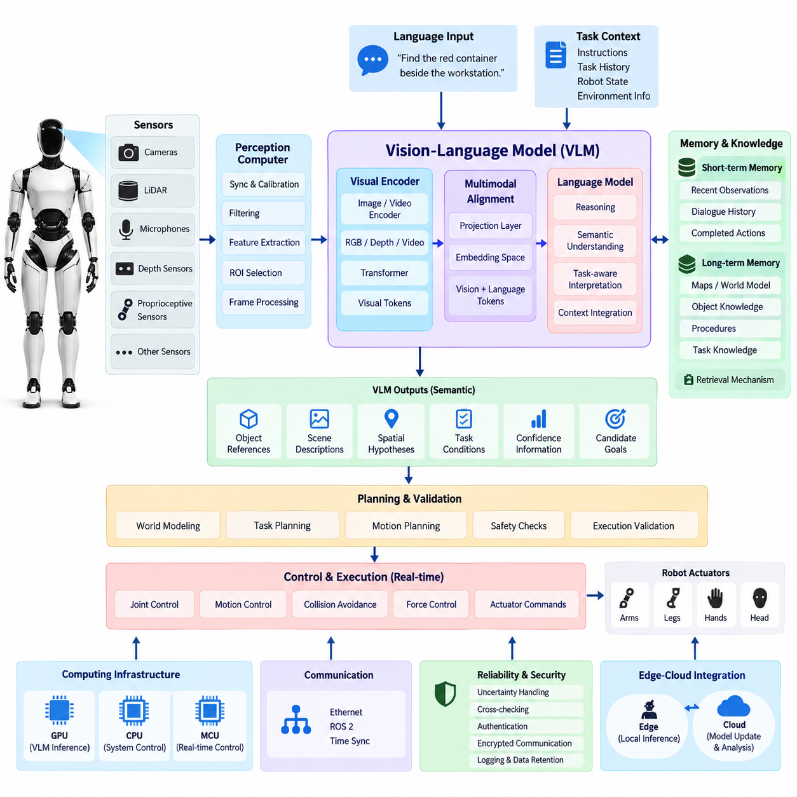
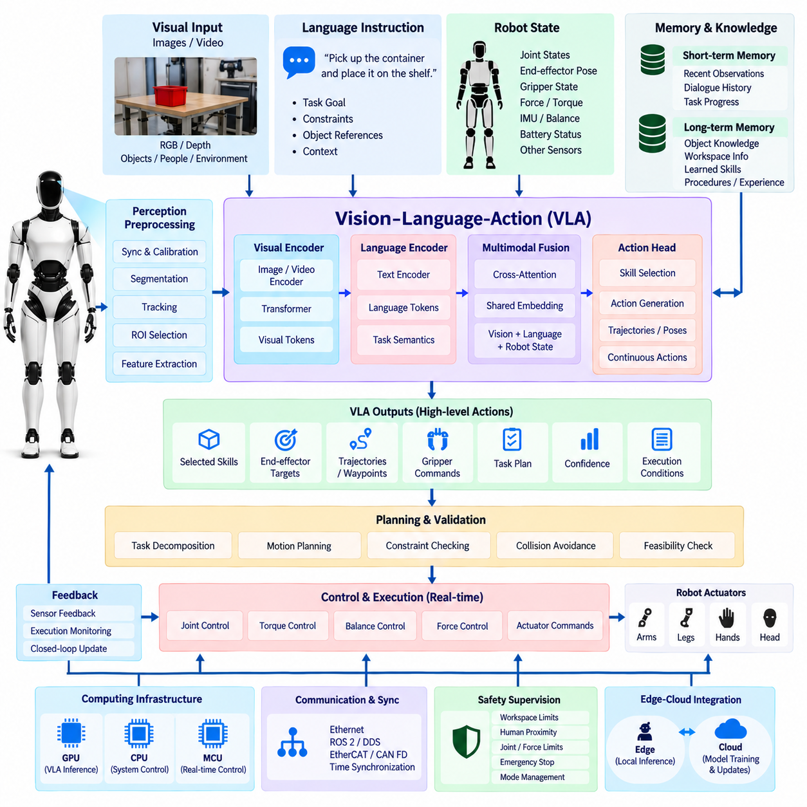
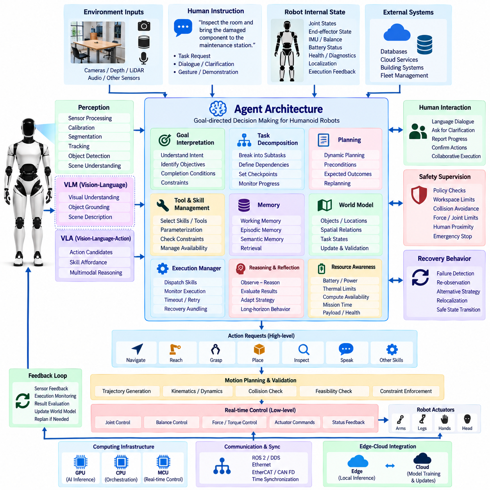
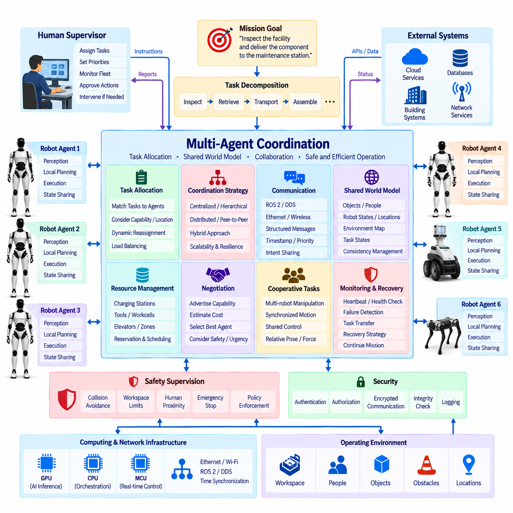
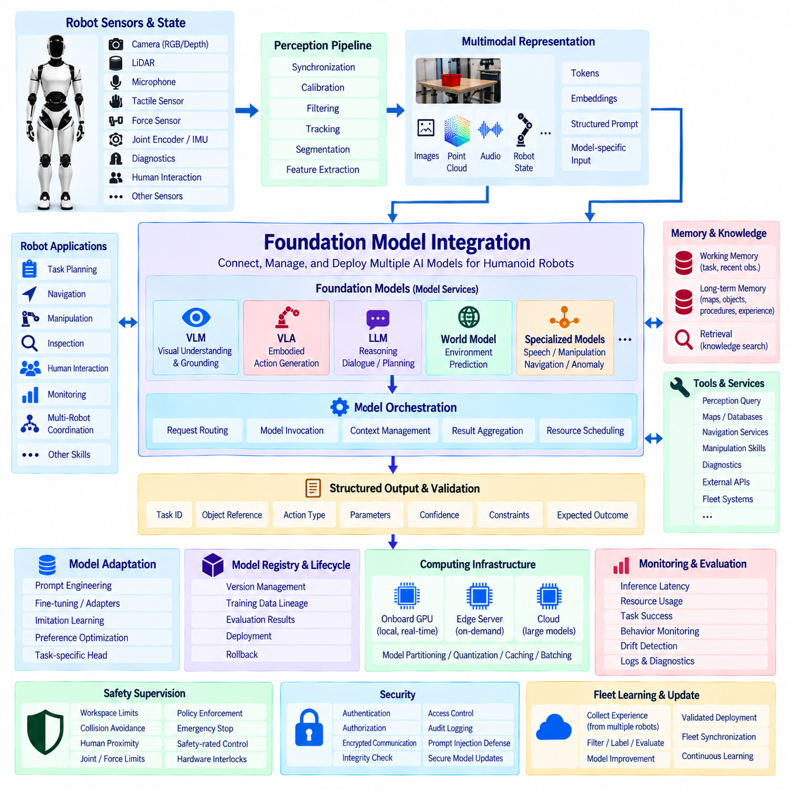
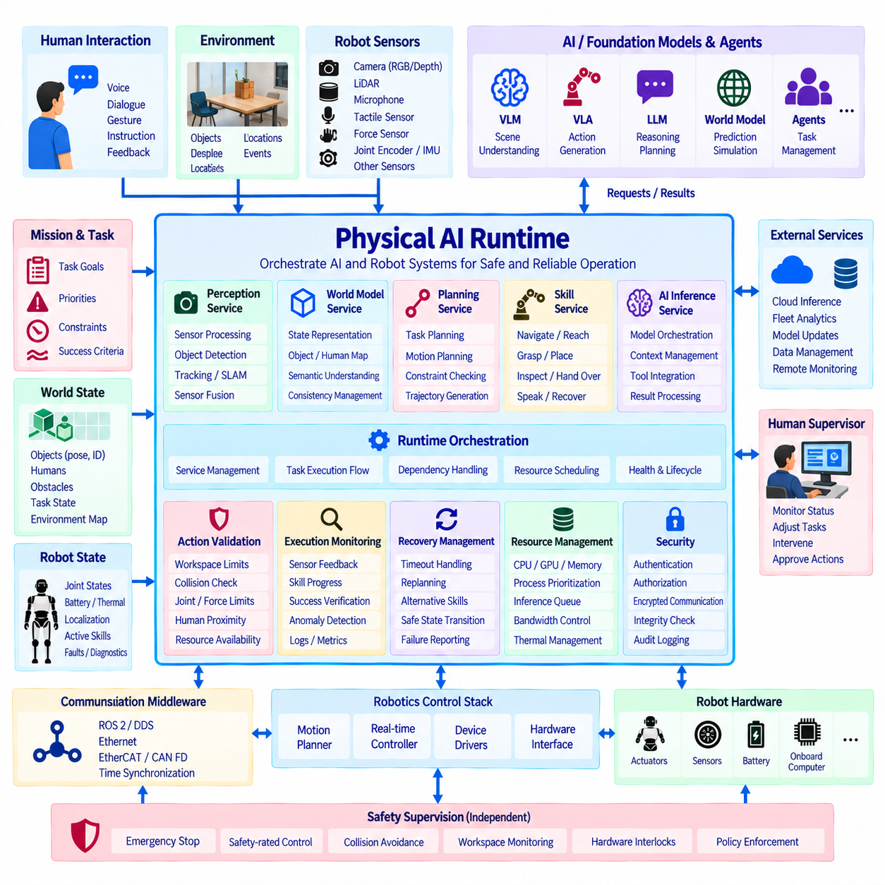

**Volume 21. Humanoid Electrical Architecture**

# Chapter 14. AI and Embodied AI

## 14.01. VLM Architecture

{width="7.268055555555556in" height="7.268055555555556in"}

A Vision-Language Model (VLM) architecture provides a humanoid robot with a semantic interface between visual perception and language-based reasoning. Unlike conventional vision pipelines that terminate at object labels or geometric detections, a VLM converts camera observations into representations that can be associated with concepts, relationships, instructions, and contextual knowledge. This enables the robot to interpret not only what is visible, but also what the observed scene means for the current task.

Within the humanoid architecture, the VLM normally operates above the real-time sensing and control layers. Cameras, depth sensors, LiDAR, microphones, and proprioceptive sensors continuously generate physical-world observations, while the perception computer performs synchronization, calibration, filtering, and basic feature extraction. Selected visual information is then transferred to the AI computer or GPU subsystem, where the VLM performs higher-level semantic interpretation without interfering with deterministic joint-control loops.

The visual front end typically contains an image or video encoder based on a transformer or comparable deep neural architecture. RGB frames, cropped regions, depth-enhanced images, or temporally sampled video sequences are transformed into compact visual tokens. These tokens preserve semantic information about objects, people, tools, surfaces, spatial relationships, and activities while reducing the amount of raw sensor data that must be processed by the language-oriented reasoning components.

A projection or multimodal alignment layer connects the visual encoder to the language model. Its purpose is to map visual features into an embedding space that can be interpreted together with textual tokens. The language model can therefore reason over combinations such as an operator instruction, a camera observation, task history, robot state, and retrieved knowledge. This alignment layer is fundamental because perception and language originate from different data distributions but must participate in a common reasoning process.

For a humanoid robot, a single image is often insufficient because physical interaction evolves over time. The VLM architecture should therefore support temporal visual context through frame sequences, event-triggered observations, or compressed video representations. Temporal context allows the system to distinguish static configurations from ongoing actions, recognize that an object has moved, determine whether a person is approaching, and understand how the environment has changed following a previous robot action.

The language interface provides task-level semantic context to the visual pipeline. Instructions such as "find the red container beside the workstation" or "check whether the operator has cleared the area" constrain which visual features are important. Rather than processing every scene element with equal priority, the VLM can use linguistic context to focus semantic interpretation on task-relevant objects, attributes, relationships, and events. This creates a perception process that is conditioned by robot objectives.

VLM outputs should remain distinct from direct actuator commands. The model may generate object references, semantic scene descriptions, spatial hypotheses, task conditions, confidence information, or candidate goals, but these outputs should pass through downstream planning and validation layers before physical execution. Such separation prevents probabilistic multimodal reasoning from bypassing deterministic motion control, collision avoidance, joint limits, force constraints, or functional-safety mechanisms.

Grounding is especially important in humanoid applications because linguistic concepts must ultimately correspond to physical entities. A phrase such as "the wrench on the left table" must be associated with an observable region, tracked object, depth estimate, or world-model entity before manipulation begins. The architecture therefore benefits from explicit links between VLM tokens and perception outputs such as segmentation masks, bounding regions, object tracks, 3D coordinates, and scene-graph identifiers.

The VLM can also act as a semantic bridge between perception and the robot\'s world representation. Low-level perception determines measurable properties such as depth, pose, motion, and occupancy, while the VLM contributes semantic relationships such as ownership, affordance, task relevance, and likely function. Combining these representations allows the robot to maintain a richer world model in which geometric entities are connected to language-addressable concepts that higher-level reasoning modules can query.

Memory extends the VLM beyond immediate perception. Short-term multimodal memory can retain recent observations, instructions, dialogue, and completed actions, while longer-term stores may contain maps, object descriptions, procedures, and task knowledge. Retrieval mechanisms can supply only the context relevant to the current situation, reducing unnecessary model input while allowing the humanoid to associate present observations with information acquired earlier during operation or provided through external knowledge systems.

Because humanoid robots operate under finite compute and power budgets, VLM execution requires careful resource partitioning. High-resolution cameras can generate far more data than a large multimodal model can process continuously, so frame selection, region-of-interest extraction, image resizing, token reduction, and event-driven inference are practical architectural mechanisms. Lightweight perception can run continuously while expensive VLM inference is activated when semantic interpretation or language grounding is required.

The computing architecture should isolate VLM workloads from hard real-time control. GPU resources may execute visual encoding, multimodal attention, language inference, and embedding operations, while dedicated CPUs, MCUs, or real-time processors maintain motor control and safety functions. Scheduling, memory bandwidth, thermal limits, inference latency, and model size must therefore be considered together so that semantic AI workloads cannot destabilize balance control, actuator communication, or other timing-critical robot functions.

Communication interfaces connect the VLM with perception, world modeling, task planning, and supervisory software. High-bandwidth sensor streams are typically transported through Ethernet-class networks or local high-speed interfaces, whereas semantic results can be exchanged as structured messages through robotics middleware. Time synchronization remains important because visual observations, robot poses, joint states, and task events must refer to compatible timestamps when multimodal reasoning reconstructs the physical situation.

Reliability requires explicit treatment of uncertainty. A VLM can produce plausible descriptions that are not physically correct, particularly when observations are occluded, ambiguous, poorly illuminated, or outside its training distribution. Robot software should therefore attach confidence, provenance, timestamps, and grounding evidence to important semantic outputs. Critical conclusions can be cross-checked against deterministic perception, redundant sensors, geometric constraints, or additional observations before they influence physical behavior.

Security and privacy are also architectural concerns because humanoid VLMs may process images containing people, documents, displays, workplaces, or private environments. Local inference can reduce unnecessary transmission of sensitive visual data, while edge-cloud integration may be selectively used for model updates, non-real-time analysis, or computationally expensive reasoning. Authentication, encrypted communication, access control, logging, and controlled retention should accompany any transfer of multimodal information outside the robot.

The VLM ultimately forms the perception-and-language foundation for higher levels of embodied intelligence. Its role is to transform synchronized physical observations into grounded semantic representations that can be consumed by VLA models, agents, planners, foundation models, and Physical AI runtimes. In this hierarchy, the VLM answers what the robot sees and what that observation means, while subsequent architectural layers determine what goal should be pursued, which action is appropriate, and how that action can be executed safely.

## 14.02. VLA Architecture

{width="7.268055555555556in" height="7.268055555555556in"}

A Vision-Language-Action (VLA) architecture extends multimodal perception and reasoning into physical behavior by connecting visual observations, language instructions, robot state, and action representations within a unified embodied AI framework. For a humanoid robot, the VLA serves as a high-level policy interface that interprets what the robot observes, understands the intended task, reasons about the current situation, and proposes actions that can be translated into executable robot behaviors.

The VLA normally operates above deterministic motion control and functional-safety layers. Cameras and other perception sensors provide environmental observations, while joint encoders, torque sensors, force sensors, IMUs, tactile sensors, and actuator feedback describe the robot\'s internal physical state. Language instructions provide task intent. The VLA combines these heterogeneous inputs to determine an appropriate action objective without directly replacing the real-time controllers responsible for stable physical execution.

Visual information enters through an image or video encoder that converts RGB, depth, or temporally sampled observations into compact visual tokens. These representations describe task-relevant objects, people, tools, workspaces, and environmental conditions. In practical humanoid systems, perception preprocessing may perform synchronization, calibration, segmentation, tracking, region-of-interest selection, or feature extraction before data reaches the VLA, reducing computational load while maintaining information required for embodied reasoning.

Language instructions are encoded into representations that express task goals, constraints, object references, and contextual relationships. Commands such as "pick up the container and place it on the shelf" must be decomposed into concepts involving the target object, manipulation objective, destination, and expected completion condition. Language therefore acts not simply as a command string but as a semantic specification that conditions perception, reasoning, planning, and action generation throughout the VLA pipeline.

Robot-state information distinguishes VLA architectures from vision-language systems focused primarily on semantic understanding. The model may receive joint positions, velocities, end-effector poses, gripper states, contact conditions, balance information, battery status, and other relevant state variables. These signals provide physical context for determining whether a proposed action is feasible. The same visual scene can require different actions depending on the humanoid\'s posture, reachability, current grasp, or interaction history.

Multimodal fusion combines visual tokens, language tokens, robot-state embeddings, and optional memory into a shared representation. Transformer-based attention mechanisms can associate phrases with visible entities while simultaneously considering the robot\'s physical configuration. The resulting representation describes not only what exists in the environment, but also which entities are relevant to the task, how they relate to the robot, and what changes in the physical world are expected from subsequent actions.

Action representation defines how multimodal reasoning becomes embodied behavior. Depending on the system architecture, VLA outputs may represent discrete skills, symbolic actions, end-effector targets, trajectories, poses, waypoints, gripper commands, or continuous action vectors. A humanoid architecture benefits from hierarchical representations in which the VLA selects task-level or skill-level actions while dedicated motion planners and controllers convert them into dynamically feasible joint trajectories and actuator commands.

Hierarchical control is particularly important because humanoid motion spans very different time scales. Semantic reasoning and task selection may operate relatively slowly, whereas balance, contact stabilization, joint torque regulation, and collision response require much faster deterministic loops. The VLA should therefore generate goals or bounded action references for lower control layers rather than attempting to control every actuator directly at the multimodal model\'s inference frequency. This separation preserves responsiveness and physical stability.

Action chunking can improve efficiency when a task requires a sequence of coordinated motions. Instead of predicting only one instantaneous command, the VLA may generate a short horizon of action tokens or a structured skill sequence. The execution system can then monitor progress and interrupt, modify, or regenerate the sequence when the environment changes. This approach reduces repeated high-cost inference while retaining feedback-driven behavior needed for manipulation and human-robot interaction.

Closed-loop execution is essential for embodied AI because predicted actions change the observations used for subsequent reasoning. After an action is initiated, cameras, tactile sensors, force sensors, and proprioceptive feedback determine whether the expected physical result occurred. The new observation is returned to the perception and VLA pipeline, producing a perception-reasoning-action cycle. This feedback loop enables correction when an object moves, a grasp fails, contact differs from expectation, or a human changes the workspace.

Memory provides temporal continuity across these cycles. Short-term memory can retain recent observations, actions, failures, dialogue, and intermediate task states, allowing the VLA to determine what has already been completed. Longer-term memory may contain object knowledge, workspace information, learned skills, operational procedures, and previous experiences. Retrieval should provide only context relevant to the current task so that model input remains computationally manageable while supporting behavior over extended time horizons.

Skill libraries provide an effective boundary between foundation-model reasoning and verified robot functionality. The VLA can select parameterized capabilities such as navigate, reach, grasp, place, inspect, hand over, open, or recover, while each capability is implemented through validated planning and control software. This arrangement allows multimodal intelligence to compose flexible behavior without requiring a generative model to reproduce every low-level control detail, and it supports systematic testing of reusable physical behaviors.

Safety supervision must remain independent of probabilistic action generation. Before execution, VLA outputs should be checked against workspace limits, collision constraints, joint limits, force and torque limits, balance conditions, human proximity, and allowed operating modes. Emergency-stop circuits and safety-rated functions must retain authority regardless of model output. Actions with insufficient confidence, ambiguous grounding, or unexpected environmental conditions can be rejected, constrained, or escalated for additional observation or human confirmation.

Uncertainty management is necessary because a VLA may generate an action that is semantically reasonable but physically inappropriate. Confidence should therefore be evaluated across perception, grounding, task interpretation, and action selection. Cross-checking with geometric perception, force sensing, world-model constraints, and execution feedback provides additional evidence. When uncertainty exceeds defined thresholds, the architecture can request another observation, select a conservative recovery behavior, or stop execution instead of continuing an unreliable action sequence.

The computing architecture must separate AI inference resources from timing-critical control resources. GPUs or AI accelerators can execute visual encoding, multimodal transformers, policy inference, and foundation models, while CPUs, MCUs, or real-time processors execute motion planning interfaces, communication, safety monitoring, and actuator control. Resource scheduling must account for inference latency, GPU memory, bandwidth, thermal conditions, and power consumption so that large VLA workloads cannot degrade essential humanoid control functions.

Communication and synchronization connect the VLA with the broader electrical and computing architecture defined for the humanoid platform. High-bandwidth perception data may use Gigabit Ethernet, while deterministic actuator and joint communication may use real-time networks such as EtherCAT or CAN FD where appropriate. ROS 2 and DDS can distribute semantic state and task messages, while synchronized timestamps allow visual observations, robot poses, force measurements, and generated actions to remain temporally consistent.

Edge-cloud integration can support model training, fleet learning, evaluation, data management, and large-scale updates, but physical action execution should not depend on unreliable external connectivity. Core perception, action validation, safety supervision, and essential control capabilities should remain available locally. Cloud resources can process collected experience, improve models, distribute validated parameters, or provide non-real-time reasoning while the humanoid maintains autonomous and safe operation at the edge.

The VLA ultimately forms the transition from understanding to embodied execution within the humanoid AI hierarchy. The preceding VLM architecture establishes what the robot observes and what those observations mean, while the VLA adds the question of what the robot should do next. Its outputs then feed agent architectures, skill systems, planners, safety supervisors, and the Physical AI runtime, creating a controlled path from multimodal foundation-model intelligence to measurable actions in the physical world.

## 14.03. Agent Architecture

{width="7.268055555555556in" height="7.268055555555556in"}

An agent architecture provides the decision-making layer that transforms multimodal understanding and action capabilities into persistent, goal-directed humanoid behavior. While a VLM interprets visual and linguistic information and a VLA connects perception to candidate physical actions, an agent manages objectives across time. It determines what should be done next, evaluates progress, invokes appropriate tools or robot skills, and adapts the execution strategy when the environment or task state changes.

In a humanoid system, the agent normally operates above perception, VLM, VLA, motion planning, and real-time control layers. It should not directly regulate joint torque, balance, or actuator timing. Instead, the agent reasons at task and mission levels, producing structured goals and skill requests that are validated by lower layers. This hierarchy separates relatively slow and probabilistic AI reasoning from deterministic physical control while allowing advanced models to coordinate complex robot behavior.

The agent receives multimodal context representing both the external environment and the internal state of the robot. Inputs may include VLM scene descriptions, grounded objects, VLA action candidates, world-model entities, dialogue, task instructions, robot health, battery condition, localization, and execution feedback. These inputs are transformed into an agent state that summarizes what the robot currently knows, what objective it is pursuing, which actions have already occurred, and which constraints remain active.

Goal interpretation converts human instructions or autonomous mission requests into explicit objectives that the agent can manage. A command such as "inspect the room and bring the damaged component to the maintenance station" contains several dependent activities rather than a single action. The agent identifies completion conditions, relevant objects, environmental constraints, and intermediate objectives so that execution can be monitored instead of treating the instruction as an unstructured language sequence.

Task decomposition divides complex objectives into manageable subtasks. The agent may convert a mission into stages such as navigate to the target area, identify the component, verify its condition, approach safely, grasp it, transport it, and confirm delivery. Decomposition allows different robot capabilities to be coordinated through a common reasoning framework and provides explicit checkpoints where the system can evaluate whether execution should continue, retry, replan, or terminate.

Planning determines the sequence and dependency relationships among subtasks. Rather than generating an immutable sequence, a practical humanoid agent maintains a dynamic plan that can be revised as new observations arrive. Preconditions define when an action can begin, while expected outcomes describe the state that should result after execution. Comparing expected and observed outcomes allows the agent to detect deviations and update the plan without requiring the entire mission to restart.

The agent requires an interface to a library of tools and embodied skills. Available capabilities may include perception queries, navigation, reach, grasp, place, inspect, speak, listen, manipulate, open, recover, database access, or communication with external systems. Each tool should expose defined inputs, outputs, constraints, and status information. The agent selects and parameterizes these capabilities rather than generating arbitrary low-level actuator commands, creating a controlled boundary between reasoning and execution.

VLM and VLA models can operate as specialized reasoning components within the agent. The agent may invoke the VLM when semantic interpretation, visual question answering, or object grounding is required, and use the VLA when a multimodal situation must be translated into an appropriate embodied action. This modular relationship prevents a single foundation model from carrying every responsibility and allows perception, reasoning, action generation, planning, and safety functions to evolve independently.

Memory enables the agent to maintain continuity across long-duration tasks. Working memory contains the current goal, recent observations, active plan, tool results, and execution state. Episodic memory can retain previous interactions and completed missions, while semantic memory stores reusable knowledge about objects, environments, procedures, and capabilities. Retrieval mechanisms should select only relevant information so that historical context improves decisions without overwhelming the reasoning model with unnecessary data.

A world model provides the structured environmental state required for reliable agent reasoning. It may represent objects, locations, people, spatial relationships, robot pose, task states, accessibility, and known hazards. The agent updates this representation as observations and actions occur. By comparing the expected world state after an action with newly observed conditions, the system can determine whether the action succeeded and whether the assumptions used during planning remain valid.

The execution manager converts agent decisions into controlled requests to lower robot layers. It dispatches selected skills, monitors their status, collects completion results, and manages timeout, cancellation, retry, and recovery conditions. Long-running physical actions should therefore be represented as observable execution processes rather than simple function calls. This allows the agent to remain aware of what the robot is currently doing and prevents conflicting skills from being activated simultaneously.

Closed-loop reasoning forms a repeated observe-reason-act-evaluate cycle. After each meaningful action or environmental event, the agent evaluates new observations against the active goal and expected result. If execution is progressing normally, the next planned step is selected. If a grasp fails, a path becomes blocked, an object disappears, or a human interrupts the operation, the agent can gather additional information and revise its plan rather than blindly continuing the original sequence.

Recovery behavior is a fundamental component of physical agents because real environments contain uncertainty. The architecture should distinguish recoverable execution failures from conditions requiring immediate termination. A failed grasp may trigger another observation and a modified grasp strategy, while loss of localization may require stopping and relocalization. Safety-critical faults, however, must transition control to predefined safe states rather than allowing unrestricted generative reasoning to determine the response.

Safety supervision must remain authoritative and independent of the agent\'s reasoning process. Agent-generated goals and tool requests should pass through policy, workspace, collision, force, joint, human-proximity, and operating-mode checks before physical execution. Emergency-stop functions and safety-rated controllers retain final authority. The agent may reason about safety information, but it must not override hardware protection, certified safety functions, or deterministic limits established by the robot architecture.

Resource awareness allows the agent to incorporate practical robot constraints into planning. Battery state, thermal limits, compute availability, network connectivity, payload condition, actuator health, and remaining mission time may affect which plan is feasible. A humanoid with declining battery capacity, for example, may need to complete a critical task and return to a charging location instead of initiating another long operation. Resource state therefore becomes part of goal and plan evaluation.

Human interaction is integrated into the agent loop through language, gesture, visual grounding, and dialogue. When instructions are ambiguous, the agent can request clarification rather than selecting an unsafe interpretation. It can also report task progress, explain failures, request assistance, or confirm high-impact actions. This interaction transforms language from a one-time command interface into a bidirectional supervisory channel between people and the autonomous humanoid system.

The computing implementation should isolate agent and foundation-model workloads from real-time robot control. GPU or AI accelerators can execute VLM, VLA, language reasoning, and multimodal inference, while CPUs manage orchestration, middleware, world-model services, and task state. Dedicated real-time processors or MCUs continue to control actuators and safety functions. Communication through ROS 2, DDS, Ethernet, EtherCAT, or CAN FD can connect these layers while maintaining appropriate timing boundaries.

The agent architecture ultimately acts as the orchestration layer of the humanoid\'s embodied AI system. VLM provides semantic understanding, VLA proposes or generates embodied actions, and the agent connects these capabilities across goals, memory, tools, world state, execution feedback, and planning. The resulting hierarchy enables a Physical AI runtime to sustain autonomous behavior over time while keeping probabilistic AI decisions separated from validated motion control, diagnostics, communication, and functional-safety mechanisms.

## 14.04. Multi Agent Coordination

{width="7.268055555555556in" height="7.268055555555556in"}

Multi-agent coordination extends the humanoid agent architecture from a single autonomous decision maker into a distributed system in which multiple robots, AI agents, infrastructure services, and human supervisors cooperate toward shared objectives. Each agent retains local perception, reasoning, memory, and execution capabilities while exchanging selected information with others. The purpose is not merely communication, but coordinated decision making that improves task coverage, resource utilization, resilience, and operational efficiency.

In a humanoid system, an agent may represent an individual robot, a specialized AI service, a fleet coordinator, a perception service, or a task-management component. Agents can have different physical capabilities, sensors, computational resources, tools, and operating constraints. Multi-agent architecture therefore requires explicit descriptions of capabilities and state so that tasks can be assigned to agents that are physically and computationally able to execute them within the current environment.

Coordination begins with a shared understanding of mission objectives. A complex request may be decomposed into subtasks that can be executed independently or with defined dependencies. One humanoid might inspect a workspace while another retrieves tools, and a mobile robot may transport materials between locations. The coordination layer determines how these activities relate, which tasks can run concurrently, and which results must become available before dependent actions are allowed to begin.

Task allocation maps subtasks to available agents according to capability, location, workload, energy, priority, and expected execution cost. Static assignment may be sufficient for predictable environments, while dynamic allocation allows tasks to migrate when conditions change. An agent experiencing low battery, actuator degradation, blocked access, or excessive workload can release or transfer a task so that another qualified agent continues the mission without requiring complete system restart.

Centralized coordination uses a supervisory agent or fleet manager to maintain the global task state and distribute assignments. This architecture simplifies global optimization, policy enforcement, and monitoring, but creates dependence on communication and the coordinator\'s availability. Distributed coordination allows individual agents to negotiate and make local decisions, improving scalability and resilience. Practical humanoid systems may combine both approaches, using centralized mission management with decentralized local execution and recovery.

Communication provides the information exchange required for cooperation. Agents may publish position, task status, capability, resource state, object observations, world-model updates, intentions, and execution results through structured messages. ROS 2 and DDS can support robot-level distributed communication, while Ethernet, wireless networks, or fleet interfaces connect physically separated systems. Message schemas should define timestamps, source identity, validity, priority, and confidence so that receiving agents can interpret information correctly.

A shared world model enables agents to reason about the same operational environment. Local observations from cameras, LiDAR, localization, manipulation, and human interaction can update representations of objects, people, robot positions, hazards, accessibility, and task states. The system must distinguish globally useful information from purely local state. Sharing semantic or compressed representations rather than continuous raw sensor streams can significantly reduce network and computing requirements.

Consistency management becomes important when several agents update overlapping parts of the world model. Two robots may observe the same object from different viewpoints or report different positions because of timing, localization error, or environmental change. Updates therefore require timestamps, confidence, source information, and conflict-resolution rules. Recent and reliable observations can be fused, while contradictory information may trigger re-observation instead of allowing an uncertain shared state to propagate through the fleet.

Intent sharing helps agents predict the behavior of other robots before physical actions occur. An agent can announce that it intends to enter a corridor, manipulate a shared object, reserve a workstation, or occupy a charging station. Other agents can incorporate these intentions into their own planning. This reduces path conflicts, duplicated work, resource contention, and unexpected interactions while allowing coordination without continuously exchanging detailed low-level trajectories.

Resource coordination manages assets that cannot be used simultaneously by every agent. Charging stations, tools, elevators, workcells, network bandwidth, GPU services, and restricted operating zones may require reservation or scheduling. A coordination service can maintain ownership, queue, priority, timeout, and release states for these shared resources. Explicit resource management prevents several otherwise valid agent plans from becoming mutually incompatible during physical execution.

Negotiation mechanisms are useful when multiple agents can perform the same task. Agents may advertise capability and estimated cost, while a coordinator or distributed protocol selects an assignment according to mission priorities. Cost can represent distance, execution time, energy consumption, risk, workload, or tool availability. The objective is not always to minimize a single metric; safety, urgency, resource balance, and overall mission completion may take precedence over local efficiency.

Coordination must also support cooperative physical tasks that cannot be completed by one robot alone. Two humanoids may carry a large object, hold and assemble components, or perform coordinated inspection from different viewpoints. Such operations require more than task-level agreement because timing, relative pose, contact forces, and motion constraints become coupled. High-level agents define the cooperative objective, while synchronized motion and force controllers handle the deterministic real-time coordination required for safe execution.

Time synchronization is critical when observations and actions from multiple robots are combined. PTP or other synchronization mechanisms can establish a common temporal reference for sensor measurements, localization, event logs, and coordination messages. Without consistent timestamps, the shared world model may combine states that occurred at different times. This becomes particularly important for moving people, mobile robots, cooperative manipulation, and post-event analysis of multi-agent behavior.

Failure handling should preserve mission continuity when an individual agent becomes unavailable. Heartbeats, health monitoring, task leases, and execution timeouts can identify failed or disconnected agents. Their active tasks can then be suspended, reassigned, or recovered by another agent. Local robots should retain safe autonomous behavior during communication loss rather than waiting indefinitely for fleet instructions. Safety-critical functions must continue independently of the multi-agent coordination network.

Safety supervision must span both local and shared operating conditions. Each humanoid retains independent collision avoidance, force limits, emergency-stop handling, and safety-rated control, while the coordination layer manages higher-level conflicts such as shared zones, traffic priorities, and cooperative tasks. A fleet-level command must never override local safety protection. If coordination information conflicts with immediate sensor evidence, the robot\'s validated local safety mechanisms retain final authority.

Security becomes increasingly important as coordination expands the number of communicating entities. Agents should authenticate peers and services before accepting task assignments, world-model updates, or control-related requests. Authorization determines which agent may access specific tools, zones, data, or robot capabilities. Encrypted communication, integrity checks, logging, software identity, and controlled credential management reduce the possibility that compromised or incorrect messages influence physical robot behavior.

Scalability requires limiting unnecessary communication and centralized computation as the number of agents increases. Hierarchical coordination can group robots by location, task, or capability, with local coordinators handling frequent interactions and higher-level services managing mission-wide objectives. Event-driven updates, semantic data exchange, topic filtering, and distributed world models reduce bandwidth. The architecture should allow additional humanoids or specialized agents to join without redesigning the entire control system.

Human supervisors remain part of the multi-agent architecture. Operators may assign priorities, approve exceptional actions, inspect fleet status, modify missions, or intervene when automated negotiation cannot resolve ambiguity. Agents can report progress using semantic summaries rather than raw telemetry, allowing humans to supervise many robots efficiently. Clear ownership of tasks and traceable decision logs are important so that operators can understand which agent made a decision and why an action occurred.

Multi-agent coordination ultimately creates a distributed embodied AI layer above individual humanoid intelligence. VLM provides semantic perception, VLA connects perception to physical action, and the agent architecture manages persistent goals and execution for one robot. Multi-agent coordination connects these autonomous entities through task allocation, shared world state, communication, resource management, negotiation, synchronization, and recovery, enabling multiple Physical AI systems to operate as a coherent and scalable robotic workforce.

## 14.05. Foundation Model Integration

{width="7.268055555555556in" height="7.268055555555556in"}

Foundation model integration provides the architectural layer that connects large pretrained AI models with the perception, reasoning, action, memory, and control systems of a humanoid robot. Rather than embedding one monolithic model directly into every robot function, the architecture treats foundation models as shared intelligence services. VLMs, VLA models, language models, world models, and specialized multimodal models can therefore contribute capabilities while remaining separated from deterministic control and safety functions.

A humanoid platform generates heterogeneous information from cameras, LiDAR, microphones, tactile sensors, force sensors, joint encoders, IMUs, diagnostics, and human interaction. Foundation models require this information to be transformed into suitable multimodal representations before inference. Perception pipelines perform synchronization, calibration, filtering, tracking, segmentation, and feature extraction, while interface layers convert selected observations and robot states into tokens, embeddings, structured prompts, or model-specific input representations.

The integration architecture should support multiple foundation models rather than assuming that a single model performs every task. A VLM may specialize in semantic scene understanding and visual grounding, a VLA may generate embodied action proposals, and a language model may perform task reasoning, dialogue, or planning. World models can predict environmental transitions, while specialized models handle speech, manipulation, navigation, or anomaly interpretation. An orchestration layer selects which model should process each request.

Model orchestration manages routing, invocation, context construction, and result aggregation across these foundation models. Requests are classified according to task type, required modality, latency, confidence, and available computing resources. Simple perception tasks can remain within lightweight local models, whereas complex semantic reasoning may invoke a larger multimodal model. This prevents unnecessary use of expensive inference resources and allows the humanoid to maintain responsive operation while retaining access to advanced reasoning when needed.

Context management determines what information is presented to a foundation model during each inference cycle. Raw sensor streams are generally too large and contain more information than is required for high-level reasoning. The integration layer therefore selects relevant images, object descriptions, robot states, task history, dialogue, world-model entities, and retrieved knowledge. Effective context construction improves inference efficiency while reducing the risk that important task information is hidden by irrelevant multimodal data.

Grounding connects abstract model outputs to physical entities in the robot\'s operational environment. A foundation model may refer to "the container beside the workstation," but the integration layer must associate that phrase with a tracked object, segmentation region, three-dimensional position, or world-model identifier. This connection between semantic tokens and measurable physical state is essential before model-generated reasoning can influence navigation, manipulation, inspection, or human-robot interaction.

Structured interfaces should be preferred when foundation-model outputs are consumed by robot software. Instead of accepting unrestricted natural-language responses as executable instructions, the architecture can require schemas containing task identifiers, object references, action types, parameters, confidence, constraints, and expected outcomes. Validation software can then verify the generated structure before forwarding it to agents, planners, skill managers, or VLA components, reducing ambiguity between generative reasoning and physical execution.

Memory and retrieval augment foundation models with information that cannot be contained permanently within the model parameters. Working memory maintains the current task, recent observations, execution results, and dialogue, while long-term memory can store maps, object knowledge, operating procedures, previous experiences, and robot-specific information. Retrieval-augmented mechanisms select relevant knowledge for each request, allowing general-purpose models to reason using current operational context without requiring continual retraining.

Tool integration allows foundation models to access capabilities outside their learned parameters. An agent may provide controlled interfaces to perception queries, databases, maps, diagnostic services, navigation, manipulation skills, external APIs, or fleet systems. The model can request these tools through defined schemas, but an execution manager determines whether the request is valid and permitted. This creates a controlled relationship between generative intelligence and software or physical capabilities.

Model adaptation enables general foundation models to become more useful for humanoid-specific applications. Prompt engineering, adapters, low-rank adaptation, fine-tuning, imitation learning, preference optimization, or task-specific heads can align models with robot terminology and behavior. Adaptation data may include teleoperation demonstrations, robot trajectories, visual observations, language instructions, manipulation outcomes, and failure cases. The resulting model must still be evaluated independently before deployment to physical systems.

The computing architecture should support different model sizes and execution locations. Small or latency-sensitive models may execute continuously on the robot\'s GPU or AI accelerator, while larger models can be invoked selectively on an edge server or cloud infrastructure. Model partitioning, quantization, caching, batching, and accelerated inference can reduce memory and power requirements. Critical robot functions, however, must not depend on remote model availability or unpredictable network latency.

A model registry provides controlled lifecycle management for the AI components deployed across the humanoid system. Each model version can be associated with its architecture, parameters, training data lineage, supported tasks, hardware requirements, evaluation results, and deployment status. Robots should load only approved model versions, while rollback mechanisms preserve a known operational configuration when a new model produces unacceptable behavior or causes performance degradation.

Safety boundaries must isolate foundation-model reasoning from safety-critical control. Generated actions or plans should pass through deterministic checks covering workspace limits, collision conditions, human proximity, joint limits, force and torque limits, operating modes, and resource constraints. Foundation models may assist in interpreting situations or proposing responses, but they must not override emergency-stop circuits, safety-rated controllers, hardware interlocks, or other independently validated protection mechanisms.

Confidence and uncertainty management are necessary because foundation models can generate plausible but incorrect interpretations. The integration layer should preserve information about input quality, grounding confidence, model confidence, execution history, and validation results. Important conclusions can be cross-checked using deterministic perception, redundant sensors, additional model queries, or world-model constraints. Low-confidence outputs can trigger re-observation, alternative reasoning, human confirmation, or conservative behavior.

Cybersecurity becomes especially important when models communicate with external servers or receive updates from remote infrastructure. Authentication, authorization, encrypted communication, software signing, integrity verification, access control, and audit logging should protect model artifacts and inference interfaces. Prompt injection, malicious sensor content, compromised tools, or unauthorized model updates must be considered because foundation-model outputs can ultimately influence decisions affecting physical robot behavior.

Monitoring should evaluate both computational and behavioral performance after deployment. Inference latency, GPU utilization, memory consumption, temperature, network usage, model failures, confidence distributions, and task success can be logged alongside robot events. Behavioral monitoring can identify drift, repeated reasoning failures, unusual tool usage, or differences between expected and observed outcomes. These records support diagnostics, model improvement, fleet learning, and controlled lifecycle management.

Fleet-level integration allows experience collected by multiple humanoids to contribute to model improvement without requiring every robot to learn independently. Selected observations, task outcomes, failures, and human corrections can be uploaded to an edge or cloud learning environment, where they are filtered, labeled, evaluated, and incorporated into future model development. Updated models are validated before controlled deployment, creating a feedback loop between field operation and centralized AI engineering.

Foundation model integration ultimately provides a common intelligence infrastructure for the humanoid\'s embodied AI stack. VLM, VLA, agent, and multi-agent components can use shared model services, memory, tools, world representations, and lifecycle mechanisms instead of operating as isolated AI functions. By combining flexible pretrained intelligence with structured interfaces, validation, local real-time control, safety supervision, and managed deployment, the architecture creates a practical bridge from foundation models to reliable Physical AI operation.

## 14.06. Physical AI Runtime

{width="7.268055555555556in" height="7.268055555555556in"}

The Physical AI Runtime is the operational software layer that connects embodied intelligence with the deterministic computing, communication, control, and safety infrastructure of a humanoid robot. It provides the execution environment in which VLM, VLA, agent, multi-agent, and foundation-model services interact with perception, planning, skills, diagnostics, and hardware interfaces. Its primary role is to transform AI decisions into managed robot operations without allowing probabilistic reasoning to bypass validated execution boundaries.

The runtime sits between high-level intelligence services and the lower-level robotics software stack. Above it, foundation models and agents generate semantic interpretations, goals, plans, action candidates, and tool requests. Below it, motion planners, real-time controllers, device drivers, communication networks, and safety mechanisms interact with physical hardware. The runtime coordinates these layers through explicit interfaces so that AI functionality remains modular while physical execution follows predictable and testable pathways.

A service-oriented architecture allows runtime functions to be separated according to responsibility. Perception services process cameras, LiDAR, audio, tactile sensing, force measurements, and proprioceptive data, while world-model services maintain structured environmental state. Planning services calculate task or motion solutions, skill services expose reusable robot capabilities, and AI inference services execute multimodal models. The runtime manages discovery, communication, dependencies, health, and lifecycle state across these components.

Runtime orchestration determines when services and models should execute and how their results should be connected. A task may require perception, object grounding, reasoning, skill selection, trajectory generation, validation, and execution in sequence, while other functions operate concurrently. The orchestrator manages dependencies and execution state so that asynchronous AI inference can coexist with periodic robotics processes and deterministic real-time loops without creating uncontrolled timing interactions.

The runtime maintains a unified representation of robot state that can be consumed by higher-level intelligence. Joint positions, velocities, actuator states, battery condition, thermal information, localization, contact state, active faults, network status, and currently executing skills can be exposed through structured interfaces. This prevents foundation models and agents from relying on fragmented hardware-specific data and provides a consistent operational context for reasoning, planning, monitoring, and recovery.

A world-state interface connects semantic AI reasoning with measurable physical information. Objects recognized by perception can be associated with identifiers, poses, confidence, timestamps, attributes, and relationships. Human locations, obstacles, accessible regions, manipulation targets, and task states can be represented through the same operational framework. VLMs and agents can therefore reason using semantic entities while planners and controllers obtain the geometric information required for physical execution.

Skill execution is a central responsibility of the Physical AI Runtime. High-level intelligence should invoke defined capabilities such as navigate, reach, grasp, place, inspect, speak, hand over, or recover rather than directly generating unrestricted actuator commands. Each skill exposes parameters, preconditions, execution state, completion criteria, timeout conditions, and failure codes. The runtime supervises skill activation and ensures that incompatible or mutually exclusive physical operations are not executed simultaneously.

Action validation creates a controlled boundary between AI-generated intentions and robot execution. Before a requested skill or trajectory is accepted, the runtime can verify object references, operating mode, resource availability, workspace constraints, collision conditions, joint limits, payload assumptions, and human proximity. Invalid or incomplete requests are rejected before reaching low-level control. This validation layer is especially important when actions originate from probabilistic foundation models or dynamically generated agent plans.

Execution monitoring observes whether commanded actions produce the expected results. Sensor feedback, controller status, trajectory progress, contact measurements, perception updates, and skill completion conditions are compared with expected execution states. A grasp command, for example, is not considered successful simply because the motion completed; object presence, gripper state, force information, or subsequent perception may be required to confirm success. Verified results are returned to agents and world-model services.

Recovery management handles deviations that do not require immediate safety shutdown. Timeouts, unreachable targets, failed grasps, blocked paths, temporary communication failures, or unavailable resources can trigger predefined recovery procedures. The runtime may cancel the active skill, request re-observation, reset a component, select an alternative capability, or return a structured failure to the agent for replanning. Safety-critical failures remain the responsibility of independent safety mechanisms and predefined safe-state transitions.

Real-time separation is essential because Physical AI contains workloads with fundamentally different timing requirements. Foundation-model inference may require tens or hundreds of milliseconds or longer, whereas balance control, motor current regulation, contact stabilization, and actuator communication may require deterministic millisecond or sub-millisecond cycles. The runtime therefore separates best-effort AI execution from hard or soft real-time domains and communicates through bounded interfaces rather than sharing uncontrolled execution contexts.

Computing resource management coordinates CPUs, GPUs, AI accelerators, memory, storage, and network bandwidth. Large VLM or VLA inference workloads must not exhaust resources required for localization, control, diagnostics, or safety-related communication. Runtime policies can assign process priorities, CPU affinity, GPU memory budgets, inference queues, bandwidth limits, and thermal constraints. Resource-aware scheduling allows computationally expensive AI services to degrade gracefully instead of destabilizing essential robot functions.

Communication middleware provides the data exchange backbone between runtime components. ROS 2 and DDS can distribute perception, semantic state, task, and diagnostic information, while EtherCAT, CAN FD, or other deterministic networks can connect controllers and actuators. Ethernet supports high-bandwidth sensors and computing nodes. The runtime should define clear boundaries between semantic middleware traffic and time-critical control communication so that network congestion cannot propagate unpredictably into actuator behavior.

Time synchronization provides a common temporal reference across sensing, inference, world modeling, planning, and execution. Camera frames, LiDAR measurements, IMU data, joint states, force measurements, AI results, and control events should carry consistent timestamps. PTP or hardware-supported synchronization can improve alignment across distributed computing nodes. Reliable timing enables the runtime to determine whether information is current, correlate multimodal observations, reconstruct events, and reject stale commands or outdated world-state information.

Lifecycle management controls startup, initialization, readiness, operation, degradation, restart, update, and shutdown of runtime components. Dependencies should be resolved before services become operational, and health checks should verify that required sensors, controllers, models, and communication interfaces are available. When a component fails, the runtime can isolate or restart it where permitted. Explicit lifecycle states prevent partially initialized AI or robotics services from participating in physical execution prematurely.

Diagnostics and observability provide visibility into the behavior of the complete Physical AI stack. Logs, traces, metrics, model inference times, controller states, network latency, GPU utilization, memory consumption, sensor health, skill transitions, and failure events can be correlated using synchronized timestamps. This information supports troubleshooting and reliability analysis while also creating structured operational evidence for model evaluation, regression testing, fleet maintenance, and future system improvement.

Security must protect runtime interfaces because software requests can ultimately produce physical actions. Authentication and authorization determine which processes, models, users, or external services may access robot capabilities. Secure software updates, signed model artifacts, encrypted external communication, integrity checking, credential management, and audit logging protect the execution environment. Tool and skill permissions should follow least-privilege principles so that compromise of one AI service does not automatically grant unrestricted robot control.

Edge and cloud services can extend the runtime without becoming prerequisites for safe local operation. Remote infrastructure may provide large-model inference, fleet analytics, model training, data management, software distribution, and long-term monitoring. The onboard runtime should retain essential perception, planning, diagnostics, safety supervision, and control capabilities when connectivity is degraded or unavailable. Remote results must pass through the same validation boundaries as locally generated AI outputs before affecting physical behavior.

The Physical AI Runtime ultimately provides the integration boundary where embodied intelligence becomes dependable machine operation. VLM supplies semantic understanding, VLA connects perception with action, agents manage goals, multi-agent coordination organizes distributed behavior, and foundation models provide reusable intelligence. The runtime binds these capabilities to world state, skills, resources, communication, diagnostics, validation, recovery, and deterministic control, forming the operational foundation required for scalable and reliable humanoid Physical AI.
