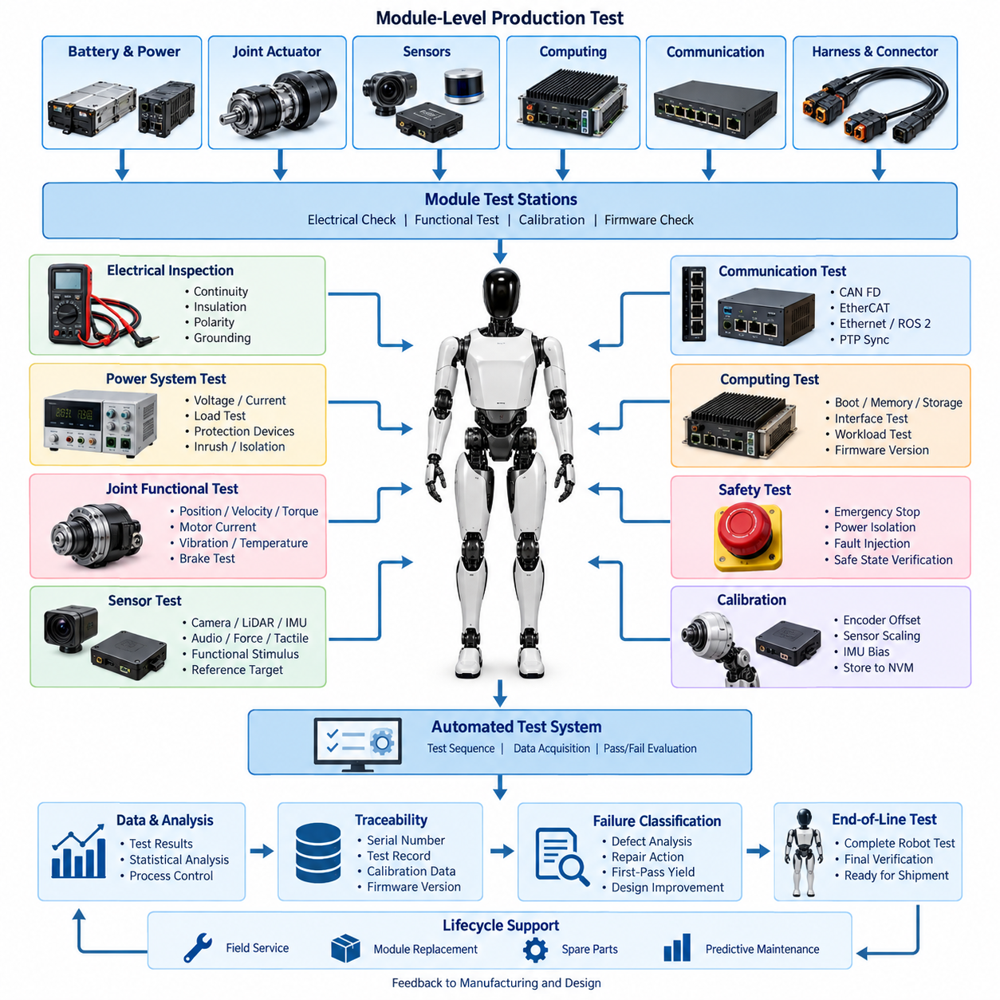
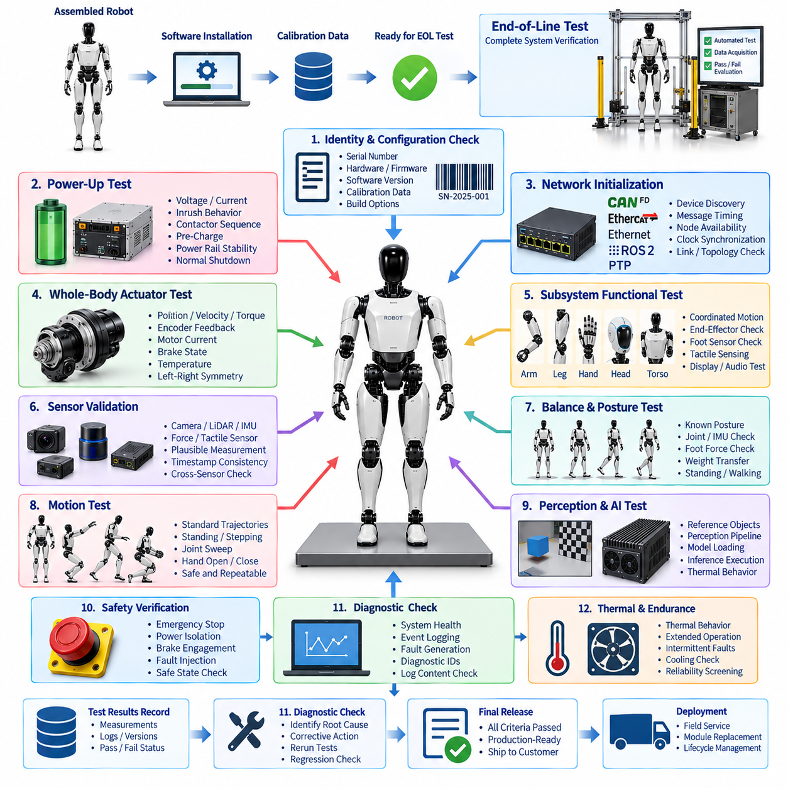
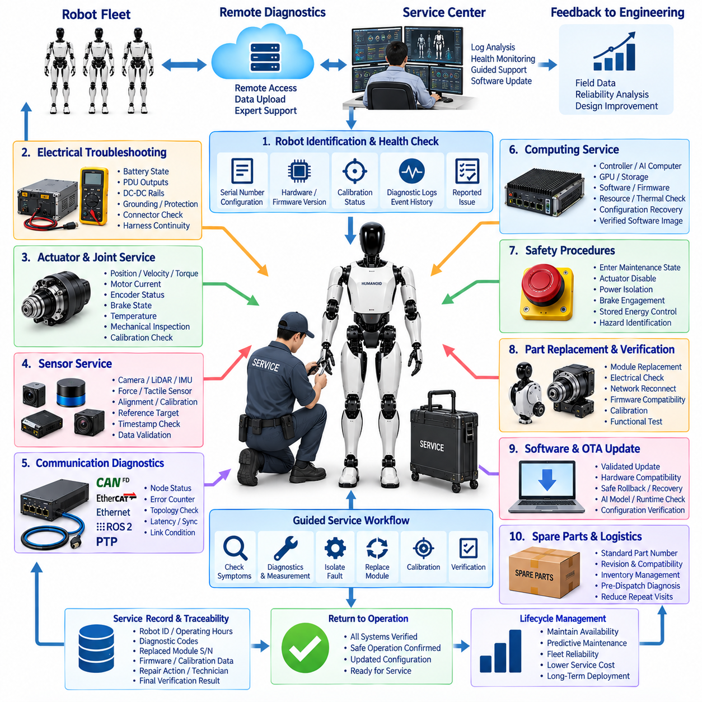
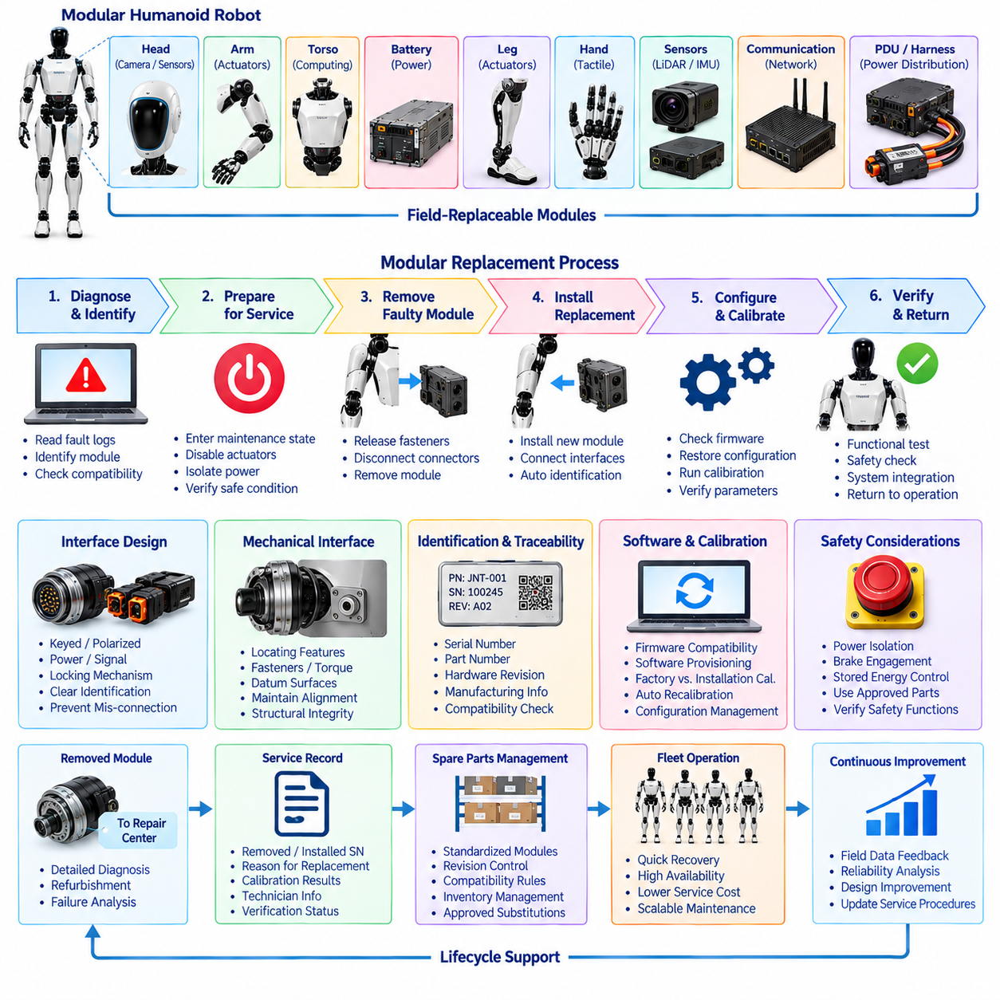
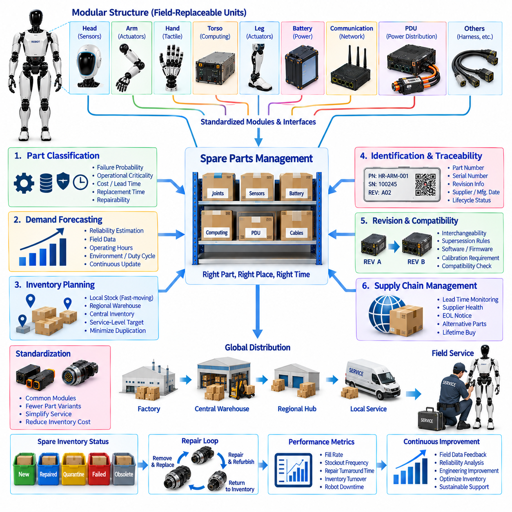
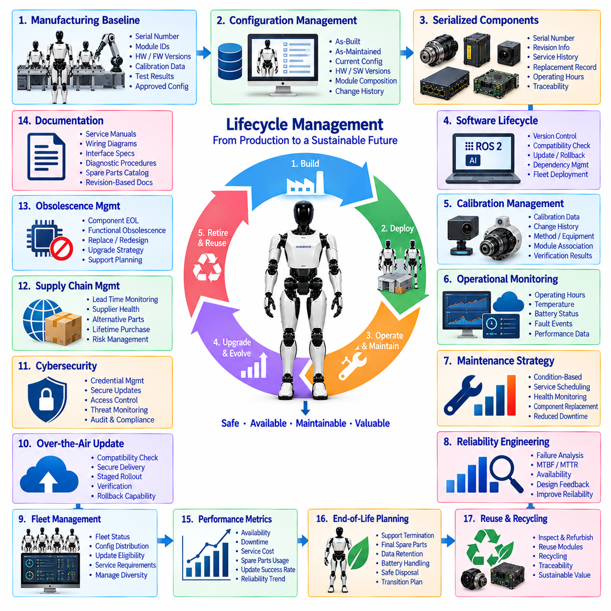

**Volume 21. Humanoid Electrical Architecture**


# Chapter 15. Manufacturing and Service

##  

## 15.01. Production Test

{width="7.268055555555556in" height="7.268055555555556in"}

Production testing for a humanoid robot verifies that every manufactured unit conforms to electrical, mechanical, communication, sensing, computing, and safety requirements before it proceeds to final system validation. Unlike prototype testing, production testing must be repeatable, automated where practical, traceable to individual serial numbers, and sufficiently fast to support manufacturing throughput without sacrificing defect detection capability.

The production test architecture should follow the modular structure of the humanoid itself. Battery modules, power distribution units, joint actuators, motor drives, encoders, torque sensors, brakes, perception modules, computing units, communication interfaces, and harness assemblies can first be tested independently. Module-level screening prevents defective components from propagating into higher-cost torso, arm, leg, hand, and complete-robot assembly stages.

Electrical inspection begins with verification of wiring continuity, insulation integrity, connector engagement, polarity, grounding, shielding, and protection devices. Automated fixtures can measure resistance between defined terminals and detect open circuits, shorts, excessive contact resistance, or incorrect pin assignments. Power rails are then energized in controlled stages so abnormal current consumption, undervoltage, overvoltage, leakage, or unexpected inrush behavior can be identified safely.

Power-system testing is particularly important because the humanoid architecture may contain high-current actuator buses together with multiple low-voltage supplies for sensors, communication devices, and computers. Battery interfaces, PDU outputs, DC-DC converters, contactors, fuses, pre-charge circuits, and emergency isolation paths should therefore be measured under representative electrical loads. Recorded voltage, current, temperature, and switching characteristics provide evidence that power distribution operates within specified limits.

Joint modules require automated functional testing because a humanoid can contain many tightly coordinated actuators. Each production station should command controlled position, velocity, and torque profiles while monitoring motor current, encoder position, torque feedback, temperature, vibration, and communication status. The resulting signatures can reveal assembly problems such as excessive friction, incorrect encoder alignment, abnormal gearbox behavior, brake drag, wiring errors, or improperly configured motor-drive parameters.

Calibration can be integrated directly into production testing rather than treated as an independent downstream activity. Encoder offsets, joint zero positions, torque-sensor offsets, current-sensor scaling, IMU biases, foot force sensors, tactile elements, and other measurable parameters can be calculated and stored in nonvolatile configuration data. Calibration records should remain associated with the hardware serial number so replacement modules can later be identified, validated, and restored to a known configuration.

Communication testing verifies every network interface used by the distributed humanoid architecture. CAN FD nodes can be checked for addressing, bitrate configuration, error counters, message timing, and bus termination, while EtherCAT devices can be validated for topology, distributed-clock behavior, state transitions, and cyclic communication. Ethernet, ROS 2 DDS, and PTP-related interfaces should likewise be exercised to confirm connectivity, bandwidth, discovery, timing, and synchronization behavior.

Sensor production tests should combine electrical verification with functional stimulus whenever possible. Cameras can observe calibrated visual targets, LiDAR units can measure reference surfaces, IMUs can be exposed to known orientations or motion, microphones can receive controlled acoustic signals, and force or tactile sensors can be subjected to calibrated loads. Testing against physical references helps distinguish defective sensors from failures caused by cabling, power delivery, configuration, synchronization, or software.

Computing hardware requires its own manufacturing checks before complete robot integration. Real-time controllers, AI computers, GPUs, storage devices, network interfaces, and thermal monitoring circuits should complete boot, memory, storage, interface, and workload tests. Firmware and software versions must also be verified because a mechanically correct robot assembled with incompatible firmware, configuration data, or AI runtime components may exhibit failures that resemble electrical hardware defects.

Safety-related production tests must verify actual protective behavior rather than merely confirm component presence. Emergency-stop circuits, power isolation, actuator disable paths, brake engagement, collision-related interfaces, redundant sensors, watchdogs, and safety communication should be deliberately exercised. Fault injection can verify that defined failures cause the expected transition to a safe or degraded operating state and that safety faults are correctly reported to diagnostic systems.

Automated test equipment should communicate with the robot through controlled manufacturing interfaces and collect measurements directly from test instruments and embedded diagnostic functions. A production test controller can sequence power activation, network discovery, firmware checks, actuator exercises, sensor stimulation, safety tests, and result evaluation. Automation reduces operator-dependent variation while allowing experienced technicians to investigate units that fail predefined acceptance limits.

A useful production strategy combines deterministic specification limits with statistical analysis. Simple characteristics such as supply voltage or termination resistance can use fixed pass/fail thresholds, whereas actuator current, friction estimates, sensor noise, thermal response, or communication latency may benefit from comparison with distributions collected from known-good units. Statistical process control can reveal manufacturing drift before individual products exceed formal specification boundaries.

Traceability transforms production testing from a temporary factory operation into lifecycle engineering data. Each test record should identify the robot serial number, module serial numbers, hardware revisions, firmware versions, calibration parameters, test-station identity, fixture revision, operator or automated process, timestamp, measured values, and final disposition. This information creates a baseline against which later field diagnostics and predictive-maintenance observations can be compared.

Failures should be classified rather than represented only by a generic test result. A failed unit may contain a component defect, assembly error, calibration deviation, firmware mismatch, configuration problem, connector fault, harness defect, or test-fixture issue. Recording structured failure codes and repair actions enables manufacturing engineers to calculate first-pass yield, identify recurring defects, improve supplier quality, and determine whether design changes are needed to improve manufacturability.

Production tests must also be designed for maintainability. Fixtures, adapters, reference loads, sensor targets, cables, and test software evolve as the humanoid hardware changes, so test configurations require revision control comparable to product engineering data. Golden units and calibrated reference equipment can be used to confirm that a test station remains healthy and to prevent fixture degradation from being incorrectly interpreted as increasing product failure rates.

The final objective is not simply to produce a PASS indication but to establish objective evidence that the manufactured humanoid matches its intended electrical architecture. Production testing connects design requirements, manufacturing processes, calibration, diagnostics, safety, and lifecycle records into one traceable quality system. This verified manufacturing baseline then provides the foundation for end-of-line testing, field service, modular replacement, spare-parts management, and long-term lifecycle management.

휴머노이드 로봇의 생산 시험(Production Testing)은 제조된 각 개체가 최종 시스템 검증 단계로 넘어가기 전에 전기(Electrical), 기계(Mechanical), 통신(Communication), 센싱(Sensing), 컴퓨팅(Computing), 안전(Safety) 요구사항을 충족하는지 검증하는 과정이다. 시제품 시험과 달리 생산 시험은 반복 가능해야 하며, 가능한 범위에서 자동화되고 개별 일련번호(Serial Number)까지 추적할 수 있어야 한다. 또한 결함 검출 능력을 저하시키지 않으면서 제조 처리량(Manufacturing Throughput)을 만족할 만큼 신속하게 수행되어야 한다.

생산 시험 아키텍처(Production Test Architecture)는 휴머노이드 자체의 모듈형 구조(Modular Structure)를 따라 구성하는 것이 바람직하다. 배터리 모듈(Battery Module), 전력 분배 장치(Power Distribution Unit), 관절 액추에이터(Joint Actuator), 모터 드라이브(Motor Drive), 엔코더(Encoder), 토크 센서(Torque Sensor), 브레이크(Brake), 인지 모듈(Perception Module), 컴퓨팅 장치(Computing Unit), 통신 인터페이스(Communication Interface), 하네스 어셈블리(Harness Assembly)를 먼저 독립적으로 시험할 수 있다. 모듈 수준 선별(Module-Level Screening)은 불량 부품이 더 높은 비용이 소요되는 몸통, 팔, 다리, 손 및 완성 로봇 조립 단계로 넘어가는 것을 방지한다.

전기 검사(Electrical Inspection)는 배선 연속성(Wiring Continuity), 절연 건전성(Insulation Integrity), 커넥터 체결(Connector Engagement), 극성(Polarity), 접지(Grounding), 차폐(Shielding), 보호 장치(Protection Device)를 검증하는 것에서 시작한다. 자동화 시험 지그(Automated Fixture)는 지정된 단자 사이의 저항을 측정하고 단선(Open Circuit), 단락(Short Circuit), 과도한 접촉 저항(Excessive Contact Resistance), 잘못된 핀 할당(Incorrect Pin Assignment)을 검출할 수 있다. 이후 전원 레일(Power Rail)을 제어된 단계로 활성화하여 비정상적인 전류 소비, 저전압, 과전압, 누설 또는 예상하지 못한 돌입전류(Inrush Current)를 안전하게 식별한다.

전력 시스템 시험(Power-System Testing)은 특히 중요하다. 휴머노이드 아키텍처에는 고전류 액추에이터 버스(High-Current Actuator Bus)와 센서, 통신 장치 및 컴퓨터를 위한 여러 저전압 전원(Low-Voltage Supply)이 함께 존재할 수 있기 때문이다. 따라서 배터리 인터페이스, PDU 출력, DC-DC 컨버터(DC-DC Converter), 컨택터(Contactor), 퓨즈(Fuse), 프리차지 회로(Pre-Charge Circuit), 비상 차단 경로(Emergency Isolation Path)를 대표적인 전기 부하 조건에서 측정해야 한다. 기록된 전압, 전류, 온도 및 스위칭 특성은 전력 분배 시스템이 규정된 한계 내에서 동작한다는 객관적인 근거를 제공한다.

휴머노이드는 다수의 액추에이터가 긴밀하게 협조하여 동작하므로 관절 모듈(Joint Module)에 대한 자동화 기능 시험(Automated Functional Testing)이 필요하다. 각 생산 시험 스테이션은 제어된 위치(Position), 속도(Velocity), 토크(Torque) 프로파일을 명령하면서 모터 전류, 엔코더 위치, 토크 피드백, 온도, 진동 및 통신 상태를 감시해야 한다. 이러한 시험 시그니처(Test Signature)를 통해 과도한 마찰, 잘못된 엔코더 정렬, 비정상적인 기어박스 동작, 브레이크 끌림(Brake Drag), 배선 오류 또는 부적절하게 설정된 모터 드라이브 파라미터와 같은 조립 문제를 발견할 수 있다.

교정(Calibration)은 별도의 후속 공정으로 취급하기보다 생산 시험에 직접 통합할 수 있다. 엔코더 오프셋(Encoder Offset), 관절 영점 위치(Joint Zero Position), 토크 센서 오프셋, 전류 센서 스케일링(Current-Sensor Scaling), IMU 바이어스(IMU Bias), 발 힘 센서(Foot Force Sensor), 촉각 소자(Tactile Element) 및 기타 측정 가능한 파라미터를 계산하여 비휘발성 설정 데이터(Nonvolatile Configuration Data)에 저장할 수 있다. 교정 기록은 하드웨어 일련번호와 연계하여 유지함으로써 향후 교체 모듈을 식별하고 검증하며 알려진 설정 상태로 복원할 수 있어야 한다.

통신 시험(Communication Testing)은 분산형 휴머노이드 아키텍처(Distributed Humanoid Architecture)에 사용되는 모든 네트워크 인터페이스를 검증한다. CAN FD 노드는 주소 설정, 비트레이트(Bitrate) 설정, 오류 카운터(Error Counter), 메시지 타이밍(Message Timing), 버스 종단(Bus Termination)을 검사할 수 있다. EtherCAT 장치는 토폴로지(Topology), 분산 클록(Distributed Clock) 동작, 상태 전환(State Transition), 주기 통신(Cyclic Communication)을 검증할 수 있다. 이와 함께 Ethernet, ROS 2 DDS 및 PTP 관련 인터페이스도 구동하여 연결성, 대역폭, 디스커버리(Discovery), 타이밍 및 시간 동기화(Time Synchronization) 동작을 확인해야 한다.

센서 생산 시험(Sensor Production Test)은 가능한 경우 전기적 검증과 기능적 자극(Functional Stimulus)을 결합해야 한다. 카메라는 교정된 시각 표적(Calibrated Visual Target)을 관찰하고, LiDAR는 기준 표면(Reference Surface)을 측정하며, IMU는 알려진 자세 또는 움직임 조건에 노출할 수 있다. 마이크는 제어된 음향 신호를 입력받고 힘 또는 촉각 센서는 교정된 하중(Calibrated Load)을 받을 수 있다. 물리적 기준을 이용한 시험은 센서 자체의 결함과 배선, 전원 공급, 설정, 동기화 또는 소프트웨어에서 발생한 고장을 구분하는 데 도움이 된다.

컴퓨팅 하드웨어(Computing Hardware)는 완성 로봇에 통합하기 전에 자체적인 제조 검사를 수행해야 한다. 실시간 제어기(Real-Time Controller), AI 컴퓨터(AI Computer), GPU, 저장장치(Storage Device), 네트워크 인터페이스 및 열 모니터링 회로(Thermal Monitoring Circuit)는 부팅, 메모리, 저장장치, 인터페이스 및 워크로드 시험(Workload Test)을 완료해야 한다. 펌웨어(Firmware)와 소프트웨어 버전도 검증해야 한다. 기계적으로 정상인 로봇이라도 호환되지 않는 펌웨어, 설정 데이터 또는 AI 런타임(AI Runtime)이 탑재되면 전기 하드웨어 결함과 유사한 고장 현상이 발생할 수 있기 때문이다.

안전 관련 생산 시험(Safety-Related Production Test)은 단순히 안전 부품이 장착되어 있는지를 확인하는 수준을 넘어 실제 보호 동작을 검증해야 한다. 비상 정지 회로(Emergency-Stop Circuit), 전원 차단(Power Isolation), 액추에이터 비활성화 경로(Actuator Disable Path), 브레이크 체결(Brake Engagement), 충돌 관련 인터페이스, 이중화 센서(Redundant Sensor), 워치독(Watchdog), 안전 통신(Safety Communication)을 의도적으로 작동시켜야 한다. 고장 주입(Fault Injection)을 통해 정의된 고장이 예상된 안전 상태 또는 성능 저하 상태(Degraded Operating State)로 전환되는지와 안전 고장이 진단 시스템에 올바르게 보고되는지를 검증할 수 있다.

자동화 시험 장비(Automated Test Equipment)는 통제된 제조 인터페이스(Manufacturing Interface)를 통해 로봇과 통신하고 시험 계측기와 내장 진단 기능(Embedded Diagnostic Function)으로부터 측정값을 직접 수집해야 한다. 생산 시험 제어기(Production Test Controller)는 전원 활성화, 네트워크 디스커버리, 펌웨어 검사, 액추에이터 구동, 센서 자극, 안전 시험 및 결과 판정을 순차적으로 수행할 수 있다. 자동화는 작업자에 따른 편차를 감소시키는 동시에 사전에 정의된 허용 한계를 벗어난 개체를 숙련된 기술자가 집중적으로 분석할 수 있도록 한다.

효과적인 생산 전략은 결정론적 규격 한계(Deterministic Specification Limit)와 통계 분석(Statistical Analysis)을 함께 활용한다. 공급 전압이나 종단 저항처럼 단순한 특성에는 고정된 합격/불합격(Pass/Fail) 기준을 적용할 수 있다. 반면 액추에이터 전류, 마찰 추정값, 센서 노이즈, 열 응답 또는 통신 지연은 정상 제품(Known-Good Unit)에서 수집된 분포와 비교하는 방식이 유용할 수 있다. 통계적 공정 관리(Statistical Process Control)는 개별 제품이 공식 규격 한계를 벗어나기 전에 제조 공정의 변화나 편향을 발견할 수 있게 한다.

추적성(Traceability)은 생산 시험을 일시적인 공장 작업이 아니라 제품 수명주기 엔지니어링 데이터(Lifecycle Engineering Data)로 전환한다. 각 시험 기록에는 로봇 일련번호, 모듈 일련번호, 하드웨어 리비전(Hardware Revision), 펌웨어 버전, 교정 파라미터, 시험 스테이션 식별정보, 시험 지그 리비전(Fixture Revision), 작업자 또는 자동화 공정, 타임스탬프(Timestamp), 측정값 및 최종 판정 결과가 포함되어야 한다. 이러한 정보는 향후 현장 진단(Field Diagnostics)과 예지 정비(Predictive Maintenance) 관측 결과를 비교할 수 있는 기준선(Baseline)을 형성한다.

고장은 단순한 시험 실패 결과로만 표시하지 않고 유형별로 분류해야 한다. 시험에 실패한 제품에는 부품 결함(Component Defect), 조립 오류(Assembly Error), 교정 편차(Calibration Deviation), 펌웨어 불일치(Firmware Mismatch), 설정 문제(Configuration Problem), 커넥터 고장, 하네스 결함 또는 시험 지그 문제가 존재할 수 있다. 구조화된 고장 코드(Failure Code)와 수리 조치(Repair Action)를 기록하면 제조 엔지니어가 초도 합격률(First-Pass Yield)을 계산하고 반복적인 결함을 식별하며 공급업체 품질을 개선하고 제조 용이성(Manufacturability) 향상을 위한 설계 변경의 필요성을 판단할 수 있다.

생산 시험 시스템 자체도 유지보수성(Maintainability)을 고려하여 설계해야 한다. 휴머노이드 하드웨어가 변경됨에 따라 시험 지그, 어댑터, 기준 부하(Reference Load), 센서 표적, 케이블 및 시험 소프트웨어도 함께 변경되므로 시험 설정에는 제품 엔지니어링 데이터와 동등한 수준의 리비전 관리(Revision Control)가 필요하다. 골든 유닛(Golden Unit)과 교정된 기준 장비(Calibrated Reference Equipment)를 이용하여 시험 스테이션의 정상 상태를 확인하면 시험 설비의 열화를 제품 불량률 증가로 잘못 판단하는 문제를 방지할 수 있다.

최종 목표는 단순히 합격(PASS) 표시를 생성하는 것이 아니라 제조된 휴머노이드가 의도된 전기 아키텍처(Electrical Architecture)와 일치한다는 객관적인 증거를 확보하는 것이다. 생산 시험은 설계 요구사항, 제조 공정, 교정, 진단, 안전 및 수명주기 기록을 하나의 추적 가능한 품질 시스템(Traceable Quality System)으로 연결한다. 이렇게 검증된 제조 기준선(Manufacturing Baseline)은 이후의 출하 최종 시험(End-of-Line Testing), 현장 서비스(Field Service), 모듈 교체(Modular Replacement), 예비 부품 관리(Spare-Parts Management), 장기 수명주기 관리(Lifecycle Management)를 위한 기반이 된다.

##  

## 15.02. End of Line Test

{width="7.268055555555556in" height="7.268055555555556in"}

End-of-line testing is the final integrated verification performed after the humanoid robot has completed mechanical assembly, electrical integration, software installation, and production-level calibration. Its purpose is to determine whether the complete robot behaves as an operational system rather than merely confirming that individual modules passed earlier tests. The EOL process therefore evaluates interactions among power, actuation, sensing, communication, computing, diagnostics, and safety functions.

Unlike module-level production testing, end-of-line testing examines the assembled humanoid under conditions representative of actual operation. The robot should boot from its production configuration, initialize all distributed controllers, establish communication networks, synchronize clocks, load calibration parameters, and report system health without manual correction. Any configuration mismatch or integration defect discovered at this stage must be resolved before the unit can be released.

The EOL sequence normally begins with identity and configuration verification. The robot serial number, module identifiers, hardware revisions, firmware versions, software packages, calibration datasets, and manufacturing options are compared with the intended build configuration. This prevents a physically functional robot from leaving production with an incorrect controller, incompatible firmware, outdated AI runtime, wrong calibration file, or unintended hardware option.

A controlled power-up test verifies the complete energy path from the battery system through the PDU, converters, protection devices, controllers, sensors, computers, and actuators. Voltage, current, inrush behavior, contactor sequencing, pre-charge operation, and power-rail stability can be monitored throughout startup. The test should also confirm orderly shutdown and verify that abnormal power conditions are detected and recorded by the diagnostic architecture.

Network initialization is evaluated after electrical stability has been established. CAN FD, EtherCAT, Gigabit Ethernet, ROS 2 DDS, and other configured communication domains must discover their expected devices and reach defined operational states. Message timing, packet errors, node availability, distributed-clock behavior, and PTP synchronization can be monitored to detect topology errors, termination problems, unstable links, or incorrectly configured devices.

Whole-body actuator verification confirms that all installed joints respond correctly within the assembled mechanical structure. Each joint can execute low-risk position, velocity, and torque trajectories while the EOL controller observes encoder feedback, motor current, torque response, brake state, temperature, and communication status. Left-right symmetry and expected motion ranges provide additional methods for detecting incorrect assembly, reversed orientation, excessive friction, or calibration errors.

The arm, leg, hand, head, and torso subsystems should subsequently be tested as coordinated functional groups. Arm testing can verify shoulder-to-wrist motion and end-effector interfaces, while leg testing can evaluate hip, knee, ankle, and foot-sensor relationships. Hand tests can exercise finger actuators and tactile sensing, and head tests can confirm perception devices, microphones, speakers, displays, and associated computing interfaces.

Sensor validation at EOL verifies not only individual sensor operation but also their installed geometry and system-level data availability. Cameras, LiDAR, IMUs, force sensors, tactile sensors, joint encoders, and other perception sources should produce plausible measurements from their final mounting positions. Timestamp consistency and cross-sensor relationships are particularly important because perception and balance algorithms depend on correctly synchronized and calibrated observations.

Balance and posture testing provides an important transition from component verification to humanoid-level behavior. With appropriate physical restraints or a controlled support fixture, the robot can establish a known posture and compare joint states, IMU orientation, foot forces, and commanded torque distributions. Progressive tests may then confirm stable standing and controlled weight transfer while monitoring whether the balance-control interface receives consistent sensor and actuator information.

Functional motion testing should use standardized trajectories that are safe, repeatable, and sufficiently sensitive to integration defects. Depending on the robot design, these may include standing, joint sweeps, arm positioning, hand opening and closing, controlled stepping, or short walking sequences. The objective is not to demonstrate maximum dynamic performance but to prove that the production unit can execute representative coordinated motions within defined acceptance limits.

Perception and AI computing can also be checked using controlled EOL scenarios. Reference objects, visual targets, known spatial features, or predefined sensor inputs allow the system to confirm that perception data reaches the appropriate computing pipeline. AI computers and GPUs can execute standardized workloads to verify model loading, inference execution, resource availability, thermal behavior, and communication with the real-time control architecture.

Safety verification must remain independent of successful normal operation. Emergency stops, actuator disable commands, power isolation, brake engagement, watchdog responses, communication-loss handling, and relevant collision or protective functions should be deliberately exercised. The system must demonstrate the specified transition to a safe or degraded state, while diagnostic logs should capture the initiating fault, affected subsystem, system response, and recovery conditions.

Diagnostic completeness is another important EOL criterion because a robot that operates correctly but cannot identify future faults creates significant field-service risk. The EOL station should query health information from major modules, verify event logging, confirm diagnostic identifiers, and intentionally generate selected recoverable faults. Recorded events must contain sufficient information to associate the condition with the correct robot, module, timestamp, operating state, and software configuration.

Thermal and endurance screening may be incorporated when manufacturing time permits. Running actuators, computers, communication devices, and sensors for a defined period can reveal intermittent connectors, marginal cooling, unstable power electronics, memory faults, or components that fail only after reaching operating temperature. Test duration should be optimized using reliability evidence because excessively long EOL cycles can become a major manufacturing bottleneck.

Automated EOL equipment should execute standardized procedures and collect objective measurements rather than depending primarily on operator judgment. The test system can control fixtures, safety restraints, external targets, network analyzers, power instrumentation, and robot commands while continuously acquiring results. Acceptance limits should be version-controlled so that every manufactured unit is evaluated against the requirements applicable to its specific hardware and software configuration.

All EOL results should become part of the robot\'s permanent manufacturing record. The dataset can include serial numbers, configuration information, calibration versions, measured values, test results, diagnostic logs, software versions, failure history, repair actions, retest status, and final release authorization. This record establishes the reference condition of the robot at the moment it leaves manufacturing and supports later comparison with field-service data.

A failed EOL test should initiate a controlled repair-and-retest process rather than allowing informal adjustment followed by shipment. The failed subsystem must be identified, corrective action recorded, affected tests repeated, and any broader regression testing performed when the repair could influence other functions. Repeated failures across multiple robots should feed manufacturing quality analysis and may indicate supplier, process, software, calibration, or design problems.

The final release decision combines configuration correctness, electrical integrity, communication stability, actuator performance, sensor validity, computing operation, diagnostic completeness, functional behavior, and safety verification. A humanoid should be considered production-ready only when the complete evidence set satisfies defined acceptance criteria. End-of-line testing therefore forms the formal boundary between manufacturing integration and subsequent shipment, deployment, field service, modular replacement, and lifecycle management.

출하 최종 시험(End-of-Line Testing)은 휴머노이드 로봇의 기계 조립(Mechanical Assembly), 전기 통합(Electrical Integration), 소프트웨어 설치(Software Installation), 생산 수준 교정(Production-Level Calibration)이 완료된 후 수행하는 최종 통합 검증(Final Integrated Verification)이다. 목적은 개별 모듈이 이전 시험을 통과했는지만 확인하는 것이 아니라 완성된 로봇이 하나의 운영 시스템(Operational System)으로 올바르게 동작하는지를 판단하는 것이다. 따라서 EOL 공정은 전력, 구동, 센싱, 통신, 컴퓨팅, 진단 및 안전 기능 사이의 상호작용을 평가한다.

모듈 수준 생산 시험(Module-Level Production Testing)과 달리 출하 최종 시험(End-of-Line Testing)은 실제 운용을 대표하는 조건에서 조립이 완료된 휴머노이드를 평가한다. 로봇은 생산용 설정(Production Configuration)으로 부팅하고 모든 분산 제어기(Distributed Controller)를 초기화하며, 통신 네트워크를 구성하고 클록을 동기화하며 교정 파라미터를 불러온 후 별도의 수동 수정 없이 시스템 상태(System Health)를 보고할 수 있어야 한다. 이 단계에서 발견된 설정 불일치나 통합 결함은 제품 출하 전에 반드시 해결되어야 한다.

EOL 시험 절차는 일반적으로 식별정보 및 설정 검증(Identity and Configuration Verification)으로 시작한다. 로봇 일련번호, 모듈 식별자, 하드웨어 리비전(Hardware Revision), 펌웨어 버전(Firmware Version), 소프트웨어 패키지, 교정 데이터셋(Calibration Dataset), 제조 옵션을 의도된 제품 구성(Build Configuration)과 비교한다. 이를 통해 물리적으로 정상 동작하는 로봇이라도 잘못된 제어기, 호환되지 않는 펌웨어, 오래된 AI 런타임(AI Runtime), 잘못된 교정 파일 또는 의도하지 않은 하드웨어 옵션이 적용된 상태로 출하되는 것을 방지한다.

제어된 전원 인가 시험(Controlled Power-Up Test)은 배터리 시스템에서 PDU, 컨버터(Converter), 보호 장치, 제어기, 센서, 컴퓨터 및 액추에이터까지 이어지는 전체 에너지 경로를 검증한다. 시동 과정에서 전압, 전류, 돌입전류(Inrush Current), 컨택터 시퀀싱(Contactor Sequencing), 프리차지(Pre-Charge) 동작 및 전원 레일 안정성(Power-Rail Stability)을 감시할 수 있다. 또한 정상적인 순차 종료(Orderly Shutdown)를 확인하고 비정상적인 전원 상태가 진단 아키텍처(Diagnostic Architecture)에 의해 탐지되고 기록되는지도 검증해야 한다.

전기적 안정성이 확보된 후에는 네트워크 초기화(Network Initialization)를 평가한다. CAN FD, EtherCAT, 기가비트 이더넷(Gigabit Ethernet), ROS 2 DDS 및 기타 구성된 통신 도메인(Communication Domain)은 예상된 장치를 검색하고 정의된 운용 상태에 도달해야 한다. 메시지 타이밍, 패킷 오류, 노드 가용성(Node Availability), 분산 클록(Distributed Clock) 동작 및 PTP 동기화를 감시하여 토폴로지 오류, 종단 문제, 불안정한 링크 또는 잘못 설정된 장치를 검출할 수 있다.

전신 액추에이터 검증(Whole-Body Actuator Verification)은 설치된 모든 관절이 완성된 기계 구조 내에서 올바르게 반응하는지를 확인한다. 각 관절은 저위험 위치, 속도 및 토크 궤적을 실행하고 EOL 제어기는 엔코더 피드백, 모터 전류, 토크 응답, 브레이크 상태, 온도 및 통신 상태를 관찰한다. 좌우 대칭성(Left-Right Symmetry)과 예상 운동 범위(Expected Motion Range)를 함께 비교하면 잘못된 조립, 반대 방향 설치, 과도한 마찰 또는 교정 오류를 추가적으로 검출할 수 있다.

이후 팔, 다리, 손, 머리 및 몸통 서브시스템(Subsystem)을 서로 연계된 기능 그룹으로 시험해야 한다. 팔 시험은 어깨부터 손목까지의 움직임과 엔드 이펙터 인터페이스(End-Effector Interface)를 검증할 수 있으며, 다리 시험은 고관절, 무릎, 발목 및 발 센서 사이의 관계를 평가할 수 있다. 손 시험에서는 손가락 액추에이터와 촉각 센싱(Tactile Sensing)을 확인하고, 머리 시험에서는 인지 장치, 마이크, 스피커, 디스플레이 및 관련 컴퓨팅 인터페이스를 검증할 수 있다.

EOL 단계의 센서 검증(Sensor Validation)은 개별 센서의 동작뿐만 아니라 최종 장착 상태의 기하학적 관계(Installed Geometry)와 시스템 수준의 데이터 가용성(System-Level Data Availability)을 함께 확인한다. 카메라, LiDAR, IMU, 힘 센서, 촉각 센서, 관절 엔코더 및 기타 인지 정보원은 최종 장착 위치에서 타당한 측정값을 생성해야 한다. 특히 인지 및 균형 알고리즘은 정확하게 동기화되고 교정된 관측값에 의존하므로 타임스탬프 일관성(Timestamp Consistency)과 센서 간 관계(Cross-Sensor Relationship)가 중요하다.

균형 및 자세 시험(Balance and Posture Testing)은 부품 수준의 검증에서 휴머노이드 수준의 동작 검증으로 전환되는 중요한 단계이다. 적절한 물리적 구속 장치(Physical Restraint) 또는 제어된 지지 지그(Support Fixture)를 사용하여 로봇을 알려진 자세로 설정하고 관절 상태, IMU 자세, 발 하중 및 명령 토크 분포를 비교할 수 있다. 이후 단계적으로 안정적인 기립(Stable Standing)과 제어된 체중 이동(Controlled Weight Transfer)을 확인하면서 균형 제어 인터페이스가 일관된 센서 및 액추에이터 정보를 수신하는지를 감시할 수 있다.

기능 동작 시험(Functional Motion Testing)은 안전하고 반복 가능하며 통합 결함을 충분히 검출할 수 있는 표준화된 궤적(Standardized Trajectory)을 사용해야 한다. 로봇 설계에 따라 기립, 관절 스윕(Joint Sweep), 팔 위치 제어, 손 개폐, 제어된 스텝 또는 짧은 보행 시퀀스 등이 포함될 수 있다. 목적은 최대 동적 성능(Maximum Dynamic Performance)을 시연하는 것이 아니라 생산된 개체가 정의된 허용 한계(Acceptance Limit) 내에서 대표적인 협조 동작(Coordinated Motion)을 수행할 수 있음을 입증하는 것이다.

인지 및 AI 컴퓨팅(Perception and AI Computing)도 제어된 EOL 시나리오를 통해 확인할 수 있다. 기준 객체(Reference Object), 시각 표적(Visual Target), 알려진 공간 특징 또는 사전에 정의된 센서 입력을 이용하여 인지 데이터가 적절한 컴퓨팅 파이프라인(Computing Pipeline)에 전달되는지를 확인한다. AI 컴퓨터와 GPU는 표준화된 워크로드를 실행하여 모델 로딩, 추론 실행(Inference Execution), 자원 가용성, 열적 동작 및 실시간 제어 아키텍처(Real-Time Control Architecture)와의 통신을 검증할 수 있다.

안전 검증(Safety Verification)은 정상 동작의 성공 여부와 독립적으로 수행되어야 한다. 비상 정지(Emergency Stop), 액추에이터 비활성화 명령, 전원 차단(Power Isolation), 브레이크 체결, 워치독(Watchdog) 응답, 통신 두절 처리 및 관련 충돌 또는 보호 기능을 의도적으로 작동시켜야 한다. 시스템은 규정된 안전 상태(Safe State) 또는 성능 저하 상태(Degraded State)로 전환됨을 입증해야 하며, 진단 로그에는 고장을 유발한 원인, 영향을 받은 서브시스템, 시스템의 대응 및 복구 조건이 기록되어야 한다.

진단 완전성(Diagnostic Completeness) 역시 중요한 EOL 판정 기준이다. 정상적으로 동작하지만 향후 고장을 식별하지 못하는 로봇은 현장 서비스(Field Service)에 상당한 위험을 발생시키기 때문이다. EOL 스테이션은 주요 모듈의 상태 정보를 조회하고 이벤트 로깅(Event Logging)과 진단 식별자(Diagnostic Identifier)를 검증하며 선택된 복구 가능한 고장을 의도적으로 발생시켜야 한다. 기록된 이벤트에는 해당 상태를 올바른 로봇, 모듈, 타임스탬프, 운용 상태 및 소프트웨어 설정과 연계할 수 있는 충분한 정보가 포함되어야 한다.

제조 시간이 허용되는 경우 열 및 내구성 선별(Thermal and Endurance Screening)을 포함할 수 있다. 액추에이터, 컴퓨터, 통신 장치 및 센서를 일정 시간 동안 작동시키면 간헐적인 커넥터 문제, 불충분한 냉각, 불안정한 전력 전자장치, 메모리 오류 또는 운용 온도에 도달한 이후에만 발생하는 부품 고장을 발견할 수 있다. 지나치게 긴 EOL 시험 주기는 제조 공정의 주요 병목이 될 수 있으므로 시험 시간은 신뢰성 근거(Reliability Evidence)를 기반으로 최적화해야 한다.

자동화 EOL 장비(Automated EOL Equipment)는 작업자의 주관적인 판단에 주로 의존하지 않고 표준화된 절차를 실행하며 객관적인 측정값을 수집해야 한다. 시험 시스템은 지그, 안전 구속 장치, 외부 표적, 네트워크 분석기, 전력 계측기 및 로봇 명령을 제어하면서 시험 결과를 지속적으로 수집할 수 있다. 허용 기준(Acceptance Limit)은 버전 관리되어야 하며 각 제조 개체가 해당 하드웨어 및 소프트웨어 구성에 적용되는 요구사항을 기준으로 평가되도록 해야 한다.

모든 EOL 결과는 로봇의 영구 제조 기록(Permanent Manufacturing Record)의 일부가 되어야 한다. 데이터셋에는 일련번호, 설정 정보, 교정 버전, 측정값, 시험 결과, 진단 로그, 소프트웨어 버전, 고장 이력, 수리 조치, 재시험 상태 및 최종 출하 승인(Final Release Authorization)을 포함할 수 있다. 이러한 기록은 로봇이 제조 공정을 떠나는 시점의 기준 상태(Reference Condition)를 확립하며 이후 현장 서비스 데이터와 비교하기 위한 기준을 제공한다.

EOL 시험에 실패한 경우 비공식적인 조정 후 출하하는 것이 아니라 통제된 수리 및 재시험 절차(Controlled Repair-and-Retest Process)를 시작해야 한다. 실패한 서브시스템을 식별하고 시정 조치(Corrective Action)를 기록하며 영향을 받은 시험을 다시 수행해야 한다. 수리가 다른 기능에 영향을 줄 가능성이 있다면 더 광범위한 회귀 시험(Regression Testing)도 수행해야 한다. 여러 로봇에서 동일한 고장이 반복된다면 제조 품질 분석으로 연결하여 공급업체, 공정, 소프트웨어, 교정 또는 설계상의 문제 여부를 판단해야 한다.

최종 출하 판정(Final Release Decision)은 설정 정확성(Configuration Correctness), 전기적 건전성(Electrical Integrity), 통신 안정성, 액추에이터 성능, 센서 유효성, 컴퓨팅 동작, 진단 완전성, 기능 동작 및 안전 검증 결과를 종합하여 이루어진다. 완전한 검증 증거 세트(Evidence Set)가 정의된 허용 기준을 만족하는 경우에만 휴머노이드를 생산 준비 완료(Production-Ready) 상태로 판단해야 한다. 따라서 출하 최종 시험(End-of-Line Testing)은 제조 통합과 이후의 출하, 배치(Deployment), 현장 서비스, 모듈 교체(Modular Replacement) 및 수명주기 관리(Lifecycle Management)를 구분하는 공식적인 경계가 된다.

##  

## 15.03. Field Service

{width="7.268055555555556in" height="7.268055555555556in"}

Field service for a humanoid robot provides the processes, tools, diagnostic capabilities, and technical information required to maintain safe and reliable operation after deployment. Unlike factory production testing, field service must operate under less controlled conditions and often with limited equipment. The service architecture should therefore enable technicians to identify faults quickly, isolate affected modules, restore functionality, and verify the robot before returning it to operation.

A humanoid field-service strategy should reflect the modular organization of the electrical architecture. Arms, legs, hands, head modules, joint actuators, battery assemblies, power distribution units, sensors, computing devices, communication nodes, and harness sections should expose identifiable service boundaries. Clear module interfaces reduce troubleshooting complexity and allow defective assemblies to be replaced without unnecessary disassembly of unrelated robot structures.

Service activity normally begins with robot identification and health assessment. The technician should confirm the robot serial number, hardware configuration, firmware and software versions, calibration status, operating history, and reported fault condition. Diagnostic systems can then retrieve active and historical events from distributed controllers, allowing the service process to distinguish persistent hardware failures from intermittent communication, configuration, thermal, power, or software-related problems.

Remote diagnostics can reduce the need for immediate physical intervention. When network connectivity and security policies permit, authorized service personnel may retrieve health information, diagnostic logs, temperatures, voltages, communication statistics, software versions, and selected operational data. Remote analysis can determine whether the problem can be corrected through configuration, software recovery, or guided inspection, or whether an on-site technician and replacement hardware are required.

Electrical troubleshooting should proceed through controlled measurements rather than trial-and-error replacement. Battery state, PDU outputs, DC-DC converter rails, grounding paths, protection devices, connector integrity, and harness continuity can be examined according to predefined diagnostic procedures. Voltage and current measurements should be interpreted together with stored diagnostic events so that a downstream short circuit, degraded connector, overloaded actuator, or unstable supply can be differentiated efficiently.

Joint and actuator faults require access to both electrical and mechanical diagnostic information. Service tools should display commanded and measured position, velocity, torque, motor current, encoder status, brake state, temperature, and communication condition. Comparing these signals can help distinguish a motor-drive problem from encoder misalignment, excessive mechanical friction, brake malfunction, gearbox degradation, wiring damage, or incorrect calibration parameters.

Sensor service should preserve the geometric and temporal relationships required by perception and control. Replacement of a camera, LiDAR, IMU, force sensor, tactile device, or joint encoder may require calibration or validation after installation. The service procedure should therefore define reference targets, known poses, loading conditions, or automated routines that confirm sensor orientation, offset, scaling, timestamp behavior, and data availability before normal operation resumes.

Communication diagnostics are essential because distributed humanoid systems depend on several interconnected networks. CAN FD, EtherCAT, Ethernet, ROS 2 DDS, and PTP-related problems may appear as actuator, sensor, or computing failures even when the endpoint hardware is healthy. Service tools should expose node status, error counters, topology information, communication latency, synchronization state, and link condition so technicians can identify the actual source of a network-related fault.

Computing service covers real-time controllers, AI computers, GPUs, storage devices, network interfaces, firmware, and runtime software. A technician should be able to determine whether a failure originates from hardware, corrupted storage, incompatible firmware, resource exhaustion, thermal protection, or software configuration. Recovery procedures should use controlled software images and verified configuration packages rather than untracked manual changes that could compromise system consistency.

Safety must govern every field-service operation. Before technicians access joints, power electronics, batteries, or internal wiring, the robot should enter a defined maintenance state with appropriate actuator disable, power isolation, brake engagement, and stored-energy controls. Emergency-stop functions and other protective mechanisms should remain available where required, while service documentation should clearly identify hazardous voltage, moving mechanisms, pinch points, hot surfaces, and heavy modules.

After a component is repaired or replaced, the robot should not immediately return to normal operation. A post-service verification sequence should confirm electrical integrity, network connectivity, module identification, firmware compatibility, calibration status, diagnostic health, and relevant functional behavior. If a joint module is replaced, for example, encoder alignment, torque sensing, brake operation, motion limits, and coordinated control may all require verification before the robot is released.

Calibration management is especially important for modular field replacement. Calibration parameters may belong to an individual sensor or actuator, to its installed location, or to relationships between several components. Service software should therefore determine which calibration data can follow a replacement module and which values must be regenerated after installation. Updated calibration records should be associated with both the robot and the newly installed module.

Service tools should provide guided diagnostic workflows that convert complex system information into repeatable troubleshooting procedures. Instead of requiring every technician to understand the complete humanoid architecture, the tool can lead the user from observed symptoms through health checks, measurements, isolation tests, replacement decisions, calibration, and verification. Expert-level raw data should remain accessible for engineering investigation when standard procedures cannot resolve the fault.

Traceability should continue throughout the field-service lifecycle. Each intervention should record the robot identifier, operating hours, reported symptom, diagnostic codes, affected module, removed and installed serial numbers, firmware versions, calibration changes, measurements, repair actions, technician identity, and final verification result. This service history provides evidence for warranty decisions and creates valuable data for reliability engineering and predictive maintenance.

Field-service data should also feed back into manufacturing and engineering. Repeated connector failures may indicate insufficient retention, recurring harness damage may reveal routing problems, and repeated actuator replacements may expose thermal or load assumptions that were not representative of actual operation. Aggregating service records across a robot fleet allows engineering teams to identify systematic weaknesses that cannot be recognized from isolated individual failures.

Software and over-the-air update mechanisms should be coordinated with service processes. A field problem may be corrected by a validated software update, but the service system must verify compatibility among hardware revisions, firmware, calibration data, AI models, and runtime components. Update failures should support controlled rollback or recovery so that a service action does not leave the robot in an undefined configuration or unusable state.

Spare parts and service logistics directly affect robot availability. Frequently replaced modules should be identifiable through standardized part numbers, revision information, compatibility rules, and serialized records. Diagnostic information should help determine which replacement component is required before dispatch whenever possible, reducing repeated site visits and unnecessary inventory. Modular replacement therefore connects electrical architecture decisions directly with operational service cost.

The field-service architecture should ultimately minimize mean time to diagnose and mean time to repair while preserving safety and configuration integrity. Effective service combines onboard diagnostics, remote access, modular hardware, controlled replacement, calibration management, traceable records, and post-repair verification. These capabilities transform the humanoid from a complex prototype into a maintainable product that can support long-duration deployment, fleet operation, and systematic lifecycle management.

휴머노이드 로봇의 현장 서비스(Field Service)는 배치(Deployment) 이후에도 안전하고 신뢰성 있는 운용을 유지하기 위해 필요한 프로세스, 도구, 진단 기능 및 기술 정보를 제공한다. 공장의 생산 시험(Production Testing)과 달리 현장 서비스는 통제 수준이 낮은 환경에서 제한된 장비만으로 수행되는 경우가 많다. 따라서 서비스 아키텍처(Service Architecture)는 기술자가 고장을 신속하게 식별하고 영향을 받은 모듈을 격리하며 기능을 복구한 후 로봇을 다시 운용하기 전에 정상 상태를 검증할 수 있도록 구성되어야 한다.

휴머노이드 현장 서비스 전략(Field-Service Strategy)은 전기 아키텍처(Electrical Architecture)의 모듈형 구성(Modular Organization)을 반영해야 한다. 팔, 다리, 손, 머리 모듈, 관절 액추에이터, 배터리 어셈블리, 전력 분배 장치(Power Distribution Unit), 센서, 컴퓨팅 장치, 통신 노드 및 하네스 구간에는 명확하게 식별 가능한 서비스 경계(Service Boundary)가 있어야 한다. 명확한 모듈 인터페이스는 문제 해결의 복잡성을 줄이고 관련 없는 로봇 구조를 불필요하게 분해하지 않고도 결함이 있는 어셈블리를 교체할 수 있게 한다.

서비스 작업은 일반적으로 로봇 식별(Robot Identification)과 상태 평가(Health Assessment)에서 시작한다. 기술자는 로봇 일련번호, 하드웨어 구성, 펌웨어 및 소프트웨어 버전, 교정 상태(Calibration Status), 운용 이력 및 보고된 고장 상태를 확인해야 한다. 이후 진단 시스템은 분산 제어기(Distributed Controller)에서 현재 및 과거 이벤트를 검색하여 지속적인 하드웨어 고장과 간헐적인 통신, 설정, 열, 전원 또는 소프트웨어 관련 문제를 구분할 수 있도록 해야 한다.

원격 진단(Remote Diagnostics)은 즉각적인 물리적 개입의 필요성을 줄일 수 있다. 네트워크 연결과 보안 정책(Security Policy)이 허용되는 경우 승인된 서비스 담당자는 상태 정보, 진단 로그, 온도, 전압, 통신 통계, 소프트웨어 버전 및 선택된 운용 데이터를 원격으로 수집할 수 있다. 원격 분석을 통해 설정 변경, 소프트웨어 복구 또는 안내된 점검(Guided Inspection)으로 문제를 해결할 수 있는지, 아니면 현장 기술자와 교체 하드웨어가 필요한지를 판단할 수 있다.

전기적 문제 해결(Electrical Troubleshooting)은 시행착오식 부품 교체가 아니라 통제된 측정(Controlled Measurement)을 통해 진행해야 한다. 배터리 상태, PDU 출력, DC-DC 컨버터(DC-DC Converter) 전원 레일, 접지 경로, 보호 장치, 커넥터 건전성 및 하네스 연속성을 사전에 정의된 진단 절차에 따라 검사할 수 있다. 전압과 전류 측정값을 저장된 진단 이벤트와 함께 분석하면 하위 회로의 단락, 열화된 커넥터, 과부하 액추에이터 또는 불안정한 전원 공급을 효율적으로 구분할 수 있다.

관절 및 액추에이터 고장(Joint and Actuator Fault)은 전기적 진단 정보와 기계적 진단 정보에 모두 접근할 수 있어야 한다. 서비스 도구(Service Tool)는 명령값과 측정값에 해당하는 위치, 속도, 토크, 모터 전류, 엔코더 상태, 브레이크 상태, 온도 및 통신 상태를 표시해야 한다. 이러한 신호를 비교하면 모터 드라이브 문제를 엔코더 정렬 오류, 과도한 기계적 마찰, 브레이크 오작동, 기어박스 열화, 배선 손상 또는 잘못된 교정 파라미터와 구분하는 데 도움이 된다.

센서 서비스(Sensor Service)는 인지와 제어에 필요한 기하학적 및 시간적 관계(Geometric and Temporal Relationships)를 유지해야 한다. 카메라, LiDAR, IMU, 힘 센서, 촉각 장치 또는 관절 엔코더를 교체한 경우 설치 후 교정 또는 검증이 필요할 수 있다. 따라서 서비스 절차에서는 센서 방향, 오프셋, 스케일링(Scaling), 타임스탬프 동작 및 데이터 가용성을 확인할 수 있도록 기준 표적(Reference Target), 알려진 자세(Known Pose), 하중 조건 또는 자동화 루틴(Automated Routine)을 정의해야 한다.

분산형 휴머노이드 시스템(Distributed Humanoid System)은 여러 상호 연결된 네트워크에 의존하므로 통신 진단(Communication Diagnostics)이 필수적이다. CAN FD, EtherCAT, Ethernet, ROS 2 DDS 및 PTP 관련 문제는 실제 종단 하드웨어(Endpoint Hardware)가 정상임에도 액추에이터, 센서 또는 컴퓨팅 장치의 고장처럼 나타날 수 있다. 서비스 도구는 노드 상태, 오류 카운터, 토폴로지 정보, 통신 지연, 동기화 상태 및 링크 상태를 제공하여 기술자가 네트워크 관련 고장의 실제 원인을 식별할 수 있도록 해야 한다.

컴퓨팅 서비스(Computing Service)는 실시간 제어기(Real-Time Controller), AI 컴퓨터, GPU, 저장장치, 네트워크 인터페이스, 펌웨어 및 런타임 소프트웨어(Runtime Software)를 포함한다. 기술자는 고장이 하드웨어, 손상된 저장장치, 호환되지 않는 펌웨어, 자원 고갈(Resource Exhaustion), 열 보호(Thermal Protection) 또는 소프트웨어 설정에서 발생했는지를 판단할 수 있어야 한다. 복구 절차에서는 시스템 일관성을 훼손할 수 있는 추적되지 않은 수동 변경 대신 통제된 소프트웨어 이미지와 검증된 설정 패키지를 사용해야 한다.

모든 현장 서비스 작업은 안전(Safety)을 최우선으로 수행해야 한다. 기술자가 관절, 전력 전자장치, 배터리 또는 내부 배선에 접근하기 전에 로봇은 적절한 액추에이터 비활성화, 전원 차단, 브레이크 체결 및 저장 에너지 제어(Stored-Energy Control)가 적용된 정의된 유지보수 상태(Maintenance State)로 전환되어야 한다. 필요한 경우 비상 정지(Emergency Stop) 기능과 기타 보호 메커니즘을 유지해야 하며, 서비스 문서에는 위험 전압, 움직이는 기구, 끼임 지점(Pinch Point), 고온 표면 및 중량 모듈을 명확하게 표시해야 한다.

부품을 수리하거나 교체한 후에는 로봇을 즉시 정상 운용 상태로 복귀시켜서는 안 된다. 서비스 후 검증 절차(Post-Service Verification Sequence)를 통해 전기적 건전성, 네트워크 연결성, 모듈 식별정보, 펌웨어 호환성, 교정 상태, 진단 상태 및 관련 기능 동작을 확인해야 한다. 예를 들어 관절 모듈을 교체한 경우 로봇을 운용 상태로 복귀시키기 전에 엔코더 정렬, 토크 센싱, 브레이크 동작, 운동 한계 및 협조 제어(Coordinated Control)를 모두 검증해야 할 수 있다.

교정 관리(Calibration Management)는 모듈형 현장 교체(Modular Field Replacement)에서 특히 중요하다. 교정 파라미터는 개별 센서나 액추에이터에 속할 수도 있고 해당 부품의 설치 위치 또는 여러 부품 사이의 관계에 속할 수도 있다. 따라서 서비스 소프트웨어는 어떤 교정 데이터를 교체 모듈에 그대로 적용할 수 있는지와 설치 후 어떤 값을 다시 생성해야 하는지를 판단해야 한다. 갱신된 교정 기록은 로봇과 새롭게 설치된 모듈 모두에 연계되어야 한다.

서비스 도구는 복잡한 시스템 정보를 반복 가능한 문제 해결 절차로 변환하는 안내형 진단 워크플로(Guided Diagnostic Workflow)를 제공해야 한다. 모든 기술자가 전체 휴머노이드 아키텍처를 완전히 이해하도록 요구하는 대신, 서비스 도구가 관찰된 증상에서 시작하여 상태 점검, 측정, 격리 시험(Isolation Test), 교체 판단, 교정 및 검증까지 사용자를 단계적으로 안내할 수 있다. 표준 절차로 고장을 해결할 수 없는 경우 엔지니어링 분석을 위해 전문가 수준의 원시 데이터(Raw Data)에 접근할 수 있어야 한다.

추적성(Traceability)은 전체 현장 서비스 수명주기(Field-Service Lifecycle) 동안 지속되어야 한다. 각 서비스 작업에는 로봇 식별자, 운용 시간, 보고된 증상, 진단 코드, 영향을 받은 모듈, 제거 및 설치된 부품의 일련번호, 펌웨어 버전, 교정 변경 사항, 측정값, 수리 조치, 기술자 식별정보 및 최종 검증 결과를 기록해야 한다. 이러한 서비스 이력(Service History)은 보증 판단(Warranty Decision)을 위한 근거를 제공하고 신뢰성 엔지니어링(Reliability Engineering)과 예지 정비(Predictive Maintenance)를 위한 중요한 데이터를 생성한다.

현장 서비스 데이터(Field-Service Data)는 제조 및 엔지니어링에도 피드백되어야 한다. 반복적인 커넥터 고장은 체결력 부족을 나타낼 수 있고, 반복적인 하네스 손상은 배선 경로 문제를 드러낼 수 있으며, 액추에이터의 반복적인 교체는 실제 운용 조건을 충분히 반영하지 못한 열 또는 부하 가정을 나타낼 수 있다. 로봇 플릿(Fleet) 전체의 서비스 기록을 통합하면 개별 고장만으로는 식별하기 어려운 시스템적 취약점(Systematic Weakness)을 엔지니어링 팀이 발견할 수 있다.

소프트웨어 및 무선 업데이트(Over-the-Air Update) 메커니즘은 서비스 프로세스와 연계되어야 한다. 현장 문제를 검증된 소프트웨어 업데이트로 해결할 수 있지만 서비스 시스템은 하드웨어 리비전, 펌웨어, 교정 데이터, AI 모델 및 런타임 구성요소 사이의 호환성을 검증해야 한다. 업데이트에 실패한 경우 통제된 롤백(Rollback) 또는 복구(Recovery)를 지원하여 서비스 작업으로 인해 로봇이 정의되지 않은 설정 상태나 사용 불가능한 상태에 빠지는 것을 방지해야 한다.

예비 부품(Spare Parts)과 서비스 물류(Service Logistics)는 로봇 가용성(Robot Availability)에 직접적인 영향을 준다. 자주 교체되는 모듈은 표준화된 부품 번호, 리비전 정보, 호환성 규칙 및 일련번호 기반 기록을 통해 식별할 수 있어야 한다. 가능하면 기술자를 파견하기 전에 진단 정보를 이용하여 필요한 교체 부품을 결정함으로써 반복적인 현장 방문과 불필요한 재고를 줄여야 한다. 따라서 모듈형 교체(Modular Replacement)는 전기 아키텍처 설계 결정과 실제 운용 서비스 비용을 직접 연결한다.

현장 서비스 아키텍처(Field-Service Architecture)의 궁극적인 목표는 안전과 설정 무결성(Configuration Integrity)을 유지하면서 평균 진단 시간(Mean Time to Diagnose)과 평균 수리 시간(Mean Time to Repair)을 최소화하는 것이다. 효과적인 서비스는 온보드 진단(Onboard Diagnostics), 원격 접근(Remote Access), 모듈형 하드웨어, 통제된 교체, 교정 관리, 추적 가능한 기록 및 수리 후 검증(Post-Repair Verification)을 결합한다. 이러한 기능은 휴머노이드를 복잡한 시제품에서 장기간 배치, 플릿 운용 및 체계적인 수명주기 관리(Lifecycle Management)를 지원할 수 있는 유지보수 가능한 제품(Maintainable Product)으로 전환한다.

##  

## 15.04. Modular Replacement

{width="7.268055555555556in" height="7.268055555555556in"}

Modular replacement is a service-oriented design strategy that allows a humanoid robot to recover from hardware faults by exchanging complete functional modules instead of repairing individual components inside the deployed robot. The approach converts complex field repair into a controlled remove-and-replace operation, reducing service time while protecting electrical, mechanical, software, calibration, and safety integrity across the system.

A replacement architecture should be defined during product design rather than added after manufacturing begins. Arms, legs, hands, joint actuators, perception assemblies, battery modules, computing units, communication devices, power distribution components, and selected harness sections can be organized as field-replaceable units. Each boundary should provide clear mechanical attachment, electrical connection, communication interfaces, identification, and service access.

The appropriate replacement level depends on reliability, cost, accessibility, calibration complexity, and expected repair time. Replacing an entire leg for a minor connector fault may be unnecessarily expensive, while disassembling a high-density joint module in the field may require specialized tools and create additional risk. Service engineering should therefore establish a hierarchy of replaceable assemblies that balances module cost against diagnostic and repair effort.

Mechanical modularity requires repeatable mounting interfaces that preserve alignment and structural integrity after replacement. Locating features, fasteners, torque specifications, keyed interfaces, and mechanical datum surfaces should enable technicians to reinstall a module without introducing excessive positional variation. For load-bearing components such as legs and major joints, replacement procedures must also ensure that structural load paths and locking mechanisms are restored correctly.

Electrical interfaces should minimize opportunities for incorrect installation. Connectors can use keying, polarization, coding, locking mechanisms, and clear service identification to prevent cross-connection or incomplete engagement. Power and signal interfaces should be arranged so that high-current actuator circuits, low-voltage electronics, communication links, grounding, shielding, and safety circuits reconnect predictably when a module is exchanged.

Power isolation is required before modules containing actuators, batteries, converters, or exposed electrical interfaces are removed. The service sequence should place the robot in a defined maintenance state, disable motion, engage necessary brakes, isolate hazardous energy, and verify that stored electrical or mechanical energy has been controlled. Reconnection should follow a controlled sequence that prevents unexpected actuator activation, excessive inrush current, or unsafe power states.

Every replaceable module should carry an unambiguous identity. A serial number, part number, hardware revision, manufacturing information, and compatibility data can be stored physically and electronically. When a replacement is installed, the robot or service tool should identify the new module automatically where possible and compare its revision and capabilities against the system configuration before enabling normal operation.

Software compatibility becomes part of hardware replacement in a distributed humanoid architecture. A new joint controller, sensor module, or computing unit may contain a different firmware version from the removed device. The service system should determine whether the installed firmware is compatible, whether an update is required, and whether rollback is possible. Configuration management prevents mechanically compatible modules from producing system-level faults because of software differences.

Calibration data requires special treatment because different parameters belong to different physical relationships. Some values, such as sensor factory coefficients, may belong permanently to the replacement module, while joint zero offsets or camera extrinsics may depend on the installed position. The service workflow must distinguish reusable factory calibration from installation-dependent calibration and automatically request recalibration when the replacement changes a critical geometric or sensing relationship.

Joint-module replacement illustrates the interaction among these requirements. After a failed actuator assembly is removed, the replacement must be mechanically seated, electrically connected, identified, and checked for firmware compatibility. Encoder alignment, torque sensing, brake function, current response, motion limits, temperature monitoring, and communication status should then be verified before coordinated motion is permitted. This converts replacement into a controlled system integration procedure.

Sensor modules require similarly disciplined verification. A replacement camera, LiDAR, IMU, tactile sensor, or force sensor may communicate correctly while still providing inaccurate system information because of mounting or calibration errors. Reference targets, known poses, calibrated loads, or automated routines can verify orientation, offset, scaling, timestamp behavior, and data consistency before the sensor is accepted by perception or control functions.

Computing modules should support replacement through controlled software provisioning. When a real-time controller, AI computer, GPU platform, or storage device is exchanged, approved firmware, operating software, runtime components, AI models, security credentials, and configuration data should be restored from managed sources. Automated provisioning reduces manual configuration errors and allows the replacement computer to return to a known and traceable system state.

Communication interfaces must also recover predictably after replacement. CAN FD addresses, EtherCAT topology positions, Ethernet configuration, ROS 2 DDS parameters, and PTP synchronization settings may depend on module identity or physical location. The service process should confirm network discovery, node status, message timing, error counters, link quality, and synchronization before declaring the replaced module operational within the distributed architecture.

Safety-related modules require stronger replacement controls than ordinary functional components. Emergency-stop devices, safety controllers, redundant sensors, brakes, power isolation components, and other protective elements should use approved replacement parts and defined verification procedures. Replacement must not silently alter a safety function, and the affected protective behavior should be tested before the robot is returned to unrestricted operation.

Post-replacement verification should be proportional to the scope of the repair. A localized replacement may require electrical, communication, calibration, diagnostic, and functional checks of the affected subsystem, while replacement of a major computing, power, or structural module may require broader regression testing. The objective is to verify not only that the new component works but also that neighboring systems remain correctly integrated.

Traceability connects modular replacement with manufacturing, field service, and lifecycle management. Service records should identify the removed module, installed module, serial numbers, revisions, reason for replacement, diagnostic evidence, firmware changes, calibration results, technician actions, and final verification status. The robot configuration record must then be updated so future diagnostics accurately represent the hardware actually installed in the machine.

Modular replacement also influences spare-parts strategy. Standardized interfaces and controlled compatibility can allow a smaller number of service modules to support multiple robot revisions, while uncontrolled variation increases inventory and logistics complexity. Engineering teams should therefore manage backward compatibility, superseding part numbers, revision rules, and approved substitutions as part of the same configuration system used for manufacturing and service.

The long-term objective is to separate rapid operational recovery from detailed component repair. A defective field-replaceable module can be exchanged quickly at the deployment site and transferred to a specialized repair center for deeper diagnosis, refurbishment, or failure analysis. This architecture reduces mean time to repair, improves robot availability, preserves service quality, and creates a scalable maintenance model for large humanoid fleets.

모듈형 교체(Modular Replacement)는 배치된 로봇 내부에서 개별 부품을 직접 수리하는 대신 완전한 기능 모듈(Functional Module)을 교환하여 휴머노이드 로봇이 하드웨어 고장으로부터 복구할 수 있도록 하는 서비스 중심 설계 전략(Service-Oriented Design Strategy)이다. 이 접근법은 복잡한 현장 수리를 통제된 제거 및 교체(Remove-and-Replace) 작업으로 전환하여 서비스 시간을 단축하는 동시에 시스템 전체의 전기적, 기계적, 소프트웨어, 교정 및 안전 무결성을 보호한다.

교체 아키텍처(Replacement Architecture)는 제조가 시작된 이후 추가하는 것이 아니라 제품 설계 단계에서부터 정의해야 한다. 팔, 다리, 손, 관절 액추에이터, 인지 어셈블리(Perception Assembly), 배터리 모듈, 컴퓨팅 장치, 통신 장치, 전력 분배 구성요소 및 선택된 하네스 구간을 현장 교체 가능 장치(Field-Replaceable Unit)로 구성할 수 있다. 각 모듈 경계는 명확한 기계적 체결, 전기적 연결, 통신 인터페이스, 식별 기능 및 서비스 접근성을 제공해야 한다.

적절한 교체 수준(Replacement Level)은 신뢰성, 비용, 접근성, 교정 복잡성 및 예상 수리 시간에 따라 결정된다. 경미한 커넥터 고장 때문에 다리 전체를 교체하는 것은 불필요하게 높은 비용을 발생시킬 수 있는 반면, 고밀도 관절 모듈을 현장에서 분해하면 특수 도구가 필요하고 추가적인 위험이 발생할 수 있다. 따라서 서비스 엔지니어링(Service Engineering)은 모듈 비용과 진단 및 수리 작업량 사이의 균형을 고려하여 교체 가능한 어셈블리의 계층 구조를 설정해야 한다.

기계적 모듈성(Mechanical Modularity)을 구현하려면 교체 이후에도 정렬과 구조적 무결성(Structural Integrity)을 유지할 수 있는 반복 가능한 장착 인터페이스가 필요하다. 위치 결정 구조(Locating Feature), 체결부, 체결 토크 규격, 키 구조 인터페이스(Keyed Interface), 기계적 기준면(Mechanical Datum Surface)을 이용하여 기술자가 과도한 위치 편차를 발생시키지 않고 모듈을 다시 설치할 수 있어야 한다. 다리와 주요 관절 같은 하중 지지 부품의 경우 교체 절차를 통해 구조적 하중 경로와 잠금 메커니즘이 올바르게 복원되었는지도 확인해야 한다.

전기 인터페이스(Electrical Interface)는 잘못된 설치 가능성을 최소화하도록 설계해야 한다. 커넥터에는 키잉(Keying), 극성 구조(Polarization), 코딩(Coding), 잠금 메커니즘 및 명확한 서비스 식별정보를 적용하여 잘못된 연결이나 불완전한 체결을 방지할 수 있다. 전력 및 신호 인터페이스는 모듈 교환 시 고전류 액추에이터 회로, 저전압 전자장치, 통신 링크, 접지, 차폐 및 안전 회로가 예측 가능한 방식으로 다시 연결되도록 구성해야 한다.

액추에이터, 배터리, 컨버터 또는 노출된 전기 인터페이스를 포함하는 모듈을 제거하기 전에는 전원 차단(Power Isolation)이 필요하다. 서비스 절차에서는 로봇을 정의된 유지보수 상태(Maintenance State)로 전환하고 움직임을 비활성화하며 필요한 브레이크를 체결하고 위험 에너지를 차단한 후 저장된 전기적 또는 기계적 에너지가 통제되었는지를 검증해야 한다. 재연결 과정도 예상하지 못한 액추에이터 작동, 과도한 돌입전류(Inrush Current) 또는 위험한 전원 상태를 방지할 수 있는 통제된 순서를 따라야 한다.

모든 교체 가능 모듈(Replaceable Module)은 명확하고 모호하지 않은 식별정보를 가져야 한다. 일련번호(Serial Number), 부품 번호(Part Number), 하드웨어 리비전(Hardware Revision), 제조 정보 및 호환성 데이터를 물리적 및 전자적 형태로 저장할 수 있다. 교체 모듈이 설치되면 가능한 경우 로봇 또는 서비스 도구(Service Tool)가 새로운 모듈을 자동으로 식별하고 정상 운용을 허용하기 전에 해당 모듈의 리비전과 기능을 시스템 설정(System Configuration)과 비교해야 한다.

분산형 휴머노이드 아키텍처(Distributed Humanoid Architecture)에서는 소프트웨어 호환성(Software Compatibility)이 하드웨어 교체의 일부가 된다. 새로운 관절 제어기, 센서 모듈 또는 컴퓨팅 장치는 제거된 장치와 다른 펌웨어 버전을 포함할 수 있다. 서비스 시스템은 설치된 펌웨어의 호환 여부, 업데이트 필요 여부 및 롤백(Rollback) 가능 여부를 판단해야 한다. 설정 관리(Configuration Management)를 통해 기계적으로 호환되는 모듈이 소프트웨어 차이 때문에 시스템 수준의 고장을 발생시키는 것을 방지할 수 있다.

교정 데이터(Calibration Data)는 서로 다른 파라미터가 서로 다른 물리적 관계에 속하므로 특별하게 관리해야 한다. 센서 공장 보정 계수와 같은 일부 값은 교체 모듈 자체에 영구적으로 속할 수 있지만, 관절 영점 오프셋(Joint Zero Offset)이나 카메라 외부 파라미터(Camera Extrinsics)는 설치 위치에 따라 달라질 수 있다. 서비스 워크플로(Service Workflow)는 재사용 가능한 공장 교정(Factory Calibration)과 설치 종속 교정(Installation-Dependent Calibration)을 구분하고, 교체로 인해 중요한 기하학적 또는 센싱 관계가 변경되면 자동으로 재교정을 요청해야 한다.

관절 모듈 교체(Joint-Module Replacement)는 이러한 요구사항의 상호작용을 잘 보여준다. 고장 난 액추에이터 어셈블리를 제거한 후 교체품을 기계적으로 정확히 장착하고 전기적으로 연결하며 식별한 다음 펌웨어 호환성을 검사해야 한다. 이후 협조 동작(Coordinated Motion)을 허용하기 전에 엔코더 정렬, 토크 센싱, 브레이크 기능, 전류 응답, 운동 한계, 온도 모니터링 및 통신 상태를 검증해야 한다. 이를 통해 단순한 부품 교체를 통제된 시스템 통합 절차(System Integration Procedure)로 전환할 수 있다.

센서 모듈(Sensor Module) 역시 체계적인 검증이 필요하다. 교체된 카메라, LiDAR, IMU, 촉각 센서 또는 힘 센서는 정상적으로 통신하더라도 장착이나 교정 오류 때문에 부정확한 시스템 정보를 제공할 수 있다. 기준 표적(Reference Target), 알려진 자세(Known Pose), 교정된 하중(Calibrated Load) 또는 자동화 루틴을 이용하여 센서가 인지 또는 제어 기능에 사용되기 전에 방향, 오프셋, 스케일링(Scaling), 타임스탬프 동작 및 데이터 일관성을 검증할 수 있다.

컴퓨팅 모듈(Computing Module)은 통제된 소프트웨어 프로비저닝(Software Provisioning)을 통해 교체를 지원해야 한다. 실시간 제어기(Real-Time Controller), AI 컴퓨터, GPU 플랫폼 또는 저장장치를 교환할 때 승인된 펌웨어, 운영 소프트웨어, 런타임 구성요소(Runtime Component), AI 모델, 보안 자격증명(Security Credential) 및 설정 데이터를 관리되는 소스로부터 복원해야 한다. 자동화된 프로비저닝은 수동 설정 오류를 줄이고 교체된 컴퓨터를 알려지고 추적 가능한 시스템 상태로 복귀시킨다.

통신 인터페이스(Communication Interface)도 교체 후 예측 가능한 방식으로 복구되어야 한다. CAN FD 주소, EtherCAT 토폴로지 위치, Ethernet 설정, ROS 2 DDS 파라미터 및 PTP 동기화 설정은 모듈 식별정보 또는 물리적 위치에 따라 달라질 수 있다. 서비스 절차에서는 교체된 모듈이 분산형 아키텍처 내에서 정상적으로 동작한다고 판정하기 전에 네트워크 디스커버리(Network Discovery), 노드 상태, 메시지 타이밍, 오류 카운터, 링크 품질 및 동기화 상태를 확인해야 한다.

안전 관련 모듈(Safety-Related Module)은 일반 기능 부품보다 더 엄격한 교체 관리가 필요하다. 비상 정지 장치(Emergency-Stop Device), 안전 제어기(Safety Controller), 이중화 센서(Redundant Sensor), 브레이크, 전원 차단 구성요소 및 기타 보호 장치에는 승인된 교체 부품과 정의된 검증 절차를 적용해야 한다. 모듈 교체로 인해 안전 기능이 인지되지 않은 상태에서 변경되어서는 안 되며, 로봇을 제한 없는 정상 운용 상태로 복귀시키기 전에 영향을 받은 보호 기능을 반드시 시험해야 한다.

교체 후 검증(Post-Replacement Verification)의 범위는 수리 규모에 비례해야 한다. 국부적인 모듈 교체에는 해당 서브시스템의 전기, 통신, 교정, 진단 및 기능 검사가 필요할 수 있으며, 주요 컴퓨팅, 전력 또는 구조 모듈을 교체한 경우에는 더 광범위한 회귀 시험(Regression Testing)이 필요할 수 있다. 목적은 새로운 부품이 정상적으로 작동하는지만 확인하는 것이 아니라 주변 시스템도 올바르게 통합된 상태를 유지하고 있는지를 검증하는 것이다.

추적성(Traceability)은 모듈형 교체를 제조, 현장 서비스 및 수명주기 관리(Lifecycle Management)와 연결한다. 서비스 기록에는 제거된 모듈과 설치된 모듈, 일련번호, 리비전, 교체 사유, 진단 근거, 펌웨어 변경 사항, 교정 결과, 기술자의 작업 내용 및 최종 검증 상태를 기록해야 한다. 이후 로봇 설정 기록(Robot Configuration Record)을 갱신하여 향후 진단 시스템이 실제 로봇에 설치되어 있는 하드웨어 구성을 정확하게 반영하도록 해야 한다.

모듈형 교체는 예비 부품 전략(Spare-Parts Strategy)에도 영향을 미친다. 표준화된 인터페이스와 통제된 호환성은 더 적은 종류의 서비스 모듈로 여러 로봇 리비전을 지원할 수 있게 하지만, 통제되지 않은 변형은 재고 및 물류 복잡성을 증가시킨다. 따라서 엔지니어링 팀은 제조 및 서비스에 사용되는 동일한 설정 관리 시스템의 일부로 하위 호환성(Backward Compatibility), 대체 부품 번호(Superseding Part Number), 리비전 규칙 및 승인된 대체품을 관리해야 한다.

장기적인 목표는 신속한 운용 복구(Rapid Operational Recovery)와 세부적인 부품 수리(Component Repair)를 분리하는 것이다. 결함이 발생한 현장 교체 가능 모듈(Field-Replaceable Module)은 배치 현장에서 신속하게 교환한 후 전문 수리 센터로 보내 심층 진단, 재생(Refurbishment) 또는 고장 분석(Failure Analysis)을 수행할 수 있다. 이러한 아키텍처는 평균 수리 시간(Mean Time to Repair)을 단축하고 로봇 가용성을 향상시키며 서비스 품질을 유지하는 동시에 대규모 휴머노이드 플릿(Humanoid Fleet)에 적용할 수 있는 확장 가능한 유지보수 모델(Scalable Maintenance Model)을 구축한다.

##  

## 15.05. Spare Parts Strategy

{width="7.268055555555556in" height="7.268055555555556in"}

A spare parts strategy for humanoid robots defines how replacement components and modules are selected, stocked, identified, distributed, and controlled throughout the operational lifecycle. Because a humanoid combines many actuators, sensors, computers, power devices, communication interfaces, and specialized mechanical assemblies, unmanaged spare inventory can become expensive and difficult to maintain. The strategy should therefore balance robot availability, repair speed, inventory cost, and configuration integrity.

The spare-parts architecture should align directly with the modular replacement concept used by the robot. Field-replaceable units such as joint actuators, hands, perception modules, battery assemblies, computing devices, communication nodes, power distribution components, and selected harness assemblies should have defined service identities. This allows diagnostics, replacement procedures, inventory systems, and service records to reference the same standardized module structure.

Part classification provides the foundation for inventory planning. Components can be grouped according to failure probability, operational criticality, replacement time, procurement lead time, cost, and repairability. A low-cost connector used frequently may justify local stocking, while an expensive computing module with a low failure rate may be maintained at a regional service center. Safety-critical parts require additional controls even when their expected consumption is low.

Criticality should consider the effect of a missing spare on robot operation rather than only the price of the component. Failure of a cosmetic cover may permit continued operation, whereas failure of a joint actuator, battery module, safety controller, or essential perception device may immobilize the robot. Parts that can create extended downtime should therefore receive higher service priority and stronger availability targets within the logistics network.

Demand forecasting should combine engineering reliability estimates with actual field-service data. Early in a product lifecycle, failure-rate assumptions, qualification results, supplier information, and accelerated testing may provide the primary estimates. As deployed fleets accumulate operating hours, actual replacement frequency, environmental conditions, duty cycles, and failure modes should progressively replace assumptions. The spare-parts model should therefore evolve continuously with fleet experience.

Inventory levels can be established using expected demand, replenishment lead time, service-level targets, and acceptable downtime. Local service locations may hold fast-moving or mission-critical modules, while regional warehouses can support lower-frequency and higher-cost assemblies. Central inventory can retain specialized components requiring advanced repair capability. This multi-level structure reduces excessive duplication while maintaining rapid access to important replacement parts.

Standardization is one of the strongest methods for controlling spare-parts complexity. If the same actuator, sensor, connector, communication module, or computing unit can be used across several joints or robot revisions, fewer unique spare items are required. Common interfaces also simplify technician training, diagnostic procedures, repair tools, and stocking. Standardization should therefore be considered an important lifecycle requirement during electrical and mechanical architecture design.

Every spare part should have controlled identification information. Part numbers, serial numbers where applicable, hardware revisions, supplier information, manufacturing dates, compatibility data, and lifecycle status should be maintained in a configuration-management system. Serialized modules such as actuators, batteries, safety controllers, and computers should remain traceable from manufacturing through storage, installation, removal, repair, refurbishment, and retirement.

Revision management becomes increasingly important as the humanoid design evolves. A replacement part may have the same basic function but different electronics, firmware, connector details, calibration characteristics, or thermal performance. Engineering must define whether revisions are fully interchangeable, conditionally compatible, or incompatible. Service personnel should not be expected to determine compatibility manually from appearance or part-number similarity.

Supersession rules allow newer parts to replace older versions without creating unnecessary inventory. When engineering releases an improved actuator, controller, sensor, or harness, the configuration system should specify which previous part numbers it replaces and whether software updates, adapters, calibration, or additional verification are required. Controlled supersession gradually reduces obsolete stock while preserving support for earlier robot configurations.

Software and firmware must be treated as part of spare compatibility. A physically interchangeable controller may require a particular firmware release, network configuration, AI runtime, or calibration dataset. When a spare module is issued, the service system should identify the target robot configuration and determine the approved software combination. Automated provisioning can then prepare the replacement before or immediately after installation.

Calibration requirements also influence how spares are stored and dispatched. Some modules can carry factory calibration data, while others require installation-dependent calibration after replacement. Inventory records should identify the calibration status and any special equipment required for installation. A spare sensor that cannot be calibrated at the deployment location may need to be paired with a service fixture or handled through a higher-level maintenance facility.

Repairable modules should support a closed-loop logistics process. A failed field-replaceable unit can be removed from the robot, replaced immediately from service inventory, and returned to a repair center. After diagnosis, repair, calibration, and verification, the refurbished module can re-enter approved spare inventory if it satisfies defined acceptance criteria. This repair loop can reduce lifecycle cost compared with discarding expensive assemblies after every field failure.

Service inventory should distinguish new, repaired, quarantined, failed, obsolete, and engineering-controlled parts. A module returned from the field should not automatically become available for reuse merely because it appears functional. Its failure history, diagnostic results, repair actions, calibration status, and verification results should be reviewed. Digital inventory status prevents questionable hardware from circulating repeatedly through the deployed fleet.

Supply-chain risk should be included in spare planning. Long-lead semiconductor devices, specialized connectors, custom motors, encoders, batteries, and computing platforms may become unavailable before the robot itself reaches end of life. Engineering and procurement should monitor lead times, supplier health, component lifecycle notices, and end-of-life announcements so alternative parts or lifetime buys can be prepared before shortages interrupt service operations.

Geographic deployment changes the optimal stocking model. A concentrated fleet near one service center can share inventory efficiently, while robots distributed across countries or remote industrial sites may require strategically positioned spares. Transportation time, customs procedures, hazardous-goods restrictions for batteries, local technician capability, and customer uptime requirements should therefore be considered when determining where different categories of spare modules are stored.

Spare-parts performance should be measured using operational metrics rather than inventory quantity alone. Fill rate, stockout frequency, replenishment time, emergency shipment frequency, repair turnaround time, inventory turnover, obsolete stock, and robot downtime attributable to unavailable parts provide useful indicators. These measurements reveal whether the inventory strategy is supporting fleet availability efficiently or simply accumulating unused hardware.

Field-service and reliability data should continuously feed the spare-parts planning process. If a particular joint actuator begins failing more frequently than expected, inventory targets can be increased while engineering investigates the root cause. Conversely, consistently reliable modules may justify reduced stock. This feedback loop connects diagnostics, service records, reliability engineering, procurement, manufacturing, and inventory management into a common lifecycle process.

The long-term objective is to guarantee service continuity without maintaining excessive inventory. An effective strategy combines modular design, criticality classification, demand forecasting, multi-level stocking, standardized parts, revision and compatibility control, repair loops, supply-chain monitoring, and field-data feedback. For large humanoid fleets, spare parts management becomes a core engineering capability that directly determines availability, maintenance cost, and sustainable lifecycle support.

휴머노이드 로봇의 예비 부품 전략(Spare Parts Strategy)은 운용 수명주기(Operational Lifecycle) 전체에 걸쳐 교체 부품과 모듈을 어떻게 선정하고, 재고로 보유하며, 식별하고, 공급하고, 관리할 것인지를 정의한다. 휴머노이드는 다수의 액추에이터, 센서, 컴퓨터, 전력 장치, 통신 인터페이스 및 특수 기계 어셈블리로 구성되므로 체계적으로 관리되지 않는 예비 부품 재고는 비용이 증가하고 유지하기 어려워질 수 있다. 따라서 전략은 로봇 가용성, 수리 속도, 재고 비용 및 설정 무결성(Configuration Integrity) 사이의 균형을 유지해야 한다.

예비 부품 아키텍처(Spare-Parts Architecture)는 로봇에 적용된 모듈형 교체 개념(Modular Replacement Concept)과 직접적으로 연계되어야 한다. 관절 액추에이터, 손, 인지 모듈(Perception Module), 배터리 어셈블리, 컴퓨팅 장치, 통신 노드, 전력 분배 구성요소 및 선택된 하네스 어셈블리와 같은 현장 교체 가능 장치(Field-Replaceable Unit)는 명확하게 정의된 서비스 식별정보(Service Identity)를 가져야 한다. 이를 통해 진단, 교체 절차, 재고 시스템 및 서비스 기록이 동일하게 표준화된 모듈 구조를 참조할 수 있다.

부품 분류(Part Classification)는 재고 계획(Inventory Planning)의 기반을 제공한다. 부품은 고장 확률, 운용 중요도(Operational Criticality), 교체 시간, 조달 리드타임(Procurement Lead Time), 비용 및 수리 가능성(Repairability)에 따라 분류할 수 있다. 자주 사용되는 저가 커넥터는 현지 재고로 보유하는 것이 적절할 수 있지만 고장률이 낮은 고가 컴퓨팅 모듈은 지역 서비스 센터(Regional Service Center)에 보관하는 것이 효율적일 수 있다. 안전 필수 부품(Safety-Critical Part)은 예상 소비량이 낮더라도 추가적인 관리가 필요하다.

중요도(Criticality)는 단순히 부품 가격만 고려하는 것이 아니라 해당 예비 부품이 없을 경우 로봇 운용에 미치는 영향을 고려해야 한다. 외장 커버와 같은 부품의 고장은 운용을 계속할 수 있지만 관절 액추에이터, 배터리 모듈, 안전 제어기 또는 핵심 인지 장치의 고장은 로봇을 운용 불가능한 상태로 만들 수 있다. 따라서 장기간의 가동 중단(Downtime)을 발생시킬 수 있는 부품에는 더 높은 서비스 우선순위와 강력한 가용성 목표(Availability Target)를 적용해야 한다.

수요 예측(Demand Forecasting)은 엔지니어링 신뢰성 추정값과 실제 현장 서비스 데이터를 함께 활용해야 한다. 제품 수명주기 초기에는 고장률 가정, 적격성 시험(Qualification Test) 결과, 공급업체 정보 및 가속 시험(Accelerated Testing)이 주요 예측 근거가 될 수 있다. 배치된 플릿(Fleet)의 운용 시간이 축적되면 실제 교체 빈도, 환경 조건, 듀티 사이클(Duty Cycle) 및 고장 모드가 점차 초기 가정을 대체해야 한다. 따라서 예비 부품 모델은 플릿 운용 경험과 함께 지속적으로 발전해야 한다.

재고 수준(Inventory Level)은 예상 수요, 보충 리드타임(Replenishment Lead Time), 서비스 수준 목표(Service-Level Target) 및 허용 가능한 가동 중단 시간을 기반으로 설정할 수 있다. 현지 서비스 거점에는 교체 빈도가 높거나 임무 필수적인 모듈을 보관하고, 지역 창고에는 교체 빈도가 낮고 비용이 높은 어셈블리를 보관할 수 있다. 중앙 재고(Central Inventory)는 고급 수리 역량이 필요한 특수 부품을 보유할 수 있다. 이러한 다단계 구조(Multi-Level Structure)는 과도한 중복 재고를 줄이면서 중요한 교체 부품에 신속하게 접근할 수 있도록 한다.

표준화(Standardization)는 예비 부품 복잡성을 제어하는 가장 효과적인 방법 중 하나이다. 동일한 액추에이터, 센서, 커넥터, 통신 모듈 또는 컴퓨팅 장치를 여러 관절이나 로봇 리비전에서 사용할 수 있다면 필요한 고유 예비 부품의 종류를 줄일 수 있다. 공통 인터페이스(Common Interface)는 기술자 교육, 진단 절차, 수리 도구 및 재고 관리도 단순화한다. 따라서 표준화는 전기 및 기계 아키텍처 설계 단계에서 중요한 수명주기 요구사항(Lifecycle Requirement)으로 고려해야 한다.

모든 예비 부품에는 통제된 식별정보(Controlled Identification Information)가 있어야 한다. 부품 번호(Part Number), 필요한 경우 일련번호(Serial Number), 하드웨어 리비전(Hardware Revision), 공급업체 정보, 제조일, 호환성 데이터 및 수명주기 상태를 설정 관리 시스템(Configuration-Management System)에서 관리해야 한다. 액추에이터, 배터리, 안전 제어기 및 컴퓨터와 같이 일련번호가 부여된 모듈은 제조부터 보관, 설치, 제거, 수리, 재생(Refurbishment) 및 폐기(Retirement)에 이르는 전체 과정에서 추적할 수 있어야 한다.

휴머노이드 설계가 발전함에 따라 리비전 관리(Revision Management)는 더욱 중요해진다. 교체 부품은 기본 기능이 동일하더라도 전자장치, 펌웨어, 커넥터 세부 구조, 교정 특성 또는 열적 성능이 달라질 수 있다. 엔지니어링 조직은 서로 다른 리비전이 완전히 상호 교환 가능한지(Fully Interchangeable), 조건부로 호환되는지(Conditionally Compatible), 또는 호환되지 않는지를 명확하게 정의해야 한다. 서비스 담당자가 외관이나 유사한 부품 번호만으로 호환성을 직접 판단하도록 해서는 안 된다.

대체 규칙(Supersession Rule)을 이용하면 불필요한 재고를 발생시키지 않으면서 새로운 부품으로 이전 버전을 대체할 수 있다. 개선된 액추에이터, 제어기, 센서 또는 하네스가 출시되면 설정 시스템은 새로운 부품이 어떤 이전 부품 번호를 대체하는지와 소프트웨어 업데이트, 어댑터, 교정 또는 추가 검증이 필요한지를 명시해야 한다. 통제된 대체(Supersession)는 이전 로봇 구성에 대한 지원을 유지하면서 노후 재고(Obsolete Stock)를 점진적으로 감소시킨다.

소프트웨어와 펌웨어는 예비 부품 호환성(Spare Compatibility)의 일부로 취급해야 한다. 물리적으로 교환 가능한 제어기라도 특정 펌웨어 릴리스, 네트워크 설정, AI 런타임(AI Runtime) 또는 교정 데이터셋을 요구할 수 있다. 예비 모듈이 출고될 때 서비스 시스템은 대상 로봇의 설정을 식별하고 승인된 소프트웨어 조합을 결정해야 한다. 이후 자동 프로비저닝(Automated Provisioning)을 통해 교체 모듈을 설치 전 또는 설치 직후 적절한 상태로 준비할 수 있다.

교정 요구사항(Calibration Requirement)도 예비 부품의 보관 및 출고 방법에 영향을 미친다. 일부 모듈은 공장 교정 데이터(Factory Calibration Data)를 자체적으로 보유할 수 있지만 다른 모듈은 교체 후 설치 위치에 따른 교정(Installation-Dependent Calibration)이 필요하다. 재고 기록에는 교정 상태와 설치에 필요한 특수 장비를 명시해야 한다. 배치 현장에서 교정할 수 없는 예비 센서는 서비스 지그(Service Fixture)와 함께 제공하거나 상위 수준의 정비 시설에서 처리해야 할 수 있다.

수리 가능한 모듈(Repairable Module)은 폐쇄형 물류 프로세스(Closed-Loop Logistics Process)를 지원해야 한다. 고장 난 현장 교체 가능 장치(Field-Replaceable Unit)를 로봇에서 제거한 후 서비스 재고의 부품으로 즉시 교체하고, 고장 모듈은 수리 센터로 반환할 수 있다. 진단, 수리, 교정 및 검증을 완료한 재생 모듈(Refurbished Module)이 정의된 허용 기준을 충족하면 승인된 예비 부품 재고로 다시 투입할 수 있다. 이러한 수리 순환 구조(Repair Loop)는 현장 고장이 발생할 때마다 고가 어셈블리를 폐기하는 방식보다 수명주기 비용을 절감할 수 있다.

서비스 재고(Service Inventory)는 신품(New), 수리품(Repaired), 격리품(Quarantined), 고장품(Failed), 단종품(Obsolete) 및 엔지니어링 관리 부품(Engineering-Controlled Part)을 구분해야 한다. 현장에서 반환된 모듈이 외관상 정상으로 보인다는 이유만으로 자동으로 재사용 가능한 상태가 되어서는 안 된다. 고장 이력, 진단 결과, 수리 작업, 교정 상태 및 검증 결과를 검토해야 한다. 디지털 재고 상태(Digital Inventory Status)를 이용하면 신뢰할 수 없는 하드웨어가 배치된 플릿에서 반복적으로 순환하는 것을 방지할 수 있다.

공급망 위험(Supply-Chain Risk)도 예비 부품 계획에 포함해야 한다. 조달 기간이 긴 반도체 장치, 특수 커넥터, 맞춤형 모터, 엔코더, 배터리 및 컴퓨팅 플랫폼은 로봇 자체의 수명이 종료되기 전에 공급이 중단될 수 있다. 엔지니어링 및 조달 조직은 리드타임, 공급업체 상태, 부품 수명주기 공지(Component Lifecycle Notice) 및 단종 공지(End-of-Life Announcement)를 모니터링하여 공급 부족으로 서비스 운영이 중단되기 전에 대체 부품 또는 수명주기 일괄 구매(Lifetime Buy)를 준비해야 한다.

지리적 배치(Geographic Deployment)는 최적의 재고 배치 모델에도 영향을 준다. 하나의 서비스 센터 주변에 집중된 플릿은 재고를 효율적으로 공유할 수 있지만 여러 국가 또는 원격 산업 현장에 분산된 로봇은 전략적으로 배치된 예비 부품이 필요할 수 있다. 따라서 다양한 종류의 예비 모듈을 어디에 보관할 것인지를 결정할 때 운송 시간, 통관 절차, 배터리와 같은 위험물 운송 제한, 현지 기술자의 역량 및 고객의 가동시간 요구사항을 고려해야 한다.

예비 부품 성과(Spare-Parts Performance)는 단순한 재고 수량이 아니라 운용 지표(Operational Metric)를 이용하여 측정해야 한다. 충족률(Fill Rate), 재고 부족 발생 빈도(Stockout Frequency), 보충 시간, 긴급 배송 빈도, 수리 회전 시간(Repair Turnaround Time), 재고 회전율(Inventory Turnover), 노후 재고 및 부품 부족으로 인한 로봇 가동 중단 시간은 유용한 지표가 된다. 이러한 측정값을 통해 재고 전략이 플릿 가용성을 효율적으로 지원하는지 또는 단순히 사용되지 않는 하드웨어를 축적하고 있는지를 판단할 수 있다.

현장 서비스 및 신뢰성 데이터(Field-Service and Reliability Data)는 예비 부품 계획 프로세스에 지속적으로 반영되어야 한다. 특정 관절 액추에이터의 고장 빈도가 예상보다 증가하면 엔지니어링 조직이 근본 원인(Root Cause)을 조사하는 동안 해당 부품의 목표 재고량을 증가시킬 수 있다. 반대로 지속적으로 높은 신뢰성을 보이는 모듈은 재고량을 줄일 수 있다. 이러한 피드백 루프(Feedback Loop)는 진단, 서비스 기록, 신뢰성 엔지니어링, 조달, 제조 및 재고 관리를 하나의 공통 수명주기 프로세스로 연결한다.

장기적인 목표는 과도한 재고를 유지하지 않으면서 서비스 연속성(Service Continuity)을 보장하는 것이다. 효과적인 전략은 모듈형 설계, 중요도 분류, 수요 예측, 다단계 재고 배치(Multi-Level Stocking), 부품 표준화, 리비전 및 호환성 관리, 수리 순환 구조, 공급망 모니터링 및 현장 데이터 피드백을 결합한다. 대규모 휴머노이드 플릿에서 예비 부품 관리(Spare Parts Management)는 가용성, 유지보수 비용 및 지속 가능한 수명주기 지원(Sustainable Lifecycle Support)을 직접 결정하는 핵심 엔지니어링 역량이 된다.

##  

## 15.06. Lifecycle Management

{width="7.268055555555556in" height="7.268055555555556in"}

Lifecycle management for a humanoid robot coordinates hardware, software, configuration, maintenance, reliability, supply chain, and service information from manufacturing through deployment and eventual retirement. Because a humanoid is a long-lived cyber-physical system whose components evolve at different rates, lifecycle management must preserve a known system state while allowing controlled upgrades, repairs, replacements, and operational improvements throughout years of service.

The lifecycle begins with a verified manufacturing baseline. Production and end-of-line records establish the robot serial number, installed module identities, hardware revisions, firmware and software versions, calibration parameters, test results, and approved configuration. This baseline represents the initial authoritative state of the robot and provides a reference against which future maintenance actions, updates, failures, replacements, and configuration changes can be evaluated.

Configuration management must track the physical and digital composition of each robot throughout its life. Joint modules, sensors, batteries, computers, communication devices, power distribution components, harnesses, firmware, AI models, and calibration datasets may all change independently. The lifecycle system should therefore maintain an as-built, as-maintained, and currently deployed configuration rather than assuming that every robot continues to match its original manufacturing specification.

Serialized components provide the foundation for hardware traceability. Major actuators, batteries, safety controllers, perception modules, computing units, and other critical assemblies should remain associated with their manufacturing and service histories. When a module is replaced, the removed and installed serial numbers, revision information, reason for replacement, operating hours, and verification results should update the robot configuration record and the histories of both modules.

Software lifecycle management is equally important because software may change more frequently than physical hardware. Firmware, operating systems, middleware, ROS 2 components, control software, AI runtimes, models, configuration files, and diagnostic applications should use controlled versioning and compatibility rules. A software release should identify the supported hardware revisions and dependencies so updates do not create undocumented combinations across the deployed fleet.

Calibration information should be managed as configuration-controlled engineering data rather than temporary service information. Joint offsets, torque-sensor coefficients, camera extrinsics, IMU parameters, force-sensor calibration, and other values can change after repair or module replacement. Each update should preserve the previous state, reason for change, calibration method, applicable module identity, timestamp, and verification result so the robot\'s measurement history remains reconstructable.

Operational monitoring extends lifecycle management into daily robot use. Onboard diagnostics can collect operating hours, joint cycles, temperatures, battery usage, fault events, communication statistics, thermal excursions, and selected performance indicators. These records help engineering teams understand how real operating conditions differ from design assumptions and provide the evidence needed to improve preventive maintenance, reliability predictions, and component replacement intervals.

Maintenance policies should evolve from fixed schedules toward condition-based decisions where sufficient diagnostic evidence exists. Components subject to wear, thermal stress, battery aging, connector degradation, or repeated mechanical loading may exhibit measurable indicators before functional failure. Combining service history with health-monitoring data can allow maintenance actions to be scheduled according to actual condition rather than replacing components solely because a predetermined calendar interval has expired.

Reliability engineering should use lifecycle data to evaluate failure rates, recurring fault modes, mean time between failures, mean time to repair, and subsystem availability. Patterns observed across multiple robots can reveal weaknesses that are difficult to identify during qualification testing. Reliability findings should feed back into design revisions, supplier improvement, manufacturing controls, diagnostic thresholds, service procedures, spare-parts planning, and future robot architectures.

Fleet-level management becomes increasingly important as the number of deployed humanoids grows. Individual robots may operate with different hardware revisions, software releases, replacement histories, and environmental exposure. A fleet management system should therefore provide visibility into configuration distribution, health status, update eligibility, service requirements, and outstanding technical actions, allowing operators to manage diversity without losing control of system compatibility.

Change management should ensure that modifications are evaluated before deployment. A new actuator revision, sensor supplier, computing platform, firmware release, AI model, or wiring change may influence interfaces beyond the modified component. Engineering change procedures should identify affected requirements, compatibility constraints, calibration needs, safety implications, validation activities, spare-parts impact, service documentation, and rollout strategy before the change becomes an approved fleet configuration.

Over-the-air updates can support efficient lifecycle evolution when implemented with configuration control and recovery mechanisms. Update systems should verify robot identity, hardware compatibility, software dependencies, available storage, power condition, and communication integrity before installation. Secure delivery, integrity checking, staged deployment, post-update verification, and rollback capability reduce the risk that a software improvement creates widespread fleet unavailability.

Cybersecurity must remain active throughout the lifecycle rather than being treated as a one-time development activity. Credentials, certificates, software signatures, access permissions, communication policies, and security updates may require renewal or replacement as threats and infrastructure evolve. Service access and remote diagnostics should remain authenticated and auditable, while obsolete software components should be identified before they become unsupported security liabilities.

Supply-chain lifecycle management addresses the possibility that critical components become unavailable while deployed robots still require support. Semiconductor devices, sensors, connectors, batteries, motors, computing platforms, and communication modules may reach supplier end-of-life earlier than the robot. Lifecycle monitoring should identify such risks early enough to qualify alternative components, redesign affected modules, execute lifetime purchases, or establish controlled replacement paths.

Obsolescence management should distinguish between component discontinuation and functional obsolescence. A part may remain physically available but become unsuitable because software support, cybersecurity updates, computational capability, or service tooling has ended. Engineering should evaluate whether to retain, replace, redesign, or upgrade affected subsystems based on fleet size, remaining service life, safety requirements, cost, and operational impact.

Documentation must evolve together with the product. Wiring diagrams, interface definitions, service manuals, diagnostic procedures, calibration instructions, software compatibility matrices, spare-parts catalogs, and safety information should correspond to specific hardware and software revisions. Technicians must be able to retrieve the documentation applicable to the actual configuration of the robot being serviced rather than relying on a generic manual that may describe an earlier design.

Lifecycle decisions should be supported by measurable operational and economic indicators. Availability, downtime, maintenance frequency, repair turnaround time, spare-parts consumption, battery replacement rate, software update success, recurring fault frequency, service cost, and reliability trends can be monitored across the fleet. These indicators help determine whether a subsystem should continue to be repaired, receive an engineering upgrade, or be replaced by a newer architecture.

End-of-life planning should begin before the final units become uneconomical to maintain. Engineering and service organizations should define criteria for support termination, final spare-parts provisioning, software maintenance, data retention, battery handling, hazardous-material processing, reusable module recovery, and secure removal of credentials or stored information. Controlled retirement prevents unsupported robots from remaining indefinitely in uncertain safety and configuration states.

Reusable modules and materials can be recovered when robots are retired. Computing units, sensors, actuators, structural assemblies, and serviceable electronics may be inspected, refurbished, repurposed, or recycled according to technical and economic criteria. Their configuration and service histories should remain traceable so recovered components are not returned to operational inventory without appropriate inspection, calibration, and verification.

The ultimate objective of lifecycle management is to preserve safety, availability, maintainability, configuration integrity, and economic value from production release to retirement. By connecting manufacturing records, field service, modular replacement, spare-parts strategy, diagnostics, software updates, reliability analysis, supply-chain monitoring, and controlled end-of-life processes, the humanoid can be managed as an evolving engineered product rather than a static machine.

휴머노이드 로봇의 수명주기 관리(Lifecycle Management)는 제조부터 배치(Deployment), 최종 폐기(Retirement)에 이르기까지 하드웨어, 소프트웨어, 설정, 유지보수, 신뢰성, 공급망 및 서비스 정보를 통합적으로 관리한다. 휴머노이드는 구성요소마다 서로 다른 속도로 발전하는 장기간 운용 사이버-물리 시스템(Cyber-Physical System)이므로, 수명주기 관리는 수년에 걸친 서비스 기간 동안 통제된 업그레이드, 수리, 교체 및 운용 개선을 허용하면서도 알려진 시스템 상태(Known System State)를 유지해야 한다.

수명주기는 검증된 제조 기준선(Manufacturing Baseline)에서 시작한다. 생산 및 출하 최종 시험(End-of-Line Test) 기록은 로봇 일련번호, 설치된 모듈 식별정보, 하드웨어 리비전(Hardware Revision), 펌웨어 및 소프트웨어 버전, 교정 파라미터, 시험 결과 및 승인된 설정을 확립한다. 이 기준선은 로봇의 최초 공식 상태(Authoritative State)를 나타내며 향후 유지보수 작업, 업데이트, 고장, 교체 및 설정 변경을 평가할 수 있는 기준을 제공한다.

설정 관리(Configuration Management)는 로봇의 전체 수명 동안 물리적 및 디지털 구성을 추적해야 한다. 관절 모듈, 센서, 배터리, 컴퓨터, 통신 장치, 전력 분배 구성요소, 하네스, 펌웨어, AI 모델 및 교정 데이터셋은 각각 독립적으로 변경될 수 있다. 따라서 수명주기 시스템은 모든 로봇이 최초 제조 사양을 계속 유지한다고 가정하는 대신 제작 당시 구성(As-Built), 유지보수 이후 구성(As-Maintained), 현재 배치 구성(Currently Deployed Configuration)을 관리해야 한다.

일련번호가 부여된 구성요소(Serialized Component)는 하드웨어 추적성(Hardware Traceability)의 기반을 제공한다. 주요 액추에이터, 배터리, 안전 제어기, 인지 모듈, 컴퓨팅 장치 및 기타 핵심 어셈블리는 각각의 제조 및 서비스 이력과 지속적으로 연계되어야 한다. 모듈이 교체되면 제거 및 설치된 부품의 일련번호, 리비전 정보, 교체 사유, 운용 시간 및 검증 결과를 로봇 설정 기록과 두 모듈 각각의 이력에 반영해야 한다.

소프트웨어는 물리적 하드웨어보다 더 빈번하게 변경될 수 있으므로 소프트웨어 수명주기 관리(Software Lifecycle Management)도 동일하게 중요하다. 펌웨어, 운영체제, 미들웨어(Middleware), ROS 2 구성요소, 제어 소프트웨어, AI 런타임(AI Runtime), 모델, 설정 파일 및 진단 애플리케이션에는 통제된 버전 관리와 호환성 규칙을 적용해야 한다. 소프트웨어 릴리스는 지원되는 하드웨어 리비전과 종속성(Dependency)을 명시하여 배치된 플릿(Fleet)에서 문서화되지 않은 조합이 발생하지 않도록 해야 한다.

교정 정보(Calibration Information)는 일시적인 서비스 정보가 아니라 설정 관리되는 엔지니어링 데이터(Configuration-Controlled Engineering Data)로 관리해야 한다. 관절 오프셋, 토크 센서 계수, 카메라 외부 파라미터(Camera Extrinsics), IMU 파라미터, 힘 센서 교정값 및 기타 값은 수리 또는 모듈 교체 이후 변경될 수 있다. 각 변경에서는 이전 상태, 변경 사유, 교정 방법, 해당 모듈 식별정보, 타임스탬프(Timestamp) 및 검증 결과를 보존하여 로봇의 측정 이력을 재구성할 수 있도록 해야 한다.

운용 모니터링(Operational Monitoring)은 수명주기 관리를 일상적인 로봇 운용까지 확장한다. 온보드 진단(Onboard Diagnostics)은 운용 시간, 관절 동작 횟수, 온도, 배터리 사용량, 고장 이벤트, 통신 통계, 열적 한계 초과(Thermal Excursion) 및 선택된 성능 지표를 수집할 수 있다. 이러한 기록은 실제 운용 조건과 설계 가정 사이의 차이를 엔지니어링 조직이 이해하고 예방 정비, 신뢰성 예측 및 부품 교체 주기를 개선하는 데 필요한 근거를 제공한다.

충분한 진단 근거가 확보된 경우 유지보수 정책(Maintenance Policy)은 고정된 일정 중심에서 상태 기반 의사결정(Condition-Based Decision)으로 발전해야 한다. 마모, 열 스트레스, 배터리 노화, 커넥터 열화 또는 반복적인 기계 하중을 받는 부품은 기능 고장이 발생하기 전에 측정 가능한 징후를 나타낼 수 있다. 서비스 이력과 상태 모니터링(Health Monitoring) 데이터를 결합하면 미리 정해진 일정이 지났다는 이유만으로 부품을 교체하는 대신 실제 상태에 따라 유지보수 작업을 계획할 수 있다.

신뢰성 엔지니어링(Reliability Engineering)은 수명주기 데이터를 이용하여 고장률, 반복적인 고장 모드, 평균 고장 간격(Mean Time Between Failures), 평균 수리 시간(Mean Time to Repair) 및 서브시스템 가용성을 평가해야 한다. 여러 로봇에서 관찰되는 패턴은 적격성 시험(Qualification Testing)만으로 식별하기 어려운 취약점을 드러낼 수 있다. 신뢰성 분석 결과는 설계 리비전, 공급업체 개선, 제조 관리, 진단 임계값, 서비스 절차, 예비 부품 계획 및 향후 로봇 아키텍처에 다시 반영되어야 한다.

배치된 휴머노이드의 수가 증가할수록 플릿 수준 관리(Fleet-Level Management)가 더욱 중요해진다. 개별 로봇은 서로 다른 하드웨어 리비전, 소프트웨어 릴리스, 교체 이력 및 환경 노출 조건에서 운용될 수 있다. 따라서 플릿 관리 시스템(Fleet Management System)은 설정 분포, 상태 정보, 업데이트 적용 가능 여부(Update Eligibility), 서비스 요구사항 및 미완료 기술 조치에 대한 가시성을 제공하여 시스템 호환성에 대한 통제력을 잃지 않으면서 다양한 구성을 관리할 수 있도록 해야 한다.

변경 관리(Change Management)는 수정 사항이 배치되기 전에 충분히 평가되도록 해야 한다. 새로운 액추에이터 리비전, 센서 공급업체, 컴퓨팅 플랫폼, 펌웨어 릴리스, AI 모델 또는 배선 변경은 수정된 부품 이외의 인터페이스에도 영향을 줄 수 있다. 엔지니어링 변경 절차(Engineering Change Procedure)는 변경 사항이 승인된 플릿 설정이 되기 전에 영향을 받는 요구사항, 호환성 제약, 교정 요구사항, 안전 영향, 검증 활동, 예비 부품 영향, 서비스 문서 및 배포 전략(Rollout Strategy)을 식별해야 한다.

무선 업데이트(Over-the-Air Update)는 설정 관리와 복구 메커니즘(Recovery Mechanism)을 함께 구현할 경우 효율적인 수명주기 발전을 지원할 수 있다. 업데이트 시스템은 설치 전에 로봇 식별정보, 하드웨어 호환성, 소프트웨어 종속성, 사용 가능한 저장 공간, 전원 상태 및 통신 무결성을 검증해야 한다. 안전한 전송(Secure Delivery), 무결성 검사(Integrity Checking), 단계적 배포(Staged Deployment), 업데이트 후 검증 및 롤백(Rollback) 기능은 소프트웨어 개선으로 인해 플릿 전체에서 대규모 가용성 문제가 발생할 위험을 줄인다.

사이버보안(Cybersecurity)은 일회성 개발 활동이 아니라 전체 수명주기 동안 지속적으로 관리해야 한다. 자격증명(Credential), 인증서(Certificate), 소프트웨어 서명, 접근 권한, 통신 정책 및 보안 업데이트는 위협과 인프라가 변화함에 따라 갱신 또는 교체가 필요할 수 있다. 서비스 접근과 원격 진단은 인증되고 감사 가능(Auditable)한 상태를 유지해야 하며, 오래된 소프트웨어 구성요소는 지원이 종료되어 보안 위험 요소가 되기 전에 식별되어야 한다.

공급망 수명주기 관리(Supply-Chain Lifecycle Management)는 배치된 로봇에 대한 지원이 계속 필요한 상황에서 핵심 부품의 공급이 중단될 가능성을 다룬다. 반도체 장치, 센서, 커넥터, 배터리, 모터, 컴퓨팅 플랫폼 및 통신 모듈은 로봇 자체보다 먼저 공급업체의 단종 시점(End-of-Life)에 도달할 수 있다. 수명주기 모니터링은 이러한 위험을 조기에 식별하여 대체 부품 인증, 관련 모듈 재설계, 수명주기 일괄 구매(Lifetime Purchase) 또는 통제된 교체 경로를 준비할 수 있도록 해야 한다.

단종 관리(Obsolescence Management)는 부품 공급 중단(Component Discontinuation)과 기능적 노후화(Functional Obsolescence)를 구분해야 한다. 부품이 물리적으로 계속 공급되더라도 소프트웨어 지원, 사이버보안 업데이트, 컴퓨팅 성능 또는 서비스 도구 지원이 종료되면 더 이상 적절하지 않을 수 있다. 엔지니어링 조직은 플릿 규모, 잔여 서비스 수명, 안전 요구사항, 비용 및 운용 영향을 기준으로 해당 서브시스템을 유지, 교체, 재설계 또는 업그레이드할지를 평가해야 한다.

문서(Documentation)는 제품과 함께 지속적으로 발전해야 한다. 배선도(Wiring Diagram), 인터페이스 정의, 서비스 매뉴얼, 진단 절차, 교정 지침, 소프트웨어 호환성 매트릭스(Software Compatibility Matrix), 예비 부품 카탈로그 및 안전 정보는 특정 하드웨어 및 소프트웨어 리비전과 일치해야 한다. 기술자는 이전 설계를 설명하는 일반적인 매뉴얼에 의존하는 대신 실제 정비 대상 로봇의 구성에 적용되는 문서를 검색하고 사용할 수 있어야 한다.

수명주기 의사결정(Lifecycle Decision)은 측정 가능한 운용 및 경제 지표를 기반으로 이루어져야 한다. 가용성, 가동 중단 시간, 유지보수 빈도, 수리 회전 시간(Repair Turnaround Time), 예비 부품 소비량, 배터리 교체율, 소프트웨어 업데이트 성공률, 반복 고장 빈도, 서비스 비용 및 신뢰성 추세를 플릿 전체에서 모니터링할 수 있다. 이러한 지표는 서브시스템을 계속 수리할지, 엔지니어링 업그레이드를 적용할지 또는 새로운 아키텍처로 교체할지를 판단하는 데 활용할 수 있다.

수명 종료 계획(End-of-Life Planning)은 마지막 로봇들이 경제적으로 유지하기 어려운 상태가 되기 전에 시작해야 한다. 엔지니어링 및 서비스 조직은 지원 종료 기준, 최종 예비 부품 확보, 소프트웨어 유지보수, 데이터 보존, 배터리 처리, 유해물질 처리, 재사용 가능한 모듈 회수 및 자격증명이나 저장 정보의 안전한 제거 절차를 정의해야 한다. 통제된 폐기(Controlled Retirement)는 지원이 종료된 로봇이 불확실한 안전 및 설정 상태로 무기한 운용되는 것을 방지한다.

로봇이 폐기될 때 재사용 가능한 모듈과 자재를 회수할 수 있다. 컴퓨팅 장치, 센서, 액추에이터, 구조 어셈블리 및 정비 가능한 전자장치는 기술적·경제적 기준에 따라 검사, 재생(Refurbishment), 용도 변경(Repurposing) 또는 재활용(Recycling)할 수 있다. 회수된 구성요소가 적절한 검사, 교정 및 검증 없이 운용 재고로 다시 투입되지 않도록 해당 구성 및 서비스 이력을 지속적으로 추적할 수 있어야 한다.

수명주기 관리(Lifecycle Management)의 궁극적인 목표는 생산 출하부터 폐기까지 안전, 가용성, 유지보수성(Maintainability), 설정 무결성 및 경제적 가치를 유지하는 것이다. 제조 기록, 현장 서비스, 모듈형 교체, 예비 부품 전략, 진단, 소프트웨어 업데이트, 신뢰성 분석, 공급망 모니터링 및 통제된 수명 종료 프로세스를 연결함으로써 휴머노이드는 정적인 기계(Static Machine)가 아니라 지속적으로 발전하는 엔지니어링 제품(Evolving Engineered Product)으로 관리될 수 있다.
