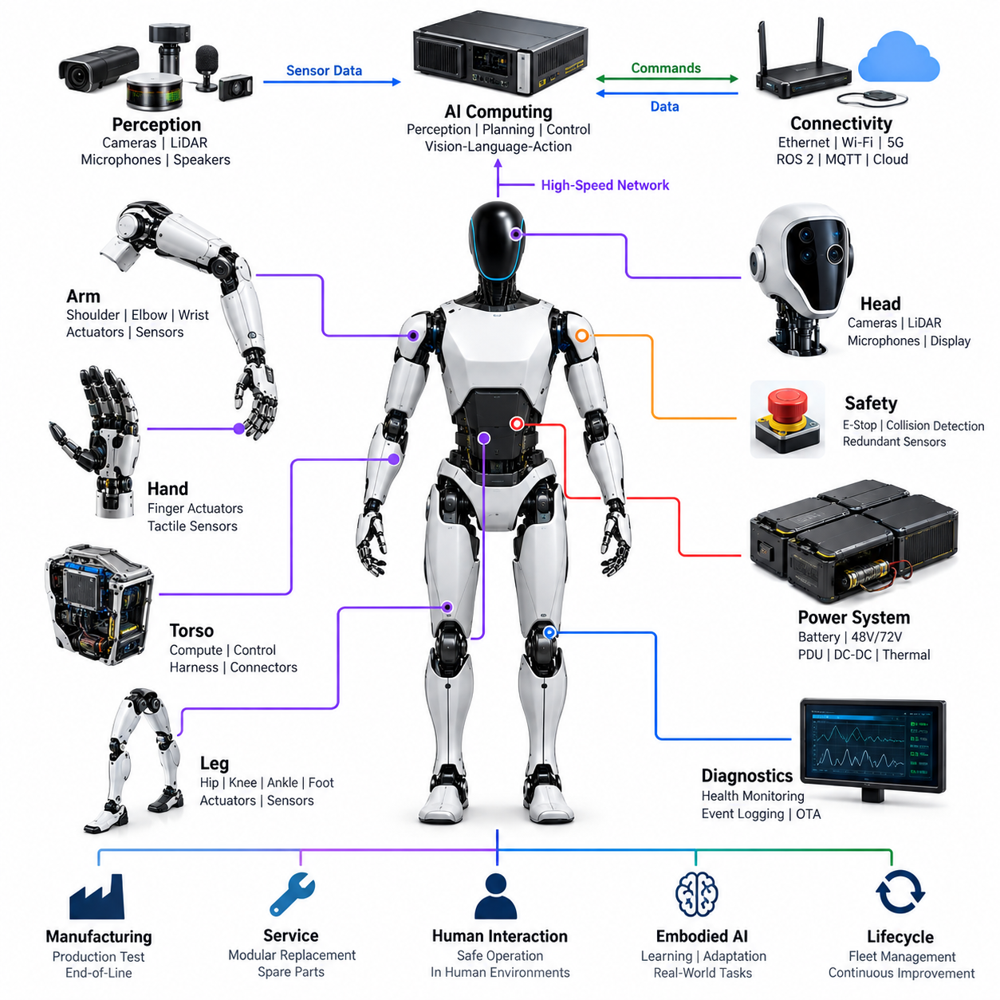
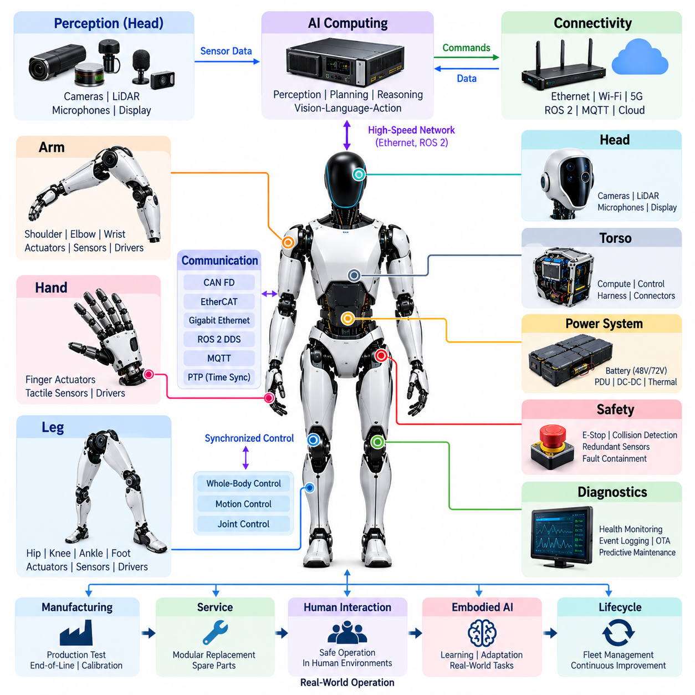
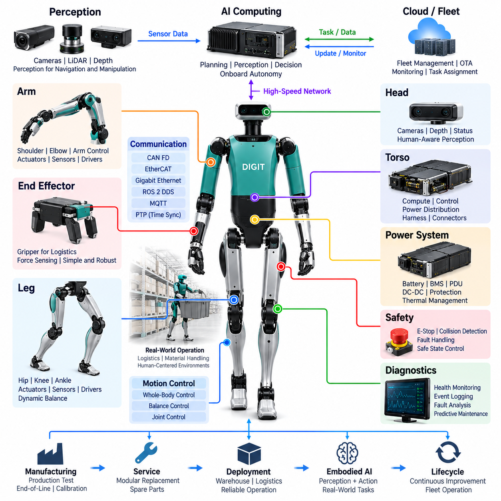
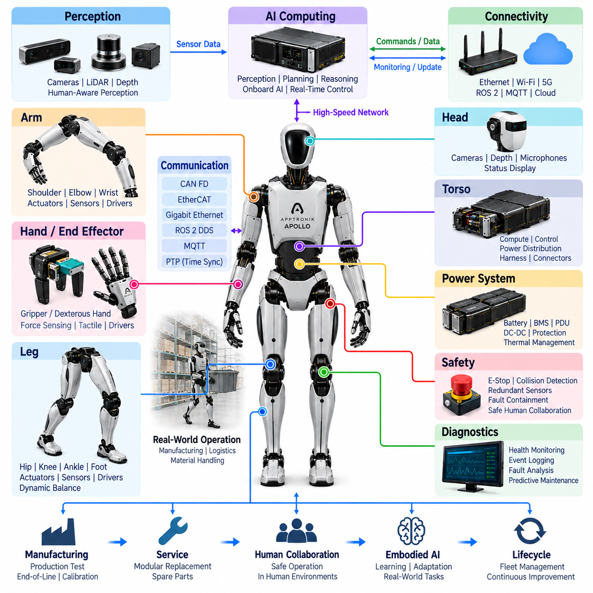
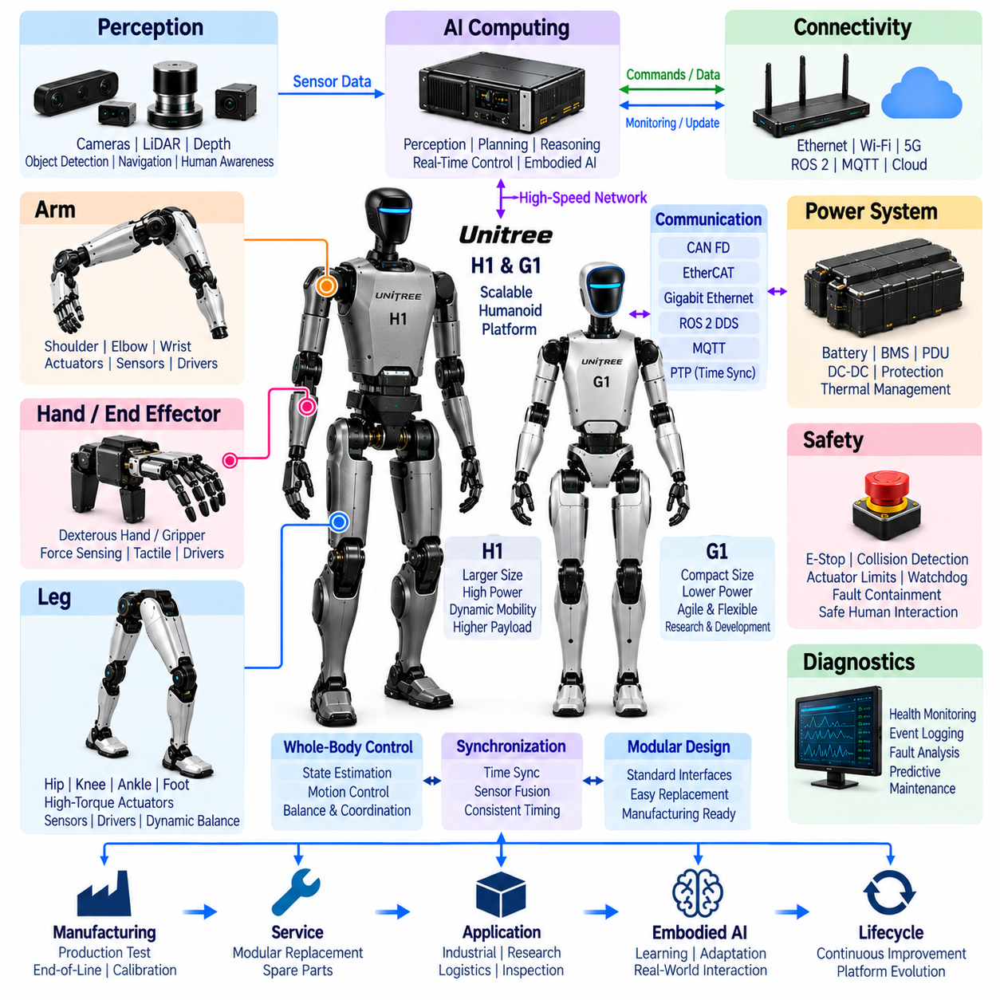
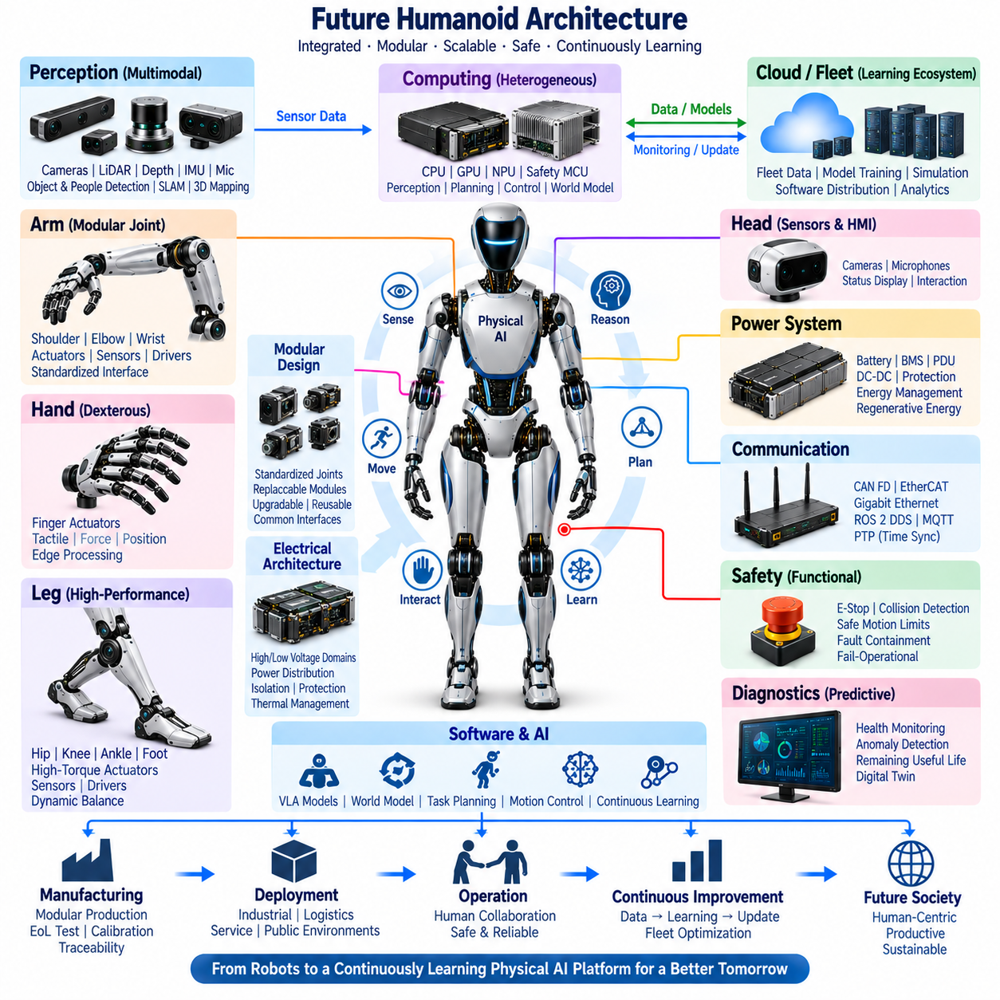

**Volume 21. Humanoid Electrical Architecture**


# Chapter 16. Case Studies

##  

## 16.01. Tesla Optimus

{width="7.268055555555556in" height="7.268055555555556in"}

Tesla Optimus represents a humanoid robot architecture optimized for scalable manufacturing, general-purpose manipulation, and operation in environments originally designed for humans. Within the electrical architecture context, it is significant because it combines battery power, distributed joint actuation, perception, high-performance AI computing, communications, and safety functions inside a compact anthropomorphic platform.

The electrical system can be understood as a hierarchy extending from the central energy source to distributed electromechanical modules throughout the torso, arms, hands, legs, and head. Rather than treating every actuator as an independently engineered subsystem, a production-oriented humanoid benefits from reusable joint electronics, common communication interfaces, standardized power connections, and modular control functions that can be replicated across multiple axes.

Power architecture is particularly important because humanoid locomotion produces highly dynamic loads. Walking, lifting, balancing, recovering from disturbances, and manipulating objects can create rapid changes in motor current. The battery, power distribution network, converters, motor drives, protection devices, wiring, and thermal system must therefore support short-duration peak power while maintaining acceptable voltage stability for computers and sensors.

Distributed actuation reduces the need to route every motor phase connection back to a central controller. Motor drives and local sensing can instead be positioned close to joints or integrated into actuator assemblies. Such an arrangement reduces high-current cable length and allows local control loops to operate with deterministic timing. The system-level computer can then command desired position, velocity, torque, or impedance while local electronics execute fast actuator regulation.

Optimus also illustrates the importance of tightly integrating mechanical and electrical joint design. Each major degree of freedom requires a motor, transmission, position feedback, drive electronics, power connection, communication interface, and thermal path. Torque or force information may additionally be derived from dedicated sensing or actuator state estimation. These signals allow the robot to regulate contact forces and coordinate whole-body motion rather than merely commanding geometric joint positions.

The hands impose a different electrical challenge from the larger arm and leg joints. Dexterous manipulation requires multiple compact actuators, position information, force or tactile feedback, and dense routing through a small mechanical volume. Consequently, hand architecture emphasizes miniaturized electronics, flexible interconnects, efficient motor control, low-mass wiring, and high channel density while preserving sufficient sensing for grasp stability and object interaction.

Perception connects the humanoid body to its operating environment. Camera-based sensing is especially important for recognizing objects, estimating geometry, observing human activity, and supporting manipulation. Perception data must be transported to high-performance compute resources with predictable bandwidth and latency. The electrical architecture therefore has to coordinate sensor power, high-speed communication, compute interfaces, synchronization, and physical placement rather than treating cameras as isolated peripherals.

Central AI computing performs functions fundamentally different from the fast servo loops located near actuators. Large perception and learned-control workloads require substantial parallel computation, whereas balance and actuator control demand deterministic low-latency execution. A practical humanoid architecture therefore separates computational responsibilities while allowing information to flow between perception, planning, whole-body control, safety supervision, and distributed joint controllers.

Communication architecture is the nervous system connecting these computational layers. High-bandwidth links are appropriate for cameras and central processors, while deterministic field networks are suitable for coordinated actuator control and distributed I/O. The broader volume structure identifies CAN FD, EtherCAT, Gigabit Ethernet, ROS 2 DDS, MQTT, and PTP as relevant humanoid communication technologies, illustrating the different timing and bandwidth domains that a complete platform may require.

Time synchronization becomes increasingly important as perception and motion control are combined. Camera frames, inertial measurements, joint positions, motor currents, force estimates, and controller states represent a moving physical system and must be correlated accurately. Timestamp errors can appear as spatial or dynamic errors during sensor fusion. A common time base therefore improves state estimation, event reconstruction, diagnostics, learning-data quality, and coordinated control.

Harness engineering is unusually difficult in humanoids because electrical paths repeatedly cross moving joints. Shoulder, elbow, wrist, hip, knee, ankle, neck, and finger motions impose bending, twisting, abrasion, and packaging constraints. The architecture must minimize harness mass while maintaining current capacity and signal integrity. Connector placement must also permit assembly and service without creating excessive mechanical discontinuities inside articulated structures.

Safety architecture must operate independently enough to respond when high-level AI behavior becomes unreliable. Emergency stopping, power isolation, actuator-state supervision, communication watchdogs, sensor plausibility checks, thermal protection, and controlled degradation can form multiple layers of defense. Because a humanoid works close to people, safety is not limited to electrical fault protection; unexpected motion and excessive contact force are also system-level hazards.

Diagnostics are essential because a humanoid contains many interacting electromechanical channels. Useful health information includes motor current, temperature, encoder state, communication quality, battery condition, supply voltage, controller faults, sensor availability, and abnormal mechanical loading. Event logging can correlate these signals across a synchronized timeline, allowing engineers to distinguish electrical failures from mechanical degradation, software faults, environmental effects, and transient operating conditions.

A production humanoid also requires an architecture designed for manufacturing rather than laboratory assembly. Repeated actuator modules, standardized connectors, automated calibration, end-of-line testing, firmware configuration, and traceable component identities can reduce production complexity. This corresponds directly to the volume\'s progression from joint and body electrical architecture through diagnostics, production testing, modular replacement, spare-parts strategy, and lifecycle management.

Serviceability becomes especially important when large robot fleets are deployed. Replacing an arm, hand, joint module, sensor assembly, battery, or compute unit should ideally require limited disassembly followed by automated identification and calibration. Modular electrical boundaries make this possible. Diagnostic records can further associate component history with operating hours, temperature exposure, fault events, and maintenance actions throughout the robot lifecycle.

Optimus is also an important case study in the convergence of humanoid hardware and embodied AI. Electrical architecture supplies the synchronized sensory observations and controllable physical interfaces required by learned models. Vision, proprioception, actuator state, force interaction, and task commands become inputs to increasingly integrated perception-action systems, while deterministic controllers translate higher-level learned outputs into physically stable and electrically constrained motion.

The resulting design philosophy is therefore broader than selecting motors, batteries, computers, or communication buses independently. A scalable humanoid requires co-design across energy, actuation, sensing, computation, networking, safety, diagnostics, manufacturing, and AI. Tesla Optimus is valuable as a case study because it demonstrates how these traditionally separate engineering domains must converge into a repeatable robotic platform intended for sustained operation in human-centered environments.

테슬라 옵티머스(Tesla Optimus)는 확장 가능한 대량생산(scalable manufacturing), 범용 조작(general-purpose manipulation), 그리고 본래 인간을 위해 설계된 환경에서의 운용을 목표로 최적화된 휴머노이드 로봇 아키텍처(humanoid robot architecture)를 보여준다. 전기 아키텍처(electrical architecture)의 관점에서 옵티머스가 중요한 이유는 배터리 전력(battery power), 분산형 관절 구동(distributed joint actuation), 인지(perception), 고성능 인공지능 컴퓨팅(high-performance AI computing), 통신(communications), 안전 기능(safety functions)을 하나의 소형 인간형 플랫폼(anthropomorphic platform)에 통합하기 때문이다.

전기 시스템(electrical system)은 중앙 에너지원(central energy source)에서 시작하여 몸통(torso), 팔(arms), 손(hands), 다리(legs), 머리(head)에 분산된 전기기계 모듈(electromechanical modules)까지 확장되는 계층 구조(hierarchy)로 이해할 수 있다. 모든 액추에이터(actuator)를 독립적으로 설계하는 대신, 생산 지향형 휴머노이드(production-oriented humanoid)는 여러 축에 반복 적용할 수 있는 공통 관절 전자장치(joint electronics), 통신 인터페이스(communication interfaces), 표준화된 전원 연결(standardized power connections), 모듈형 제어 기능(modular control functions)을 활용하는 것이 유리하다.

전력 아키텍처(power architecture)는 휴머노이드 보행(humanoid locomotion)이 매우 동적인 부하(dynamic loads)를 발생시키기 때문에 특히 중요하다. 보행(walking), 물체 들기(lifting), 균형 유지(balancing), 외란 복구(disturbance recovery), 물체 조작(manipulation)은 모터 전류(motor current)를 빠르게 변화시킬 수 있다. 따라서 배터리(battery), 전력 분배망(power distribution network), 컨버터(converters), 모터 드라이브(motor drives), 보호장치(protection devices), 배선(wiring), 열관리 시스템(thermal system)은 단시간 피크 전력(peak power)을 공급하면서 컴퓨터와 센서에 안정적인 전압을 유지해야 한다.

분산 구동(distributed actuation)은 모든 모터 상 연결(motor phase connection)을 중앙 제어기(central controller)까지 배선할 필요성을 줄여준다. 대신 모터 드라이브와 로컬 센싱(local sensing)을 관절 가까이에 배치하거나 액추에이터 어셈블리(actuator assembly)에 통합할 수 있다. 이러한 구성은 고전류 케이블(high-current cable)의 길이를 줄이고 로컬 제어 루프(local control loops)가 결정론적 타이밍(deterministic timing)으로 동작하도록 한다. 시스템 수준 컴퓨터(system-level computer)는 목표 위치(position), 속도(velocity), 토크(torque), 임피던스(impedance)를 명령하고 로컬 전자장치가 빠른 액추에이터 제어를 수행할 수 있다.

옵티머스는 기계 및 전기 관절 설계(mechanical and electrical joint design)의 긴밀한 통합이 얼마나 중요한지도 보여준다. 주요 자유도(degree of freedom)에는 모터(motor), 변속 또는 감속기(transmission), 위치 피드백(position feedback), 드라이브 전자장치(drive electronics), 전원 연결(power connection), 통신 인터페이스(communication interface), 열전달 경로(thermal path)가 필요하다. 토크 또는 힘 정보(torque or force information)는 전용 센싱(dedicated sensing)이나 액추에이터 상태 추정(actuator state estimation)을 통해 추가로 획득할 수 있으며, 이를 통해 단순한 관절 위치 명령을 넘어 접촉력(contact force)과 전신 운동(whole-body motion)을 제어할 수 있다.

손(hands)은 팔과 다리의 대형 관절과는 다른 전기적 과제를 가진다. 정교한 조작(dexterous manipulation)을 위해서는 다수의 소형 액추에이터(compact actuators), 위치 정보(position information), 힘 또는 촉각 피드백(force or tactile feedback), 그리고 제한된 공간 내부의 고밀도 배선(dense routing)이 필요하다. 따라서 손 아키텍처(hand architecture)는 파지 안정성(grasp stability)과 물체 상호작용(object interaction)에 필요한 센싱을 확보하면서 전자장치 소형화(miniaturized electronics), 플렉시블 인터커넥트(flexible interconnects), 효율적인 모터 제어(efficient motor control), 경량 배선(low-mass wiring), 높은 채널 밀도(high channel density)를 중시한다.

인지(perception)는 휴머노이드의 신체를 주변 운용 환경과 연결한다. 카메라 기반 센싱(camera-based sensing)은 물체 인식(object recognition), 형상 추정(geometry estimation), 인간 행동 관찰(human activity observation), 물체 조작 지원(manipulation support)에 특히 중요하다. 인지 데이터(perception data)는 예측 가능한 대역폭(bandwidth)과 지연시간(latency)을 바탕으로 고성능 컴퓨팅 자원(high-performance compute resources)에 전달되어야 한다. 따라서 전기 아키텍처는 카메라를 독립적인 주변장치로 취급하는 대신 센서 전원(sensor power), 고속 통신(high-speed communication), 컴퓨팅 인터페이스(compute interfaces), 동기화(synchronization), 물리적 배치(physical placement)를 함께 조정해야 한다.

중앙 인공지능 컴퓨팅(central AI computing)은 액추에이터 주변에서 실행되는 고속 서보 루프(fast servo loops)와 근본적으로 다른 기능을 수행한다. 대규모 인지 및 학습 기반 제어(learned-control) 워크로드에는 높은 병렬 연산 능력이 필요하지만, 균형 제어(balance control)와 액추에이터 제어(actuator control)에는 결정론적 저지연 실행(deterministic low-latency execution)이 요구된다. 따라서 실용적인 휴머노이드 아키텍처는 연산 책임을 분리하면서 인지, 계획(planning), 전신 제어(whole-body control), 안전 감독(safety supervision), 분산 관절 제어기(distributed joint controllers) 사이에서 정보가 흐르도록 구성한다.

통신 아키텍처(communication architecture)는 이러한 컴퓨팅 계층을 연결하는 신경계(nervous system)의 역할을 한다. 고대역폭 링크(high-bandwidth links)는 카메라와 중앙 프로세서에 적합하고, 결정론적 필드 네트워크(deterministic field networks)는 액추에이터의 협조 제어(coordinated actuator control)와 분산 입출력(distributed I/O)에 적합하다. 본 볼륨의 전체 구조에서는 CAN FD, 이더캣(EtherCAT), 기가비트 이더넷(Gigabit Ethernet), ROS 2 DDS, MQTT, 정밀 시간 프로토콜(PTP)을 휴머노이드 통신 관련 기술로 다루며, 완전한 플랫폼에서 요구되는 서로 다른 타이밍 및 대역폭 영역을 보여준다.

시간 동기화(time synchronization)는 인지와 운동 제어가 결합될수록 더욱 중요해진다. 카메라 프레임(camera frames), 관성 측정(inertial measurements), 관절 위치(joint positions), 모터 전류(motor currents), 힘 추정(force estimates), 제어기 상태(controller states)는 움직이는 물리 시스템을 표현하므로 정확한 시간적 상관관계가 필요하다. 타임스탬프 오류(timestamp errors)는 센서 융합(sensor fusion) 과정에서 공간적 또는 동적 오차로 나타날 수 있다. 따라서 공통 시간 기준(common time base)은 상태 추정(state estimation), 이벤트 재구성(event reconstruction), 진단(diagnostics), 학습 데이터 품질(learning-data quality), 협조 제어(coordinated control)를 향상시킨다.

와이어 하니스 엔지니어링(harness engineering)은 전기 경로가 반복적으로 움직이는 관절을 통과하기 때문에 휴머노이드에서 특히 어렵다. 어깨(shoulder), 팔꿈치(elbow), 손목(wrist), 고관절(hip), 무릎(knee), 발목(ankle), 목(neck), 손가락(finger)의 움직임은 굽힘(bending), 비틀림(twisting), 마모(abrasion), 패키징 제약(packaging constraints)을 발생시킨다. 아키텍처는 전류 용량(current capacity)과 신호 무결성(signal integrity)을 유지하면서 하니스 질량을 최소화해야 하며, 커넥터 배치(connector placement) 역시 관절 구조 내부에 과도한 기계적 불연속을 만들지 않으면서 조립과 정비가 가능하도록 설계해야 한다.

안전 아키텍처(safety architecture)는 상위 수준 인공지능 동작이 신뢰할 수 없는 상황에서도 대응할 수 있을 정도로 독립적으로 동작해야 한다. 비상 정지(emergency stopping), 전원 차단(power isolation), 액추에이터 상태 감시(actuator-state supervision), 통신 워치독(communication watchdogs), 센서 타당성 검사(sensor plausibility checks), 열 보호(thermal protection), 제어된 성능 저하(controlled degradation)는 다중 방어 계층을 구성할 수 있다. 휴머노이드는 사람과 가까운 거리에서 동작하므로 안전은 전기적 고장 보호에만 국한되지 않으며, 예상하지 못한 움직임과 과도한 접촉력도 시스템 수준 위험(system-level hazards)에 포함된다.

진단(diagnostics)은 휴머노이드 내부에 수많은 상호작용 전기기계 채널(electromechanical channels)이 존재하기 때문에 필수적이다. 유용한 상태 정보에는 모터 전류, 온도(temperature), 엔코더 상태(encoder state), 통신 품질(communication quality), 배터리 상태(battery condition), 공급 전압(supply voltage), 제어기 고장(controller faults), 센서 가용성(sensor availability), 비정상 기계 부하(abnormal mechanical loading)가 포함된다. 이벤트 로깅(event logging)은 이러한 신호를 동기화된 시간축에서 연계하여 전기적 고장, 기계적 열화(mechanical degradation), 소프트웨어 오류, 환경 영향, 일시적인 운용 상태를 구분할 수 있도록 한다.

양산형 휴머노이드(production humanoid)는 실험실 조립이 아니라 제조(manufacturing)를 고려한 아키텍처도 필요하다. 반복 가능한 액추에이터 모듈(actuator modules), 표준화된 커넥터(standardized connectors), 자동 캘리브레이션(automated calibration), 생산라인 종단 시험(end-of-line testing), 펌웨어 설정(firmware configuration), 추적 가능한 부품 식별정보(traceable component identities)는 생산 복잡성을 줄일 수 있다. 이는 관절과 신체 전기 아키텍처에서 시작하여 진단, 생산 시험(production testing), 모듈 교체(modular replacement), 예비 부품 전략(spare-parts strategy), 수명주기 관리(lifecycle management)로 이어지는 본 볼륨의 구성과 직접적으로 연결된다.

대규모 로봇 플릿(robot fleets)을 배치할 경우 정비성(serviceability)은 더욱 중요해진다. 팔, 손, 관절 모듈, 센서 어셈블리(sensor assembly), 배터리 또는 컴퓨팅 장치(compute unit)의 교체는 가능한 한 제한된 분해만으로 수행할 수 있어야 하며, 이후 자동 식별(automated identification)과 캘리브레이션이 이루어지는 것이 바람직하다. 모듈형 전기 경계(modular electrical boundaries)는 이를 가능하게 하며, 진단 기록은 각 부품의 운용 시간, 온도 노출, 고장 이벤트, 유지보수 작업을 로봇의 전체 수명주기에 걸쳐 연결할 수 있다.

옵티머스는 휴머노이드 하드웨어(humanoid hardware)와 체화 인공지능(embodied AI)이 융합되는 중요한 사례이기도 하다. 전기 아키텍처는 학습 모델(learned models)에 필요한 동기화된 감각 관측(synchronized sensory observations)과 제어 가능한 물리 인터페이스(controllable physical interfaces)를 제공한다. 비전(vision), 고유수용감각(proprioception), 액추에이터 상태, 힘 상호작용(force interaction), 작업 명령(task commands)은 점차 통합되는 인지-행동 시스템(perception-action systems)의 입력이 되며, 결정론적 제어기(deterministic controllers)는 상위 학습 모델의 출력을 물리적으로 안정적이고 전기적 제약을 만족하는 운동으로 변환한다.

결과적으로 이러한 설계 철학(design philosophy)은 모터, 배터리, 컴퓨터 또는 통신 버스를 각각 독립적으로 선택하는 것보다 훨씬 넓은 범위를 포괄한다. 확장 가능한 휴머노이드(scalable humanoid)는 에너지(energy), 구동(actuation), 센싱(sensing), 컴퓨팅(computing), 네트워킹(networking), 안전(safety), 진단(diagnostics), 제조(manufacturing), 인공지능(AI)을 아우르는 공동 설계(co-design)를 필요로 한다. 테슬라 옵티머스는 전통적으로 분리되어 있던 이러한 엔지니어링 영역들이 인간 중심 환경(human-centered environments)에서 지속적으로 운용될 수 있는 반복 생산 가능한 로봇 플랫폼(repeatable robotic platform)으로 어떻게 융합되어야 하는지를 보여주는 사례 연구(case study)로서 중요한 의미를 가진다.

##  

## 16.02. Figure 02

{width="7.268055555555556in" height="7.268055555555556in"}

Figure 02 represents a humanoid architecture developed around the idea that general-purpose robots must combine human-scale mechanical capability with perception, reasoning, and learned behavior. Within the humanoid electrical architecture, it is a useful case study because locomotion, manipulation, sensing, computing, power distribution, communications, and safety must operate as one tightly coordinated physical system.

The robot can be viewed as a distributed electromechanical platform organized around the torso, head, arms, hands, and legs. Each region contains different combinations of actuators, sensors, embedded electronics, communication interfaces, and power connections. This modular organization allows high-level computing to coordinate the whole body while local subsystems handle functions requiring faster response and closer interaction with hardware.

Power distribution must accommodate continuously changing loads generated by walking, balancing, reaching, lifting, and grasping. Large joints may demand substantial instantaneous power, while cameras, computers, communication devices, and low-level controllers require stable supply rails. The electrical design must therefore coordinate battery energy, power conversion, protection, distribution, thermal limits, and transient behavior across the entire body.

Joint modules form the physical foundation of humanoid motion. Hip, knee, ankle, shoulder, elbow, and wrist actuators require motor drives, position feedback, current measurement, communication, and local protection. Their controllers must execute commands with sufficiently low latency to support coordinated movement. Position, velocity, torque, and estimated load information can then be exchanged with higher-level controllers responsible for posture and whole-body behavior.

The leg architecture is especially demanding because locomotion depends on rapid interaction between actuator control and body-state estimation. Hip, knee, and ankle modules must cooperate with inertial sensing and foot-related measurements to maintain balance. Electrical latency, sensor synchronization, motor-drive response, and communication determinism therefore directly affect the robot\'s ability to walk, stop, recover from disturbances, and adapt to changing contact conditions.

The arm architecture introduces another combination of precision and dynamic control. Shoulder and elbow joints provide the major workspace, while wrist mechanisms orient the hand for manipulation. Electrical integration must deliver power and deterministic control through articulated structures without excessive harness mass. Joint sensing also contributes to collision detection, force regulation, manipulation accuracy, and coordinated motion between the arms and torso.

Figure 02 places particular emphasis on manipulation, making hand electrical architecture a critical subsystem. A dexterous hand requires multiple compact actuators together with position, force, or tactile sensing channels. Dense wiring and limited packaging volume increase the importance of compact motor drives, flexible harnesses, lightweight connectors, distributed electronics, and efficient local processing for grasping and controlled interaction with objects.

The head and perception subsystem provides information about the external world. Camera systems supply visual observations used for object recognition, scene understanding, human interaction, navigation, and manipulation. Perception hardware must be connected to computing resources through interfaces capable of supporting high data rates while maintaining synchronization with robot motion, joint states, and other time-sensitive sensor information.

High-performance AI computing converts perception into useful representations, plans actions, and supports learned robot behavior. However, AI inference and deterministic motor control have different computational requirements. A practical architecture therefore separates high-level perception and reasoning from hard real-time control while establishing interfaces through which goals, trajectories, state estimates, safety conditions, and actuator commands can be exchanged reliably.

This separation creates a hierarchical control structure. High-level AI can determine what action should be performed, a motion layer can determine how the body should execute it, and distributed controllers can regulate individual actuators. Such partitioning prevents large AI workloads from directly determining every motor-control cycle and provides clearer boundaries between learned behavior, motion generation, real-time execution, and hardware protection.

Communication networks connect these layers into a coherent robot. High-bandwidth networking supports cameras and compute-intensive perception, while deterministic communication is needed for coordinated actuator control and distributed sensing. The surrounding volume identifies CAN FD, EtherCAT, Gigabit Ethernet, ROS 2 DDS, MQTT, and PTP as relevant communication and synchronization technologies for humanoid architecture, each addressing different system-level requirements.

Accurate time synchronization is important because the robot must interpret sensor measurements while its body is continuously moving. Camera observations, inertial data, joint positions, motor currents, contact information, and control commands need consistent timestamps. A synchronized architecture improves sensor fusion, state estimation, motion reconstruction, diagnostic analysis, learning-data generation, and the ability to associate physical events with software decisions.

Harness and connector engineering strongly influence humanoid reliability. Cables must pass through joints that repeatedly rotate, bend, and change configuration while carrying both power and communication signals. Harness design must therefore consider flex life, strain relief, electromagnetic compatibility, routing clearance, connector retention, service access, and mechanical interference while minimizing weight that would otherwise increase actuator energy consumption.

Safety requires supervision across both hardware and software domains. Unexpected motion, excessive contact force, communication loss, sensor failure, motor-drive faults, overheating, or power abnormalities can create hazardous conditions. Emergency-stop functions, watchdog mechanisms, redundant sensing, collision detection, controlled shutdown, and fault containment provide layers that can restrict or stop motion when normal control behavior can no longer be trusted.

Diagnostics extend this supervision into operation and maintenance. Temperatures, motor currents, encoder status, communication errors, battery condition, controller faults, sensor health, and software events can be recorded as synchronized operational data. Event logging and health monitoring help engineers reconstruct failures and identify whether abnormal behavior originated from an actuator, sensor, electrical connection, communication path, compute subsystem, or software component.

Manufacturing architecture is equally important when humanoids move from prototypes toward repeated production. Modular joints, standardized interfaces, production testing, end-of-line verification, calibration, firmware provisioning, and component traceability reduce variation between robots. The volume structure explicitly connects these concerns with production test, end-of-line test, field service, modular replacement, spare-parts strategy, and lifecycle management.

Figure 02 is ultimately valuable as an embodied AI case study because intelligence cannot be separated from the electrical and mechanical platform that executes it. Learned perception and action depend on reliable sensors, synchronized data, responsive actuators, deterministic low-level control, adequate energy, and safe physical interaction. The robot therefore demonstrates how AI capability must be supported by disciplined system engineering throughout the body.

From an electrical architecture perspective, the key lesson is integration. A capable humanoid is not created simply by combining powerful motors with a large AI computer. Power, actuation, sensing, networking, real-time control, AI computing, safety, diagnostics, harnessing, manufacturing, and service must be co-designed as interacting layers. Figure 02 provides a practical reference case for understanding how these domains converge in a general-purpose humanoid platform.

Figure 02는 범용 로봇(general-purpose robots)이 인간 규모의 기계적 능력(human-scale mechanical capability)과 인지(perception), 추론(reasoning), 학습된 행동(learned behavior)을 결합해야 한다는 개념을 중심으로 개발된 휴머노이드 아키텍처(humanoid architecture)를 보여준다. 휴머노이드 전기 아키텍처(humanoid electrical architecture)의 관점에서 보면 보행(locomotion), 조작(manipulation), 센싱(sensing), 컴퓨팅(computing), 전력 분배(power distribution), 통신(communications), 안전(safety)이 하나의 긴밀하게 조정된 물리 시스템으로 동작해야 한다는 점에서 유용한 사례 연구(case study)이다.

이 로봇은 몸통(torso), 머리(head), 팔(arms), 손(hands), 다리(legs)를 중심으로 구성된 분산형 전기기계 플랫폼(distributed electromechanical platform)으로 이해할 수 있다. 각 영역에는 서로 다른 조합의 액추에이터(actuators), 센서(sensors), 임베디드 전자장치(embedded electronics), 통신 인터페이스(communication interfaces), 전원 연결(power connections)이 포함된다. 이러한 모듈형 구성(modular organization)은 상위 수준 컴퓨팅이 전신을 조정하는 동안 로컬 서브시스템(local subsystems)이 빠른 응답과 하드웨어에 밀접한 기능을 담당할 수 있도록 한다.

전력 분배(power distribution)는 보행(walking), 균형 유지(balancing), 팔 뻗기(reaching), 물체 들기(lifting), 파지(grasping) 과정에서 지속적으로 변화하는 부하를 처리해야 한다. 대형 관절은 상당한 순간 전력(instantaneous power)을 요구할 수 있는 반면, 카메라, 컴퓨터, 통신 장치, 저수준 제어기(low-level controllers)는 안정적인 전원 레일(supply rails)을 필요로 한다. 따라서 전기 설계는 배터리 에너지, 전력 변환(power conversion), 보호(protection), 분배(distribution), 열적 한계(thermal limits), 과도 응답(transient behavior)을 전신에 걸쳐 조정해야 한다.

관절 모듈(joint modules)은 휴머노이드 운동의 물리적 기반을 형성한다. 고관절(hip), 무릎(knee), 발목(ankle), 어깨(shoulder), 팔꿈치(elbow), 손목(wrist) 액추에이터에는 모터 드라이브(motor drives), 위치 피드백(position feedback), 전류 측정(current measurement), 통신(communication), 로컬 보호(local protection)가 필요하다. 제어기는 협조 운동(coordinated movement)을 지원할 수 있을 만큼 낮은 지연시간으로 명령을 실행해야 하며, 위치, 속도, 토크, 추정 부하(estimated load) 정보를 자세 및 전신 동작을 담당하는 상위 제어기와 교환할 수 있다.

다리 아키텍처(leg architecture)는 보행이 액추에이터 제어와 신체 상태 추정(body-state estimation) 사이의 빠른 상호작용에 의존하기 때문에 특히 높은 요구조건을 가진다. 고관절, 무릎, 발목 모듈은 관성 센싱(inertial sensing) 및 발 관련 측정(foot-related measurements)과 협력하여 균형을 유지해야 한다. 따라서 전기적 지연시간(electrical latency), 센서 동기화(sensor synchronization), 모터 드라이브 응답(motor-drive response), 통신 결정성(communication determinism)은 로봇의 보행, 정지, 외란 복구, 변화하는 접촉 조건에 대한 적응 능력에 직접적인 영향을 준다.

팔 아키텍처(arm architecture)는 정밀성과 동적 제어(dynamic control)의 또 다른 조합을 요구한다. 어깨와 팔꿈치 관절은 주요 작업 공간(workspace)을 제공하고, 손목 메커니즘(wrist mechanisms)은 조작을 위해 손의 방향을 조정한다. 전기적 통합(electrical integration)은 과도한 하니스 질량(harness mass)을 발생시키지 않으면서 관절 구조를 통해 전력과 결정론적 제어(deterministic control)를 전달해야 한다. 관절 센싱(joint sensing)은 충돌 감지(collision detection), 힘 조절(force regulation), 조작 정밀도(manipulation accuracy), 팔과 몸통 사이의 협조 운동에도 기여한다.

Figure 02는 조작(manipulation)을 특히 중요하게 다루므로 손 전기 아키텍처(hand electrical architecture)가 핵심 서브시스템이 된다. 정교한 손(dexterous hand)은 다수의 소형 액추에이터와 함께 위치, 힘 또는 촉각 센싱(tactile sensing) 채널을 필요로 한다. 높은 배선 밀도와 제한된 패키징 공간은 소형 모터 드라이브(compact motor drives), 플렉시블 하니스(flexible harnesses), 경량 커넥터(lightweight connectors), 분산형 전자장치(distributed electronics), 파지 및 제어된 물체 상호작용을 위한 효율적인 로컬 처리(local processing)의 중요성을 높인다.

머리 및 인지 서브시스템(head and perception subsystem)은 외부 세계에 대한 정보를 제공한다. 카메라 시스템(camera systems)은 물체 인식(object recognition), 장면 이해(scene understanding), 인간 상호작용(human interaction), 내비게이션(navigation), 조작에 사용되는 시각 관측(visual observations)을 제공한다. 인지 하드웨어(perception hardware)는 높은 데이터 전송률을 지원하면서 로봇의 운동, 관절 상태 및 기타 시간 민감형 센서 정보와 동기화를 유지할 수 있는 인터페이스를 통해 컴퓨팅 자원에 연결되어야 한다.

고성능 인공지능 컴퓨팅(high-performance AI computing)은 인지 정보를 유용한 표현(representations)으로 변환하고, 행동을 계획하며, 학습된 로봇 행동(learned robot behavior)을 지원한다. 그러나 인공지능 추론(AI inference)과 결정론적 모터 제어(deterministic motor control)는 서로 다른 연산 요구조건을 가진다. 따라서 실용적인 아키텍처는 상위 수준의 인지 및 추론을 하드 실시간 제어(hard real-time control)와 분리하면서 목표, 궤적(trajectories), 상태 추정(state estimates), 안전 상태(safety conditions), 액추에이터 명령을 신뢰성 있게 교환할 수 있는 인터페이스를 구성한다.

이러한 분리는 계층적 제어 구조(hierarchical control structure)를 형성한다. 상위 수준 인공지능은 어떤 행동을 수행해야 하는지를 결정하고, 모션 계층(motion layer)은 신체가 이를 어떻게 실행할지를 결정하며, 분산형 제어기(distributed controllers)는 개별 액추에이터를 제어할 수 있다. 이러한 분할(partitioning)은 대규모 인공지능 워크로드가 모든 모터 제어 주기를 직접 결정하는 것을 방지하고, 학습된 행동, 모션 생성(motion generation), 실시간 실행(real-time execution), 하드웨어 보호(hardware protection) 사이에 명확한 경계를 제공한다.

통신 네트워크(communication networks)는 이러한 계층을 하나의 일관된 로봇 시스템으로 연결한다. 고대역폭 네트워킹(high-bandwidth networking)은 카메라와 연산 집약적 인지(compute-intensive perception)를 지원하고, 결정론적 통신(deterministic communication)은 액추에이터 협조 제어와 분산 센싱(distributed sensing)에 필요하다. 본 볼륨에서는 CAN FD, 이더캣(EtherCAT), 기가비트 이더넷(Gigabit Ethernet), ROS 2 DDS, MQTT, 정밀 시간 프로토콜(PTP)을 휴머노이드 아키텍처와 관련된 통신 및 동기화 기술로 다루며, 각각 서로 다른 시스템 수준 요구조건을 담당한다.

정확한 시간 동기화(time synchronization)는 로봇의 신체가 지속적으로 움직이는 동안 센서 측정값을 해석해야 하기 때문에 중요하다. 카메라 관측(camera observations), 관성 데이터(inertial data), 관절 위치(joint positions), 모터 전류(motor currents), 접촉 정보(contact information), 제어 명령(control commands)은 일관된 타임스탬프(timestamps)를 필요로 한다. 동기화된 아키텍처는 센서 융합(sensor fusion), 상태 추정, 운동 재구성(motion reconstruction), 진단 분석(diagnostic analysis), 학습 데이터 생성(learning-data generation), 물리적 이벤트와 소프트웨어 의사결정 사이의 연계를 향상시킨다.

하니스 및 커넥터 엔지니어링(harness and connector engineering)은 휴머노이드의 신뢰성에 큰 영향을 미친다. 케이블은 반복적으로 회전하고 굽혀지며 자세가 변화하는 관절을 통과하면서 전력과 통신 신호를 동시에 전달해야 한다. 따라서 하니스 설계는 중량을 최소화하면서 굽힘 수명(flex life), 변형 완화(strain relief), 전자기 적합성(electromagnetic compatibility), 배선 여유(routing clearance), 커넥터 유지력(connector retention), 정비 접근성(service access), 기계적 간섭(mechanical interference)을 고려해야 한다.

안전(safety)은 하드웨어와 소프트웨어 영역 모두에 걸친 감독(supervision)을 요구한다. 예상하지 못한 움직임, 과도한 접촉력(excessive contact force), 통신 손실(communication loss), 센서 고장(sensor failure), 모터 드라이브 고장, 과열(overheating), 전력 이상(power abnormalities)은 위험한 상태를 발생시킬 수 있다. 비상 정지(emergency-stop), 워치독 메커니즘(watchdog mechanisms), 중복 센싱(redundant sensing), 충돌 감지, 제어된 종료(controlled shutdown), 고장 격리(fault containment)는 정상적인 제어 동작을 더 이상 신뢰할 수 없을 때 움직임을 제한하거나 정지시키는 다중 보호 계층을 제공한다.

진단(diagnostics)은 이러한 감독 기능을 운용 및 유지보수(operation and maintenance) 영역으로 확장한다. 온도, 모터 전류, 엔코더 상태(encoder status), 통신 오류(communication errors), 배터리 상태(battery condition), 제어기 고장(controller faults), 센서 건전성(sensor health), 소프트웨어 이벤트(software events)를 동기화된 운용 데이터로 기록할 수 있다. 이벤트 로깅(event logging)과 상태 모니터링(health monitoring)은 비정상 동작이 액추에이터, 센서, 전기 연결, 통신 경로, 컴퓨팅 서브시스템 또는 소프트웨어 구성요소 중 어디에서 발생했는지 재구성하고 분석하는 데 도움을 준다.

휴머노이드가 프로토타입(prototype)에서 반복 생산(repeated production) 단계로 전환될수록 제조 아키텍처(manufacturing architecture) 역시 중요해진다. 모듈형 관절(modular joints), 표준화된 인터페이스(standardized interfaces), 생산 시험(production testing), 생산라인 종단 검증(end-of-line verification), 캘리브레이션(calibration), 펌웨어 프로비저닝(firmware provisioning), 부품 추적성(component traceability)은 로봇 간 편차를 줄이는 데 기여한다. 본 볼륨의 구조에서도 이러한 요소를 생산 시험, 생산라인 종단 시험, 현장 정비(field service), 모듈 교체(modular replacement), 예비 부품 전략(spare-parts strategy), 수명주기 관리(lifecycle management)와 연결한다.

Figure 02는 지능(intelligence)을 이를 실행하는 전기 및 기계 플랫폼과 분리할 수 없다는 점에서 궁극적으로 체화 인공지능(embodied AI)의 중요한 사례 연구이다. 학습 기반 인지와 행동(learned perception and action)은 신뢰성 높은 센서, 동기화된 데이터, 응답성이 높은 액추에이터, 결정론적 저수준 제어, 충분한 에너지, 안전한 물리적 상호작용에 의존한다. 따라서 이 로봇은 인공지능 능력이 신체 전체에 적용되는 체계적인 시스템 엔지니어링(system engineering)에 의해 어떻게 뒷받침되어야 하는지를 보여준다.

전기 아키텍처의 관점에서 핵심 교훈은 통합(integration)이다. 뛰어난 휴머노이드는 단순히 강력한 모터와 대규모 인공지능 컴퓨터를 결합하는 것만으로 구현되지 않는다. 전력(power), 구동(actuation), 센싱(sensing), 네트워킹(networking), 실시간 제어(real-time control), 인공지능 컴퓨팅(AI computing), 안전, 진단, 하니스(harnessing), 제조, 정비(service)를 서로 상호작용하는 계층으로 공동 설계(co-design)해야 한다. Figure 02는 이러한 기술 영역들이 범용 휴머노이드 플랫폼(general-purpose humanoid platform)에서 어떻게 융합되는지를 이해하기 위한 실용적인 참조 사례(reference case)를 제공한다.

##  

## 16.03. Agility Digit

{width="7.268055555555556in" height="7.268055555555556in"}

Agility Robotics Digit represents a humanoid platform developed specifically around practical mobility, material handling, and operation in human-designed logistics environments. Within humanoid electrical architecture, Digit is particularly valuable because its design emphasizes reliable locomotion and useful manipulation rather than reproducing human anatomy exactly. The resulting system integrates distributed actuation, perception, computing, power, communication, and safety around operational tasks.

Digit demonstrates how humanoid architecture can be optimized for a defined industrial mission. Its body proportions, leg configuration, arms, sensing system, and computing resources support movement through spaces designed for people while allowing interaction with containers and other objects. From an electrical perspective, this requires coordinated power and data distribution across a highly articulated machine that repeatedly changes posture while walking, turning, reaching, and handling loads.

The power architecture must support large variations in electrical demand. Locomotion creates cyclic loads as the legs accelerate, support body weight, and control ground contact, while manipulation adds simultaneous demand from the upper body. Battery output, power distribution, conversion stages, motor drives, protection circuits, and thermal management must therefore operate as one coordinated energy system rather than as independent electrical subsystems.

Digit\'s leg architecture is a defining element of the platform. Multiple actuated joints must cooperate to maintain dynamic balance while allowing the robot to walk through warehouses and logistics facilities. Motor drives require rapid current regulation and accurate position feedback, while joint states must be communicated to higher-level controllers with predictable timing. Electrical performance consequently becomes directly connected to mechanical stability and locomotion quality.

Balance control requires information extending beyond individual joint positions. Inertial sensing, actuator feedback, body-state estimation, and contact-related information must be combined to estimate the robot\'s motion relative to the environment. These measurements are meaningful only when their timing relationships are sufficiently accurate. Sensor synchronization and deterministic communication therefore contribute directly to stable locomotion, disturbance rejection, and controlled transitions between movement states.

The arm architecture supports manipulation while also influencing whole-body dynamics. Shoulder, elbow, and other arm actuators require coordinated motion when reaching toward objects, carrying loads, or placing containers. Because moving an object changes the robot\'s mass distribution and dynamic state, manipulation cannot be treated independently from balance. Electrical and control architectures must consequently connect upper-body commands with locomotion and posture-control functions.

Digit\'s end-effector strategy illustrates an important engineering tradeoff between dexterity and task specialization. Industrial material handling does not always require a highly anthropomorphic hand containing many independently controlled fingers. Reducing actuator count and mechanical complexity can decrease wiring, motor-drive channels, control complexity, weight, and maintenance requirements while still providing sufficient manipulation capability for targeted logistics tasks.

Perception provides the environmental information required to navigate and manipulate safely. Sensors must support detection of obstacles, identification of relevant workspace geometry, localization of objects, and interpretation of areas shared with people or equipment. Their electrical integration includes regulated power, communication bandwidth, mechanical mounting, timestamping, diagnostics, and interfaces to the perception computer responsible for transforming sensor measurements into usable environmental representations.

Computing architecture must serve several different timing domains simultaneously. Perception and autonomous decision-making may require substantial processing resources, while balance and joint control demand predictable low-latency execution. A hierarchical approach allows higher-level autonomy to select tasks and motion objectives while real-time controllers maintain stable body behavior. This separation prevents computationally intensive perception workloads from compromising critical actuator-control timing.

Communication architecture connects sensors, computers, controllers, and actuator electronics into a distributed cyber-physical system. High-bandwidth data paths are useful for perception, whereas deterministic networks are more appropriate for tightly coordinated motion. The broader humanoid architecture described in this volume includes CAN FD, EtherCAT, Gigabit Ethernet, ROS 2 DDS, MQTT, and PTP, illustrating the different communication and synchronization domains that can coexist within advanced humanoid systems.

Harness engineering becomes difficult because power and data cables must pass through a body designed for continuous movement. Leg and arm harnesses experience repeated bending and changing mechanical geometry during every operating cycle. Routing must account for flex life, minimum bend radius, abrasion, strain relief, electromagnetic compatibility, connector retention, and service access while minimizing cable mass and avoiding interference with moving mechanical components.

Safety architecture is particularly important for a robot intended to operate in logistics facilities near people and industrial equipment. Potential hazards include unexpected movement, loss of balance, excessive contact force, actuator faults, sensor degradation, communication failures, and electrical abnormalities. Safety supervision must therefore observe both motion and hardware conditions and provide mechanisms for stopping, restricting, or transitioning robot behavior when acceptable operating conditions are lost.

Fault handling should also recognize that stopping a legged robot differs from stopping a stationary machine. Removing actuator power without considering posture can itself create undesirable motion or loss of balance. A humanoid safety strategy therefore benefits from coordinated fault responses that consider actuator state, body configuration, available sensing, communication status, and the severity of the detected fault before transitioning toward a safe condition whenever circumstances permit.

Diagnostics provide the information required to maintain this complex distributed platform. Motor current, drive temperature, encoder state, battery condition, communication errors, sensor availability, processor status, and software events can be continuously monitored. Time-correlated event records allow engineers to reconstruct failures and distinguish between mechanical loading, electrical faults, sensor problems, communication disturbances, thermal limitations, and higher-level software behavior.

Digit is especially relevant as a manufacturing and service case study because commercial logistics deployment requires more than successful demonstrations. Robot availability depends on production testing, end-of-line verification, component traceability, field diagnostics, modular replacement, spare-parts management, and lifecycle support. These concerns correspond directly to the manufacturing and service topics preceding the case-study chapter in the volume structure.

Fleet operation adds another architectural dimension. Multiple robots working within logistics facilities require task assignment, operational monitoring, software management, diagnostic reporting, and coordination with external automation systems. Cloud or facility-level services can support these functions, while safety-critical and real-time control should remain available locally. This creates a layered architecture extending from individual joint controllers through onboard autonomy to fleet-level infrastructure.

Digit also demonstrates an important principle of embodied AI: useful intelligence emerges from the interaction between computation and a body engineered for real-world tasks. Perception algorithms cannot compensate indefinitely for unreliable sensing, and sophisticated planning cannot produce useful work without responsive actuators and stable locomotion. Mechanical design, electrical architecture, real-time control, and AI therefore become mutually dependent components of the complete robotic capability.

From an electrical architecture perspective, the major lesson from Digit is task-oriented integration. Humanoid engineering does not require every platform to duplicate the human body or maximize every technical capability. Power, actuation, sensing, computing, communication, safety, diagnostics, and serviceability should instead be co-designed around the operational mission. Digit provides a valuable reference for understanding how this principle can shape an industrial humanoid intended for sustained real-world deployment.

애질리티 로보틱스 디짓(Agility Robotics Digit)은 실용적인 이동성(practical mobility), 물류 취급(material handling), 인간을 위해 설계된 물류 환경(human-designed logistics environments)에서의 운용을 중심으로 개발된 휴머노이드 플랫폼(humanoid platform)을 보여준다. 휴머노이드 전기 아키텍처(humanoid electrical architecture)의 관점에서 Digit은 인간의 해부학적 구조를 정확하게 재현하기보다 신뢰성 높은 보행(reliable locomotion)과 실용적인 조작(useful manipulation)을 강조한다는 점에서 특히 가치가 있다. 그 결과 분산 구동(distributed actuation), 인지(perception), 컴퓨팅(computing), 전력(power), 통신(communication), 안전(safety)이 실제 작업을 중심으로 통합된 시스템이 구성된다.

Digit은 명확하게 정의된 산업 임무(industrial mission)에 맞추어 휴머노이드 아키텍처를 최적화할 수 있음을 보여준다. 신체 비율(body proportions), 다리 구성(leg configuration), 팔(arms), 센싱 시스템(sensing system), 컴퓨팅 자원(computing resources)은 사람이 사용하는 공간을 이동하면서 컨테이너 및 기타 물체와 상호작용할 수 있도록 구성된다. 전기적 관점에서는 보행, 회전, 팔 뻗기, 하중 취급 과정에서 자세가 반복적으로 변하는 고관절형 기계(highly articulated machine) 전체에 걸쳐 전력과 데이터를 조정하여 분배해야 한다.

전력 아키텍처(power architecture)는 큰 폭으로 변화하는 전기적 수요를 처리해야 한다. 보행(locomotion)은 다리가 가속하고 체중을 지지하며 지면 접촉을 제어하는 과정에서 주기적인 부하(cyclic loads)를 발생시키며, 물체 조작은 상체에서 추가적인 전력 수요를 동시에 발생시킨다. 따라서 배터리 출력(battery output), 전력 분배(power distribution), 변환 단계(conversion stages), 모터 드라이브(motor drives), 보호 회로(protection circuits), 열관리(thermal management)는 독립적인 전기 서브시스템이 아니라 하나의 통합된 에너지 시스템으로 동작해야 한다.

Digit의 다리 아키텍처(leg architecture)는 플랫폼을 특징짓는 핵심 요소이다. 여러 구동 관절(actuated joints)은 로봇이 창고와 물류 시설을 이동하면서 동적 균형(dynamic balance)을 유지할 수 있도록 협조해야 한다. 모터 드라이브는 빠른 전류 제어(current regulation)와 정확한 위치 피드백(position feedback)을 필요로 하며, 관절 상태(joint states)는 예측 가능한 타이밍으로 상위 제어기에 전달되어야 한다. 따라서 전기적 성능은 기계적 안정성(mechanical stability)과 보행 품질(locomotion quality)에 직접적으로 연결된다.

균형 제어(balance control)에는 개별 관절 위치를 넘어서는 정보가 필요하다. 관성 센싱(inertial sensing), 액추에이터 피드백(actuator feedback), 신체 상태 추정(body-state estimation), 접촉 관련 정보(contact-related information)를 결합하여 환경에 대한 로봇의 움직임을 추정해야 한다. 이러한 측정값은 시간적 관계가 충분히 정확할 때 의미가 있으므로 센서 동기화(sensor synchronization)와 결정론적 통신(deterministic communication)은 안정적인 보행, 외란 억제(disturbance rejection), 운동 상태 사이의 제어된 전환에 직접적으로 기여한다.

팔 아키텍처(arm architecture)는 물체 조작을 지원하는 동시에 전신 동역학(whole-body dynamics)에도 영향을 준다. 어깨, 팔꿈치 및 기타 팔 액추에이터는 물체에 접근하거나 하중을 운반하고 컨테이너를 배치할 때 협조된 운동(coordinated motion)을 수행해야 한다. 물체의 이동은 로봇의 질량 분포(mass distribution)와 동적 상태(dynamic state)를 변화시키므로 물체 조작을 균형 제어와 독립적으로 취급할 수 없다. 따라서 전기 및 제어 아키텍처는 상체 명령을 보행 및 자세 제어(posture-control) 기능과 연계해야 한다.

Digit의 엔드 이펙터 전략(end-effector strategy)은 정교성(dexterity)과 작업 특화(task specialization) 사이의 중요한 엔지니어링 절충(tradeoff)을 보여준다. 산업용 물류 취급에서는 다수의 독립적으로 제어되는 손가락을 가진 고도의 인간형 손(highly anthropomorphic hand)이 항상 필요한 것은 아니다. 액추에이터 수와 기계적 복잡성을 줄이면 목표 물류 작업에 충분한 조작 능력을 유지하면서 배선, 모터 드라이브 채널, 제어 복잡성, 중량, 유지보수 요구사항을 감소시킬 수 있다.

인지(perception)는 안전한 이동과 조작에 필요한 환경 정보를 제공한다. 센서는 장애물 감지(obstacle detection), 관련 작업 공간 형상(workspace geometry)의 식별, 물체 위치 파악(localization of objects), 사람이나 장비와 공유하는 공간의 해석을 지원해야 한다. 센서의 전기적 통합에는 안정화 전원(regulated power), 통신 대역폭(communication bandwidth), 기계적 장착(mechanical mounting), 타임스탬핑(timestamping), 진단(diagnostics), 센서 측정값을 활용 가능한 환경 표현(environmental representations)으로 변환하는 인지 컴퓨터와의 인터페이스가 포함된다.

컴퓨팅 아키텍처(computing architecture)는 서로 다른 여러 타이밍 영역(timing domains)을 동시에 지원해야 한다. 인지 및 자율 의사결정(autonomous decision-making)은 상당한 연산 자원을 요구할 수 있지만, 균형 및 관절 제어(joint control)는 예측 가능한 저지연 실행(low-latency execution)을 요구한다. 계층적 접근(hierarchical approach)을 사용하면 상위 자율 시스템이 작업과 운동 목표를 선택하는 동안 실시간 제어기(real-time controllers)가 안정적인 신체 동작을 유지할 수 있다. 이러한 분리는 연산 집약적인 인지 워크로드가 중요한 액추에이터 제어 타이밍을 방해하는 것을 방지한다.

통신 아키텍처(communication architecture)는 센서, 컴퓨터, 제어기, 액추에이터 전자장치를 하나의 분산형 사이버 물리 시스템(distributed cyber-physical system)으로 연결한다. 고대역폭 데이터 경로(high-bandwidth data paths)는 인지에 유용하고, 결정론적 네트워크(deterministic networks)는 긴밀하게 조정되는 운동 제어에 적합하다. 본 볼륨의 휴머노이드 아키텍처에서는 CAN FD, 이더캣(EtherCAT), 기가비트 이더넷(Gigabit Ethernet), ROS 2 DDS, MQTT, 정밀 시간 프로토콜(PTP)을 다루며, 첨단 휴머노이드 시스템 내부에 서로 다른 통신 및 동기화 영역이 공존할 수 있음을 보여준다.

하니스 엔지니어링(harness engineering)은 전력 및 데이터 케이블이 지속적으로 움직이도록 설계된 신체를 통과해야 하기 때문에 어려운 과제가 된다. 다리와 팔의 하니스는 모든 운용 주기마다 반복적인 굽힘과 기계적 형상 변화를 경험한다. 배선 경로는 케이블 질량을 최소화하고 움직이는 기계 구성요소와의 간섭을 방지하면서 굽힘 수명(flex life), 최소 굽힘 반경(minimum bend radius), 마모(abrasion), 변형 완화(strain relief), 전자기 적합성(electromagnetic compatibility), 커넥터 유지력(connector retention), 정비 접근성(service access)을 고려해야 한다.

안전 아키텍처(safety architecture)는 사람 및 산업 장비와 가까운 물류 시설에서 운용되는 로봇에 특히 중요하다. 잠재적인 위험에는 예상하지 못한 움직임, 균형 상실(loss of balance), 과도한 접촉력(excessive contact force), 액추에이터 고장(actuator faults), 센서 성능 저하(sensor degradation), 통신 장애(communication failures), 전기적 이상(electrical abnormalities)이 포함된다. 따라서 안전 감독(safety supervision)은 운동과 하드웨어 상태를 모두 감시하고 허용 가능한 운용 조건을 벗어날 경우 로봇 동작을 정지, 제한 또는 다른 상태로 전환할 수 있어야 한다.

고장 처리(fault handling)는 다족형 로봇(legged robot)을 정지시키는 것이 고정식 기계를 정지시키는 것과 다르다는 점도 고려해야 한다. 자세를 고려하지 않고 액추에이터 전력을 차단하면 오히려 바람직하지 않은 움직임이나 균형 상실을 일으킬 수 있다. 따라서 휴머노이드 안전 전략(humanoid safety strategy)은 가능한 경우 안전 상태로 전환하기 전에 액추에이터 상태, 신체 자세(body configuration), 사용 가능한 센싱, 통신 상태, 감지된 고장의 심각도를 고려하는 협조된 고장 대응(coordinated fault responses)을 적용하는 것이 바람직하다.

진단(diagnostics)은 복잡한 분산형 플랫폼을 유지관리하는 데 필요한 정보를 제공한다. 모터 전류, 드라이브 온도(drive temperature), 엔코더 상태(encoder state), 배터리 상태(battery condition), 통신 오류(communication errors), 센서 가용성(sensor availability), 프로세서 상태(processor status), 소프트웨어 이벤트(software events)를 지속적으로 모니터링할 수 있다. 시간적으로 연계된 이벤트 기록(time-correlated event records)은 엔지니어가 고장을 재구성하고 기계적 부하, 전기적 고장, 센서 문제, 통신 장애, 열적 한계, 상위 소프트웨어 동작을 구분하는 데 도움을 준다.

Digit은 상용 물류 배치(commercial logistics deployment)가 성공적인 시연 이상의 요소를 요구한다는 점에서 제조 및 정비(manufacturing and service)의 중요한 사례 연구이기도 하다. 로봇 가용성(robot availability)은 생산 시험(production testing), 생산라인 종단 검증(end-of-line verification), 부품 추적성(component traceability), 현장 진단(field diagnostics), 모듈 교체(modular replacement), 예비 부품 관리(spare-parts management), 수명주기 지원(lifecycle support)에 의존한다. 이러한 요소는 본 볼륨의 사례 연구 장에 앞서 구성된 제조 및 정비 관련 주제와 직접 연결된다.

플릿 운용(fleet operation)은 또 다른 아키텍처 영역을 추가한다. 물류 시설 내부에서 여러 로봇이 함께 작업하려면 작업 할당(task assignment), 운용 모니터링(operational monitoring), 소프트웨어 관리(software management), 진단 보고(diagnostic reporting), 외부 자동화 시스템(external automation systems)과의 연계가 필요하다. 클라우드 또는 시설 수준 서비스(cloud or facility-level services)는 이러한 기능을 지원할 수 있으며, 안전 필수 및 실시간 제어(safety-critical and real-time control)는 로봇 내부에서 로컬로 유지되어야 한다. 이에 따라 개별 관절 제어기에서 온보드 자율 시스템(onboard autonomy)을 거쳐 플릿 수준 인프라(fleet-level infrastructure)까지 확장되는 계층형 아키텍처가 형성된다.

Digit은 또한 체화 인공지능(embodied AI)의 중요한 원리를 보여준다. 실용적인 지능(useful intelligence)은 컴퓨팅과 실제 작업을 위해 설계된 신체 사이의 상호작용에서 발생한다. 인지 알고리즘(perception algorithms)은 신뢰할 수 없는 센싱을 무한정 보완할 수 없으며, 정교한 계획(planning)도 응답성이 높은 액추에이터와 안정적인 보행이 없다면 실질적인 작업을 수행할 수 없다. 따라서 기계 설계(mechanical design), 전기 아키텍처, 실시간 제어, 인공지능은 완전한 로봇 능력(robotic capability)을 구성하는 상호 의존적인 요소가 된다.

전기 아키텍처의 관점에서 Digit이 제공하는 핵심 교훈은 작업 지향형 통합(task-oriented integration)이다. 휴머노이드 엔지니어링(humanoid engineering)은 모든 플랫폼이 인간의 신체를 그대로 복제하거나 모든 기술적 능력을 극대화할 것을 요구하지 않는다. 대신 전력, 구동(actuation), 센싱, 컴퓨팅, 통신, 안전, 진단, 정비성(serviceability)을 실제 운용 임무(operational mission)를 중심으로 공동 설계(co-design)해야 한다. Digit은 이러한 원칙이 지속적인 실제 환경 배치(real-world deployment)를 목표로 하는 산업용 휴머노이드(industrial humanoid)의 아키텍처를 어떻게 형성할 수 있는지를 이해하기 위한 중요한 참조 사례(reference)이다.

##  

## 16.04. Apptronik Apollo

{width="7.268055555555556in" height="7.268055555555556in"}

Apptronik Apollo represents an industrial humanoid architecture developed around safe human collaboration, modularity, practical manipulation, and deployment in manufacturing and logistics environments. Within humanoid electrical architecture, Apollo is valuable because it demonstrates how power, actuation, perception, computing, communication, safety, diagnostics, and serviceability can be integrated around repetitive real-world work rather than laboratory performance alone.

The platform can be understood as a distributed electromechanical system organized around the torso, head, arms, hands, and legs. Each body region combines actuators, sensing, local electronics, power interfaces, and communication links according to its functional requirements. A modular architecture allows these subsystems to be developed and serviced independently while still participating in coordinated whole-body control and centralized autonomous decision-making.

Power architecture is fundamental because humanoid motion creates rapidly varying electrical loads. Walking, maintaining posture, reaching, lifting, and carrying objects may activate many joints simultaneously. The battery and distribution system must therefore supply both sustained energy and transient power while maintaining stable voltage for computers and sensors. Protection, conversion, thermal monitoring, and fault isolation become integral parts of the energy architecture.

Apollo\'s actuator architecture illustrates the importance of designing joints as integrated mechatronic modules. A practical joint combines an electric motor, transmission, position feedback, motor drive, current sensing, thermal monitoring, communication, and mechanical interfaces. Standardizing these functions across multiple joints can simplify manufacturing and diagnostics while allowing local control loops to execute faster than higher-level whole-body and AI control processes.

Leg electrical architecture must support both body weight and dynamic balance. Hip, knee, and ankle actuation works together with inertial and joint-state sensing to estimate posture and regulate movement. The control system must react rapidly to changes in load and contact conditions while maintaining predictable communication timing. Consequently, motor-drive response, sensor accuracy, network latency, and synchronization directly influence locomotion stability.

The upper-body architecture is optimized around useful industrial manipulation. Shoulder, elbow, wrist, and end-effector functions must coordinate when the robot reaches toward a workstation, receives an object, carries material, or places a component. Arm motion also changes the body\'s center of mass, so manipulation commands must be coordinated with posture and balance rather than executed as an isolated robotic-arm process.

End-effector design introduces a balance between dexterity, robustness, payload, and complexity. Industrial applications may benefit from hands or grippers that provide sufficient object interaction without maximizing the number of independently actuated fingers. Fewer actuators can reduce wiring, power consumption, drive electronics, weight, and failure points. The electrical interface should nevertheless support sensing required for reliable grasping and controlled contact.

Perception architecture provides the information needed to work safely in human-centered environments. Cameras and other sensing devices can observe objects, workspaces, people, obstacles, and robot motion. These devices require regulated power, reliable high-bandwidth communication, mechanical alignment, timestamps, and health monitoring. Perception data must then be transformed by onboard computing into environmental representations suitable for navigation and manipulation.

Apollo also illustrates the need for hierarchical computing. AI-oriented processors can perform perception, planning, task reasoning, and learned behavior, while real-time controllers execute balance and actuator regulation. Separating these timing domains prevents computationally intensive AI workloads from directly interfering with critical servo loops. Clearly defined interfaces connect task goals, motion commands, state estimates, safety information, and low-level actuator states.

Whole-body control provides the bridge between high-level task commands and distributed joint execution. Instead of treating each limb independently, the controller considers the coordinated state of the robot when generating movement. This is particularly important during material handling because arm forces, payload mass, body posture, and foot support interact dynamically. Electrical architecture must provide synchronized sensor and actuator information to support this coordination.

Communication networks form the data backbone connecting distributed electronics. High-speed links are suitable for perception and central computing, while deterministic communication is important for coordinated actuators and time-sensitive sensing. The surrounding humanoid architecture in this volume includes CAN FD, EtherCAT, Gigabit Ethernet, ROS 2 DDS, MQTT, and PTP, illustrating how multiple communication domains may coexist according to bandwidth, latency, synchronization, and system-level requirements.

Time synchronization becomes critical when sensor observations and actuator states describe a continuously moving robot. Camera frames, inertial measurements, encoder positions, motor currents, force information, and control events should share a consistent temporal reference. Accurate timestamping improves state estimation, sensor fusion, event reconstruction, diagnostics, learning-data generation, and analysis of interactions between software decisions and physical responses.

Harness and connector architecture must accommodate continuous articulation while remaining suitable for industrial service. Cables routed through shoulders, elbows, wrists, hips, knees, ankles, and the torso experience repeated bending and movement. Harness engineering must therefore consider flex life, bend radius, strain relief, electromagnetic compatibility, connector retention, abrasion protection, assembly sequence, service access, and the effect of wiring mass on robot efficiency.

Human-robot safety is central to an industrial humanoid intended to share workspaces with people. Unexpected motion, excessive contact force, loss of balance, communication faults, sensor failures, motor-drive abnormalities, or overheating may create hazardous situations. Safety architecture can combine emergency stopping, collision detection, redundant or diverse sensing, watchdogs, power supervision, fault containment, and controlled transitions toward safe operating states.

Diagnostics transform the distributed electrical system into an observable and maintainable platform. Motor currents, temperatures, encoder conditions, communication errors, battery health, sensor availability, processor status, power faults, and software events can be monitored and logged. When these records use synchronized timestamps, engineers can reconstruct abnormal behavior and distinguish electrical failures from mechanical, thermal, communication, sensing, or software-related causes.

Apollo\'s modular philosophy is particularly relevant to manufacturing and field service. Commercial robots must eventually be assembled, calibrated, tested, repaired, and upgraded efficiently. Standardized electrical interfaces and replaceable modules can reduce service time and production variability. This aligns with the volume\'s manufacturing structure covering production test, end-of-line test, field service, modular replacement, spare-parts strategy, and lifecycle management.

Industrial deployment also requires integration beyond the individual robot. Apollo-class humanoids may exchange task information, status, diagnostic data, and software packages with facility or fleet systems. Local control should retain the functions required for safe real-time operation, while higher-level infrastructure can support scheduling, monitoring, analytics, software distribution, and fleet optimization. This creates an architecture extending from joint electronics to enterprise-level automation.

From an embodied AI perspective, Apollo demonstrates that intelligent behavior depends on the quality of the physical platform beneath the AI models. Reliable perception requires stable sensors and synchronization, while learned manipulation requires responsive actuators and accurate state feedback. AI, real-time control, electrical hardware, mechanical design, and safety therefore form an interconnected system rather than independent technology layers.

The primary electrical-architecture lesson from Apollo is modular industrial integration. A useful humanoid must combine adequate performance with reliability, maintainability, safety, manufacturability, and operational efficiency. Power, joints, sensing, computing, networking, diagnostics, harnessing, and service boundaries should therefore be co-designed around deployment requirements. Apollo provides a valuable case study of how humanoid architecture can evolve toward practical participation in human-centered industrial workflows.

앱트로닉 아폴로(Apptronik Apollo)는 안전한 인간 협업(safe human collaboration), 모듈성(modularity), 실용적인 조작(practical manipulation), 제조 및 물류 환경(manufacturing and logistics environments)에서의 배치를 중심으로 개발된 산업용 휴머노이드 아키텍처(industrial humanoid architecture)를 보여준다. 휴머노이드 전기 아키텍처(humanoid electrical architecture)의 관점에서 Apollo는 단순한 실험실 성능이 아니라 반복적인 실제 작업을 중심으로 전력(power), 구동(actuation), 인지(perception), 컴퓨팅(computing), 통신(communication), 안전(safety), 진단(diagnostics), 정비성(serviceability)을 어떻게 통합할 수 있는지를 보여준다는 점에서 가치가 있다.

이 플랫폼은 몸통(torso), 머리(head), 팔(arms), 손(hands), 다리(legs)를 중심으로 구성된 분산형 전기기계 시스템(distributed electromechanical system)으로 이해할 수 있다. 각 신체 영역은 기능적 요구사항에 따라 액추에이터(actuators), 센싱(sensing), 로컬 전자장치(local electronics), 전원 인터페이스(power interfaces), 통신 링크(communication links)를 조합한다. 모듈형 아키텍처(modular architecture)를 적용하면 각 서브시스템을 독립적으로 개발하고 정비하면서도 협조된 전신 제어(whole-body control)와 중앙집중형 자율 의사결정(centralized autonomous decision-making)에 참여시킬 수 있다.

전력 아키텍처(power architecture)는 휴머노이드의 움직임이 빠르게 변화하는 전기 부하를 발생시키기 때문에 기본적인 요소이다. 보행(walking), 자세 유지(maintaining posture), 팔 뻗기(reaching), 물체 들기(lifting), 운반(carrying)은 여러 관절을 동시에 작동시킬 수 있다. 따라서 배터리 및 전력 분배 시스템은 컴퓨터와 센서에 안정적인 전압을 유지하면서 지속적인 에너지와 과도 전력(transient power)을 모두 공급해야 한다. 보호(protection), 전력 변환(conversion), 열 모니터링(thermal monitoring), 고장 격리(fault isolation)는 에너지 아키텍처의 핵심 요소가 된다.

Apollo의 액추에이터 아키텍처(actuator architecture)는 관절을 통합된 메카트로닉 모듈(integrated mechatronic modules)로 설계하는 것이 중요함을 보여준다. 실용적인 관절은 전기 모터(electric motor), 변속 또는 감속기(transmission), 위치 피드백(position feedback), 모터 드라이브(motor drive), 전류 센싱(current sensing), 열 모니터링, 통신, 기계적 인터페이스(mechanical interfaces)를 결합한다. 이러한 기능을 여러 관절에 걸쳐 표준화하면 제조와 진단을 단순화하면서 상위 수준의 전신 및 인공지능 제어보다 빠른 로컬 제어 루프(local control loops)를 실행할 수 있다.

다리 전기 아키텍처(leg electrical architecture)는 체중 지지와 동적 균형(dynamic balance)을 모두 지원해야 한다. 고관절(hip), 무릎(knee), 발목(ankle)의 구동은 관성 센싱(inertial sensing) 및 관절 상태 센싱(joint-state sensing)과 함께 동작하여 자세를 추정하고 움직임을 제어한다. 제어 시스템은 예측 가능한 통신 타이밍을 유지하면서 부하와 접촉 조건의 변화에 빠르게 대응해야 한다. 따라서 모터 드라이브 응답, 센서 정확도, 네트워크 지연시간(network latency), 동기화(synchronization)는 보행 안정성에 직접적인 영향을 준다.

상체 아키텍처(upper-body architecture)는 실용적인 산업용 조작(industrial manipulation)을 중심으로 최적화된다. 어깨(shoulder), 팔꿈치(elbow), 손목(wrist), 엔드 이펙터(end-effector)는 로봇이 작업대에 접근하거나 물체를 전달받고, 자재를 운반하거나 부품을 배치할 때 협조하여 동작해야 한다. 팔의 움직임은 신체의 무게중심(center of mass)에도 영향을 미치므로 조작 명령은 독립적인 로봇 팔 동작으로 실행되는 것이 아니라 자세 및 균형 제어와 연계되어야 한다.

엔드 이펙터 설계(end-effector design)는 정교성(dexterity), 견고성(robustness), 가반하중(payload), 복잡성(complexity) 사이의 균형을 요구한다. 산업용 애플리케이션에서는 독립적으로 구동되는 손가락 수를 극대화하지 않더라도 물체와 충분히 상호작용할 수 있는 손 또는 그리퍼(gripper)가 유용할 수 있다. 액추에이터 수를 줄이면 배선, 전력 소비, 드라이브 전자장치, 중량, 고장 지점을 감소시킬 수 있다. 그러나 전기 인터페이스는 신뢰성 높은 파지와 제어된 접촉에 필요한 센싱을 지원해야 한다.

인지 아키텍처(perception architecture)는 인간 중심 환경(human-centered environments)에서 안전하게 작업하는 데 필요한 정보를 제공한다. 카메라 및 기타 센싱 장치는 물체, 작업 공간, 사람, 장애물, 로봇의 움직임을 관찰할 수 있다. 이러한 장치에는 안정화 전원(regulated power), 신뢰성 높은 고대역폭 통신(high-bandwidth communication), 기계적 정렬(mechanical alignment), 타임스탬프(timestamps), 상태 모니터링(health monitoring)이 필요하다. 인지 데이터는 온보드 컴퓨팅(onboard computing)에 의해 내비게이션과 조작에 적합한 환경 표현(environmental representations)으로 변환되어야 한다.

Apollo는 계층적 컴퓨팅(hierarchical computing)의 필요성도 보여준다. 인공지능 지향 프로세서(AI-oriented processors)는 인지, 계획(planning), 작업 추론(task reasoning), 학습된 행동(learned behavior)을 수행할 수 있으며, 실시간 제어기(real-time controllers)는 균형과 액추에이터 제어를 실행한다. 이러한 타이밍 영역(timing domains)을 분리하면 연산 집약적인 인공지능 워크로드가 중요한 서보 루프(servo loops)에 직접적인 영향을 주는 것을 방지할 수 있다. 명확하게 정의된 인터페이스는 작업 목표, 모션 명령, 상태 추정, 안전 정보, 저수준 액추에이터 상태를 연결한다.

전신 제어(whole-body control)는 상위 수준의 작업 명령과 분산형 관절 실행(distributed joint execution)을 연결하는 역할을 한다. 각 팔다리를 독립적으로 처리하는 대신 제어기는 움직임을 생성할 때 로봇 전체의 협조된 상태를 고려한다. 이는 팔의 힘, 가반하중 질량(payload mass), 신체 자세, 발의 지지 상태가 동적으로 상호작용하는 자재 취급(material handling)에서 특히 중요하다. 전기 아키텍처는 이러한 협조 제어를 지원하기 위해 동기화된 센서 및 액추에이터 정보를 제공해야 한다.

통신 네트워크(communication networks)는 분산된 전자장치를 연결하는 데이터 백본(data backbone)을 형성한다. 고속 링크(high-speed links)는 인지와 중앙 컴퓨팅에 적합하며, 결정론적 통신(deterministic communication)은 협조된 액추에이터와 시간 민감형 센싱(time-sensitive sensing)에 중요하다. 본 볼륨의 휴머노이드 아키텍처에서는 CAN FD, 이더캣(EtherCAT), 기가비트 이더넷(Gigabit Ethernet), ROS 2 DDS, MQTT, 정밀 시간 프로토콜(PTP)을 다루며, 대역폭, 지연시간, 동기화 및 시스템 수준 요구사항에 따라 여러 통신 영역이 공존할 수 있음을 보여준다.

시간 동기화(time synchronization)는 센서 관측값과 액추에이터 상태가 지속적으로 움직이는 로봇을 표현하기 때문에 매우 중요하다. 카메라 프레임(camera frames), 관성 측정값(inertial measurements), 엔코더 위치(encoder positions), 모터 전류(motor currents), 힘 정보(force information), 제어 이벤트(control events)는 일관된 시간 기준(temporal reference)을 공유해야 한다. 정확한 타임스탬핑(timestamping)은 상태 추정(state estimation), 센서 융합(sensor fusion), 이벤트 재구성(event reconstruction), 진단, 학습 데이터 생성(learning-data generation), 소프트웨어 의사결정과 물리적 반응 사이의 상호작용 분석을 향상시킨다.

하니스 및 커넥터 아키텍처(harness and connector architecture)는 지속적인 관절 운동을 수용하면서 산업 현장에서 정비할 수 있도록 설계되어야 한다. 어깨, 팔꿈치, 손목, 고관절, 무릎, 발목, 몸통을 통과하는 케이블은 반복적인 굽힘과 움직임을 경험한다. 따라서 하니스 엔지니어링(harness engineering)은 굽힘 수명(flex life), 굽힘 반경(bend radius), 변형 완화(strain relief), 전자기 적합성(electromagnetic compatibility), 커넥터 유지력(connector retention), 마모 보호(abrasion protection), 조립 순서(assembly sequence), 정비 접근성(service access), 배선 중량이 로봇 효율에 미치는 영향을 고려해야 한다.

인간-로봇 안전(human-robot safety)은 사람과 작업 공간을 공유하도록 설계된 산업용 휴머노이드의 핵심 요소이다. 예상하지 못한 움직임, 과도한 접촉력(excessive contact force), 균형 상실(loss of balance), 통신 고장, 센서 고장, 모터 드라이브 이상, 과열(overheating)은 위험한 상황을 발생시킬 수 있다. 안전 아키텍처는 비상 정지(emergency stopping), 충돌 감지(collision detection), 중복 또는 이종 센싱(redundant or diverse sensing), 워치독(watchdogs), 전력 감독(power supervision), 고장 격리, 안전 운용 상태로의 제어된 전환을 결합할 수 있다.

진단(diagnostics)은 분산형 전기 시스템을 관찰 가능하고 유지보수 가능한 플랫폼으로 전환한다. 모터 전류, 온도, 엔코더 상태, 통신 오류, 배터리 건전성(battery health), 센서 가용성(sensor availability), 프로세서 상태(processor status), 전력 고장(power faults), 소프트웨어 이벤트를 모니터링하고 기록할 수 있다. 이러한 기록에 동기화된 타임스탬프를 적용하면 엔지니어는 비정상 동작을 재구성하고 전기적 고장을 기계적, 열적, 통신, 센싱 또는 소프트웨어 관련 원인과 구분할 수 있다.

Apollo의 모듈형 설계 철학(modular philosophy)은 제조 및 현장 정비(manufacturing and field service)의 관점에서 특히 중요하다. 상용 로봇은 궁극적으로 효율적인 조립, 캘리브레이션(calibration), 시험, 수리, 업그레이드가 가능해야 한다. 표준화된 전기 인터페이스(standardized electrical interfaces)와 교체 가능한 모듈(replaceable modules)은 정비 시간과 생산 편차를 줄일 수 있다. 이는 본 볼륨에서 다루는 생산 시험(production test), 생산라인 종단 시험(end-of-line test), 현장 정비(field service), 모듈 교체(modular replacement), 예비 부품 전략(spare-parts strategy), 수명주기 관리(lifecycle management)와 연결된다.

산업 현장 배치(industrial deployment)는 개별 로봇을 넘어서는 통합도 요구한다. Apollo급 휴머노이드(Apollo-class humanoids)는 시설 또는 플릿 시스템(fleet systems)과 작업 정보, 상태, 진단 데이터, 소프트웨어 패키지를 교환할 수 있다. 로컬 제어(local control)는 안전한 실시간 운용에 필요한 기능을 유지하고, 상위 인프라는 스케줄링(scheduling), 모니터링, 분석(analytics), 소프트웨어 배포(software distribution), 플릿 최적화(fleet optimization)를 지원할 수 있다. 이에 따라 관절 전자장치에서 기업 수준 자동화(enterprise-level automation)까지 확장되는 아키텍처가 형성된다.

체화 인공지능(embodied AI)의 관점에서 Apollo는 지능적 행동(intelligent behavior)이 인공지능 모델 아래에 위치한 물리 플랫폼의 품질에 의존한다는 점을 보여준다. 신뢰성 높은 인지는 안정적인 센서와 동기화를 필요로 하고, 학습 기반 조작(learned manipulation)은 응답성이 높은 액추에이터와 정확한 상태 피드백을 필요로 한다. 따라서 인공지능, 실시간 제어, 전기 하드웨어, 기계 설계, 안전은 독립적인 기술 계층이 아니라 서로 연결된 하나의 시스템을 구성한다.

Apollo에서 얻을 수 있는 주요 전기 아키텍처 교훈은 모듈형 산업 통합(modular industrial integration)이다. 실용적인 휴머노이드는 충분한 성능뿐만 아니라 신뢰성(reliability), 유지보수성(maintainability), 안전성, 제조 가능성(manufacturability), 운용 효율성(operational efficiency)을 함께 확보해야 한다. 따라서 전력, 관절, 센싱, 컴퓨팅, 네트워킹(networking), 진단, 하니스, 정비 경계(service boundaries)는 실제 배치 요구사항을 중심으로 공동 설계(co-design)되어야 한다. Apollo는 휴머노이드 아키텍처가 인간 중심의 산업 작업 흐름(human-centered industrial workflows)에 실질적으로 참여하는 방향으로 어떻게 발전할 수 있는지를 보여주는 중요한 사례 연구이다.

##  

## 16.05. Unitree H1/G1

{width="7.268055555555556in" height="7.268055555555556in"}

Unitree H1 and G1 represent two complementary approaches to humanoid robotics within a common emphasis on high-performance electric actuation, dynamic mobility, integrated perception, and accessible development. As case studies in humanoid electrical architecture, they illustrate how different body scales and application targets influence joint power, battery capacity, computing resources, sensor integration, communication, harness design, safety, and system modularity.

H1 is positioned around a larger humanoid form in which powerful lower-body actuation and dynamic locomotion are major architectural drivers. G1 uses a smaller and more compact platform that reduces overall mass and energy requirements while providing a practical basis for manipulation, embodied AI research, and development. Comparing the two demonstrates how electrical architecture must scale with mechanical dimensions, actuator loading, payload expectations, and intended operating scenarios.

The power architecture begins with the relationship between battery capability and actuator demand. Walking, accelerating, recovering balance, changing direction, and manipulating objects create rapidly varying electrical loads. Larger joints generally require higher peak power, while processors and sensors need stable regulated supplies. Battery management, power distribution, DC-DC conversion, protection, wiring, connectors, and thermal supervision must therefore be designed as a coordinated energy system.

H1 emphasizes the electrical demands associated with high-torque dynamic joints. Hip, knee, and ankle actuators must generate substantial forces while repeatedly accelerating and decelerating the robot\'s body. Motor drives require fast current regulation, accurate rotor or joint-position feedback, temperature monitoring, and protection against abnormal electrical conditions. The quality of these local control functions directly influences locomotion bandwidth, stability, efficiency, and mechanical stress.

G1 demonstrates how compact humanoid architecture can reduce some absolute power requirements while increasing packaging density. Smaller limbs and joints permit lower total mass, but motors, drives, sensors, wiring, and structural elements must fit into tighter spaces. Electrical design therefore becomes strongly dependent on component integration, thermal paths, connector size, harness flexibility, electromagnetic compatibility, and the ability to service densely packaged modules.

For both platforms, leg control requires more than independent joint regulation. Joint positions, velocities, motor currents, inertial measurements, and contact-related information contribute to whole-body state estimation. These signals must be sampled and transported with sufficiently consistent timing for balance control. Deterministic communication and synchronized measurements allow the controller to coordinate multiple actuators as one dynamic system rather than as unrelated motor axes.

Upper-body architecture expands the platform from locomotion toward interaction with the physical world. Shoulder, elbow, and wrist joints require coordinated electrical and control interfaces, while hand or end-effector systems introduce additional actuator and sensor channels. Manipulation also changes the robot\'s mass distribution, making arm motion relevant to balance. Whole-body control must consequently connect upper-body trajectories with leg and posture regulation.

Dexterous manipulation increases electrical complexity significantly. Multiple compact actuators may be combined with position, force, or tactile sensing, creating dense concentrations of motor-drive channels and communication interfaces near the hands. A scalable architecture benefits from modular local electronics that aggregate sensor information and execute fast control functions before exchanging higher-level state and command information with central computing resources.

Perception architecture supplies environmental information for locomotion, manipulation, and embodied intelligence. Cameras, depth sensing, LiDAR, or related sensors can provide observations of geometry, obstacles, objects, and people. Their integration requires regulated power, sufficient data bandwidth, accurate mechanical mounting, timestamps, diagnostics, and high-performance processing. Sensor architecture must therefore be considered together with networking and compute placement.

Computing is divided naturally between real-time control and AI-oriented processing. Joint regulation and balance require deterministic execution, whereas perception, learned policies, vision-language models, and higher-level planning can demand substantial parallel computation. Separating these domains protects critical motion-control timing while allowing increasingly sophisticated AI workloads to operate on the same robot. Defined interfaces connect state estimation, motion generation, autonomy, and actuator execution.

Communication architecture forms the nervous system linking these distributed resources. Motor controllers require low-latency exchanges, perception sensors require higher bandwidth, and software components may use middleware-oriented communication. The broader volume structure includes CAN FD, EtherCAT, Gigabit Ethernet, ROS 2 DDS, MQTT, and PTP, providing representative technologies for different communication, integration, and synchronization layers in a humanoid platform.

Time synchronization is particularly important for dynamic robots because measurement errors can quickly become control errors. Camera frames, inertial measurements, joint positions, motor currents, and contact events describe different aspects of the same physical motion. A common temporal reference improves sensor fusion, state estimation, learning-data collection, motion reconstruction, diagnostics, and analysis of the relationship between AI decisions and resulting physical behavior.

Harness architecture must accommodate continuous motion through the neck, shoulders, elbows, wrists, hips, knees, ankles, and potentially dexterous hands. Cables experience repeated bending, twisting, vibration, and changing clearance. Engineering considerations include flex life, conductor sizing, voltage drop, shielding, electromagnetic compatibility, strain relief, connector retention, abrasion resistance, routing, and serviceability while keeping mass low enough to avoid unnecessary actuator load.

Safety becomes increasingly important as dynamic performance rises. A humanoid capable of rapid motion can generate significant kinetic energy, so abnormal commands, communication failures, sensor faults, excessive joint loads, overheating, or loss of balance require controlled responses. Emergency stopping, collision detection, actuator limits, watchdogs, power supervision, redundant sensing, and fault containment can provide independent layers that prevent a single failure from producing uncontrolled behavior.

Diagnostics provide visibility into the condition of the distributed electrical system. Motor current, drive temperature, encoder status, battery voltage, communication errors, sensor availability, processor load, power faults, and software events can be monitored continuously. Synchronizing these records makes it possible to distinguish mechanical overload from electrical faults, thermal limitations, sensor degradation, communication disturbances, and software-related abnormalities.

H1 and G1 are also useful examples of how manufacturing objectives affect humanoid architecture. Reusable actuator concepts, standardized electrical interfaces, common communication mechanisms, calibration procedures, production testing, and firmware management can reduce complexity across a product family. Modular replacement further allows defective joints, sensors, compute modules, or other assemblies to be serviced without rebuilding the complete robot.

The comparison is especially relevant to embodied AI development because platform scale affects experimentation. A smaller robot can provide a practical environment for collecting interaction data and developing learned behaviors, while a larger platform can explore tasks requiring different reach, force, mobility, and physical capability. In both cases, AI performance remains dependent on reliable sensing, synchronized state information, responsive actuators, and predictable real-time control.

From an electrical architecture perspective, the central lesson of H1 and G1 is scalable integration. Humanoid design is not simply a matter of enlarging or shrinking the same electrical system. Changes in body scale alter peak power, thermal density, wiring, actuator loading, compute packaging, mechanical dynamics, safety risk, and service requirements. H1 and G1 therefore provide complementary reference cases for understanding how modular electrical architecture can support multiple humanoid classes within a broader Physical AI platform strategy.

유니트리 H1과 G1(Unitree H1 and G1)은 고성능 전기 구동(high-performance electric actuation), 동적 이동성(dynamic mobility), 통합 인지(integrated perception), 접근성 높은 개발(accessible development)을 공통적으로 강조하면서도 서로 보완적인 휴머노이드 로보틱스(humanoid robotics) 접근 방식을 보여준다. 휴머노이드 전기 아키텍처(humanoid electrical architecture)의 사례로서 두 플랫폼은 서로 다른 신체 크기와 적용 목표가 관절 전력, 배터리 용량, 컴퓨팅 자원, 센서 통합, 통신, 하니스 설계, 안전, 시스템 모듈성(system modularity)에 어떤 영향을 주는지를 보여준다.

H1은 강력한 하체 구동(lower-body actuation)과 동적 보행(dynamic locomotion)이 주요 아키텍처 설계 요소가 되는 대형 휴머노이드 형태를 중심으로 구성된다. G1은 전체 질량과 에너지 요구량을 줄인 보다 작고 컴팩트한 플랫폼으로서 조작(manipulation), 체화 인공지능 연구(embodied AI research), 개발을 위한 실용적인 기반을 제공한다. 두 플랫폼의 비교는 전기 아키텍처가 기계적 크기, 액추에이터 부하, 가반하중 요구사항(payload expectations), 운용 시나리오에 따라 어떻게 확장되어야 하는지를 보여준다.

전력 아키텍처(power architecture)는 배터리 성능과 액추에이터 요구량 사이의 관계에서 시작된다. 보행, 가속, 균형 복구(balance recovery), 방향 전환, 물체 조작은 빠르게 변화하는 전기 부하를 발생시킨다. 대형 관절은 일반적으로 높은 피크 전력(peak power)을 필요로 하지만 프로세서와 센서는 안정적으로 조절된 전원(stable regulated supplies)을 요구한다. 따라서 배터리 관리, 전력 분배, 직류-직류 변환(DC-DC conversion), 보호, 배선, 커넥터, 열 감독(thermal supervision)은 하나의 통합된 에너지 시스템으로 설계되어야 한다.

H1은 고토크 동적 관절(high-torque dynamic joints)과 관련된 전기적 요구사항을 강조한다. 고관절(hip), 무릎(knee), 발목(ankle) 액추에이터는 로봇의 신체를 반복적으로 가속 및 감속하면서 상당한 힘을 발생시켜야 한다. 모터 드라이브(motor drives)는 빠른 전류 제어(current regulation), 정확한 회전자 또는 관절 위치 피드백(rotor or joint-position feedback), 온도 모니터링, 비정상 전기 상태에 대한 보호 기능을 필요로 한다. 이러한 로컬 제어 기능의 품질은 보행 대역폭(locomotion bandwidth), 안정성, 효율성, 기계적 응력(mechanical stress)에 직접적인 영향을 준다.

G1은 컴팩트한 휴머노이드 아키텍처가 전체적인 전력 요구량을 낮추는 동시에 패키징 밀도(packaging density)를 증가시킬 수 있음을 보여준다. 더 작은 팔다리와 관절은 전체 질량을 줄일 수 있지만 모터, 드라이브, 센서, 배선, 구조 요소를 더욱 제한된 공간에 배치해야 한다. 따라서 전기 설계는 부품 통합(component integration), 열전달 경로(thermal paths), 커넥터 크기, 하니스 유연성(harness flexibility), 전자기 적합성(electromagnetic compatibility), 고밀도로 패키징된 모듈의 정비 가능성에 크게 의존한다.

두 플랫폼 모두에서 다리 제어(leg control)는 개별 관절의 독립적인 제어 이상을 요구한다. 관절 위치, 속도, 모터 전류, 관성 측정값(inertial measurements), 접촉 관련 정보(contact-related information)는 전신 상태 추정(whole-body state estimation)에 기여한다. 이러한 신호는 균형 제어(balance control)를 위해 충분히 일관된 타이밍으로 샘플링되고 전달되어야 한다. 결정론적 통신(deterministic communication)과 동기화된 측정(synchronized measurements)을 통해 제어기는 여러 액추에이터를 서로 독립된 모터 축이 아니라 하나의 동적 시스템(dynamic system)으로 조정할 수 있다.

상체 아키텍처(upper-body architecture)는 플랫폼의 기능을 보행에서 물리적 세계와의 상호작용으로 확장한다. 어깨, 팔꿈치, 손목 관절에는 협조된 전기 및 제어 인터페이스가 필요하며, 손 또는 엔드 이펙터(end-effector) 시스템은 추가적인 액추에이터 및 센서 채널을 도입한다. 물체 조작은 로봇의 질량 분포(mass distribution)에도 변화를 주기 때문에 팔의 움직임은 균형과 밀접한 관계를 가진다. 따라서 전신 제어(whole-body control)는 상체 궤적(upper-body trajectories)을 다리 및 자세 제어(posture regulation)와 연결해야 한다.

정교한 조작(dexterous manipulation)은 전기적 복잡성을 크게 증가시킨다. 여러 소형 액추에이터가 위치, 힘 또는 촉각 센싱(tactile sensing)과 결합되면서 손 주변에 모터 드라이브 채널과 통신 인터페이스가 고밀도로 집중될 수 있다. 확장 가능한 아키텍처(scalable architecture)는 센서 정보를 통합하고 빠른 제어 기능을 로컬에서 실행한 후 중앙 컴퓨팅 자원과 상위 수준의 상태 및 명령 정보를 교환하는 모듈형 로컬 전자장치(modular local electronics)를 활용하는 것이 유리하다.

인지 아키텍처(perception architecture)는 보행, 조작, 체화 지능(embodied intelligence)에 필요한 환경 정보를 제공한다. 카메라, 깊이 센싱(depth sensing), 라이다(LiDAR) 또는 관련 센서는 형상, 장애물, 물체, 사람에 대한 관측 정보를 제공할 수 있다. 이러한 센서를 통합하려면 안정화된 전원(regulated power), 충분한 데이터 대역폭, 정확한 기계적 장착, 타임스탬프(timestamps), 진단, 고성능 처리가 필요하다. 따라서 센서 아키텍처는 네트워킹(networking) 및 컴퓨팅 배치(compute placement)와 함께 고려해야 한다.

컴퓨팅은 자연스럽게 실시간 제어(real-time control)와 인공지능 지향 처리(AI-oriented processing)로 구분된다. 관절 제어와 균형 제어에는 결정론적 실행(deterministic execution)이 필요한 반면, 인지, 학습 정책(learned policies), 비전-언어 모델(vision-language models), 상위 수준 계획(higher-level planning)은 상당한 병렬 연산을 요구할 수 있다. 이러한 영역을 분리하면 중요한 운동 제어 타이밍을 보호하면서 동일한 로봇에서 점점 복잡해지는 인공지능 워크로드를 실행할 수 있다. 정의된 인터페이스는 상태 추정, 모션 생성(motion generation), 자율 기능(autonomy), 액추에이터 실행을 연결한다.

통신 아키텍처(communication architecture)는 이러한 분산 자원을 연결하는 신경계(nervous system)를 형성한다. 모터 제어기는 저지연 정보 교환(low-latency exchanges)을 요구하고, 인지 센서는 높은 대역폭을 필요로 하며, 소프트웨어 구성요소는 미들웨어 기반 통신(middleware-oriented communication)을 사용할 수 있다. 본 볼륨의 전체 구조에서는 CAN FD, 이더캣(EtherCAT), 기가비트 이더넷(Gigabit Ethernet), ROS 2 DDS, MQTT, 정밀 시간 프로토콜(PTP)을 휴머노이드 플랫폼의 서로 다른 통신, 통합, 동기화 계층을 위한 대표적인 기술로 다룬다.

시간 동기화(time synchronization)는 측정 오차가 빠르게 제어 오차로 이어질 수 있는 동적 로봇에서 특히 중요하다. 카메라 프레임(camera frames), 관성 측정값, 관절 위치, 모터 전류, 접촉 이벤트(contact events)는 동일한 물리적 움직임의 서로 다른 측면을 표현한다. 공통 시간 기준(common temporal reference)은 센서 융합(sensor fusion), 상태 추정(state estimation), 학습 데이터 수집, 운동 재구성(motion reconstruction), 진단, 인공지능 의사결정과 실제 물리적 행동 사이의 관계 분석을 향상시킨다.

하니스 아키텍처(harness architecture)는 목, 어깨, 팔꿈치, 손목, 고관절, 무릎, 발목, 그리고 정교한 손을 사용하는 경우 손 내부까지 지속적인 움직임을 수용해야 한다. 케이블은 반복적인 굽힘, 비틀림, 진동, 공간 여유의 변화를 경험한다. 엔지니어링 고려사항에는 굽힘 수명(flex life), 도체 크기(conductor sizing), 전압 강하(voltage drop), 차폐(shielding), 전자기 적합성, 변형 완화(strain relief), 커넥터 유지력(connector retention), 내마모성(abrasion resistance), 배선 경로(routing), 정비성이 포함되며 불필요한 액추에이터 부하를 방지하기 위해 질량도 최소화해야 한다.

동적 성능이 높아질수록 안전(safety)의 중요성도 증가한다. 빠른 움직임이 가능한 휴머노이드는 상당한 운동 에너지(kinetic energy)를 발생시킬 수 있으므로 비정상 명령, 통신 장애, 센서 고장, 과도한 관절 부하, 과열, 균형 상실에 대해 제어된 대응이 필요하다. 비상 정지(emergency stopping), 충돌 감지(collision detection), 액추에이터 제한(actuator limits), 워치독(watchdogs), 전력 감독(power supervision), 중복 센싱(redundant sensing), 고장 격리(fault containment)는 단일 고장이 제어되지 않은 행동으로 이어지는 것을 방지하는 독립적인 보호 계층을 제공할 수 있다.

진단(diagnostics)은 분산형 전기 시스템의 상태를 관찰할 수 있도록 한다. 모터 전류, 드라이브 온도, 엔코더 상태, 배터리 전압, 통신 오류, 센서 가용성, 프로세서 부하(processor load), 전력 고장, 소프트웨어 이벤트를 지속적으로 모니터링할 수 있다. 이러한 기록을 동기화하면 기계적 과부하(mechanical overload)를 전기적 고장, 열적 한계, 센서 성능 저하(sensor degradation), 통신 장애, 소프트웨어 관련 이상과 구분할 수 있다.

H1과 G1은 제조 목표(manufacturing objectives)가 휴머노이드 아키텍처에 어떠한 영향을 미치는지를 보여주는 유용한 사례이기도 하다. 재사용 가능한 액추에이터 개념(reusable actuator concepts), 표준화된 전기 인터페이스, 공통 통신 메커니즘, 캘리브레이션 절차(calibration procedures), 생산 시험(production testing), 펌웨어 관리(firmware management)는 하나의 제품군(product family) 전체에서 복잡성을 줄일 수 있다. 모듈 교체(modular replacement)를 적용하면 전체 로봇을 다시 조립하지 않고도 고장 난 관절, 센서, 컴퓨팅 모듈 또는 기타 어셈블리를 정비할 수 있다.

두 플랫폼의 비교는 플랫폼 크기가 실험 방식에 영향을 준다는 점에서 체화 인공지능(embodied AI) 개발에도 특히 의미가 있다. 소형 로봇은 상호작용 데이터(interaction data)를 수집하고 학습된 행동을 개발하기 위한 실용적인 환경을 제공할 수 있으며, 대형 플랫폼은 서로 다른 도달 범위(reach), 힘(force), 이동성(mobility), 물리적 능력(physical capability)이 필요한 작업을 탐구할 수 있다. 두 경우 모두 인공지능 성능은 신뢰성 높은 센싱, 동기화된 상태 정보, 응답성이 높은 액추에이터, 예측 가능한 실시간 제어에 의존한다.

전기 아키텍처의 관점에서 H1과 G1이 제공하는 핵심 교훈은 확장 가능한 통합(scalable integration)이다. 휴머노이드 설계는 동일한 전기 시스템을 단순히 확대하거나 축소하는 문제가 아니다. 신체 크기의 변화는 피크 전력, 열 밀도(thermal density), 배선, 액추에이터 부하, 컴퓨팅 패키징(compute packaging), 기계 동역학(mechanical dynamics), 안전 위험, 정비 요구사항을 변화시킨다. 따라서 H1과 G1은 모듈형 전기 아키텍처(modular electrical architecture)가 보다 광범위한 피지컬 인공지능 플랫폼 전략(Physical AI platform strategy) 안에서 서로 다른 휴머노이드 등급(humanoid classes)을 어떻게 지원할 수 있는지를 이해하기 위한 상호 보완적인 참조 사례를 제공한다.

##  

## 16.06. Future Humanoid Architecture

{width="7.268055555555556in" height="7.268055555555556in"}

Future humanoid architecture is expected to evolve from collections of specialized subsystems into tightly integrated Physical AI platforms in which power, actuation, sensing, computing, communication, safety, diagnostics, and embodied intelligence are designed together. The architecture will increasingly treat the humanoid body as a distributed cyber-physical system whose electrical structure must support continuous perception, reasoning, motion, interaction, learning, and adaptation.

A major architectural direction will be stronger modularization at the body and joint levels. Arms, legs, hands, head assemblies, battery modules, compute units, and actuator modules can use standardized electrical and mechanical boundaries. Such modularity can reduce development complexity while enabling replacement, upgrade, calibration, and reuse across different humanoid platforms. Common interfaces may eventually support configurable product families rather than individually engineered robots.

Power architecture will move toward higher energy density, improved peak-power capability, and more intelligent distribution. Future humanoids must simultaneously supply high-current actuators and sensitive computing and perception electronics. Distributed power management, smart PDUs, bidirectional converters, electronic protection, regenerative energy handling, and detailed energy telemetry can allow the robot to dynamically allocate power according to locomotion, manipulation, thermal conditions, and remaining battery capacity.

Voltage architecture may also become increasingly segmented. High-power actuator domains can operate at higher voltages to reduce conductor current and harness mass, while lower-voltage rails support sensors, controllers, communication devices, and auxiliary electronics. Isolation, grounding, fault containment, precharge, discharge, and power-state coordination will therefore become system-level design functions rather than simple electrical implementation details.

Actuator modules are likely to become highly integrated intelligent nodes. Motors, transmissions, encoders, torque sensing, temperature sensing, motor drives, local processors, communication interfaces, and diagnostic functions can be packaged into repeatable joint units. Local controllers will execute high-bandwidth current, torque, position, and impedance loops while publishing standardized state information to whole-body controllers and receiving coordinated motion objectives.

Future hands will push this distributed architecture further because dexterous manipulation requires exceptional actuator and sensor density. Finger motors, tactile arrays, force sensing, position sensing, and local control electronics must operate within severe volume and mass constraints. Edge processing inside the hand can compress tactile information, detect contact events, estimate grasp conditions, and execute fast reflex-like responses before forwarding higher-level representations to central embodied AI systems.

Perception architecture will increasingly become multimodal and body-wide. Cameras, depth sensors, LiDAR, inertial sensors, joint encoders, tactile arrays, force sensors, microphones, and potentially additional proximity or environmental sensors will collectively represent the robot and its surroundings. Instead of processing each modality independently, future systems will require synchronized sensor fabrics that provide temporally coherent information for unified world and body models.

Computing architecture will likely develop into a heterogeneous hierarchy. Safety controllers and real-time processors will execute deterministic functions, while CPUs, GPUs, NPUs, and other AI accelerators handle perception, world modeling, language understanding, planning, and learned control. Workloads can be partitioned according to latency, criticality, computational intensity, and energy consumption, allowing powerful AI capability without sacrificing deterministic physical control.

The separation between perception, planning, and control may gradually become less rigid at higher computational layers. Vision-language-action models, world models, foundation models, and agent architectures can combine visual observations, language instructions, robot state, memory, and action generation. Nevertheless, deterministic motion and safety layers will remain essential interfaces between probabilistic AI outputs and the physical actuators that can generate significant forces in human environments.

Communication architecture must support this heterogeneous computational structure. Deterministic networks will carry time-sensitive actuator and sensor traffic, while high-speed Ethernet-class networks will transport perception and AI data. Middleware and service-oriented communication will connect software components, edge systems, and external infrastructure. The volume\'s CAN FD, EtherCAT, Gigabit Ethernet, ROS 2 DDS, MQTT, and PTP structure provides representative building blocks for these different communication domains.

Time synchronization will become a fundamental infrastructure service rather than an optional sensor feature. A future humanoid may produce thousands of distributed measurements and control events across its body. Accurate common time allows camera frames, tactile events, inertial measurements, joint states, motor currents, AI decisions, and safety events to be reconstructed consistently, improving sensor fusion, control, diagnostics, training-data quality, and digital-twin fidelity.

Harness architecture will evolve toward lighter, more modular, and more distributed designs. Higher distribution voltages can reduce conductor size, while local electronics can decrease the number of signals routed through moving joints. High-speed serial communication, compact connectors, flexible circuits, optimized grounding, and zonal distribution can reduce harness complexity. Digital electrical-interface definitions can further support automated design, manufacturing, validation, and service.

Functional safety will need to address increasingly autonomous and adaptive behavior. Traditional protection against electrical and actuator faults will remain necessary, but future safety architectures must also supervise AI-generated actions, unexpected environmental interactions, degraded perception, communication loss, and uncertainty in learned behavior. Independent safety controllers, redundant sensors, safe motion limits, collision detection, fault containment, and controlled degradation can establish enforceable physical boundaries around intelligent behavior.

Fail-operational concepts may become more important as humanoids enter workplaces and public environments. Not every fault should necessarily cause immediate uncontrolled power removal. Depending on the failure, a robot may need to maintain balance, place a carried object safely, move to a stable posture, isolate a faulty limb, or request assistance. Achieving this behavior requires coordinated redundancy across power, sensing, communication, computing, and actuator control.

Diagnostics will evolve from fault reporting toward continuous health estimation and predictive maintenance. Joint friction, motor current signatures, thermal behavior, battery impedance, connector degradation, communication quality, sensor drift, and mechanical loading can be analyzed over time. Digital twins and fleet analytics may combine these observations to estimate remaining useful life, identify abnormal trends, and schedule maintenance before failures interrupt operation.

Manufacturing architecture will increasingly influence electrical design from the earliest development stage. Standardized modules, automated programming, calibration, end-of-line testing, configuration management, and component traceability will be necessary for large-scale production. A robot\'s digital identity can associate hardware revisions, firmware, calibration parameters, service history, and operational data throughout its lifecycle, directly connecting manufacturing with diagnostics and fleet management.

Edge-cloud integration will extend the individual humanoid into a larger learning ecosystem. Real-time control and safety must remain onboard, while cloud or on-premise infrastructure can perform fleet analytics, model training, simulation, software distribution, and long-term data management. Knowledge obtained from multiple robots can be validated and incorporated into updated models, creating a controlled pathway from fleet experience to improved individual robot capability.

The ultimate architectural transition is toward a humanoid as a continuously learning Physical AI system. Perception, world modeling, memory, reasoning, planning, manipulation, locomotion, and human interaction will increasingly share common representations. However, scalable deployment will depend on maintaining clear interfaces between adaptive intelligence and deterministic engineering layers so that learned capability can evolve without compromising power integrity, real-time behavior, serviceability, or safety.

Future humanoid electrical architecture will therefore be defined less by any single battery, processor, actuator, sensor, or AI model than by the quality of system integration. Modular hardware, distributed intelligent joints, synchronized multimodal sensing, heterogeneous computing, deterministic networking, independent safety, predictive diagnostics, automated manufacturing, and fleet learning will converge into a unified platform. This integration provides the architectural foundation for humanoids capable of reliable long-term operation in human-centered environments.

미래 휴머노이드 아키텍처(future humanoid architecture)는 전문화된 서브시스템의 집합에서 전력(power), 구동(actuation), 센싱(sensing), 컴퓨팅(computing), 통신(communication), 안전(safety), 진단(diagnostics), 체화 지능(embodied intelligence)이 함께 설계되는 긴밀하게 통합된 피지컬 인공지능 플랫폼(Physical AI platform)으로 발전할 것으로 예상된다. 이러한 아키텍처는 휴머노이드 신체를 지속적인 인지, 추론, 운동, 상호작용, 학습, 적응을 지원해야 하는 분산형 사이버 물리 시스템(distributed cyber-physical system)으로 점차 인식하게 될 것이다.

주요 아키텍처 발전 방향 중 하나는 신체 및 관절 수준에서의 더욱 강력한 모듈화(modularization)가 될 것이다. 팔, 다리, 손, 머리 어셈블리, 배터리 모듈, 컴퓨팅 장치, 액추에이터 모듈은 표준화된 전기적 및 기계적 경계(standardized electrical and mechanical boundaries)를 사용할 수 있다. 이러한 모듈성은 개발 복잡성을 줄이는 동시에 서로 다른 휴머노이드 플랫폼 간의 교체, 업그레이드, 캘리브레이션(calibration), 재사용을 가능하게 한다. 공통 인터페이스는 개별적으로 설계된 로봇을 넘어 구성 가능한 제품군(configurable product families)을 지원할 수 있다.

전력 아키텍처(power architecture)는 더 높은 에너지 밀도(energy density), 향상된 피크 전력 성능(peak-power capability), 더욱 지능적인 전력 분배 방향으로 발전할 것이다. 미래 휴머노이드는 고전류 액추에이터와 민감한 컴퓨팅 및 인지 전자장치에 동시에 전력을 공급해야 한다. 분산형 전력 관리(distributed power management), 스마트 전력 분배 장치(smart PDU), 양방향 컨버터(bidirectional converters), 전자식 보호(electronic protection), 회생 에너지 처리(regenerative energy handling), 상세한 에너지 텔레메트리(energy telemetry)를 통해 보행, 조작, 열 상태, 잔여 배터리 용량에 따라 전력을 동적으로 할당할 수 있다.

전압 아키텍처(voltage architecture) 역시 점차 세분화될 수 있다. 고출력 액추에이터 영역(high-power actuator domains)은 도체 전류와 하니스 질량을 줄이기 위해 더 높은 전압으로 동작할 수 있으며, 저전압 전원 레일(lower-voltage rails)은 센서, 제어기, 통신 장치, 보조 전자장치를 지원할 수 있다. 따라서 절연(isolation), 접지(grounding), 고장 격리(fault containment), 프리차지(precharge), 방전(discharge), 전원 상태 조정(power-state coordination)은 단순한 전기 구현 세부사항이 아니라 시스템 수준의 설계 기능이 될 것이다.

액추에이터 모듈(actuator modules)은 고도로 통합된 지능형 노드(intelligent nodes)로 발전할 가능성이 높다. 모터, 변속 또는 감속기(transmissions), 엔코더(encoders), 토크 센싱(torque sensing), 온도 센싱, 모터 드라이브, 로컬 프로세서, 통신 인터페이스, 진단 기능을 반복적으로 사용할 수 있는 관절 유닛(joint units)으로 패키징할 수 있다. 로컬 제어기는 고대역폭 전류, 토크, 위치, 임피던스 제어 루프(impedance loops)를 실행하면서 표준화된 상태 정보를 전신 제어기에 제공하고 협조된 운동 목표를 수신하게 될 것이다.

미래의 손(hands)은 정교한 조작(dexterous manipulation)에 매우 높은 액추에이터 및 센서 밀도가 필요하기 때문에 이러한 분산형 아키텍처를 더욱 발전시킬 것이다. 손가락 모터, 촉각 배열(tactile arrays), 힘 센싱(force sensing), 위치 센싱, 로컬 제어 전자장치는 엄격한 공간 및 질량 제약 안에서 동작해야 한다. 손 내부의 엣지 처리(edge processing)는 촉각 정보를 압축하고 접촉 이벤트를 감지하며 파지 상태를 추정하고 빠른 반사 행동(reflex-like responses)을 실행한 후 상위 표현을 중앙 체화 인공지능 시스템으로 전달할 수 있다.

인지 아키텍처(perception architecture)는 점차 다중모달(multimodal) 및 전신 분산형으로 발전할 것이다. 카메라, 깊이 센서(depth sensors), 라이다(LiDAR), 관성 센서(inertial sensors), 관절 엔코더, 촉각 배열, 힘 센서, 마이크로폰(microphones), 그리고 추가적인 근접 또는 환경 센서가 로봇과 주변 환경을 종합적으로 표현하게 될 것이다. 각 모달리티(modality)를 독립적으로 처리하는 대신 미래 시스템은 통합된 월드 모델 및 신체 모델(unified world and body models)을 위해 시간적으로 일관된 정보를 제공하는 동기화 센서 패브릭(synchronized sensor fabrics)을 필요로 한다.

컴퓨팅 아키텍처(computing architecture)는 이기종 계층 구조(heterogeneous hierarchy)로 발전할 가능성이 높다. 안전 제어기(safety controllers)와 실시간 프로세서는 결정론적 기능(deterministic functions)을 수행하고, CPU, GPU, NPU 및 기타 인공지능 가속기(AI accelerators)는 인지, 월드 모델링(world modeling), 언어 이해(language understanding), 계획(planning), 학습 기반 제어(learned control)를 담당할 수 있다. 워크로드는 지연시간, 중요도, 연산 집약도, 에너지 소비에 따라 분할되어 결정론적인 물리 제어를 희생하지 않으면서 강력한 인공지능 기능을 제공할 수 있다.

상위 연산 계층에서는 인지, 계획, 제어 사이의 구분이 점차 덜 엄격해질 수 있다. 비전-언어-행동 모델(Vision-Language-Action models), 월드 모델(world models), 파운데이션 모델(foundation models), 에이전트 아키텍처(agent architectures)는 시각 관측, 언어 명령, 로봇 상태, 메모리(memory), 행동 생성을 결합할 수 있다. 그러나 확률적 인공지능 출력(probabilistic AI outputs)과 인간 환경에서 상당한 힘을 발생시킬 수 있는 물리적 액추에이터 사이에는 결정론적 운동 및 안전 계층이 필수적인 인터페이스로 계속 유지될 것이다.

통신 아키텍처(communication architecture)는 이러한 이기종 컴퓨팅 구조를 지원해야 한다. 결정론적 네트워크(deterministic networks)는 시간 민감형 액추에이터 및 센서 트래픽을 전달하고, 고속 이더넷급 네트워크(high-speed Ethernet-class networks)는 인지 및 인공지능 데이터를 전송하게 될 것이다. 미들웨어 및 서비스 지향 통신(middleware and service-oriented communication)은 소프트웨어 구성요소, 엣지 시스템, 외부 인프라를 연결한다. 본 볼륨에서 다루는 CAN FD, 이더캣(EtherCAT), 기가비트 이더넷(Gigabit Ethernet), ROS 2 DDS, MQTT, 정밀 시간 프로토콜(PTP)은 이러한 서로 다른 통신 영역을 위한 대표적인 구성 요소를 제공한다.

시간 동기화(time synchronization)는 선택적인 센서 기능이 아니라 핵심 인프라 서비스(fundamental infrastructure service)가 될 것이다. 미래의 휴머노이드는 신체 전체에서 수천 개의 분산된 측정값과 제어 이벤트를 생성할 수 있다. 정확한 공통 시간(common time)을 사용하면 카메라 프레임, 촉각 이벤트, 관성 측정값, 관절 상태, 모터 전류, 인공지능 의사결정, 안전 이벤트를 일관되게 재구성할 수 있으며 센서 융합, 제어, 진단, 학습 데이터 품질, 디지털 트윈 충실도(digital-twin fidelity)를 향상시킬 수 있다.

하니스 아키텍처(harness architecture)는 더욱 가볍고 모듈화되며 분산된 형태로 발전할 것이다. 높은 분배 전압(higher distribution voltages)은 도체 크기를 줄일 수 있으며, 로컬 전자장치는 움직이는 관절을 통과하는 신호 수를 감소시킬 수 있다. 고속 직렬 통신(high-speed serial communication), 소형 커넥터, 플렉시블 회로(flexible circuits), 최적화된 접지, 구역 기반 분배(zonal distribution)는 하니스 복잡성을 줄일 수 있다. 디지털 전기 인터페이스 정의(digital electrical-interface definitions)는 자동화된 설계, 제조, 검증, 정비를 추가로 지원할 수 있다.

기능 안전(functional safety)은 점차 자율적이고 적응적인 행동을 다루어야 한다. 전기 및 액추에이터 고장에 대한 기존 보호 기능은 계속 필요하지만, 미래의 안전 아키텍처는 인공지능이 생성한 행동, 예상하지 못한 환경 상호작용, 성능이 저하된 인지(degraded perception), 통신 손실, 학습된 행동의 불확실성까지 감독해야 한다. 독립적인 안전 제어기, 중복 센서, 안전 운동 제한(safe motion limits), 충돌 감지, 고장 격리, 제어된 성능 저하(controlled degradation)는 지능적 행동을 둘러싼 강제 가능한 물리적 안전 경계(enforceable physical boundaries)를 구축할 수 있다.

고장 운용 지속(fail-operational) 개념은 휴머노이드가 작업장과 공공 환경에 진입함에 따라 더욱 중요해질 수 있다. 모든 고장이 반드시 즉각적이고 제어되지 않은 전원 차단으로 이어질 필요는 없다. 고장의 종류에 따라 로봇은 균형을 유지하거나, 운반 중인 물체를 안전하게 내려놓거나, 안정적인 자세로 전환하거나, 고장 난 팔다리를 격리하거나, 지원을 요청해야 할 수 있다. 이러한 동작을 구현하려면 전력, 센싱, 통신, 컴퓨팅, 액추에이터 제어 전반에 걸친 협조된 중복성(coordinated redundancy)이 필요하다.

진단(diagnostics)은 단순한 고장 보고에서 지속적인 건전성 추정(continuous health estimation)과 예지 정비(predictive maintenance)로 발전할 것이다. 관절 마찰(joint friction), 모터 전류 시그니처(motor current signatures), 열적 거동(thermal behavior), 배터리 임피던스(battery impedance), 커넥터 열화(connector degradation), 통신 품질, 센서 드리프트(sensor drift), 기계적 부하를 시간에 따라 분석할 수 있다. 디지털 트윈(digital twins)과 플릿 분석(fleet analytics)은 이러한 관측 정보를 결합하여 잔여 유효 수명(remaining useful life)을 추정하고 이상 경향을 식별하며 고장이 운용을 중단시키기 전에 유지보수를 계획할 수 있다.

제조 아키텍처(manufacturing architecture)는 초기 개발 단계부터 전기 설계에 점점 더 큰 영향을 미칠 것이다. 표준화된 모듈, 자동 프로그래밍(automated programming), 캘리브레이션, 생산라인 종단 시험(end-of-line testing), 구성 관리(configuration management), 부품 추적성(component traceability)은 대규모 생산에 필수적이다. 로봇의 디지털 아이덴티티(digital identity)는 하드웨어 리비전(hardware revisions), 펌웨어, 캘리브레이션 파라미터, 정비 이력, 운용 데이터를 전체 수명주기에 걸쳐 연결함으로써 제조를 진단 및 플릿 관리와 직접 연계할 수 있다.

엣지-클라우드 통합(edge-cloud integration)은 개별 휴머노이드를 더 큰 학습 생태계(learning ecosystem)로 확장할 것이다. 실시간 제어와 안전 기능은 온보드(onboard)에 유지되어야 하지만, 클라우드 또는 온프레미스 인프라(on-premise infrastructure)는 플릿 분석, 모델 학습(model training), 시뮬레이션, 소프트웨어 배포, 장기 데이터 관리를 수행할 수 있다. 여러 로봇에서 획득한 지식을 검증하고 업데이트된 모델에 반영함으로써 플릿 경험에서 개별 로봇의 능력 향상으로 이어지는 제어된 경로를 구축할 수 있다.

궁극적인 아키텍처 전환은 휴머노이드를 지속적으로 학습하는 피지컬 인공지능 시스템(continuously learning Physical AI system)으로 발전시키는 것이다. 인지, 월드 모델링, 메모리, 추론, 계획, 조작, 보행, 인간 상호작용은 점차 공통 표현(common representations)을 공유하게 될 것이다. 그러나 확장 가능한 배치를 위해서는 적응형 지능(adaptive intelligence)과 결정론적 엔지니어링 계층(deterministic engineering layers) 사이에 명확한 인터페이스를 유지하여 학습 능력이 발전하더라도 전력 무결성(power integrity), 실시간 동작, 정비성, 안전이 손상되지 않도록 해야 한다.

따라서 미래 휴머노이드 전기 아키텍처(future humanoid electrical architecture)는 특정 배터리, 프로세서, 액추에이터, 센서 또는 인공지능 모델 하나보다 시스템 통합(system integration)의 품질에 의해 결정될 것이다. 모듈형 하드웨어, 분산형 지능 관절(distributed intelligent joints), 동기화된 다중모달 센싱(synchronized multimodal sensing), 이기종 컴퓨팅, 결정론적 네트워킹(deterministic networking), 독립적 안전, 예지 진단(predictive diagnostics), 자동화 제조, 플릿 학습(fleet learning)이 하나의 통합 플랫폼으로 융합될 것이다. 이러한 통합은 인간 중심 환경에서 장기간 신뢰성 있게 운용할 수 있는 휴머노이드를 구현하기 위한 아키텍처 기반을 제공한다.
